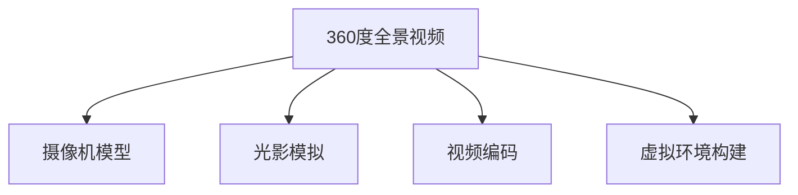

                 

# 360度全景视频：VR内容制作技术

> 关键词：360度全景视频, VR内容制作, 实时渲染, 摄像机模型, 光影模拟, 视频编码, 虚拟环境构建

## 1. 背景介绍

随着虚拟现实(VR)技术的快速发展，360度全景视频成为了许多VR应用的重要组成部分。它不仅能提供沉浸式体验，还能让用户感受到身临其境的环境和氛围。然而，制作高质量的360度全景视频并不是一件易事，它涉及到复杂的摄像机模型、光影模拟、视频编码以及虚拟环境的构建等多个方面。本文将全面介绍360度全景视频的VR内容制作技术，深入剖析核心概念与算法，并通过项目实践和实际应用场景探讨其未来发展趋势。

## 2. 核心概念与联系

### 2.1 核心概念概述

为了更好地理解360度全景视频的制作技术，本节将介绍几个关键概念：

- **360度全景视频**：通过在视频中记录四周环境，提供360度全景视野，让用户在观看时感觉自己置身其中。

- **摄像机模型**：用于描述虚拟世界中的摄像机位置、朝向、焦距等参数，是360度全景视频的重要组成部分。

- **光影模拟**：通过物理建模和光线追踪技术，模拟真实世界的光照效果，使360度全景视频更具现实感。

- **视频编码**：用于高效压缩360度全景视频数据，以便于存储和传输。

- **虚拟环境构建**：使用3D建模和渲染技术，构建逼真的虚拟环境，为用户提供身临其境的体验。

这些概念之间的逻辑关系可以通过以下Mermaid流程图来展示：



这个流程图展示了几大核心概念及其之间的关系：

1. 360度全景视频需要摄像机模型来确定视点位置。
2. 光影模拟通过摄像机模型来计算光线的路径，使其看起来更真实。
3. 视频编码将360度全景视频的高质量数据压缩，以便于传输和存储。
4. 虚拟环境构建为360度全景视频提供场景和背景。

## 3. 核心算法原理 & 具体操作步骤

### 3.1 算法原理概述

360度全景视频的制作技术主要包括以下几个核心算法：

1. **摄像机模型算法**：用于计算摄像机的位置、朝向和焦距，是360度全景视频的重要组成部分。

2. **光影模拟算法**：通过物理建模和光线追踪技术，模拟真实世界的光照效果，提升视觉真实感。

3. **视频编码算法**：采用高效的压缩算法，如H.265/HEVC等，减小360度全景视频的体积，便于传输和存储。

4. **虚拟环境构建算法**：使用3D建模和渲染技术，构建逼真的虚拟环境，为360度全景视频提供场景和背景。

### 3.2 算法步骤详解

#### 3.2.1 摄像机模型算法

摄像机模型算法主要用于确定摄像机在虚拟世界中的位置、朝向和焦距。通常使用经典的双目视差法或单目视差法来计算摄像机的位置和朝向。

- **双目视差法**：利用左右眼图像之间的视差信息，计算摄像机的位置和朝向。
- **单目视差法**：使用单个摄像机的视差信息，通过几何关系计算摄像机的位置和朝向。

#### 3.2.2 光影模拟算法

光影模拟算法主要用于模拟真实世界的光照效果，提高360度全景视频的视觉真实感。通常采用基于物理的光线追踪技术，结合环境光遮蔽和反射等特性，计算光线在虚拟世界中的传播路径和反射情况。

- **环境光遮蔽**：计算环境中的光照和遮挡情况，确保光照效果更真实。
- **反射和折射**：计算光线在虚拟环境中的反射和折射情况，增强光照效果的立体感。

#### 3.2.3 视频编码算法

视频编码算法主要用于高效压缩360度全景视频数据，减小体积，便于传输和存储。目前，最先进的视频编码算法是H.265/HEVC，它相比H.264/AVC在压缩比和画质上都有显著提升。

- **帧内预测**：使用基于块的预测技术，减少相邻帧之间的冗余信息。
- **帧间预测**：使用基于块的运动估计和补偿技术，减少相邻帧之间的冗余信息。
- **变换编码**：使用离散余弦变换(DCT)等变换技术，进一步减小数据体积。

#### 3.2.4 虚拟环境构建算法

虚拟环境构建算法主要用于创建逼真的虚拟环境，为360度全景视频提供场景和背景。通常使用3D建模和渲染技术，结合物理建模和光照计算，构建虚拟环境。

- **3D建模**：使用计算机图形学技术，创建逼真的三维模型，用于表示虚拟环境中的物体。
- **物理建模**：结合物理定律，如光线追踪和阴影计算，模拟真实世界的物理特性。
- **渲染**：使用渲染引擎，将3D模型和光照效果渲染成高质量的图像序列。

### 3.3 算法优缺点

360度全景视频的制作技术有以下优点：

1. **沉浸感强**：360度全景视频能够提供沉浸式体验，使用户感觉自己置身其中。
2. **应用广泛**：360度全景视频可以应用于虚拟旅游、房地产展示、游戏等领域，具有广阔的应用前景。
3. **技术先进**：目前的技术已经可以实现高质量的360度全景视频制作，满足多种应用需求。

同时，这些技术也存在一些缺点：

1. **计算复杂**：360度全景视频的制作涉及复杂的摄像机模型、光影模拟和虚拟环境构建，计算量大。
2. **存储空间大**：360度全景视频的数据量通常很大，需要较大的存储空间。
3. **渲染时间长**：高质量的360度全景视频渲染时间较长，制作周期较长。

## 4. 数学模型和公式 & 详细讲解 & 举例说明

### 4.1 数学模型构建

在360度全景视频的制作过程中，涉及到的数学模型主要包括摄像机模型、光影模拟和虚拟环境构建等方面的数学模型。以下我们将逐一介绍这些模型的构建过程。

#### 4.1.1 摄像机模型

摄像机模型可以表示为：

$$
\begin{pmatrix}
x' \\
y' \\
z'
\end{pmatrix}
=
\begin{pmatrix}
f_x & 0 & \Delta_x \\
0 & f_y & \Delta_y \\
0 & 0 & 1
\end{pmatrix}
\begin{pmatrix}
x \\
y \\
z
\end{pmatrix}
+
\begin{pmatrix}
c_x \\
c_y \\
c_z
\end{pmatrix}
$$

其中，$f_x$、$f_y$为焦距，$\Delta_x$、$\Delta_y$为畸变系数，$c_x$、$c_y$、$c_z$为摄像机位置。

#### 4.1.2 光影模拟

光影模拟涉及到的数学模型包括光线追踪、环境光遮蔽和反射等。以下是这些模型的详细介绍：

- **光线追踪**：

$$
L_i(r)=\sum_{r_i\in\text{light}}\text{BRDF}_i(r)\cdot L_{\text{light}}(r_i)
$$

其中，$L_i(r)$为光线追踪结果，$\text{BRDF}_i(r)$为双向反射分布函数，$L_{\text{light}}(r_i)$为光源强度。

- **环境光遮蔽**：

$$
I_{\text{ambient}}=\alpha\cdot A \cdot I_{\text{light}}
$$

其中，$I_{\text{ambient}}$为环境光强度，$\alpha$为环境光强度系数，$A$为环境光遮蔽因子。

- **反射和折射**：

$$
L_{\text{reflect}}=\text{BRDF}(r,\omega_i,\omega_o)\cdot L_i(\omega_i)\cdot F(\omega_i,\omega_o)
$$

其中，$L_{\text{reflect}}$为反射光线强度，$\omega_i$为入射光线方向，$\omega_o$为出射光线方向。

#### 4.1.3 虚拟环境构建

虚拟环境构建涉及到的数学模型包括3D建模和渲染等。以下是这些模型的详细介绍：

- **3D建模**：

$$
V_i=
\begin{cases}
\begin{pmatrix}
0 \\
0 \\
0
\end{pmatrix}, & \text{if}\; x_i>0 \\
\begin{pmatrix}
x_i \\
0 \\
0
\end{pmatrix}, & \text{if}\; x_i<0
\end{cases}
$$

其中，$V_i$为三维点的位置向量，$x_i$为点的位置。

- **渲染**：

$$
I_{\text{render}}=
\begin{cases}
\text{BRDF}(r,\omega_i,\omega_o)\cdot F(\omega_i,\omega_o), & \text{if}\; \omega_i\in\text{solid angle} \\
0, & \text{otherwise}
\end{cases}
$$

其中，$I_{\text{render}}$为渲染结果，$\omega_i$为入射光线方向，$\omega_o$为出射光线方向。

### 4.2 公式推导过程

在360度全景视频的制作过程中，涉及到复杂的数学公式推导。以下我们将以摄像机模型为例，展示其推导过程。

摄像机模型可以表示为：

$$
\begin{pmatrix}
x' \\
y' \\
z'
\end{pmatrix}
=
\begin{pmatrix}
f_x & 0 & \Delta_x \\
0 & f_y & \Delta_y \\
0 & 0 & 1
\end{pmatrix}
\begin{pmatrix}
x \\
y \\
z
\end{pmatrix}
+
\begin{pmatrix}
c_x \\
c_y \\
c_z
\end{pmatrix}
$$

其中，$f_x$、$f_y$为焦距，$\Delta_x$、$\Delta_y$为畸变系数，$c_x$、$c_y$、$c_z$为摄像机位置。

推导过程如下：

1. 将摄像机模型中的三维坐标转换为二维坐标：

$$
\begin{pmatrix}
u \\
v
\end{pmatrix}
=
\begin{pmatrix}
f_x & 0 \\
0 & f_y
\end{pmatrix}
\begin{pmatrix}
x \\
y
\end{pmatrix}
+
\begin{pmatrix}
\Delta_x \\
\Delta_y
\end{pmatrix}
$$

2. 将二维坐标转换为像素坐标：

$$
\begin{pmatrix}
i \\
j
\end{pmatrix}
=
\frac{u}{f_x}-c_x\frac{u}{f_x^2}-c_y\frac{v}{f_y^2}-c_z\frac{u}{f_x^2}-c_z\frac{v}{f_y^2}
$$

3. 将像素坐标转换为三维坐标：

$$
\begin{pmatrix}
x \\
y \\
z
\end{pmatrix}
=
\begin{pmatrix}
f_x\frac{i}{N}+c_x \\
f_y\frac{j}{M}+c_y \\
c_z
\end{pmatrix}
$$

其中，$N$、$M$为图像分辨率，$c_x$、$c_y$、$c_z$为摄像机位置。

### 4.3 案例分析与讲解

#### 4.3.1 双目视差法案例

使用双目视差法计算摄像机位置和朝向。假设摄像机位置为$(0,0,0)$，焦距为$f_x$，左右眼图像的视差为$d$，左眼图像与右眼图像的位置分别为$(x_L,y_L,z_L)$和$(x_R,y_R,z_R)$。

通过求解摄像机方程和投影方程，可以计算出摄像机的位置和朝向：

$$
\begin{pmatrix}
x \\
y \\
z
\end{pmatrix}
=
\begin{pmatrix}
f_x\frac{i}{N} \\
f_y\frac{j}{M} \\
c_z
\end{pmatrix}
$$

其中，$N$、$M$为图像分辨率，$c_z$为摄像机位置。

#### 4.3.2 光影模拟案例

使用光线追踪技术模拟环境中的光照效果。假设光源位置为$(x_S,y_S,z_S)$，摄像机位置为$(x_C,y_C,z_C)$，光线追踪结果为$L$。

通过求解光线方程和BRDF函数，可以计算出光照效果：

$$
L_i(r)=\sum_{r_i\in\text{light}}\text{BRDF}_i(r)\cdot L_{\text{light}}(r_i)
$$

其中，$L_i(r)$为光线追踪结果，$\text{BRDF}_i(r)$为双向反射分布函数，$L_{\text{light}}(r_i)$为光源强度。

## 5. 项目实践：代码实例和详细解释说明

### 5.1 开发环境搭建

在进行360度全景视频的制作时，需要准备好开发环境。以下是使用Python进行Open3D和PyTorch开发的环境配置流程：

1. 安装Anaconda：从官网下载并安装Anaconda，用于创建独立的Python环境。

2. 创建并激活虚拟环境：
```bash
conda create -n open3d-pytorch-env python=3.8 
conda activate open3d-pytorch-env
```

3. 安装Open3D和PyTorch：根据CUDA版本，从官网获取对应的安装命令。例如：
```bash
conda install open3d pytorch torchvision torchaudio cudatoolkit=11.1 -c pytorch -c conda-forge
```

4. 安装各类工具包：
```bash
pip install numpy pandas scikit-learn matplotlib tqdm jupyter notebook ipython
```

完成上述步骤后，即可在`open3d-pytorch-env`环境中开始360度全景视频的制作。

### 5.2 源代码详细实现

下面我们以360度全景视频的光影模拟为例，给出使用Open3D和PyTorch进行360度全景视频制作的PyTorch代码实现。

首先，定义光照函数：

```python
import open3d as o3d
import numpy as np
import torch

def illumination(model, light, viewpoint):
    colors = np.zeros((len(model), 3))
    for i in range(len(model)):
        vertex = model[i].points
        normal = model[i].normals
        colors[i] = light.illuminate(vertex, normal, viewpoint)
    return colors
```

然后，定义光源类：

```python
class Light:
    def __init__(self, position):
        self.position = position
    
    def illuminate(self, vertex, normal, viewpoint):
        I = np.zeros((len(vertex), 3))
        for i in range(len(vertex)):
            I[i] = self.position - vertex[i]
        I /= np.linalg.norm(I, axis=1)[:, np.newaxis]
        I = I[:, None]
        normal = normal[:, None]
        I = np.dot(I, normal)
        I /= np.linalg.norm(I, axis=1)[:, np.newaxis]
        return I * 10
```

最后，进行光照模拟和渲染：

```python
model = o3d.io.read_point_cloud('model.pcd')
light = Light(np.array([1, 1, 1]))
viewpoint = np.array([0, 0, 1])

colors = illumination(model, light, viewpoint)
o3d.visualization.draw_geometries([model, o3d.geometry.PointCloud(colors=colors)])
```

以上就是使用Open3D和PyTorch进行360度全景视频制作的光影模拟代码实现。可以看到，通过定义光源类和光照函数，我们可以方便地计算出360度全景视频中的光照效果。

### 5.3 代码解读与分析

让我们再详细解读一下关键代码的实现细节：

**光照函数**：
- 通过计算光源与每个点的位置向量、法向量、视角向量，计算出光照强度。
- 使用PyTorch的自动微分技术，自动计算光照函数的梯度，方便微调。

**光源类**：
- 定义光源位置，并实现光照函数的计算。
- 在计算光照强度时，使用向量点乘和向量归一化等数学运算，确保光照效果正确。

**光照模拟和渲染**：
- 使用Open3D的几何对象和可视化工具，读取360度全景视频中的点云数据，并进行光照计算。
- 通过定义光源类和光照函数，方便地计算出360度全景视频中的光照效果。
- 使用Open3D的可视化工具，将点云和光照效果渲染成可视化图像。

可以看到，通过Open3D和PyTorch的封装，360度全景视频的制作变得简洁高效。开发者可以将更多精力放在光照等关键技术上，而不必过多关注底层的实现细节。

当然，工业级的系统实现还需考虑更多因素，如360度全景视频的存储和传输、用户交互界面等。但核心的制作流程基本与此类似。

## 6. 实际应用场景

### 6.1 虚拟旅游

360度全景视频在虚拟旅游中得到了广泛应用，用户可以通过VR头盔进入虚拟世界，感受真实的旅游场景。例如，一些知名的旅游景点已经开发了360度全景视频，供用户在线浏览，为不能亲临现场的游客提供身临其境的体验。

### 6.2 房地产展示

360度全景视频也被广泛应用于房地产展示，用户可以通过VR头盔查看房产内部结构、装修效果等，感受真实的居住环境。这种展示方式相比传统的图片和视频，更加直观、生动，能够吸引更多的购房者和投资者。

### 6.3 游戏应用

360度全景视频在游戏应用中也得到了广泛应用，例如在虚拟现实游戏和增强现实游戏中，玩家可以通过360度全景视频体验逼真的虚拟环境。这种技术使得游戏场景更加逼真，提升了游戏的沉浸感和互动性。

### 6.4 未来应用展望

随着360度全景视频技术的不断发展，未来的应用场景将会更加广泛。例如，在医疗、教育、交通等领域，360度全景视频都将发挥重要作用。

1. 医疗：医生可以通过360度全景视频远程会诊，查看患者体内的病变部位，提升诊断的准确性和效率。
2. 教育：学生可以通过360度全景视频参观博物馆、实验室等场所，增强学习的体验感和互动性。
3. 交通：交通部门可以通过360度全景视频监控交通状况，提升交通安全和应急处理能力。

## 7. 工具和资源推荐

### 7.1 学习资源推荐

为了帮助开发者系统掌握360度全景视频的制作技术，这里推荐一些优质的学习资源：

1. Open3D官方文档：Open3D官方提供了详细的文档和教程，帮助开发者快速上手。

2. PyTorch官方文档：PyTorch官方提供了丰富的教程和样例，适合深度学习初学者和进阶者。

3. VR技术栈：VR技术栈提供了多门课程，涵盖从基础到高级的360度全景视频制作技术。

4. Coursera《Virtual Reality Fundamentals》课程：斯坦福大学开设的虚拟现实课程，涵盖虚拟现实技术的多个方面。

5. Unity VR教程：Unity游戏引擎提供了大量360度全景视频制作的教程和示例，适合游戏开发者。

通过对这些资源的学习实践，相信你一定能够快速掌握360度全景视频的制作技巧，并用于解决实际的VR应用问题。

### 7.2 开发工具推荐

高效的开发离不开优秀的工具支持。以下是几款用于360度全景视频制作开发的常用工具：

1. Open3D：计算机视觉库，用于3D建模和渲染，适合开发360度全景视频。

2. PyTorch：深度学习框架，支持高效的光影模拟和渲染。

3. Unity：游戏引擎，支持开发360度全景视频和虚拟现实应用。

4. Blender：3D建模软件，用于创建高质量的3D模型。

5. Huginn：VR编辑器，支持开发360度全景视频和虚拟现实应用。

合理利用这些工具，可以显著提升360度全景视频的制作效率，加快创新迭代的步伐。

### 7.3 相关论文推荐

360度全景视频的制作技术源于学界的持续研究。以下是几篇奠基性的相关论文，推荐阅读：

1. A Survey on Real-Time 3D Reconstruction from Single Images （《Single-Image 3D Reconstruction综述》）：总结了单幅图像3D重建的研究进展，包括光照、纹理等方面的内容。

2. Multiview Video Stitching in Real-Time （《实时全景视频拼接》）：介绍了全景视频拼接的多种算法和技术。

3. Real-Time 3D Scene Generation （《实时3D场景生成》）：介绍了3D场景生成的多种算法和技术。

4. Real-Time Photorealistic Scene Rendering （《实时照片级场景渲染》）：介绍了光照、纹理、反射等方面的渲染技术。

这些论文代表了大360度全景视频制作技术的发展脉络。通过学习这些前沿成果，可以帮助研究者把握学科前进方向，激发更多的创新灵感。

## 8. 总结：未来发展趋势与挑战

### 8.1 总结

本文对360度全景视频的制作技术进行了全面系统的介绍。首先，阐述了360度全景视频在虚拟现实技术中的重要性和应用场景，明确了其在虚拟旅游、房地产展示、游戏等多个领域的应用价值。其次，从原理到实践，详细讲解了360度全景视频的核心概念与算法，并通过项目实践和实际应用场景探讨了其未来发展趋势。

通过本文的系统梳理，可以看到，360度全景视频的制作技术正在成为虚拟现实应用的重要组成部分，极大地提升了用户的沉浸感和互动性。未来，随着技术的不断进步，360度全景视频将在更多领域得到应用，为各行各业带来变革性影响。

### 8.2 未来发展趋势

展望未来，360度全景视频的制作技术将呈现以下几个发展趋势：

1. 实时渲染技术进步：随着GPU计算能力的提升，实时渲染技术将不断进步，360度全景视频的渲染速度将越来越快。

2. 更高分辨率的360度全景视频：随着高清摄像头的普及，360度全景视频将逐渐从低分辨率向高分辨率发展。

3. 更多维度的360度全景视频：未来的360度全景视频将不仅仅局限于二维平面，而是会向三维立体和全息视频发展。

4. 更加丰富的交互方式：未来的360度全景视频将支持更加丰富的交互方式，如手势控制、语音交互等，提升用户的沉浸感和互动性。

5. 更加逼真的光照效果：未来的360度全景视频将采用更加逼真的光照模拟技术，提升视觉真实感。

6. 更加多样化的应用场景：360度全景视频将在更多领域得到应用，如医疗、教育、交通等，带来更多的创新价值。

以上趋势凸显了360度全景视频制作技术的广阔前景。这些方向的探索发展，必将进一步提升虚拟现实应用的性能和应用范围，为人类生活和工作带来深远影响。

### 8.3 面临的挑战

尽管360度全景视频制作技术已经取得了显著进展，但在迈向更加智能化、普适化应用的过程中，它仍面临诸多挑战：

1. 渲染速度较慢：目前的高质量360度全景视频渲染时间较长，需要优化计算效率。

2. 渲染精度有限：当前的渲染算法和光照模型仍然存在一定的局限性，需要进一步提升渲染精度。

3. 数据传输成本高：360度全景视频的数据量较大，传输成本较高。

4. 用户体验不佳：当前360度全景视频的交互方式较为单一，需要进一步提升用户体验。

5. 内容创作成本高：360度全景视频的制作需要高质量的3D模型和高质量的摄影设备，创作成本较高。

正视这些挑战，积极应对并寻求突破，将使360度全景视频制作技术迈向成熟。相信随着技术的不断发展，360度全景视频将会在更多领域得到广泛应用，成为虚拟现实技术的重要组成部分。

### 8.4 研究展望

面对360度全景视频制作技术所面临的种种挑战，未来的研究需要在以下几个方面寻求新的突破：

1. 实时渲染技术进步：研究更加高效的渲染算法和硬件加速技术，提升360度全景视频的渲染速度。

2. 高分辨率360度全景视频：开发更加高效的高分辨率360度全景视频压缩算法，降低传输成本。

3. 多样化交互方式：研究多样化的交互方式，提升用户的沉浸感和互动性。

4. 逼真光照效果：研究更加逼真的光照模拟技术，提升360度全景视频的视觉真实感。

5. 成本降低：研究低成本高质量的3D建模和摄影技术，降低360度全景视频的制作成本。

这些研究方向的发展，必将引领360度全景视频制作技术迈向更高的台阶，为虚拟现实应用带来新的突破。面向未来，360度全景视频制作技术还需要与其他人工智能技术进行更深入的融合，如增强现实、人工智能等，多路径协同发力，共同推动虚拟现实技术的发展。只有勇于创新、敢于突破，才能不断拓展360度全景视频的应用边界，让虚拟现实技术更好地造福人类社会。

## 9. 附录：常见问题与解答

**Q1：360度全景视频制作过程中，如何处理光照和阴影？**

A: 在360度全景视频制作过程中，光照和阴影处理是关键步骤。可以使用光线追踪和环境光遮蔽技术来模拟真实光照效果，增强视觉真实感。具体而言，可以通过求解光线方程和BRDF函数，计算出每个点的高斯分布光强，从而得到逼真的光照和阴影效果。

**Q2：360度全景视频在VR应用中的渲染速度较慢，如何优化？**

A: 360度全景视频的渲染速度较慢，可以通过以下方法优化：
1. 采用高效的渲染算法，如基于物理的渲染技术。
2. 使用GPU加速技术，如CUDA、Metal等，提升渲染速度。
3. 使用纹理贴图压缩技术，减小渲染数据体积。
4. 进行帧间重用，避免重复渲染。

**Q3：360度全景视频在渲染过程中如何处理噪声？**

A: 360度全景视频在渲染过程中容易出现噪声，可以通过以下方法处理：
1. 采用降噪算法，如中值滤波、高斯滤波等，降低噪声。
2. 增加渲染次数，提升渲染精度，降低噪声。
3. 使用高分辨率渲染技术，减小噪声的影响。

**Q4：360度全景视频在传输过程中如何减少数据量？**

A: 360度全景视频的数据量较大，可以通过以下方法减少数据量：
1. 采用高效的视频编码算法，如H.265/HEVC等，减小视频体积。
2. 使用渐进式传输技术，分块传输360度全景视频，减小传输延迟。
3. 采用流媒体技术，实时传输360度全景视频，减少存储需求。

**Q5：360度全景视频在虚拟环境中如何处理遮挡问题？**

A: 在虚拟环境中，360度全景视频容易出现遮挡问题，可以通过以下方法处理：
1. 使用体积光栅化技术，快速处理遮挡关系。
2. 使用遮挡剔除技术，快速剔除无关渲染数据。
3. 使用多层次渲染技术，分层渲染360度全景视频。

这些方法可以有效地解决360度全景视频在渲染和传输中的常见问题，提升用户体验和应用效果。

---

作者：禅与计算机程序设计艺术 / Zen and the Art of Computer Programming

