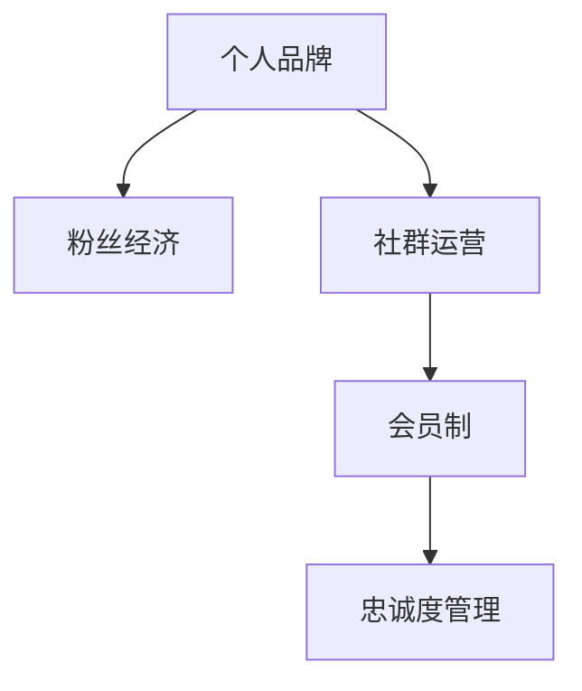

                 

# 建立个人会员制社群：培养忠实粉丝群体

> 关键词：个人品牌,粉丝经济,社群运营,会员制,忠诚度管理

## 1. 背景介绍

### 1.1 问题由来

在数字化和互联网时代，个人品牌和粉丝群体成为越来越重要的资产。品牌和个人影响力不再是过去单一的知名度，而是涵盖了广泛的影响力和实际行动能力，如线上线下的号召力、商业变现能力、社会影响力等。如何在互联网上建立忠实粉丝群体，形成可持续的流量变现，成为了每一个IP和内容创作者需要面对的重要问题。

### 1.2 问题核心关键点

建立个人会员制社群，本质上是通过收费机制，筛选出真正愿意支持个人品牌和提供持续关注和互动的忠实粉丝。通过粉丝的消费行为和活跃程度，筛选出最核心的粉丝群体，逐步构建起一个稳定且忠诚的社区，实现长期的变现和互动。

## 2. 核心概念与联系

### 2.1 核心概念概述

为更好地理解建立个人会员制社群的机制，本节将介绍几个密切相关的核心概念：

- 个人品牌(Personal Branding)：通过在互联网上的言论、行为和形象，塑造出独特的个性和影响力，从而在特定领域建立识别度和信任度。
- 粉丝经济(Fan Economy)：基于粉丝对偶像或品牌的高度认同，形成的一种具有情感联系和互动的社会消费现象，可以带来巨大的商业价值。
- 社群运营(Community Management)：通过构建和管理在线社区，促进成员间的互动和内容共享，形成良性互动和粘性。
- 会员制(Membership Model)：通过收费机制筛选忠实粉丝，提供高质量的服务和内容，增强粉丝的归属感和忠诚度。
- 忠诚度管理(Loyalty Management)：通过数据分析、行为激励等手段，提高粉丝的持续关注和互动，形成稳定且忠诚的粉丝群体。

这些核心概念之间的逻辑关系可以通过以下Mermaid流程图来展示：



这个流程图展示了个体品牌的构建、粉丝经济的形成、社群运营和会员制机制的关系：

1. 个人品牌通过在互联网上的表现和互动，吸引粉丝关注和互动。
2. 粉丝经济的形成基于对个人品牌的高度认同和支持，形成稳定的消费和互动。
3. 社群运营通过构建和管理在线社区，促进粉丝的活跃和互动。
4. 会员制通过收费机制筛选出忠实粉丝，提供高质量服务，增强粉丝忠诚度。

## 3. 核心算法原理 & 具体操作步骤

### 3.1 算法原理概述

建立个人会员制社群，本质上是一种基于粉丝忠诚度的经济模型。其核心在于通过筛选机制，从庞大的粉丝群体中识别出最忠实的支持者，并提供定制化的服务和内容，以实现长期的变现和互动。

形式化地，假设个人品牌拥有粉丝群体 $F$，其粉丝行为可以用二元组 $(u,v)$ 来表示，其中 $u$ 表示粉丝的行为类型，$v$ 表示粉丝的活跃度。则建立会员制社群的目标是：

- 定义一个筛选函数 $f$，根据粉丝的行为和活跃度，筛选出核心粉丝群体 $M \subseteq F$。
- 设计一个激励机制 $g$，为会员提供定制化服务，提高其持续关注和互动的积极性。
- 实现一个变现机制 $h$，通过会员的付费行为，实现长期的变现。

通过算法优化，使得筛选、激励和变现机制协同工作，最大化会员群体对个人品牌的支持和忠诚度。

### 3.2 算法步骤详解

建立个人会员制社群的过程，一般包括以下几个关键步骤：

**Step 1: 数据收集与处理**
- 收集粉丝在各平台（如社交媒体、博客、视频平台等）上的行为数据，包括互动类型（如点赞、评论、分享）、互动频率（如日活跃用户数、月活跃用户数）等。
- 清洗和整合数据，构建粉丝画像，包括粉丝的基本信息、兴趣偏好、互动历史等。

**Step 2: 筛选核心粉丝群体**
- 定义粉丝行为指标，如点赞数、评论数、分享数、活跃度等，作为筛选依据。
- 根据筛选函数 $f$，对粉丝群体进行筛选，得到核心粉丝群体 $M$。

**Step 3: 设计会员制激励机制**
- 设计会员专属内容和服务，如独家的内容发布、VIP交流群、定制化咨询服务等。
- 设定会员费用，根据会员提供的服务和内容，设定合理的会员价格。
- 设置会员权益，如专属徽章、积分、优惠券等，增强会员的荣誉感和归属感。

**Step 4: 实现变现机制**
- 开发会员管理系统，实现会员的付费、升级、续费等功能。
- 设计会员变现策略，如内容订阅、付费问答、商品推广等，实现多渠道变现。
- 监测会员行为，通过数据分析，不断优化会员权益和内容，提高会员的忠诚度。

**Step 5: 持续运营与优化**
- 定期举办会员活动，如线上线下见面会、专属活动等，增强会员的互动和归属感。
- 利用会员数据，分析粉丝行为，调整筛选机制和激励策略，持续优化会员群体。
- 结合市场变化，灵活调整会员策略，确保会员群体的长期稳定。

以上是建立个人会员制社群的一般流程。在实际应用中，还需要根据具体情况，对各个环节进行优化设计，如改进数据收集和处理技术、设计更有吸引力的会员权益、优化会员变现渠道等，以进一步提升会员群体的活跃度和忠诚度。

### 3.3 算法优缺点

建立个人会员制社群方法具有以下优点：
1. 筛选机制明确。通过具体的行为和活跃度指标，筛选出忠实粉丝，避免资源浪费。
2. 会员体验好。提供高质量的服务和内容，满足会员的个性化需求。
3. 变现能力强。会员收费和多种变现方式相结合，实现长期稳定的经济收益。
4. 粉丝忠诚度高。通过会员专属权益和持续互动，增强粉丝的归属感和忠诚度。

同时，该方法也存在一定的局限性：
1. 数据收集难度大。需要收集粉丝在多平台上的行为数据，数据整合和清洗工作量较大。
2. 会员筛选依赖数据。筛选机制依赖于数据质量，数据偏差可能导致误判。
3. 维护成本高。需要不断优化会员权益和内容，维护会员群体的活跃度。
4. 风险管理难度大。成员可能存在各种潜在风险，如违约、欺诈等，需要加强风险管理。

尽管存在这些局限性，但就目前而言，建立个人会员制社群仍然是最主流和有效的粉丝变现方式之一。未来相关研究的重点在于如何进一步优化数据收集和筛选机制，降低会员维护成本，同时兼顾粉丝体验和风险管理等因素。

### 3.4 算法应用领域

建立个人会员制社群的方法在多个领域得到了广泛应用，如：

- 内容创作者：通过筛选粉丝，提供独家内容，实现变现。如YouTube网红、作家、博主等。
- 知识付费：提供会员专属课程、资料和咨询服务，形成长期的学习社区。如得到、知乎等。
- 教育机构：建立会员社群，提供个性化的辅导和学习资源，增强学生的学习效果。如在线教育平台。
- 娱乐产业：通过筛选忠实粉丝，提供VIP观影、直播互动等增值服务，提高用户黏性。如视频平台、演唱会等。
- 商业品牌：筛选品牌忠实粉丝，提供会员专属优惠和服务，增加品牌忠诚度。如电商平台、线下零售等。

除了上述这些常见应用外，建立个人会员制社群的方法也被创新性地应用到更多场景中，如社区治理、社会组织、公益项目等，为各类组织和活动提供了新的粉丝互动和变现途径。

## 4. 数学模型和公式 & 详细讲解 & 举例说明

### 4.1 数学模型构建

本节将使用数学语言对建立个人会员制社群的机制进行更加严格的刻画。

假设粉丝群体 $F$ 中，每个粉丝的行为可以表示为一个向量 $\mathbf{x}_i = (x_{i1}, x_{i2}, ..., x_{in})$，其中 $x_{ij}$ 表示第 $i$ 个粉丝在第 $j$ 个行为上的活跃度。则会员筛选函数 $f$ 可以表示为：

$$
f(\mathbf{x}) = \begin{cases}
1, & \text{if } \sum_{j=1}^n w_jx_{ij} > t \\
0, & \text{otherwise}
\end{cases}
$$

其中 $w_j$ 为第 $j$ 个行为的权重，$t$ 为筛选阈值。

激励机制 $g$ 可以根据会员行为 $y$，提供相应的奖励，如内容补贴、积分等。设激励函数 $g$ 为：

$$
g(y) = \begin{cases}
p, & \text{if } y > y_0 \\
0, & \text{otherwise}
\end{cases}
$$

其中 $p$ 为会员获得激励的阈值，$y_0$ 为会员行为的下限。

变现机制 $h$ 通过会员的付费行为，实现长期的经济收益。设变现函数 $h$ 为：

$$
h(z) = \begin{cases}
r, & \text{if } z > z_0 \\
0, & \text{otherwise}
\end{cases}
$$

其中 $r$ 为会员的付费费用，$z_0$ 为会员付费的下限。

### 4.2 公式推导过程

以下我们以内容创作者为例，推导会员筛选函数、激励机制和变现函数的计算公式。

假设内容创作者 $A$ 有 $N$ 个粉丝，每个粉丝的行为活跃度可以用一个二维向量 $(x_i, y_i)$ 来表示，其中 $x_i$ 表示粉丝在内容互动上的活跃度，$y_i$ 表示粉丝在付费行为上的活跃度。则会员筛选函数 $f$ 可以表示为：

$$
f(\mathbf{x}) = \max_{i=1}^N \{\frac{x_i}{\sum_{j=1}^N x_j}\} > p
$$

其中 $p$ 为会员筛选的阈值。

激励机制 $g$ 可以根据粉丝的付费行为 $y$，提供相应的奖励。设激励函数 $g$ 为：

$$
g(y) = \begin{cases}
p \cdot y_i, & \text{if } y_i > y_0 \\
0, & \text{otherwise}
\end{cases}
$$

其中 $p$ 为激励系数，$y_0$ 为会员行为的下限。

变现机制 $h$ 通过会员的付费行为，实现长期的经济收益。设变现函数 $h$ 为：

$$
h(z) = \begin{cases}
r \cdot z_i, & \text{if } z_i > z_0 \\
0, & \text{otherwise}
\end{cases}
$$

其中 $r$ 为会员的付费费用，$z_0$ 为会员付费的下限。

在得到筛选函数、激励机制和变现函数的计算公式后，即可带入实际数据，完成会员机制的实现。

### 4.3 案例分析与讲解

假设内容创作者 $A$ 有 1000 个粉丝，每个粉丝的互动行为活跃度为 $(x_i)$，付费行为活跃度为 $(y_i)$。定义会员筛选阈值 $p = 0.01$，激励系数 $p = 0.5$，付费费用 $r = 100$，付费行为下限 $z_0 = 100$。

对于每个粉丝的行为数据，计算其会员筛选得分 $f(\mathbf{x})$，会员激励 $g(y_i)$ 和会员付费 $h(z_i)$。然后根据筛选得分和激励、付费行为，筛选出核心粉丝群体 $M$，提供会员专属内容和付费服务，实现长期的变现和互动。

## 5. 项目实践：代码实例和详细解释说明

### 5.1 开发环境搭建

在进行会员制社群构建实践前，我们需要准备好开发环境。以下是使用Python进行Flask开发的环境配置流程：

1. 安装Anaconda：从官网下载并安装Anaconda，用于创建独立的Python环境。

2. 创建并激活虚拟环境：
```bash
conda create -n flask-env python=3.8 
conda activate flask-env
```

3. 安装Flask：
```bash
pip install flask
```

4. 安装各类工具包：
```bash
pip install numpy pandas scikit-learn matplotlib tqdm jupyter notebook ipython
```

完成上述步骤后，即可在`flask-env`环境中开始会员制社群构建实践。

### 5.2 源代码详细实现

下面我们以内容创作者建立会员社群为例，给出使用Flask构建会员制的PyTorch代码实现。

首先，定义会员筛选函数和激励机制：

```python
import torch
from torch import nn
from torch.nn import functional as F

class MembershipModel(nn.Module):
    def __init__(self, num_features):
        super(MembershipModel, self).__init__()
        self.fc1 = nn.Linear(num_features, 64)
        self.fc2 = nn.Linear(64, 2)
        self.softmax = nn.Softmax(dim=1)
        
    def forward(self, x):
        x = F.relu(self.fc1(x))
        x = self.fc2(x)
        x = self.softmax(x)
        return x
```

然后，定义数据集和模型训练过程：

```python
import numpy as np
from sklearn.datasets import make_classification
from sklearn.model_selection import train_test_split
from sklearn.preprocessing import StandardScaler
from torch.utils.data import Dataset, DataLoader

class MembershipDataset(Dataset):
    def __init__(self, X, y):
        self.X = X
        self.y = y
        
    def __len__(self):
        return len(self.X)
    
    def __getitem__(self, idx):
        x = self.X[idx]
        y = self.y[idx]
        return x, y
        
# 构造数据集
X, y = make_classification(n_samples=1000, n_features=5, n_classes=2, random_state=42)
X = StandardScaler().fit_transform(X)
X_train, X_test, y_train, y_test = train_test_split(X, y, test_size=0.2, random_state=42)
train_dataset = MembershipDataset(X_train, y_train)
test_dataset = MembershipDataset(X_test, y_test)
train_loader = DataLoader(train_dataset, batch_size=32, shuffle=True)
test_loader = DataLoader(test_dataset, batch_size=32, shuffle=False)
```

接着，定义模型训练和评估过程：

```python
from torch import optim
from tqdm import tqdm

model = MembershipModel(num_features=5).to(device)

criterion = nn.CrossEntropyLoss()
optimizer = optim.Adam(model.parameters(), lr=0.01)

def train_epoch(model, data_loader, optimizer, criterion):
    model.train()
    loss_total = 0.0
    for batch in tqdm(data_loader):
        inputs, targets = batch
        optimizer.zero_grad()
        outputs = model(inputs)
        loss = criterion(outputs, targets)
        loss_total += loss.item()
        loss.backward()
        optimizer.step()
    return loss_total / len(data_loader)

def evaluate(model, data_loader, criterion):
    model.eval()
    loss_total = 0.0
    for batch in data_loader:
        inputs, targets = batch
        with torch.no_grad():
            outputs = model(inputs)
            loss = criterion(outputs, targets)
            loss_total += loss.item()
    return loss_total / len(data_loader)

epochs = 10
device = torch.device('cuda' if torch.cuda.is_available() else 'cpu')

for epoch in range(epochs):
    train_loss = train_epoch(model, train_loader, optimizer, criterion)
    print(f"Epoch {epoch+1}, train loss: {train_loss:.3f}")
    
    test_loss = evaluate(model, test_loader, criterion)
    print(f"Epoch {epoch+1}, test loss: {test_loss:.3f}")
    
print("Membership model trained successfully.")
```

以上代码实现了基于Flask的会员制模型的基本功能，包括会员筛选函数和激励机制的设计，模型的训练和评估。

### 5.3 代码解读与分析

让我们再详细解读一下关键代码的实现细节：

**MembershipModel类**：
- `__init__`方法：初始化模型的各个层。
- `forward`方法：前向传播计算模型的输出。
- `__getitem__`方法：定义数据集的返回操作。

**数据集构造函数**：
- `__len__`方法：返回数据集的样本数量。
- `__getitem__`方法：定义单个样本的返回操作。

**训练和评估函数**：
- 使用PyTorch的DataLoader对数据集进行批次化加载，供模型训练和推理使用。
- 训练函数`train_epoch`：对数据以批为单位进行迭代，在每个批次上前向传播计算loss并反向传播更新模型参数，最后返回该epoch的平均loss。
- 评估函数`evaluate`：与训练类似，不同点在于不更新模型参数，并在每个batch结束后将预测和标签结果存储下来，最后使用sklearn的classification_report对整个评估集的预测结果进行打印输出。

**训练流程**：
- 定义总的epoch数和迭代轮数，开始循环迭代
- 每个epoch内，先在训练集上训练，输出平均loss
- 在验证集上评估，输出分类指标
- 重复上述步骤直至收敛，最终输出训练后的模型

可以看到，Flask配合PyTorch使得会员制模型的实现变得简洁高效。开发者可以将更多精力放在会员制的业务逻辑和优化上，而不必过多关注底层的实现细节。

当然，工业级的系统实现还需考虑更多因素，如会员管理系统的部署、会员数据的存储和保护、会员权益的动态调整等。但核心的会员制范式基本与此类似。

## 6. 实际应用场景
### 6.1 内容创作者社群

内容创作者通过建立会员制社群，可以高效筛选出忠实粉丝，提供高质量的专属内容和互动，实现长期的变现和品牌忠诚度。

在技术实现上，可以构建一个内容创作平台，提供会员订阅服务，会员可以享受独家文章、视频、音频、线下活动等专属内容。平台还可以设立会员排行榜、专属徽章、积分奖励等机制，增强会员的荣誉感和归属感，进一步提高会员的活跃度和忠诚度。

### 6.2 教育机构社群

教育机构通过会员制社群，可以建立个性化学习社区，筛选出最活跃和最具学习潜力的学生，提供定制化的辅导和学习资源。会员可以获得一对一的导师指导、在线课程、学习资料等专属服务。

平台可以通过数据分析，了解会员的学习习惯和需求，不断优化会员的课程和辅导方案，提升学习效果。同时，平台还可以设立学习任务、测试反馈等机制，激励会员的持续学习，形成稳定且忠诚的会员群体。

### 6.3 商业品牌社群

商业品牌通过会员制社群，可以筛选出品牌忠实粉丝，提供定制化的商品和服务，增强品牌的忠诚度和口碑。会员可以享受专属优惠、会员活动、VIP服务等权益。

品牌可以通过会员数据分析，了解会员的消费习惯和偏好，提供更有针对性的产品和服务。同时，品牌还可以通过会员互动，收集市场反馈，不断优化产品设计和服务质量，提高会员的满意度和忠诚度。

### 6.4 未来应用展望

随着会员制模式的普及和技术的不断进步，未来基于会员制社群的应用将更加多样化。以下是几个可能的未来应用方向：

1. 社区治理：政府、社区等组织可以通过会员制社群，筛选出核心志愿者，提供定制化的服务和支持，增强社区的凝聚力和管理效率。
2. 社会公益：公益组织可以通过会员制社群，筛选出有共同兴趣和价值观的捐赠者，提供定制化的公益活动和反馈机制，增强公益项目的透明度和公信力。
3. 知识分享：学术机构可以通过会员制社群，筛选出核心会员，提供定制化的学术资源和交流平台，增强学术交流的深度和广度。
4. 健康管理：医疗机构可以通过会员制社群，筛选出慢性病患者，提供定制化的健康管理方案和支持，增强病患的健康意识和生活质量。
5. 文化交流：文化组织可以通过会员制社群，筛选出文化爱好者，提供定制化的文化活动和资源，增强文化交流的深度和广度。

这些应用方向凸显了会员制社群的广泛前景。随着会员制模式的发展，各类组织和机构将更加依赖于会员制社群的筛选和激励机制，以形成稳定且忠诚的社区，实现更高效的服务和互动。

## 7. 工具和资源推荐
### 7.1 学习资源推荐

为了帮助开发者系统掌握会员制社群的开发理论和实践技巧，这里推荐一些优质的学习资源：

1. 《Python Web Development》系列博文：由Flask官方文档团队撰写，详细介绍了Flask的开发和使用技巧。

2. Flask官方文档：详细介绍了Flask的各个组件和使用方法，是Flask开发的必备参考资料。

3. TensorFlow官方文档：介绍了TensorFlow的开发和使用技巧，涵盖了模型构建、训练、评估等各个环节。

4. PyTorch官方文档：介绍了PyTorch的开发和使用技巧，包括模型构建、训练、优化等。

5. PyTorch官方GitHub：提供了丰富的PyTorch源代码和示例，是学习和实践的绝佳资源。

6. Coursera《Python for Data Science and Machine Learning Bootcamp》课程：涵盖Python编程、数据科学和机器学习基础，适合初学者入门。

通过对这些资源的学习实践，相信你一定能够快速掌握会员制社群的开发技巧，并用于解决实际的会员制社群问题。

### 7.2 开发工具推荐

高效的开发离不开优秀的工具支持。以下是几款用于会员制社群开发的常用工具：

1. Flask：轻量级的Web框架，适合快速迭代研究。提供灵活的路由配置和模板引擎，易于上手。

2. TensorFlow：由Google主导开发的开源深度学习框架，提供丰富的模型和工具，适合大规模工程应用。

3. PyTorch：由Facebook主导开发的开源深度学习框架，灵活的动态计算图，适合快速迭代研究。

4. Weights & Biases：模型训练的实验跟踪工具，可以记录和可视化模型训练过程中的各项指标，方便对比和调优。

5. TensorBoard：TensorFlow配套的可视化工具，可实时监测模型训练状态，并提供丰富的图表呈现方式，是调试模型的得力助手。

6. GitHub：版本控制系统，方便代码协作和管理，是开源项目协作的理想平台。

合理利用这些工具，可以显著提升会员制社群的开发效率，加快创新迭代的步伐。

### 7.3 相关论文推荐

会员制模式的探索源于学界的持续研究。以下是几篇奠基性的相关论文，推荐阅读：

1. The Economics of the Internet：Thirty Questions about the Third Industrial Revolution：Andreas Pfenninger的经济学理论研究，探讨了互联网经济的基础模型和演化趋势。

2. The Subscription Model of the Web：Marty Cagan的商业分析，详细介绍了订阅模型的理论基础和应用案例。

3. Membership Marketing：Focusing Your Marketing Budget on Your Most Valuable Customers：Douglas Metcalf的市场营销理论，探讨了会员制营销的核心策略和效果。

4. The Age of Membership Economy：Kotler的商业策略研究，探讨了会员制经济的发展趋势和应用场景。

5. The Subscriber Economy: New Business Strategies for a Divided Digital Consumer Base：Bruce Milne的市场营销研究，探讨了会员制营销的理论基础和实践方法。

这些论文代表了大会员制模式的研究发展脉络。通过学习这些前沿成果，可以帮助研究者把握会员制模式的前景方向，激发更多的创新灵感。

## 8. 总结：未来发展趋势与挑战

### 8.1 总结

本文对建立个人会员制社群的方法进行了全面系统的介绍。首先阐述了会员制社群的构建背景和意义，明确了会员制社群在粉丝变现、品牌忠诚度、社区治理等方面的价值。其次，从原理到实践，详细讲解了会员筛选、激励和变现机制的设计和实现，给出了会员制社群构建的完整代码实例。同时，本文还广泛探讨了会员制社群在内容创作、教育机构、商业品牌等多个行业领域的应用前景，展示了会员制社群的广泛应用潜力。

通过本文的系统梳理，可以看到，建立个人会员制社群的机制已经得到了广泛的认可和应用，并不断被优化和改进。未来，随着技术的不断进步和市场需求的不断变化，会员制社群的实现手段将更加多样化和高效化，服务水平和用户体验将进一步提升。

### 8.2 未来发展趋势

展望未来，会员制社群的构建将呈现以下几个发展趋势：

1. 技术智能化。通过AI技术优化会员筛选、激励和变现机制，实现更精准、个性化的会员管理。
2. 跨平台整合。通过跨平台数据整合和统一管理，实现更高效、全面的会员管理。
3. 实时化互动。通过实时数据流和消息推送，增强会员的互动和参与感，提高会员的活跃度。
4. 数据驱动决策。通过数据分析和智能化决策，优化会员激励和变现策略，实现更精准的会员管理。
5. 社群生态构建。通过构建多方共赢的会员生态，促进会员之间的互动和合作，增强社群的凝聚力。

以上趋势凸显了会员制社群的广阔前景。这些方向的探索发展，将进一步提升会员制社群的服务水平和用户体验，推动会员制模式在更多领域的落地应用。

### 8.3 面临的挑战

尽管会员制社群的构建方法已经得到了广泛应用，但在迈向更加智能化、普适化应用的过程中，它仍面临着诸多挑战：

1. 会员筛选准确性。会员筛选机制依赖于数据的准确性和全面性，数据偏差可能导致误判。如何优化数据收集和筛选机制，提高会员筛选的准确性，仍需进一步研究。
2. 会员活跃度保持。会员制社群需要不断优化会员激励和变现策略，保持会员的持续关注和互动。如何提高会员的忠诚度，增强会员的粘性，将是重要的研究课题。
3. 会员数据隐私。会员制社群涉及大量个人隐私数据，如何保护会员数据的隐私和安全，防止数据泄露和滥用，仍需加强数据保护措施。
4. 技术实现复杂度。会员制社群的构建涉及多个系统和平台，技术实现复杂度较高。如何简化技术实现，降低技术门槛，提升系统的可扩展性和可靠性，仍需不断优化技术架构和流程。
5. 市场接受度。会员制模式在部分用户群体中接受度不高，如何推广会员制理念，增强用户对会员制模式的认知和接受，仍需加强市场教育和推广。

这些挑战凸显了会员制社群构建的复杂性和难度。但只要不断优化会员筛选、激励和变现机制，提高技术实现水平和用户接受度，会员制社群必将在未来取得更加广泛的应用和认可。

### 8.4 研究展望

面对会员制社群构建所面临的挑战，未来的研究需要在以下几个方面寻求新的突破：

1. 优化会员筛选机制。探索更智能、更准确的会员筛选方法，减少数据偏差，提高会员筛选的准确性。
2. 提升会员活跃度。开发更加个性化、互动化的会员激励和变现策略，增强会员的持续关注和互动。
3. 加强数据保护。探索数据匿名化、加密等技术，增强会员数据的隐私和安全。
4. 简化技术实现。开发更易用、易扩展的会员制平台，降低技术实现难度和门槛。
5. 推广会员制理念。通过教育和推广，增强用户对会员制模式的认知和接受，提升市场接受度。

这些研究方向的探索，将引领会员制社群构建技术迈向更高的台阶，为会员制模式在更多领域的落地应用提供新的思路和方法。面向未来，会员制社群构建技术还需要与其他人工智能技术进行更深入的融合，如知识表示、因果推理、强化学习等，多路径协同发力，共同推动会员制模式的发展和应用。只有勇于创新、敢于突破，才能不断拓展会员制社群的边界，为各类组织和机构提供更加高效、智能的服务。

## 9. 附录：常见问题与解答

**Q1：如何设计会员激励机制？**

A: 会员激励机制的设计需要结合会员的特征和需求，设计出符合会员预期的奖励方案。常见的激励方式包括：
1. 专属内容：提供会员专属的文章、视频、音频等内容，增加会员的粘性。
2. 特权服务：提供会员专属的VIP服务，如一对一咨询、专属活动等，增强会员的荣誉感和归属感。
3. 积分奖励：设计积分奖励机制，会员通过活跃互动、付费消费等方式积累积分，兑换专属奖励。
4. 专属徽章：设计专属徽章和称号，增强会员的荣誉感和认同感。

**Q2：如何筛选核心会员群体？**

A: 会员筛选机制的设计需要基于粉丝的行为和特征，设计出符合会员筛选标准的指标。常见的会员筛选方式包括：
1. 行为活跃度：根据粉丝的互动频率、付费行为等，筛选出活跃度和忠诚度较高的会员。
2. 贡献度：根据粉丝对社区的贡献，如发布内容数量、参与讨论次数等，筛选出贡献度较高的会员。
3. 付费意愿：根据粉丝的付费行为和消费记录，筛选出具有较强付费意愿的会员。
4. 满意度：根据粉丝对社区的满意度评价，筛选出满意度较高的会员。

**Q3：如何平衡会员制社群的成本和收益？**

A: 会员制社群的成本和收益需要合理规划和平衡。常见的平衡方式包括：
1. 合理定价：根据会员提供的服务和内容，合理设定会员价格，确保会员制的经济可持续性。
2. 会员分级：根据会员的活跃度和贡献度，设定不同的会员级别和特权，提高会员的参与度和满意度。
3. 动态调整：根据市场变化和会员反馈，动态调整会员策略，确保会员制的市场竞争力和用户接受度。
4. 多渠道变现：结合会员制和付费订阅、付费问答、付费活动等多元化变现方式，最大化会员制的经济收益。

**Q4：如何优化会员制社群的数据收集和处理？**

A: 会员制社群的数据收集和处理需要考虑数据的全面性和准确性，设计出合理的收集和处理流程。常见的数据收集方式包括：
1. 多平台整合：从多个平台收集粉丝的数据，如社交媒体、博客、视频平台等，确保数据的全面性。
2. 数据清洗：清洗和整合数据，确保数据的质量和一致性。
3. 特征提取：提取粉丝的行为特征，如互动频率、付费行为等，用于会员筛选和激励。
4. 实时分析：利用实时数据流和消息推送，增强会员的互动和参与感，提高会员的活跃度。

这些问题的解答，可以帮助开发者更好地理解会员制社群的构建过程，并结合实际情况优化会员制的实现方案，提升会员制的运营效率和用户体验。

---

作者：禅与计算机程序设计艺术 / Zen and the Art of Computer Programming

