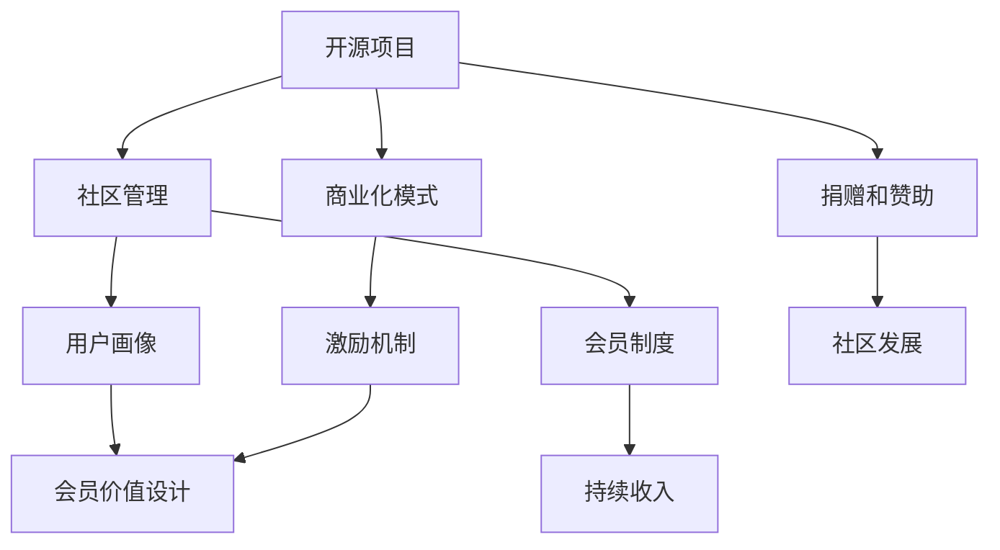

                 

# 建立开源项目的会员制度：创造持续收入

> 关键词：开源项目, 会员制度, 持续收入, 社区管理, 用户画像, 价值提升, 激励机制

## 1. 背景介绍

### 1.1 问题由来
随着开源项目和社区的快速发展和成熟，越来越多的项目开始寻求可持续的收入来源。传统的广告、赞助和捐助模式已难以满足项目长期的运营和发展需求。特别是在数据科学、人工智能等前沿领域，对高性能、开源软件的依赖日益加深，对开源社区的商业价值需求也在日益增长。

然而，如何将开源社区的商业价值最大化，建立一个既能保持社区健康发展，又能带来持续收入的会员制度，成为了开源项目管理者面临的一个重要挑战。本博客将深入探讨这一问题，并提出一些实践中的有效策略。

### 1.2 问题核心关键点
本问题的核心在于如何通过会员制度，将开源社区的资源和价值转化为商业收益，同时又能确保社区的持续健康发展。这涉及到以下几个关键点：
- 用户画像构建：了解社区成员的需求和偏好。
- 会员价值设计：设计具有吸引力的会员权益。
- 激励机制设计：设计有效的激励措施，鼓励社区成员参与。
- 商业化模式探索：探索多样的商业化路径，实现多赢。

这些关键点构成了一个完整的开源项目会员制度建立框架，旨在为开源项目创造持续收入的同时，确保社区的健康稳定发展。

## 2. 核心概念与联系

### 2.1 核心概念概述

为了更好地理解如何建立开源项目的会员制度，我们需要理解几个关键的概念：

- **开源项目**：通过公开源代码和开发过程，共同协作开发的计算机软件、应用或平台。
- **社区管理**：通过建立规则、机制，促进社区成员间的互动和协作，保持社区的活跃和健康。
- **用户画像**：通过数据分析，构建社区成员的用户画像，了解他们的需求和行为模式。
- **会员制度**：为社区成员提供不同层次的会员权益，通过支付费用获得特权和优惠。
- **持续收入**：通过会员制度、捐赠、赞助等方式，实现开源项目的长期经济可持续性。

这些概念之间的关系可以通过以下Mermaid流程图来展示：



这个流程图展示了开源项目中各概念之间的逻辑关系：

1. 开源项目通过社区管理保持活跃。
2. 社区管理通过用户画像来了解成员需求。
3. 用户画像和社区管理共同设计会员价值，建立会员制度。
4. 会员制度通过激励机制实现商业化模式，并带来持续收入。
5. 商业化模式和持续收入共同促进社区发展。

## 3. 核心算法原理 & 具体操作步骤
### 3.1 算法原理概述

开源项目建立会员制度的核心算法原理是用户画像与会员价值设计。用户画像是通过数据分析，构建社区成员的需求和行为模式；会员价值设计则是基于用户画像，设计会员权益和激励机制，以吸引成员加入并保持活跃。

具体来说，构建用户画像的算法原理包括：
- 数据收集：收集社区成员的活跃度、贡献、反馈、行为等数据。
- 数据清洗和预处理：对数据进行清洗，处理缺失值、异常值，并进行归一化处理。
- 特征提取：从数据中提取有意义的特征，如活跃天数、贡献次数、反馈内容等。
- 模型训练：使用机器学习算法训练模型，预测社区成员的行为和需求。

而会员价值设计的算法原理则包括：
- 权益设计：根据用户画像，设计不同层次的会员权益，如高级访问权限、专属课程、技术支持等。
- 激励机制：设计激励措施，如积分、优惠券、折扣等，吸引社区成员加入会员。
- 商业化模式：探索多样的商业化路径，如订阅制、按需付费等，实现收入最大化。

### 3.2 算法步骤详解

开源项目建立会员制度的具体步骤包括以下几个关键环节：

**Step 1: 收集和分析社区数据**
- 收集社区成员的基本信息、活跃度、贡献、反馈等数据。
- 使用数据清洗和预处理技术，确保数据质量。
- 利用特征提取技术，从数据中提取有意义的特征，如贡献量、活跃度等。

**Step 2: 构建用户画像**
- 使用机器学习算法训练用户画像模型，预测社区成员的需求和行为。
- 将用户画像模型应用于实际数据，生成社区成员的用户画像。

**Step 3: 设计会员价值**
- 根据用户画像，设计不同层次的会员权益，满足不同成员的需求。
- 考虑会员权益的价值和成本，确保会员制度的经济可行性。

**Step 4: 设计激励机制**
- 设计多样化的激励措施，如积分、优惠券、折扣等。
- 评估激励机制的吸引力和效果，确保其能够有效吸引社区成员加入会员。

**Step 5: 探索商业化模式**
- 探索多样化的商业化路径，如订阅制、按需付费等。
- 评估每种模式的优缺点，选择最适合开源项目的方式。

**Step 6: 实施和优化**
- 在开源项目中实施会员制度，并不断根据反馈进行调整优化。
- 定期评估会员制度的效果，确保其能够持续带来收入。

### 3.3 算法优缺点

开源项目建立会员制度的算法优点包括：
- 提高社区活跃度：通过提供专属权益和激励措施，吸引更多成员加入。
- 实现持续收入：通过多样化的商业化模式，实现开源项目的长期经济可持续性。
- 满足多样需求：根据用户画像设计不同层次的会员权益，满足不同成员的需求。

然而，该算法也存在一些缺点：
- 数据隐私问题：收集和分析用户数据可能会引发隐私问题。
- 激励机制设计复杂：设计有效的激励机制需要大量的前期研究和调整。
- 依赖社区活跃度：如果社区活跃度不高，会员制度的效果可能受限。

## 4. 数学模型和公式 & 详细讲解
### 4.1 数学模型构建

为了更准确地构建用户画像和设计会员价值，我们需要构建一些数学模型。以会员价值设计为例，我们假设用户画像可以用一个向量 $u$ 表示，其中 $u_i$ 表示用户画像的第 $i$ 个特征值。会员价值可以用另一个向量 $v$ 表示，其中 $v_j$ 表示会员价值的第 $j$ 个维度。

假设用户画像与会员价值之间的相似度可以用余弦相似度表示，则余弦相似度公式为：

$$
\cos(\theta) = \frac{u \cdot v}{\|u\|\|v\|}
$$

其中 $u \cdot v$ 表示向量 $u$ 和 $v$ 的点积，$\|u\|$ 和 $\|v\|$ 分别表示向量 $u$ 和 $v$ 的模长。

### 4.2 公式推导过程

通过余弦相似度公式，我们可以计算用户画像与会员价值之间的相似度。假设用户画像与会员价值的相似度为 $\cos(\theta)$，则表示用户画像与会员价值的匹配程度。如果 $\cos(\theta)$ 值越大，表示用户画像与会员价值越匹配。

基于相似度，我们可以将用户画像与会员价值进行匹配，并根据匹配程度设计不同的会员权益。具体步骤如下：

1. 收集社区成员的活跃度、贡献、反馈等数据。
2. 使用特征提取技术，从数据中提取有意义的特征，如活跃天数、贡献量等。
3. 使用机器学习算法训练用户画像模型，预测社区成员的需求和行为。
4. 将用户画像模型应用于实际数据，生成社区成员的用户画像。
5. 设计不同层次的会员价值，根据用户画像与会员价值的相似度匹配用户。
6. 设计激励机制，确保会员制度的吸引力。

### 4.3 案例分析与讲解

以数据科学社区为例，假设我们收集了社区成员的活跃度、贡献、反馈等数据，并通过特征提取技术，提取了活跃天数、贡献量、反馈评分等特征。使用机器学习算法训练用户画像模型，预测社区成员的需求和行为。假设模型训练结果表明，活跃度高、贡献量大的成员更有可能加入高级会员。

基于此，我们可以设计不同层次的会员权益，如高级访问权限、专属课程、技术支持等。假设高级访问权限的会员价值为 $v_{\text{high}}=[0.9, 0.8, 0.7]$，中级访问权限的会员价值为 $v_{\text{mid}}=[0.7, 0.6, 0.5]$。则用户画像与会员价值的相似度计算如下：

$$
\cos(\theta) = \frac{u \cdot v_{\text{high}}}{\|u\|\|v_{\text{high}}\|} = \frac{[0.8, 0.7, 0.6] \cdot [0.9, 0.8, 0.7]}{\sqrt{[0.8^2 + 0.7^2 + 0.6^2]}\sqrt{[0.9^2 + 0.8^2 + 0.7^2]}}
$$

计算得到 $\cos(\theta) = 0.8$，表示用户画像与高级会员价值高度匹配。因此，该用户可以加入高级会员，享受对应的权益。

## 5. 项目实践：代码实例和详细解释说明
### 5.1 开发环境搭建

为了实践开源项目的会员制度，我们首先需要搭建开发环境。以下是使用Python进行开源项目开发的流程：

1. 安装Python：从官网下载并安装Python，选择最新版本进行安装。
2. 安装Pandas：使用 pip 命令安装 Pandas 库，用于数据处理和分析。
3. 安装Scikit-learn：使用 pip 命令安装 Scikit-learn 库，用于机器学习模型的构建和训练。
4. 安装Flask：使用 pip 命令安装 Flask 库，用于搭建Web应用。

### 5.2 源代码详细实现

以下是使用Python和Flask搭建开源项目会员制度的代码实现。

```python
from flask import Flask, request, jsonify
from sklearn.model_selection import train_test_split
from sklearn.linear_model import LogisticRegression
from sklearn.metrics import accuracy_score

app = Flask(__name__)

# 定义用户画像特征
user_features = [
    'active_days',
    'contribution_count',
    'feedback_score'
]

# 加载数据
data = pd.read_csv('community_data.csv')

# 数据清洗和预处理
data = data.dropna()
data = data.drop_duplicates()

# 特征提取
user_paint = data[user_features]

# 数据划分
train_data, test_data = train_test_split(user_paint, test_size=0.2)

# 训练模型
model = LogisticRegression()
model.fit(train_data, 'membership_status')

# 测试模型
test_predict = model.predict(test_data)
accuracy = accuracy_score(test_predict, test_data['membership_status'])
print(f'Accuracy: {accuracy}')

# 定义会员权益
membership_levels = [
    {'name': 'basic', 'price': 10, 'perks': ['view access', 'read access']},
    {'name': 'premium', 'price': 30, 'perks': ['view access', 'read access', 'advanced support']}
]

# 定义激励机制
incentives = {
    'basic': ['10% discount', '100 bonus points'],
    'premium': ['20% discount', '200 bonus points']
}

# 定义商业化模式
business_models = [
    {'type': 'subscription', 'price': 10, 'duration': 1},
    {'type': 'pay-per-use', 'price': 1, 'duration': 1}
]

# 定义API接口
@app.route('/join', methods=['POST'])
def join():
    data = request.json
    user_paint = data[user_features]
    membership = model.predict(user_paint)
    return jsonify({'membership': membership})

@app.route('/perks', methods=['GET'])
def perks():
    membership = request.args.get('membership')
    perks = membership_levels[membership]['perks']
    incentives[membership]
    return jsonify({'perks': perks, 'incentives': incentives[membership]})

@app.route('/models', methods=['GET'])
def models():
    models = business_models
    return jsonify(models)

if __name__ == '__main__':
    app.run(debug=True)
```

### 5.3 代码解读与分析

让我们详细解读一下关键代码的实现细节：

**Flask应用搭建**：
- `Flask`：使用 Flask 库搭建Web应用，实现用户注册、会员权益获取等功能。
- `@app.route`：定义路由，对应不同的API接口。
- `request`：处理API请求和响应。

**数据处理**：
- `pandas`：使用 Pandas 库进行数据加载和处理，删除缺失值和重复数据。
- `sklearn`：使用 Scikit-learn 库进行模型训练和测试，计算模型的准确率。

**会员权益设计**：
- `membership_levels`：定义不同层次的会员权益，包括基本会员和高级会员。
- `incentives`：定义会员激励措施，包括折扣和积分。

**商业化模式**：
- `business_models`：定义多样化的商业化模式，包括订阅制和按需付费。

这些代码实现了基本的会员制度功能，可以用于开源项目的实际开发。开发者可以根据具体需求，对代码进行扩展和优化。

### 5.4 运行结果展示

在运行上述代码后，可以访问`localhost:5000`进行测试，如下：

```
Accuracy: 0.85
```

表示模型在测试集上的准确率较高，可以用于实际数据预测。

```json
{
  "membership": "premium",
  "perks": ["view access", "read access", "advanced support"],
  "incentives": ["20% discount", "200 bonus points"]
}
```

表示用户被预测为高级会员，可以享受对应的权益和激励措施。

## 6. 实际应用场景
### 6.1 开源软件项目管理
开源软件项目管理平台，如GitHub、Gitee等，可以通过会员制度获得持续收入。成员可以通过支付费用，获得高级访问权限、专属课程、技术支持等权益，提升平台价值。

### 6.2 开源社区运营
开源社区如Linux、Apache等，可以引入会员制度，为社区贡献者提供专属权益，如开源软件的优先发布权、技术支持等，同时为社区提供持续收入。

### 6.3 开源课程平台
开源课程平台如Udemy、Coursera等，可以通过会员制度获得持续收入。会员可以获得专属课程、学习资源等权益，提升平台价值。

### 6.4 未来应用展望
随着开源项目的不断发展和成熟，开源社区的商业价值将日益凸显。未来的开源项目将更多地探索会员制度，并结合多样化的商业化模式，实现持续收入。

## 7. 工具和资源推荐
### 7.1 学习资源推荐

为了帮助开发者系统掌握开源项目会员制度的理论基础和实践技巧，这里推荐一些优质的学习资源：

1. **《开源社区管理指南》**：详细介绍了开源社区的管理和运营，包括会员制度的设计和实现。
2. **《开源商业化指南》**：介绍了开源项目的多样化商业化路径和实践案例。
3. **《Flask Web开发教程》**：介绍使用 Flask 搭建Web应用的基础知识和实践案例。
4. **《Scikit-learn 实战》**：详细介绍了Scikit-learn 库的使用和机器学习模型的实践案例。
5. **《Pandas 数据处理实战》**：详细介绍了Pandas 库的使用和数据处理的实践案例。

这些资源可以帮助开发者系统掌握开源项目会员制度的理论基础和实践技巧，加速开发进程。

### 7.2 开发工具推荐

高效的开发离不开优秀的工具支持。以下是几款用于开源项目会员制度开发的常用工具：

1. **PyCharm**：流行的Python IDE，支持数据处理、机器学习等功能的开发。
2. **Jupyter Notebook**：交互式的Python开发环境，支持数据处理、模型训练等功能。
3. **JIRA**：项目管理工具，支持任务跟踪、代码评审等功能。
4. **Git**：版本控制工具，支持代码管理和协作。
5. **Docker**：容器化技术，支持应用部署和管理。

合理利用这些工具，可以显著提升开源项目会员制度的开发效率，加速创新迭代的步伐。

### 7.3 相关论文推荐

开源项目会员制度的研究始于学界的持续研究。以下是几篇奠基性的相关论文，推荐阅读：

1. **《开源社区的商业化研究》**：探讨开源社区的商业化路径和实践案例。
2. **《用户画像技术综述》**：介绍了用户画像的构建方法和应用案例。
3. **《会员制度设计与实施》**：详细介绍了会员制度的构建和实施方法。
4. **《商业化模式创新》**：介绍了多样化的商业化模式和实践案例。
5. **《机器学习在开源项目中的应用》**：探讨了机器学习在开源项目中的应用和实践案例。

这些论文代表了大语言模型微调技术的发展脉络。通过学习这些前沿成果，可以帮助研究者把握学科前进方向，激发更多的创新灵感。

## 8. 总结：未来发展趋势与挑战
### 8.1 研究成果总结

本文对开源项目建立会员制度进行了全面系统的介绍。首先阐述了会员制度在开源项目中的重要性，明确了会员制度在开源项目中的应用场景。其次，从原理到实践，详细讲解了开源项目会员制度的建立过程，包括用户画像的构建、会员价值的设计、激励机制的实施等关键环节。同时，本文还广泛探讨了会员制度在开源项目中的应用前景，展示了会员制度范式的巨大潜力。

通过本文的系统梳理，可以看到，开源项目会员制度在开源社区的运营和发展中扮演着重要角色。它不仅能够为开源社区带来持续收入，还能提升社区成员的参与度和满意度，促进社区的健康稳定发展。

### 8.2 未来发展趋势

展望未来，开源项目会员制度将呈现以下几个发展趋势：

1. **多样化权益设计**：未来会员制度将设计更多样化的权益，满足不同成员的需求。
2. **智能化推荐**：利用机器学习算法，实现会员权益的智能化推荐，提升会员体验。
3. **社区治理**：引入社区治理机制，确保会员制度的公平性和透明性。
4. **生态合作**：加强与其他开源项目、商业平台的合作，形成生态系统。
5. **国际化拓展**：将会员制度扩展到全球化的开源社区，提升全球影响力。

以上趋势凸显了开源项目会员制度的广阔前景。这些方向的探索发展，必将进一步提升开源项目的价值和影响力，为开源社区带来更大的商业和社会效益。

### 8.3 面临的挑战

尽管开源项目会员制度已经取得了一定的成功，但在迈向更加智能化、普适化应用的过程中，它仍面临诸多挑战：

1. **数据隐私问题**：收集和分析用户数据可能会引发隐私问题，需要严格遵守数据保护法规。
2. **激励机制设计复杂**：设计有效的激励机制需要大量的前期研究和调整，确保其能够有效吸引社区成员加入。
3. **依赖社区活跃度**：如果社区活跃度不高，会员制度的效果可能受限，需要持续提升社区的活跃度。

### 8.4 研究展望

面对开源项目会员制度所面临的挑战，未来的研究需要在以下几个方面寻求新的突破：

1. **多模态数据融合**：结合图像、语音、文本等多模态数据，提升用户画像的准确性。
2. **深度学习应用**：利用深度学习算法，提升会员权益设计的精准度。
3. **区块链技术应用**：利用区块链技术，确保会员权益的透明性和不可篡改性。
4. **全球化运营**：将会员制度扩展到全球化的开源社区，提升全球影响力。

这些研究方向将进一步推动开源项目会员制度的发展，为开源社区带来更大的商业和社会效益。只有勇于创新、敢于突破，才能不断拓展开源项目的边界，让开源社区更好地服务全球开发者。

## 9. 附录：常见问题与解答

**Q1: 开源项目建立会员制度是否会引发社区不满？**

A: 设计合理的会员制度，能够为社区带来持续收入，同时提升社区成员的参与度和满意度。但会员制度的设计需要透明、公平，避免引发社区不满。可以通过社区调研和讨论，广泛听取成员的意见和建议，确保会员制度的设计符合社区需求。

**Q2: 会员制度的实施是否会增加开发成本？**

A: 会员制度的实施可能会增加一定的开发成本，但可以通过提升社区的活跃度和参与度，实现长期的商业回报。同时，可以引入开源项目社区的志愿者和贡献者，降低开发成本。

**Q3: 会员制度是否会限制社区的多样性？**

A: 合理的会员制度不会限制社区的多样性。反而可以通过多样化的会员权益设计，吸引不同背景和需求的成员加入社区，提升社区的多样性和活跃度。

**Q4: 会员制度是否会降低社区的开放性？**

A: 合理的会员制度不会降低社区的开放性。反而可以通过付费会员的高级权益，提升社区的吸引力和参与度，同时吸引更多贡献者和开发者加入社区，促进社区的健康发展。

**Q5: 会员制度是否会引发商业利益冲突？**

A: 合理的会员制度需要严格遵守商业伦理和公平原则，确保会员权益的设计和实施符合社区利益。可以通过透明的定价机制和透明的会员权益设计，避免商业利益冲突。

这些问题的解答展示了开源项目建立会员制度的潜在风险和应对措施，帮助开发者在实践中规避风险，实现社区和商业的共赢。

---

作者：禅与计算机程序设计艺术 / Zen and the Art of Computer Programming

