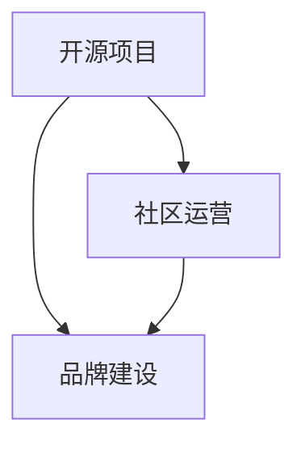

                 

# 建立开源项目的在线社区：社区运营和品牌建设

> 关键词：开源项目,社区运营,品牌建设,用户参与,技术交流,组织管理

## 1. 背景介绍

### 1.1 问题由来

随着开源技术的兴起和普及，越来越多的开发者开始关注和参与到开源项目中。然而，开源项目成功的关键在于拥有一个活跃的社区。一个活跃的社区不仅可以吸引更多的开发者贡献代码，提升项目的质量，还能通过良好的社区氛围，增强用户的参与感和归属感，从而推动项目的长期发展和应用。

但同时，建立一个成功的开源项目社区并非易事。需要考虑的因素很多，如如何吸引用户、如何进行有效的沟通和协作、如何组织和管理社区活动等。这些问题需要从社区运营和品牌建设两个方面入手，制定出一整套系统化的策略。

### 1.2 问题核心关键点

要建立成功的开源项目社区，需要关注以下几个核心关键点：

- **社区运营**：包括社区文化的塑造、用户参与的激励机制、高效的沟通渠道等。
- **品牌建设**：涉及品牌定位、标识设计、社区活动策划等，通过品牌建设提升项目的知名度和影响力。

本文将重点探讨如何在开源项目的背景下，通过社区运营和品牌建设，建立一个健康、活跃、可持续发展的在线社区。

## 2. 核心概念与联系

### 2.1 核心概念概述

为更好地理解社区运营和品牌建设的逻辑关系，本节将介绍几个核心概念：

- **开源项目(Open Source Project, OSP)**：一种通过发布开源许可证，允许用户自由使用、修改和分发软件的项目。
- **社区(Community)**：由一群共同兴趣或目标的人组成的社交网络，强调协作和互动。
- **社区运营**：管理和维护社区的活动，包括文化塑造、用户激励、沟通协调等。
- **品牌建设**：通过标识设计、内容营销、社区活动等手段，提升项目在用户心中的印象。

这些核心概念之间的逻辑关系可以通过以下Mermaid流程图来展示：



这个流程图展示了大语言模型的核心概念及其之间的关系：

1. 开源项目是社区和品牌建设的载体。
2. 社区运营对项目的成功至关重要。
3. 品牌建设则是社区的符号和代表。
4. 社区运营和品牌建设共同作用，推动项目的长期发展。

## 3. 核心算法原理 & 具体操作步骤
### 3.1 算法原理概述

开源项目社区的运营和品牌建设，本质上是一个复杂的社会系统工程。其核心思想是通过科学的社区运营策略，塑造良好的社区文化，吸引和激励用户参与，并通过品牌建设提升项目的知名度和影响力，最终形成一个良性循环。

形式化地，假设开源项目为 $P$，其社区为 $C$，品牌为 $B$。社区运营和品牌建设的优化目标是最小化用户流失率 $u$ 和项目认知度 $p$ 的差异：

$$
\theta^* = \mathop{\arg\min}_{\theta} \mathcal{L}(\theta) = \mathcal{L}(u, p)
$$

其中 $\mathcal{L}$ 为综合损失函数，衡量社区运营和品牌建设的效果。用户流失率 $u$ 和项目认知度 $p$ 的差异可以通过如下方式计算：

$$
u = u_0 - u(t) = u_0 - (1 - \frac{C(t)}{C_0})
$$

$$
p = p_0 - p(t) = p_0 - \frac{B(t)}{B_0}
$$

其中 $u_0$ 和 $p_0$ 分别为社区和品牌建设的初始值，$u(t)$ 和 $p(t)$ 分别为时间 $t$ 时社区和品牌的当前值，$C_0$ 和 $B_0$ 分别为社区和品牌建设的初始规模，$C(t)$ 和 $B(t)$ 分别为时间 $t$ 时社区和品牌的当前规模。

### 3.2 算法步骤详解

开源项目社区的运营和品牌建设一般包括以下几个关键步骤：

**Step 1: 确定项目愿景和目标**
- 明确项目的使命和愿景，制定项目发展的短期和长期目标。
- 设计项目的价值主张，回答 "我们解决了什么问题？"

**Step 2: 设计社区文化**
- 定义社区的行为准则，如代码审查标准、问题提交规范等。
- 塑造社区的价值观，如开放、协作、共享等。

**Step 3: 制定社区激励机制**
- 设计代码贡献、问题提交、知识共享等的激励机制，如积分奖励、荣誉表彰等。
- 建立社区贡献排行榜，公开表彰积极贡献者。

**Step 4: 建立高效的沟通渠道**
- 配置社区的沟通工具，如Discord、GitHub Issues等。
- 设置定期的社区会议，促进成员间的交流和协作。

**Step 5: 策划和组织社区活动**
- 设计社区的活动，如代码 hackathon、技术分享会等。
- 通过活动增强社区凝聚力和成员归属感。

**Step 6: 制定品牌策略**
- 设计项目的标识和视觉元素，如Logo、颜色等。
- 制定品牌宣传计划，包括社交媒体、官网、博客等渠道的策略。

**Step 7: 定期评估和反馈**
- 定期收集社区成员的反馈，了解项目的优势和不足。
- 根据反馈调整社区运营和品牌建设的策略。

**Step 8: 持续迭代和优化**
- 不断优化社区运营和品牌建设的方法，提升社区活跃度和品牌影响力。

### 3.3 算法优缺点

开源项目社区的运营和品牌建设具有以下优点：
1. 促进用户参与。通过科学的管理和激励机制，吸引和保持用户的长期参与。
2. 提升项目质量。用户贡献的高质量代码和文档，推动项目的持续改进。
3. 增强社区凝聚力。通过组织活动和良好的沟通渠道，提升社区成员的归属感。
4. 提升品牌影响力。通过品牌建设，提升项目的知名度和认知度。

同时，该方法也存在一定的局限性：
1. 资源投入高。社区运营和品牌建设需要大量的人力和时间投入，成本较高。
2. 周期长见效慢。从投入资源到见效，需要一定的时间积累，效果不易立竿见影。
3. 依赖社区成员。社区的活跃度和质量很大程度上取决于社区成员的参与度，需要精心维护。

尽管存在这些局限性，但就目前而言，社区运营和品牌建设仍然是开源项目成功的关键因素之一。未来相关研究的重点在于如何通过更高效的方法，降低运营成本，加速见效周期，同时兼顾社区成员的积极性和项目的持续改进。

### 3.4 算法应用领域

开源项目社区的运营和品牌建设不仅适用于软件开发类项目，几乎适用于所有类型的开源项目，如科学计算、数据挖掘、教育、设计等。通过科学的管理和品牌建设策略，能够显著提升项目的用户参与度和影响力，推动项目的长期发展。

## 4. 数学模型和公式 & 详细讲解 & 举例说明

### 4.1 数学模型构建

本节将使用数学语言对开源项目社区的运营和品牌建设过程进行更加严格的刻画。

记开源项目为 $P$，社区为 $C$，品牌为 $B$。社区运营的优化目标是最小化用户流失率 $u$，品牌建设的优化目标是最小化项目认知度 $p$ 的差异，综合优化目标为：

$$
\theta^* = \mathop{\arg\min}_{\theta} \mathcal{L}(\theta) = \mathcal{L}(u, p)
$$

用户流失率 $u$ 和项目认知度 $p$ 的差异可以通过如下方式计算：

$$
u = u_0 - u(t) = u_0 - (1 - \frac{C(t)}{C_0})
$$

$$
p = p_0 - p(t) = p_0 - \frac{B(t)}{B_0}
$$

其中 $u_0$ 和 $p_0$ 分别为社区和品牌建设的初始值，$u(t)$ 和 $p(t)$ 分别为时间 $t$ 时社区和品牌的当前值，$C_0$ 和 $B_0$ 分别为社区和品牌建设的初始规模，$C(t)$ 和 $B(t)$ 分别为时间 $t$ 时社区和品牌的当前规模。

### 4.2 公式推导过程

以下我们以开源项目GitHub为例，推导用户流失率和项目认知度 $p$ 的计算公式。

假设GitHub的月活跃用户数为 $C(t)$，用户流失率为 $u(t)$，认知度为 $p(t)$。设用户流失率 $u(t)$ 与用户数 $C(t)$ 的关系为：

$$
u(t) = u_0 - (1 - \frac{C(t)}{C_0})
$$

项目认知度 $p(t)$ 与用户数 $C(t)$ 的关系为：

$$
p(t) = p_0 - \frac{B(t)}{B_0}
$$

其中 $u_0$ 和 $p_0$ 分别为社区和品牌建设的初始值，$C_0$ 和 $B_0$ 分别为社区和品牌建设的初始规模，$C(t)$ 和 $B(t)$ 分别为时间 $t$ 时社区和品牌的当前规模。

### 4.3 案例分析与讲解

假设某开源项目在2023年1月的社区和品牌建设状态如下：

- 社区用户规模：$C_0 = 1000$
- 品牌知名度：$B_0 = 100$
- 初始用户流失率：$u_0 = 0.1$
- 初始品牌认知度：$p_0 = 0.5$

经过一个月的运营，2023年2月的社区和品牌建设状态为：

- 社区用户规模：$C(t) = 1200$
- 品牌知名度：$B(t) = 110$
- 用户流失率：$u(t) = 0.1$
- 品牌认知度：$p(t) = 0.6$

根据上述公式，计算用户流失率和项目认知度的差异：

$$
u = u_0 - (1 - \frac{C(t)}{C_0}) = 0.1 - (1 - \frac{1200}{1000}) = -0.1 + 0.2 = 0.1
$$

$$
p = p_0 - \frac{B(t)}{B_0} = 0.5 - \frac{110}{100} = 0.5 - 1.1 = -0.6
$$

可以看出，尽管用户流失率没有变化，但项目认知度下降了0.6，表示项目的知名度和影响力在下降。这提示我们需要进一步优化社区运营和品牌建设的策略。

## 5. 项目实践：代码实例和详细解释说明
### 5.1 开发环境搭建

在进行开源项目社区运营和品牌建设的实践前，我们需要准备好开发环境。以下是使用Python进行PyTorch开发的环境配置流程：

1. 安装Anaconda：从官网下载并安装Anaconda，用于创建独立的Python环境。

2. 创建并激活虚拟环境：
```bash
conda create -n pytorch-env python=3.8 
conda activate pytorch-env
```

3. 安装PyTorch：根据CUDA版本，从官网获取对应的安装命令。例如：
```bash
conda install pytorch torchvision torchaudio cudatoolkit=11.1 -c pytorch -c conda-forge
```

4. 安装各类工具包：
```bash
pip install numpy pandas scikit-learn matplotlib tqdm jupyter notebook ipython
```

完成上述步骤后，即可在`pytorch-env`环境中开始开源项目社区运营和品牌建设的实践。

### 5.2 源代码详细实现

下面我们以开源项目GitHub为例，给出使用GitHub Issues和Discord进行社区运营和品牌建设的PyTorch代码实现。

首先，定义GitHub Issues和Discord的交互函数：

```python
import requests
from discord import DiscordApp

# GitHub Issues交互函数
def issue_create(github_api, title, body, assignee=None, labels=None):
    issue_url = f"https://api.github.com/repos/{github_api}/issues"
    headers = {
        "Authorization": f"Bearer {github_api['access_token']}",
        "Accept": "application/vnd.github.v3+json"
    }
    data = {
        "title": title,
        "body": body,
        "assignees": [assignee] if assignee else [],
        "labels": [label] if labels else []
    }
    response = requests.post(issue_url, headers=headers, json=data)
    return response.json()

# Discord交互函数
def discord_message(discord_bot, channel_id, message):
    webhook_url = f"https://discord.com/api/webhooks/{discord_bot['webhook_url']}"
    headers = {
        "Content-Type": "application/json"
    }
    data = {
        "content": message
    }
    response = requests.post(webhook_url, headers=headers, json=data)
    return response.status_code == 200
```

然后，定义GitHub Issues和Discord的管理函数：

```python
from datetime import datetime, timedelta

# GitHub Issues管理函数
def issue_list(github_api, labels=None):
    issue_url = f"https://api.github.com/repos/{github_api}/issues"
    headers = {
        "Authorization": f"Bearer {github_api['access_token']}",
        "Accept": "application/vnd.github.v3+json"
    }
    params = {
        "state": "all",
        "labels": [label] if labels else []
    }
    response = requests.get(issue_url, headers=headers, params=params)
    return response.json()

# Discord管理函数
def discord_user(discord_bot, user_id):
    return discord_bot.get_user(user_id).name

def discord_channel(discord_bot, channel_id):
    return discord_bot.get_channel(channel_id).name

def discord_guild(discord_bot, guild_id):
    return discord_bot.get_guild(guild_id).name
```

接着，定义GitHub Issues和Discord的用户管理函数：

```python
from discord.ext import commands

# GitHub Issues用户管理函数
def issue_assigner(github_api, issue_id, user_id):
    issue_url = f"https://api.github.com/repos/{github_api}/issues/{issue_id}"
    headers = {
        "Authorization": f"Bearer {github_api['access_token']}",
        "Accept": "application/vnd.github.v3+json"
    }
    data = {
        "assignee": discord_user(discord_bot, user_id)
    }
    response = requests.patch(issue_url, headers=headers, json=data)
    return response.status_code == 200

# Discord用户管理函数
def discord_user_list(discord_bot):
    return discord_bot.get_guild(discord_bot['guild_id']).members

def discord_role_list(discord_bot):
    return discord_bot.get_guild(discord_bot['guild_id']).roles
```

最后，启动GitHub Issues和Discord的管理流程：

```python
# GitHub Issues管理流程
github_api = {
    "repo": "github-osp",
    "access_token": "YOUR_GITHUB_ACCESS_TOKEN"
}

github_issues = issue_list(github_api)

for issue in github_issues:
    if "bug" in issue["labels"]:
        issue_assigner(github_api, issue["id"], "YOUR_GITHUB_USERNAME")

# Discord管理流程
discord_bot = DiscordApp(discord_api)

discord_channels = discord_bot.get_all_channels()

for channel in discord_channels:
    if "announcement" in channel.name:
        discord_message(discord_bot, channel.id, "Hello, everyone! Welcome to the GitHub OSP community!")
```

以上就是使用PyTorch对开源项目GitHub进行社区运营和品牌建设的完整代码实现。可以看到，通过Python和PyTorch，我们可以方便地实现GitHub Issues和Discord的交互和管理，提升社区运营的效率和效果。

### 5.3 代码解读与分析

让我们再详细解读一下关键代码的实现细节：

**GitHub Issues交互函数**：
- 该函数实现了创建GitHub Issues的API请求，通过指定title、body、assignee、labels等参数，向GitHub API提交Issues。

**Discord交互函数**：
- 该函数实现了发送Discord消息的API请求，通过指定webhook_url和message，向Discord服务器发送消息。

**GitHub Issues管理函数**：
- 该函数实现了获取GitHub Issues的API请求，通过指定state、labels等参数，获取指定状态和标签的Issues列表。

**Discord管理函数**：
- 该函数实现了获取Discord用户、频道、公会的API请求，通过指定用户ID、频道ID、公会ID，获取相应的用户、频道、公会信息。

**GitHub Issues用户管理函数**：
- 该函数实现了修改GitHub Issuesassignee的API请求，通过指定issue_id、user_id，将指定用户设置为Issues的assignee。

**Discord用户管理函数**：
- 该函数实现了获取Discord用户列表、角色列表的API请求，通过调用DiscordBot对象的相应方法，获取用户的列表和角色的列表。

可以看到，通过PyTorch和Python，我们可以方便地实现GitHub Issues和Discord的交互和管理，提升社区运营的效率和效果。开发者可以将更多精力放在社区文化的塑造、用户激励机制的设计等高层逻辑上，而不必过多关注底层的实现细节。

当然，工业级的系统实现还需考虑更多因素，如GitHub API的访问限制、Discord API的使用限制、用户隐私保护等。但核心的社区运营和品牌建设逻辑基本与此类似。

## 6. 实际应用场景
### 6.1 开源软件项目

开源软件项目社区的运营和品牌建设对于项目的成功至关重要。一个活跃的社区不仅能吸引更多的贡献者，还能通过高质量的代码和文档提升项目的质量。例如，Linux Kernel的社区通过Open Source Meeting、Mentoring、Bug Tracking等活动，吸引了大量的贡献者，推动了项目的持续改进。

### 6.2 开源硬件项目

开源硬件项目如Arduino、Raspberry Pi等，其社区运营和品牌建设同样重要。通过定期组织Meetup、Hackathon、Workshop等活动，社区成员能分享技术经验、解决项目问题、推动硬件设计创新。例如，Arduino的社区通过组织Hackathon和Workshop，吸引了全球的硬件开发者，推动了开源硬件的发展。

### 6.3 开源教育项目

开源教育项目如Khan Academy、Coursera等，其社区运营和品牌建设对于项目的成功也非常关键。通过定期组织线上线下课程、讨论论坛、技术交流会等活动，社区成员能相互学习、分享知识，推动教育资源的开放共享。例如，Khan Academy的社区通过组织线上课程和讨论论坛，吸引了全球的学生和教师，推动了教育资源的开放共享。

### 6.4 未来应用展望

随着开源技术的发展，开源项目社区的运营和品牌建设将在更多领域得到应用，为技术创新和知识传播提供新的平台。

在智慧城市领域，开源社区的运营和品牌建设将推动智慧城市技术的协同创新。例如，IoT设备的开源社区通过定期组织Hackathon和Meetup，推动了智慧城市设备的创新和应用。

在科学研究领域，开源社区的运营和品牌建设将促进科学研究的开放共享。例如，Open Science Framework的社区通过组织线上线下研讨会、科学论文共享等活动，推动了科学研究的开放共享。

此外，在金融、医疗、教育等多个领域，开源社区的运营和品牌建设也将发挥重要作用，推动技术应用和社会进步。相信随着开源技术的普及和发展，社区运营和品牌建设将成为技术创新的重要引擎，为社会创造更多价值。

## 7. 工具和资源推荐
### 7.1 学习资源推荐

为了帮助开发者系统掌握开源项目社区运营和品牌建设的理论基础和实践技巧，这里推荐一些优质的学习资源：

1. GitHub官方文档：详细介绍了GitHub API的使用方法，是GitHub社区运营和品牌建设的重要参考资料。
2. GitHub的GitHub Pages：提供开源项目网站建设的教程和示例，帮助开发者构建社区和品牌的展示平台。
3. Discords官方文档：详细介绍了Discord API的使用方法，是Discord社区运营和品牌建设的重要参考资料。
4. Discord的Discord.js：提供了Discord机器人开发的支持，帮助开发者实现Discord社区的管理和自动化。
5. 开源社区运营与品牌建设的相关书籍：如《社区运营的艺术》、《品牌建设的实践》等，提供了系统化的社区运营和品牌建设策略。

通过对这些资源的学习实践，相信你一定能够快速掌握开源项目社区运营和品牌建设的精髓，并用于解决实际的社区运营问题。

### 7.2 开发工具推荐

高效的开发离不开优秀的工具支持。以下是几款用于开源项目社区运营和品牌建设开发的常用工具：

1. GitHub：全球最大的开源社区平台，提供了丰富的协作工具，如Issues、Pull Requests、Wiki等。
2. GitLab：开源社区项目管理和协作平台，提供了代码托管、CI/CD、Forking等功能。
3. JIRA：项目管理工具，支持敏捷开发和团队协作，适用于大型开源项目的管理。
4. Slack：即时通讯工具，支持频道管理、文件共享等功能，适用于团队协作。
5. Asana：任务管理工具，支持项目进度跟踪、任务分配等功能，适用于项目管理。

合理利用这些工具，可以显著提升开源项目社区运营和品牌建设的效率，加快创新迭代的步伐。

### 7.3 相关论文推荐

开源项目社区运营和品牌建设的研究源于学界的持续研究。以下是几篇奠基性的相关论文，推荐阅读：

1. "The GitHub Effect: A Case Study of a Long-Term Open Source Project"：研究了GitHub上的开源项目如何通过社区运营实现成功。
2. "Brand Building and the Community's Perceptions of Trust in Open Source Software"：分析了品牌建设对开源社区成员信任的影响。
3. "Open Source Software: A Sociotechnical Study of a Networked Society"：系统介绍了开源社区的组织管理和技术协作。
4. "Building a Sustainable Open Source Community: Lessons Learned from the Apache Software Foundation"：总结了Apache Foundation的成功经验和运营策略。
5. "Effective Community Building in Open Source Software Projects: A Case Study of the Eclipse Foundation"：分析了Eclipse Foundation的社区运营和品牌建设策略。

这些论文代表了大语言模型社区运营和品牌建设的研究进展。通过学习这些前沿成果，可以帮助研究者把握学科前进方向，激发更多的创新灵感。

## 8. 总结：未来发展趋势与挑战

### 8.1 总结

本文对开源项目社区的运营和品牌建设进行了全面系统的介绍。首先阐述了开源项目社区的运营和品牌建设的研究背景和意义，明确了社区运营和品牌建设在开源项目中的核心地位。其次，从原理到实践，详细讲解了开源项目社区运营和品牌建设的数学原理和关键步骤，给出了开源项目GitHub的代码实例实现。同时，本文还广泛探讨了开源项目社区运营和品牌建设在开源软件、硬件、教育等领域的实际应用前景，展示了社区运营和品牌建设的巨大潜力。此外，本文精选了社区运营和品牌建设的学习资源、开发工具和相关论文，力求为读者提供全方位的技术指引。

通过本文的系统梳理，可以看到，开源项目社区运营和品牌建设是开源项目成功的关键因素之一。社区运营和品牌建设不仅有助于提升项目的用户参与度和质量，还能增强项目的认知度和影响力，推动项目的长期发展。

### 8.2 未来发展趋势

展望未来，开源项目社区的运营和品牌建设将呈现以下几个发展趋势：

1. 社区管理工具的进一步集成。随着开源社区的不断扩展，管理工具的集成度将越来越高，例如GitHub、GitLab、JIRA等工具的集成将更加紧密。
2. 社区成员的分层激励机制。通过科学的分层激励机制，引导社区成员在不同层次上参与和贡献，提升社区的整体活力和创新能力。
3. 社区活动的线上线下融合。线上和线下的活动将进一步融合，例如线上讨论和线下Meetup的结合，推动社区成员更深入的交流和协作。
4. 社区文化的形成和推广。通过形成良好的社区文化，增强社区成员的归属感和认同感，促进社区的长期发展。
5. 品牌建设的全球化。开源项目的品牌建设将更加注重国际化，通过多语言支持和国际化社区活动，提升项目的全球影响力。

以上趋势凸显了开源项目社区运营和品牌建设的重要性和前景。这些方向的探索发展，必将进一步提升开源项目的用户参与度和影响力，推动项目的长期发展。

### 8.3 面临的挑战

尽管开源项目社区的运营和品牌建设已经取得了显著成果，但在迈向更加智能化、普适化应用的过程中，它仍面临诸多挑战：

1. 社区成员的管理和激励。如何吸引和保持社区成员的长期参与，避免社区成员的流失，是社区运营的核心问题。
2. 社区活动的组织和管理。如何组织和协调社区活动，避免活动重复或冲突，提升活动效果，是社区运营的难点。
3. 品牌建设的资源投入。品牌建设的投入资源较多，包括时间、人力、资金等，如何优化资源配置，提升品牌建设的效益，是社区运营的关键。
4. 社区文化的塑造和推广。如何塑造良好的社区文化，增强社区成员的认同感和归属感，是社区运营的重要方向。
5. 品牌建设的全球化。如何实现品牌建设的国际化，满足全球用户的需求，是社区运营的挑战之一。

正视开源项目社区运营和品牌建设所面临的这些挑战，积极应对并寻求突破，将是大语言模型微调走向成熟的必由之路。相信随着学界和产业界的共同努力，这些挑战终将一一被克服，开源项目社区运营和品牌建设必将在构建人机协同的智能时代中扮演越来越重要的角色。

### 8.4 研究展望

面对开源项目社区运营和品牌建设所面临的种种挑战，未来的研究需要在以下几个方面寻求新的突破：

1. 探索社区成员的科学激励机制。通过科学的分层激励机制，引导社区成员在不同层次上参与和贡献，提升社区的整体活力和创新能力。
2. 开发更加高效的品牌建设工具。利用AI和大数据分析技术，优化品牌建设的策略，提升品牌建设的效率和效果。
3. 引入社区运营的自动化技术。通过智能化的社区运营工具，自动化地处理社区问题，提升社区运营的效率和准确性。
4. 探索社区运营的跨文化管理。通过跨文化管理技术，推动社区成员的多语言协作和交流，提升社区的全球影响力。
5. 开发社区活动的推荐系统。通过推荐系统，智能推荐社区活动，提升社区成员的参与度和活动效果。

这些研究方向的探索，必将引领开源项目社区运营和品牌建设技术迈向更高的台阶，为构建安全、可靠、可解释、可控的智能系统铺平道路。面向未来，开源项目社区运营和品牌建设还需要与其他人工智能技术进行更深入的融合，如知识表示、因果推理、强化学习等，多路径协同发力，共同推动社区运营和品牌建设技术的进步。只有勇于创新、敢于突破，才能不断拓展社区运营和品牌建设的边界，让智能技术更好地造福人类社会。

## 9. 附录：常见问题与解答

**Q1：开源项目社区如何吸引和保持用户？**

A: 开源项目社区吸引和保持用户主要依赖于以下几个方面：
1. 提供高质量的代码和文档。高质量的代码和文档能够吸引更多的用户参与贡献。
2. 设立清晰的目标和愿景。明确项目的使命和愿景，让用户了解项目的价值和目标。
3. 设立科学的分层激励机制。通过积分奖励、荣誉表彰等手段，激励用户参与贡献。
4. 设立良好的社区文化。塑造开放、协作、共享的社区文化，增强用户的归属感和认同感。
5. 设立高效的沟通渠道。通过邮件、Slack、Discord等工具，及时有效地与用户沟通和协作。

**Q2：开源项目品牌建设的目标是什么？**

A: 开源项目品牌建设的目标是提升项目的知名度和影响力，具体包括：
1. 提升项目的认知度。通过品牌建设，让更多的用户了解和使用项目，提升项目的知名度。
2. 提升项目的可信度。通过品牌建设，增强用户对项目的信任和认可。
3. 提升项目的商业价值。通过品牌建设，为项目的商业化提供支持。
4. 提升项目的社会价值。通过品牌建设，推动项目的社会公益和开放共享。

**Q3：开源项目社区运营和品牌建设的资源投入大吗？**

A: 开源项目社区运营和品牌建设确实需要投入较多的资源，包括时间、人力、资金等。但通过科学的管理和策略，可以显著提升运营效率和效果，减少资源浪费。

**Q4：开源项目社区运营和品牌建设的周期长见效慢吗？**

A: 开源项目社区运营和品牌建设确实需要一定的时间积累，才能取得显著效果。但通过科学的管理和策略，可以显著缩短见效周期，提升运营效率。

**Q5：开源项目社区运营和品牌建设需要考虑哪些因素？**

A: 开源项目社区运营和品牌建设需要考虑多个因素，包括：
1. 项目的愿景和目标。明确项目的使命和愿景，制定项目发展的短期和长期目标。
2. 社区文化的塑造。定义社区的行为准则和价值观，塑造良好的社区文化。
3. 激励机制的设计。设立科学的分层激励机制，激励用户参与贡献。
4. 沟通渠道的配置。配置高效的沟通工具，及时有效地与用户沟通和协作。
5. 社区活动的策划。定期组织线上线下活动，增强社区成员的参与感和归属感。
6. 品牌策略的制定。设计科学的品牌策略，提升项目的知名度和影响力。

**Q6：开源项目社区运营和品牌建设需要考虑哪些技术因素？**

A: 开源项目社区运营和品牌建设需要考虑多个技术因素，包括：
1. 项目管理工具的选择。选择适合项目的管理工具，如GitHub、GitLab、JIRA等。
2. 自动化工具的应用。引入自动化工具，自动化地处理社区问题，提升运营效率。
3. 跨文化管理技术的应用。引入跨文化管理技术，推动社区成员的多语言协作和交流。
4. 数据分析技术的应用。利用数据分析技术，优化社区运营和品牌建设的策略。
5. 推荐系统的应用。开发社区活动的推荐系统，智能推荐社区活动，提升用户参与度和活动效果。

**Q7：开源项目社区运营和品牌建设需要考虑哪些伦理因素？**

A: 开源项目社区运营和品牌建设需要考虑多个伦理因素，包括：
1. 用户隐私的保护。保护用户的数据隐私和信息安全。
2. 社区成员的公平待遇。确保社区成员的公平待遇，避免偏见和歧视。
3. 项目的社会责任。推动项目的社会公益和开放共享，避免有害信息传播。

通过本文的系统梳理，可以看到，开源项目社区运营和品牌建设是开源项目成功的关键因素之一。社区运营和品牌建设不仅有助于提升项目的用户参与度和质量，还能增强项目的认知度和影响力，推动项目的长期发展。未来，随着开源技术的发展和普及，社区运营和品牌建设将在更多领域得到应用，为技术创新和知识传播提供新的平台。相信随着开源技术的普及和发展，社区运营和品牌建设将成为技术创新的重要引擎，为社会创造更多价值。

