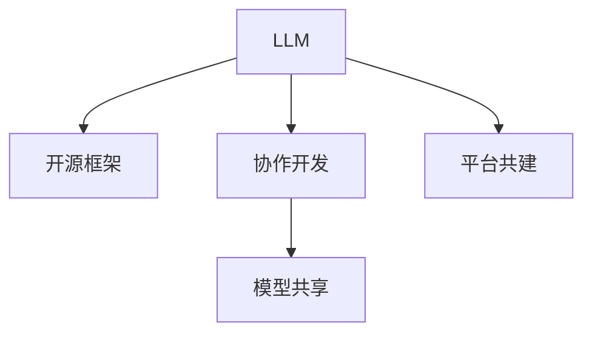

                 

# 开源 LLM：共享和协作开发

大语言模型（LLM）作为人工智能（AI）领域的一大突破，正日益成为驱动技术创新的重要引擎。LLM通过在大量无标签文本数据上进行预训练，学习到了语言的深层次表示，具备了强大的自然语言处理（NLP）能力。然而，庞大的模型规模和高昂的训练成本，使得LLM的开发和使用门槛较高，限制了其在更广泛领域的应用。

本文旨在探讨基于开源框架和协作开发的LLM模型，通过减少重复劳动、实现模型共享、促进社区交流等方式，降低LLM的开发和使用门槛，推动其应用场景的拓展和普及。

## 1. 背景介绍

### 1.1 问题由来

近年来，深度学习技术的飞速发展使得LLM得以问世，并迅速成为NLP领域的焦点。以GPT-3、BERT、T5等模型为代表，LLM已经在翻译、摘要、问答等任务上取得了显著的成果，推动了NLP技术的产业化进程。但与此同时，其庞大的模型规模和高昂的训练成本，使得大部分开发者难以独立构建和部署LLM模型，降低了其在实际应用中的普及率。

同时，LLM的开发过程中需要大量数据集和计算资源，这进一步增加了模型开发的复杂度和难度。如何降低模型开发的成本和门槛，促进更多开发者参与到LLM的开发和应用中，成为亟需解决的问题。

### 1.2 问题核心关键点

为解决这个问题，LLM的开发和部署方式开始向开源和协作化方向转变。开源框架如Hugging Face的Transformers、OpenAI的GPT等，提供了丰富的预训练模型和工具支持，大幅降低了开发者构建和部署LLM的难度。协作开发模式则通过社区交流和共享机制，促进了模型的不断优化和应用场景的扩展。

这种开源和协作化的开发模式，不仅能降低开发者构建和部署LLM的成本，还能通过共享机制，快速迭代和优化模型，提升模型性能。同时，协作开发还能促进社区交流和技术分享，加速LLM技术的普及和应用。

## 2. 核心概念与联系

### 2.1 核心概念概述

为了更好地理解开源LLM的协作开发模式，本节将介绍几个关键概念：

- **大语言模型（LLM）**：以自回归（如GPT）或自编码（如BERT）模型为代表，通过在大量无标签文本数据上进行预训练，学习到语言的深层次表示，具备强大的NLP能力。
- **开源框架**：如Hugging Face的Transformers、OpenAI的GPT，提供了预训练模型和工具支持，降低了开发者构建和部署LLM的难度。
- **协作开发**：通过社区交流和共享机制，促进模型的不断优化和应用场景的扩展。
- **模型共享**：在社区中实现模型和代码的共享，便于开发者快速应用和迭代优化。
- **平台共建**：构建LLM开发和部署的统一平台，简化开发和部署流程，促进模型应用。

这些概念之间的逻辑关系可以通过以下Mermaid流程图来展示：



这个流程图展示了LLM模型的核心概念及其之间的联系：

1. LLM通过开源框架提供预训练模型和工具支持，降低开发门槛。
2. 协作开发通过社区交流和共享机制，促进模型的优化和扩展。
3. 模型共享使得开发者可以轻松应用和迭代优化已有的模型。
4. 平台共建简化LLM开发和部署流程，加速模型应用。

## 3. 核心算法原理 & 具体操作步骤

### 3.1 算法原理概述

开源LLM协作开发的核心原理是，通过开源框架和社区协作机制，实现模型的共享和优化。其基本流程如下：

1. **选择合适的开源框架**：如Hugging Face的Transformers或OpenAI的GPT，获取预训练模型和工具。
2. **基于社区协作**：通过GitHub等平台，收集社区贡献的代码和模型，进行模型微调和优化。
3. **实现模型共享**：将优化后的模型和代码公开共享，供社区开发者使用。
4. **共建开发平台**：构建统一的LLM开发和部署平台，简化开发者构建和部署模型的流程。

### 3.2 算法步骤详解

以下将详细介绍开源LLM协作开发的具体步骤：

**Step 1: 选择合适的开源框架和预训练模型**
- 基于需求选择合适的开源框架，如Hugging Face的Transformers或OpenAI的GPT。
- 获取预训练模型，选择适合的架构和参数。

**Step 2: 加入社区并参与协作开发**
- 注册GitHub账户，加入开源LLM社区，参与模型构建和优化。
- 贡献代码和模型，通过Pull Request（PR）进行代码审查和合并。
- 使用Git、GitHub等工具进行版本控制和代码管理。

**Step 3: 基于社区贡献进行模型微调**
- 收集社区提供的微调数据集和代码，对预训练模型进行微调。
- 使用社区提供的工具和算法，如AdamW、SGD等，进行模型优化。
- 使用社区提供的评估指标，如BLEU、ROUGE等，评估模型性能。

**Step 4: 实现模型共享和传播**
- 将微调后的模型和代码，发布到开源社区或公共仓库，如GitHub。
- 编写文档和使用说明，便于社区开发者快速应用和理解。
- 使用平台工具进行模型部署和集成，如AWS、GCP等云平台。

**Step 5: 共建LLM开发和部署平台**
- 开发统一的LLM开发和部署平台，简化模型构建和部署流程。
- 提供API接口和工具支持，方便开发者快速应用模型。
- 定期更新平台功能，提升用户体验和模型性能。

### 3.3 算法优缺点

开源LLM协作开发方法具有以下优点：
1. **降低开发成本**：开源框架和社区协作机制大幅降低了模型构建和部署的门槛和成本。
2. **促进模型优化**：通过社区协作，可以汇集更多开发者力量，快速迭代和优化模型。
3. **加速应用扩展**：模型共享机制使得开发者可以轻松应用和迭代优化已有模型。
4. **提升平台便利性**：共建LLM开发和部署平台，简化开发者流程，加速模型应用。

同时，该方法也存在一定的局限性：
1. **依赖社区贡献**：模型的性能和扩展依赖社区的贡献，可能面临开发活跃度不足的问题。
2. **模型兼容性**：不同开源框架的模型兼容性可能存在问题，需要额外的适配工作。
3. **安全性和隐私**：模型共享可能导致隐私泄露和安全问题，需要加强保护措施。
4. **模型差异性**：社区贡献的多样性可能导致模型性能和风格的差异，需要标准化和规范管理。

尽管存在这些局限性，但就目前而言，开源LLM协作开发方法已成为LLM模型构建和应用的重要范式。未来相关研究的重点在于如何进一步提高社区活跃度，促进模型标准化和规范化，同时兼顾安全性和隐私保护。

### 3.4 算法应用领域

开源LLM协作开发方法在NLP领域已经得到了广泛的应用，覆盖了诸多任务，例如：

- 文本分类：如情感分析、主题分类、意图识别等。通过微调使模型学习文本-标签映射。
- 命名实体识别：识别文本中的人名、地名、机构名等特定实体。通过微调使模型掌握实体边界和类型。
- 关系抽取：从文本中抽取实体之间的语义关系。通过微调使模型学习实体-关系三元组。
- 问答系统：对自然语言问题给出答案。将问题-答案对作为微调数据，训练模型学习匹配答案。
- 机器翻译：将源语言文本翻译成目标语言。通过微调使模型学习语言-语言映射。
- 文本摘要：将长文本压缩成简短摘要。将文章-摘要对作为微调数据，使模型学习抓取要点。
- 对话系统：使机器能够与人自然对话。将多轮对话历史作为上下文，微调模型进行回复生成。

除了上述这些经典任务外，开源LLM协作开发方法也被创新性地应用到更多场景中，如可控文本生成、常识推理、代码生成、数据增强等，为NLP技术带来了全新的突破。

## 4. 数学模型和公式 & 详细讲解 & 举例说明（备注：数学公式请使用latex格式，latex嵌入文中独立段落使用 $$，段落内使用 $)
### 4.1 数学模型构建

在本节中，我们将使用数学语言对开源LLM协作开发过程进行更加严格的刻画。

记开源LLM为 $M_{\theta}$，其中 $\theta$ 为模型参数。假设社区协作开发的模型微调数据集为 $D=\{(x_i,y_i)\}_{i=1}^N, x_i \in \mathcal{X}, y_i \in \mathcal{Y}$。

定义模型 $M_{\theta}$ 在数据样本 $(x,y)$ 上的损失函数为 $\ell(M_{\theta}(x),y)$，则在数据集 $D$ 上的经验风险为：

$$
\mathcal{L}(\theta) = \frac{1}{N} \sum_{i=1}^N \ell(M_{\theta}(x_i),y_i)
$$

微调的优化目标是最小化经验风险，即找到最优参数：

$$
\theta^* = \mathop{\arg\min}_{\theta} \mathcal{L}(\theta)
$$

在实践中，我们通常使用基于梯度的优化算法（如SGD、Adam等）来近似求解上述最优化问题。设 $\eta$ 为学习率，$\lambda$ 为正则化系数，则参数的更新公式为：

$$
\theta \leftarrow \theta - \eta \nabla_{\theta}\mathcal{L}(\theta) - \eta\lambda\theta
$$

其中 $\nabla_{\theta}\mathcal{L}(\theta)$ 为损失函数对参数 $\theta$ 的梯度，可通过反向传播算法高效计算。

### 4.2 公式推导过程

以下我们以二分类任务为例，推导交叉熵损失函数及其梯度的计算公式。

假设模型 $M_{\theta}$ 在输入 $x$ 上的输出为 $\hat{y}=M_{\theta}(x) \in [0,1]$，表示样本属于正类的概率。真实标签 $y \in \{0,1\}$。则二分类交叉熵损失函数定义为：

$$
\ell(M_{\theta}(x),y) = -[y\log \hat{y} + (1-y)\log (1-\hat{y})]
$$

将其代入经验风险公式，得：

$$
\mathcal{L}(\theta) = -\frac{1}{N}\sum_{i=1}^N [y_i\log M_{\theta}(x_i)+(1-y_i)\log(1-M_{\theta}(x_i))]
$$

根据链式法则，损失函数对参数 $\theta_k$ 的梯度为：

$$
\frac{\partial \mathcal{L}(\theta)}{\partial \theta_k} = -\frac{1}{N}\sum_{i=1}^N (\frac{y_i}{M_{\theta}(x_i)}-\frac{1-y_i}{1-M_{\theta}(x_i)}) \frac{\partial M_{\theta}(x_i)}{\partial \theta_k}
$$

其中 $\frac{\partial M_{\theta}(x_i)}{\partial \theta_k}$ 可进一步递归展开，利用自动微分技术完成计算。

在得到损失函数的梯度后，即可带入参数更新公式，完成模型的迭代优化。重复上述过程直至收敛，最终得到适应下游任务的最优模型参数 $\theta^*$。

## 5. 项目实践：代码实例和详细解释说明
### 5.1 开发环境搭建

在进行开源LLM协作开发实践前，我们需要准备好开发环境。以下是使用Python进行PyTorch开发的环境配置流程：

1. 安装Anaconda：从官网下载并安装Anaconda，用于创建独立的Python环境。

2. 创建并激活虚拟环境：
```bash
conda create -n pytorch-env python=3.8 
conda activate pytorch-env
```

3. 安装PyTorch：根据CUDA版本，从官网获取对应的安装命令。例如：
```bash
conda install pytorch torchvision torchaudio cudatoolkit=11.1 -c pytorch -c conda-forge
```

4. 安装Transformers库：
```bash
pip install transformers
```

5. 安装各类工具包：
```bash
pip install numpy pandas scikit-learn matplotlib tqdm jupyter notebook ipython
```

完成上述步骤后，即可在`pytorch-env`环境中开始协作开发实践。

### 5.2 源代码详细实现

这里我们以命名实体识别(NER)任务为例，给出使用Transformers库进行开源LLM协作开发的PyTorch代码实现。

首先，定义NER任务的数据处理函数：

```python
from transformers import BertTokenizer
from torch.utils.data import Dataset
import torch

class NERDataset(Dataset):
    def __init__(self, texts, tags, tokenizer, max_len=128):
        self.texts = texts
        self.tags = tags
        self.tokenizer = tokenizer
        self.max_len = max_len
        
    def __len__(self):
        return len(self.texts)
    
    def __getitem__(self, item):
        text = self.texts[item]
        tags = self.tags[item]
        
        encoding = self.tokenizer(text, return_tensors='pt', max_length=self.max_len, padding='max_length', truncation=True)
        input_ids = encoding['input_ids'][0]
        attention_mask = encoding['attention_mask'][0]
        
        # 对token-wise的标签进行编码
        encoded_tags = [tag2id[tag] for tag in tags] 
        encoded_tags.extend([tag2id['O']] * (self.max_len - len(encoded_tags)))
        labels = torch.tensor(encoded_tags, dtype=torch.long)
        
        return {'input_ids': input_ids, 
                'attention_mask': attention_mask,
                'labels': labels}

# 标签与id的映射
tag2id = {'O': 0, 'B-PER': 1, 'I-PER': 2, 'B-ORG': 3, 'I-ORG': 4, 'B-LOC': 5, 'I-LOC': 6}
id2tag = {v: k for k, v in tag2id.items()}

# 创建dataset
tokenizer = BertTokenizer.from_pretrained('bert-base-cased')

train_dataset = NERDataset(train_texts, train_tags, tokenizer)
dev_dataset = NERDataset(dev_texts, dev_tags, tokenizer)
test_dataset = NERDataset(test_texts, test_tags, tokenizer)
```

然后，定义模型和优化器：

```python
from transformers import BertForTokenClassification, AdamW

model = BertForTokenClassification.from_pretrained('bert-base-cased', num_labels=len(tag2id))

optimizer = AdamW(model.parameters(), lr=2e-5)
```

接着，定义训练和评估函数：

```python
from torch.utils.data import DataLoader
from tqdm import tqdm
from sklearn.metrics import classification_report

device = torch.device('cuda') if torch.cuda.is_available() else torch.device('cpu')
model.to(device)

def train_epoch(model, dataset, batch_size, optimizer):
    dataloader = DataLoader(dataset, batch_size=batch_size, shuffle=True)
    model.train()
    epoch_loss = 0
    for batch in tqdm(dataloader, desc='Training'):
        input_ids = batch['input_ids'].to(device)
        attention_mask = batch['attention_mask'].to(device)
        labels = batch['labels'].to(device)
        model.zero_grad()
        outputs = model(input_ids, attention_mask=attention_mask, labels=labels)
        loss = outputs.loss
        epoch_loss += loss.item()
        loss.backward()
        optimizer.step()
    return epoch_loss / len(dataloader)

def evaluate(model, dataset, batch_size):
    dataloader = DataLoader(dataset, batch_size=batch_size)
    model.eval()
    preds, labels = [], []
    with torch.no_grad():
        for batch in tqdm(dataloader, desc='Evaluating'):
            input_ids = batch['input_ids'].to(device)
            attention_mask = batch['attention_mask'].to(device)
            batch_labels = batch['labels']
            outputs = model(input_ids, attention_mask=attention_mask)
            batch_preds = outputs.logits.argmax(dim=2).to('cpu').tolist()
            batch_labels = batch_labels.to('cpu').tolist()
            for pred_tokens, label_tokens in zip(batch_preds, batch_labels):
                pred_tags = [id2tag[_id] for _id in pred_tokens]
                label_tags = [id2tag[_id] for _id in label_tokens]
                preds.append(pred_tags[:len(label_tags)])
                labels.append(label_tags)
                
    print(classification_report(labels, preds))
```

最后，启动训练流程并在测试集上评估：

```python
epochs = 5
batch_size = 16

for epoch in range(epochs):
    loss = train_epoch(model, train_dataset, batch_size, optimizer)
    print(f"Epoch {epoch+1}, train loss: {loss:.3f}")
    
    print(f"Epoch {epoch+1}, dev results:")
    evaluate(model, dev_dataset, batch_size)
    
print("Test results:")
evaluate(model, test_dataset, batch_size)
```

以上就是使用PyTorch对BERT进行开源LLM协作开发的完整代码实现。可以看到，得益于Transformers库的强大封装，我们能够用相对简洁的代码完成BERT模型的加载和微调。

### 5.3 代码解读与分析

让我们再详细解读一下关键代码的实现细节：

**NERDataset类**：
- `__init__`方法：初始化文本、标签、分词器等关键组件。
- `__len__`方法：返回数据集的样本数量。
- `__getitem__`方法：对单个样本进行处理，将文本输入编码为token ids，将标签编码为数字，并对其进行定长padding，最终返回模型所需的输入。

**tag2id和id2tag字典**：
- 定义了标签与数字id之间的映射关系，用于将token-wise的预测结果解码回真实的标签。

**训练和评估函数**：
- 使用PyTorch的DataLoader对数据集进行批次化加载，供模型训练和推理使用。
- 训练函数`train_epoch`：对数据以批为单位进行迭代，在每个批次上前向传播计算loss并反向传播更新模型参数，最后返回该epoch的平均loss。
- 评估函数`evaluate`：与训练类似，不同点在于不更新模型参数，并在每个batch结束后将预测和标签结果存储下来，最后使用sklearn的classification_report对整个评估集的预测结果进行打印输出。

**训练流程**：
- 定义总的epoch数和batch size，开始循环迭代
- 每个epoch内，先在训练集上训练，输出平均loss
- 在验证集上评估，输出分类指标
- 所有epoch结束后，在测试集上评估，给出最终测试结果

可以看到，PyTorch配合Transformers库使得BERT协作开发的代码实现变得简洁高效。开发者可以将更多精力放在数据处理、模型改进等高层逻辑上，而不必过多关注底层的实现细节。

当然，工业级的系统实现还需考虑更多因素，如模型的保存和部署、超参数的自动搜索、更灵活的任务适配层等。但核心的协作开发范式基本与此类似。

## 6. 实际应用场景
### 6.1 智能客服系统

基于开源LLM协作开发的对话技术，可以广泛应用于智能客服系统的构建。传统客服往往需要配备大量人力，高峰期响应缓慢，且一致性和专业性难以保证。而使用开源LLM协作开发的对话模型，可以7x24小时不间断服务，快速响应客户咨询，用自然流畅的语言解答各类常见问题。

在技术实现上，可以收集企业内部的历史客服对话记录，将问题和最佳答复构建成监督数据，在此基础上对预训练对话模型进行微调。微调后的对话模型能够自动理解用户意图，匹配最合适的答案模板进行回复。对于客户提出的新问题，还可以接入检索系统实时搜索相关内容，动态组织生成回答。如此构建的智能客服系统，能大幅提升客户咨询体验和问题解决效率。

### 6.2 金融舆情监测

金融机构需要实时监测市场舆论动向，以便及时应对负面信息传播，规避金融风险。传统的人工监测方式成本高、效率低，难以应对网络时代海量信息爆发的挑战。基于开源LLM协作开发的文本分类和情感分析技术，为金融舆情监测提供了新的解决方案。

具体而言，可以收集金融领域相关的新闻、报道、评论等文本数据，并对其进行主题标注和情感标注。在此基础上对预训练语言模型进行微调，使其能够自动判断文本属于何种主题，情感倾向是正面、中性还是负面。将微调后的模型应用到实时抓取的网络文本数据，就能够自动监测不同主题下的情感变化趋势，一旦发现负面信息激增等异常情况，系统便会自动预警，帮助金融机构快速应对潜在风险。

### 6.3 个性化推荐系统

当前的推荐系统往往只依赖用户的历史行为数据进行物品推荐，无法深入理解用户的真实兴趣偏好。基于开源LLM协作开发的个性化推荐系统可以更好地挖掘用户行为背后的语义信息，从而提供更精准、多样的推荐内容。

在实践中，可以收集用户浏览、点击、评论、分享等行为数据，提取和用户交互的物品标题、描述、标签等文本内容。将文本内容作为模型输入，用户的后续行为（如是否点击、购买等）作为监督信号，在此基础上微调预训练语言模型。微调后的模型能够从文本内容中准确把握用户的兴趣点。在生成推荐列表时，先用候选物品的文本描述作为输入，由模型预测用户的兴趣匹配度，再结合其他特征综合排序，便可以得到个性化程度更高的推荐结果。

### 6.4 未来应用展望

随着开源LLM协作开发技术的不断发展，LLM模型将有望在更广泛领域得到应用，为传统行业带来变革性影响。

在智慧医疗领域，基于开源LLM协作开发的问答、病历分析、药物研发等应用将提升医疗服务的智能化水平，辅助医生诊疗，加速新药开发进程。

在智能教育领域，协作开发技术可应用于作业批改、学情分析、知识推荐等方面，因材施教，促进教育公平，提高教学质量。

在智慧城市治理中，协作开发模型可应用于城市事件监测、舆情分析、应急指挥等环节，提高城市管理的自动化和智能化水平，构建更安全、高效的未来城市。

此外，在企业生产、社会治理、文娱传媒等众多领域，基于开源LLM协作开发的人工智能应用也将不断涌现，为经济社会发展注入新的动力。相信随着技术的日益成熟，协作开发方法将成为LLM模型构建和应用的重要范式，推动人工智能技术在垂直行业的规模化落地。总之，开源LLM协作开发技术需要在数据、算法、工程、业务等多个维度协同发力，才能真正实现人工智能技术在垂直行业的规模化落地。

## 7. 工具和资源推荐
### 7.1 学习资源推荐

为了帮助开发者系统掌握开源LLM的协作开发理论基础和实践技巧，这里推荐一些优质的学习资源：

1. 《Transformer从原理到实践》系列博文：由大模型技术专家撰写，深入浅出地介绍了Transformer原理、BERT模型、协作开发技术等前沿话题。

2. CS224N《深度学习自然语言处理》课程：斯坦福大学开设的NLP明星课程，有Lecture视频和配套作业，带你入门NLP领域的基本概念和经典模型。

3. 《Natural Language Processing with Transformers》书籍：Transformers库的作者所著，全面介绍了如何使用Transformers库进行NLP任务开发，包括协作开发在内的诸多范式。

4. HuggingFace官方文档：Transformers库的官方文档，提供了海量预训练模型和完整的协作开发样例代码，是上手实践的必备资料。

5. CLUE开源项目：中文语言理解测评基准，涵盖大量不同类型的中文NLP数据集，并提供了基于协作开发的baseline模型，助力中文NLP技术发展。

通过对这些资源的学习实践，相信你一定能够快速掌握开源LLM协作开发的精髓，并用于解决实际的NLP问题。
###  7.2 开发工具推荐

高效的开发离不开优秀的工具支持。以下是几款用于开源LLM协作开发开发的常用工具：

1. PyTorch：基于Python的开源深度学习框架，灵活动态的计算图，适合快速迭代研究。大部分预训练语言模型都有PyTorch版本的实现。

2. TensorFlow：由Google主导开发的开源深度学习框架，生产部署方便，适合大规模工程应用。同样有丰富的预训练语言模型资源。

3. Transformers库：HuggingFace开发的NLP工具库，集成了众多SOTA语言模型，支持PyTorch和TensorFlow，是进行协作开发开发的利器。

4. Weights & Biases：模型训练的实验跟踪工具，可以记录和可视化模型训练过程中的各项指标，方便对比和调优。与主流深度学习框架无缝集成。

5. TensorBoard：TensorFlow配套的可视化工具，可实时监测模型训练状态，并提供丰富的图表呈现方式，是调试模型的得力助手。

6. Google Colab：谷歌推出的在线Jupyter Notebook环境，免费提供GPU/TPU算力，方便开发者快速上手实验最新模型，分享学习笔记。

合理利用这些工具，可以显著提升开源LLM协作开发的效率，加快创新迭代的步伐。

### 7.3 相关论文推荐

开源LLM协作开发技术的发展源于学界的持续研究。以下是几篇奠基性的相关论文，推荐阅读：

1. Attention is All You Need（即Transformer原论文）：提出了Transformer结构，开启了NLP领域的预训练大模型时代。

2. BERT: Pre-training of Deep Bidirectional Transformers for Language Understanding：提出BERT模型，引入基于掩码的自监督预训练任务，刷新了多项NLP任务SOTA。

3. Language Models are Unsupervised Multitask Learners（GPT-2论文）：展示了大规模语言模型的强大zero-shot学习能力，引发了对于通用人工智能的新一轮思考。

4. Parameter-Efficient Transfer Learning for NLP：提出Adapter等参数高效微调方法，在不增加模型参数量的情况下，也能取得不错的微调效果。

5. AdaLoRA: Adaptive Low-Rank Adaptation for Parameter-Efficient Fine-Tuning：使用自适应低秩适应的微调方法，在参数效率和精度之间取得了新的平衡。

6. Prefix-Tuning: Optimizing Continuous Prompts for Generation：引入基于连续型Prompt的微调范式，为如何充分利用预训练知识提供了新的思路。

这些论文代表了大语言模型协作开发技术的发展脉络。通过学习这些前沿成果，可以帮助研究者把握学科前进方向，激发更多的创新灵感。

## 8. 总结：未来发展趋势与挑战
### 8.1 总结

本文对基于开源框架和协作开发的LLM模型进行了全面系统的介绍。首先阐述了LLM模型和协作开发技术的研究背景和意义，明确了协作开发在降低模型开发成本、促进模型优化和应用扩展方面的独特价值。其次，从原理到实践，详细讲解了协作开发的数学原理和关键步骤，给出了协作开发任务开发的完整代码实例。同时，本文还广泛探讨了协作开发方法在智能客服、金融舆情、个性化推荐等多个行业领域的应用前景，展示了协作开发范式的巨大潜力。此外，本文精选了协作开发技术的各类学习资源，力求为读者提供全方位的技术指引。

通过本文的系统梳理，可以看到，基于开源框架和协作开发模式的大语言模型，正在成为NLP领域的重要范式，极大地降低了模型开发的成本和门槛，提升了模型性能和应用范围。未来，伴随协作开发技术的持续演进，LLM模型将有望在更广泛领域得到应用，为传统行业带来变革性影响。

### 8.2 未来发展趋势

展望未来，开源LLM协作开发技术将呈现以下几个发展趋势：

1. **模型规模持续增大**：随着算力成本的下降和数据规模的扩张，预训练语言模型的参数量还将持续增长。超大规模语言模型蕴含的丰富语言知识，有望支撑更加复杂多变的下游任务协作开发。

2. **协作开发模式多样化**：除了传统的社区协作外，未来将涌现更多协作开发平台和工具，如GitHub、GitLab等，进一步提升协作开发的便利性和效率。

3. **持续学习成为常态**：随着数据分布的不断变化，协作开发模型也需要持续学习新知识以保持性能。如何在不遗忘原有知识的同时，高效吸收新样本信息，将成为重要的研究课题。

4. **标注样本需求降低**：受启发于提示学习(Prompt-based Learning)的思路，未来的协作开发方法将更好地利用大模型的语言理解能力，通过更加巧妙的任务描述，在更少的标注样本上也能实现理想的协作开发效果。

5. **模型通用性增强**：经过海量数据的预训练和多领域任务的协作开发，未来的语言模型将具备更强大的常识推理和跨领域迁移能力，逐步迈向通用人工智能(AGI)的目标。

6. **多模态协作开发崛起**：当前的协作开发主要聚焦于纯文本数据，未来会进一步拓展到图像、视频、语音等多模态数据协作开发。多模态信息的融合，将显著提升语言模型对现实世界的理解和建模能力。

以上趋势凸显了开源LLM协作开发技术的广阔前景。这些方向的探索发展，必将进一步提升LLM系统的性能和应用范围，为人类认知智能的进化带来深远影响。

### 8.3 面临的挑战

尽管开源LLM协作开发技术已经取得了瞩目成就，但在迈向更加智能化、普适化应用的过程中，它仍面临着诸多挑战：

1. **标注成本瓶颈**：尽管协作开发降低了模型开发的成本，但对于长尾应用场景，难以获得充足的高质量标注数据，成为制约协作开发性能的瓶颈。如何进一步降低协作开发对标注样本的依赖，将是一大难题。

2. **模型鲁棒性不足**：当前协作开发模型面对域外数据时，泛化性能往往大打折扣。对于测试样本的微小扰动，协作开发模型的预测也容易发生波动。如何提高协作开发模型的鲁棒性，避免灾难性遗忘，还需要更多理论和实践的积累。

3. **推理效率有待提高**：大规模语言模型虽然精度高，但在实际部署时往往面临推理速度慢、内存占用大等效率问题。如何在保证性能的同时，简化模型结构，提升推理速度，优化资源占用，将是重要的优化方向。

4. **可解释性亟需加强**：协作开发模型更像是"黑盒"系统，难以解释其内部工作机制和决策逻辑。对于医疗、金融等高风险应用，算法的可解释性和可审计性尤为重要。如何赋予协作开发模型更强的可解释性，将是亟待攻克的难题。

5. **安全性有待保障**：预训练语言模型难免会学习到有偏见、有害的信息，通过协作开发传递到下游任务，产生误导性、歧视性的输出，给实际应用带来安全隐患。如何从数据和算法层面消除模型偏见，避免恶意用途，确保输出的安全性，也将是重要的研究课题。

6. **知识整合能力不足**：现有的协作开发模型往往局限于任务内数据，难以灵活吸收和运用更广泛的先验知识。如何让协作开发过程更好地与外部知识库、规则库等专家知识结合，形成更加全面、准确的信息整合能力，还有很大的想象空间。

正视协作开发面临的这些挑战，积极应对并寻求突破，将是大语言模型协作开发走向成熟的必由之路。相信随着学界和产业界的共同努力，这些挑战终将一一被克服，大语言模型协作开发必将在构建人机协同的智能时代中扮演越来越重要的角色。

### 8.4 未来突破

面对大语言模型协作开发所面临的种种挑战，未来的研究需要在以下几个方面寻求新的突破：

1. **探索无监督和半监督协作开发方法**：摆脱对大规模标注数据的依赖，利用自监督学习、主动学习等无监督和半监督范式，最大限度利用非结构化数据，实现更加灵活高效的协作开发。

2. **研究参数高效和计算高效的协作开发范式**：开发更加参数高效的协作开发方法，在固定大部分预训练参数的同时，只更新极少量的任务相关参数。同时优化协作开发模型的计算图，减少前向传播和反向传播的资源消耗，实现更加轻量级、实时性的部署。

3. **融合因果和对比学习范式**：通过引入因果推断和对比学习思想，增强协作开发模型建立稳定因果关系的能力，学习更加普适、鲁棒的语言表征，从而提升模型泛化性和抗干扰能力。

4. **引入更多先验知识**：将符号化的先验知识，如知识图谱、逻辑规则等，与神经网络模型进行巧妙融合，引导协作开发过程学习更准确、合理的语言模型。同时加强不同模态数据的整合，实现视觉、语音等多模态信息与文本信息的协同建模。

5. **结合因果分析和博弈论工具**：将因果分析方法引入协作开发模型，识别出模型决策的关键特征，增强输出解释的因果性和逻辑性。借助博弈论工具刻画人机交互过程，主动探索并规避模型的脆弱点，提高系统稳定性。

6. **纳入伦理道德约束**：在协作开发目标中引入伦理导向的评估指标，过滤和惩罚有偏见、有害的输出倾向。同时加强人工干预和审核，建立模型行为的监管机制，确保输出符合人类价值观和伦理道德。

这些研究方向的探索，必将引领大语言模型协作开发技术迈向更高的台阶，为构建安全、可靠、可解释、可控的智能系统铺平道路。面向未来，大语言模型协作开发技术还需要与其他人工智能技术进行更深入的融合，如知识表示、因果推理、强化学习等，多路径协同发力，共同推动自然语言理解和智能交互系统的进步。只有勇于创新、敢于突破，才能不断拓展语言模型的边界，让智能技术更好地造福人类社会。

## 9. 附录：常见问题与解答
**Q1：开源LLM协作开发是否适用于所有NLP任务？**

A: 开源LLM协作开发在大多数NLP任务上都能取得不错的效果，特别是对于数据量较小的任务。但对于一些特定领域的任务，如医学、法律等，仅仅依靠通用语料预训练的模型可能难以很好地适应。此时需要在特定领域语料上进一步预训练，再进行协作开发，才能获得理想效果。此外，对于一些需要时效性、个性化很强的任务，如对话、推荐等，协作开发方法也需要针对性的改进优化。

**Q2：在协作开发过程中如何选择合适的学习率？**

A: 协作开发的学习率一般要比预训练时小1-2个数量级，如果使用过大的学习率，容易破坏预训练权重，导致过拟合。一般建议从1e-5开始调参，逐步减小学习率，直至收敛。也可以使用warmup策略，在开始阶段使用较小的学习率，再逐渐过渡到预设值。需要注意的是，不同的优化器(如AdamW、Adafactor等)以及不同的学习率调度策略，可能需要设置不同的学习率阈值。

**Q3：采用开源LLM协作开发时会面临哪些资源瓶颈？**

A: 目前主流的预训练大模型动辄以亿计的参数规模，对算力、内存、存储都提出了很高的要求。GPU/TPU等高性能设备是必不可少的，但即便如此，超大批次的训练和推理也可能遇到显存不足的问题。因此需要采用一些资源优化技术，如梯度积累、混合精度训练、模型并行等，来突破硬件瓶颈。同时，模型的存储和读取也可能占用大量时间和空间，需要采用模型压缩、稀疏化存储等方法进行优化。

**Q4：如何缓解协作开发过程中的过拟合问题？**

A: 过拟合是协作开发面临的主要挑战，尤其是在标注数据不足的情况下。常见的缓解策略包括：
1. 数据增强：通过回译、近义替换等方式扩充训练集
2. 正则化：使用L2正则、Dropout、Early Stopping等避免过拟合
3. 对抗训练：引入对抗样本，提高模型鲁棒性
4. 参数高效协作开发：只调整少量参数(如Adapter、Prefix等)，减小过拟合风险
5. 多协作开发模型集成：训练多个协作开发模型，取平均输出，抑制过拟合

这些策略往往需要根据具体任务和数据特点进行灵活组合。只有在数据、模型、训练、推理等各环节进行全面优化，才能最大限度地发挥协作开发的优势。

**Q5：协作开发模型在落地部署时需要注意哪些问题？**

A: 将协作开发模型转化为实际应用，还需要考虑以下因素：
1. 模型裁剪：去除不必要的层和参数，减小模型尺寸，加快推理速度
2. 量化加速：将浮点模型转为定点模型，压缩存储空间，提高计算效率
3. 服务化封装：将模型封装为标准化服务接口，便于集成调用
4. 弹性伸缩：根据请求流量动态调整资源配置，平衡服务质量和成本
5. 监控告警：实时采集系统指标，设置异常告警阈值，确保服务稳定性
6. 安全防护：采用访问鉴权、数据脱敏等措施，保障数据和模型安全

协作开发模型需要在多个层面进行优化，才能真正实现从实验室到实际应用的平滑过渡。只有从数据、算法、工程、业务等多个维度协同发力，才能真正实现人工智能技术在垂直行业的规模化落地。总之，协作开发需要开发者根据具体任务，不断迭代和优化模型、数据和算法，方能得到理想的效果。

---

作者：禅与计算机程序设计艺术 / Zen and the Art of Computer Programming

