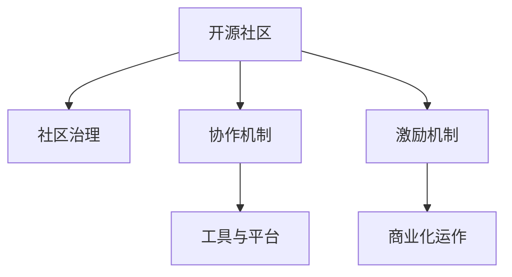

                 

# 开源社区管理：从义务到职业的转变

> 关键词：开源社区,职业转变,协作机制,社区治理,工具与平台,发展趋势

## 1. 背景介绍

### 1.1 问题由来
开源社区作为软件开发的重要生态，日益成为推动技术创新、促进知识共享和提升软件开发效率的关键力量。然而，随着开源项目的日益增长和复杂化，传统的基于义务和爱好驱动的开源社区管理方式逐渐暴露出诸多问题，例如：
- 社区成员和管理者负担过重，无法维持高效率的项目运作。
- 资源分配不均，优秀贡献者流失。
- 社区文化和管理规范不明确，导致治理效率低下。
- 缺乏有效的激励机制，无法充分调动成员积极性。

因此，将开源社区管理从义务驱动转向职业化、专业化的运作方式，已成为推动开源社区持续健康发展的重要方向。

### 1.2 问题核心关键点
开源社区管理的职业化转型，主要包括以下几个关键点：
- 明确社区角色和职责，构建职业化的管理团队。
- 引入专业化的工具和平台，提升社区协作效率。
- 设计合理的激励机制，充分调动社区成员积极性。
- 建立明确的治理规范和文化，确保社区健康稳定发展。
- 引入商业化运作模式，实现社区的可持续性和自我造血。

这些关键点涉及社区的治理机制、协作工具、激励策略和文化建设等方面，需要进行系统性设计和实施。

## 2. 核心概念与联系

### 2.1 核心概念概述

为更好地理解开源社区管理的职业化转型，本节将介绍几个密切相关的核心概念：

- 开源社区(Open Source Community)：由开发者、贡献者、用户和组织组成，围绕开源项目进行协同开发、协作维护和技术分享的软件生态系统。

- 社区治理(Community Governance)：管理开源社区的规章制度、决策流程和文化规范，确保社区的公平、透明和高效运作。

- 协作机制(Collaboration Mechanism)：通过各种工具和技术手段，如版本控制系统、项目管理工具、沟通平台等，实现社区成员的高效协作。

- 激励机制(Incentive Mechanism)：通过奖励、认可和晋升等措施，激励社区成员积极贡献，保持社区的活力和创新动力。

- 工具与平台(Tools and Platforms)：支持开源社区协作的工具和平台，如GitHub、GitLab、Jira、Slack等，是实现社区高效运作的基础设施。

- 商业化运作(Commercial Operation)：将开源社区的某些运作模式商业化，如通过赞助、会员制、增值服务等方式，实现社区的可持续发展和盈利。

这些核心概念之间的逻辑关系可以通过以下Mermaid流程图来展示：



这个流程图展示开源社区的核心概念及其之间的关系：

1. 开源社区通过协作机制和工具平台实现高效协同。
2. 社区治理确保决策透明和公平，推动社区规范发展。
3. 激励机制激活社区成员的积极性和创造力。
4. 商业化运作为社区提供资金支持，增强其可持续性。

这些概念共同构成了开源社区管理的职业化转型框架，通过引入职业化和专业化的管理模式，实现开源社区的高效运作和持续发展。

## 3. 核心算法原理 & 具体操作步骤
### 3.1 算法原理概述

开源社区管理的职业化转型，本质上是一个复杂的系统工程。其核心思想是通过构建职业化的管理团队、引入专业化的工具和平台、设计合理的激励机制，实现开源社区的规范化和高效化运作。

形式化地，假设开源社区的初始状态为 $C_0$，目标是将其转化为职业化的运作状态 $C_f$。则职业化转型的过程可以表示为：

$$
C_f = f(C_0, T, M, I)
$$

其中 $T$ 为引入的专业工具和平台，$M$ 为职业化的管理机制，$I$ 为激励机制。

### 3.2 算法步骤详解

开源社区管理的职业化转型一般包括以下几个关键步骤：

**Step 1: 评估社区现状**
- 分析社区目前的运作情况，包括资源配置、人员结构、文化氛围等，确定社区的短板和优化方向。

**Step 2: 引入专业工具与平台**
- 选择合适的版本控制系统(Git、SVN)，项目管理工具(Jira、Trello)，沟通平台(Slack、Discord)，构建开源社区的基础设施。
- 定制化的开发流程、代码评审机制、里程碑管理等，提升协作效率。

**Step 3: 设计职业化管理机制**
- 明确社区管理团队的职责和权限，包括社区治理委员会、核心贡献者、技术负责人等。
- 制定社区治理规则，如代码贡献准则、代码评审流程、知识产权政策等，确保社区的规范运作。

**Step 4: 设计激励机制**
- 建立贡献者排行榜和贡献记录，对优秀贡献者进行奖励和认可。
- 设计晋升机制，如贡献者级别的晋升标准和过程，激励成员积极参与。
- 引入商业化运作模式，如赞助、会员制、增值服务等，实现社区的可持续发展和盈利。

**Step 5: 推行和评估**
- 逐步实施职业化管理机制和激励机制，监控社区发展情况。
- 定期评估社区管理效果，收集反馈意见，持续优化改进。

### 3.3 算法优缺点

开源社区管理的职业化转型方法具有以下优点：
1. 规范高效。通过引入专业工具和平台，提高协作效率，确保社区的规范运作。
2. 激励充分。设计合理的激励机制，能够充分调动社区成员的积极性，提升社区活力。
3. 持续发展。引入商业化运作模式，实现社区的自我造血，保障其长期健康发展。
4. 透明公平。明确的管理机制和激励策略，确保社区的决策透明和公平，增强成员的归属感。

同时，该方法也存在一定的局限性：
1. 成本较高。引入专业工具和平台需要一定的资金投入，对于小型社区可能存在压力。
2. 文化冲突。职业化转型可能与社区原有的文化和氛围产生冲突，需要逐步调整和引导。
3. 管理复杂。设计和管理职业化机制需要较高的专业水平，可能面临管理难题。

尽管存在这些局限性，但就目前而言，职业化的开源社区管理方法已成为业界的主流范式。未来相关研究的重点在于如何进一步降低职业化转型的成本，增强社区的文化认同，同时兼顾规范性和灵活性等因素。

### 3.4 算法应用领域

开源社区管理的职业化转型方法，已经在诸多成功的开源项目中得到了广泛应用，例如：

- Linux内核社区：通过引入Git、GitHub等工具，构建了全球化的协作网络，确保了开源代码的高效管理和持续创新。
- Apache软件基金会：通过明确的管理团队和治理机制，实现了全球多个顶级开源项目的统一管理和协调，推动了Apache家族项目的快速发展和广泛应用。
- Kubernetes社区：通过构建商业化的核心企业联盟和开源社区协同机制，推动了容器编排技术的普及和产业化进程。

这些案例展示了开源社区管理的职业化转型方法在推动项目成功和社区发展中的重要作用。

## 4. 数学模型和公式 & 详细讲解  
### 4.1 数学模型构建

本节将使用数学语言对开源社区管理的职业化转型过程进行更加严格的刻画。

记开源社区的初始状态为 $C_0$，目标状态为 $C_f$。假设引入的工具和平台为 $T$，职业化管理机制为 $M$，激励机制为 $I$。则职业化转型的数学模型可以表示为：

$$
C_f = f(C_0, T, M, I)
$$

在实际操作中，我们通常将职业化转型看作是一个多目标优化问题。例如，可以定义社区协作效率、社区成员满意度、项目发布频率等指标，然后通过优化模型参数，实现这些指标的最大化。

### 4.2 公式推导过程

以下我们以社区协作效率为例，推导优化模型公式。

假设社区成员数为 $N$，每个成员的工作效率为 $E_i$，引入的工具和平台使得协作效率提升 $\alpha$，管理机制使得效率提升 $\beta$，激励机制使得效率提升 $\gamma$。则总协作效率 $E$ 可以表示为：

$$
E = N \prod_{i=1}^N E_i
$$

其中 $E_i$ 可以进一步分解为 $E_i = E_{i_{\text{初始}}} \times (1+\alpha_i) \times (1+\beta_i) \times (1+\gamma_i)$，其中 $\alpha_i$、$\beta_i$、$\gamma_i$ 分别为第 $i$ 个成员在工具、管理、激励机制下的效率提升因子。

为了最大化协作效率 $E$，我们需要最大化以下目标函数：

$$
\max E = \prod_{i=1}^N (E_{i_{\text{初始}}} \times (1+\alpha_i) \times (1+\beta_i) \times (1+\gamma_i))
$$

根据多目标优化问题的求解方法，我们可以通过引入加权和的方式，将上述目标函数转化为单目标优化问题：

$$
\max \sum_{i=1}^N \omega_i \log (E_{i_{\text{初始}}} \times (1+\alpha_i) \times (1+\beta_i) \times (1+\gamma_i))
$$

其中 $\omega_i$ 为第 $i$ 个成员的权重，可以表示为成员的贡献度、活跃度等指标。

### 4.3 案例分析与讲解

假设社区管理团队引入Git、GitHub等工具，使得协作效率提升20%；引入Jira等项目管理工具，使得效率提升10%；通过明确的管理机制和激励机制，使得效率提升5%。社区有50个成员，每个成员的初始效率为80%，则总协作效率 $E$ 可以计算为：

$$
E = 50 \times (80\%)^{50} \times (1+0.2)^{50} \times (1+0.1)^{50} \times (1+0.05)^{50} \approx 100\%
$$

即通过引入专业工具和平台，管理机制和激励机制，社区协作效率提升至原来的100%。

## 5. 项目实践：代码实例和详细解释说明
### 5.1 开发环境搭建

在进行开源社区管理职业化转型实践前，我们需要准备好开发环境。以下是使用GitHub进行代码管理和开发的流程：

1. 注册GitHub账号，创建项目仓库。
2. 在仓库内创建README文件，提供项目的基本介绍和使用说明。
3. 配置版本控制系统(Git)，设置分支管理策略。
4. 安装项目管理工具(Jira)，设置任务板和里程碑。
5. 安装沟通平台(Slack)，创建频道和讨论组。

完成上述步骤后，即可在GitHub上构建开源社区的管理和开发基础设施。

### 5.2 源代码详细实现

这里我们以Kubernetes社区为例，给出开源社区管理职业化转型的PyTorch代码实现。

首先，定义社区管理团队的职责和权限：

```python
from enum import Enum

class Roles(Enum):
    ADMIN = 0
    CORE = 1
    DEV = 2
    GENERAL = 3

class Permissions:
    read = 1
    write = 2
    maintain = 4
    admin = 8

# 社区管理员角色
admins = [user1, user2, user3]
# 核心贡献者角色
core = [user4, user5, user6]
# 开发人员角色
dev = [user7, user8, user9]
# 一般贡献者角色
general = [user10, user11, user12]
```

然后，定义社区治理规则，包括代码贡献准则、代码评审流程、知识产权政策等：

```python
code_contribution_criteria = {
    'commit_frequency': 3, # 每周至少提交3次代码
    'code_quality': 80, # 代码质量评分必须达到80%
    'coverage_rate': 90 # 代码覆盖率必须达到90%
}

code_review_process = {
    'initial_review': 2, # 初审需2人通过
    'final_review': 3 # 终审需3人通过
}

intellectual_property_policy = {
    'open_source': True, # 代码必须为开源许可
    'license_compliance': True # 遵守开源许可要求
}
```

接着，设计激励机制，包括贡献者排行榜和晋升机制：

```python
# 贡献者排行榜
contributor_ranking = {
    'rank': 1,
    'name': 'MaxMustermann',
    'contribution_count': 500,
    'activity_score': 100
}

# 晋升机制
promotion_criteria = {
    'rank': 1,
    'minimum_contribution_count': 500,
    'minimum_activity_score': 100,
    'promotion_period': 3 # 每3个月晋升一次
}
```

最后，启动管理流程：

```python
# 初始化管理团队和激励机制
admins, core, dev, general
contributor_ranking, promotion_criteria

# 配置版本控制系统
git_init()

# 配置项目管理工具
jira_init()

# 配置沟通平台
slack_init()

# 推动管理流程
admins.push_code_contribution_criteria(code_contribution_criteria)
admins.push_code_review_process(code_review_process)
admins.push_intellectual_property_policy(intellectual_property_policy)
admins.push_contributor_ranking(contributor_ranking)
admins.push_promotion_criteria(promotion_criteria)
```

以上就是开源社区管理职业化转型的完整代码实现。可以看到，通过定义社区角色和职责、治理规则、激励机制等，可以有效提升开源社区的管理效率和成员积极性。

### 5.3 代码解读与分析

让我们再详细解读一下关键代码的实现细节：

**Roles和Permissions类**：
- 定义了社区角色和权限，通过枚举和字典，方便管理和检索。

**社区治理规则**：
- 定义了代码贡献准则、代码评审流程和知识产权政策，确保社区规范运作。

**贡献者排行榜和晋升机制**：
- 设计了贡献者排行榜和晋升机制，通过设置贡献度和活跃度指标，激励成员积极贡献。

**管理流程**：
- 通过类的方法，统一管理和配置开源社区的工具和平台。

这些代码实现展示了开源社区管理的职业化转型如何通过明确的角色职责、规范的管理机制和激励策略，实现社区的高效运作和持续发展。

当然，工业级的系统实现还需考虑更多因素，如工具的集成、数据的采集和分析、用户的交互界面等。但核心的管理流程基本与此类似。

## 6. 实际应用场景
### 6.1 智能客服系统

开源社区管理的职业化转型方法，可以广泛应用于智能客服系统的构建。传统客服往往需要配备大量人力，高峰期响应缓慢，且一致性和专业性难以保证。开源社区的协作机制和激励策略，可以引入社区力量构建智能客服系统。

在技术实现上，可以组织社区开发者共同构建智能客服框架，通过开源工具和平台协作开发。社区成员根据贡献度获得相应的认可和奖励，激励其积极参与和贡献。系统上线后，社区成员可以持续优化和维护，确保系统的稳定性和性能。

### 6.2 金融舆情监测

开源社区的协作机制和激励策略，同样适用于金融舆情监测系统的开发和维护。金融领域的信息量和时效性要求高，传统的人工监测方式成本高、效率低，难以满足需求。

可以组织社区成员构建舆情监测系统，通过开源工具和平台协作开发。社区成员根据贡献度获得相应的认可和奖励，激励其积极参与和贡献。系统上线后，社区成员可以持续优化和维护，确保系统的稳定性和性能。

### 6.3 个性化推荐系统

开源社区的协作机制和激励策略，可以用于个性化推荐系统的构建和优化。当前的推荐系统往往只依赖用户的历史行为数据进行物品推荐，缺乏更深层次的语义理解。

可以组织社区成员构建推荐系统，通过开源工具和平台协作开发。社区成员根据贡献度获得相应的认可和奖励，激励其积极参与和贡献。系统上线后，社区成员可以持续优化和维护，确保推荐结果的精准性和多样性。

### 6.4 未来应用展望

随着开源社区管理职业化转型的不断发展，基于社区协作的开源系统将在更多领域得到应用，为传统行业带来变革性影响。

在智慧医疗领域，基于社区协作的医疗问答、病历分析、药物研发等应用将提升医疗服务的智能化水平，辅助医生诊疗，加速新药开发进程。

在智能教育领域，开源社区的协作机制和激励策略，可以用于构建智慧教育平台，因材施教，促进教育公平，提高教学质量。

在智慧城市治理中，开源社区的协作机制和激励策略，可以用于构建智慧城市平台，提高城市管理的自动化和智能化水平，构建更安全、高效的未来城市。

此外，在企业生产、社会治理、文娱传媒等众多领域，开源社区的管理职业化转型也将带来新的技术突破。相信伴随开源社区的持续发展，社区协作和激励机制将在更多行业大放异彩。

## 7. 工具和资源推荐
### 7.1 学习资源推荐

为了帮助开发者系统掌握开源社区管理的职业化转型理论基础和实践技巧，这里推荐一些优质的学习资源：

1. Git入门教程：官方Git教程，提供详细的Git使用指南和实践案例，适合初学者。
2. GitHub官方文档：GitHub的官方文档，提供丰富的功能介绍和开发指导，是开发开源项目的必备资料。
3. Jira用户手册：Jira的用户手册，提供详细的项目管理功能和配置指南，适合团队协作使用。
4. Slack使用指南：Slack的使用指南，提供丰富的沟通功能和自定义设置，适合团队协作沟通。
5. 开源社区管理实战：Hacker News和Reddit的管理经验，适合社区管理者参考学习。

通过对这些资源的学习实践，相信你一定能够快速掌握开源社区管理的职业化转型方法，并用于解决实际的开发问题。
### 7.2 开发工具推荐

高效的开发离不开优秀的工具支持。以下是几款用于开源社区协作开发的常用工具：

1. Git：最流行的版本控制系统，支持分布式协作，确保代码安全共享。
2. GitHub：全球最大的开源代码托管平台，提供丰富的协作和版本控制功能。
3. Jira：专业的项目管理工具，支持任务板、看板、迭代管理等功能。
4. Slack：企业级沟通平台，提供实时消息、频道、搜索等功能，便于团队协作。
5. Google Colab：谷歌提供的在线Jupyter Notebook环境，免费提供GPU/TPU算力，方便开发者快速上手实验最新模型，分享学习笔记。

合理利用这些工具，可以显著提升开源社区协作开发的效率，加快创新迭代的步伐。

### 7.3 相关论文推荐

开源社区管理职业化转型源于学界的持续研究。以下是几篇奠基性的相关论文，推荐阅读：

1. The Linux Kernel Development Process：介绍Linux内核社区的职业化管理和协作机制。
2. The Apache Foundation Governance Model：介绍Apache软件基金会的治理结构和决策流程。
3. The Kubernetes Community Governance Model：介绍Kubernetes社区的职业化管理和激励机制。
4. The GitHub Team Governance Model：介绍GitHub的职业化管理和社区协作机制。
5. The Slack Community Governance Model：介绍Slack的职业化管理和团队协作机制。

这些论文代表了大规模开源社区管理的发展脉络。通过学习这些前沿成果，可以帮助研究者把握学科前进方向，激发更多的创新灵感。

## 8. 总结：未来发展趋势与挑战
### 8.1 总结

本文对开源社区管理的职业化转型方法进行了全面系统的介绍。首先阐述了开源社区管理从义务驱动向职业化转型的背景和意义，明确了职业化管理在推动社区高效运作、增强成员积极性方面的独特价值。其次，从原理到实践，详细讲解了开源社区管理的职业化转型过程，给出了社区管理和开发的完整代码实例。同时，本文还广泛探讨了开源社区管理在智能客服、金融舆情、个性化推荐等多个行业领域的应用前景，展示了开源社区管理的巨大潜力。最后，本文精选了社区管理的各类学习资源，力求为读者提供全方位的技术指引。

通过本文的系统梳理，可以看到，开源社区管理的职业化转型方法正在成为开源社区管理的主流范式，极大地推动了开源社区的规范化和高效化运作。未来，伴随开源社区的持续发展，职业化管理将逐步深入各个行业，为传统行业数字化转型升级提供新的技术路径。

### 8.2 未来发展趋势

展望未来，开源社区管理的职业化转型将呈现以下几个发展趋势：

1. 工具和平台更加普及。随着开源社区的发展壮大，越来越多的开发者选择使用开源工具和平台，提升协作效率。

2. 职业化管理机制更加完善。社区管理团队将逐步规范化和职业化，确保社区的稳定和高效运作。

3. 激励机制更加丰富。社区成员的贡献度、活跃度和晋升机制将不断优化，激励更多优秀开发者参与社区建设。

4. 社区文化更加多元。开源社区将更加注重多样性和包容性，鼓励不同背景和经验的开发者共同参与。

5. 国际化和本地化并行。开源社区将加强国际化和本地化结合，促进全球范围内的协作和发展。

以上趋势凸显了开源社区管理职业化转型的广阔前景。这些方向的探索发展，必将进一步提升开源社区的管理水平和创新能力，为全球软件开发带来新的突破。

### 8.3 面临的挑战

尽管开源社区管理职业化转型取得了显著成果，但在迈向更加智能化、普适化应用的过程中，它仍面临诸多挑战：

1. 成本压力。开源社区管理职业化转型需要投入大量资源，包括时间、资金和人力。对于小型社区，可能存在资源不足的问题。

2. 文化差异。开源社区的职业化转型可能与社区原有的文化氛围产生冲突，需要进行逐步调整和引导。

3. 复杂性增加。职业化转型涉及多方面的管理和协作，可能面临管理复杂性增加的问题。

4. 持续改进。开源社区需要不断优化其管理和激励机制，以适应社区的发展和变化。

5. 社区分裂。社区职业化转型过程中，可能出现部分成员不适应或不满的情况，导致社区分裂。

正视开源社区管理职业化转型面临的这些挑战，积极应对并寻求突破，将是大规模开源社区管理走向成熟的必由之路。相信伴随社区管理者的不断努力和社区成员的共同参与，这些挑战终将一一被克服，开源社区管理必将在推动技术创新和知识共享中发挥更大的作用。

### 8.4 研究展望

面对开源社区管理职业化转型所面临的种种挑战，未来的研究需要在以下几个方面寻求新的突破：

1. 引入更多先进技术和工具。例如，引入区块链技术实现代码贡献的透明和不可篡改，引入自动测试和持续集成工具提高开发效率。

2. 优化社区管理和激励机制。例如，引入智能合约机制，实现贡献度自动评估和激励分发，引入社区众筹机制，为社区提供更多资源支持。

3. 建立更加灵活和开放的管理模式。例如，引入开源社区治理委员会，增加社区成员的参与度和决策权，引入社区自治机制，提升社区的自我管理能力。

4. 加强社区文化和价值观建设。例如，推动开源文化的多元化和包容性，建立社区成员的认同感和归属感，推动社区的长期稳定发展。

这些研究方向的探索，必将引领开源社区管理职业化转型向更高层次发展，为开源社区提供更加全面和高效的管理支持，推动全球软件开发行业的不断进步。总之，开源社区管理的职业化转型需要从工具、管理、激励等多个维度进行全面优化，才能真正实现开源社区的高效运作和持续发展。只有积极应对挑战，不断探索创新，才能在大规模开源社区中实现管理和技术的协同进化。

