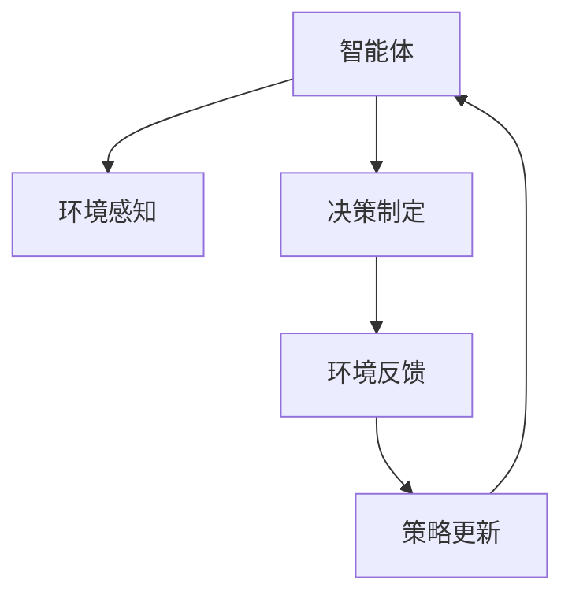
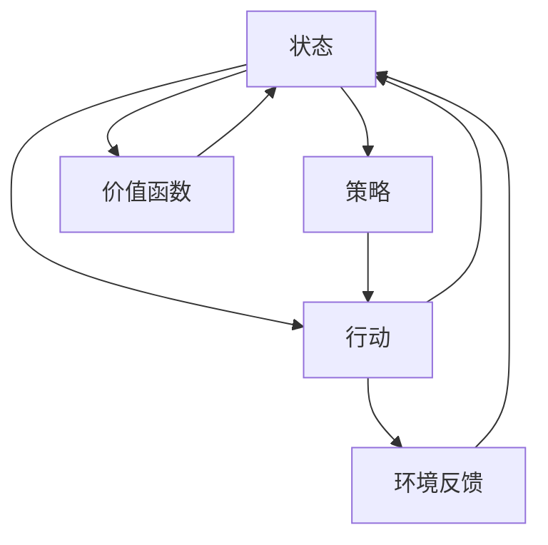

                 

## 1. 背景介绍

### 1.1 问题由来

强化学习 (Reinforcement Learning, RL) 是机器学习 (Machine Learning, ML) 领域中一门重要的分支，主要用于解决决策问题，在机器人控制、自动驾驶、游戏 AI 等领域中取得了显著的成果。与监督学习和无监督学习不同的是，强化学习更加关注智能体 (Agent) 在动态环境中的长期收益，而非短期的误差最小化。

在强化学习中，智能体通过与环境的交互，不断学习最优策略以获得最大化的累计奖励。这种学习过程往往涉及到大量的探索和试错，因而需要精心设计算法和策略，以确保智能体能够在复杂和多变的环境中迅速适应并取得最优的决策效果。

### 1.2 问题核心关键点

强化学习的核心在于智能体如何在不确定的环境中，通过与环境的交互，学习最优策略以最大化长期奖励。这一过程通常包括四个关键环节：

- 环境感知：智能体观察当前环境的状态，生成状态表示。
- 决策制定：基于当前状态和历史经验，智能体选择一种行动方案。
- 环境反馈：执行行动后，环境根据智能体的选择给出相应的反馈，包括新状态和奖励。
- 策略更新：根据反馈信息，智能体更新自身的策略，即调整行动选择的方式。

强化学习的目标在于通过这些环节的循环迭代，找到使智能体长期累积奖励最大的策略。

## 2. 核心概念与联系

### 2.1 核心概念概述

为更好地理解强化学习的基础框架和核心概念，本节将介绍几个紧密相关的关键概念：

- 智能体 (Agent)：在强化学习中，智能体是自主决策的主体，它通过感知环境状态，选择行动，并根据环境的反馈不断调整策略。

- 环境 (Environment)：智能体操作的对象，包括当前状态、奖励、下一状态等元素。环境向智能体提供信息，根据智能体的行动做出响应，并给出反馈。

- 状态 (State)：智能体感知环境的状态表示，通常用于描述环境的关键特征。状态可以是离散的，也可以是连续的，具体形式由应用场景和模型设计决定。

- 行动 (Action)：智能体可以选择的特定行为，行动可以是离散的（如0, 1, 2）也可以是连续的（如(0.1, 0.2, 0.3））。

- 奖励 (Reward)：环境对智能体行动的即时反馈，通常奖励是一个数值，用来衡量智能体选择的行动的好坏。

- 策略 (Policy)：智能体决策的策略函数，定义了在特定状态下选择行动的概率分布。策略可以显式地给出（如确定性策略），也可以隐式地表示（如概率策略）。

- 价值函数 (Value Function)：用于评估策略的表现，通常分为状态价值函数和动作价值函数。价值函数可以提供对策略优化有帮助的信息，是强化学习算法设计的重要组成部分。

这些核心概念之间的逻辑关系可以通过以下 Mermaid 流程图来展示：



该流程图展示了强化学习的基本流程：

1. 智能体感知当前环境状态。
2. 智能体根据状态和策略选择行动。
3. 环境根据智能体的行动反馈新的状态和奖励。
4. 智能体根据反馈更新策略。

这些概念共同构成了强化学习的基本框架，为智能体在动态环境中学习最优策略提供了理论基础。

### 2.2 核心概念原理和架构的 Mermaid 流程图



通过这个流程图，我们能够更加直观地理解强化学习中的核心组件和数据流。

## 3. 核心算法原理 & 具体操作步骤

### 3.1 算法原理概述

强化学习算法设计的核心在于定义智能体与环境之间的交互，并通过一定的方式更新智能体的策略，以最大化长期奖励。常见的强化学习算法包括：

- 基于值 (Value-based)：如Q-learning、SARSA、蒙特卡洛方法等，通过估计状态或动作价值函数来指导智能体的决策。
- 基于策略 (Policy-based)：如策略梯度方法、演员-评论者 (Actor-Critic) 算法等，直接优化策略函数，使之能够选择最优行动。
- 混合方法：如强化学习-策略优化 (Reinforcement Learning with Policy Optimization) 算法，结合了值函数和策略函数的优点。

这些算法虽然在形式上有所不同，但都试图通过不断地探索和试错，找到最优策略。

### 3.2 算法步骤详解

典型的强化学习算法通常包括以下几个关键步骤：

**Step 1: 环境建模与初始化**

- 建立环境模型：定义环境的状态空间、行动空间、奖励函数、状态转移概率等。
- 初始化环境：创建环境实例，并设置初始状态。

**Step 2: 智能体感知与决策**

- 智能体感知当前状态：根据环境的反馈获取当前状态。
- 选择行动：根据当前状态和策略选择行动。

**Step 3: 环境反馈与策略更新**

- 执行行动并接收反馈：将选择的行动提交给环境，环境返回新状态和奖励。
- 策略更新：根据新状态和奖励，使用一定的方式更新智能体的策略。

**Step 4: 迭代循环**

- 重复步骤2和步骤3，直到达到终止条件。

### 3.3 算法优缺点

强化学习的优缺点如下：

**优点：**
- 处理非结构化数据：强化学习能够处理各种类型的数据，包括文本、图像、语音等，具有很强的泛化能力。
- 模型自适应：通过与环境的交互，智能体能够自我学习和适应新环境，无需人工干预。
- 策略优化：强化学习能够找到全局最优策略，而非局部最优解，具有很强的探索能力。

**缺点：**
- 数据效率低：强化学习需要大量的交互数据，才能获得良好的性能。
- 复杂性高：强化学习算法设计复杂，需要大量的工程实践和调试。
- 稳定性差：在复杂环境中，智能体的策略可能会发生不稳定，导致性能波动。

尽管存在这些局限性，但强化学习仍然是解决复杂决策问题的有力工具，其应用领域日益广泛。

### 3.4 算法应用领域

强化学习已经在多个领域取得了显著的成果，包括：

- 机器人控制：如四足机器人、无人机、自动驾驶汽车等，通过强化学习实现路径规划、避障等决策。
- 游戏AI：如围棋、星际争霸、Dota2等游戏中的AI玩家，通过强化学习实现高水平的游戏策略。
- 金融交易：如自动交易系统、风险管理等，通过强化学习优化交易策略，提高盈利能力。
- 自然语言处理：如聊天机器人、自动摘要、机器翻译等，通过强化学习优化模型结构，提升任务性能。
- 医疗健康：如药物设计、疾病诊断等，通过强化学习优化模型参数，提高诊断和治疗效果。

这些应用领域展示了强化学习的强大潜力和广泛适用性。

## 4. 数学模型和公式 & 详细讲解 & 举例说明

### 4.1 数学模型构建

强化学习的数学模型通常包括以下几个关键元素：

- 状态空间 $S$：环境可能的状态集合。
- 行动空间 $A$：智能体可能采取的行动集合。
- 奖励函数 $R(s, a)$：在状态 $s$ 下执行行动 $a$ 的即时奖励。
- 状态转移概率 $P(s' | s, a)$：在状态 $s$ 下执行行动 $a$ 后，到达新状态 $s'$ 的概率。

定义智能体的策略 $\pi(a|s)$：在状态 $s$ 下选择行动 $a$ 的概率分布。

### 4.2 公式推导过程

强化学习的核心在于求解最优策略 $\pi^*$，使得长期累积奖励最大化。这可以通过定义价值函数来实现，具体公式如下：

**状态价值函数 $V^{\pi}(s)$**：

$$
V^{\pi}(s) = \mathbb{E}\left[\sum_{t=0}^{\infty} \gamma^t R(s_t, a_t) | s_0 = s\right]
$$

其中 $\gamma$ 为折扣因子，$R(s_t, a_t)$ 为在状态 $s_t$ 下执行行动 $a_t$ 的即时奖励。

**动作价值函数 $Q^{\pi}(s, a)$**：

$$
Q^{\pi}(s, a) = \mathbb{E}\left[\sum_{t=0}^{\infty} \gamma^t R(s_t, a_t) | s_0 = s, a_0 = a\right]
$$

状态价值函数和动作价值函数描述了在特定状态和行动下的长期奖励。

### 4.3 案例分析与讲解

假设有一个简单的小球弹跳系统，其中状态 $s$ 表示小球的位置 $(x, y)$，行动 $a$ 为向上、向下、向左、向右四个方向，奖励 $R$ 为小球到达边界时的正奖励。

设 $V^{\pi}(x, y)$ 为小球在位置 $(x, y)$ 下，策略 $\pi$ 的长期累积奖励。通过计算得到：

$$
V^{\pi}(x, y) = \sum_{a \in \text{动作集}} \pi(a|x, y) \left[ R(x, y, a) + \gamma \sum_{s' \in \text{状态集}} P(s'|x, y, a) V^{\pi}(s') \right]
$$

其中 $R(x, y, a)$ 为在位置 $(x, y)$ 下执行行动 $a$ 的即时奖励，$P(s'|x, y, a)$ 为小球移动到新位置 $s'$ 的概率。

通过不断迭代上述公式，可以计算出最优策略 $\pi^*$，使得长期累积奖励最大化。

## 5. 项目实践：代码实例和详细解释说明

### 5.1 开发环境搭建

在进行强化学习项目实践前，我们需要准备好开发环境。以下是使用Python进行OpenAI Gym开发的环境配置流程：

1. 安装Anaconda：从官网下载并安装Anaconda，用于创建独立的Python环境。

2. 创建并激活虚拟环境：
```bash
conda create -n reinforcement-env python=3.8 
conda activate reinforcement-env
```

3. 安装OpenAI Gym：
```bash
pip install gym
```

4. 安装相关库：
```bash
pip install numpy scipy matplotlib
```

完成上述步骤后，即可在`reinforcement-env`环境中开始强化学习实践。

### 5.2 源代码详细实现

这里以Q-learning算法为例，实现一个简单的抓取游戏（CartPole-v1）。

```python
import gym
import numpy as np

env = gym.make('CartPole-v1')

# 初始化智能体参数
learning_rate = 0.1
discount_factor = 0.99
num_episodes = 1000

# 初始化策略
strategy = np.random.rand(env.observation_space.shape[0])

# 定义Q-learning算法
def q_learning(env, strategy, num_episodes, learning_rate, discount_factor):
    for i in range(num_episodes):
        state = env.reset()
        done = False
        while not done:
            action = np.random.choice(env.action_space.n, p=strategy)
            next_state, reward, done, _ = env.step(action)
            old_strategy = strategy.copy()
            strategy[state] = (1 - learning_rate) * strategy[state] + learning_rate * (reward + discount_factor * np.max(strategy[next_state]))
            state = next_state
    return strategy

# 执行Q-learning算法
strategy = q_learning(env, strategy, num_episodes, learning_rate, discount_factor)
```

以上代码实现了基本的Q-learning算法，通过与环境不断交互，更新策略以最大化长期奖励。

### 5.3 代码解读与分析

**Q-learning算法**：
- `gym.make('CartPole-v1')`：创建了一个简单的抓取游戏环境。
- `strategy = np.random.rand(env.observation_space.shape[0])`：初始化策略，以随机的方式选择行动。
- `q_learning`函数：实现了Q-learning算法的核心流程，包括行动选择、状态更新和策略更新。
- `strategy[state] = (1 - learning_rate) * strategy[state] + learning_rate * (reward + discount_factor * np.max(strategy[next_state]))`：Q-learning的核心更新公式，通过环境反馈计算新状态下的Q值，并根据学习率调整策略。
- `strategy`变量：存储当前最优策略。

**智能体策略的更新**：
在每次迭代中，智能体根据当前状态和策略选择行动，并根据环境反馈计算Q值。Q值代表了在当前状态下选择每个行动的长期累积奖励。Q-learning算法通过不断更新Q值，逐步调整策略，使智能体能够最大化长期奖励。

## 6. 实际应用场景

### 6.1 机器人控制

强化学习在机器人控制领域具有广阔的应用前景。例如，通过强化学习，机器人可以学习最优的控制策略，实现精确的路径规划、避障等任务。

在实践中，可以将机器人置于复杂的环境中，通过与环境的交互，逐步学习到最优的控制策略。强化学习算法可以帮助机器人快速适应新环境，并根据不同的任务需求进行策略优化，提升控制精度和响应速度。

### 6.2 自动驾驶

自动驾驶技术是强化学习的重要应用领域之一。通过与环境的交互，自动驾驶车辆可以学习最优的驾驶策略，实现高效、安全的行驶。

在自动驾驶中，强化学习可以帮助车辆学习到复杂的交通规则和行为模式，优化路径规划和速度控制。同时，强化学习算法还可以处理动态的交通情况，提高车辆的鲁棒性和适应性。

### 6.3 金融交易

在金融交易中，强化学习可以用于优化交易策略，提高盈利能力。例如，通过强化学习，交易系统可以学习到最优的交易时机和操作策略，实现资产的高效配置。

在实践中，可以将交易系统的历史数据作为环境反馈，通过强化学习优化交易策略，最大化长期收益。同时，强化学习还可以结合市场动态，实时调整交易策略，提升交易系统的灵活性和适应性。

### 6.4 自然语言处理

在自然语言处理领域，强化学习可以用于优化模型结构和参数，提升任务性能。例如，通过强化学习，模型可以学习到最优的文本生成策略，实现高水平的文本生成和摘要。

在实践中，可以将文本生成任务作为环境，通过强化学习优化模型参数，提高生成质量。同时，强化学习还可以结合语义分析等任务，提升模型的全面性和鲁棒性。

## 7. 工具和资源推荐

### 7.1 学习资源推荐

为了帮助开发者系统掌握强化学习的理论基础和实践技巧，这里推荐一些优质的学习资源：

1. 《强化学习：理论与算法》（Reinforcement Learning: Theory and Algorithms）：由Richard S. Sutton和Andrew G. Barto合著的经典教材，全面介绍了强化学习的理论基础和主要算法。
2. 《深度强化学习》（Deep Reinforcement Learning）：由Ian Goodfellow等人编写，介绍了深度学习与强化学习的结合，提供了最新的强化学习应用案例。
3. Udacity的《强化学习》课程：由Google Brain的工程师授课，结合实际案例讲解强化学习的原理和应用。
4 OpenAI的强化学习手册：OpenAI官方提供的强化学习资源，包括教程、代码和论文，是学习强化学习的极佳起点。
5 DeepRide的Reinforcement Learning for Autonomous Vehicles：DeepRide团队开发的强化学习平台，展示了如何在自动驾驶领域应用强化学习。

通过对这些资源的学习实践，相信你一定能够快速掌握强化学习的精髓，并用于解决实际的决策问题。

### 7.2 开发工具推荐

高效的开发离不开优秀的工具支持。以下是几款用于强化学习开发的常用工具：

1. OpenAI Gym：用于模拟和实验各种环境，是强化学习研究和应用的主要工具。
2. TensorFlow和PyTorch：支持深度学习和强化学习，提供了强大的计算能力和丰富的库函数。
3. RLlib：Facebook AI Research开发的强化学习库，提供了多种算法和工具，方便开发者进行模型训练和评估。
4. JAX和Haiku：谷歌开发的深度学习框架，支持动态图和高效的自动微分，适用于大规模强化学习任务。
5. Ray：用于分布式计算的框架，支持强化学习算法的大规模并行训练，提高训练效率。

合理利用这些工具，可以显著提升强化学习的开发效率，加快创新迭代的步伐。

### 7.3 相关论文推荐

强化学习的发展离不开学界的持续研究。以下是几篇奠基性的相关论文，推荐阅读：

1. 强化学习：一个问题框架（Reinforcement Learning: An Introduction）：由Richard S. Sutton和Andrew G. Barto合著的经典教材，介绍了强化学习的核心概念和主要算法。
2. Q-learning：一种以强化学习为基础的决策算法（Q-Learning）：由Christopher J. C. H. Watkins等人发表的经典论文，提出了Q-learning算法。
3 深度强化学习（Deep Reinforcement Learning）：由Ian Goodfellow等人发表的论文，介绍了深度学习和强化学习的结合，提供了最新的强化学习应用案例。
4 强化学习与深度学习：一个收敛性分析（Convergence of Q-learning in a Stochastic Environment）：由David Silver等人发表的论文，研究了强化学习算法的收敛性问题。
5 AlphaGo Zero：一个通过自我对弈进行强化学习的AI系统：由DeepMind团队发表的论文，展示了强化学习在游戏AI领域的应用。

这些论文代表了大强化学习的发展脉络。通过学习这些前沿成果，可以帮助研究者把握学科前进方向，激发更多的创新灵感。

## 8. 总结：未来发展趋势与挑战

### 8.1 总结

本文对强化学习的基础知识进行了全面系统的介绍。首先阐述了强化学习的背景和核心概念，明确了强化学习在动态环境中优化策略的价值。其次，从原理到实践，详细讲解了强化学习的数学模型和核心算法，给出了具体的代码实例和分析。同时，本文还探讨了强化学习在机器人控制、自动驾驶、金融交易、自然语言处理等多个领域的应用前景，展示了强化学习的强大潜力和广泛适用性。

通过本文的系统梳理，可以看到，强化学习作为解决复杂决策问题的有力工具，已经在多个领域取得了显著的成果。未来，伴随强化学习算法的不断演进和优化，相信其应用范围和性能将进一步拓展，为解决更加复杂的决策问题提供有力的支持。

### 8.2 未来发展趋势

展望未来，强化学习的趋势如下：

1. 深度强化学习：随着深度学习技术的发展，强化学习也将更加深入地结合深度学习，提高模型的复杂性和性能。

2. 多智能体学习：多智能体学习是强化学习的重要研究方向，通过多个智能体的协同决策，可以实现更加复杂的系统优化。

3. 元强化学习：元强化学习研究如何通过学习通用的策略更新方法，快速适应新环境和新任务，是强化学习的重要突破方向。

4. 分布式强化学习：分布式强化学习研究如何将强化学习算法应用于大规模分布式系统中，提高训练效率和模型性能。

5. 强化学习在生成对抗网络（GANs）中的应用：强化学习与生成对抗网络结合，可以生成更加逼真和多样化的数据。

这些趋势凸显了强化学习领域的广阔前景，其应用和理论研究将不断拓展，为人工智能技术的进一步发展提供新的突破点。

### 8.3 面临的挑战

尽管强化学习已经取得了许多突破，但在迈向更加智能化、普适化应用的过程中，仍然面临许多挑战：

1. 数据效率低：强化学习需要大量的交互数据，才能获得良好的性能。对于复杂环境和任务，数据获取成本较高，需要大量时间和资源。

2. 学习速度慢：在复杂环境中，智能体的策略学习过程较慢，需要大量的迭代和优化。

3. 稳定性差：在复杂环境中，智能体的策略可能会发生不稳定，导致性能波动。

4. 模型复杂度高：强化学习算法设计复杂，需要大量的工程实践和调试。

5. 安全性问题：强化学习模型可能会学习到有害的行为，需要加强模型训练过程中的监督和约束。

6. 资源消耗大：强化学习训练过程需要大量的计算资源和存储空间，需要合理的资源分配和优化。

7. 可解释性不足：强化学习模型往往是一个"黑盒"系统，难以解释其内部工作机制和决策逻辑。

这些挑战凸显了强化学习的复杂性和研究难度，但正是这些挑战催生了许多新的研究方向和突破。

### 8.4 研究展望

面对强化学习所面临的挑战，未来的研究需要在以下几个方面寻求新的突破：

1. 改进数据生成技术：采用自适应生成技术，加速数据生成过程，提高数据效率。

2. 优化算法设计：研究新的算法，提高学习速度和稳定性，减少训练时间。

3. 引入外部知识：通过外部知识指导模型训练，提高模型的泛化能力和可解释性。

4. 构建多智能体系统：研究多智能体学习，实现更复杂的协同决策。

5. 设计新的分布式算法：研究新的分布式强化学习算法，提高训练效率和模型性能。

6. 提升模型的安全性：引入安全性约束，确保模型不会学习有害行为。

这些研究方向的探索，必将引领强化学习技术迈向更高的台阶，为构建更加智能化、普适化的智能系统铺平道路。只有勇于创新、敢于突破，才能不断拓展强化学习的边界，让智能技术更好地造福人类社会。

## 9. 附录：常见问题与解答

**Q1：强化学习中的奖励函数如何设置？**

A: 奖励函数的设定是强化学习的重要环节，它决定了智能体的行为目标和策略优化方向。设定奖励函数时，需要考虑以下因素：

1. 任务目标：设定与任务目标相关的奖励函数，确保智能体的行为能够实现任务目标。

2. 奖励稀疏性：设定适当的奖励稀疏性，避免智能体行为过多关注即时奖励，而忽略长期奖励。

3. 奖励设计：设计合理的奖励函数，确保奖励能够激励智能体做出正确的决策。

**Q2：如何判断强化学习算法的收敛性？**

A: 判断强化学习算法的收敛性通常需要分析算法的收敛条件。以下是常见的几种方法：

1. 收敛定理：通过数学定理分析算法的收敛性，例如Q-learning的收敛定理表明，在一定的学习率条件下，Q-learning算法能够收敛到最优策略。

2. 实验验证：通过实验验证算法的收敛性，例如在一定数量的迭代后，观察智能体的策略变化情况，确保策略收敛到最优。

3. 收敛速度：分析算法的收敛速度，例如使用收敛速度来衡量算法的收敛效率。

**Q3：强化学习中的状态空间如何设计？**

A: 状态空间的设计是强化学习的重要环节，它决定了智能体的感知能力和决策策略。以下是常见的几种方法：

1. 简化状态表示：通过降维等技术简化状态空间，提高算法的计算效率。

2. 引入外部信息：结合外部信息，设计更加全面的状态表示，提升智能体的感知能力。

3. 自适应状态表示：根据任务需求，自适应地调整状态空间，提高模型的适应性。

**Q4：强化学习中的策略如何设计？**

A: 策略的设计是强化学习的重要环节，它决定了智能体的行为策略。以下是常见的几种方法：

1. 随机策略：通过随机选择行动，探索不同的策略空间。

2. 确定性策略：通过预先定义策略函数，确定智能体的行动选择。

3. 优化策略：通过优化算法，调整策略函数，提升智能体的行为性能。

**Q5：强化学习中的环境如何构建？**

A: 环境的构建是强化学习的重要环节，它决定了智能体的行为空间和奖励机制。以下是常见的几种方法：

1. 模拟环境：通过模拟环境，实现对复杂环境的控制和测试。

2. 真实环境：在真实环境中，获取智能体的行为数据，优化策略。

3. 半真实环境：结合模拟环境和真实环境，实现对复杂环境的测试和优化。

通过这些问题的解答，可以帮助读者更好地理解强化学习的基础知识和应用实践，为解决实际的决策问题提供参考和指导。

---

作者：禅与计算机程序设计艺术 / Zen and the Art of Computer Programming

