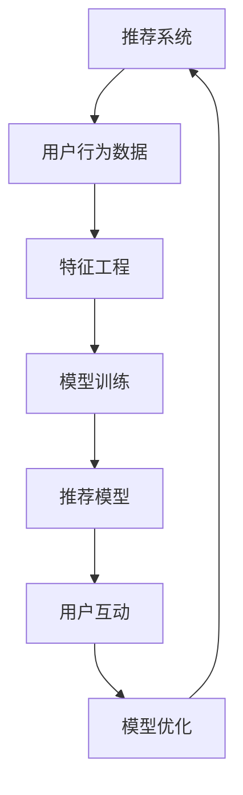

                 

# 微软的AI战略：对推荐系统的影响

> 关键词：微软AI战略,推荐系统,算法优化,机器学习,深度学习,个性化推荐

## 1. 背景介绍

随着人工智能技术的飞速发展，各大科技巨头纷纷在AI领域投入重金，制定了各自的长远战略布局。微软作为全球领先的技术公司，其AI战略也备受瞩目。在这篇博客中，我们将深入探讨微软AI战略对推荐系统的影响，并分析这些变化对技术研发、产品应用和市场竞争等方面的影响。

## 2. 核心概念与联系

### 2.1 核心概念概述

推荐系统是基于用户行为数据，通过机器学习等算法，预测用户可能感兴趣的商品或内容，并推荐给用户的系统。推荐系统的核心在于如何更好地理解用户需求，构建准确的预测模型，从而提升用户满意度。

微软的AI战略主要涉及以下几个方面：

- **机器学习与深度学习**：通过大规模数据训练深度神经网络，提升模型预测精度和泛化能力。
- **自然语言处理(NLP)**：利用语言模型和生成模型，增强对用户意图的理解和语义处理能力。
- **计算机视觉**：通过卷积神经网络等技术，提升图像识别和分析能力。
- **强化学习**：通过试错机制，优化推荐算法，提升用户体验。

这些AI技术的融合和应用，将深刻影响推荐系统的设计和优化。

### 2.2 核心概念原理和架构的 Mermaid 流程图(Mermaid 流程节点中不要有括号、逗号等特殊字符)



## 3. 核心算法原理 & 具体操作步骤

### 3.1 算法原理概述

微软在推荐系统中的AI战略，主要基于以下几个核心算法原理：

- **协同过滤(Collaborative Filtering)**：通过分析用户历史行为数据，预测用户可能感兴趣的商品。分为基于用户的协同过滤和基于项目的协同过滤。
- **内容推荐(Content-Based Filtering)**：通过分析商品或内容的属性特征，推荐与用户历史偏好相似的内容。
- **深度学习模型**：利用深度神经网络对用户行为数据进行建模，捕捉隐含的用户兴趣和行为模式。
- **序列模型**：通过时间序列分析，预测用户下一步的浏览或购买行为。
- **推荐策略**：基于用户的个性化需求和行为数据，制定个性化的推荐策略。

这些算法在微软的推荐系统中得到了广泛应用，并通过不断的优化和创新，提升了推荐系统的性能和用户体验。

### 3.2 算法步骤详解

微软的推荐系统算法步骤主要包括：

1. **数据收集与预处理**：收集用户历史行为数据，并进行数据清洗和特征工程。
2. **模型训练**：通过深度学习模型（如CNN、RNN、Transformer等）对用户行为数据进行建模。
3. **推荐排序**：根据模型预测结果，对商品进行排序，生成推荐列表。
4. **反馈分析**：对用户反馈数据进行分析，优化模型参数和算法策略。
5. **实时更新**：根据用户实时行为数据，动态更新推荐结果。

### 3.3 算法优缺点

**优点**：

- **个性化推荐**：通过深度学习等技术，能够更好地理解用户兴趣和行为，提供个性化的推荐结果。
- **高精度**：深度学习模型具有强大的数据拟合能力，能够捕捉复杂的用户行为模式。
- **实时性**：通过在线学习等技术，推荐系统能够实时更新推荐结果，提升用户体验。

**缺点**：

- **数据依赖**：推荐系统对用户行为数据的质量和数量要求较高，数据不足可能导致推荐结果不准确。
- **计算资源消耗**：深度学习模型的训练和推理需要大量计算资源，对硬件要求较高。
- **过拟合风险**：模型过于复杂可能导致过拟合，即对训练数据过于敏感，而对新数据的泛化能力较弱。

### 3.4 算法应用领域

微软的AI战略在推荐系统中的应用领域包括但不限于：

- **商品推荐**：在电商平台，如亚马逊、微软商店等，通过推荐系统推荐用户可能感兴趣的商品。
- **内容推荐**：在视频平台、新闻网站等，通过推荐系统推荐用户可能感兴趣的内容。
- **个性化广告**：在广告投放中，通过推荐系统推荐用户可能感兴趣的广告，提升广告投放效果。
- **社交网络**：在社交媒体平台，如LinkedIn、Twitter等，通过推荐系统推荐用户可能感兴趣的朋友和内容。

## 4. 数学模型和公式 & 详细讲解 & 举例说明

### 4.1 数学模型构建

微软的推荐系统模型通常采用以下几个数学模型：

- **协同过滤模型**：矩阵分解模型，通过分解用户行为矩阵，预测用户对未购买商品的评分。
- **深度学习模型**：如CNN、RNN、Transformer等，通过多层神经网络对用户行为数据进行建模。
- **序列模型**：如LSTM、GRU等，通过时间序列分析，预测用户下一步行为。

### 4.2 公式推导过程

以协同过滤模型为例，假设用户行为矩阵为 $U$，商品特征矩阵为 $I$，用户对商品的评分向量为 $R$，则协同过滤模型的目标函数可以表示为：

$$
\min_{U, I, R} || U \times I - R ||^2
$$

其中 $||.||$ 表示矩阵的Frobenius范数，$\times$ 表示矩阵的乘法。

### 4.3 案例分析与讲解

在推荐系统中，深度学习模型的应用最为广泛。以微软的推荐系统为例，常用的深度学习模型包括：

- **卷积神经网络(CNN)**：用于对商品图片等高维数据的建模。
- **循环神经网络(RNN)**：用于对用户行为序列的分析。
- **Transformer**：用于对大规模数据进行建模，捕捉复杂的用户行为模式。

例如，在电商平台中，可以使用CNN对商品图片进行特征提取，得到商品的视觉表示；使用RNN对用户浏览行为进行建模，得到用户的兴趣序列；最后使用Transformer对用户和商品的多维数据进行综合建模，得到推荐结果。

## 5. 项目实践：代码实例和详细解释说明

### 5.1 开发环境搭建

为了进行推荐系统的开发，需要搭建以下开发环境：

- **Python**：推荐系统开发主要使用Python，需要安装Python 3.6及以上版本。
- **PyTorch**：用于深度学习模型的开发。
- **TensorFlow**：用于深度学习模型的训练和推理。
- **Pandas**：用于数据处理和分析。
- **NumPy**：用于数值计算。
- **Scikit-learn**：用于特征工程和模型评估。

### 5.2 源代码详细实现

以下是一个简单的推荐系统代码实现：

```python
import numpy as np
from sklearn.model_selection import train_test_split
from tensorflow.keras.models import Sequential
from tensorflow.keras.layers import Dense, Dropout, Input
from tensorflow.keras.optimizers import Adam

# 数据准备
X_train, X_test, y_train, y_test = train_test_split(X, y, test_size=0.2)

# 模型构建
model = Sequential([
    Input(shape=(X_train.shape[1],)),
    Dense(128, activation='relu'),
    Dropout(0.5),
    Dense(1, activation='sigmoid')
])

# 编译模型
model.compile(optimizer=Adam(lr=0.001), loss='binary_crossentropy', metrics=['accuracy'])

# 模型训练
model.fit(X_train, y_train, epochs=10, batch_size=32, validation_data=(X_test, y_test))

# 模型评估
test_loss, test_acc = model.evaluate(X_test, y_test)
print('Test accuracy:', test_acc)
```

### 5.3 代码解读与分析

- **数据准备**：将数据集划分为训练集和测试集。
- **模型构建**：使用Keras构建一个简单的深度学习模型，包含一个全连接层和一个输出层。
- **模型编译**：设置模型的优化器、损失函数和评估指标。
- **模型训练**：使用训练集对模型进行训练，并在测试集上进行验证。
- **模型评估**：对模型进行测试，并输出测试精度。

## 6. 实际应用场景

### 6.1 商品推荐

在电商平台中，推荐系统通过分析用户历史浏览、购买行为，预测用户可能感兴趣的商品，并进行推荐。例如，微软的商店应用中，根据用户的历史购买记录和浏览行为，推荐用户可能感兴趣的商品。

### 6.2 内容推荐

在视频平台和新闻网站中，推荐系统通过分析用户的历史观看记录和点击行为，推荐用户可能感兴趣的内容。例如，YouTube和微软的Edge浏览器中，根据用户的历史观看记录，推荐用户可能感兴趣的视频和新闻。

### 6.3 个性化广告

在广告投放中，推荐系统通过分析用户的历史点击和浏览行为，推荐用户可能感兴趣的广告。例如，微软的广告推荐系统根据用户的浏览历史，推荐用户可能感兴趣的广告位。

### 6.4 社交网络

在社交媒体平台中，推荐系统通过分析用户的互动记录和社交关系，推荐用户可能感兴趣的朋友和内容。例如，LinkedIn和Twitter中，根据用户的关注和互动历史，推荐用户可能感兴趣的朋友和内容。

## 7. 工具和资源推荐

### 7.1 学习资源推荐

- **《推荐系统基础》**：是一本介绍推荐系统基础理论和算法的经典教材，涵盖协同过滤、深度学习等推荐系统的主要方法。
- **《深度学习与推荐系统》**：介绍深度学习在推荐系统中的应用，涵盖神经网络、序列模型等技术。
- **《Python推荐系统实战》**：通过实际项目案例，详细讲解推荐系统的开发流程和实现技巧。

### 7.2 开发工具推荐

- **PyTorch**：一个高效的深度学习框架，支持动态图和静态图，适合深度学习模型的开发和训练。
- **TensorFlow**：一个强大的深度学习框架，支持多种模型和算法，适合大规模模型训练和推理。
- **Keras**：一个简单易用的深度学习框架，支持多种模型和算法，适合快速原型开发。
- **Jupyter Notebook**：一个强大的交互式开发环境，适合进行数据处理和模型开发。

### 7.3 相关论文推荐

- **《推荐系统中的协同过滤》**：介绍协同过滤在推荐系统中的应用，涵盖矩阵分解等算法。
- **《深度学习在推荐系统中的应用》**：介绍深度学习在推荐系统中的应用，涵盖CNN、RNN、Transformer等技术。
- **《序列模型在推荐系统中的应用》**：介绍序列模型在推荐系统中的应用，涵盖LSTM、GRU等算法。

## 8. 总结：未来发展趋势与挑战

### 8.1 研究成果总结

微软的AI战略在推荐系统中的应用，提升了推荐系统的精度和个性化能力，增强了用户体验。通过深度学习等技术，微软的推荐系统在电商、视频、广告、社交等多个领域取得了显著的效果。

### 8.2 未来发展趋势

未来的推荐系统将呈现以下几个发展趋势：

- **个性化推荐**：通过深度学习等技术，进一步提升推荐系统的个性化能力，满足用户的个性化需求。
- **跨领域推荐**：通过多模态数据融合，实现跨领域推荐，提升推荐系统的多样性和覆盖面。
- **实时推荐**：通过在线学习等技术，实现实时推荐，提升推荐系统的及时性和动态性。
- **推荐算法优化**：通过算法优化和模型压缩等技术，降低计算资源消耗，提升推荐系统的效率和可扩展性。

### 8.3 面临的挑战

推荐系统面临的挑战包括：

- **数据质量**：推荐系统对数据质量的要求较高，如何获取高质量的数据，是推荐系统开发的重要挑战。
- **计算资源消耗**：深度学习模型的计算资源消耗较高，如何优化计算效率，是推荐系统开发的重要课题。
- **模型复杂度**：深度学习模型过于复杂可能导致过拟合，如何平衡模型复杂度和泛化能力，是推荐系统开发的重要挑战。
- **公平性**：推荐系统可能存在偏见，如何确保推荐算法的公平性和透明性，是推荐系统开发的重要课题。

### 8.4 研究展望

未来的推荐系统研究，需要在以下几个方面进行探索：

- **跨领域推荐**：通过多模态数据融合，实现跨领域推荐，提升推荐系统的多样性和覆盖面。
- **推荐算法优化**：通过算法优化和模型压缩等技术，降低计算资源消耗，提升推荐系统的效率和可扩展性。
- **推荐算法透明性**：通过算法透明性和可解释性技术，提升推荐系统的公平性和可信度。
- **推荐算法公平性**：通过公平性优化和反偏见技术，确保推荐算法的公平性和透明性。

通过这些研究方向的探索，相信未来的推荐系统将更加智能、公平和透明，为用户的推荐体验带来新的突破。

## 9. 附录：常见问题与解答

**Q1: 推荐系统为什么需要深度学习模型？**

A: 深度学习模型具有强大的数据拟合能力，能够捕捉复杂的用户行为模式，从而提升推荐系统的精度和个性化能力。传统的协同过滤和内容推荐方法往往难以处理高维数据和大规模数据，而深度学习模型能够有效应对这些问题。

**Q2: 推荐系统在开发中需要注意哪些问题？**

A: 推荐系统在开发中需要注意以下问题：

- **数据质量**：推荐系统对数据质量的要求较高，数据不足可能导致推荐结果不准确。
- **模型复杂度**：深度学习模型过于复杂可能导致过拟合，需要平衡模型复杂度和泛化能力。
- **计算资源消耗**：深度学习模型的计算资源消耗较高，需要优化计算效率和模型结构。
- **推荐算法透明性**：推荐算法需要透明性和可解释性，确保推荐过程的可信度。

**Q3: 推荐系统如何提升用户体验？**

A: 推荐系统可以通过以下几个方面提升用户体验：

- **个性化推荐**：通过深度学习等技术，提升推荐系统的个性化能力，满足用户的个性化需求。
- **实时推荐**：通过在线学习等技术，实现实时推荐，提升推荐系统的及时性和动态性。
- **推荐算法透明性**：通过算法透明性和可解释性技术，提升推荐系统的公平性和可信度。
- **推荐算法公平性**：通过公平性优化和反偏见技术，确保推荐算法的公平性和透明性。

---

作者：禅与计算机程序设计艺术 / Zen and the Art of Computer Programming

