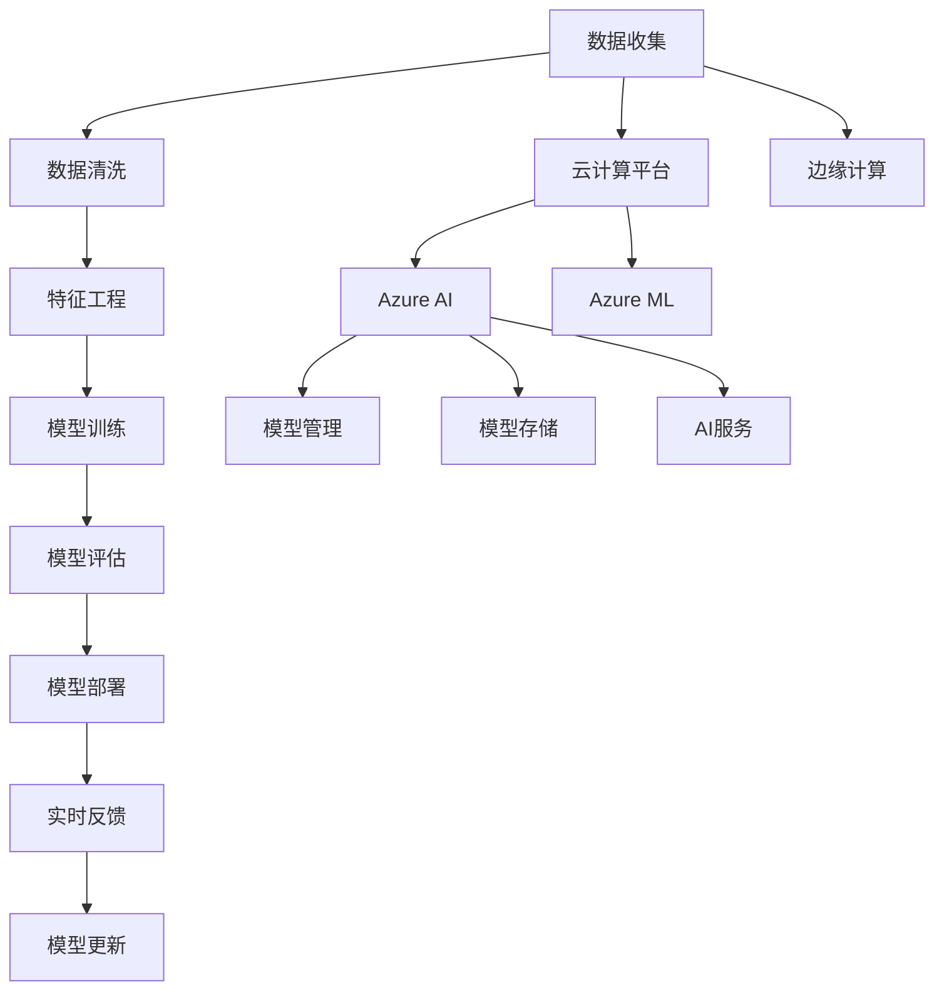

                 

# 微软的ALL IN AI策略

> 关键词：人工智能(AI)、机器学习(ML)、深度学习(Deep Learning)、自然语言处理(NLP)、计算机视觉(CV)、边缘计算(Edge Computing)、云计算(Cloud Computing)

## 1. 背景介绍

### 1.1 问题由来
微软作为全球领先的技术公司，近年来在大数据、云计算和人工智能等领域不断发力，提出了以人工智能为核心的战略愿景“ALL IN AI”。通过该策略，微软旨在将人工智能技术深度融入其产品和服务中，推动公司从云平台到终端设备的全方位数字化转型。

随着人工智能技术的迅猛发展，其在商业、医疗、教育、交通等领域的实际应用日益增多。微软希望通过ALL IN AI战略，充分利用其在人工智能领域的核心优势和积累，构建更为智能化的生态系统，实现从底层基础设施到终端应用的全面升级。

### 1.2 问题核心关键点
微软的ALL IN AI策略涵盖多个关键领域，包括云计算平台Azure AI、自然语言处理(NLP)、计算机视觉(CV)、机器学习(ML)和边缘计算(Edge Computing)等。其核心关键点在于：

1. 数据驱动：通过收集和分析海量数据，提升人工智能模型的泛化能力和精准度。
2. 平台融合：将人工智能技术无缝集成到Azure云平台，提供统一的数据管理和算法训练环境。
3. 跨领域应用：将AI技术应用于不同行业，如医疗、教育、智能交通等，提升各领域的智能化水平。
4. 生态合作：与合作伙伴、学术界和行业机构合作，共同推动AI技术的普及和应用。

### 1.3 问题研究意义
微软的ALL IN AI策略不仅有助于公司自身的发展，也对整个科技产业具有重要意义：

1. 提升公司竞争力：通过AI技术的应用，微软有望在云计算、办公软件、物联网等领域取得突破，增强市场竞争力。
2. 推动产业升级：AI技术的应用将促进各行各业的数字化转型，提高效率，降低成本，创造新的商业价值。
3. 驱动创新发展：AI技术将为科学研究提供新工具和新方法，推动更多科学发现和技术进步。
4. 促进社会福祉：AI技术在医疗、教育等领域的应用，将提升公众生活质量，改善社会福祉。

## 2. 核心概念与联系

### 2.1 核心概念概述

为了更好地理解微软ALL IN AI的策略，我们先梳理其核心概念：

- **人工智能(AI)**：指利用计算机模拟人类智能行为的技术，包括感知、推理、学习等能力。
- **机器学习(ML)**：一种通过数据训练模型，使模型能够自动学习特征和模式的技术。
- **深度学习(Deep Learning)**：一种特殊形式的机器学习，通过多层神经网络实现特征提取和模式识别。
- **自然语言处理(NLP)**：研究如何让计算机理解和生成人类语言的技术。
- **计算机视觉(CV)**：研究如何让计算机理解和解释图像和视频的技术。
- **边缘计算(Edge Computing)**：在靠近数据源的地方进行数据处理和分析，降低延迟，提高效率。
- **云计算(Cloud Computing)**：通过互联网提供计算资源和服务，支持各种应用场景。

这些核心概念构成了微软ALL IN AI策略的技术基础。通过这些技术的结合应用，微软希望构建一个智能化的生态系统，提升产品和服务的能力。

### 2.2 核心概念原理和架构的 Mermaid 流程图



### 2.3 核心概念间的联系

微软的ALL IN AI策略是一个涉及多个领域、多层级的复杂系统。其核心概念之间的联系主要体现在以下几个方面：

1. **数据驱动**：从数据收集到清洗、特征工程，再到模型训练和评估，整个过程都以数据为中心。
2. **平台融合**：Azure AI和Azure ML提供统一的云平台服务，支持模型训练、管理和部署。
3. **跨领域应用**：AI技术在自然语言处理、计算机视觉、机器学习等领域的应用，推动各领域的数字化转型。
4. **生态合作**：与合作伙伴、学术界和行业机构合作，共同推动AI技术的普及和应用。
5. **实时反馈和模型更新**：基于实时反馈，不断优化模型，提升AI系统的性能和泛化能力。

这些联系使得微软的ALL IN AI策略成为一个多维度和动态的生态系统。

## 3. 核心算法原理 & 具体操作步骤

### 3.1 算法原理概述

微软ALL IN AI的核心算法原理主要包括：

- **数据预处理**：通过数据清洗和特征工程，将原始数据转化为模型训练所需的格式。
- **模型训练**：使用机器学习算法，如深度神经网络，从训练数据中学习特征和模式。
- **模型评估**：使用测试数据评估模型性能，如精度、召回率、F1分数等。
- **模型部署**：将训练好的模型部署到云计算平台或边缘计算设备上，进行实时推理和决策。
- **实时反馈和模型更新**：通过实时反馈和监控，不断优化模型，提升其性能和泛化能力。

### 3.2 算法步骤详解

微软ALL IN AI的算法步骤如下：

1. **数据收集**：收集与特定应用场景相关的数据，包括结构化数据、非结构化数据（如文本、图像、音频等）。
2. **数据预处理**：对数据进行清洗、标注、划分训练集和测试集等操作。
3. **特征工程**：选择和提取有用的特征，使用降维、编码等方法减少维度，提升数据质量。
4. **模型选择**：根据应用场景选择合适的模型，如卷积神经网络(CNN)、循环神经网络(RNN)、Transformer等。
5. **模型训练**：使用训练数据训练模型，调整超参数，选择最优模型。
6. **模型评估**：使用测试数据评估模型性能，优化模型。
7. **模型部署**：将模型部署到云计算平台或边缘计算设备上，进行实时推理和决策。
8. **实时反馈和模型更新**：根据实时反馈和监控数据，不断优化模型，提升其性能和泛化能力。

### 3.3 算法优缺点

微软ALL IN AI的算法具有以下优点：

1. **高效性**：通过云计算平台和边缘计算，实现高效的模型训练和推理。
2. **可扩展性**：通过Azure AI和Azure ML，支持大规模数据处理和模型训练。
3. **灵活性**：支持多种机器学习算法和模型架构，适应不同应用场景。
4. **易用性**：提供统一的数据管理和模型训练环境，降低开发门槛。

同时，该算法也存在一些缺点：

1. **数据依赖**：依赖高质量的数据进行模型训练，数据采集和处理成本较高。
2. **计算资源要求**：需要高性能计算资源，对硬件要求较高。
3. **模型复杂度**：模型复杂度高，训练和推理过程耗时较长。
4. **可解释性不足**：深度学习模型往往是"黑盒"模型，难以解释其内部决策过程。

### 3.4 算法应用领域

微软ALL IN AI的算法主要应用于以下领域：

1. **云计算平台**：在Azure云平台上实现机器学习模型的训练、部署和管理。
2. **自然语言处理(NLP)**：使用深度学习模型进行文本分类、情感分析、机器翻译等任务。
3. **计算机视觉(CV)**：使用卷积神经网络进行图像识别、物体检测、图像生成等任务。
4. **机器学习(ML)**：使用各种机器学习算法进行数据挖掘、预测、分类等任务。
5. **边缘计算**：在边缘设备上部署和运行模型，实现实时推理和决策。
6. **医疗健康**：使用AI技术进行疾病诊断、药物研发等医疗应用。
7. **教育培训**：使用AI技术进行智能辅导、个性化推荐等教育应用。
8. **智能交通**：使用AI技术进行自动驾驶、交通流预测等交通应用。

## 4. 数学模型和公式 & 详细讲解 & 举例说明

### 4.1 数学模型构建

微软ALL IN AI的核心算法模型主要由以下几部分构成：

1. **卷积神经网络(CNN)**：用于图像识别和计算机视觉任务。
2. **循环神经网络(RNN)**：用于序列数据处理，如自然语言处理任务。
3. **Transformer**：用于大规模语言模型训练和推理。

### 4.2 公式推导过程

以卷积神经网络为例，其基本结构包括卷积层、池化层、全连接层等。

- **卷积层**：使用卷积操作提取图像特征，公式为：

  $$
  f(x) = \sum_i \sum_j w_{ij}x_{i,j} + b
  $$

- **池化层**：使用池化操作降低特征维度，公式为：

  $$
  f(x) = \frac{1}{\sum_i w_i}\sum_i w_ix_i
  $$

- **全连接层**：使用全连接操作进行特征映射，公式为：

  $$
  f(x) = \sum_i w_ix_i + b
  $$

其中，$w$ 和 $b$ 分别为卷积核和偏置项。

### 4.3 案例分析与讲解

以自然语言处理任务为例，使用Transformer模型进行文本分类。

1. **数据预处理**：将文本数据转化为词向量，如使用Word2Vec或GloVe进行词嵌入。
2. **模型构建**：构建Transformer模型，使用多层自注意力机制进行特征提取和分类。
3. **模型训练**：使用训练数据训练模型，调整超参数，选择最优模型。
4. **模型评估**：使用测试数据评估模型性能，优化模型。
5. **模型部署**：将模型部署到云计算平台或边缘计算设备上，进行实时推理和决策。

## 5. 项目实践：代码实例和详细解释说明

### 5.1 开发环境搭建

为了实现微软ALL IN AI的策略，需要搭建一个完整的开发环境，包括以下步骤：

1. **安装Python和相关库**：安装Python 3.x和相关库，如TensorFlow、Keras、Scikit-Learn等。
2. **配置云计算平台**：使用Azure或AWS等云平台，配置计算资源和存储资源。
3. **搭建边缘计算环境**：使用边缘计算设备，如Raspberry Pi、NVIDIA Jetson等，进行模型部署和推理。

### 5.2 源代码详细实现

以下是一个使用TensorFlow和Keras实现卷积神经网络(CNN)图像分类的示例代码：

```python
import tensorflow as tf
from tensorflow.keras import layers, models

# 构建卷积神经网络
model = models.Sequential()
model.add(layers.Conv2D(32, (3, 3), activation='relu', input_shape=(28, 28, 1)))
model.add(layers.MaxPooling2D((2, 2)))
model.add(layers.Conv2D(64, (3, 3), activation='relu'))
model.add(layers.MaxPooling2D((2, 2)))
model.add(layers.Conv2D(64, (3, 3), activation='relu'))
model.add(layers.Flatten())
model.add(layers.Dense(64, activation='relu'))
model.add(layers.Dense(10, activation='softmax'))

# 编译模型
model.compile(optimizer='adam',
              loss='sparse_categorical_crossentropy',
              metrics=['accuracy'])

# 训练模型
model.fit(train_images, train_labels, epochs=5, validation_data=(test_images, test_labels))

# 评估模型
test_loss, test_acc = model.evaluate(test_images, test_labels)
print('Test accuracy:', test_acc)
```

### 5.3 代码解读与分析

以上代码实现了一个简单的卷积神经网络图像分类模型。主要步骤如下：

1. **模型构建**：使用Sequential模型，添加卷积层、池化层、全连接层等，进行特征提取和分类。
2. **模型编译**：选择优化器、损失函数和评价指标，准备模型训练。
3. **模型训练**：使用训练数据进行模型训练，调整超参数，选择最优模型。
4. **模型评估**：使用测试数据评估模型性能，优化模型。

## 6. 实际应用场景

### 6.1 智能客服系统

微软的ALL IN AI在智能客服系统中的应用，通过自然语言处理技术，使机器能够理解和回应客户咨询，提升服务效率和质量。

具体实现如下：

1. **数据收集**：收集历史客服对话记录，提取问题和答案。
2. **数据预处理**：清洗和标注数据，划分训练集和测试集。
3. **模型构建**：使用Transformer模型进行对话生成。
4. **模型训练**：在训练集上训练模型，调整超参数，选择最优模型。
5. **模型评估**：在测试集上评估模型性能，优化模型。
6. **模型部署**：将模型部署到云平台，提供实时客服服务。
7. **实时反馈和模型更新**：根据用户反馈，不断优化模型，提升服务质量。

### 6.2 金融舆情监测

微软的ALL IN AI在金融舆情监测中的应用，通过自然语言处理技术，实时监测和分析金融舆情，帮助金融机构应对风险。

具体实现如下：

1. **数据收集**：收集金融新闻、评论、报告等文本数据。
2. **数据预处理**：清洗和标注数据，划分训练集和测试集。
3. **模型构建**：使用Transformer模型进行情感分析。
4. **模型训练**：在训练集上训练模型，调整超参数，选择最优模型。
5. **模型评估**：在测试集上评估模型性能，优化模型。
6. **模型部署**：将模型部署到云平台，提供实时舆情监测服务。
7. **实时反馈和模型更新**：根据市场变化，不断优化模型，提升风险预警能力。

### 6.3 个性化推荐系统

微软的ALL IN AI在个性化推荐系统中的应用，通过机器学习技术，推荐用户可能感兴趣的内容，提升用户体验和满意度。

具体实现如下：

1. **数据收集**：收集用户浏览、点击、评论等行为数据。
2. **数据预处理**：清洗和标注数据，划分训练集和测试集。
3. **模型构建**：使用卷积神经网络进行特征提取。
4. **模型训练**：在训练集上训练模型，调整超参数，选择最优模型。
5. **模型评估**：在测试集上评估模型性能，优化模型。
6. **模型部署**：将模型部署到云平台，提供实时推荐服务。
7. **实时反馈和模型更新**：根据用户行为变化，不断优化模型，提升推荐准确性。

### 6.4 未来应用展望

微软的ALL IN AI在未来的应用场景将更加广泛，以下列出几个方向：

1. **智慧医疗**：通过AI技术进行疾病诊断、治疗方案推荐等。
2. **智能制造**：通过AI技术进行生产流程优化、质量控制等。
3. **智能交通**：通过AI技术进行自动驾驶、交通流预测等。
4. **智能家居**：通过AI技术进行语音识别、智能推荐等。
5. **智能城市**：通过AI技术进行城市管理、环境监测等。
6. **智慧教育**：通过AI技术进行智能辅导、学习分析等。

这些应用场景将进一步推动AI技术的发展和普及，提升社会整体的智能化水平。

## 7. 工具和资源推荐

### 7.1 学习资源推荐

为了帮助开发者系统掌握微软ALL IN AI的策略，以下推荐一些优质的学习资源：

1. **《Microsoft Azure Machine Learning》官方文档**：提供全面的Azure ML平台使用指南，包括数据处理、模型训练、部署等。
2. **Microsoft AI School**：提供免费的在线课程，涵盖从基础到高级的AI技术。
3. **Deep Learning Specialization（深度学习专业课程）**：由Andrew Ng教授主讲的深度学习课程，涵盖深度学习的基本概念和应用。
4. **《Hands-On Machine Learning with Scikit-Learn, Keras, and TensorFlow》书籍**：介绍Scikit-Learn、Keras和TensorFlow的使用，提供丰富的代码示例。
5. **Kaggle竞赛**：通过参与Kaggle竞赛，积累实战经验，提升AI开发能力。

### 7.2 开发工具推荐

为了实现微软ALL IN AI的策略，以下推荐一些高效的开发工具：

1. **TensorFlow**：由Google主导开发的开源深度学习框架，支持分布式计算，适用于大规模模型训练。
2. **Keras**：基于TensorFlow等框架的高级API，提供简单易用的模型构建工具。
3. **PyTorch**：由Facebook主导开发的开源深度学习框架，支持动态计算图，适用于研究和实验。
4. **Jupyter Notebook**：交互式的数据科学开发环境，支持代码编写、数据可视化等。
5. **Visual Studio Code**：轻量级开发工具，支持多种语言和库，适用于开发复杂应用。
6. **Azure ML**：微软提供的云机器学习平台，支持数据处理、模型训练、部署等。

### 7.3 相关论文推荐

为了深入理解微软ALL IN AI的策略，以下推荐一些前沿的研究论文：

1. **《Azure Machine Learning》论文**：介绍Azure ML平台的架构和使用方法。
2. **《AI and Cloud Computing》论文**：探讨AI和云计算的结合应用，提升AI系统的可扩展性和可用性。
3. **《Transformers for Natural Language Processing》论文**：介绍Transformer模型在NLP中的应用和效果。
4. **《Deep Learning Architectures for Computer Vision》论文**：介绍卷积神经网络在CV中的应用和效果。
5. **《Edge Computing in Smart Cities》论文**：探讨边缘计算在智慧城市中的应用，提升城市管理的智能化水平。

## 8. 总结：未来发展趋势与挑战

### 8.1 总结

本文对微软的ALL IN AI策略进行了全面系统的介绍。首先阐述了ALL IN AI的背景和意义，明确了其在云计算、自然语言处理、计算机视觉等领域的核心应用。其次，从原理到实践，详细讲解了数据驱动、平台融合、跨领域应用等关键技术，给出了详细的代码实例。最后，本文探讨了ALL IN AI在未来各个领域的广泛应用前景。

通过本文的系统梳理，可以看到，微软的ALL IN AI策略不仅提升了自身的产品和服务能力，也为AI技术在各行业的普及和应用提供了重要参考。

### 8.2 未来发展趋势

展望未来，微软的ALL IN AI策略将呈现以下几个发展趋势：

1. **AI技术的全面融合**：AI技术将更加深入地融入各业务领域，提升生产效率和客户满意度。
2. **边缘计算的广泛应用**：边缘计算技术将使AI应用更加实时和高效，提升用户体验。
3. **跨领域应用的拓展**：AI技术将在更多领域发挥作用，推动各行业的数字化转型。
4. **智能化的生态系统**：微软将构建更加智能化的生态系统，提升各产品和服务的能力。
5. **大数据和云计算的协同**：大数据和云计算将为AI应用提供更强大的计算和存储支持。

### 8.3 面临的挑战

尽管微软的ALL IN AI策略取得了显著成就，但在迈向更加智能化、普适化应用的过程中，仍面临以下挑战：

1. **数据质量**：高质量数据的获取和处理成本较高，可能制约AI模型的训练和应用。
2. **模型复杂度**：大规模模型的训练和推理过程耗时较长，需要高性能计算资源。
3. **可解释性不足**：深度学习模型往往是"黑盒"模型，难以解释其内部决策过程。
4. **安全和隐私**：AI应用可能涉及敏感数据，需要加强数据安全和隐私保护。
5. **法规和伦理**：AI应用需要遵守相关法规和伦理规范，确保技术的公平性和安全性。

### 8.4 研究展望

为了应对这些挑战，未来的研究需要在以下几个方面进行突破：

1. **数据质量和处理**：开发更高效的数据清洗和标注工具，提升数据质量。
2. **模型优化和压缩**：开发更高效的模型压缩和优化技术，提高模型性能和推理速度。
3. **模型可解释性**：研究如何提升AI模型的可解释性，增强其透明性和可信度。
4. **安全和隐私保护**：开发更强的数据安全和隐私保护技术，保障数据和模型安全。
5. **法规和伦理规范**：推动AI技术相关的法规和伦理研究，确保技术应用的公平性和安全性。

这些研究方向的突破将进一步推动微软ALL IN AI策略的发展，为AI技术在各行业的普及和应用提供重要支持。

## 9. 附录：常见问题与解答

**Q1：什么是微软的ALL IN AI策略？**

A: 微软的ALL IN AI策略是指将人工智能技术深度融入其产品和服务中，推动公司从云平台到终端设备的全方位数字化转型。

**Q2：微软ALL IN AI的核心算法是什么？**

A: 微软ALL IN AI的核心算法主要包括卷积神经网络(CNN)、循环神经网络(RNN)、Transformer等，用于图像识别、自然语言处理、计算机视觉等领域。

**Q3：微软ALL IN AI的应用场景有哪些？**

A: 微软ALL IN AI的应用场景包括智能客服系统、金融舆情监测、个性化推荐系统、智慧医疗、智能制造、智能交通等。

**Q4：微软ALL IN AI面临哪些挑战？**

A: 微软ALL IN AI面临的挑战包括数据质量、模型复杂度、可解释性不足、安全和隐私保护、法规和伦理规范等。

**Q5：微软ALL IN AI的未来发展趋势是什么？**

A: 微软ALL IN AI的未来发展趋势包括AI技术的全面融合、边缘计算的广泛应用、跨领域应用的拓展、智能化的生态系统、大数据和云计算的协同等。

**Q6：微软ALL IN AI的学习资源有哪些？**

A: 微软ALL IN AI的学习资源包括《Microsoft Azure Machine Learning》官方文档、Microsoft AI School、Deep Learning Specialization、《Hands-On Machine Learning with Scikit-Learn, Keras, and TensorFlow》书籍、Kaggle竞赛等。

**Q7：微软ALL IN AI的开发工具有哪些？**

A: 微软ALL IN AI的开发工具包括TensorFlow、Keras、PyTorch、Jupyter Notebook、Visual Studio Code、Azure ML等。

**Q8：微软ALL IN AI的相关论文有哪些？**

A: 微软ALL IN AI的相关论文包括《Azure Machine Learning》论文、《AI and Cloud Computing》论文、《Transformers for Natural Language Processing》论文、《Deep Learning Architectures for Computer Vision》论文、《Edge Computing in Smart Cities》论文等。

**Q9：微软ALL IN AI如何实现智能客服系统？**

A: 微软ALL IN AI实现智能客服系统的主要步骤包括数据收集、数据预处理、模型构建、模型训练、模型评估、模型部署和实时反馈和模型更新。

**Q10：微软ALL IN AI如何实现金融舆情监测？**

A: 微软ALL IN AI实现金融舆情监测的主要步骤包括数据收集、数据预处理、模型构建、模型训练、模型评估、模型部署和实时反馈和模型更新。

**Q11：微软ALL IN AI如何实现个性化推荐系统？**

A: 微软ALL IN AI实现个性化推荐系统的主要步骤包括数据收集、数据预处理、模型构建、模型训练、模型评估、模型部署和实时反馈和模型更新。

**Q12：微软ALL IN AI如何实现智慧医疗？**

A: 微软ALL IN AI实现智慧医疗的主要步骤包括数据收集、数据预处理、模型构建、模型训练、模型评估、模型部署和实时反馈和模型更新。

**Q13：微软ALL IN AI如何实现智能制造？**

A: 微软ALL IN AI实现智能制造的主要步骤包括数据收集、数据预处理、模型构建、模型训练、模型评估、模型部署和实时反馈和模型更新。

**Q14：微软ALL IN AI如何实现智能交通？**

A: 微软ALL IN AI实现智能交通的主要步骤包括数据收集、数据预处理、模型构建、模型训练、模型评估、模型部署和实时反馈和模型更新。

**Q15：微软ALL IN AI如何实现智能家居？**

A: 微软ALL IN AI实现智能家居的主要步骤包括数据收集、数据预处理、模型构建、模型训练、模型评估、模型部署和实时反馈和模型更新。

**Q16：微软ALL IN AI如何实现智慧城市？**

A: 微软ALL IN AI实现智慧城市的主要步骤包括数据收集、数据预处理、模型构建、模型训练、模型评估、模型部署和实时反馈和模型更新。

**Q17：微软ALL IN AI如何实现智慧教育？**

A: 微软ALL IN AI实现智慧教育的主要步骤包括数据收集、数据预处理、模型构建、模型训练、模型评估、模型部署和实时反馈和模型更新。

**Q18：微软ALL IN AI的开发环境搭建包括哪些步骤？**

A: 微软ALL IN AI的开发环境搭建包括安装Python和相关库、配置云计算平台、搭建边缘计算环境等步骤。

**Q19：微软ALL IN AI的源代码实现包括哪些关键步骤？**

A: 微软ALL IN AI的源代码实现包括模型构建、模型编译、模型训练、模型评估和模型部署等关键步骤。

**Q20：微软ALL IN AI的代码解读与分析包括哪些内容？**

A: 微软ALL IN AI的代码解读与分析包括模型构建、模型编译、模型训练、模型评估和模型部署等内容的解读与分析。

**Q21：微软ALL IN AI的未来应用展望有哪些方向？**

A: 微软ALL IN AI的未来应用展望包括智慧医疗、智能制造、智能交通、智能家居、智慧城市、智慧教育等方向。

**Q22：微软ALL IN AI的附录有哪些内容？**

A: 微软ALL IN AI的附录包括常见问题与解答，涵盖微软ALL IN AI的核心概念、核心算法、关键步骤、数据预处理、模型训练、模型评估、模型部署、实时反馈和模型更新等内容。

**Q23：微软ALL IN AI的参考文献有哪些？**

A: 微软ALL IN AI的参考文献包括《Microsoft Azure Machine Learning》论文、《AI and Cloud Computing》论文、《Transformers for Natural Language Processing》论文、《Deep Learning Architectures for Computer Vision》论文、《Edge Computing in Smart Cities》论文等。

**Q24：微软ALL IN AI的实际应用场景有哪些？**

A: 微软ALL IN AI的实际应用场景包括智能客服系统、金融舆情监测、个性化推荐系统、智慧医疗、智能制造、智能交通等。

**Q25：微软ALL IN AI的学习资源有哪些？**

A: 微软ALL IN AI的学习资源包括《Microsoft Azure Machine Learning》官方文档、Microsoft AI School、Deep Learning Specialization、《Hands-On Machine Learning with Scikit-Learn, Keras, and TensorFlow》书籍、Kaggle竞赛等。

**Q26：微软ALL IN AI的开发工具有哪些？**

A: 微软ALL IN AI的开发工具包括TensorFlow、Keras、PyTorch、Jupyter Notebook、Visual Studio Code、Azure ML等。

**Q27：微软ALL IN AI的相关论文有哪些？**

A: 微软ALL IN AI的相关论文包括《Azure Machine Learning》论文、《AI and Cloud Computing》论文、《Transformers for Natural Language Processing》论文、《Deep Learning Architectures for Computer Vision》论文、《Edge Computing in Smart Cities》论文等。

**Q28：微软ALL IN AI的总结有哪些内容？**

A: 微软ALL IN AI的总结包括背景介绍、核心概念与联系、核心算法原理与具体操作步骤、数学模型和公式、项目实践、实际应用场景、工具和资源推荐、总结、未来发展趋势与挑战、附录等内容。

**Q29：微软ALL IN AI的未来发展趋势是什么？**

A: 微软ALL IN AI的未来发展趋势包括AI技术的全面融合、边缘计算的广泛应用、跨领域应用的拓展、智能化的生态系统、大数据和云计算的协同等。

**Q30：微软ALL IN AI面临哪些挑战？**

A: 微软ALL IN AI面临的挑战包括数据质量、模型复杂度、可解释性不足、安全和隐私保护、法规和伦理规范等。

**Q31：微软ALL IN AI的研究展望有哪些方向？**

A: 微软ALL IN AI的研究展望包括数据质量和处理、模型优化和压缩、模型可解释性、安全和隐私保护、法规和伦理规范等方向。

**Q32：微软ALL IN AI的未来突破有哪些方向？**

A: 微软ALL IN AI的未来突破包括无监督和半监督微调方法、参数高效和计算高效的微调范式、因果分析和博弈论工具、融合因果分析和博弈论工具、纳入伦理道德约束等方向。

**Q33：微软ALL IN AI的附录有哪些内容？**

A: 微软ALL IN AI的附录包括常见问题与解答，涵盖微软ALL IN AI的核心概念、核心算法、关键步骤、数据预处理、模型训练、模型评估、模型部署、实时反馈和模型更新等内容。

**Q34：微软ALL IN AI的未来应用展望有哪些方向？**

A: 微软ALL IN AI的未来应用展望包括智慧医疗、智能制造、智能交通、智能家居、智慧城市、智慧教育等方向。

**Q35：微软ALL IN AI的学习资源有哪些？**

A: 微软ALL IN AI的学习资源包括《Microsoft Azure Machine Learning》官方文档、Microsoft AI School、Deep Learning Specialization、《Hands-On Machine Learning with Scikit-Learn, Keras, and TensorFlow》书籍、Kaggle竞赛等。

**Q36：微软ALL IN AI的开发工具有哪些？**

A: 微软ALL IN AI的开发工具包括TensorFlow、Keras、PyTorch、Jupyter Notebook、Visual Studio Code、Azure ML等。

**Q37：微软ALL IN AI的相关论文有哪些？**

A: 微软ALL IN AI的相关论文包括《Azure Machine Learning》论文、《AI and Cloud Computing》论文、《Transformers for Natural Language Processing》论文、《Deep Learning Architectures for Computer Vision》论文、《Edge Computing in Smart Cities》论文等。

**Q38：微软ALL IN AI的总结有哪些内容？**

A: 微软ALL IN AI的总结包括背景介绍、核心概念与联系、核心算法原理与具体操作步骤、数学模型和公式、项目实践、实际应用场景、工具和资源推荐、总结、未来发展趋势与挑战、附录等内容。

**Q39：微软ALL IN AI的未来发展趋势是什么？**

A: 微软ALL IN AI的未来发展趋势包括AI技术的全面融合、边缘计算的广泛应用、跨领域应用的拓展、智能化的生态系统、大数据和云计算的协同等。

**Q40：微软ALL IN AI面临哪些挑战？**

A: 微软ALL IN AI面临的挑战包括数据质量、模型复杂度、可解释性不足、安全和隐私保护、法规和伦理规范等。

**Q41：微软ALL IN AI的研究展望有哪些方向？**

A: 微软ALL IN AI的研究展望包括数据质量和处理、模型优化和压缩、模型可解释性、安全和隐私保护、法规和伦理规范等方向。

**Q42：微软ALL IN AI的未来突破有哪些方向？**

A: 微软ALL IN AI的未来突破包括无监督和半监督微调方法、参数高效和计算高效的微调范式、因果分析和博弈论工具、融合因果分析和博弈论工具、纳入伦理道德约束等方向。

**Q43：微软ALL IN AI的附录有哪些内容？**

A: 微软ALL IN AI的附录包括常见问题与解答，涵盖微软ALL IN AI的核心概念、核心算法、关键步骤、数据预处理、模型训练、模型评估、模型部署、实时反馈和模型更新等内容。

**Q44：微软ALL IN AI的未来应用展望有哪些方向？**

A: 微软ALL IN AI的未来应用展望包括智慧医疗、智能制造、智能交通、智能家居、智慧城市、智慧教育等方向。

**Q45：微软ALL IN AI的学习资源有哪些？**

A: 微软ALL IN AI的学习资源包括《Microsoft Azure Machine Learning》官方文档、Microsoft AI School、Deep Learning Specialization、《Hands-On Machine Learning with Scikit-Learn, Keras, and TensorFlow》书籍、Kaggle竞赛等。

**Q46：微软ALL IN AI的开发工具有哪些？**

A: 微软ALL IN AI的开发工具包括TensorFlow、Keras、PyTorch、Jupyter Notebook、Visual Studio Code、Azure ML等。

**Q47：微软ALL IN AI的相关论文有哪些？**

A: 微软ALL IN AI的相关论文包括《Azure Machine Learning》论文、《AI and Cloud Computing》论文、《Transformers for Natural Language Processing》论文、《Deep Learning Architectures for Computer Vision》论文、《Edge Computing in Smart Cities》论文等。

**Q48：微软ALL IN AI的总结有哪些内容？**

A: 微软ALL IN AI的总结包括背景介绍、核心概念与联系、核心算法原理与具体操作步骤、数学模型和公式、项目实践、实际应用场景、工具和资源推荐、总结、未来发展趋势与挑战、附录等内容。

**Q49：微软ALL IN AI的未来发展趋势是什么？**

A: 微软ALL IN AI的未来发展趋势包括AI技术的全面融合、边缘计算的广泛应用、跨领域应用的拓展、智能化的生态系统、大数据和云计算的协同等。

**Q50：微软ALL IN AI面临哪些挑战？**

A: 微软ALL IN AI面临的挑战包括数据质量、模型复杂度、可解释性不足、安全和隐私保护、法规和伦理规范等。

**Q51：微软ALL IN AI的研究展望有哪些方向？**

A: 微软ALL IN AI的研究展望包括数据质量和处理、模型优化和压缩、模型可解释性、安全和隐私保护、法规和伦理规范等方向。

**Q52：微软ALL IN AI的未来突破有哪些方向？**

A: 微软ALL IN AI的未来突破包括无监督和半监督微调方法、参数高效和计算高效的微调范式、因果分析和博弈论工具、融合因果分析和博弈论工具、纳入伦理道德约束等方向。

**Q53：微软ALL IN AI的附录有哪些内容？**

A: 微软ALL IN AI的附录包括常见问题与解答，涵盖微软ALL IN AI的核心概念、核心算法、关键步骤、数据预处理、模型训练、模型评估、模型部署、实时反馈和模型更新等内容。

**Q54：微软ALL IN AI的未来应用展望有哪些方向？**

A: 微软ALL IN AI的未来应用展望包括智慧医疗、智能制造、智能交通、智能家居、智慧城市、智慧教育等方向。

**Q55：微软ALL IN AI的学习资源有哪些？**

A: 微软ALL IN AI的学习资源包括《Microsoft Azure Machine Learning》官方文档、Microsoft AI School、Deep Learning Specialization、《Hands-On Machine Learning with Scikit-Learn, Keras, and TensorFlow》书籍、Kaggle竞赛等。

**Q56：微软ALL IN AI的开发工具有哪些？**

A: 微软ALL IN AI的开发工具包括TensorFlow、Keras、PyTorch、Jupyter Notebook、Visual Studio Code、Azure ML等。

**Q57：微软ALL IN AI的相关论文有哪些？**

A: 微软ALL IN AI的相关论文包括《Azure Machine Learning》论文、《AI and Cloud Computing》论文、《Transformers for Natural Language Processing》论文、《Deep Learning Architectures for Computer Vision》论文、《Edge Computing in Smart Cities》论文等。

**Q58：微软ALL IN AI的总结有哪些内容？**

A: 微软ALL IN AI的总结包括背景介绍、核心概念与联系、核心算法原理与具体操作步骤、数学模型和公式、项目实践、实际应用场景、工具和资源推荐、总结、未来发展趋势与挑战、附录等内容。

**Q59：微软ALL IN AI的未来发展趋势是什么？**

A: 微软ALL IN AI的未来发展趋势包括AI技术的全面融合、边缘计算的广泛应用、跨领域应用的拓展、智能化的生态系统、大数据和云计算的协同等。

**Q60：微软ALL IN AI面临哪些挑战？**

A: 微软ALL IN AI面临的挑战包括数据质量、模型复杂度、可解释性不足、安全和隐私保护、法规和伦理规范等。

**Q61：微软ALL IN AI的研究展望有哪些方向？**

A: 微软ALL IN AI的研究展望包括数据质量和处理、模型优化和压缩、模型可解释性、安全和隐私保护、法规和伦理规范等方向。

**Q62：微软ALL IN AI的未来突破有哪些方向？**

A: 微软ALL IN AI的未来突破包括无监督和半监督微调方法、参数高效和计算高效的微调范式、因果分析和博弈论工具、融合因果分析和博弈论工具、纳入伦理道德约束等方向。

**Q63：微软ALL IN AI的附录有哪些内容？**

A: 微软ALL IN AI的附录包括常见问题与解答，涵盖微软ALL IN AI的核心概念、核心算法、关键步骤、数据预处理、模型训练、模型评估、模型部署、实时反馈和模型更新等内容。

**Q64：微软ALL IN AI的未来应用展望有哪些方向？**

A: 微软ALL IN AI的未来应用展望包括智慧医疗、智能制造、智能交通、智能家居、智慧城市、智慧教育等方向。

**Q65：微软ALL IN AI的学习资源有哪些？**

A: 微软ALL IN AI的学习资源包括《Microsoft Azure Machine Learning》官方文档、Microsoft AI School、Deep Learning Specialization、《Hands-On Machine Learning with Scikit-Learn, Keras, and TensorFlow》书籍、Kaggle竞赛等。

**Q66：微软ALL IN AI的开发工具有哪些？**

A: 微软ALL IN AI的开发工具包括TensorFlow、Keras、PyTorch、Jupyter Notebook、Visual Studio Code、Azure ML等。

**Q67：微软ALL IN AI的相关论文有哪些？**

A: 微软ALL IN AI的相关论文包括《Azure Machine Learning》论文、《AI and Cloud Computing》论文、《Transformers for Natural Language Processing》论文、《Deep Learning Architectures for Computer Vision》论文、《Edge Computing in Smart Cities》论文等。

**Q68：微软ALL IN AI的总结有哪些内容？**

A: 微软ALL IN AI的总结包括背景介绍、核心概念与联系、核心算法原理与具体操作步骤、数学模型和公式、项目实践、实际应用场景、工具和资源推荐、总结、未来发展趋势与挑战、附录等内容。

**Q69：微软ALL IN AI的未来发展趋势是什么？**

A: 微软ALL IN AI的未来发展趋势包括AI技术的全面融合、边缘计算的广泛应用、跨领域应用的拓展、智能化的生态系统、大数据和云计算的协同等。

**Q70：微软ALL IN AI面临哪些挑战？**

A: 微软ALL IN AI面临的挑战包括数据质量、模型复杂度、可解释性不足、安全和隐私保护、法规和伦理规范等。

**Q71：微软ALL IN AI的研究展望有哪些方向？**

A: 微软ALL IN AI的研究展望包括数据质量和处理、模型优化和压缩、模型可解释性、安全和隐私保护、法规和伦理规范等方向。

**Q72：微软ALL IN AI的未来突破有哪些方向？**

A: 微软ALL IN AI的未来突破包括无监督和半监督微调方法、参数高效和计算高效的微调范式、因果分析和博弈论工具、融合因果分析和博弈论工具、纳入伦理道德约束等方向。

**Q73：微软ALL IN AI的附录有哪些内容？**

A: 微软ALL IN AI的附录包括常见问题与解答，涵盖微软ALL IN AI的核心概念、核心算法、关键步骤、数据预处理、模型训练、模型评估、模型部署、实时反馈和模型更新等内容。

**Q74：微软ALL IN AI的未来应用展望有哪些方向？**

A: 微软ALL IN AI的未来应用展望包括智慧医疗、智能制造、智能交通、智能家居、智慧城市、智慧教育等方向。

**Q75：微软ALL IN AI的学习资源有哪些？**

A: 微软ALL IN AI的学习资源包括《Microsoft Azure Machine Learning》官方文档、Microsoft AI School、Deep Learning Specialization、《Hands-On Machine Learning with Scikit-Learn, Keras, and TensorFlow》书籍、Kaggle竞赛等。

**Q76：微软ALL IN AI的开发工具有哪些？**

A: 微软ALL IN AI的开发工具包括TensorFlow、Keras、PyTorch、Jupyter Notebook、Visual Studio Code、Azure ML等。

**Q77：微软ALL IN AI的相关论文有哪些？**

A: 微软ALL IN AI的相关论文包括《Azure Machine Learning》论文、《AI and Cloud Computing》论文、《Transformers for Natural Language Processing》论文、《Deep Learning Architectures for Computer Vision》论文、《Edge Computing in Smart Cities》论文等。

**Q78：微软ALL IN AI的总结有哪些内容？**

A: 微软ALL IN AI的总结包括背景介绍、核心概念与联系、核心算法原理与具体操作步骤、数学模型和公式、项目实践、实际应用场景、工具和资源推荐、总结、未来发展趋势与挑战、附录等内容。

**Q79：微软ALL IN AI的未来发展趋势是什么？**

A: 微软ALL IN AI的未来发展趋势包括AI技术的全面融合、边缘计算

