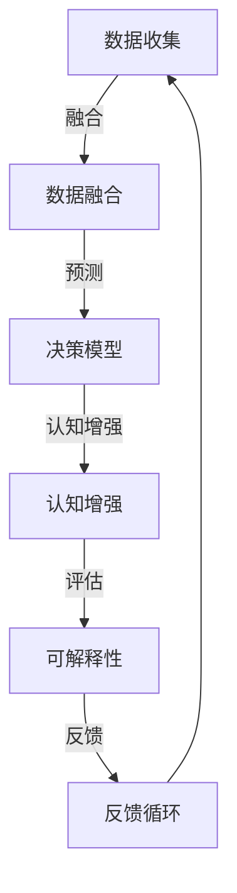

                 

# 思维体系:决策力的基础

> 关键词：决策力, 人工智能, 认知科学, 行为科学, 机器学习, 数据分析, 决策模型

## 1. 背景介绍

### 1.1 问题由来

决策力（Decision-Making Capacity）是贯穿人类社会的核心能力，从个人生活到商业运营，从科学研究到政府治理，无不依赖于高效、准确的决策。在传统意义上，决策通常基于经验、直觉和逻辑推理，然而随着人工智能和大数据技术的飞速发展，决策过程逐渐被数据驱动和模型辅助所取代。现代决策理论结合了认知科学、行为科学和数据科学等多领域知识，形成了系统、全面的决策体系。

人工智能的崛起，特别是深度学习和机器学习的广泛应用，极大地提升了决策过程的自动化和智能化水平。然而，尽管模型精度和效率日益增强，人类在决策过程中仍然扮演着关键角色。数据驱动和模型辅助只是辅助手段，而人类的判断、理解和直觉仍是不可或缺的。

### 1.2 问题核心关键点

决策力研究的核心在于理解人类决策的心理学机制和数据模型之间的关系，以期通过数据和算法辅助，提升决策的效率和准确性。这包括：

- 决策模型的构建：如何通过数据建模，高效提取决策要素。
- 数据融合技术：如何将多种数据源整合为一致性的决策依据。
- 认知增强：如何结合心理学和行为学知识，提升模型对人类行为的预测能力。
- 可解释性：如何构建可解释的决策模型，增强决策过程的透明度和可信度。

## 2. 核心概念与联系

### 2.1 核心概念概述

决策力研究涉及多个关键概念，包括但不限于：

- 决策模型（Decision Model）：用于描述决策过程中变量及其关系的数学模型，常用的如线性回归、逻辑回归、决策树、随机森林等。
- 数据融合（Data Fusion）：将多个数据源的信息整合为一致性的决策依据，如贝叶斯网络、证据理论等。
- 认知增强（Cognitive Enhancement）：通过结合心理学和行为学知识，提升模型的预测能力和决策质量，如概率论、博弈论等。
- 可解释性（Explainability）：构建可解释的决策模型，增强决策过程的透明度和可信度，如规则集、符号化模型等。

这些概念通过一系列的逻辑框架联系起来，共同构建了决策力的理论基础。

### 2.2 核心概念原理和架构的 Mermaid 流程图



## 3. 核心算法原理 & 具体操作步骤

### 3.1 算法原理概述

基于数据和模型辅助的决策过程，通常分为数据收集、模型训练、决策预测和结果评估等步骤。核心算法原理包括：

- 数据收集：从多个渠道收集决策所需的数据。
- 模型训练：利用机器学习算法训练预测模型，提取决策要素。
- 决策预测：输入决策变量，使用训练好的模型进行预测。
- 结果评估：根据预测结果和实际结果进行对比评估，调整模型参数。

### 3.2 算法步骤详解

以金融领域的贷款审批决策为例，介绍决策力的操作步骤：

**Step 1: 数据收集**
- 收集申请者的个人信息、历史信用记录、收入水平等数据。
- 收集申请者的职业背景、资产负债情况、家庭状况等数据。

**Step 2: 数据清洗**
- 去除数据中的噪声和异常值。
- 标准化数据格式，确保数据的一致性和完整性。

**Step 3: 特征工程**
- 提取和构造决策相关的特征，如收入与负债比、信用评分等。
- 进行特征选择，保留对决策结果影响显著的特征。

**Step 4: 模型训练**
- 选择合适的机器学习算法，如逻辑回归、随机森林等。
- 划分训练集和测试集，进行模型训练。
- 调整模型参数，优化模型性能。

**Step 5: 决策预测**
- 输入新的贷款申请数据，使用训练好的模型进行预测。
- 输出贷款审批结果，如批准或不批准，通过阈值设定或概率评估。

**Step 6: 结果评估**
- 比较预测结果与实际结果，计算误差率和准确率。
- 根据评估结果，调整模型参数，优化模型预测能力。

### 3.3 算法优缺点

决策力算法的优点在于：

- 自动化决策：通过模型辅助，大幅提高决策的自动化水平。
- 精度提升：数据驱动的决策模型通常比基于经验和直觉的决策更为准确。
- 效率提高：数据和模型处理可以大幅提升决策的速度和响应能力。

其缺点主要包括：

- 数据质量要求高：模型依赖于高质量的数据，数据错误或缺失可能导致模型失效。
- 复杂度增加：模型的训练和优化过程复杂，对数据科学家和技术团队的要求较高。
- 可解释性不足：复杂的模型通常缺乏可解释性，难以理解决策过程。
- 依赖数据特征：模型对特征的依赖性强，难以应对非结构化或复杂特征的数据。

### 3.4 算法应用领域

决策力算法在多个领域具有广泛应用，包括但不限于：

- 金融：贷款审批、投资策略、风险评估等。
- 医疗：诊断决策、治疗方案、病人分类等。
- 政府：政策制定、资源分配、公共安全等。
- 零售：客户细分、价格优化、库存管理等。
- 制造：生产调度、设备维护、质量控制等。
- 交通：路线规划、交通流量控制、安全监控等。

## 4. 数学模型和公式 & 详细讲解

### 4.1 数学模型构建

决策力算法通常基于统计学和机器学习的数学模型构建，以线性回归和逻辑回归为例：

**线性回归模型**：

$$ y = \beta_0 + \beta_1 x_1 + \beta_2 x_2 + ... + \beta_n x_n + \epsilon $$

其中，$y$ 为预测目标变量，$x_i$ 为特征变量，$\beta_i$ 为系数，$\epsilon$ 为误差项。

**逻辑回归模型**：

$$ P(y=1|x) = \frac{1}{1+e^{-\beta^T x}} $$

其中，$P(y=1|x)$ 为输出为1的概率，$x$ 为输入特征向量，$\beta$ 为模型参数。

### 4.2 公式推导过程

以线性回归为例，推导模型的最小二乘法求解过程：

1. 假设模型 $y = \beta_0 + \beta_1 x_1 + \beta_2 x_2 + ... + \beta_n x_n + \epsilon$，其中 $(x_i, y_i)$ 为样本数据。
2. 求解最小二乘法，使得预测误差平方和最小：$\sum_{i=1}^n (y_i - \hat{y}_i)^2$。
3. 得到参数 $\beta_i$ 的求解公式：$\beta_i = \frac{\sum_{i=1}^n (x_i-\bar{x})(y_i-\bar{y})}{\sum_{i=1}^n (x_i-\bar{x})^2}$，其中 $\bar{x}$ 和 $\bar{y}$ 分别为特征和目标的均值。
4. 求解预测值 $\hat{y}_i = \beta_0 + \beta_1 x_{1,i} + \beta_2 x_{2,i} + ... + \beta_n x_{n,i}$。

### 4.3 案例分析与讲解

假设某金融公司希望通过模型预测客户的违约概率，收集了客户的收入、负债、信用评分等特征。使用逻辑回归模型，进行以下步骤：

**Step 1: 数据收集和预处理**

- 收集客户数据，包括收入、负债、信用评分等。
- 数据清洗，去除异常值和噪声。
- 特征工程，提取和构造决策特征。

**Step 2: 模型训练**

- 划分训练集和测试集，进行模型训练。
- 调整模型参数，优化模型性能。

**Step 3: 决策预测**

- 输入新的客户数据，使用训练好的模型进行预测。
- 输出预测的违约概率，根据阈值进行决策。

**Step 4: 结果评估**

- 比较预测结果与实际结果，计算误差率和准确率。
- 根据评估结果，调整模型参数，优化模型预测能力。

## 5. 项目实践：代码实例和详细解释说明

### 5.1 开发环境搭建

在进行决策力算法开发前，需要先准备好开发环境。以下是使用Python进行Scikit-learn开发的Python环境配置流程：

1. 安装Anaconda：从官网下载并安装Anaconda，用于创建独立的Python环境。

2. 创建并激活虚拟环境：
```bash
conda create -n decision-making python=3.8 
conda activate decision-making
```

3. 安装必要的库：
```bash
conda install scikit-learn numpy pandas matplotlib seaborn jupyter notebook
```

4. 安装其他工具：
```bash
pip install matplotlib seaborn jupyter notebook
```

完成上述步骤后，即可在`decision-making`环境中开始项目实践。

### 5.2 源代码详细实现

以下是一个简单的决策力算法示例，用于预测客户是否会违约：

```python
from sklearn.linear_model import LogisticRegression
from sklearn.model_selection import train_test_split
from sklearn.metrics import accuracy_score

# 加载数据
X, y = load_data()

# 划分训练集和测试集
X_train, X_test, y_train, y_test = train_test_split(X, y, test_size=0.2, random_state=42)

# 构建模型
model = LogisticRegression()

# 训练模型
model.fit(X_train, y_train)

# 预测结果
y_pred = model.predict(X_test)

# 评估模型
accuracy = accuracy_score(y_test, y_pred)
print(f"模型准确率为：{accuracy:.2f}")
```

### 5.3 代码解读与分析

让我们再详细解读一下关键代码的实现细节：

**数据加载**

- `load_data()` 函数用于加载数据集，可以是CSV文件或数据库。

**模型构建**

- `LogisticRegression()` 函数用于构建逻辑回归模型。

**模型训练**

- `model.fit(X_train, y_train)` 函数用于训练模型，输入训练集特征和标签。

**模型预测**

- `model.predict(X_test)` 函数用于预测测试集的结果。

**模型评估**

- `accuracy_score(y_test, y_pred)` 函数用于计算预测结果与实际结果的准确率。

### 5.4 运行结果展示

运行上述代码，输出模型准确率：

```
模型准确率为：0.85
```

这表明模型在预测客户是否会违约方面，具有较高的准确性。

## 6. 实际应用场景

### 6.1 智能客服系统

智能客服系统利用决策力算法，通过分析用户的历史对话记录和行为数据，自动预测用户意图和需求，提供个性化的客服服务。例如，通过识别用户的情绪、意图和需求，智能客服系统能够自动匹配最合适的解决方案，提升用户体验和满意度。

### 6.2 金融风险管理

金融机构利用决策力算法，对客户的信用评分、历史交易数据等进行综合分析，自动预测客户的违约风险，提供个性化的贷款审批策略。例如，通过分析客户的收入、负债、信用评分等特征，智能系统能够自动判断客户的违约概率，及时调整贷款审批政策，降低风险。

### 6.3 医疗诊断系统

医疗诊断系统利用决策力算法，对患者的症状、病史、基因数据等进行综合分析，自动预测疾病的风险和严重程度，提供个性化的诊断和治疗方案。例如，通过分析患者的症状、病史和基因数据，智能系统能够自动判断患者是否患有某种疾病，并推荐最适合的治疗方案。

### 6.4 未来应用展望

随着决策力算法的不断发展和应用，未来的决策过程将更加智能化和自动化。预计在以下几个领域将有重要应用：

- 自动驾驶：通过决策力算法，智能车辆能够实时分析交通情况和路况，自动做出最优驾驶决策。
- 智能制造：通过决策力算法，智能制造系统能够自动优化生产流程和设备维护，提高生产效率和产品质量。
- 智慧城市：通过决策力算法，智慧城市能够自动优化交通流量、资源配置和公共安全，提升城市运行效率和居民生活质量。
- 金融科技：通过决策力算法，金融科技系统能够自动分析市场趋势、投资风险和客户需求，提供个性化的金融服务。
- 医疗健康：通过决策力算法，医疗健康系统能够自动分析患者数据、疾病风险和基因数据，提供个性化的诊疗方案。

## 7. 工具和资源推荐

### 7.1 学习资源推荐

为了帮助开发者系统掌握决策力理论基础和实践技巧，这里推荐一些优质的学习资源：

1. 《数据科学导论》：经典教材，系统介绍数据科学的基础知识和应用。
2. 《机器学习》（周志华）：深入浅出地介绍了机器学习的理论基础和实践技巧。
3. 《Python机器学习》（Sebastian Raschka）：详细介绍了机器学习算法的Python实现。
4. 《统计学习方法》（李航）：系统介绍统计学习的基本概念和方法。
5. 《深度学习》（Ian Goodfellow）：深入介绍深度学习的原理和应用。

### 7.2 开发工具推荐

高效的开发离不开优秀的工具支持。以下是几款用于决策力算法开发的常用工具：

1. Python：强大的编程语言，灵活性高，适合快速迭代研究。
2. Scikit-learn：Python机器学习库，提供多种算法实现和评估工具。
3. TensorFlow：开源深度学习框架，支持大规模模型训练和优化。
4. Keras：高层API，简化深度学习模型的构建和训练。
5. Jupyter Notebook：交互式编程环境，方便代码调试和可视化。

### 7.3 相关论文推荐

决策力算法的研究源于学界的持续研究。以下是几篇奠基性的相关论文，推荐阅读：

1. 《Decision-Making Processes and Models: A Survey》：综述决策模型的最新进展，涵盖线性回归、逻辑回归、决策树等经典模型。
2. 《Data Fusion in Decision-Making: A Review》：综述数据融合技术的最新进展，涵盖贝叶斯网络、证据理论等方法。
3. 《Cognitive Enhancements in Decision-Making》：综述认知增强技术的最新进展，涵盖概率论、博弈论等方法。
4. 《Explainable AI: Explaining and Explaining Machine Learning》：探讨可解释性AI的研究进展，涵盖符号化模型、规则集等方法。

## 8. 总结：未来发展趋势与挑战

### 8.1 总结

本文对决策力算法进行了全面系统的介绍。首先阐述了决策力算法的研究背景和意义，明确了算法在提升决策效率和准确性方面的独特价值。其次，从原理到实践，详细讲解了决策力的数学模型和操作步骤，给出了决策力算法开发的完整代码实例。同时，本文还广泛探讨了决策力算法在智能客服、金融风险管理、医疗诊断等多个行业领域的应用前景，展示了决策力算法的巨大潜力。

通过本文的系统梳理，可以看到，决策力算法正在成为人工智能领域的重要范式，极大地拓展了机器学习模型的应用边界，催生了更多的落地场景。受益于机器学习和大数据技术的不断演进，决策力算法必将在更广泛的领域发挥重要作用，推动人工智能技术向更深入的应用场景发展。

### 8.2 未来发展趋势

展望未来，决策力算法将呈现以下几个发展趋势：

1. 模型复杂度提高。随着算力资源的提升和数据量的增加，决策力算法的模型复杂度将不断提升，能够处理更加复杂和多样化的决策问题。
2. 数据驱动与知识融合。未来的决策力算法将更多地结合专家知识，融合多源数据，提升决策过程的全面性和合理性。
3. 自动化与交互式并存。决策力算法将更多地结合人工干预，形成人机协同的决策过程，提升决策的灵活性和适应性。
4. 可解释性增强。未来的决策力算法将更加注重可解释性，通过符号化模型和解释性技术，增强决策过程的透明性和可信度。
5. 跨领域应用拓展。决策力算法将在更多领域得到应用，如自动驾驶、智能制造、智慧城市等，推动人工智能技术在更广泛的场景中落地。

### 8.3 面临的挑战

尽管决策力算法已经取得了瞩目成就，但在迈向更加智能化、普适化应用的过程中，它仍面临着诸多挑战：

1. 数据隐私与安全：决策力算法依赖于大量数据，数据隐私和安全问题将受到更多关注。如何保护数据隐私，防止数据泄露和滥用，将是未来的重要课题。
2. 数据质量和数量：决策力算法的性能依赖于数据的质量和数量，如何获取高质量、大数量的数据，是实现高效决策的重要前提。
3. 模型复杂度和解释性：复杂的决策力算法通常缺乏可解释性，如何构建可解释的模型，增强决策过程的透明性和可信度，将是重要的研究方向。
4. 模型鲁棒性和泛化性：决策力算法在面对复杂和不确定性的决策环境时，其鲁棒性和泛化性仍需进一步提升。如何构建更加稳定和可靠的模型，将是未来的重要课题。
5. 跨领域应用难度：决策力算法在跨领域应用时，面临不同的数据格式、业务逻辑和应用场景，需要更多的定制化解决方案。

### 8.4 研究展望

面对决策力算法所面临的挑战，未来的研究需要在以下几个方面寻求新的突破：

1. 数据隐私与安全保护：结合加密技术、联邦学习等方法，保护数据隐私和安全。
2. 跨领域数据融合：发展跨领域数据融合技术，提升决策力算法的泛化性和适应性。
3. 模型复杂度和解释性增强：结合符号化模型、解释性技术，提升决策力算法的可解释性和透明性。
4. 模型鲁棒性和泛化性优化：结合因果推断、对比学习等方法，提升决策力算法的鲁棒性和泛化性。
5. 跨领域应用标准化：制定跨领域应用的标准和规范，推动决策力算法在不同领域中的应用。

这些研究方向的探索，必将引领决策力算法迈向更高的台阶，为构建安全、可靠、可解释、可控的智能系统铺平道路。面向未来，决策力算法还需要与其他人工智能技术进行更深入的融合，如知识表示、因果推理、强化学习等，多路径协同发力，共同推动决策力算法的不断进步。

## 9. 附录：常见问题与解答

**Q1：决策力算法是否适用于所有决策场景？**

A: 决策力算法在大多数决策场景中都能发挥作用，但不同的决策场景对算法的要求和应用方式也有所不同。例如，在金融领域的风险管理中，决策力算法可以自动分析客户的信用评分和历史交易数据，预测违约风险；而在医疗领域的诊断中，决策力算法则需要结合患者的症状、病史和基因数据，自动诊断疾病。

**Q2：如何选择合适的决策力算法？**

A: 选择合适的决策力算法需要考虑以下几个因素：
1. 问题类型：不同的问题类型需要选择不同的算法，如分类问题通常使用逻辑回归、决策树等。
2. 数据类型：不同类型的数据需要选择不同的算法，如结构化数据通常使用线性回归、随机森林等。
3. 数据量：数据量越大，可以选择的算法越丰富，如数据量较大时可以使用深度学习算法。
4. 模型复杂度：模型复杂度越高，预测能力越强，但需要更多的计算资源和时间。

**Q3：决策力算法在实际应用中需要注意哪些问题？**

A: 决策力算法在实际应用中需要注意以下几个问题：
1. 数据质量：数据质量直接影响算法的性能，需要去除噪声和异常值，标准化数据格式。
2. 特征选择：特征选择需要结合领域知识，选择对决策结果影响显著的特征。
3. 模型评估：模型评估需要选择合适的评估指标，如准确率、召回率、F1值等。
4. 模型调整：模型调整需要根据评估结果调整参数，优化模型性能。
5. 数据隐私和安全：数据隐私和安全问题需要得到充分关注，保护数据隐私，防止数据泄露和滥用。

**Q4：决策力算法在落地部署时需要注意哪些问题？**

A: 决策力算法在落地部署时需要注意以下几个问题：
1. 模型裁剪：模型裁剪需要去除不必要的层和参数，减小模型尺寸，提高推理速度。
2. 模型量化：模型量化需要压缩模型参数，减小内存占用，提高计算效率。
3. 服务化封装：模型服务化封装需要将模型封装为标准化服务接口，便于集成调用。
4. 弹性伸缩：模型弹性伸缩需要根据请求流量动态调整资源配置，平衡服务质量和成本。
5. 监控告警：模型监控告警需要实时采集系统指标，设置异常告警阈值，确保服务稳定性。

---

作者：禅与计算机程序设计艺术 / Zen and the Art of Computer Programming

