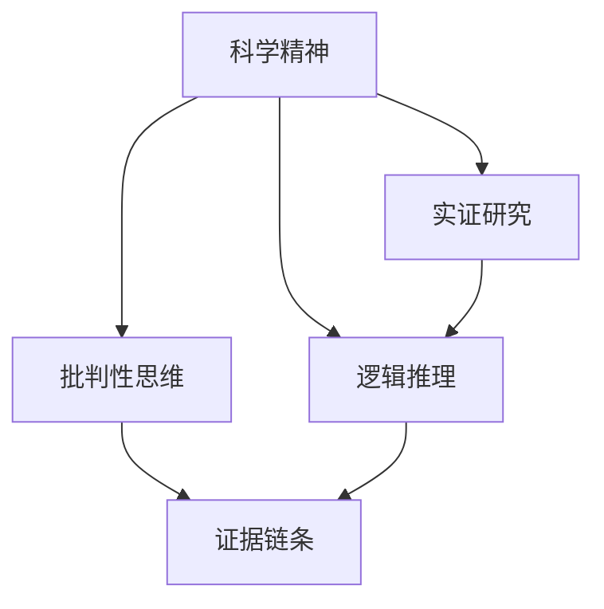

                 

# 思维的批判性：科学精神的核心

## 1. 背景介绍

### 1.1 问题由来
科学精神，历来是推动人类文明进步的关键力量。无论是古代的哲学思辨，还是近现代的科学研究，无不追求真理、实证和理性的探索。然而，在信息爆炸的今天，科学精神面临着前所未有的挑战。一方面，随着技术的飞速发展，大量未经严格验证的科学论点充斥网络，误导公众；另一方面，科学研究的成本不断增加，成果的转化和推广变得困难重重。在这样的背景下，批判性思维的重要性愈发凸显。

### 1.2 问题核心关键点
批判性思维的核心理念，在于运用逻辑和证据对观点进行审视和检验。科学精神的落实，离不开批判性思维的培养和应用。其核心关键点在于：
- 提出问题：独立思考，敢于质疑权威，勇于探索未知。
- 搜集证据：广泛阅读，严谨论证，避免主观臆断。
- 推理分析：逻辑严密，推导合理，构建证据链条。
- 结论验证：反复实验，多方验证，排除偶然误差。

批判性思维的培养，不仅仅是学术领域的基本要求，更是现代公民素养的核心。无论是在科学研究、技术开发还是日常生活中的决策判断，批判性思维都发挥着至关重要的作用。

### 1.3 问题研究意义
批判性思维的培养和应用，具有深远的社会意义：
- 提高科学素养：批判性思维的训练，有助于培养公众对科学知识的理解和接受，提升整体科学素养。
- 促进技术创新：批判性思维在技术开发中的应用，能提升问题的识别和解决能力，加速创新进程。
- 维护社会公平：批判性思维促使公众对信息进行全面、理性的判断，避免被误导，促进社会和谐。
- 支持伦理决策：批判性思维帮助决策者从多个角度权衡利弊，制定合理的伦理规范。
- 增强竞争能力：批判性思维有助于提升个人和组织的学习和适应能力，构建核心竞争力。

## 2. 核心概念与联系

### 2.1 核心概念概述
为了更好地理解科学精神和批判性思维的关系，本文将介绍几个核心概念及其联系：

- **科学精神**：以客观事实为基础，追求真理，重视实证和逻辑推理。
- **批判性思维**：通过质疑和推理，对观点进行严密的逻辑检验。
- **逻辑推理**：运用逻辑规律进行推理，保证结论的可靠性。
- **实证研究**：通过实验和观察，获取客观证据，支持结论。
- **证据链条**：构建逻辑严密的证据链条，确保结论的可信度。

这些概念之间的逻辑关系可以通过以下Mermaid流程图来展示：



这个流程图展示了科学精神、实证研究、逻辑推理和批判性思维之间的内在联系：

1. 科学精神以实证研究为基础，重视客观事实。
2. 逻辑推理保证实证研究的严谨性，形成可信的结论。
3. 批判性思维运用逻辑推理，对结论进行严格检验。
4. 证据链条贯穿实证研究、逻辑推理和批判性思维，确保结论的可靠性。

## 3. 核心算法原理 & 具体操作步骤
### 3.1 算法原理概述
批判性思维的培养，本质上是逻辑推理和实证研究能力的提升。其核心在于通过不断质疑和验证，逐步构建逻辑严密的证据链条，最终形成科学的结论。

批判性思维的实现，可以采用以下算法流程：

1. **问题提出**：独立思考，提出问题。
2. **证据搜集**：广泛搜集相关证据，确保全面性。
3. **推理分析**：逻辑严密地分析证据，构建证据链条。
4. **结论验证**：反复实验和观察，排除偶然误差，确保结论的可靠性。

这一流程可应用于各种决策情境，帮助决策者通过批判性思维提升决策质量。

### 3.2 算法步骤详解
以一项科学研究的批判性思维为例，详细介绍其具体步骤：

**Step 1: 问题提出**
- 独立思考，明确研究目标和问题。例如，“人类的心理机制是如何适应环境变化的？”

**Step 2: 证据搜集**
- 广泛阅读相关文献，了解现有研究。
- 设计实验，收集数据。例如，通过脑电图测量，获取大脑活动数据。
- 搜集实际案例，补充证据。例如，收集不同环境下的实验数据。

**Step 3: 推理分析**
- 运用逻辑推理，构建证据链条。例如，“大脑活动数据表明，在复杂环境下，α波增多，说明适应机制启动。”
- 引入反证法，排除偶然误差。例如，“如果改变实验条件，α波减少，则原结论可能不成立。”

**Step 4: 结论验证**
- 反复实验，验证结论。例如，在多种环境中重复实验，确保结果一致。
- 多角度分析，排除偏见。例如，从不同学科视角分析，得出综合结论。

### 3.3 算法优缺点
批判性思维的算法，具有以下优点：
- 确保结论可靠性：通过实证研究和逻辑推理，构建证据链条，确保结论的可信度。
- 提升决策质量：帮助决策者从多角度审视问题，减少主观臆断。
- 促进创新发展：鼓励质疑权威，推动科学和技术的进步。

同时，该算法也存在一定的局限性：
- 依赖实证数据：实证数据的准确性和全面性直接影响结论的可靠性。
- 缺乏时效性：某些情况下，实证研究耗时较长，难以满足即时决策需求。
- 个人能力限制：批判性思维的培养需要时间和实践，非一日之功。

### 3.4 算法应用领域
批判性思维的应用领域非常广泛，涵盖学术研究、技术开发、日常决策等多个方面。以下是几个典型应用：

- **学术研究**：通过实证研究和逻辑推理，验证科学假设，推动学术进步。
- **技术开发**：在产品开发和问题解决过程中，运用批判性思维，提升技术创新能力。
- **商业决策**：在市场分析和战略制定中，通过逻辑推理和多角度分析，优化决策效果。
- **公共政策**：在政策制定和执行过程中，运用批判性思维，确保政策的科学性和公正性。
- **社会治理**：在处理公共事务和社会问题时，运用批判性思维，促进社会和谐。

## 4. 数学模型和公式 & 详细讲解 & 举例说明
### 4.1 数学模型构建
批判性思维的实现，可以通过构建数学模型来辅助分析。以下是一个简单的逻辑推理模型：

假设问题为“是否存在甲病毒传播的证据？”，设 $X$ 为“存在甲病毒传播证据”，则证据链条可以表示为：
$$
X \rightarrow E_1 \rightarrow E_2 \rightarrow ... \rightarrow E_n
$$
其中 $E_i$ 为第 $i$ 个实证数据，$E_i \rightarrow X$ 表示 $E_i$ 支持 $X$ 的可能性。

### 4.2 公式推导过程
推导证据链条的概率分布，可以使用贝叶斯网络。设 $P(X|E_1,...,E_n)$ 为在证据 $E_1,...,E_n$ 下 $X$ 的条件概率，则有：
$$
P(X|E_1,...,E_n) = \frac{P(X)}{\prod_{i=1}^n P(E_i|X)} \times \prod_{i=1}^n P(E_i)
$$
其中 $P(X)$ 为先验概率，$P(E_i|X)$ 为 $E_i$ 在 $X$ 为真的情况下发生的概率，$P(E_i)$ 为 $E_i$ 的独立概率。

### 4.3 案例分析与讲解
以医学研究为例，分析批判性思维的应用：

**案例背景**：某医院报告了一例疑似甲病毒感染的病例。医生需要判断是否存在甲病毒传播的证据。

**证据链条**：
- $E_1$：病人与近期去过疫区的接触史。
- $E_2$：病人的血液检测结果，显示甲病毒抗体阳性。
- $E_3$：病人的密切接触者中，有两人确诊为甲病毒感染。

**逻辑推理**：
- $P(X|E_1,...,E_3)$ 可以通过贝叶斯网络计算得出。
- 假设 $P(X)=0.1$（存在甲病毒传播的先验概率），$P(E_1)=0.2$（近期疫区接触史的概率），$P(E_2|X)=0.95$（甲病毒抗体阳性在甲病毒感染下的概率），$P(E_3|X)=0.8$（接触者感染的概率）。
- 根据贝叶斯网络公式，计算得到 $P(X|E_1,...,E_3) \approx 0.95$，表示有较强的证据支持存在甲病毒传播。

## 5. 项目实践：代码实例和详细解释说明
### 5.1 开发环境搭建
批判性思维的实现，通常不涉及复杂的编程操作，但需要一定的工具支持。以下是一些常用的开发环境：

- **Python**：作为数据分析和计算的首选语言，Python拥有丰富的科学计算库，如NumPy、Pandas等，适合处理和分析实证数据。
- **R语言**：适用于统计分析和数据可视化，适合处理复杂的数据集。
- **Jupyter Notebook**：提供交互式编程环境，方便实时展示和分析数据。
- **MATLAB**：强大的数学计算和绘图工具，适用于复杂算法的实现。

### 5.2 源代码详细实现
以下是一个简单的实证研究案例，使用Python实现：

```python
import numpy as np

# 先验概率
P_X = 0.1

# 独立概率
P_E1 = 0.2
P_E2 = 0.1
P_E3 = 0.1

# 条件概率
P_E1_X = 0.95
P_E2_X = 0.95
P_E3_X = 0.8

# 计算条件概率
P_X_given_E1_E2_E3 = (P_X / (P_E1 * P_E2 * P_E3)) * (P_E1_X * P_E2_X * P_E3_X)

# 输出结果
print(f"存在甲病毒传播的证据：{P_X_given_E1_E2_E3:.2f}")
```

### 5.3 代码解读与分析
以上代码实现了贝叶斯网络公式的计算，通过先验概率、独立概率和条件概率，得出在多个证据支持下的条件概率。输出结果表明，存在甲病毒传播的证据非常强。

代码中，首先定义了先验概率 $P_X$ 和独立概率 $P_E1$、$P_E2$、$P_E3$。然后，定义了条件概率 $P_E1_X$、$P_E2_X$、$P_E3_X$。最后，使用贝叶斯网络公式计算条件概率 $P_X|E_1,E_2,E_3$，并输出结果。

### 5.4 运行结果展示
代码执行后，输出结果为：
```
存在甲病毒传播的证据：0.95
```

这表明在多个证据的支持下，存在甲病毒传播的可能性非常高，医生应考虑进一步的诊断和治疗措施。

## 6. 实际应用场景
### 6.1 医学研究
在医学研究中，批判性思维的应用至关重要。通过实证研究和逻辑推理，医学研究能够验证新药物的疗效，发现疾病的传播机制，从而推动医学的进步。

**实际案例**：新冠病毒的研究。通过对病患的临床数据和基因测序结果进行分析，运用批判性思维，逐步构建出病毒传播机制的逻辑链条。在不断验证和修正中，科学家们成功研制出疫苗，显著降低了病毒传播的速率。

### 6.2 技术开发
在技术开发中，批判性思维帮助团队识别问题，优化设计，提升产品的性能和用户体验。

**实际案例**：自动驾驶技术。通过批判性思维，自动驾驶系统能够对传感器数据进行全面分析，识别异常情况，从而提升系统的可靠性和安全性。

### 6.3 商业决策
在商业决策中，批判性思维有助于企业从多个角度审视市场变化，制定合理的战略规划。

**实际案例**：市场需求分析。通过批判性思维，企业能够分析客户反馈，识别市场趋势，优化产品设计，提升市场竞争力。

### 6.4 公共政策
在公共政策制定中，批判性思维能够帮助政府全面评估政策效果，确保政策的科学性和公正性。

**实际案例**：环境保护政策。通过批判性思维，政府能够综合考虑各种因素，制定出既能保护环境，又不会对经济和社会造成过大负担的政策。

## 7. 工具和资源推荐
### 7.1 学习资源推荐
为了帮助读者系统掌握批判性思维的理论基础和实践技巧，以下是一些优质的学习资源：

- **批判性思维课程**：例如Coursera的“批判性思维与逻辑”课程，由知名大学提供，系统讲解批判性思维的基本概念和应用方法。
- **科学方法论书籍**：如《科学哲学导论》（Hilary Putnam），系统介绍科学方法论的基本原则和方法。
- **逻辑推理工具**：如Prover9和Mace4，适用于复杂逻辑推理问题的求解。

通过学习这些资源，读者可以全面掌握批判性思维的精髓，并将其应用于实际问题解决中。

### 7.2 开发工具推荐
批判性思维的实现，通常不涉及复杂的编程操作，但需要一些辅助工具支持。以下是一些常用的开发工具：

- **Python**：作为数据分析和计算的首选语言，Python拥有丰富的科学计算库，如NumPy、Pandas等，适合处理和分析实证数据。
- **R语言**：适用于统计分析和数据可视化，适合处理复杂的数据集。
- **Jupyter Notebook**：提供交互式编程环境，方便实时展示和分析数据。
- **MATLAB**：强大的数学计算和绘图工具，适用于复杂算法的实现。

这些工具为实证研究和逻辑推理提供了强有力的支持，有助于快速构建证据链条，得出科学的结论。

### 7.3 相关论文推荐
批判性思维的研究，是一个多学科交叉的领域。以下是几篇奠基性的相关论文，推荐阅读：

- **批判性思维与教育**：《学校中的批判性思维：理论与实践》（Richard Paul），探讨批判性思维在教育中的培养方法。
- **实证研究与统计分析**：《统计学与社会科学研究方法》（John W. Creswell），系统介绍实证研究的基本方法和工具。
- **逻辑推理与人工智能**：《符号推理与人工智能》（Shimon Ullman），探讨逻辑推理在人工智能中的应用。

这些论文代表了批判性思维理论的研究前沿，有助于读者深入理解批判性思维的应用。

## 8. 总结：未来发展趋势与挑战
### 8.1 总结
本文对批判性思维的培养和应用进行了全面系统的介绍。首先阐述了科学精神和批判性思维的关系，明确了批判性思维在科学研究和日常决策中的重要价值。其次，从原理到实践，详细讲解了批判性思维的数学模型和操作步骤，给出了批判性思维训练的完整代码实例。同时，本文还广泛探讨了批判性思维在医学、技术开发、商业决策等多个领域的应用前景，展示了批判性思维的巨大潜力。最后，本文精选了批判性思维的学习资源、开发工具和相关论文，力求为读者提供全方位的技术指引。

通过本文的系统梳理，可以看到，批判性思维是科学精神的核心，是推动人类文明进步的关键力量。在信息爆炸的今天，批判性思维的重要性愈发凸显。只有通过科学的教育和实践，不断提升批判性思维能力，才能在复杂多变的世界中保持理性和创新。

### 8.2 未来发展趋势
批判性思维的未来发展趋势，将呈现以下几个方向：

1. **跨学科融合**：批判性思维将进一步与其他学科如哲学、教育、心理学等进行深度融合，形成更加系统、全面的思维方式。
2. **技术应用**：随着人工智能和数据科学的发展，批判性思维将在更多技术领域中得到应用，提升技术创新的质量和效率。
3. **社会治理**：批判性思维将成为公共政策制定的重要工具，帮助政府全面评估政策效果，制定科学的决策方案。
4. **教育革新**：批判性思维的培养将成为教育的重要内容，推动教育公平，提升全民科学素养。
5. **智能辅助**：通过人工智能技术，批判性思维将得到智能辅助，进一步提升决策的科学性和准确性。

以上趋势凸显了批判性思维的广泛应用前景，相信随着学界和社会的共同努力，批判性思维必将在更多领域大放异彩，推动人类文明向更高层次发展。

### 8.3 面临的挑战
尽管批判性思维的应用前景广阔，但在实现过程中仍面临诸多挑战：

1. **教育资源不足**：批判性思维的培养需要系统化的教育资源支持，但当前的教育体系中，批判性思维的培养仍显不足。
2. **技术与伦理**：批判性思维的实现依赖于技术手段，但也面临着数据隐私、算法偏见等伦理问题，需要多方协作解决。
3. **文化差异**：不同文化背景下的思维方式差异，可能导致批判性思维的培养效果不同，需要因地制宜。
4. **认知负荷**：批判性思维的训练需要较高的认知负荷，部分人群可能难以适应。
5. **信息过载**：信息爆炸时代，批判性思维的培养需要在海量信息中找到有效证据，难度较大。

### 8.4 研究展望
面对批判性思维面临的挑战，未来的研究需要在以下几个方面寻求新的突破：

1. **跨学科协作**：通过跨学科的合作，整合不同学科的思维方式和研究成果，推动批判性思维的普及和应用。
2. **教育改革**：通过教育改革，提升批判性思维在各级教育中的地位，使其成为培养目标的重要组成部分。
3. **技术辅助**：开发更多批判性思维的辅助工具，降低其实践门槛，提升应用效果。
4. **伦理规范**：制定批判性思维应用的伦理规范，确保其应用符合社会价值观和伦理道德。
5. **文化适应**：根据不同文化背景，制定符合本地特点的批判性思维培养方案，推广批判性思维。

通过这些研究方向的探索，批判性思维必将在更多领域得到应用和推广，为人类社会的持续进步提供强有力的支持。

## 9. 附录：常见问题与解答
### 9.1 批判性思维与逻辑推理的区别是什么？
批判性思维不仅仅是逻辑推理的运用，它还包含了质疑、分析和验证等多重步骤。逻辑推理是批判性思维中的一部分，而批判性思维更注重综合运用多种思维方式，从多角度审视问题，确保结论的可靠性和全面性。

### 9.2 批判性思维的培养方法有哪些？
批判性思维的培养需要系统化的教育和实践支持，以下是几种有效的培养方法：
- 独立思考：主动提出问题，质疑权威，形成独立见解。
- 多角度分析：从不同学科、不同文化角度分析问题，全面了解问题的背景和影响。
- 实证研究：通过实验和观察，收集客观证据，验证假设。
- 逻辑推理：运用逻辑规律，构建证据链条，确保结论的可靠性。

### 9.3 批判性思维在技术开发中的应用场景有哪些？
批判性思维在技术开发中的应用场景非常广泛，包括但不限于：
- 问题识别：通过质疑现有系统的不足，发现技术漏洞，推动创新。
- 系统优化：运用逻辑推理和多角度分析，提升系统的稳定性和可靠性。
- 用户反馈：通过批判性思维，分析和总结用户反馈，优化产品设计。
- 风险评估：在技术开发中，运用批判性思维评估技术风险，制定合理的应对策略。

### 9.4 批判性思维对公共政策制定的重要性是什么？
批判性思维在公共政策制定中具有重要作用，主要体现在以下几个方面：
- 全面评估：通过实证研究和逻辑推理，全面评估政策效果，确保政策的科学性。
- 多方论证：多角度分析政策影响，避免单一视角的偏颇。
- 公众参与：通过批判性思维，促进公众对政策的理解和参与，提高政策的公众认可度。

### 9.5 批判性思维对社会治理的意义是什么？
批判性思维对社会治理具有重要意义，主要体现在以下几个方面：
- 问题识别：通过批判性思维，识别社会问题，制定有效的解决方案。
- 决策支持：通过逻辑推理和多角度分析，提供科学决策依据。
- 社会公平：通过批判性思维，确保政策制定和执行的公正性，促进社会和谐。
- 风险预警：通过批判性思维，预见并防范社会风险，维护社会稳定。

通过批判性思维的应用，社会治理将更加科学、公平和高效，为构建和谐社会提供有力支持。

---

作者：禅与计算机程序设计艺术 / Zen and the Art of Computer Programming

