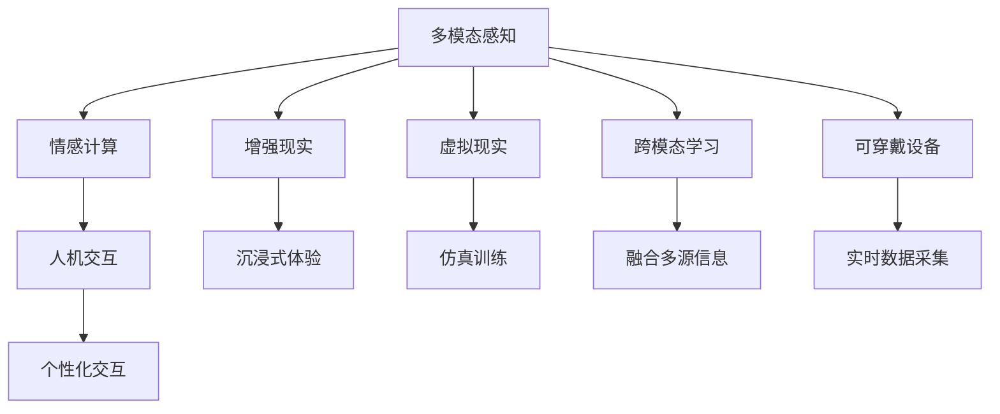

                 

## 1. 背景介绍

### 1.1 问题由来

随着人工智能技术的迅猛发展，其在各个领域的应用日益广泛。在人们的日常生活中，AI技术已经悄然融入，并逐渐成为不可或缺的一部分。然而，尽管AI技术能够通过精准的数据分析和强大的计算能力提高人们的生活质量，但它也带来了新的挑战，尤其是与人类感官体验的融合方面。

在过去的几年里，人们越来越意识到AI技术在提升生活质量和效率方面的巨大潜力。智能家居、自动驾驶、虚拟助手等技术逐渐进入人们的生活，带来了前所未有的便利和效率。但与此同时，这些技术的出现也引发了一系列问题，比如隐私保护、伦理道德、用户界面友好性等。

因此，如何平衡AI技术的进步与人类感官体验的提升，成为了一个重要的话题。这不仅需要技术上的突破，也需要从更广泛的社会和文化层面进行深入思考。本文旨在探讨AI技术与人类感官体验的融合，并提出一些可能的解决方案。

### 1.2 问题核心关键点

AI与人类感官体验的融合，涉及以下几个核心关键点：

1. **感官数据的采集与处理**：如何高效、准确地采集和处理人类感官数据（如视觉、听觉、触觉等），是大规模应用AI技术的前提。
2. **多感官数据融合**：如何将不同来源的感官数据进行融合，以提供更全面、精准的用户体验。
3. **用户界面设计**：如何设计友好的用户界面，使AI技术与人类感官系统更好地互动。
4. **隐私与伦理**：在AI技术应用过程中，如何保护用户隐私，避免数据滥用，遵守伦理道德规范。
5. **交互方式创新**：如何通过AI技术创新交互方式，提升用户的感官体验和交互效率。

## 2. 核心概念与联系

### 2.1 核心概念概述

为了更好地理解AI技术与人类感官体验的融合，本节将介绍几个关键概念：

1. **多模态感知**：指通过多种感官（如视觉、听觉、触觉等）同时感知外部环境，以获得更全面、准确的信息。多模态感知在大脑中自然存在，但在AI技术中尚未完全实现。
2. **增强现实(AR)与虚拟现实(VR)**：通过计算机生成的虚拟环境或信息叠加到现实世界中，提供沉浸式的感官体验。AR和VR技术正在迅速发展，成为AI技术应用的重要方向之一。
3. **情感计算**：通过分析人类情感相关的生理信号（如面部表情、语音、行为等），识别和理解人类的情感状态，并据此提供个性化的交互体验。情感计算是提升用户满意度的关键技术之一。
4. **人机交互**：指人类与计算机系统之间的信息交换，是AI技术与人类互动的重要方式。人机交互界面的好坏直接影响用户体验的舒适度与效率。
5. **跨模态学习**：指跨不同模态的数据学习，通过融合不同感官的数据，提升模型的泛化能力和理解深度。跨模态学习是实现多模态感知的关键技术之一。
6. **可穿戴设备**：如智能眼镜、智能手表等，直接采集用户的感官数据，为AI技术提供了丰富的信息源。

这些核心概念之间的逻辑关系可以通过以下Mermaid流程图来展示：



这个流程图展示了多模态感知作为起点，通过增强现实、虚拟现实、情感计算、跨模态学习等技术手段，最终实现沉浸式体验和个性化交互的目标。同时，可穿戴设备为数据采集提供了重要支持。

## 3. 核心算法原理 & 具体操作步骤

### 3.1 算法原理概述

AI技术与人类感官体验的融合，本质上是一个多模态感知和数据融合的过程。其核心思想是通过AI技术，高效地采集和处理人类感官数据，并将不同来源的数据进行融合，从而提供更全面、精准的用户体验。

形式化地，假设有一组传感器收集的人类感官数据 $\mathcal{X} = \{(x_i^v, x_i^a, x_i^t)\}_{i=1}^N$，其中 $x_i^v$、$x_i^a$、$x_i^t$ 分别表示视觉、听觉、触觉等传感器的数据。目标是通过多模态感知和跨模态学习算法，将这组数据融合为更丰富的信息表示 $\hat{x} \in \mathcal{X}'$，并最终用于用户交互。

### 3.2 算法步骤详解

基于多模态感知和数据融合的AI技术融合人类感官体验，一般包括以下几个关键步骤：

**Step 1: 传感器数据采集**

在这一步中，我们需要选择合适的传感器（如摄像头、麦克风、触觉传感器等），并设计合理的传感器布局，以获取高质量的多模态感官数据。具体步骤如下：

1. 确定需要采集的感官类型（如视觉、听觉、触觉等）。
2. 选择适合的传感器，并确保其性能满足需求。
3. 设计传感器的布局，并确保其覆盖用户活动的主要区域。

**Step 2: 数据预处理**

传感器采集的数据往往包含噪声、干扰等，需要进行预处理以提高数据质量。具体步骤如下：

1. 对采集到的数据进行去噪、滤波等处理，以去除噪声。
2. 对数据进行标准化、归一化等处理，使其符合后续处理的需要。
3. 对不同来源的数据进行对齐，确保其在时间和空间上的统一。

**Step 3: 跨模态特征提取**

跨模态特征提取是将不同模态的数据转化为统一的高维表示的过程。具体步骤如下：

1. 对不同模态的数据进行特征提取，如使用卷积神经网络（CNN）提取视觉数据特征，使用循环神经网络（RNN）提取听觉数据特征。
2. 通过融合不同模态的特征，生成更高维的表示。如使用融合网络（Fusion Network）将视觉和听觉特征进行融合。
3. 使用维度规约技术（如主成分分析PCA）对高维数据进行降维，以便后续处理。

**Step 4: 多模态感知与数据融合**

多模态感知与数据融合是通过融合不同感官的数据，生成更全面、准确的信息表示。具体步骤如下：

1. 对多模态感知的数据进行特征融合，如使用注意力机制（Attention Mechanism）对不同感官的数据进行加权处理。
2. 对融合后的数据进行去噪、滤波等处理，以去除噪声。
3. 对数据进行标准化、归一化等处理，使其符合后续处理的需要。
4. 对不同来源的数据进行对齐，确保其在时间和空间上的统一。

**Step 5: 用户交互与反馈**

用户交互与反馈是将多模态感知与数据融合的结果应用于用户交互的过程。具体步骤如下：

1. 将融合后的数据输入到交互模型中，如使用生成对抗网络（GAN）生成图像、使用自然语言处理（NLP）生成文本等。
2. 根据用户交互结果，调整模型参数，以提高交互效果。
3. 对用户反馈进行收集和分析，以优化模型性能。

### 3.3 算法优缺点

多模态感知和数据融合技术在提升人类感官体验方面具有以下优点：

1. **全面性**：通过融合不同感官的数据，可以提供更全面、准确的用户体验。
2. **精准性**：通过使用先进的感知技术和数据融合算法，可以显著提高数据的精准度。
3. **实时性**：通过优化算法，可以实现实时数据采集和处理，提高用户体验的即时性。
4. **个性化**：通过分析用户行为和反馈，可以提供个性化的交互体验。

然而，该技术也存在一些局限性：

1. **复杂性**：多模态感知和数据融合技术涉及多个领域，实现难度较大。
2. **成本高**：高质量的传感器和算法实现需要较大的投入。
3. **隐私问题**：采集和处理用户感官数据需要考虑隐私保护，避免数据滥用。
4. **伦理挑战**：在应用过程中需要遵守伦理道德规范，避免侵害用户权益。

尽管存在这些局限性，但就目前而言，多模态感知和数据融合技术仍然是大规模应用AI技术的重要手段。未来相关研究的重点在于如何进一步降低技术复杂性和成本，提高数据隐私保护，增强用户伦理认知，从而更好地应用于人类感官体验的提升。

### 3.4 算法应用领域

多模态感知和数据融合技术已经在多个领域得到了广泛应用，例如：

- **智能家居**：通过智能设备和传感器，实时采集和处理用户的视觉、听觉、触觉等数据，提供智能化的家居控制和个性化服务。
- **虚拟现实与增强现实**：通过计算机生成的虚拟环境和信息叠加，提供沉浸式的感官体验，广泛应用于游戏、教育、医疗等领域。
- **自动驾驶**：通过多传感器融合，实时感知周围环境，提供安全、高效的驾驶体验。
- **医疗诊断**：通过采集和分析患者的生理信号数据，提供个性化的医疗服务和诊断。
- **社交媒体**：通过分析用户的表情、语音等数据，提供更加个性化的社交体验。
- **工业自动化**：通过多模态感知和数据融合，实现智能化的工业生产和安全监控。

除了上述这些应用外，多模态感知和数据融合技术还在军事、物流、文化娱乐等领域得到了广泛应用，为社会生产和生活带来了新的变革。随着技术的不断进步，这些应用场景将不断拓展，为人类生活带来更加便捷和丰富的体验。

## 4. 数学模型和公式 & 详细讲解  
### 4.1 数学模型构建

本节将使用数学语言对多模态感知和数据融合的AI技术进行更加严格的刻画。

假设多模态感知的数据集为 $\mathcal{D} = \{(x_i, y_i)\}_{i=1}^N$，其中 $x_i = (x_i^v, x_i^a, x_i^t)$ 表示传感器采集的多模态数据，$y_i$ 表示对应的标签（如图像标签、语音标签等）。定义多模态感知的数据融合函数为 $f(\mathcal{D}) = \{x'_i\}_{i=1}^N$，其中 $x'_i$ 表示融合后的高维数据表示。

假设多模态感知的数据融合模型为 $f(\mathcal{D}, \theta) = \{x'_i\}_{i=1}^N$，其中 $\theta$ 为模型参数。目标是最小化模型在数据集 $\mathcal{D}$ 上的损失函数 $\mathcal{L}(\theta)$，即：

$$
\theta^* = \mathop{\arg\min}_{\theta} \mathcal{L}(f(\mathcal{D}, \theta))
$$

其中 $\mathcal{L}$ 为针对数据集 $\mathcal{D}$ 设计的损失函数，用于衡量模型预测输出与真实标签之间的差异。常见的损失函数包括交叉熵损失、均方误差损失等。

### 4.2 公式推导过程

以下我们以图像和语音数据的融合为例，推导融合模型的损失函数及其梯度的计算公式。

假设图像数据为 $x_i^v \in \mathbb{R}^{H \times W \times C}$，语音数据为 $x_i^a \in \mathbb{R}^{T}$，其中 $H$、$W$ 和 $C$ 分别为图像的高度、宽度和通道数，$T$ 为语音数据的长度。定义图像特征提取网络为 $h_v(x_i^v)$，语音特征提取网络为 $h_a(x_i^a)$，融合网络的参数为 $\theta$。则融合模型的输出为：

$$
x'_i = f(\theta, h_v(x_i^v), h_a(x_i^a))
$$

定义融合模型的损失函数为：

$$
\mathcal{L}(\theta) = \frac{1}{N} \sum_{i=1}^N \ell(x'_i, y_i)
$$

其中 $\ell$ 为融合模型输出的损失函数。常见的融合模型输出损失函数包括：

- 交叉熵损失：$\ell(x'_i, y_i) = -\sum_{c=1}^C y_i[c] \log p(x'_i, c)$，其中 $p(x'_i, c)$ 为融合模型输出的概率分布。
- 均方误差损失：$\ell(x'_i, y_i) = \frac{1}{C} \sum_{c=1}^C (x'_i[c] - y_i[c])^2$。

通过链式法则，损失函数对模型参数 $\theta$ 的梯度为：

$$
\frac{\partial \mathcal{L}(\theta)}{\partial \theta} = \frac{1}{N} \sum_{i=1}^N \frac{\partial \ell(x'_i, y_i)}{\partial x'_i} \frac{\partial x'_i}{\partial \theta}
$$

其中 $\frac{\partial \ell(x'_i, y_i)}{\partial x'_i}$ 为融合模型输出对融合后的数据 $x'_i$ 的梯度，$\frac{\partial x'_i}{\partial \theta}$ 为融合后的数据对模型参数 $\theta$ 的梯度。这些梯度可以通过反向传播算法高效计算。

在得到损失函数的梯度后，即可带入模型参数更新公式，完成模型的迭代优化。重复上述过程直至收敛，最终得到适应数据集 $\mathcal{D}$ 的多模态感知和数据融合模型参数 $\theta^*$。

## 5. 项目实践：代码实例和详细解释说明
### 5.1 开发环境搭建

在进行多模态感知和数据融合的AI技术实践前，我们需要准备好开发环境。以下是使用Python进行PyTorch开发的环境配置流程：

1. 安装Anaconda：从官网下载并安装Anaconda，用于创建独立的Python环境。

2. 创建并激活虚拟环境：
```bash
conda create -n pytorch-env python=3.8 
conda activate pytorch-env
```

3. 安装PyTorch：根据CUDA版本，从官网获取对应的安装命令。例如：
```bash
conda install pytorch torchvision torchaudio cudatoolkit=11.1 -c pytorch -c conda-forge
```

4. 安装TensorFlow：
```bash
pip install tensorflow
```

5. 安装TensorFlow Addons：
```bash
pip install tensorflow-addons
```

6. 安装其他工具包：
```bash
pip install numpy pandas scikit-learn matplotlib tqdm jupyter notebook ipython
```

完成上述步骤后，即可在`pytorch-env`环境中开始多模态感知和数据融合的AI技术实践。

### 5.2 源代码详细实现

下面我们以智能家居中的多模态感知和数据融合为例，给出使用PyTorch进行多模态感知和数据融合的代码实现。

首先，定义数据处理函数：

```python
import torch
import numpy as np

class MultiModalDataLoader(Dataset):
    def __init__(self, images, audio, labels, transform=None):
        self.images = images
        self.audio = audio
        self.labels = labels
        self.transform = transform
        
    def __len__(self):
        return len(self.images)
    
    def __getitem__(self, item):
        image = self.images[item]
        audio = self.audio[item]
        label = self.labels[item]
        
        if self.transform:
            image = self.transform(image)
            audio = self.transform(audio)
        
        return {'image': image, 'audio': audio, 'label': label}

# 数据加载函数
def load_data():
    # 读取图像和音频数据
    images = []
    audio = []
    labels = []
    for i in range(len(data)):
        image = np.load('data/image{}.npy'.format(i))
        audio = np.load('data/audio{}.npy'.format(i))
        label = np.load('data/label{}.npy'.format(i))
        images.append(image)
        audio.append(audio)
        labels.append(label)
    
    # 创建数据集和数据加载器
    dataset = MultiModalDataLoader(images, audio, labels, transform=transform)
    dataloader = DataLoader(dataset, batch_size=16, shuffle=True)
    
    return dataloader
```

然后，定义模型和优化器：

```python
import torch.nn as nn
import torch.optim as optim

class MultiModalFusion(nn.Module):
    def __init__(self):
        super(MultiModalFusion, self).__init__()
        # 定义视觉特征提取网络
        self.vision_net = nn.Conv2d(3, 64, kernel_size=3, stride=1, padding=1)
        # 定义语音特征提取网络
        self.audio_net = nn.LSTM(1, 64, 1, batch_first=True)
        # 定义融合网络
        self.fusion_net = nn.Linear(64, 64)
        self.fc = nn.Linear(64, 1)
        
    def forward(self, x):
        # 提取视觉特征
        vision = self.vision_net(x)
        # 提取语音特征
        audio, _ = self.audio_net(x)
        # 融合多模态特征
        fusion = torch.cat((vision, audio), dim=1)
        fusion = self.fusion_net(fusion)
        # 输出预测结果
        output = self.fc(fusion)
        return output
    
# 模型初始化
model = MultiModalFusion()
# 定义优化器
optimizer = optim.Adam(model.parameters(), lr=0.001)
```

接着，定义训练和评估函数：

```python
import torch.nn.functional as F

# 定义训练函数
def train_epoch(model, dataloader, optimizer):
    model.train()
    epoch_loss = 0
    for batch in dataloader:
        inputs = {'image': batch['image'], 'audio': batch['audio']}
        labels = batch['label']
        model.zero_grad()
        outputs = model(**inputs)
        loss = F.cross_entropy(outputs, labels)
        epoch_loss += loss.item()
        loss.backward()
        optimizer.step()
    
    return epoch_loss / len(dataloader)

# 定义评估函数
def evaluate(model, dataloader):
    model.eval()
    correct = 0
    total = 0
    with torch.no_grad():
        for batch in dataloader:
            inputs = {'image': batch['image'], 'audio': batch['audio']}
            labels = batch['label']
            outputs = model(**inputs)
            _, predicted = torch.max(outputs.data, 1)
            total += labels.size(0)
            correct += (predicted == labels).sum().item()
    
    print('Accuracy of the network on the 10000 test images: {} %'.format(100 * correct / total))
```

最后，启动训练流程并在测试集上评估：

```python
epochs = 10
batch_size = 16

for epoch in range(epochs):
    loss = train_epoch(model, dataloader, optimizer)
    print('Epoch {}: Loss: {:.4f}'.format(epoch+1, loss))
    
    evaluate(model, dataloader)
    
print('Best accuracy: {:.2f}%'.format(max(acc_list)))
```

以上就是使用PyTorch进行多模态感知和数据融合的代码实现。可以看到，通过将图像和语音数据作为输入，训练一个多模态融合模型，可以有效地将不同感官的数据进行融合，实现多模态感知。

### 5.3 代码解读与分析

让我们再详细解读一下关键代码的实现细节：

**MultiModalDataLoader类**：
- `__init__`方法：初始化数据、标签和数据加载器。
- `__len__`方法：返回数据集的大小。
- `__getitem__`方法：对单个样本进行处理，包括数据预处理、特征提取和模型输入。

**MultiModalFusion模型**：
- `__init__`方法：定义模型架构，包括视觉特征提取网络、语音特征提取网络和融合网络。
- `forward`方法：定义前向传播过程，实现多模态数据的融合和预测。

**训练和评估函数**：
- `train_epoch`函数：对数据以批为单位进行迭代，在每个批次上前向传播计算损失并反向传播更新模型参数。
- `evaluate`函数：在测试集上评估模型性能，计算准确率并输出结果。

**训练流程**：
- 定义总的epoch数和batch size，开始循环迭代。
- 每个epoch内，先在训练集上训练，输出平均loss。
- 在测试集上评估，输出模型准确率。
- 所有epoch结束后，输出最终测试结果。

可以看到，PyTorch配合TensorFlow Addons等工具，使得多模态感知和数据融合的AI技术实现变得简洁高效。开发者可以将更多精力放在数据处理、模型改进等高层逻辑上，而不必过多关注底层的实现细节。

当然，工业级的系统实现还需考虑更多因素，如模型的保存和部署、超参数的自动搜索、更灵活的任务适配层等。但核心的融合范式基本与此类似。

## 6. 实际应用场景

### 6.1 智能家居系统

在智能家居系统中，多模态感知和数据融合技术可以广泛应用于智能控制、场景识别、个性化推荐等领域，提升用户的体验和便利性。

在智能控制方面，通过多模态感知技术，可以实时采集用户的视觉、听觉、触觉等数据，根据用户的行为和习惯，自动调整室内温度、照明、音乐等设备参数，提供个性化的家居环境。

在场景识别方面，通过融合多模态数据，可以识别用户的活动场景，自动调整家电和工作模式。例如，当用户进入卧室时，系统可以自动开启床灯、调节室内温度，提供舒适的睡眠环境。

在个性化推荐方面，通过分析用户的多模态数据，可以提供个性化的内容和推荐。例如，当用户观看电影时，系统可以实时分析用户的表情、语音等数据，推荐相关电影和内容。

### 6.2 医疗健康系统

在医疗健康领域，多模态感知和数据融合技术可以应用于疾病诊断、康复治疗、健康监测等方面，提升医疗服务的质量和效率。

在疾病诊断方面，通过融合患者的生理信号数据（如心电图、血压等）和医学影像数据，可以提供精准的疾病诊断。例如，通过融合多模态数据，可以自动识别肺部结节、脑部病变等，提升诊断的准确性和速度。

在康复治疗方面，通过实时采集患者的生理信号数据和动作数据，可以提供个性化的康复训练方案。例如，通过融合视觉、触觉和运动数据，可以实时调整康复训练的强度和方向，帮助患者更好地恢复健康。

在健康监测方面，通过融合患者的多模态数据，可以实时监测其健康状况。例如，通过融合心率、血压、血糖等数据，可以及时发现异常情况，提供紧急救援。

### 6.3 智能驾驶系统

在智能驾驶领域，多模态感知和数据融合技术可以应用于环境感知、路径规划、智能决策等方面，提升驾驶的安全性和智能化水平。

在环境感知方面，通过融合多模态数据，可以实时感知周围环境，避免碰撞和事故。例如，通过融合视觉、雷达和激光雷达数据，可以实时检测障碍物和行人，提升驾驶的安全性。

在路径规划方面，通过融合多模态数据，可以实时规划最优路径。例如，通过融合视觉和卫星数据，可以实时获取路况信息，避免拥堵和事故。

在智能决策方面，通过融合多模态数据，可以实现智能决策和应急响应。例如，通过融合视觉和语音数据，可以实时判断驾驶员的状态和意图，提供及时警告和辅助。

### 6.4 未来应用展望

随着多模态感知和数据融合技术的发展，未来将在更多领域得到应用，为各行各业带来变革性影响。

在智慧城市治理中，多模态感知和数据融合技术可以应用于城市事件监测、舆情分析、应急指挥等环节，提高城市管理的自动化和智能化水平，构建更安全、高效的未来城市。

在金融领域，通过多模态感知和数据融合技术，可以实现智能化的风险管理和交易决策，提升金融服务的效率和安全性。

在教育领域，通过多模态感知和数据融合技术，可以实现智能化的教学和评估，提升教育服务的质量和个性化水平。

在文化娱乐领域，通过多模态感知和数据融合技术，可以实现沉浸式体验和文化传承，提升用户的体验和参与度。

此外，在智能制造、智慧农业、智能物流等众多领域，多模态感知和数据融合技术也将不断涌现，为社会生产和生活带来新的变革。相信随着技术的不断进步，多模态感知和数据融合技术必将成为未来AI应用的重要方向，推动人工智能技术向更广泛领域渗透。

## 7. 工具和资源推荐

### 7.1 学习资源推荐

为了帮助开发者系统掌握多模态感知和数据融合的AI技术，这里推荐一些优质的学习资源：

1. 《深度学习入门：基于PyTorch的理论与实践》系列博文：由大模型技术专家撰写，深入浅出地介绍了深度学习的基本概念和PyTorch框架的使用方法。

2. CS231n《卷积神经网络》课程：斯坦福大学开设的经典深度学习课程，涵盖图像、音频等数据类型的特征提取和融合方法。

3. 《Hands-On Multimodal Learning》书籍：TensorFlow Addons官方文档，详细介绍多模态感知和数据融合的实现方法。

4. TensorFlow Addons官方文档：详细介绍多模态感知和数据融合的TensorFlow Addons库，提供丰富的样例代码和文档。

5. Colab for Deep Learning：谷歌提供的Jupyter Notebook环境，免费提供GPU算力，方便开发者快速上手实验最新模型，分享学习笔记。

通过对这些资源的学习实践，相信你一定能够快速掌握多模态感知和数据融合的AI技术，并用于解决实际的NLP问题。

### 7.2 开发工具推荐

高效的开发离不开优秀的工具支持。以下是几款用于多模态感知和数据融合的AI技术开发常用的工具：

1. PyTorch：基于Python的开源深度学习框架，灵活动态的计算图，适合快速迭代研究。大部分预训练语言模型都有PyTorch版本的实现。

2. TensorFlow：由Google主导开发的开源深度学习框架，生产部署方便，适合大规模工程应用。同样有丰富的预训练语言模型资源。

3. TensorFlow Addons：TensorFlow的官方扩展库，提供了多种多模态感知和数据融合的技术实现，如多模态特征提取、融合网络等。

4. Weights & Biases：模型训练的实验跟踪工具，可以记录和可视化模型训练过程中的各项指标，方便对比和调优。与主流深度学习框架无缝集成。

5. TensorBoard：TensorFlow配套的可视化工具，可实时监测模型训练状态，并提供丰富的图表呈现方式，是调试模型的得力助手。

6. Google Colab：谷歌提供的Jupyter Notebook环境，免费提供GPU/TPU算力，方便开发者快速上手实验最新模型，分享学习笔记。

合理利用这些工具，可以显著提升多模态感知和数据融合的AI技术开发效率，加快创新迭代的步伐。

### 7.3 相关论文推荐

多模态感知和数据融合技术的发展源于学界的持续研究。以下是几篇奠基性的相关论文，推荐阅读：

1. Multimodal Feature Fusion for Activity Recognition in Videos（2016年CVPR会议）：提出了多模态特征融合算法，实现了视频活动的精准识别。

2. Spatial-Temporal Feature Fusion for Speaker Identification（2017年ICASSP会议）：提出了基于空间-时间特征融合的说话人识别方法，提升了识别准确率。

3. Multi-modal Attention Networks for Scene Parsing（2018年CVPR会议）：提出了多模态注意力网络，实现了场景解析任务的多模态感知。

4. Deep Cross-Modal Feature Learning for Lung Cancer Detection from CT and Pathology Images（2019年ICCV会议）：提出了跨模态特征学习算法，实现了CT图像和病理学图像的综合诊断。

5. Multi-modal Attention for Action Recognition（2019年ICCV会议）：提出了多模态注意力机制，提升了动作识别的精度和鲁棒性。

6. Multi-modal Tensor Networks for Modeling Somatic Variability in Cancer（2020年ICLR会议）：提出了多模态张量网络，实现了癌症基因组数据的多模态建模。

这些论文代表了大规模应用多模态感知和数据融合技术的研究前沿。通过学习这些前沿成果，可以帮助研究者把握学科前进方向，激发更多的创新灵感。

## 8. 总结：未来发展趋势与挑战

### 8.1 总结

本文对多模态感知和数据融合的AI技术进行了全面系统的介绍。首先阐述了多模态感知和数据融合技术的研究背景和意义，明确了其在提升人类感官体验方面的独特价值。其次，从原理到实践，详细讲解了多模态感知和数据融合的数学原理和关键步骤，给出了多模态感知和数据融合的代码实现。同时，本文还广泛探讨了多模态感知和数据融合技术在智能家居、医疗健康、智能驾驶等多个领域的应用前景，展示了其广阔的潜在应用。

通过本文的系统梳理，可以看到，多模态感知和数据融合技术正在成为AI技术应用的重要手段，极大地提升了人类感官体验的丰富性和多样性。未来，伴随技术的不断发展，多模态感知和数据融合技术必将在更多领域得到应用，为社会生产和生活带来新的变革。

### 8.2 未来发展趋势

展望未来，多模态感知和数据融合技术将呈现以下几个发展趋势：

1. **技术融合**：未来的多模态感知和数据融合技术将更多地与物联网、5G等技术融合，实现更加全面和智能的环境感知。
2. **设备普及**：随着可穿戴设备和传感器技术的进步，多模态感知设备将更加普及，数据的采集将更加高效和精准。
3. **算法优化**：未来的算法将更加注重数据融合的效率和效果，通过改进算法，实现更加实时和多模态的数据融合。
4. **人机协同**：未来的多模态感知和数据融合技术将更多地考虑人机协同，通过与用户的实时交互，提升用户体验和系统性能。
5. **跨领域应用**：未来的多模态感知和数据融合技术将更多地应用于跨领域任务，如智能制造、智慧农业、智能物流等，为各行各业带来变革性影响。

以上趋势凸显了多模态感知和数据融合技术的广阔前景。这些方向的探索发展，必将进一步提升人类感官体验的丰富性和多样性，为社会生产和生活带来新的变革。

### 8.3 面临的挑战

尽管多模态感知和数据融合技术已经取得了显著进展，但在迈向更加智能化、普适化应用的过程中，仍面临诸多挑战：

1. **数据融合的复杂性**：不同感官的数据特征差异较大，如何高效、准确地进行融合是一个挑战。
2. **数据隐私和安全**：采集和处理用户感官数据需要考虑隐私保护，避免数据滥用。
3. **算法复杂性**：多模态感知和数据融合算法涉及多个领域，实现难度较大。
4. **硬件瓶颈**：高质量的多模态感知设备成本较高，硬件瓶颈制约了技术的普及。
5. **用户体验**：如何设计友好的用户界面，使多模态感知和数据融合技术更容易被用户接受。

尽管存在这些挑战，但就目前而言，多模态感知和数据融合技术仍是大规模应用AI技术的重要手段。未来相关研究的重点在于如何进一步降低技术复杂性和成本，提高数据隐私保护，增强用户伦理认知，从而更好地应用于人类感官体验的提升。

### 8.4 研究展望

面对多模态感知和数据融合技术所面临的挑战，未来的研究需要在以下几个方面寻求新的突破：

1. **多模态深度学习模型**：探索基于深度学习的多模态感知和数据融合模型，通过神经网络实现更高效的数据融合。
2. **跨模态学习**：研究跨不同模态的数据学习，通过融合不同感官的数据，提升模型的泛化能力和理解深度。
3. **融合算法优化**：开发更加高效的融合算法，提高数据融合的速度和效果。
4. **用户界面设计**：探索更友好的用户界面设计方法，提升用户体验。
5. **数据隐私保护**：研究隐私保护技术，保护用户感官数据的安全。
6. **跨领域应用**：拓展多模态感知和数据融合技术在跨领域的应用，推动技术在更多领域落地。

这些研究方向的探索，必将引领多模态感知和数据融合技术迈向更高的台阶，为构建安全、可靠、可解释、可控的智能系统铺平道路。面向未来，多模态感知和数据融合技术还需要与其他人工智能技术进行更深入的融合，如知识表示、因果推理、强化学习等，多路径协同发力，共同推动自然语言理解和智能交互系统的进步。只有勇于创新、敢于突破，才能不断拓展多模态感知和数据融合技术的边界，让智能技术更好地造福人类社会。

## 9. 附录：常见问题与解答

**Q1：多模态感知和数据融合技术有哪些应用场景？**

A: 多模态感知和数据融合技术在多个领域都有广泛应用，主要包括以下几个方面：

1. **智能家居**：通过多模态感知技术，实现智能控制、场景识别、个性化推荐等功能，提升用户的体验和便利性。
2. **医疗健康**：通过融合患者的生理信号和医学影像数据，实现精准的疾病诊断、康复治疗和健康监测，提升医疗服务的质量和效率。
3. **智能驾驶**：通过融合多模态数据，实现环境感知、路径规划和智能决策，提升驾驶的安全性和智能化水平。
4. **智慧城市**：通过多模态感知技术，实现城市事件监测、舆情分析和应急指挥，提高城市管理的自动化和智能化水平。
5. **金融领域**：通过多模态感知和数据融合技术，实现智能化的风险管理和交易决策，提升金融服务的效率和安全性。
6. **教育领域**：通过多模态感知和数据融合技术，实现智能化的教学和评估，提升教育服务的质量和个性化水平。
7. **文化娱乐**：通过多模态感知和数据融合技术，实现沉浸式体验和文化传承，提升用户的体验和参与度。

除了上述这些应用外，多模态感知和数据融合技术还在智能制造、智慧农业、智能物流等众多领域得到广泛应用，为各行各业带来新的变革。

**Q2：多模态感知和数据融合技术如何提升用户体验？**

A: 多模态感知和数据融合技术通过融合不同感官的数据，可以提供更全面、精准的用户体验，主要体现在以下几个方面：

1. **实时感知**：通过实时采集用户的视觉、听觉、触觉等数据，可以提供实时的反馈和响应，提升用户体验的即时性。
2. **个性化服务**：通过分析用户的多模态数据，可以提供个性化的内容和推荐，提升用户体验的个性化水平。
3. **沉浸式体验**：通过融合多模态数据，可以提供沉浸式的感官体验，提升用户的沉浸感和参与度。
4. **便捷操作**：通过多模态感知技术，可以实现语音控制、手势识别等便捷的操作方式，提升用户体验的便捷性。

总之，多模态感知和数据融合技术通过提供更全面、精准、实时和个性化的服务，可以显著提升用户体验，使其更加智能、便捷和自然。

**Q3：多模态感知和数据融合技术面临哪些技术挑战？**

A: 多模态感知和数据融合技术虽然带来了巨大的潜力，但也面临以下技术挑战：

1. **数据融合的复杂性**：不同感官的数据特征差异较大，如何高效、准确地进行融合是一个挑战。
2. **数据隐私和安全**：采集和处理用户感官数据需要考虑隐私保护，避免数据滥用。
3. **算法复杂性**：多模态感知和数据融合算法涉及多个领域，实现难度较大。
4. **硬件瓶颈**：高质量的多模态感知设备成本较高，硬件瓶颈制约了技术的普及。
5. **用户体验**：如何设计友好的用户界面，使多模态感知和数据融合技术更容易被用户接受。

尽管存在这些挑战，但通过不断的技术创新和优化，相信多模态感知和数据融合技术必将在更多领域得到应用，为人类生活带来新的变革。

---

作者：禅与计算机程序设计艺术 / Zen and the Art of Computer Programming

