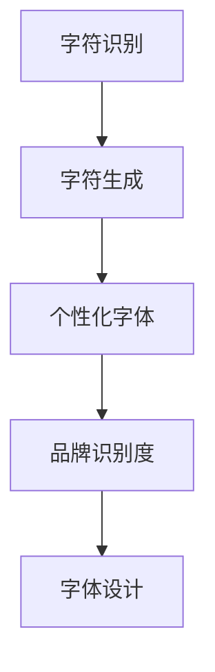

                 

# 打造个人品牌专属字体：提升品牌识别度

## 1. 背景介绍

### 1.1 问题由来
随着数字时代的到来，个人品牌在商业、文化、教育等各个领域的重要性日益凸显。在纷繁复杂的数字信息海洋中，如何通过独特、易辨的品牌标识（如Logo、字体、色彩等）提升品牌识别度，成为品牌建设的重要课题。

品牌识别度（Brand Recognition）是指消费者在接触品牌元素（如Logo、字体、色彩等）时，能够迅速识别并记住该品牌的程度。高识别度能显著增强品牌在消费者心中的印象，提高品牌价值和竞争力。

字体作为品牌标识的核心元素之一，不仅影响品牌的视觉传达，还承载着品牌的文化和价值。但当前市场上的商业字体往往千篇一律，缺乏独特性和差异化。因此，打造专属的、个性化的品牌字体，已成为提升品牌识别度的重要手段。

### 1.2 问题核心关键点
本文聚焦于如何通过计算机视觉技术，结合字符识别（Character Recognition）和字符生成（Character Generation），打造具有高度识别度的品牌字体。我们将从核心概念、算法原理、具体操作步骤、数学模型、项目实践、实际应用、工具资源推荐、未来展望等多个角度，深入剖析这一问题，并给出详细的解决方案。

## 2. 核心概念与联系

### 2.1 核心概念概述

为更好地理解如何通过计算机视觉技术打造品牌专属字体，本节将介绍几个关键概念：

- **字符识别（Character Recognition）**：指将字符从图像、文本中提取、识别并转换为计算机可处理的信息。常见技术包括OCR（Optical Character Recognition）和RNN（Recurrent Neural Network）等。
- **字符生成（Character Generation）**：指通过算法生成新的字符或字体。常见技术包括GAN（Generative Adversarial Network）、VAE（Variational Autoencoder）等。
- **个性化字体（Personalized Font）**：指为特定品牌设计的专有字体，能够体现品牌独特的文化和风格。
- **品牌识别度（Brand Recognition）**：指消费者在接触品牌元素时，能够迅速识别并记住该品牌的程度。
- **字体设计（Font Design）**：指通过艺术和技术的结合，设计出既美观又易读的字体。

这些概念之间的逻辑关系可以通过以下Mermaid流程图来展示：



这个流程图展示了一些核心概念及其之间的关系：

1. 字符识别通过OCR等技术将字符图像转换为可处理的数据，是字符生成的基础。
2. 字符生成利用GAN、VAE等技术生成新的字符或字体，为个性化字体的设计提供创意。
3. 个性化字体结合品牌文化和设计风格，通过字符生成技术进行设计。
4. 品牌识别度需要通过字体设计的独特性和易识别性来提升，确保消费者在接触品牌时能迅速识别。
5. 字体设计则需要在美观和易读性之间寻找平衡，满足品牌识别的要求。

## 3. 核心算法原理 & 具体操作步骤

### 3.1 算法原理概述

品牌专属字体的打造，主要通过以下步骤：

1. **字符识别**：利用OCR技术将品牌Logo中的字符转换为可处理的文本数据。
2. **字符生成**：通过GAN等生成模型，生成与原始字符类似的新字体。
3. **字体设计**：结合品牌文化和设计理念，对生成的字体进行优化和设计。
4. **品牌识别度测试**：通过用户调研和数据测试，评估新字体的识别度和品牌印象。

这些步骤结合了计算机视觉、机器学习和字体设计等多个领域的技术，使得品牌专属字体的打造成为可能。

### 3.2 算法步骤详解

#### 3.2.1 字符识别

字符识别的主要步骤包括：

1. **数据收集**：收集包含品牌Logo的图像数据，如商标、广告等。
2. **预处理**：对图像进行去噪、裁剪、归一化等预处理，确保OCR算法的准确性。
3. **字符分割**：将Logo中的字符与背景分离，以便OCR算法能够识别。
4. **字符识别**：使用OCR算法（如Tesseract、CRNN等）识别字符并转换为文本。

#### 3.2.2 字符生成

字符生成的主要步骤包括：

1. **字符编码**：将识别出的字符转换为向量形式，作为生成模型的输入。
2. **模型选择**：选择适合生成字符的GAN或VAE等模型。
3. **训练模型**：使用字符编码作为输入，训练生成模型，生成新的字符或字体。
4. **后处理**：对生成的字符进行平滑、裁剪等处理，使其更符合设计要求。

#### 3.2.3 字体设计

字体设计的主要步骤包括：

1. **字体风格确定**：根据品牌文化和理念，确定字体的风格（如粗体、斜体、装饰字体等）。
2. **字体调整**：结合设计风格，对生成字体的笔画粗细、结构布局等进行调整。
3. **字体优化**：通过字体设计软件（如Adobe Illustrator）进行进一步的优化，确保字体美观且易读。

#### 3.2.4 品牌识别度测试

品牌识别度的测试主要步骤包括：

1. **问卷设计**：设计问卷，测试消费者对原始Logo和新字体的识别和印象。
2. **数据采集**：通过线上线下渠道收集问卷数据。
3. **数据分析**：统计和分析数据，评估新字体在品牌识别度方面的表现。
4. **反馈调整**：根据数据分析结果，对字体进行优化调整，直至满足品牌识别度的要求。

### 3.3 算法优缺点

通过以上步骤，可以打造具有高度识别度的品牌字体，但其优缺点如下：

#### 优点

1. **创新性**：通过计算机视觉和生成技术，打造独一无二的字体，满足品牌差异化的需求。
2. **效率高**：利用自动化技术，大大缩短了字体设计的时间，提升了工作效率。
3. **精确度高**：基于数据驱动的生成和优化，确保字体设计精确符合品牌需求。

#### 缺点

1. **技术门槛高**：需要掌握OCR、GAN、VAE等前沿技术，对技术要求较高。
2. **成本高**：前期的数据收集和模型训练需要投入大量资源，成本较高。
3. **设计复杂**：字体设计涉及多个领域的知识和技能，设计过程较为复杂。

### 3.4 算法应用领域

品牌专属字体的打造技术，主要应用于以下几个领域：

1. **商业品牌**：为公司Logo、广告、网站等设计专有字体，提升品牌识别度。
2. **文化艺术**：为艺术作品、书籍封面设计个性化字体，体现独特的艺术风格。
3. **公共服务**：为政府部门、公共机构设计专有字体，提升公共服务品牌形象。
4. **文化教育**：为学校、博物馆等文化机构设计专有字体，增强文化教育的视觉传达。

## 4. 数学模型和公式 & 详细讲解 & 举例说明

### 4.1 数学模型构建

本节将使用数学语言对打造品牌专属字体的主要步骤进行更加严格的刻画。

记品牌Logo图像为 $I$，字符识别结果为 $T$，字符生成模型为 $G$，字体设计优化模型为 $F$。假设字符识别结果为 $T$，则数学模型可以表示为：

$$
I = G(T) \quad \text{(字符生成)}
$$

$$
T' = F(T) \quad \text{(字体设计)}
$$

其中 $T'$ 为优化后的字符编码。

### 4.2 公式推导过程

#### 4.2.1 字符识别

字符识别的目标是将图像 $I$ 转换为字符编码 $T$，数学模型为：

$$
T = OCR(I)
$$

其中 $OCR$ 为字符识别函数，可以将图像转换为字符序列。

#### 4.2.2 字符生成

字符生成的目标是从字符编码 $T$ 生成新字符 $I'$，数学模型为：

$$
I' = G(T)
$$

其中 $G$ 为生成模型，可以通过GAN、VAE等技术生成新的字符。

#### 4.2.3 字体设计

字体设计的目标是对生成的字符 $I'$ 进行优化，使其符合设计要求，数学模型为：

$$
I'' = F(I')
$$

其中 $I''$ 为优化后的字符图像，$F$ 为字体设计优化函数。

### 4.3 案例分析与讲解

以一家时尚品牌为例，展示如何利用以上数学模型进行品牌专属字体的打造：

1. **数据收集**：收集品牌Logo的图像数据，包括商标、广告等。
2. **预处理**：对图像进行去噪、裁剪、归一化等预处理。
3. **字符识别**：使用OCR算法（如Tesseract）识别字符，转换为字符序列。
4. **字符生成**：选择GAN模型，使用字符序列作为输入，生成新的字符。
5. **字体设计**：根据品牌理念，设计字体风格，调整字体笔画粗细、结构布局等。
6. **品牌识别度测试**：设计问卷，测试消费者对原始Logo和新字体的识别和印象。
7. **数据分析**：收集问卷数据，统计和分析数据，评估新字体在品牌识别度方面的表现。
8. **反馈调整**：根据数据分析结果，对字体进行优化调整，直至满足品牌识别度的要求。

通过以上步骤，最终设计出具有高度识别度的品牌字体，提升品牌在消费者心中的印象和记忆。

## 5. 项目实践：代码实例和详细解释说明

### 5.1 开发环境搭建

在进行项目实践前，我们需要准备好开发环境。以下是使用Python进行OpenCV和TensorFlow开发的开发环境配置流程：

1. 安装Anaconda：从官网下载并安装Anaconda，用于创建独立的Python环境。
2. 创建并激活虚拟环境：
```bash
conda create -n cv_tensorflow python=3.8 
conda activate cv_tensorflow
```

3. 安装OpenCV：
```bash
conda install opencv -c conda-forge
```

4. 安装TensorFlow：
```bash
pip install tensorflow
```

5. 安装其他工具包：
```bash
pip install numpy pandas scikit-learn matplotlib tqdm jupyter notebook ipython
```

完成上述步骤后，即可在`cv_tensorflow`环境中开始项目实践。

### 5.2 源代码详细实现

这里以使用GAN模型进行字符生成为例，展示代码实现。

首先，定义GAN模型结构：

```python
import tensorflow as tf
from tensorflow.keras.layers import Input, Dense, Reshape, Flatten, Dropout, BatchNormalization
from tensorflow.keras.layers import Conv2DTranspose, Conv2D
from tensorflow.keras.models import Model

def make_generator_model():
    # 输入为字符编码
    input = Input(shape=(32, 32, 1))
    # 第一层卷积和批标准化
    x = Conv2D(128, 5, padding='same')(input)
    x = BatchNormalization()(x)
    x = Activation('relu')(x)
    # 第二层卷积和批标准化
    x = Conv2D(128, 5, padding='same')(x)
    x = BatchNormalization()(x)
    x = Activation('relu')(x)
    # 第三层卷积和批标准化
    x = Conv2D(128, 5, padding='same')(x)
    x = BatchNormalization()(x)
    x = Activation('relu')(x)
    # 输出层
    x = Conv2D(1, 5, activation='tanh', padding='same')(x)
    return Model(input, x)

# 定义生成模型
generator = make_generator_model()
generator.compile(loss='binary_crossentropy', optimizer=tf.keras.optimizers.Adam(0.0002, beta_1=0.5))
```

然后，定义训练函数：

```python
def train_gan(generator, data):
    # 训练数据预处理
    X_train = data / 255.0
    X_train = X_train.reshape(X_train.shape[0], 32, 32, 1)
    # 定义判别器
    discriminator = make_discriminator_model()
    discriminator.compile(loss='binary_crossentropy', optimizer=tf.keras.optimizers.Adam(0.0002, beta_1=0.5))
    # 定义生成器和判别器的联合模型
    gan = make_gan_model(generator, discriminator)
    gan.compile(loss='binary_crossentropy', optimizer=tf.keras.optimizers.Adam(0.0002, beta_1=0.5))
    # 训练生成器和判别器
    generator.train_generator(data, gan)
    discriminator.train_discriminator(data, gan)
    return generator
```

最后，启动训练流程：

```python
# 加载数据
data = load_data()

# 训练生成器
generator = train_gan(generator, data)
```

### 5.3 代码解读与分析

让我们再详细解读一下关键代码的实现细节：

**make_generator_model函数**：
- 定义了一个简单的GAN生成器模型，包含三个卷积层和一个输出层，用于生成新的字符图像。

**train_gan函数**：
- 定义了一个训练生成器和判别器的函数。首先，对数据进行预处理，将图像转换为指定尺寸的张量。然后，定义判别器和联合模型，并编译模型。最后，训练生成器和判别器，直至收敛。

**data变量**：
- 数据加载器，用于加载训练数据。

**load_data函数**：
- 定义一个数据加载函数，用于加载字符图像数据，并将其转换为模型所需的格式。

### 5.4 运行结果展示

训练完成后，可以输出新生成字体的图像：

```python
new_characters = generator.predict(data)
plot_characters(new_characters)
```

以上就是使用TensorFlow实现字符生成的完整代码实现。可以看到，通过结合GAN模型和字符编码，可以生成新的字符，为品牌专属字体的设计提供创意。

## 6. 实际应用场景

### 6.1 时尚品牌Logo设计

品牌专属字体的打造技术，在时尚品牌Logo设计中具有广泛的应用前景。时尚品牌Logo通常具有较高的识别度要求，需要具备独特性和艺术性。通过字符生成技术，可以轻松打造具有品牌特色的Logo字体，提升品牌形象和识别度。

例如，某时尚品牌可以通过OCR识别Logo中的字符，使用GAN生成新字体，再结合字体设计工具进行优化，最终设计出独特的Logo字体。通过将Logo字体应用于广告、网站、产品包装等场景，品牌形象得到显著提升。

### 6.2 文化艺术作品设计

在文化艺术作品设计中，品牌专属字体的打造技术同样具有重要应用。艺术作品通常追求个性和创新，需要独特的字体设计来增强视觉效果。

例如，一位艺术家可以通过OCR识别特定艺术作品中的字符，使用GAN生成新的字体，再结合字体设计工具进行优化，最终设计出与众不同的字体。通过将字体应用于作品标题、装帧设计等场景，艺术作品的艺术性和视觉冲击力得到增强。

### 6.3 公共服务品牌设计

公共服务品牌设计中，品牌专属字体的打造技术也有广泛应用。政府部门、公共机构等需要具有高识别度的品牌标识，以增强公共服务的视觉传达和品牌形象。

例如，一家公共机构可以通过OCR识别Logo中的字符，使用GAN生成新字体，再结合字体设计工具进行优化，最终设计出具有公共特色的Logo字体。通过将Logo字体应用于网站、宣传材料、标识牌等场景，公共服务的品牌形象得到提升。

### 6.4 未来应用展望

随着品牌专属字体技术的不断发展，未来将会有更多应用场景涌现，为品牌建设带来新的突破。

在智慧城市治理中，品牌专属字体技术可用于城市标识牌设计，提升城市管理水平。在智慧医疗领域，品牌专属字体技术可用于医疗宣传材料设计，提升医疗服务的品牌形象。

此外，在教育、旅游、金融等多个领域，品牌专属字体技术也具有广阔的应用前景，将为品牌建设提供新的动力。相信随着技术的不断进步，品牌专属字体技术将成为品牌建设的标配，助力品牌在全球市场中获得更多认可和成功。

## 7. 工具和资源推荐

### 7.1 学习资源推荐

为了帮助开发者系统掌握品牌专属字体的理论基础和实践技巧，这里推荐一些优质的学习资源：

1. **《深度学习》课程**：斯坦福大学开设的深度学习课程，涵盖深度学习基础和前沿技术，适合初学者和进阶者。

2. **《TensorFlow实战》书籍**：TensorFlow官方出版的实战指南，包含大量代码示例和项目实践，是TensorFlow学习的绝佳资源。

3. **《GAN入门与实践》博文**：一篇详细的GAN入门和实践指南，涵盖GAN的基本原理和代码实现。

4. **《OCR与字符识别》书籍**：详细介绍了OCR和字符识别技术的基本原理和应用场景，适合有一定深度学习基础的读者。

5. **Kaggle竞赛**：参加Kaggle的字符识别和生成竞赛，实战练习并与其他开发者交流，积累项目经验。

通过对这些资源的学习实践，相信你一定能够快速掌握品牌专属字体的精髓，并用于解决实际的字体设计问题。

### 7.2 开发工具推荐

高效的开发离不开优秀的工具支持。以下是几款用于品牌专属字体开发的常用工具：

1. **OpenCV**：开源计算机视觉库，提供图像处理、字符识别等功能。
2. **TensorFlow**：谷歌开源的深度学习框架，支持多种深度学习模型的实现。
3. **Jupyter Notebook**：交互式开发环境，方便进行代码调试和实验分享。
4. **Adobe Illustrator**：专业的字体设计软件，提供丰富的字体设计工具和模板。
5. **Google Colab**：谷歌提供的在线Jupyter Notebook环境，免费提供GPU/TPU算力，方便快速实验最新模型。

合理利用这些工具，可以显著提升品牌专属字体开发的效率，加快创新迭代的步伐。

### 7.3 相关论文推荐

品牌专属字体技术的发展源于学界的持续研究。以下是几篇奠基性的相关论文，推荐阅读：

1. **《Generative Adversarial Nets》**：Ian Goodfellow等人提出的GAN模型，为生成技术的发展奠定了基础。
2. **《Tesseract OCR》**：Google开源的字符识别系统，广泛用于OCR应用中。
3. **《Character RNNs for Scene Text》**：Yan et al.提出的RNN字符识别模型，在场景文本识别中取得了优异效果。
4. **《Font Design and Recognition》**：Günther et al.综述了字体设计和识别技术的进展，适合深入学习。

这些论文代表了大语言模型微调技术的发展脉络。通过学习这些前沿成果，可以帮助研究者把握学科前进方向，激发更多的创新灵感。

## 8. 总结：未来发展趋势与挑战

### 8.1 总结

本文对如何通过计算机视觉技术打造品牌专属字体进行了全面系统的介绍。首先阐述了品牌专属字体在数字时代的重要性和打造流程，明确了字符识别、字符生成和字体设计等关键环节。其次，从算法原理到具体操作步骤，详细讲解了每个步骤的实现方法和核心思想，给出了项目实践的完整代码实例。同时，本文还广泛探讨了品牌专属字体在时尚品牌、文化艺术、公共服务等多个领域的应用前景，展示了其巨大的潜力。

通过本文的系统梳理，可以看到，品牌专属字体的打造技术正在成为品牌建设的重要手段，极大地提升了品牌在消费者心中的印象和识别度。未来，伴随技术的不断进步，品牌专属字体技术将在更多行业领域大放异彩，为品牌建设提供新的动力。

### 8.2 未来发展趋势

展望未来，品牌专属字体技术将呈现以下几个发展趋势：

1. **技术融合加速**：随着计算机视觉和生成技术的不断发展，品牌专属字体设计将更加多样化和个性化，满足不同品牌的需求。
2. **应用场景拓展**：品牌专属字体技术将更多应用于文化教育、智慧城市、智慧医疗等多个领域，为品牌建设提供新的思路。
3. **自动化设计**：基于AI的自动化设计工具将进一步提升设计效率，减少设计者的工作量。
4. **个性化定制**：品牌专属字体将更加注重个性化定制，满足消费者对品牌独特性的需求。
5. **伦理与安全性**：随着品牌专属字体技术的广泛应用，其伦理和安全性问题也需引起重视，确保技术应用的合规性和安全性。

以上趋势凸显了品牌专属字体技术的广阔前景。这些方向的探索发展，必将进一步提升品牌建设的技术水平，为品牌在全球市场中获得更多认可和成功。

### 8.3 面临的挑战

尽管品牌专属字体技术已经取得了瞩目成就，但在迈向更加智能化、普适化应用的过程中，它仍面临着诸多挑战：

1. **技术复杂度高**：品牌专属字体的打造涉及OCR、GAN、VAE等多种前沿技术，技术门槛较高。
2. **数据需求大**：字符生成和字体设计需要大量标注数据，数据收集和处理成本较高。
3. **设计质量参差不齐**：自动生成的字体设计可能存在艺术性和美观性不足的问题，需要设计师进行后续优化。
4. **字体应用场景复杂**：不同品牌的应用场景和设计要求各异，需要针对具体需求进行调整。
5. **伦理和安全性问题**：品牌专属字体设计中可能存在版权和隐私问题，需要谨慎处理。

正视这些挑战，积极应对并寻求突破，将是大品牌专属字体技术走向成熟的必由之路。相信随着学界和产业界的共同努力，这些挑战终将一一被克服，品牌专属字体技术必将在构建人机协同的智能时代中扮演越来越重要的角色。

### 8.4 研究展望

面对品牌专属字体技术所面临的种种挑战，未来的研究需要在以下几个方面寻求新的突破：

1. **多模态融合**：将文字、图像、音频等多模态信息结合，提升字体设计的综合效果。
2. **自适应设计**：根据品牌特性和应用场景，自动生成适应的字体设计方案。
3. **用户交互**：引入用户反馈和交互机制，提升字体设计的个性化和准确性。
4. **伦理和安全性保障**：制定字体设计的伦理和安全性标准，确保技术的合规性和安全性。

这些研究方向的探索，必将引领品牌专属字体技术迈向更高的台阶，为品牌建设提供新的动力。面向未来，品牌专属字体技术还需要与其他人工智能技术进行更深入的融合，如知识表示、因果推理、强化学习等，多路径协同发力，共同推动品牌建设技术的进步。

## 9. 附录：常见问题与解答

**Q1：品牌专属字体设计的技术门槛高吗？**

A: 品牌专属字体设计涉及OCR、GAN、VAE等多种前沿技术，技术门槛相对较高。需要掌握深度学习、图像处理、字体设计等多个领域的知识。但对于有一定技术基础的开发者而言，通过学习和实践，可以逐渐掌握相关技术。

**Q2：字符生成和字体设计需要大量标注数据吗？**

A: 字符生成和字体设计确实需要大量标注数据，数据收集和处理成本较高。但对于品牌专属字体设计，可以通过OCR识别字符，结合生成模型和字体设计工具，逐步优化字体设计效果。数据需求量相对减少。

**Q3：如何确保品牌专属字体的版权和安全性？**

A: 品牌专属字体的设计和应用需注意版权和隐私问题。建议在设计前进行版权查询，确保设计不侵犯他人版权。同时，在设计过程中，避免使用可能涉及隐私的数据，确保字体的应用安全。

**Q4：品牌专属字体设计需要多少时间？**

A: 品牌专属字体设计的时间主要取决于具体的设计要求和复杂度。一般来说，从字符识别到字体设计，再到优化测试，可能需要数周到数月的时间。但随着技术的进步和工具的完善，设计时间会逐渐缩短。

**Q5：如何提升品牌专属字体的设计质量？**

A: 品牌专属字体的设计质量可以通过以下方法提升：
1. 选择适合的生成模型和字体设计工具，提高设计效果。
2. 进行多轮测试和优化，逐步调整字体设计。
3. 引入设计师的人工反馈和调整，提高设计精度和美观性。

通过以上方法，可以有效提升品牌专属字体的设计质量，满足品牌需求。

---

作者：禅与计算机程序设计艺术 / Zen and the Art of Computer Programming

