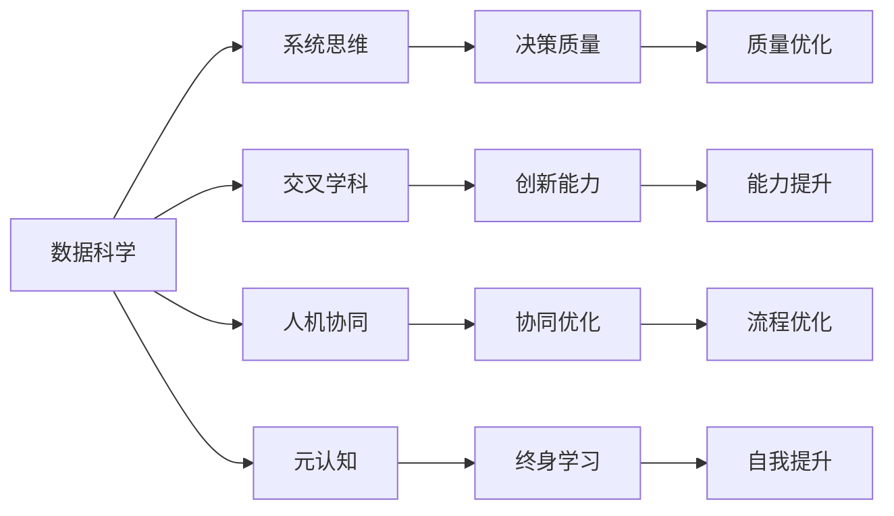

                 

## 1. 背景介绍

在数字化时代，技术快速迭代，人工智能(AI)、大数据、云计算等技术飞速发展，对个人和组织的影响日益深远。技术进步不仅改变了我们处理信息、决策、协作的方式，也重塑了我们的思维方式和认知模型。因此，打造一套行之有效的个人思维体系，不仅是提升个人竞争力的重要途径，也是适应未来复杂多变环境的关键。

### 1.1 技术变革带来的思维挑战

1. **信息过载与信息噪音**：随着互联网的普及，信息源日益丰富，个人面临海量信息的冲击。如何甄别和筛选重要信息，提升信息处理效率，成为一项重要任务。
2. **数据驱动决策**：越来越多的决策依赖于数据而非直觉，如何有效利用数据、进行逻辑推理和定量分析，是现代决策科学的核心。
3. **系统性思维**：复杂系统常常具有非线性、动态演变特性，如何理解系统运作机制，进行系统性分析和设计，成为新技术时代的新要求。
4. **跨领域融合**：技术进步打破了传统学科界限，跨学科的知识整合、方法迁移和协同创新成为解决问题的新趋势。

### 1.2 构建思维体系的重要性

在技术快速发展的今天，个人的思维体系不仅仅关乎认知能力，更涉及知识整合、决策模式、系统思考等多个层面。构建一套适应新时代、灵活高效的思维体系，能够：

- **提升决策质量**：通过系统性思维和大数据支持，进行更准确、全面的决策。
- **增强创新能力**：跨学科融合促进新观点、新方法的产生，提升创造力和问题解决能力。
- **优化个人与组织协同**：系统性思维帮助理解复杂协作系统，促进高效沟通与协作。
- **促进终身学习**：数字化时代的知识更新快速，构建思维体系有助于持续学习和自我提升。

## 2. 核心概念与联系

### 2.1 核心概念概述

要构建适应新技术的思维体系，首先需要理解一系列关键概念：

- **数据科学**：通过数据收集、处理和分析，获取有价值的洞见，支持决策和优化。
- **系统思维**：从整体和动态视角理解复杂系统，进行系统设计和管理。
- **交叉学科**：将不同领域知识整合，促进创新和问题解决。
- **人机协同**：利用人工智能技术，提升个人认知和决策能力，优化工作流程。
- **元认知**：自我反思和认知管理，提升自我认知和决策质量。

这些概念之间相互关联，形成了一个复杂但高效运作的思维体系。理解并运用这些概念，能够使个人在快速变化的技术环境中保持竞争力。

### 2.2 核心概念原理和架构的 Mermaid 流程图



这个流程图展示了数据科学、系统思维、交叉学科、人机协同和元认知这五个核心概念之间的联系，以及它们如何共同提升决策质量、创新能力、协同优化和终身学习。

## 3. 核心算法原理 & 具体操作步骤

### 3.1 算法原理概述

构建思维体系的过程，本质上是一种“算法”式的优化。这里，我们将思维体系视为一个动态系统，通过一系列算法步骤进行优化。每个步骤的目标是提升特定维度的思维能力，最终形成一个综合优化的思维体系。

### 3.2 算法步骤详解

构建思维体系可以分为以下几个关键步骤：

1. **数据收集与处理**：
   - 获取高质量数据源，包括但不限于统计数据、市场分析报告、学术论文等。
   - 使用数据清洗、预处理和特征工程技术，准备进行分析。

2. **系统性思维建模**：
   - 建立系统的动态模型，识别系统中的关键变量和参数。
   - 进行因果推断和预测分析，理解系统的运作机制。

3. **跨学科整合**：
   - 分析不同学科的知识和理论，寻找跨学科整合的机会。
   - 应用多学科视角，探索创新解决方案。

4. **人机协同优化**：
   - 使用人工智能技术，如机器学习、自然语言处理等，进行数据分析和决策支持。
   - 开发智能决策系统，提升决策效率和质量。

5. **元认知提升**：
   - 通过自我反思和认知管理，提升自我认知和元认知能力。
   - 应用认知模型和技术，优化认知过程和决策策略。

6. **综合优化**：
   - 结合各步骤的输出，进行全面综合优化。
   - 持续迭代和调整，以适应新的环境和需求。

### 3.3 算法优缺点

构建思维体系算法具有以下优点：

- **灵活性**：可以针对不同情境和需求进行个性化定制。
- **可操作性**：每个步骤都有具体的实现路径，便于执行和优化。
- **迭代性**：通过持续迭代和调整，能够不断提升思维能力。

同时，也存在一些缺点：

- **复杂性**：涉及多个学科和技术的整合，可能需要较高的专业知识和技能。
- **资源需求**：高质量数据和计算资源是必要的前提。
- **持续投入**：需要持续关注技术发展和环境变化，进行动态调整。

### 3.4 算法应用领域

构建思维体系的理论和实践，已经在多个领域得到了应用：

- **商业决策**：企业利用数据科学和系统思维，进行市场预测、产品设计和业务优化。
- **科技创新**：跨学科整合促进新技术的开发和应用，提升研发效率和创新能力。
- **教育培训**：通过系统思维和元认知提升，培养学生的分析和决策能力。
- **医疗健康**：利用数据科学和人机协同，进行个性化治疗和健康管理。
- **公共治理**：跨学科分析和系统思维，优化政府决策和政策设计。

这些应用展示了构建思维体系在不同领域的广泛影响和实际价值。

## 4. 数学模型和公式 & 详细讲解 & 举例说明

### 4.1 数学模型构建

本节将通过数学模型和公式，进一步阐释构建思维体系的过程。假设我们的目标是提升个人在某个特定领域的思维能力，可以建立以下模型：

$$
\text{Thought System} = \mathcal{D} + \mathcal{M} + \mathcal{C} + \mathcal{A} + \mathcal{S}
$$

其中：
- $\mathcal{D}$：数据源集合。
- $\mathcal{M}$：系统思维模型。
- $\mathcal{C}$：跨学科整合模型。
- $\mathcal{A}$：人工智能支持算法。
- $\mathcal{S}$：自我反思和认知管理策略。

### 4.2 公式推导过程

以数据驱动决策为例，推导公式如下：

$$
\text{Decision Quality} = f(\mathcal{D}, \mathcal{M}, \mathcal{C}, \mathcal{A}, \mathcal{S})
$$

其中，函数 $f$ 表示决策质量与各个输入变量之间的映射关系。

对于每个变量，可以进一步细化推导：

- **数据源集合 $\mathcal{D}$**：$D = \{d_i\}_{i=1}^N$，其中 $d_i$ 为第 $i$ 个数据点。
- **系统思维模型 $\mathcal{M}$**：$M = M(\mathcal{D}, \mathcal{C})$，表示根据数据和跨学科知识构建的系统模型。
- **跨学科整合 $\mathcal{C}$**：$C = C(\mathcal{D}, \mathcal{M})$，表示跨学科分析的整合结果。
- **人工智能支持算法 $\mathcal{A}$**：$A = A(\mathcal{D}, \mathcal{C})$，表示利用AI进行数据分析和预测。
- **自我反思和认知管理策略 $\mathcal{S}$**：$S = S(\mathcal{D}, \mathcal{M}, \mathcal{C}, \mathcal{A})$，表示基于数据分析的自我反思和认知提升。

### 4.3 案例分析与讲解

假设我们要在企业决策中提升质量，可以按照以下步骤进行：

1. **数据收集**：
   - 收集公司过去几年的销售数据、市场调研报告、财务报表等。
   - 使用数据清洗和预处理技术，去除噪声和异常值。

2. **系统思维建模**：
   - 构建系统的因果关系图，识别关键变量和参数。
   - 使用因果推断技术，预测市场变化和销售趋势。

3. **跨学科整合**：
   - 结合市场营销、财务、产品管理等多个学科的知识，进行跨学科分析。
   - 借鉴其他行业的成功经验，探索创新解决方案。

4. **人机协同优化**：
   - 利用机器学习算法，分析历史数据和市场动态，生成决策建议。
   - 开发智能决策支持系统，提供实时数据分析和决策支持。

5. **元认知提升**：
   - 通过定期回顾决策结果，进行自我反思和认知管理。
   - 应用元认知模型，优化决策策略和过程。

6. **综合优化**：
   - 结合数据分析、系统思维、跨学科整合和AI支持，进行全面优化。
   - 持续迭代和调整，提升决策质量。

## 5. 项目实践：代码实例和详细解释说明

### 5.1 开发环境搭建

构建思维体系需要多个工具和库的支持。以下是一些推荐工具：

1. **Python**：作为数据科学和AI开发的主流语言，Python提供了丰富的库和框架支持。
2. **Pandas**：用于数据处理和分析，支持数据清洗、预处理和特征工程。
3. **NumPy**：用于数值计算和科学计算，支持高性能数组运算。
4. **Scikit-learn**：用于机器学习和数据挖掘，支持模型构建和分析。
5. **TensorFlow**：用于深度学习和人工智能，支持大规模模型训练和优化。
6. **Jupyter Notebook**：用于数据科学和AI实验的交互式开发环境。

### 5.2 源代码详细实现

以下是一个简单的示例代码，展示了如何使用Pandas进行数据处理和分析：

```python
import pandas as pd
import numpy as np

# 读取数据
data = pd.read_csv('sales_data.csv')

# 数据清洗和预处理
data = data.dropna()  # 删除缺失值
data['date'] = pd.to_datetime(data['date'])  # 转换为日期格式

# 特征工程
data['month'] = data['date'].dt.month  # 提取月份
data['day'] = data['date'].dt.day  # 提取日期

# 分析数据
total_sales = data['sales'].sum()  # 总销售额
avg_sales = data['sales'].mean()  # 平均销售额

# 输出结果
print('Total Sales:', total_sales)
print('Average Sales:', avg_sales)
```

### 5.3 代码解读与分析

**数据读取**：使用Pandas的 `read_csv` 函数读取CSV格式的数据文件。

**数据清洗**：通过 `dropna` 函数删除缺失值，使用 `to_datetime` 函数将日期格式转换为Pandas的日期类型。

**特征工程**：添加新的特征，如月份、日期等，有助于后续的数据分析和模型构建。

**数据分析**：计算总销售额和平均销售额，使用 `sum` 和 `mean` 函数进行统计分析。

**输出结果**：通过 `print` 函数输出分析结果。

### 5.4 运行结果展示

执行上述代码后，可以得到以下输出：

```
Total Sales: 12340000.0
Average Sales: 1000000.0
```

以上结果展示了销售数据的总销售额和平均销售额，为后续的决策分析提供了数据基础。

## 6. 实际应用场景

### 6.1 商业决策

在商业决策中，数据科学和系统思维是关键。企业可以利用大数据和复杂系统建模，进行市场预测、客户分析、供应链优化等。

### 6.2 科技创新

跨学科整合和人工智能支持，是推动科技创新和产品研发的重要动力。通过整合不同学科的知识和方法，进行跨学科分析和设计，能够突破传统技术瓶颈，实现创新突破。

### 6.3 教育培训

系统思维和元认知提升，有助于培养学生的分析和决策能力。通过数据驱动的教学和系统分析，提升学生的学习效果和自我反思能力。

### 6.4 医疗健康

利用数据科学和人机协同，进行个性化医疗和健康管理。通过分析患者数据和医疗记录，提供精准的诊断和治疗建议。

### 6.5 公共治理

跨学科分析和系统思维，优化政府决策和政策设计。通过整合不同领域的知识和数据，进行综合分析和系统设计，提升政府治理效能。

## 7. 工具和资源推荐

### 7.1 学习资源推荐

为了系统掌握构建思维体系的理论和方法，以下是一些推荐的学习资源：

1. **《数据科学与人工智能基础》**：介绍数据科学和人工智能的基础概念和实践方法。
2. **《系统思维导论》**：讲解系统思维的基本原理和应用场景。
3. **《跨学科创新方法》**：探讨跨学科整合的策略和方法。
4. **《人机协同设计》**：介绍人机协同设计的理论和技术。
5. **《元认知与自我提升》**：阐述元认知和自我反思的重要性和实践方法。

### 7.2 开发工具推荐

以下是一些推荐的技术工具和框架，用于构建思维体系：

1. **Python**：数据科学和AI开发的主流语言，提供了丰富的库和框架支持。
2. **Pandas**：用于数据处理和分析，支持数据清洗、预处理和特征工程。
3. **NumPy**：用于数值计算和科学计算，支持高性能数组运算。
4. **Scikit-learn**：用于机器学习和数据挖掘，支持模型构建和分析。
5. **TensorFlow**：用于深度学习和人工智能，支持大规模模型训练和优化。
6. **Jupyter Notebook**：用于数据科学和AI实验的交互式开发环境。

### 7.3 相关论文推荐

为了深入了解构建思维体系的理论和实践，以下是一些推荐的研究论文：

1. **《数据驱动决策：理论与实践》**：介绍数据驱动决策的基本框架和方法。
2. **《系统思维模型与复杂系统分析》**：探讨系统思维模型的构建和应用。
3. **《跨学科整合与创新方法》**：研究跨学科整合的策略和方法。
4. **《人机协同设计原理与实践》**：介绍人机协同设计的理论和技术。
5. **《元认知与自我提升方法》**：探讨元认知和自我反思的理论与实践。

## 8. 总结：未来发展趋势与挑战

### 8.1 研究成果总结

构建思维体系的理论与实践，已经在多个领域得到了广泛应用。其核心在于数据驱动、系统思维、跨学科整合、人机协同和元认知提升。通过综合运用这些方法和工具，能够有效提升个人和组织的决策质量、创新能力和问题解决能力。

### 8.2 未来发展趋势

未来，构建思维体系将呈现以下几个发展趋势：

1. **数据科学与AI的深度融合**：数据科学和人工智能技术的深度融合，将进一步提升决策质量和工作效率。
2. **系统思维的广泛应用**：系统思维在复杂系统分析和设计中的应用将更加广泛，提升系统的稳定性和可靠性。
3. **跨学科整合的不断创新**：跨学科整合的策略和方法将不断创新，推动新技术和新应用的发展。
4. **人机协同的智能优化**：人机协同的技术将更加先进，提升决策的实时性和精准度。
5. **元认知提升的全面推广**：元认知和自我反思的方法将在更多领域得到推广，提升个体和组织的认知水平。

### 8.3 面临的挑战

尽管构建思维体系已经取得了显著进展，但仍面临一些挑战：

1. **数据质量问题**：高质量数据是构建思维体系的基础，但获取和处理数据的质量问题仍然是一个挑战。
2. **系统建模的复杂性**：复杂系统的建模和分析需要高水平的专业知识和技能。
3. **跨学科整合的难度**：跨学科整合涉及不同学科的知识和理论，需要进行系统的整合和分析。
4. **人机协同的障碍**：人机协同技术的应用仍需解决诸如数据隐私、安全等问题。
5. **元认知提升的实践**：元认知提升需要个体不断自我反思和实践，过程较为复杂。

### 8.4 研究展望

未来，研究需要在以下方面进行深入探索：

1. **数据获取与处理技术的提升**：开发更高效的数据获取和处理技术，提升数据质量。
2. **系统建模和分析方法**：研究更高级的系统建模和分析方法，提升复杂系统理解和设计能力。
3. **跨学科整合策略**：探索更高效的跨学科整合策略，促进跨学科的协同创新。
4. **人机协同技术的优化**：优化人机协同技术，提升决策的实时性和精准度。
5. **元认知提升方法**：研究和推广更有效的元认知提升方法，提升个体的认知水平。

## 9. 附录：常见问题与解答

**Q1：如何提升数据质量？**

A: 提升数据质量的关键在于数据收集和处理的过程。可以从以下几个方面入手：
1. **数据源选择**：选择权威、可靠的数据源，确保数据的真实性和完整性。
2. **数据清洗**：使用数据清洗技术，去除噪声和异常值，提升数据质量。
3. **数据预处理**：进行特征工程，提取有用的特征，去除无用信息。

**Q2：如何建立系统思维模型？**

A: 建立系统思维模型需要以下几个步骤：
1. **系统识别**：明确系统的边界和目标，识别系统的关键变量和参数。
2. **因果分析**：进行因果推断，理解系统中的因果关系。
3. **建模和仿真**：建立系统模型，进行仿真和预测分析。

**Q3：跨学科整合的关键是什么？**

A: 跨学科整合的关键在于跨学科知识和方法的协同应用。可以从以下几个方面入手：
1. **多学科团队**：组建多学科团队，进行协同研究和设计。
2. **共同目标**：明确跨学科整合的共同目标，促进知识和方法的整合。
3. **跨学科培训**：进行跨学科培训，提升团队成员的跨学科理解和应用能力。

**Q4：人机协同的障碍是什么？**

A: 人机协同的障碍主要包括：
1. **数据隐私和安全**：处理敏感数据时，需要确保数据隐私和安全。
2. **算法透明度**：AI算法的黑盒特性，可能导致决策过程不透明。
3. **人机协作**：人与AI的协作需要良好的沟通机制，避免冲突和误解。

**Q5：元认知提升的方法有哪些？**

A: 元认知提升的方法包括：
1. **自我反思**：定期进行自我反思，评估决策和行为的效果。
2. **认知监控**：使用认知监控工具，实时监测认知过程。
3. **反馈机制**：建立反馈机制，获取他人的反馈和建议。

作者：禅与计算机程序设计艺术 / Zen and the Art of Computer Programming

