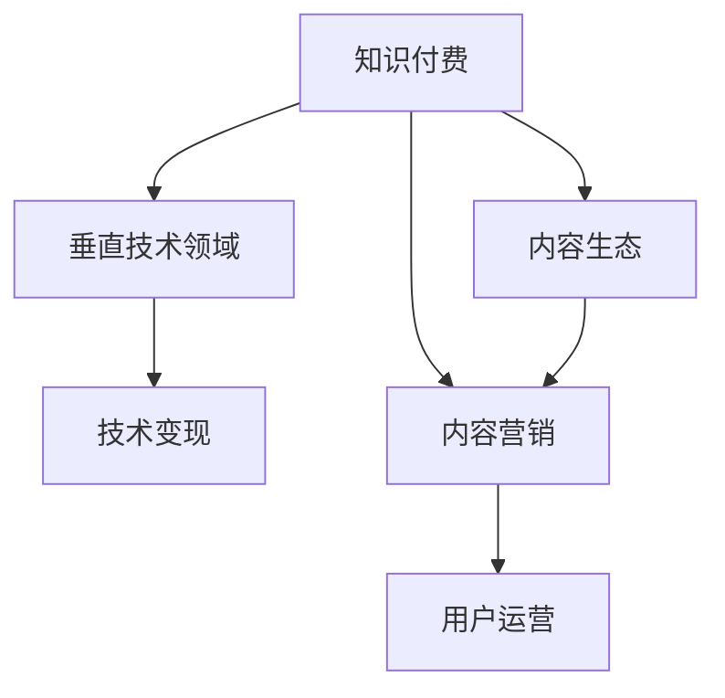

                 

# 打造垂直技术领域的知识付费品牌

> 关键词：知识付费,垂直技术,内容生态,技术变现,内容营销,用户运营

## 1. 背景介绍

### 1.1 问题由来
随着互联网的快速发展，知识付费行业逐渐成为炙手可热的领域。从在线课程、音频讲座到技术博客、论坛社区，各类知识付费形式不断涌现，满足了用户日益增长的知识需求。然而，由于信息过载和低质内容泛滥，导致用户付费意愿下降，市场竞争加剧。

在这一背景下，打造垂直技术领域的知识付费品牌，成为吸引技术用户、提升内容质量和增强品牌影响力的有效手段。通过深入细分垂直领域，提供高质量、高专业度的内容，可以形成独特竞争优势，构建稳定的用户基础。

### 1.2 问题核心关键点
要打造垂直技术领域的知识付费品牌，关键在于以下三个方面：

1. **内容垂直度**：选择具有高度专业性、深度和前沿性的技术主题，构建围绕核心技术的完整知识体系。
2. **技术含量**：保证内容深度和实用性，通过实战案例和深入分析，帮助用户掌握实际技能。
3. **品牌差异化**：在内容创意、呈现方式、用户体验等方面形成独特风格，与竞争对手区隔开来。

通过精确定位和不断创新，可以在垂直技术领域打造出具有核心竞争力的知识付费品牌，满足用户的专业化学习需求。

## 2. 核心概念与联系

### 2.1 核心概念概述

为更好地理解知识付费品牌的打造，本节将介绍几个密切相关的核心概念：

- **知识付费**：通过付费方式获取高质量、高价值的学习内容和知识服务，提升用户的专业技能和知识水平。
- **垂直技术领域**：选择具有高度专业性和深度性的技术主题，聚焦于某一特定技术方向，构建系统化的知识体系。
- **内容生态**：通过知识付费平台构建起的多样化内容形式和分发渠道，形成互利共赢的生态系统。
- **技术变现**：将技术知识和实践经验转化为有价值的付费服务，实现知识价值的经济化。
- **内容营销**：通过高质量的内容吸引目标用户，形成品牌认知度和用户粘性。
- **用户运营**：通过精细化的用户管理和服务，提升用户满意度和忠诚度。

这些核心概念之间的逻辑关系可以通过以下Mermaid流程图来展示：



这个流程图展示知识付费品牌打造的关键要素及其之间的关系：

1. 知识付费是整个体系的起点和终点，是连接内容创作和用户获取的关键。
2. 垂直技术领域是内容创作的根基，决定了品牌的专业性和用户需求匹配度。
3. 内容生态是内容传播和用户获取的重要渠道，构建起品牌和用户之间的互动链条。
4. 技术变现是知识付费的商业模式核心，确保品牌能够持续运营和扩展。
5. 内容营销是吸引用户的关键手段，通过高质量内容提升品牌影响力和用户粘性。
6. 用户运营是用户服务的核心环节，提升用户满意度和品牌忠诚度。

这些概念共同构成了知识付费品牌打造的完整框架，指导我们在实际操作中不断优化各个环节，构建出具有竞争力的垂直技术品牌。

## 3. 核心算法原理 & 具体操作步骤
### 3.1 算法原理概述

打造垂直技术领域的知识付费品牌，本质上是一个从内容创作到用户运营的全流程优化过程。其核心思想是通过精细化运营和持续创新，不断提升内容质量、用户满意度和品牌影响力。

具体来说，品牌打造涉及以下几个关键步骤：

1. **内容策划**：根据市场需求和技术趋势，确定垂直领域和内容主题。
2. **内容生产**：通过高专业度的技术文章、实战案例、视频讲解等多种形式，进行内容创作。
3. **内容分发**：选择合适的分发渠道和平台，扩大内容的覆盖面和影响力。
4. **用户运营**：通过用户反馈和行为数据，不断优化内容和运营策略，提升用户满意度和忠诚度。
5. **品牌打造**：通过技术社区、论坛、博客等多元渠道，构建品牌形象和用户口碑。

这些步骤相互关联，构成了一个完整的知识付费品牌打造循环。

### 3.2 算法步骤详解

以下是打造垂直技术领域知识付费品牌的具体操作步骤：

**Step 1: 内容策划与定位**

- **市场调研**：通过问卷调查、用户访谈等方式，了解目标用户的技术需求和兴趣点，确定垂直领域。
- **趋势分析**：关注技术发展动态，选择有前景的技术方向，构建内容体系。

**Step 2: 内容生产与创作**

- **多渠道内容创作**：
  - 技术文章：撰写深入浅出的技术博客、教程。
  - 实战案例：记录和分析实际项目的开发过程和问题解决。
  - 视频讲解：制作针对技术细节的视频讲解和操作演示。
- **技术专家合作**：邀请技术大咖、实战开发者进行内容创作，保证内容的权威性和实用性。
- **互动式内容**：开发互动式课程、问答平台，提升用户参与度和学习体验。

**Step 3: 内容分发与推广**

- **平台选择**：选择合适的知识付费平台和社交媒体渠道，扩大内容的传播范围。
- **SEO优化**：通过关键词优化、内容推荐等手段，提高内容的搜索引擎排名和曝光率。
- **社区互动**：建立技术社区和论坛，加强用户之间的交流和讨论，形成品牌口碑。
- **广告投放**：利用定向广告投放，吸引目标用户关注和参与。

**Step 4: 用户运营与反馈**

- **数据分析**：收集用户行为数据，分析用户偏好和反馈，优化内容策略。
- **用户互动**：建立用户反馈机制，及时回应用户需求和建议，提升用户体验。
- **用户激励**：通过积分系统、奖励机制等激励用户参与和传播。
- **内容更新**：定期更新和补充内容，保持内容的时效性和实用性。

**Step 5: 品牌打造与传播**

- **品牌形象**：通过高质量的内容和一致的品牌形象，构建品牌形象和用户认知。
- **品牌传播**：通过技术社区、博客、社交媒体等渠道，传播品牌价值和用户口碑。
- **合作伙伴**：与技术大咖、企业合作，提升品牌影响力和公信力。

### 3.3 算法优缺点

打造垂直技术领域的知识付费品牌，具有以下优点：

1. **专业性和权威性**：通过聚焦特定技术领域，构建高度专业性和权威性的内容体系，满足目标用户的需求。
2. **用户忠诚度**：通过互动式内容和精细化运营，提升用户粘性和忠诚度，形成长期稳定的用户基础。
3. **品牌影响力**：通过高质量的内容和品牌传播，构建品牌形象和口碑，提升市场竞争力。

同时，该方法也存在一定的局限性：

1. **初期投入高**：内容策划、专家合作和平台推广都需要较高的时间和金钱投入，对创业团队和资源有限制。
2. **内容更新难度大**：技术发展快速，需要持续的内容更新和优化，以保持内容的最新性和实用性。
3. **市场竞争激烈**：垂直技术领域虽然专业性强，但用户基数有限，市场竞争激烈，需要差异化策略才能脱颖而出。
4. **用户获取困难**：特定技术领域用户有限，需要通过精准的用户定位和推广，吸引用户关注。

尽管存在这些局限性，但就目前而言，垂直技术领域知识付费品牌的打造，仍是技术创作者和企业实现技术变现和市场突破的重要手段。未来相关研究的重点在于如何降低初期投入，提高内容更新效率，同时兼顾用户获取和品牌传播等环节。

### 3.4 算法应用领域

垂直技术领域的知识付费品牌，已经在多个技术领域得到了应用，例如：

- **机器学习**：提供深度学习、自然语言处理、计算机视觉等领域的课程、论文解读、实战案例等。
- **软件开发**：提供Web开发、移动应用、数据库等技术栈的教程、框架解读、编码实战等。
- **人工智能**：提供AI技术、机器学习算法、深度学习框架等的学习资源、应用案例、实战项目等。
- **区块链**：提供区块链技术、智能合约、加密货币等领域的教学视频、项目案例、行业分析等。
- **物联网**：提供IoT技术、传感器网络、边缘计算等领域的教程、项目实战、行业应用等。

除了这些经典领域外，垂直技术领域知识付费品牌的应用也在不断拓展，如智能家居、智慧城市、生物信息等新兴技术方向。

## 4. 数学模型和公式 & 详细讲解 & 举例说明

### 4.1 数学模型构建

本节将使用数学语言对知识付费品牌的打造进行更加严格的刻画。

设目标用户数量为 $N$，每次购买知识付费内容的用户数量为 $n$，每次购买的平均价格为 $p$，则知识付费品牌带来的总收益为：

$$
R = N \times n \times p
$$

其中 $N$ 表示目标用户的总量，$n$ 表示每次购买的转化率，$p$ 表示每次购买的平均价格。品牌的目标是最大化总收益 $R$。

### 4.2 公式推导过程

以下我们以机器学习领域为例，推导内容订阅收入的最大化问题。

设目标用户数量为 $N$，每次购买知识付费内容的用户数量为 $n$，每次购买的平均价格为 $p$，则知识付费品牌带来的总收益为：

$$
R = N \times n \times p
$$

其中 $N$ 表示目标用户的总量，$n$ 表示每次购买的转化率，$p$ 表示每次购买的平均价格。品牌的目标是最大化总收益 $R$。

假设每次购买需要进行内容展示和推广，设每次展示的成本为 $c_{\text{展示}}$，每次推广的成本为 $c_{\text{推广}}$，则总成本为：

$$
C = N \times (c_{\text{展示}} + c_{\text{推广}})
$$

品牌的目标是最大化净收益，即总收益减去总成本：

$$
\maximize \; R - C = N \times n \times p - N \times (c_{\text{展示}} + c_{\text{推广}})
$$

根据以上公式，可以采用优化算法求解最大化净收益的条件，如利用梯度下降法进行优化。

### 4.3 案例分析与讲解

以机器学习领域为例，以下是内容订阅收入优化的案例分析：

**Step 1: 内容策划与定位**

假设目标用户数量为 $N=10000$，每次购买的转化率为 $n=0.05$，每次购买的平均价格为 $p=100$ 元。

**Step 2: 内容生产与创作**

- 技术文章：撰写深度学习、自然语言处理等领域的博客教程，预计每月更新10篇，每篇阅读量为1000次，每次阅读价格为5元。
- 实战案例：记录和分析实际项目的开发过程，每月发布2个实战案例，每个案例阅读量为2000次，每次阅读价格为10元。
- 视频讲解：制作针对深度学习框架的讲解视频，每月发布4个视频，每个视频观看量为5000次，每次观看价格为20元。

**Step 3: 内容分发与推广**

- 平台选择：选择Coursera、Udacity等知识付费平台进行内容分发，每月花费5000元进行平台广告投放。
- SEO优化：通过SEO技术优化内容关键词，提升搜索引擎排名，每月花费1000元进行关键词优化。
- 社区互动：建立技术社区和论坛，吸引用户参与讨论，每月花费2000元进行社区运营。
- 广告投放：利用社交媒体投放定向广告，吸引目标用户关注，每月花费3000元进行广告投放。

**Step 4: 用户运营与反馈**

- 数据分析：每月收集用户行为数据，分析用户偏好和反馈，优化内容策略。
- 用户互动：建立用户反馈机制，及时回应用户需求和建议，提升用户体验。
- 用户激励：通过积分系统、奖励机制等激励用户参与和传播。
- 内容更新：每月更新和补充内容，保持内容的时效性和实用性。

**Step 5: 品牌打造与传播**

- 品牌形象：通过高质量的内容和一致的品牌形象，构建品牌形象和用户认知。
- 品牌传播：通过技术社区、博客、社交媒体等渠道，传播品牌价值和用户口碑。
- 合作伙伴：与技术大咖、企业合作，提升品牌影响力和公信力。

通过上述案例，可以看到知识付费品牌的打造需要从内容策划、生产、分发、运营、品牌打造等多个环节进行全面优化，以实现最大化的收益和用户价值。

## 5. 项目实践：代码实例和详细解释说明
### 5.1 开发环境搭建

在进行知识付费品牌打造的过程中，我们需要准备好开发环境。以下是使用Python进行Django开发的环境配置流程：

1. 安装Anaconda：从官网下载并安装Anaconda，用于创建独立的Python环境。

2. 创建并激活虚拟环境：
```bash
conda create -n django-env python=3.8 
conda activate django-env
```

3. 安装Django：
```bash
pip install django
```

4. 安装相关库：
```bash
pip install markdown pandas jinja2 django-markdown django-crispy-forms
```

5. 安装Django-Compressor：
```bash
pip install django-compressor
```

6. 安装Gunicorn：
```bash
pip install gunicorn
```

完成上述步骤后，即可在`django-env`环境中开始开发实践。

### 5.2 源代码详细实现

下面我们以机器学习领域为例，给出使用Django框架进行知识付费平台开发的PyTorch代码实现。

首先，定义Django应用和视图：

```python
from django.urls import path
from . import views

urlpatterns = [
    path('home/', views.home, name='home'),
    path('course/', views.course, name='course'),
    path('login/', views.login, name='login'),
    path('logout/', views.logout, name='logout'),
]
```

然后，定义Django视图函数：

```python
from django.shortcuts import render
from django.http import HttpResponse, JsonResponse
from .models import Course, User

def home(request):
    courses = Course.objects.all()
    return render(request, 'home.html', {'courses': courses})

def course(request, course_id):
    course = Course.objects.get(id=course_id)
    return render(request, 'course.html', {'course': course})

def login(request):
    if request.method == 'POST':
        username = request.POST['username']
        password = request.POST['password']
        user = User.objects.filter(username=username, password=password).first()
        if user:
            request.session['user_id'] = user.id
            return JsonResponse({'success': True})
        else:
            return JsonResponse({'success': False})
    else:
        return render(request, 'login.html')

def logout(request):
    del request.session['user_id']
    return JsonResponse({'success': True})
```

最后，定义Django模型：

```python
from django.db import models

class User(models.Model):
    username = models.CharField(max_length=50, unique=True)
    password = models.CharField(max_length=50)

    def __str__(self):
        return self.username

class Course(models.Model):
    title = models.CharField(max_length=100)
    description = models.TextField()
    price = models.DecimalField(max_digits=8, decimal_places=2)
    created_at = models.DateTimeField(auto_now_add=True)

    def __str__(self):
        return self.title
```

通过上述代码，可以构建一个简单的知识付费平台，包括主页、课程页面、登录页面、注销页面等。

### 5.3 代码解读与分析

让我们再详细解读一下关键代码的实现细节：

**Django应用和视图**：
- `urlpatterns`定义了应用中所有的URL路径，包括主页、课程页面、登录页面和注销页面。
- `home`函数返回所有课程列表，`course`函数返回特定课程的详细信息，`login`函数处理用户登录，`logout`函数处理用户注销。

**Django视图函数**：
- `home`函数查询数据库中的所有课程，并渲染到主页模板。
- `course`函数根据ID查询特定课程，并渲染到课程页面模板。
- `login`函数验证用户提交的登录信息，成功则保存Session，失败则返回错误信息。
- `logout`函数清除Session，结束用户登录状态。

**Django模型**：
- `User`模型表示用户信息，包含用户名和密码。
- `Course`模型表示课程信息，包含课程标题、描述、价格和创建时间。

通过Django框架的封装，可以轻松构建知识付费平台，无需过多关注底层实现细节。开发者可以将更多精力放在内容策划、生产、分发和运营上，提供高质量的知识服务。

当然，在实际应用中，还需要针对具体需求进行优化和扩展，如用户认证、支付处理、内容推送等。但核心的知识付费品牌打造逻辑基本与此类似。

## 6. 实际应用场景
### 6.1 教育培训

知识付费品牌在教育培训领域具有广泛的应用。通过细分垂直技术领域，提供有针对性的技术培训课程，可以满足用户的学习需求，提升其专业技能和就业竞争力。

具体而言，可以构建系统化的编程语言、软件工程、数据科学等课程体系，通过实战案例和视频讲解，帮助用户掌握实际技能。同时，可以通过直播课程、在线测验等互动形式，提升学习效果和用户体验。

### 6.2 企业培训

企业内部培训是知识付费品牌在企业领域的重要应用。通过针对企业的技术需求，提供定制化的技术培训课程，可以提升员工的技术水平，推动企业技术创新和转型升级。

企业可以根据员工的技能水平和学习需求，定制化的课程体系和内容。通过实际案例和项目实战，提升员工的实践能力。同时，可以通过在线学习平台，实现企业内部知识的传播和共享。

### 6.3 技术博客与媒体

知识付费品牌在技术博客和媒体领域也有广泛应用。通过构建高质量的技术内容体系，吸引技术用户关注和参与，可以提升博客和媒体的访问量和影响力。

技术博客和媒体可以聚焦于最新的技术趋势、实战项目、技术社区等，提供深度和实时的技术资讯。同时，可以通过SEO优化和社区互动，提升内容的传播和用户粘性。

### 6.4 未来应用展望

随着知识付费市场的不断成熟和细分，知识付费品牌在垂直技术领域的应用将进一步拓展。未来，知识付费品牌将更注重以下方向：

1. **个性化推荐**：通过用户行为数据和机器学习算法，提供个性化的课程推荐，提升用户的学习体验和满意度。
2. **内容社区**：构建技术社区和论坛，增强用户之间的交流和互动，形成学习生态和品牌忠诚度。
3. **多平台分发**：通过视频平台、社交媒体、企业内部学习平台等多渠道分发内容，扩大品牌的覆盖范围。
4. **虚拟现实(VR)**：利用VR技术，提供沉浸式的学习体验，提升用户的参与感和学习效果。
5. **智能化内容生产**：引入AI技术，自动生成技术文章、分析用户反馈，优化内容生产和运营策略。

这些方向的探索，将推动知识付费品牌向更高层次发展，构建出更加完整、高效的知识生态。

## 7. 工具和资源推荐
### 7.1 学习资源推荐

为了帮助开发者系统掌握知识付费品牌的打造，这里推荐一些优质的学习资源：

1. **Coursera、Udacity、edX**：提供高质量的在线课程和实战项目，涵盖机器学习、深度学习、数据科学等多个技术领域。

2. **Udemy、Skillshare**：提供丰富的课程资源和实战案例，适合技术爱好者和新手学习。

3. **Django官方文档**：提供详细的Django框架使用指南，帮助开发者快速构建知识付费平台。

4. **GitHub**：提供开源技术项目和社区，通过参与开源项目，提升技术水平和项目经验。

5. **Google Analytics、Google Ads**：提供网站分析、广告投放等工具，帮助品牌提升用户获取和转化率。

通过对这些资源的学习实践，相信你一定能够快速掌握知识付费品牌的打造技巧，实现技术变现和市场突破。

### 7.2 开发工具推荐

高效的开发离不开优秀的工具支持。以下是几款用于知识付费品牌打造的常用工具：

1. **Django**：提供高效开发框架，适合快速构建网站和应用。
2. **Jupyter Notebook**：提供交互式编程环境，适合数据分析和模型调试。
3. **Git**：提供版本控制和协作工具，帮助团队高效开发和协同。
4. **JIRA**：提供项目管理工具，帮助品牌跟踪和优化内容生产、运营等流程。
5. **Slack**：提供即时通信工具，方便团队沟通和协作。

合理利用这些工具，可以显著提升知识付费品牌打造的开发效率，加速创新迭代的步伐。

### 7.3 相关论文推荐

知识付费品牌的打造涉及多学科知识，以下是几篇奠基性的相关论文，推荐阅读：

1. **《The Impact of E-Learning on Skills Development: A Systematic Review》**：研究在线学习对技能发展的影响，提供了大量实践经验和数据支持。
2. **《How to Boost User Engagement with Your Online Courses》**：详细介绍了如何提升在线课程的用户参与度和学习效果。
3. **《Evolving Online Learning: A Review of Trends and Future Directions》**：分析在线学习的发展趋势和未来方向，提供了丰富的理论支持和实践建议。
4. **《Leveraging Analytics to Optimize E-Learning Experiences》**：研究如何利用数据分析优化在线学习体验，提升用户满意度和转化率。

这些论文代表了大规模知识付费品牌打造的研究脉络。通过学习这些前沿成果，可以帮助品牌在实际操作中不断优化各个环节，构建出更具竞争力的知识生态。

## 8. 总结：未来发展趋势与挑战

### 8.1 总结

本文对知识付费品牌的打造进行了全面系统的介绍。首先阐述了知识付费在技术领域的背景和重要性，明确了垂直技术品牌打造的核心关键点。其次，从原理到实践，详细讲解了内容策划、内容生产、内容分发、用户运营、品牌打造等各个环节的操作步骤，提供了完整的开发代码实现。同时，本文还广泛探讨了知识付费品牌在教育培训、企业培训、技术博客与媒体等多个行业领域的应用前景，展示了其广泛的市场价值。

通过本文的系统梳理，可以看到，知识付费品牌打造是技术创作者和企业实现技术变现和市场突破的重要手段。构建高专业性、高实用性的垂直技术品牌，可以满足用户的专业化学习需求，提升其技术水平和就业竞争力。

### 8.2 未来发展趋势

展望未来，知识付费品牌在垂直技术领域将呈现以下几个发展趋势：

1. **市场竞争加剧**：随着技术领域的不断细分，知识付费品牌之间的竞争将更加激烈。需要通过差异化策略，提升品牌竞争力和市场份额。
2. **内容多样化**：不仅限于传统的文本和视频内容，引入更多形式的内容，如动画、游戏、虚拟现实等，提升用户的参与感和学习体验。
3. **智能化运营**：引入AI技术，实现内容自动化生产和运营优化，提升效率和效果。
4. **全球化扩展**：利用多语言支持和国际化运营，将品牌扩展到全球市场，提升品牌影响力。
5. **行业垂直整合**：与行业企业、技术社区等深度整合，形成互利共赢的行业生态。

这些趋势将推动知识付费品牌向更高层次发展，构建出更加完整、高效的知识生态。

### 8.3 面临的挑战

尽管知识付费品牌在技术领域取得了不少成果，但在迈向更加智能化、普适化应用的过程中，仍面临诸多挑战：

1. **内容质量参差不齐**：虽然市场上有许多知识付费品牌，但内容质量参差不齐，难以满足用户需求。需要通过严格的审核和认证机制，提升内容质量。
2. **用户获取困难**：特定技术领域用户基数有限，需要通过精准的市场定位和推广，吸引目标用户关注。
3. **品牌忠诚度不足**：用户忠诚度难以培养，需要通过持续的优质内容和品牌运营，增强用户粘性。
4. **市场价格竞争**：市场价格战频发，品牌需要合理定价，避免价格竞争导致品牌价值稀释。

尽管存在这些挑战，但只要持续创新和优化，品牌仍能在垂直技术领域实现突破和发展。未来，相关研究需要在内容质量、用户获取、品牌运营等方面进行深入探索，以应对市场竞争和技术发展带来的挑战。

### 8.4 研究展望

面对知识付费品牌所面临的挑战，未来的研究需要在以下几个方面寻求新的突破：

1. **内容质量提升**：通过严格的内容审核和认证机制，确保内容的高质量和权威性，提升用户满意度。
2. **用户获取优化**：利用大数据分析和精准推荐技术，提升目标用户的获取率和转化率。
3. **品牌忠诚度增强**：通过用户行为分析和个性化推荐，增强用户粘性和品牌忠诚度。
4. **价格策略优化**：引入动态定价和会员制度，提升品牌价值和用户满意度。
5. **国际化拓展**：通过多语言支持和国际化运营，拓展全球市场，提升品牌影响力和用户基础。

这些研究方向的探索，将推动知识付费品牌在垂直技术领域迈向更高的台阶，实现技术变现和市场突破。只有勇于创新、敢于突破，才能不断拓展品牌的边界，实现技术的经济化和市场化。

## 9. 附录：常见问题与解答

**Q1：如何构建高专业性的知识付费品牌？**

A: 构建高专业性的知识付费品牌，需要从内容策划、生产、分发、运营等各个环节进行全面优化：
1. **内容策划**：选择具有高度专业性和深度性的技术主题，构建系统化的知识体系。
2. **内容生产**：通过高专业度的技术文章、实战案例、视频讲解等多种形式，进行内容创作。
3. **内容分发**：选择合适的平台和渠道，扩大内容的覆盖面和影响力。
4. **内容运营**：通过数据分析和用户互动，优化内容策略，提升用户满意度和忠诚度。

**Q2：如何提升知识付费品牌的用户粘性？**

A: 提升知识付费品牌的用户粘性，需要从以下几个方面进行优化：
1. **互动式内容**：开发互动式课程、问答平台，提升用户参与度和学习体验。
2. **社区建设**：建立技术社区和论坛，增强用户之间的交流和互动。
3. **个性化推荐**：利用大数据分析和机器学习算法，提供个性化的内容推荐，提升用户粘性。
4. **用户激励**：通过积分系统、奖励机制等激励用户参与和传播。
5. **品牌形象**：通过高质量的内容和一致的品牌形象，构建品牌认知度和用户忠诚度。

**Q3：知识付费品牌如何实现市场突破？**

A: 知识付费品牌实现市场突破，需要从以下几个方面进行努力：
1. **市场定位**：明确品牌的目标用户和市场定位，精准定位目标用户。
2. **品牌传播**：通过技术社区、博客、社交媒体等渠道，传播品牌价值和用户口碑。
3. **合作伙伴**：与技术大咖、企业合作，提升品牌影响力和公信力。
4. **内容多样**：不仅限于传统的文本和视频内容，引入更多形式的内容，如动画、游戏、虚拟现实等，提升用户的参与感和学习体验。
5. **国际化拓展**：通过多语言支持和国际化运营，拓展全球市场，提升品牌影响力和用户基础。

这些努力可以帮助品牌在技术领域实现突破，构建出更加完整、高效的知识生态。

---

作者：禅与计算机程序设计艺术 / Zen and the Art of Computer Programming

