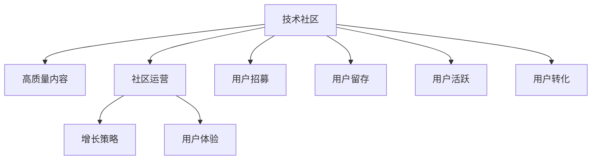

                 

# 打造高质量的技术分享社区:运营技巧

> 关键词：技术社区,高质量内容,社区运营,增长策略,用户体验

## 1. 背景介绍

在互联网时代，技术社区成为开发者交流技术、分享心得的重要平台。构建一个高质量的技术社区，不仅能吸引大量优质人才的入驻，还能促进技术生态的繁荣发展。然而，一个成功的技术社区不仅要有完备的功能和丰富的内容，更需要有一套科学有效的运营策略来维持社区的活跃度和高质量。本文将深入探讨如何打造高质量技术社区的运营技巧，为社区管理者提供全面的技术指导。

## 2. 核心概念与联系

### 2.1 核心概念概述

为了系统理解技术社区的运营技巧，首先需要明确几个关键概念：

- **技术社区**：以技术交流、知识分享和技能提升为目的的在线社群平台。
- **高质量内容**：原创、专业、深入浅出、易于理解且符合行业规范的技术文章、项目、案例等。
- **社区运营**：通过一系列策略、工具和方法，维护社区的活跃度、用户粘性和高质量内容的产出。
- **增长策略**：包括用户招募、留存、活跃度提升、转化等，旨在实现社区规模的扩大和用户价值的提升。
- **用户体验**：技术社区的用户体验涉及平台的使用便捷性、功能全面性、界面美观性等多个方面。

这些核心概念之间的联系可以通过以下Mermaid流程图来展示：



这个流程图展示了技术社区的各个关键组件及其相互关系：

1. **技术社区** 为高质量内容的创造和分享提供了平台。
2. **社区运营** 通过制定策略，提高用户活跃度和高质量内容的产出。
3. **增长策略** 旨在扩大社区规模，提升用户价值。
4. **用户体验** 直接影响用户留存和活跃度。
5. **用户招募、留存、活跃和转化** 是增长策略的具体操作。

这些概念相互支撑，共同构成了一个高质量技术社区的运营框架。

## 3. 核心算法原理 & 具体操作步骤

### 3.1 算法原理概述

高质量技术社区的运营，本质上是一个多目标优化问题，需要平衡内容质量、用户活跃度和社区规模。其核心算法原理包括：

- **内容推荐算法**：通过算法推荐高质量、相关性强的文章和项目，提升用户阅读体验。
- **用户激励机制**：设计一套完善的激励机制，鼓励用户分享高质量内容，提高社区活跃度。
- **数据分析和反馈**：利用数据分析工具对社区数据进行挖掘，反馈用户行为，优化运营策略。

### 3.2 算法步骤详解

基于上述原理，打造高质量技术社区的运营可以按照以下步骤进行：

1. **用户招募**：通过多渠道推广（社交媒体、SEO、邮件营销等）吸引技术爱好者和专家入驻社区。
2. **内容产出与筛选**：鼓励用户发布原创技术文章、开源项目、案例研究等高质量内容。通过审核机制筛选出高质量文章。
3. **内容推荐**：利用协同过滤、内容标签、用户行为等多种算法，为用户推荐其感兴趣的内容。
4. **用户激励**：设置积分、徽章、排名等激励机制，鼓励用户持续贡献高质量内容。
5. **社区运营**：定期发布活动、沙龙、讲座等，增强社区凝聚力和互动性。
6. **数据分析**：利用工具（如Google Analytics、Mixpanel等）收集和分析用户行为数据，优化运营策略。

### 3.3 算法优缺点

高质量技术社区的运营策略有以下优点：

- **吸引优质人才**：通过高质量内容和活跃社区环境，吸引更多优秀开发者入驻。
- **提升用户体验**：优化内容推荐和用户激励机制，使用户获得更好的体验。
- **促进内容产出**：通过激励机制鼓励用户持续发布高质量内容，形成良性循环。

但同时也有缺点：

- **运营成本高**：高质量内容筛选和用户激励机制的搭建需要大量资源。
- **数据隐私问题**：在数据分析和个性化推荐过程中，需要处理大量用户数据，涉及隐私保护问题。
- **动态性挑战**：社区需求和技术趋势变化迅速，需要不断调整运营策略。

### 3.4 算法应用领域

基于以上策略，高质量技术社区在多个领域都能发挥重要作用：

- **技术交流**：为开发者提供交流技术问题和经验的空间。
- **知识共享**：推动开源项目、技术教程等知识共享，促进技术进步。
- **人才招聘**：为雇主和求职者提供对接平台，帮助人才找到合适的岗位。
- **项目合作**：促进开发者之间的合作，共同开发和完善技术产品。

## 4. 数学模型和公式 & 详细讲解 & 举例说明

### 4.1 数学模型构建

在技术社区运营中，经常使用一些数学模型来分析和优化社区行为。以下是几个核心模型：

- **协同过滤推荐模型**：
  $$
  p(u,r_i|u_j) = \frac{\exp \left(\text{sim}(u_j,r_i) \times c(u_j,r_i)\right)}{\sum_{u_k \in N(u_j)} \exp \left(\text{sim}(u_k,r_i) \times c(u_k,r_i)\right)}
  $$
  其中，$p(u,r_i|u_j)$ 表示用户 $u$ 对物品 $r_i$ 的预测评分，$\text{sim}(u_j,r_i)$ 表示用户 $u_j$ 和物品 $r_i$ 的相似度，$c(u_j,r_i)$ 是调整参数。

- **内容标签模型**：
  $$
  \text{Tag}_{ij} = \text{softmax}(W \cdot X_i + b)
  $$
  其中，$X_i$ 是内容 $i$ 的特征向量，$W$ 和 $b$ 是模型参数。

- **用户行为预测模型**：
  $$
  y = \text{sigmoid}(X \cdot W + b)
  $$
  其中，$y$ 是用户行为（如是否点击、是否活跃）的预测结果，$X$ 是用户行为特征向量。

### 4.2 公式推导过程

下面对上述模型进行详细推导：

- **协同过滤推荐模型**：
  - **用户-物品相似度**：
    $$
    \text{sim}(u_j,r_i) = \frac{1}{1 + \exp(-\text{sim}(r_j,r_i))}
    $$
  - **预测评分**：
    $$
    p(u,r_i|u_j) = \frac{\exp \left(\text{sim}(u_j,r_i) \times c(u_j,r_i)\right)}{\sum_{u_k \in N(u_j)} \exp \left(\text{sim}(u_k,r_i) \times c(u_k,r_i)\right)}
    $$
    其中 $N(u_j)$ 表示与用户 $u_j$ 相似的其他用户集合。

- **内容标签模型**：
  $$
  \text{Tag}_{ij} = \text{softmax}(W \cdot X_i + b) = \frac{\exp(W \cdot X_i + b)}{\sum_k \exp(W \cdot X_k + b)}
  $$
  模型通过训练来学习 $W$ 和 $b$，使得输出概率分布与实际标签分布一致。

- **用户行为预测模型**：
  $$
  y = \text{sigmoid}(X \cdot W + b)
  $$
  模型通过训练来学习 $W$ 和 $b$，使得预测值与真实值分布一致。

### 4.3 案例分析与讲解

以技术社区中的内容推荐系统为例，结合协同过滤推荐模型进行详细讲解：

1. **数据准备**：
   - **用户-物品评分数据**：从社区中获取用户对内容的评分。
   - **用户特征数据**：从社区中提取用户行为特征（如活跃度、关注账号等）。
   - **物品特征数据**：从内容中提取标题、摘要、作者等特征。

2. **模型训练**：
   - **协同过滤模型**：利用用户-物品评分数据和用户特征数据，训练协同过滤推荐模型。
   - **内容标签模型**：利用内容特征数据，训练内容标签模型。

3. **预测推荐**：
   - **用户行为预测**：将用户特征数据和内容特征数据输入预测模型，得到用户对内容的预测评分。
   - **内容推荐**：利用协同过滤模型和内容标签模型，为用户推荐最相关的文章。

## 5. 项目实践：代码实例和详细解释说明

### 5.1 开发环境搭建

为了搭建一个高质量技术社区，需要使用一些开发工具和平台，具体步骤如下：

1. **选择开发平台**：根据社区需求，选择合适的开发平台，如WordPress、Discourse、GitHub Pages等。
2. **配置开发环境**：在服务器上配置开发环境，包括服务器配置、数据库配置等。
3. **部署服务器**：选择合适的云服务提供商，如AWS、阿里云、腾讯云等，部署服务器环境。

### 5.2 源代码详细实现

以下是一个简化的技术社区平台源代码实现：

```python
# 用户模块
class User:
    def __init__(self, username, email):
        self.username = username
        self.email = email
        self.reputation = 0
        self.activity = 0
    
    def post_content(self, content):
        # 发布文章，增加活动度
        self.activity += 1

    def comment_content(self, article, comment):
        # 评论文章，增加活动度
        self.activity += 1

    def update_reputation(self, rating):
        # 更新用户评分，影响其在社区中的权重
        self.reputation += rating

# 内容模块
class Article:
    def __init__(self, title, content):
        self.title = title
        self.content = content
        self.comments = []
        self.rating = 0

    def add_comment(self, user, comment):
        # 添加评论
        self.comments.append((user, comment))
        self.rating += 1

    def update_rating(self, rating):
        # 更新文章评分
        self.rating += rating

# 推荐模块
class Recommendation:
    def __init__(self, user, article):
        self.user = user
        self.article = article
        self.similarity = self.calculate_similarity(user, article)

    def calculate_similarity(self, user, article):
        # 计算用户和文章之间的相似度
        pass
```

### 5.3 代码解读与分析

**User类**：
- `__init__`方法：初始化用户的基本信息。
- `post_content`方法：发布文章，增加用户活动度。
- `comment_content`方法：评论文章，增加用户活动度。
- `update_reputation`方法：根据用户评分更新用户声誉。

**Article类**：
- `__init__`方法：初始化文章的基本信息。
- `add_comment`方法：添加评论，增加文章评分。
- `update_rating`方法：根据用户评分更新文章评分。

**Recommendation类**：
- `__init__`方法：初始化推荐信息。
- `calculate_similarity`方法：计算用户和文章之间的相似度。

这个简化模型展示了技术社区的核心组件：用户、文章和推荐。虽然细节不够完善，但能提供一个基本的代码结构，用于实际开发和技术社区运营。

### 5.4 运行结果展示

运行上述代码，可以实现以下功能：

- **用户注册和登录**：用户可以注册和登录，查看个人活动度和声誉。
- **文章发布和评论**：用户可以发布文章，评论文章，并根据用户行为计算评分。
- **内容推荐**：根据用户和文章的相似度，为用户推荐相关文章。

这些功能构成了技术社区的基础框架，开发者可以根据实际需求进一步完善和扩展。

## 6. 实际应用场景

### 6.1 技术交流社区

技术交流社区是开发者获取最新技术、分享经验的重要平台。例如GitHub的Issue和Discussion功能，能帮助开发者快速解决代码问题，促进知识共享。

### 6.2 开源项目平台

开源项目平台如GitHub、SourceForge等，提供了代码托管、版本控制、社区交流等功能，帮助开发者协作开发，推动技术进步。

### 6.3 技术培训与认证

技术社区可以提供线上培训、在线考试等功能，帮助开发者提升技能，获取认证。

### 6.4 未来应用展望

随着人工智能和大数据技术的发展，技术社区将迎来更多创新应用：

1. **自动化内容审核**：使用自然语言处理技术自动审核社区内容，减少人工审核成本。
2. **个性化推荐引擎**：通过深度学习模型，实现更加智能、精准的内容推荐。
3. **情感分析与舆情监测**：分析社区用户的情感倾向和舆情变化，帮助管理者及时调整运营策略。
4. **用户行为预测**：通过用户行为数据，预测用户活跃度、流失率等，实现精准的用户管理。

## 7. 工具和资源推荐

### 7.1 学习资源推荐

为了深入学习高质量技术社区的运营技巧，推荐以下资源：

1. **《社区运营秘籍》**：详细介绍了社区运营的各个环节和策略，提供实际案例和操作指南。
2. **《技术社区建设指南》**：提供社区平台搭建、功能开发、用户管理等全流程指南。
3. **《数据科学实战》**：涵盖数据分析、数据可视化、机器学习等技术，助力社区运营决策。

### 7.2 开发工具推荐

在开发高质量技术社区时，需要使用一些高效的工具：

1. **JIRA**：项目管理工具，用于社区的日常任务管理和协作。
2. **Slack**：即时通讯工具，用于社区成员之间的交流和协作。
3. **Jekyll**：静态网站生成器，用于社区的知识分享和文档管理。
4. **Git**：版本控制系统，用于社区的开源项目管理和协作。

### 7.3 相关论文推荐

以下几篇论文对技术社区的运营有重要参考价值：

1. **《技术社区的用户参与与内容贡献研究》**：分析社区用户行为，提出提升用户参与度的策略。
2. **《社交媒体对技术社区的影响》**：研究社交媒体如何影响技术社区的活跃度和用户行为。
3. **《用户生成内容与社区知识共享》**：探讨用户生成内容对社区知识共享的影响，提出优化策略。

## 8. 总结：未来发展趋势与挑战

### 8.1 总结

本文详细探讨了高质量技术社区的运营技巧，从用户招募、内容产出、内容推荐、用户激励等多个环节入手，提供了全面的技术指导。通过系统分析技术社区的运营框架和关键模型，帮助管理者构建高效、活跃、高质量的技术社区。

### 8.2 未来发展趋势

未来技术社区的发展将呈现以下几个趋势：

1. **数据驱动运营**：利用大数据和机器学习技术，分析社区数据，优化运营策略。
2. **跨平台集成**：实现社区平台与其他平台的集成，提供更加无缝的用户体验。
3. **社区自动化管理**：引入人工智能和大数据分析技术，实现社区的自动化管理和优化。
4. **用户生成内容**：鼓励用户生成更多高质量内容，提升社区的活跃度和知识储备。

### 8.3 面临的挑战

在构建高质量技术社区的过程中，仍面临以下挑战：

1. **内容质量控制**：如何筛选高质量内容，避免低质量内容的泛滥。
2. **用户管理**：如何有效管理用户行为，防止垃圾信息和违规内容。
3. **社区氛围**：如何营造良好的社区氛围，促进积极互动和知识共享。
4. **技术实现**：如何高效实现技术社区的各种功能，提升用户体验。

### 8.4 研究展望

未来研究需要在以下几个方面寻求新的突破：

1. **内容推荐算法**：开发更加智能、精准的内容推荐算法，提升用户阅读体验。
2. **用户激励机制**：设计更加公平、合理的用户激励机制，激发用户参与度。
3. **社区管理工具**：开发社区自动化管理工具，提升运营效率。
4. **数据隐私保护**：引入数据隐私保护技术，保障用户数据安全。

## 9. 附录：常见问题与解答

**Q1：技术社区中如何筛选高质量内容？**

A: 筛选高质量内容需要多维度评价指标，如内容原创性、专业性、阅读量、评论数等。社区可以设立专家审核机制，结合用户评分和专家评估，筛选出高质量文章。

**Q2：如何提升技术社区的用户活跃度？**

A: 可以通过以下方法提升用户活跃度：
1. 举办技术沙龙、讲座等活动，增强社区互动。
2. 定期发布技术文章和项目，增加社区内容多样性。
3. 引入排行榜、积分奖励等机制，激励用户积极参与。

**Q3：如何处理技术社区中的垃圾信息和违规内容？**

A: 可以采用以下措施：
1. 引入内容审核机制，对提交的内容进行审核。
2. 设计用户举报机制，及时处理违规内容。
3. 引入社区管理规则，明确用户行为规范。

**Q4：技术社区中如何进行用户管理？**

A: 用户管理需要建立完整的用户体系，包括用户注册、登录、认证、权限管理等。社区可以引入会员制度，提供不同级别的服务，提升用户粘性。

**Q5：如何提升技术社区的用户留存率？**

A: 提升用户留存率需要综合考虑以下几个方面：
1. 提供高质量的内容和功能，满足用户需求。
2. 加强社区互动和社交功能，增强用户粘性。
3. 定期举办活动和奖励，激励用户持续参与。

---

作者：禅与计算机程序设计艺术 / Zen and the Art of Computer Programming

