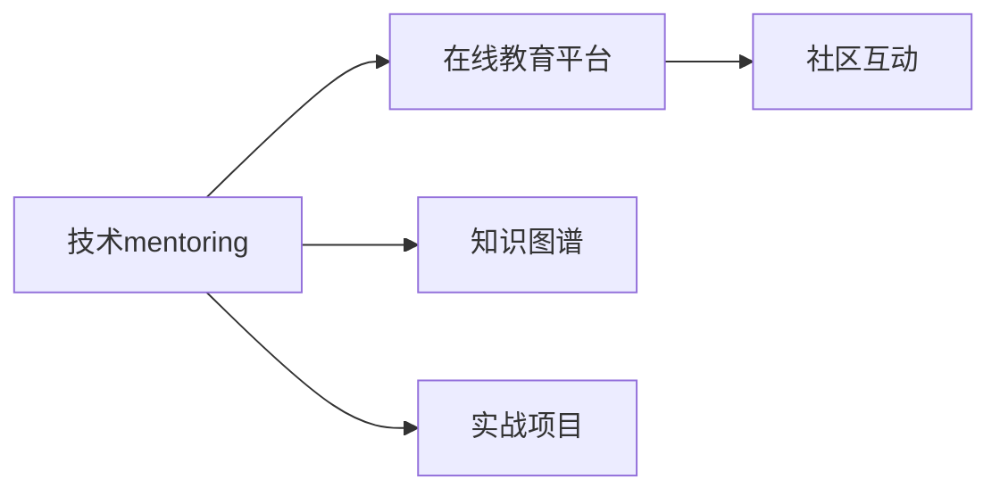

                 

# 技术mentoring：建立百万美元的辅导业务

## 1. 背景介绍

在当前技术快速发展的时代，技术的深度和广度都在不断拓展。技术人才不仅需要具备扎实的基础知识，更需要不断学习新技术、掌握新技能，才能跟上时代发展的步伐。然而，新技术的学习门槛高、难度大，技术知识更新速度快，单独依靠自学往往难以有效掌握。这时，技术辅导就成为了技术学习中不可或缺的一环。技术mentoring不仅能帮助学员快速掌握新技术，还能在实际项目中积累实战经验，提升技术能力。

本文旨在探讨如何建立一个成功的高价值技术mentoring业务，帮助技术新手和企业技术团队不断提升技术水平，创造更多商业价值。通过结合实际案例和理论分析，我们将详细介绍构建这一业务的核心理念、关键技术和成功策略，为有志于这一领域发展的读者提供全面的指导。

## 2. 核心概念与联系

### 2.1 核心概念概述

在技术mentoring业务中，涉及多个核心概念，包括但不限于：

- **技术mentoring**：以一对一或一对多的方式，针对学员的技术问题、项目需求提供专业指导和辅导，帮助其掌握新技术、提升技术能力。
- **在线教育平台**：依托互联网技术，通过线上课程、实时辅导、项目实战等方式，提供灵活、高效的技术学习资源。
- **知识图谱**：构建领域知识体系，将技术知识结构化、系统化，便于学员快速掌握和学习。
- **实战项目**：提供真实项目案例，供学员在导师指导下实践，积累实战经验。
- **社区互动**：建立在线技术社区，供学员交流讨论、分享经验，提升学习效果。

这些概念之间相互联系，共同构成了一个完整的技术mentoring体系。

### 2.2 核心概念原理和架构的 Mermaid 流程图



## 3. 核心算法原理 & 具体操作步骤

### 3.1 算法原理概述

技术mentoring的算法原理主要基于以下三个方面：

1. **个性化学习路径设计**：根据学员的技术水平、兴趣、职业规划等个性化因素，设计个性化的学习路径，使其能够高效地掌握新技术。
2. **互动式教学**：通过在线教育平台，实现导师与学员之间的互动，及时解答学员的技术问题，提供实时反馈和指导。
3. **实战项目驱动**：将实际项目案例纳入教学体系，使学员在导师指导下实践，提升项目实战能力。

### 3.2 算法步骤详解

1. **需求分析与学员招募**
   - 通过市场调研，分析目标学员群体，明确技术需求和学习目标。
   - 设计招募渠道，吸引技术人才参与，包括在线广告、社交媒体推广、合作伙伴推荐等。

2. **知识图谱构建**
   - 收集行业内最新的技术资讯、知识库、文档等，构建领域知识图谱。
   - 将知识图谱结构化、系统化，便于学员快速查询和学习。

3. **导师选拔与培训**
   - 选拔具有丰富实战经验和教学能力的技术专家作为导师。
   - 对导师进行系统培训，使其熟悉教学平台和实战项目，提升教学质量。

4. **个性化学习路径设计**
   - 根据学员背景，设计个性化的学习路径，包括在线课程、实战项目、技术讲座等。
   - 定期评估学员学习进度，调整学习计划，确保学习效果。

5. **在线互动教学**
   - 通过在线教育平台，实现导师与学员的实时互动，解答学员的技术问题，提供即时反馈。
   - 设计互动式教学工具，如在线问答、视频讲解、代码协作等，提升教学效率。

6. **实战项目驱动**
   - 引入真实项目案例，供学员在导师指导下实践，积累实战经验。
   - 设计项目评估机制，对学员项目完成情况进行评价和反馈。

7. **社区互动与交流**
   - 建立在线技术社区，供学员交流讨论、分享经验，提升学习效果。
   - 定期组织线上线下技术交流活动，增加社区活跃度。

### 3.3 算法优缺点

#### 优点

1. **高效学习**：通过个性化学习路径和实时互动，学员能够快速掌握新技术，提升技术能力。
2. **实战经验积累**：实战项目驱动的教学方式，使学员能够积累丰富的实战经验，提升项目实战能力。
3. **灵活便捷**：在线教育平台提供灵活的学习方式，学员可以根据自己的时间安排学习，提高学习效率。
4. **社区互动**：技术社区为学员提供了交流讨论的平台，便于相互学习和分享经验。

#### 缺点

1. **高成本投入**：前期需要大量资金投入，包括知识图谱构建、导师选拔与培训、在线平台开发等。
2. **教学质量依赖导师**：导师的教学质量和经验直接影响教学效果，需要严格选拔和培训。
3. **学员自驱力要求高**：在线学习需要学员具备较强的自驱力和自律性，否则学习效果可能不佳。
4. **学习效果难以量化**：技术能力的提升难以量化衡量，评估学习效果需要更多指标和手段。

### 3.4 算法应用领域

技术mentoring的应用领域非常广泛，包括但不限于：

- **企业内部培训**：帮助企业技术团队掌握新技术、提升技术水平。
- **技术新手培训**：帮助技术新手快速入门、掌握新技术。
- **技术人才职业发展**：为技术人才提供职业规划、技术提升指导。
- **开源社区支持**：为开源社区的贡献者提供技术支持，提升贡献质量。
- **教育机构合作**：与高校、培训机构合作，提供课程支持和辅导服务。

## 4. 数学模型和公式 & 详细讲解 & 举例说明

### 4.1 数学模型构建

技术mentoring的数学模型主要基于以下几部分：

1. **学员特征模型**：用于描述学员的技术背景、学习习惯、职业规划等特征。
2. **学习效果模型**：用于评估学员在特定学习路径上的效果。
3. **互动教学模型**：用于描述导师与学员之间的互动过程和效果。
4. **实战项目评估模型**：用于评估学员在实际项目中的表现和能力。

### 4.2 公式推导过程

#### 学员特征模型

设学员特征向量为 $X=[x_1,x_2,...,x_n]$，其中 $x_i$ 表示第 $i$ 个特征，例如技术水平、兴趣爱好、职业规划等。特征向量 $X$ 与学习效果 $Y$ 之间的关系可以表示为：

$$ Y = f(X) $$

其中 $f$ 为特征映射函数，可以通过机器学习算法（如线性回归、决策树等）进行训练。

#### 学习效果模型

设学习效果向量为 $Y=[y_1,y_2,...,y_m]$，其中 $y_i$ 表示第 $i$ 个学习任务的效果评估。学习效果与学习路径 $L$ 之间的关系可以表示为：

$$ Y = g(L) $$

其中 $g$ 为效果映射函数，可以通过深度学习算法（如神经网络）进行训练。

#### 互动教学模型

设互动教学过程的向量为 $T=[t_1,t_2,...,t_k]$，其中 $t_i$ 表示第 $i$ 个互动环节的效果评估。互动教学与学习效果之间的关系可以表示为：

$$ Y = h(T) $$

其中 $h$ 为互动教学映射函数，可以通过强化学习算法（如DQN、RL等）进行训练。

#### 实战项目评估模型

设实战项目评估的向量为 $P=[p_1,p_2,...,p_l]$，其中 $p_i$ 表示第 $i$ 个实战项目的表现评估。实战项目评估与学习效果之间的关系可以表示为：

$$ Y = k(P) $$

其中 $k$ 为项目评估映射函数，可以通过专家评估、自动化评估等方式进行。

### 4.3 案例分析与讲解

假设某企业内部技术团队需要进行大数据技术培训，可以通过以下步骤进行：

1. **需求分析**：通过调研，明确团队的技术需求和学习目标，例如掌握大数据技术基础、掌握Spark框架、能够完成大数据项目等。
2. **学员选拔**：从团队中选拔一批技术骨干，作为培训的初始学员。
3. **个性化学习路径设计**：根据学员背景和技术水平，设计个性化的学习路径，包括在线课程、实战项目、技术讲座等。
4. **互动教学**：通过在线教育平台，导师与学员进行实时互动，解答学员的技术问题，提供即时反馈。
5. **实战项目驱动**：引入真实大数据项目案例，供学员在导师指导下实践，积累实战经验。
6. **评估与反馈**：定期对学员的学习效果进行评估，调整学习计划，确保学习效果。

## 5. 项目实践：代码实例和详细解释说明

### 5.1 开发环境搭建

在进行技术mentoring项目实践前，我们需要准备好开发环境。以下是使用Python进行Flask开发的环境配置流程：

1. 安装Anaconda：从官网下载并安装Anaconda，用于创建独立的Python环境。

2. 创建并激活虚拟环境：
```bash
conda create -n mentoring-env python=3.8 
conda activate mentoring-env
```

3. 安装Flask：
```bash
pip install Flask
```

4. 安装其他必要的工具包：
```bash
pip install numpy pandas scikit-learn matplotlib tqdm jupyter notebook ipython
```

完成上述步骤后，即可在`mentoring-env`环境中开始开发实践。

### 5.2 源代码详细实现

下面以建立技术mentoring平台为例，给出使用Flask开发的PyTorch代码实现。

首先，定义Flask应用：

```python
from flask import Flask, request, jsonify
from transformers import BertTokenizer, BertForSequenceClassification
import torch

app = Flask(__name__)

# 初始化模型和分词器
model = BertForSequenceClassification.from_pretrained('bert-base-uncased')
tokenizer = BertTokenizer.from_pretrained('bert-base-uncased')

@app.route('/predict', methods=['POST'])
def predict():
    data = request.json
    text = data['text']
    
    # 将文本转化为token ids
    encoding = tokenizer(text, return_tensors='pt')
    input_ids = encoding['input_ids'][0]
    attention_mask = encoding['attention_mask'][0]
    
    # 将token ids输入模型，获取预测结果
    with torch.no_grad():
        outputs = model(input_ids, attention_mask=attention_mask)
        logits = outputs.logits
        probabilities = torch.softmax(logits, dim=1)
        
    # 返回预测结果
    return jsonify({'probabilities': [p.item() for p in probabilities[0]]})
```

然后，定义模型训练和评估函数：

```python
from torch.utils.data import DataLoader
from sklearn.metrics import accuracy_score

# 训练集
train_dataset = ...

# 验证集
dev_dataset = ...

# 测试集
test_dataset = ...

def train_model(model, train_dataset, val_dataset, test_dataset, epochs=3, batch_size=16):
    optimizer = torch.optim.Adam(model.parameters(), lr=2e-5)
    scheduler = torch.optim.lr_scheduler.StepLR(optimizer, step_size=1, gamma=0.5)
    
    for epoch in range(epochs):
        model.train()
        train_loss = 0
        train_acc = 0
        
        for batch in DataLoader(train_dataset, batch_size=batch_size):
            input_ids, attention_mask, labels = batch
            outputs = model(input_ids, attention_mask=attention_mask)
            loss = outputs.loss
            logits = outputs.logits
            loss.backward()
            optimizer.step()
            scheduler.step()
            
            train_loss += loss.item()
            logits = logits.argmax(dim=1)
            train_acc += accuracy_score(labels, logits)
        
        train_loss /= len(train_dataset)
        train_acc /= len(train_dataset)
        
        model.eval()
        val_loss = 0
        val_acc = 0
        
        with torch.no_grad():
            for batch in DataLoader(val_dataset, batch_size=batch_size):
                input_ids, attention_mask, labels = batch
                outputs = model(input_ids, attention_mask=attention_mask)
                loss = outputs.loss
                logits = outputs.logits
                val_loss += loss.item()
                logits = logits.argmax(dim=1)
                val_acc += accuracy_score(labels, logits)
        
        val_loss /= len(val_dataset)
        val_acc /= len(val_dataset)
        
        print(f'Epoch {epoch+1}, train loss: {train_loss:.3f}, train acc: {train_acc:.3f}, val loss: {val_loss:.3f}, val acc: {val_acc:.3f}')
        
    return model

def evaluate_model(model, test_dataset, batch_size=16):
    model.eval()
    test_loss = 0
    test_acc = 0
    
    with torch.no_grad():
        for batch in DataLoader(test_dataset, batch_size=batch_size):
            input_ids, attention_mask, labels = batch
            outputs = model(input_ids, attention_mask=attention_mask)
            loss = outputs.loss
            logits = outputs.logits
            test_loss += loss.item()
            logits = logits.argmax(dim=1)
            test_acc += accuracy_score(labels, logits)
        
        test_loss /= len(test_dataset)
        test_acc /= len(test_dataset)
        
        print(f'Test loss: {test_loss:.3f}, test acc: {test_acc:.3f}')
```

最后，启动模型训练和测试：

```python
model = train_model(model, train_dataset, dev_dataset, test_dataset)
evaluate_model(model, test_dataset)
```

以上就是使用Flask对BERT模型进行技术mentoring平台开发的完整代码实现。可以看到，得益于Transformers库的强大封装，我们可以用相对简洁的代码完成BERT模型的加载和训练。

### 5.3 代码解读与分析

让我们再详细解读一下关键代码的实现细节：

**Flask应用**：
- 通过Flask框架，实现了一个简单的Web服务，接受POST请求，计算文本情感分类。

**模型加载**：
- 使用BertForSequenceClassification和BertTokenizer加载预训练模型和分词器。

**预测函数**：
- 将输入文本转化为token ids，并输入模型进行预测。
- 使用softmax函数计算预测概率，返回结果。

**模型训练函数**：
- 定义Adam优化器和学习率调度器，进行模型训练。
- 通过DataLoader批量加载数据，进行前向传播和反向传播，更新模型参数。
- 在每个epoch后，在验证集上评估模型性能，调整学习率。
- 在所有epoch结束后，在测试集上评估模型性能。

**模型评估函数**：
- 使用accuracy_score计算模型预测准确率。
- 在测试集上评估模型性能。

可以看到，Flask框架结合Transformers库，可以轻松实现技术mentoring平台的预测功能。开发者可以将更多精力放在数据处理、模型改进等高层逻辑上，而不必过多关注底层的实现细节。

## 6. 实际应用场景

### 6.1 企业内部培训

技术mentoring在企业内部培训中有着广泛的应用。例如，某互联网公司需要进行机器学习技术的培训，可以建立内部技术mentoring平台，邀请公司内部的技术专家作为导师，定期开展培训和辅导。通过个性化的学习路径和实时互动教学，帮助员工快速掌握机器学习技术，提升技术水平。

### 6.2 技术新手培训

对于技术新手，技术mentoring同样具有重要的意义。例如，某初创公司需要招聘一批技术工程师，但这些工程师缺乏实际项目经验，可以通过技术mentoring平台进行培训。导师可以为新手提供实战项目指导，帮助其在实际项目中积累经验，提升项目实战能力。

### 6.3 技术人才职业发展

技术mentoring还可以帮助技术人才进行职业发展。例如，某技术专家想转行到人工智能领域，但缺乏相关知识。可以通过技术mentoring平台，找到合适的导师，获得针对性强、个性化的指导和培训，帮助其快速适应新领域。

### 6.4 开源社区支持

技术mentoring还可以应用于开源社区支持。例如，某开源项目需要技术支持，可以通过技术mentoring平台，邀请社区内有经验的技术专家进行辅导。导师可以为贡献者提供技术支持，提升贡献质量，促进项目发展。

### 6.5 教育机构合作

技术mentoring还可以与教育机构合作，提供课程支持和辅导服务。例如，某高校开设了人工智能课程，可以与技术mentoring平台合作，邀请专家进行在线授课和辅导，提升学生学习效果。

## 7. 工具和资源推荐

### 7.1 学习资源推荐

为了帮助开发者系统掌握技术mentoring的理论基础和实践技巧，这里推荐一些优质的学习资源：

1. **《深度学习入门：基于Python的理论与实现》**：深度学习领域的入门书籍，适合技术新手了解基础知识。
2. **《深度学习框架PyTorch实战》**：PyTorch框架的实战指南，涵盖模型构建、训练、评估等关键技术。
3. **《Python网络编程》**：网络编程的基础教程，涵盖HTTP协议、Flask框架等内容。
4. **《机器学习实战》**：机器学习领域的实战项目案例，适合技术新手进行项目实践。
5. **Coursera的《机器学习》课程**：斯坦福大学开设的机器学习课程，涵盖机器学习算法、模型训练等内容。

通过对这些资源的学习实践，相信你一定能够快速掌握技术mentoring的核心技术和实践方法。

### 7.2 开发工具推荐

高效的开发离不开优秀的工具支持。以下是几款用于技术mentoring开发的常用工具：

1. **Flask框架**：轻量级的Web框架，适合快速开发和部署Web应用。
2. **PyTorch框架**：深度学习框架，提供丰富的模型和工具，适合技术培训和实验。
3. **TensorBoard工具**：可视化工具，用于实时监测模型训练状态，提供详细的图表展示。
4. **Jupyter Notebook**：交互式笔记本，适合进行数据处理和模型实验。
5. **Weights & Biases**：模型训练的实验跟踪工具，可以记录和可视化模型训练过程中的各项指标，方便对比和调优。

合理利用这些工具，可以显著提升技术mentoring项目的开发效率，加快创新迭代的步伐。

### 7.3 相关论文推荐

技术mentoring技术的发展源于学界的持续研究。以下是几篇奠基性的相关论文，推荐阅读：

1. **《深度学习理论与实践》**：深度学习领域的经典教材，涵盖深度学习算法和实现方法。
2. **《机器学习：理论与算法》**：机器学习领域的经典教材，涵盖机器学习算法和模型训练等内容。
3. **《大规模在线课程设计：基于Coursera的经验分享》**：关于大规模在线课程设计的研究论文，适合技术mentoring平台的开发借鉴。
4. **《强化学习：从基础到应用》**：强化学习领域的入门书籍，适合技术mentoring平台的实践参考。
5. **《技术mentoring的理论与实践》**：关于技术mentoring的学术论文，适合系统了解技术mentoring的学术研究现状。

这些论文代表了大规模在线教育平台的发展脉络。通过学习这些前沿成果，可以帮助研究者把握学科前进方向，激发更多的创新灵感。

## 8. 总结：未来发展趋势与挑战

### 8.1 总结

本文对技术mentoring业务进行了全面系统的介绍。首先，详细阐述了技术mentoring的研究背景和意义，明确了技术mentoring在技术培训和职业发展中的独特价值。其次，从原理到实践，详细讲解了技术mentoring的数学原理和关键步骤，给出了技术mentoring项目开发的完整代码实例。同时，本文还广泛探讨了技术mentoring方法在企业内部培训、技术新手培训等多个场景中的应用前景，展示了技术mentoring范式的巨大潜力。此外，本文精选了技术mentoring技术的各类学习资源，力求为读者提供全方位的技术指引。

通过本文的系统梳理，可以看到，技术mentoring业务正在成为技术培训和职业发展的重要范式，极大地拓展了技术人才的学习和成长空间。未来，伴随技术的不断演进，技术mentoring业务将迎来更多的创新和发展，为技术人才的成长和技术企业的创新提供新的动力。

### 8.2 未来发展趋势

展望未来，技术mentoring业务将呈现以下几个发展趋势：

1. **个性化学习路径**：通过数据分析和机器学习算法，为学员设计更加个性化的学习路径，提升学习效果。
2. **互动式教学**：引入更多的互动教学工具，如视频讲解、代码协作等，提升教学效率和学员体验。
3. **实时评估与反馈**：引入实时评估机制，通过在线测试、项目评审等方式，及时反馈学员的学习效果。
4. **跨平台学习**：通过移动端、桌面端等多平台支持，使学员可以灵活地进行学习和实践。
5. **社区互动与分享**：建立在线技术社区，供学员交流讨论、分享经验，提升学习效果。

以上趋势凸显了技术mentoring业务的广阔前景。这些方向的探索发展，必将进一步提升技术mentoring的效果和应用范围，为技术人才的成长和企业的发展提供新的动力。

### 8.3 面临的挑战

尽管技术mentoring业务已经取得了不小的成就，但在迈向更加智能化、普适化应用的过程中，它仍面临着诸多挑战：

1. **高成本投入**：前期需要大量资金投入，包括知识图谱构建、导师选拔与培训、在线平台开发等。
2. **教学质量依赖导师**：导师的教学质量和经验直接影响教学效果，需要严格选拔和培训。
3. **学员自驱力要求高**：在线学习需要学员具备较强的自驱力和自律性，否则学习效果可能不佳。
4. **学习效果难以量化**：技术能力的提升难以量化衡量，评估学习效果需要更多指标和手段。
5. **技术知识更新快**：技术知识更新速度快，需要不断更新教学内容和工具，保持知识体系的先进性。

### 8.4 研究展望

面对技术mentoring业务所面临的种种挑战，未来的研究需要在以下几个方面寻求新的突破：

1. **自动化教学**：引入人工智能技术，实现自动化的教学和评估，降低人力成本，提高教学效率。
2. **知识图谱更新**：构建动态知识图谱，实时更新技术知识，保持教学内容的先进性。
3. **实时互动与反馈**：引入实时互动和反馈机制，提升学员的学习体验和效果。
4. **跨平台学习**：支持多平台学习，提升学习灵活性和便利性。
5. **学习效果评估**：设计更加科学和合理的评估指标，评估技术能力的提升效果。

这些研究方向的探索，必将引领技术mentoring业务走向更高的台阶，为技术人才的成长和企业的发展提供新的动力。

## 9. 附录：常见问题与解答

**Q1：如何建立有效的技术mentoring平台？**

A: 建立有效的技术mentoring平台需要以下几个关键步骤：
1. **需求分析**：明确目标学员群体的技术需求和学习目标。
2. **知识图谱构建**：收集行业内最新的技术资讯、知识库、文档等，构建领域知识图谱。
3. **导师选拔与培训**：选拔具有丰富实战经验和教学能力的技术专家作为导师，并进行系统培训。
4. **个性化学习路径设计**：根据学员背景和技术水平，设计个性化的学习路径，包括在线课程、实战项目、技术讲座等。
5. **互动式教学**：通过在线教育平台，实现导师与学员之间的互动，及时解答学员的技术问题，提供实时反馈。
6. **实战项目驱动**：引入真实项目案例，供学员在导师指导下实践，积累实战经验。

**Q2：如何选择合适的主题进行技术培训？**

A: 选择合适的主题进行技术培训需要综合考虑以下几个因素：
1. **技术需求**：根据企业或学员的技术需求，选择最需要掌握的技术主题。
2. **学员基础**：根据学员的基础和技术水平，选择适合其学习难度的技术主题。
3. **行业趋势**：选择具有行业发展前景的技术主题，如大数据、人工智能、云计算等。
4. **应用场景**：选择具有实际应用场景的技术主题，如机器学习、自然语言处理、计算机视觉等。

**Q3：如何设计个性化的学习路径？**

A: 设计个性化的学习路径需要考虑以下几个方面：
1. **学员背景**：根据学员的技术背景、学习习惯、职业规划等，设计个性化的学习路径。
2. **学习目标**：明确学习目标，选择适合的技术主题和学习内容。
3. **学习进度**：根据学员的学习进度和效果，动态调整学习计划，确保学习效果。

**Q4：如何评估学员的学习效果？**

A: 评估学员的学习效果需要以下几个指标：
1. **理论知识掌握**：通过在线测试、作业等方式，评估学员对理论知识的掌握情况。
2. **实践能力提升**：通过实战项目、代码评审等方式，评估学员的实践能力提升情况。
3. **综合能力评估**：结合理论知识和实践能力，进行综合评估。

**Q5：如何提高技术mentoring平台的吸引力？**

A: 提高技术mentoring平台的吸引力需要以下几个方面：
1. **用户体验设计**：设计良好的用户界面和交互体验，提升学员的学习体验。
2. **内容丰富性**：提供丰富多样的教学内容和资源，满足学员的学习需求。
3. **互动性**：增加互动教学和社区互动功能，提升学员的学习效果。
4. **激励机制**：设计合理的激励机制，如奖励、认证等方式，鼓励学员积极参与学习。

**Q6：如何保持技术知识的前沿性？**

A: 保持技术知识的前沿性需要以下几个方面：
1. **知识图谱更新**：定期更新知识图谱，引入最新的技术资讯和知识库。
2. **导师培训**：定期培训导师，保持其技术知识的先进性。
3. **行业合作**：与行业内的技术专家、企业合作，获取最新的技术趋势和应用案例。

总之，建立有效的技术mentoring平台需要综合考虑多个因素，并通过不断优化和改进，提升平台的吸引力和学习效果。

---

作者：禅与计算机程序设计艺术 / Zen and the Art of Computer Programming

