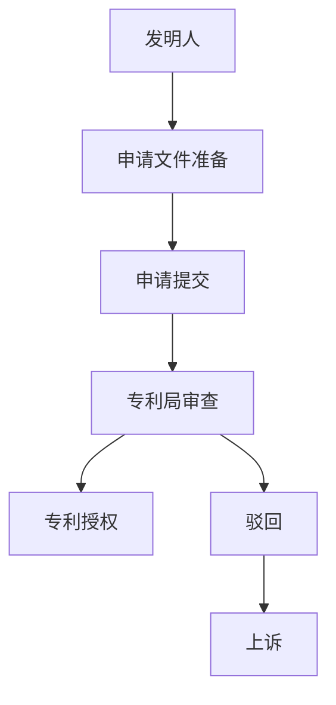

                 

# 技术专利申请：程序员的财富保护

> 关键词：技术专利申请, 程序员, 财富保护, 知识产权, 创新成果, 法律程序, 流程优化

## 1. 背景介绍

### 1.1 问题由来

在当今数字化时代，技术创新与知识产权的保护变得愈发重要。特别是对于程序员和软件开发人员而言，他们的创意、设计和代码是宝贵的财富，对其进行的专利申请则是保护这些成果的重要手段。然而，技术专利申请的过程往往复杂且繁琐，涉及大量的法律、技术及策略问题，使得许多创新者望而却步。本文档旨在通过深入浅出地讲解技术专利申请的基本原理和操作步骤，帮助程序员更清晰地理解这一过程，从而更有效地保护自己的创新成果。

### 1.2 问题核心关键点

技术专利申请的核心目标在于：

- 确保程序员的代码、设计和技术发明得到法律的认可和保护。
- 避免技术被他人未经授权使用或复制。
- 获取对其知识产权的商业价值和市场竞争优势。

实现这些目标需要了解和掌握专利申请的基本流程、要求及注意事项。本文档将详细阐述这些关键点，并给出实践中的具体指导。

## 2. 核心概念与联系

### 2.1 核心概念概述

为了更好地理解技术专利申请，以下列举了一些关键概念及其联系：

- **专利申请**：向专利局提交的正式文件，请求保护某项技术或发明。
- **发明人**：拥有创新发明的个体或团队。
- **申请文件**：包括说明书、权利要求书、附图等，详细描述发明内容和范围。
- **优先权日**：在首次公开或申请后12个月内，发明人可以提出国际优先权申请。
- **专利授权**：专利局经过审查，确认发明符合专利法的要求后，授予发明人专利权。

这些概念相互关联，共同构成了专利申请的框架。通过理解这些概念，可以更好地掌握专利申请的流程和要求。

### 2.2 核心概念原理和架构的 Mermaid 流程图



这个简单的流程图展示了专利申请的基本流程。从准备申请文件到提交申请，再到专利局的审查，最后可能授权或驳回。如果被驳回，申请人有权提出上诉。

## 3. 核心算法原理 & 具体操作步骤

### 3.1 算法原理概述

技术专利申请的算法原理基于知识产权法，其主要目标是在规定的法律框架内，通过一系列程序和步骤，将创新技术转化为法律认可的专利权。算法流程如下：

1. **文献检索**：确认技术是否已有相关专利，避免重复发明。
2. **撰写申请文件**：包括技术细节的描述、发明背景、技术方案、实施例等。
3. **提交申请**：向指定专利局提交完整的申请文件。
4. **专利审查**：专利局对申请进行形式和实质审查，确保发明符合专利法的要求。
5. **授权或驳回**：专利局根据审查结果决定是否授权专利。

### 3.2 算法步骤详解

#### 3.2.1 文献检索

进行文献检索的目的是确认申请的技术是否已经存在专利。以下是具体步骤：

1. **专利数据库搜索**：利用各大专利局（如美国专利商标局USPTO、欧洲专利局EPO等）的在线数据库进行搜索，确认是否有类似技术。
2. **公开出版物检索**：搜索科技论文、专利文献、会议论文等公开出版物，查看是否有公开披露该技术。
3. **专家咨询**：咨询专利代理人或专利律师，获取专业意见。

#### 3.2.2 撰写申请文件

撰写申请文件是专利申请的关键步骤，需要准确、全面地描述发明内容。以下是具体步骤：

1. **撰写说明书**：详细描述技术背景、发明内容、具体实施方案等。
2. **撰写权利要求书**：明确发明的技术范围，包括独立权利要求和从属权利要求。
3. **准备附图**：提供必要的图表、示意图等，辅助说明发明内容。

#### 3.2.3 提交申请

提交申请的具体步骤如下：

1. **选择专利局**：根据发明的性质和地理分布，选择提交申请的专利局。
2. **填写申请表格**：填写相关申请表格，包括发明人信息、发明内容、申请类型等。
3. **提交申请文件**：按照专利局的要求，提交完整的申请文件。

#### 3.2.4 专利审查

专利审查是专利申请的核心环节，主要包括以下步骤：

1. **形式审查**：审查申请文件是否符合形式要求，如是否有遗漏、格式是否正确等。
2. **实质审查**：审查发明是否具有新颖性、创造性和实用性。
3. **补正申请**：根据审查意见，可能需要补正或修改申请文件。

#### 3.2.5 授权或驳回

专利审查完成后，专利局会根据审查结果决定是否授权专利。具体步骤如下：

1. **授权**：专利局确认发明符合专利法的要求，授予专利权。
2. **驳回**：专利局认定发明不符合专利法要求，驳回申请。
3. **上诉**：如果被驳回，申请人有权提出上诉。

### 3.3 算法优缺点

#### 3.3.1 算法优点

技术专利申请的优势包括：

- **法律保护**：确保发明得到法律认可和保护。
- **市场竞争优势**：有助于在市场中获得竞争优势。
- **知识产权资产**：成为无形资产，可用于融资、许可等。

#### 3.3.2 算法缺点

专利申请的缺点包括：

- **复杂度高**：涉及法律、技术、商业等多个方面，过程复杂。
- **费用高昂**：涉及申请费、审查费、代理费等，费用较高。
- **时间漫长**：从申请到授权，通常需要数年时间。

## 4. 数学模型和公式 & 详细讲解 & 举例说明

### 4.1 数学模型构建

专利申请的数学模型主要基于法律要求和技术标准，以下模型将帮助我们理解和量化专利申请的流程：

1. **新颖性（Novelty）**：确保发明具有新颖性，数学模型为：
   $$
   \text{新颖性} = f(\text{文献检索结果}, \text{申请文件描述})
   $$

2. **创造性（Inventive Step）**：确保发明具有创造性，数学模型为：
   $$
   \text{创造性} = g(\text{现有技术}, \text{申请文件描述})
   $$

3. **实用性（Utility）**：确保发明具有实用性，数学模型为：
   $$
   \text{实用性} = h(\text{技术方案}, \text{实际应用情况})
   $$

### 4.2 公式推导过程

以新颖性为例，其推导过程如下：

- 通过文献检索，获取现有技术集合 $S$。
- 将申请文件描述 $D$ 与 $S$ 中的每个技术进行比较，计算相似度 $S(D)$。
- 若 $S(D) < \delta$，则 $D$ 具有新颖性，其中 $\delta$ 为预设的阈值。

### 4.3 案例分析与讲解

考虑一个简单的算法优化问题。假设一个程序员发明了一种新的排序算法，如何证明其具有新颖性？

- **文献检索**：查找现有排序算法，确认是否已有相关算法。
- **申请文件撰写**：详细描述算法实现、优化效果、应用场景等。
- **提交申请**：将申请文件提交至专利局。
- **专利审查**：专利局对申请进行形式和实质审查。
- **授权或驳回**：如果专利局认定新算法具有新颖性、创造性和实用性，则授权专利。

## 5. 项目实践：代码实例和详细解释说明

### 5.1 开发环境搭建

以下是搭建专利申请开发环境的步骤：

1. **安装Python**：确保Python 3.x版本已安装。
2. **安装PyPI库**：安装requests、beautifulsoup4等库，用于网络爬取和数据处理。
3. **配置GitHub**：创建GitHub仓库，用于版本控制和代码共享。

### 5.2 源代码详细实现

以下是一个简单的专利申请文件检索代码示例：

```python
import requests
from bs4 import BeautifulSoup

def search_patent(keywords):
    url = 'https://patentsearch.com/search'
    params = {'q': keywords, 'sort': 'relevance'}
    response = requests.get(url, params=params)
    soup = BeautifulSoup(response.content, 'html.parser')
    results = []
    for result in soup.find_all('div', class_='result'):
        title = result.find('a', class_='title').text
        abstract = result.find('div', class_='abstract').text
        results.append({'title': title, 'abstract': abstract})
    return results
```

### 5.3 代码解读与分析

上述代码实现了通过关键词搜索专利数据库，获取相关专利信息。具体步骤如下：

1. **发送请求**：通过requests库发送GET请求，获取搜索结果。
2. **解析HTML**：使用BeautifulSoup库解析HTML，提取专利标题和摘要。
3. **返回结果**：将提取的专利信息以字典形式返回。

## 6. 实际应用场景

### 6.1 知识产权保护

技术专利申请的核心场景是知识产权保护。程序员通过申请专利，可以确保其发明得到法律的认可和保护，避免他人非法使用或复制。

### 6.2 技术商业化

申请专利也是技术商业化的重要步骤。专利授权后，程序员可以将其技术授权给其他公司使用，获取商业利润。

### 6.3 创新激励

技术专利申请可以激励更多的程序员和创新者投入研发，推动技术进步和创新。

### 6.4 未来应用展望

未来，技术专利申请将在以下方面有所发展：

- **自动化申请**：通过AI技术自动生成专利申请文件，提高申请效率。
- **区块链技术**：利用区块链技术记录专利申请全过程，确保透明性和安全性。
- **全球专利保护**：利用PCT协议，通过国际优先权申请保护全球专利。

## 7. 工具和资源推荐

### 7.1 学习资源推荐

以下是几份有助于理解技术专利申请的资源：

1. **《专利法》**：国家知识产权局官方网站提供详细的专利法律和法规。
2. **专利申请教程**：Coursera、edX等在线平台上的专利申请课程，系统讲解专利申请流程。
3. **专利代理人考试教材**：了解专利代理人的考试教材，了解专利代理人的工作内容。

### 7.2 开发工具推荐

以下是几份推荐的技术专利申请工具：

1. **PatentWizard**：一款在线专利申请工具，提供向导式操作界面。
2. **TechInsight**：一款专利分析工具，帮助分析竞争对手的专利布局。
3. **PatentPad**：一款专利管理系统，方便管理和跟踪专利申请进度。

### 7.3 相关论文推荐

以下是几篇关于技术专利申请的重要论文：

1. **《技术专利申请指南》**：详细讲解专利申请流程和注意事项。
2. **《专利法原理与应用》**：对专利法的理论和实践进行全面分析。
3. **《技术创新与知识产权保护》**：探讨技术创新与知识产权保护的关系。

## 8. 总结：未来发展趋势与挑战

### 8.1 研究成果总结

技术专利申请的研究成果主要集中在以下几个方面：

- **自动化申请**：通过AI技术提高专利申请效率。
- **知识产权保护**：确保技术得到法律认可和保护。
- **技术商业化**：通过授权获取商业利润。

### 8.2 未来发展趋势

未来技术专利申请将呈现以下几个趋势：

- **自动化程度提升**：AI技术将进一步提升专利申请的自动化水平。
- **国际化保护**：通过PCT协议，保护全球专利。
- **区块链技术应用**：确保专利申请过程的透明性和安全性。

### 8.3 面临的挑战

技术专利申请面临的挑战主要包括：

- **法律环境复杂**：专利法在不同国家和地区存在差异，需深入了解。
- **费用高昂**：涉及申请费、代理费、审查费等，费用较高。
- **审查周期长**：从申请到授权，通常需要数年时间。

### 8.4 研究展望

未来的研究展望包括：

- **AI辅助专利申请**：开发AI工具，辅助专利申请文档的撰写和审核。
- **全球专利合作**：通过PCT协议，简化国际专利申请流程。
- **技术专利联盟**：建立技术专利联盟，共享专利资源和信息。

## 9. 附录：常见问题与解答

**Q1：程序员在申请专利时，应该如何选择专利类型？**

A: 程序员可以根据发明的性质，选择不同的专利类型。常见的专利类型包括：

- **发明专利**：适用于具有新颖性、创造性和实用性的发明。
- **实用新型专利**：适用于具有实用性且有一定技术进步的新型产品。
- **外观设计专利**：适用于具有新颖性和美观性的外观设计。

**Q2：专利申请的费用是多少？**

A: 专利申请的费用因国家和地区而异。通常包括申请费、审查费、代理费等。具体费用需要咨询当地专利局或专利代理人。

**Q3：如何判断一项发明是否具有新颖性？**

A: 判断发明是否具有新颖性需要查看现有技术的文献检索结果，通过比较申请文件描述和现有技术，计算相似度，判断是否低于预设的阈值。

**Q4：专利授权后如何使用？**

A: 专利授权后，可以通过以下方式使用：

- **自行使用**：在发明的有效期内，自行生产、销售、使用该发明。
- **授权他人使用**：通过签订许可协议，授权他人使用专利。
- **专利诉讼**：在专利被侵权时，可以通过法律手段维护自己的合法权益。

**Q5：专利申请的时间流程是怎样的？**

A: 专利申请的时间流程包括：

- **撰写申请文件**：撰写说明书、权利要求书等。
- **提交申请**：向专利局提交申请文件。
- **专利审查**：专利局对申请进行形式和实质审查。
- **授权或驳回**：专利局根据审查结果决定是否授权专利。
- **上诉**：如果被驳回，申请人有权提出上诉。

通过以上详细解释，相信程序员们对于技术专利申请有了更深入的了解。专利申请是保护技术创新成果的重要手段，通过理解其基本原理和操作步骤，可以有效提升创新成果的商业价值和法律保护水平。

---

作者：禅与计算机程序设计艺术 / Zen and the Art of Computer Programming

