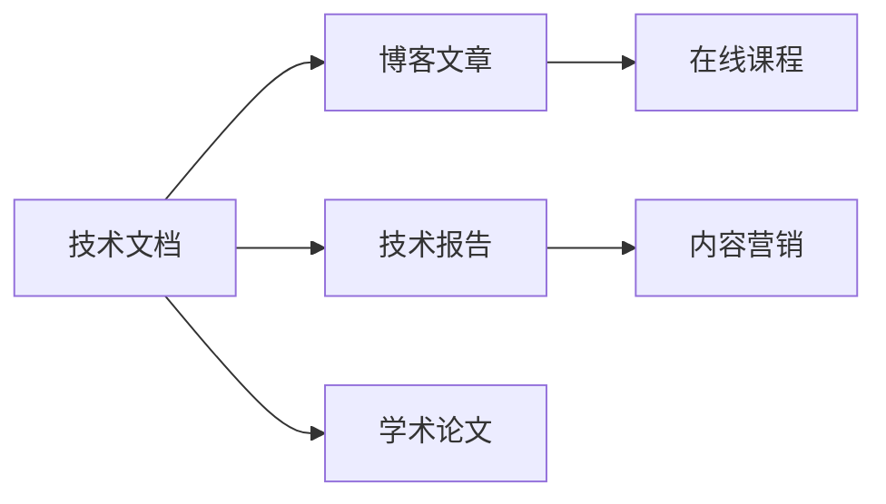

                 

# 技术写作：额外收入的来源

> 关键词：技术写作, 自由职业, 远程工作, 在线课程, 内容营销

## 1. 背景介绍

在当今快速变化的技术世界中，技术的交流和传播变得尤为重要。随着互联网的发展和信息技术的普及，越来越多的人选择通过技术写作来展示自己的专业知识，并将之转化为额外的收入来源。无论是在技术论坛、博客、社交媒体，还是在专业出版物上，技术写作已经成为了一种新兴的职业方式，为有志于分享技术知识的人提供了广泛的平台和机会。

### 1.1 问题由来

随着开源运动和知识共享社区的兴起，技术写作的需求变得空前高涨。传统的技术文档、博客文章、技术报告、学术论文等形式的内容，现在有了更广泛的影响力和应用空间。技术写作者可以通过撰写高质量的技术内容，吸引读者关注，积累个人品牌，甚至通过广告、赞助、订阅等形式获得额外的经济收益。

然而，技术写作并非易事。它需要深厚的技术背景、良好的文字表达能力和一定的组织能力。为了帮助更多技术从业者掌握技术写作的技巧和方法，本文将详细介绍技术写作的核心概念、基本原理和具体的操作步骤，并结合实际案例进行讲解。

## 2. 核心概念与联系

### 2.1 核心概念概述

技术写作是一种将复杂的技术信息通过文字、图表、代码等多种形式表达出来的活动。它旨在通过清晰的语言和结构，使目标读者能够理解技术内容，从而帮助解决特定问题、学习新知识或进行技术交流。

技术写作的核心概念包括：
- **技术文档**：详细描述产品、系统或服务的技术细节，是技术写作中最常见和重要的形式之一。
- **博客文章**：撰写个人技术见解或心得，形式灵活，内容多样。
- **技术报告**：对某个技术领域进行深入研究和总结，结构严谨，数据详实。
- **学术论文**：基于科学方法，撰写具有创新性的研究成果，供学术界同行交流。
- **在线课程**：通过视频、文本、代码等多种形式，向广大受众传授技术知识和技能。
- **内容营销**：利用技术写作吸引目标客户，通过建立专业形象和品牌，开展营销活动。

这些概念之间的联系主要体现在目标受众、写作风格和内容结构上。技术写作的核心目标是传递技术知识，无论是通过文档、博客、报告还是课程，都需要遵循相同的原则：清晰、准确、可读性强。

### 2.2 核心概念原理和架构的 Mermaid 流程图(Mermaid 流程节点中不要有括号、逗号等特殊字符)



这个流程图展示了技术写作的几种主要形式之间的相互关系和联系。技术文档是基础，博客文章更灵活，技术报告和学术论文更严谨，而在线课程和内容营销则是技术写作的应用延伸。

## 3. 核心算法原理 & 具体操作步骤

### 3.1 算法原理概述

技术写作的核心算法原理主要包括两个方面：
1. **信息结构化**：通过将技术信息分解为不同的模块、章节和段落，使之更加易于理解和消化。
2. **语言精炼**：使用清晰、准确、简洁的语言，避免冗余和歧义，使读者能够快速掌握重点。

### 3.2 算法步骤详解

技术写作的整个过程可以分为以下几个步骤：

**Step 1: 选题与调研**
- 确定写作主题和目标受众。
- 进行文献回顾和调研，收集相关资料和数据。
- 设计写作大纲，明确各个部分的结构和重点。

**Step 2: 内容撰写**
- 使用合适的文字表达方式，描述技术细节和操作步骤。
- 加入图表、代码示例等辅助材料，提高内容的可读性。
- 采用“故事化”手法，通过具体场景和案例，使读者更容易理解复杂技术。

**Step 3: 校对与修订**
- 使用语法检查工具，如Grammarly、Hemingway等，优化句子结构和语言表达。
- 邀请同行或专家进行审阅，提供反馈和建议。
- 多次修订，确保内容的准确性和可读性。

**Step 4: 发布与推广**
- 选择合适的发布平台，如博客、技术论坛、出版物等。
- 使用SEO优化策略，提高文章的可见性和搜索排名。
- 进行社交媒体推广，吸引更多读者关注和分享。

### 3.3 算法优缺点

技术写作的优点包括：
- 能够将复杂的知识传递给更广泛的人群。
- 通过写作积累个人品牌，提高职业竞争力。
- 多种形式的内容形式灵活，满足不同受众的需求。

技术写作的缺点包括：
- 需要较高的专业知识和写作技巧，门槛较高。
- 编写和校对过程较为耗时，难以快速见效。
- 内容质量高度依赖于写作者的个人经验和技能。

### 3.4 算法应用领域

技术写作的应用领域非常广泛，包括但不限于：
- **技术支持与文档编写**：为产品或服务提供详细的操作手册和技术支持文档。
- **技术培训与教育**：通过在线课程、视频讲座等方式，传授技术知识和技能。
- **技术博客与社区贡献**：在技术博客或社区中撰写文章，分享技术见解和经验。
- **内容营销与品牌建设**：通过技术写作吸引客户，建立专业形象和品牌。

## 4. 数学模型和公式 & 详细讲解 & 举例说明

### 4.1 数学模型构建

技术写作的数学模型主要关注如何通过数学公式和算法表达技术细节。例如，在编写某个算法的实现时，可以详细描述算法的步骤如下：

$$
\begin{aligned}
\text{Step 1:} \quad & \text{初始化参数} \\
\text{Step 2:} \quad & \text{循环迭代计算} \\
\text{Step 3:} \quad & \text{输出结果}
\end{aligned}
$$

### 4.2 公式推导过程

以计算两个向量点积为例，其公式推导如下：

$$
\vec{a} \cdot \vec{b} = a_1b_1 + a_2b_2 + \cdots + a_nb_n
$$

在技术写作中，可以通过公式推导，详细说明每个变量的含义和计算方法，使读者能够更好地理解算法的原理和实现。

### 4.3 案例分析与讲解

假设要编写一个关于深度学习中梯度下降算法的技术文档。可以按照以下步骤进行：
- **引入背景知识**：简要介绍梯度下降算法的基本概念和应用场景。
- **算法步骤详解**：详细描述梯度下降的计算过程，包括初始化、迭代更新等步骤。
- **代码实现**：提供具体的Python代码实现，并解释每行代码的含义。
- **效果分析**：通过实际案例，展示梯度下降算法的应用效果。

## 5. 项目实践：代码实例和详细解释说明

### 5.1 开发环境搭建

- **安装Python**：确保Python版本为3.7及以上，并使用虚拟环境（如virtualenv）管理Python依赖。
- **安装相关库**：使用pip安装必要的库，如numpy、pandas、matplotlib等。
- **代码编辑器**：使用IDE（如PyCharm、VS Code等）或文本编辑器（如Vim、Sublime Text等）进行代码编写。

### 5.2 源代码详细实现

以下是一个简单的Python代码示例，展示如何使用numpy库计算两个向量的点积：

```python
import numpy as np

def dot_product(a, b):
    """计算两个向量点积"""
    return np.dot(a, b)

# 示例向量
a = np.array([1, 2, 3])
b = np.array([4, 5, 6])

# 计算点积
result = dot_product(a, b)
print(result)
```

### 5.3 代码解读与分析

**代码解释**：
- `dot_product`函数接受两个向量`a`和`b`作为输入，使用`np.dot`函数计算它们的点积，并返回结果。
- 示例向量`a`和`b`分别初始化为`[1, 2, 3]`和`[4, 5, 6]`。
- 调用`dot_product`函数，将结果保存在`result`变量中，并打印输出。

**代码优点**：
- 代码简洁明了，易于理解。
- 使用numpy库的dot函数，避免了手写的循环计算。

**代码缺点**：
- 缺乏错误处理和异常检测，如果输入参数不符合要求，可能导致程序出错。
- 没有提供输入验证，增加了代码的潜在风险。

### 5.4 运行结果展示

运行上述代码，输出结果为`32`，即向量`a`和向量`b`的点积。

## 6. 实际应用场景

### 6.1 技术支持与文档编写

技术支持文档在软件开发、系统维护和产品使用中起着至关重要的作用。例如，某个开源软件项目可能提供详细的操作手册、FAQ和常见问题解答，帮助用户解决遇到的问题。

### 6.2 技术培训与教育

在线教育平台和开源社区中的技术培训课程，已经成为学习新技术的重要途径。通过编写详细的课程内容和练习题，帮助学员掌握新知识和技能。

### 6.3 技术博客与社区贡献

技术博客和社区是展示个人技术见解和经验的理想场所。例如，Kaggle和Stack Overflow等平台，允许用户发布技术文章和问题，与全球的技术爱好者进行交流和讨论。

### 6.4 内容营销与品牌建设

技术内容营销可以通过SEO优化和社交媒体推广，吸引目标客户，提升品牌知名度和市场份额。例如，一些初创技术公司通过发布高质量的技术博客和教程，吸引潜在客户，建立品牌形象。

## 7. 工具和资源推荐

### 7.1 学习资源推荐

- **官方文档**：查阅Python、numpy、pandas等库的官方文档，了解其功能和使用方法。
- **在线课程**：参加Coursera、edX等平台上的编程和数据科学课程，提升技术写作能力。
- **技术博客**：阅读优秀技术博客，如阮一峰、阮行止、王垠等，学习其写作风格和表达技巧。

### 7.2 开发工具推荐

- **IDE**：使用PyCharm、VS Code等IDE，提高代码编写和调试效率。
- **代码编辑器**：Vim、Sublime Text等编辑器，支持多种编程语言和插件，提升开发体验。
- **版本控制**：Git和GitHub等版本控制系统，帮助团队协作和代码管理。

### 7.3 相关论文推荐

- **编程范式**：阅读《Clean Code》（Robert C. Martin）等书籍，掌握编程和文档编写的最佳实践。
- **在线教育**：学习《Teaching Techniques of Software Development》（Mary C. Louison）等书籍，提升技术教学能力。
- **内容营销**：研究《Content Marketing for Engineers: How to Promote Yourself and Your Ideas》（Jamie Turner）等书籍，掌握内容营销的技巧和方法。

## 8. 总结：未来发展趋势与挑战

### 8.1 研究成果总结

技术写作作为一种新兴职业，正在迅速发展。通过技术写作，个人可以将自己的技术知识和经验分享给更广泛的人群，提升自身的影响力和职业竞争力。

### 8.2 未来发展趋势

未来的技术写作将呈现以下几个趋势：
- **跨学科融合**：技术写作将与其他学科（如设计、教育、营销等）融合，形成更多元化的内容形式。
- **自动化工具**：随着AI技术的发展，自动生成代码、文档和内容将变得更加普遍，提升技术写作的效率和准确性。
- **全球化交流**：互联网和社交媒体的普及，将使得技术写作的受众更加全球化，促进跨文化技术交流。

### 8.3 面临的挑战

尽管技术写作充满机遇，但也面临着诸多挑战：
- **内容质量控制**：如何保证内容的专业性和准确性，避免误导读者。
- **市场竞争激烈**：技术写作市场竞争激烈，如何突出自己的特点，吸引读者关注。
- **版权和隐私问题**：在发布技术内容时，需要注意版权和隐私问题，避免侵权和泄露敏感信息。

### 8.4 研究展望

未来，技术写作的研究可以从以下几个方向进行：
- **内容个性化**：基于用户行为和反馈，生成个性化的技术内容，提升用户体验。
- **情感计算**：结合情感分析技术，生成更具情感共鸣的内容，增强读者粘性。
- **自动化生成**：利用AI技术自动生成技术文档、代码和教程，提高工作效率。

总之，技术写作不仅是展示个人技术能力的重要方式，更是连接技术与受众的桥梁。通过不断提升技术写作能力，我们可以更好地传递知识，推动技术的普及和发展。

## 9. 附录：常见问题与解答

**Q1: 如何提升技术写作能力？**

A: 提升技术写作能力需要多方面的努力：
- **学习基础知识**：了解基本的写作原则和风格，如清晰度、准确性和逻辑性。
- **多读多写**：多阅读优秀技术文章和书籍，多写作练习，逐步提高自己的写作水平。
- **接受反馈**：向同行或专家请教，邀请他人审阅自己的作品，获取反馈和建议。

**Q2: 如何选择合适的技术写作平台？**

A: 选择合适的技术写作平台需要考虑以下因素：
- **受众定位**：确定目标受众和写作内容类型，选择合适的平台，如技术博客、论坛、社区等。
- **平台功能**：评估平台的功能和工具，如SEO优化、广告投放、读者互动等。
- **社区氛围**：选择活跃度较高、用户质量较高的平台，以吸引更多读者关注和参与。

**Q3: 技术写作时如何避免版权问题？**

A: 避免版权问题的方法包括：
- **获取授权**：在引用或使用他人内容时，确保已获得授权或遵守相关法律。
- **创作原创**：尽量创作原创内容，避免抄袭和侵权。
- **合理引用**：在引用时，遵守引用规范，标注来源和作者。

本文通过详细介绍技术写作的核心概念、基本原理和操作步骤，希望能帮助更多技术从业者掌握技术写作的技巧和方法，并通过技术写作实现额外的经济收益。通过持续学习和实践，相信每个人都可以成为优秀的技术写作者，为技术社区贡献自己的力量。

---

作者：禅与计算机程序设计艺术 / Zen and the Art of Computer Programming

