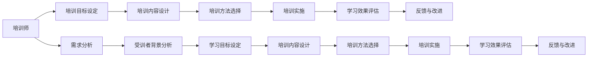

                 

# 技术培训：从受训者到培训者

> 关键词：技术培训,教师发展,教育技术,教学法,课程设计,学习评估

## 1. 背景介绍

在信息技术迅猛发展的今天，对各类专业技术人员进行技术培训已成为企业提升竞争力的重要手段。与此同时，如何高效、精准地培训员工，使他们能够迅速掌握新知识、技能，并应用于实际工作中，成为了技术培训工作的核心挑战。本系列文章将系统探讨技术培训的原理与方法，从受训者的角度出发，剖析技术培训的要点，从培训者的角度出发，探讨如何高效设计和管理技术培训课程，使培训者能更好地推动员工技能提升。

## 2. 核心概念与联系

### 2.1 核心概念概述

为了更好地理解技术培训的过程，首先需要明确几个核心概念：

- **技术培训（Technical Training）**：通过有计划、系统的教育活动，使受训者掌握特定领域的技术知识与技能，提升其专业能力。
- **培训师（Trainer）**：负责设计、实施、评估培训活动的专业人员，其核心职责是设计合适的培训内容和培训方式，引导受训者学习。
- **培训课程（Training Course）**：为完成特定培训目标，精心设计的培训内容和教学方法。课程设计需基于受训者的需求、现有知识与技能，并兼顾技术发展的最新动态。
- **学习效果（Learning Outcome）**：培训结束后，受训者所掌握的知识、技能和态度的变化。评估学习效果的关键在于设定清晰、具体的学习目标，并通过各种方式检验培训成果。
- **教学方法（Teaching Method）**：培训师在实施培训时所采用的具体方式，包括理论讲解、实操练习、项目实战等多种形式，需根据培训内容、受训者背景及培训目标选择合适的方法。
- **技术评估（Technical Evaluation）**：评估受训者学习效果的方法，包括测验、项目评审、工作表现观察等多种手段，旨在确保培训目标的实现。

这些概念之间的联系紧密，通过科学地设计和管理培训课程，可以使受训者高效学习并掌握新技术，进而推动企业的发展和进步。

### 2.2 核心概念原理和架构的 Mermaid 流程图



此流程图展示了技术培训从需求分析到效果评估的全过程，凸显了各环节的紧密联系和相互依存关系。

## 3. 核心算法原理 & 具体操作步骤

### 3.1 算法原理概述

技术培训的本质是通过科学的学习理论和方法，帮助受训者掌握新技能、更新旧知识，提高其技术水平和工作效率。核心算法原理主要包括以下几个方面：

- **行为主义理论（Behaviorism）**：认为学习是通过刺激和反应的反复进行形成的。培训师需设计合适的刺激（如讲解、实操）和反应（如练习、测试），促进受训者技能形成。
- **认知主义理论（Cognitivism）**：强调学习过程中认知结构的构建和信息处理的重要性。培训应注重知识的内化，使受训者能够理解并应用所学内容。
- **建构主义理论（Constructivism）**：认为学习是个人在与环境的交互中建构意义的过程。培训需激发受训者的学习动机，通过协作和反思深化其理解。

### 3.2 算法步骤详解

具体实施技术培训的步骤如下：

1. **需求分析（Needs Assessment）**：明确企业及受训者的培训需求，通过问卷调查、访谈等方式收集相关信息，确定培训目标。
2. **受训者背景分析（Learner Analysis）**：了解受训者的现有知识水平、技能水平、学习风格等，以便制定合适的培训内容和方法。
3. **培训目标设定（Training Objective Setting）**：根据需求分析与受训者背景分析结果，设定具体的、可衡量的培训目标，如掌握某个软件工具的操作、理解某个技术框架的核心原理等。
4. **培训内容设计（Training Content Design）**：基于培训目标，设计培训内容，包括理论知识、实操练习、案例分析等，确保内容的系统性、连贯性和实用性。
5. **培训方法选择（Training Method Selection）**：根据培训内容和学习目标，选择合适的教学方法，如讲授法、案例研究法、项目实践法等。
6. **培训实施（Training Implementation）**：按照既定计划和教学方法，实施培训活动，包括理论讲解、实操练习、项目实战等环节。
7. **学习效果评估（Learning Effectiveness Evaluation）**：通过测验、项目评审、工作表现观察等方式，评估受训者的学习效果，确保培训目标的实现。
8. **反馈与改进（Feedback and Improvement）**：根据评估结果和受训者反馈，及时调整培训内容和教学方法，不断改进培训质量。

### 3.3 算法优缺点

技术培训的优点主要包括：

- **系统性**：通过科学的设计和管理，确保培训内容全面、连贯，提高受训者的学习效率。
- **针对性**：根据企业及受训者的实际需求，制定具体的培训目标，提升培训的实际应用价值。
- **可评估性**：通过设定明确的学习目标和评估标准，便于量化培训效果，进行持续改进。

不足之处包括：

- **资源消耗**：设计、实施、评估培训需要投入大量时间和人力，成本较高。
- **反馈延迟**：培训效果的评估往往需要较长时间，难以及时调整培训内容和教学方法。
- **受训者差异**：不同受训者的学习速度、接受能力各异，统一的教学方法可能难以满足所有人的需求。

### 3.4 算法应用领域

技术培训在多个领域均有广泛应用，例如：

- **软件开发**：培训开发者掌握新的编程语言、框架、工具等，提高开发效率和代码质量。
- **数据科学**：培训数据分析师掌握数据处理、机器学习等技能，提升数据分析能力和数据应用水平。
- **运维管理**：培训系统管理员掌握新系统的部署、运维方法，提升系统稳定性和安全性。
- **项目管理**：培训项目经理掌握敏捷开发、项目管理工具，提高项目进度控制和团队协作能力。
- **网络安全**：培训安全工程师掌握最新的安全技术，提升系统防护水平，应对网络攻击。

## 4. 数学模型和公式 & 详细讲解 & 举例说明

### 4.1 数学模型构建

技术培训的效果评估可通过建立数学模型来量化和分析。以软件开发培训为例，可以建立如下数学模型：

$$
\text{学习效果} = f(\text{培训内容}, \text{教学方法}, \text{受训者背景}, \text{评估指标})
$$

其中，$\text{培训内容}$ 指培训中涉及的知识和技能，$\text{教学方法}$ 指培训过程中采用的教学策略，$\text{受训者背景}$ 指受训者的现有水平和需求，$\text{评估指标}$ 指用于衡量学习效果的各项标准。

### 4.2 公式推导过程

以软件开发培训为例，假设学习效果由以下因素决定：

- $\text{知识掌握度} = 0.8 \times \text{培训内容的质量} + 0.2 \times \text{受训者的学习态度}$
- $\text{技能应用能力} = 0.7 \times \text{实操练习次数} + 0.3 \times \text{项目实战效果}$
- $\text{学习效果} = 0.6 \times \text{知识掌握度} + 0.4 \times \text{技能应用能力}$

通过上述公式，可以定量分析不同因素对学习效果的影响，从而优化培训设计和实施。

### 4.3 案例分析与讲解

假设某企业计划为开发团队进行敏捷开发方法的培训，评估模型可以表示为：

$$
\text{学习效果} = 0.5 \times \text{敏捷开发理论知识掌握度} + 0.5 \times \text{敏捷开发工具使用熟练度} + 0.5 \times \text{敏捷开发项目实践效果}
$$

其中，敏捷开发理论知识掌握度可以通过测试题和理论讲解的互动环节进行评估；敏捷开发工具使用熟练度可以通过使用工具的情况和实操练习的反馈进行评估；敏捷开发项目实践效果可以通过项目评审和团队反馈进行评估。

## 5. 项目实践：代码实例和详细解释说明

### 5.1 开发环境搭建

以软件开发培训为例，开发环境搭建主要包括以下步骤：

1. **安装开发工具**：如安装JDK、Python、IDE（如Eclipse、IntelliJ IDEA）等，确保开发环境配置正确。
2. **配置实验数据**：准备相关的实验数据，如代码样本、问题集、测试题等，便于进行实验和测试。
3. **搭建测试环境**：构建实验所需的测试环境，如虚拟机、云平台等，确保实验数据的准确性和一致性。

### 5.2 源代码详细实现

以Java开发培训为例，可以设计一个简单的源代码实现，用于测试受训者的知识掌握情况：

```java
import java.util.Scanner;

public class JavaExample {
    public static void main(String[] args) {
        Scanner scanner = new Scanner(System.in);
        System.out.print("Enter your name: ");
        String name = scanner.nextLine();
        System.out.println("Hello, " + name + "! Welcome to Java programming.");
    }
}
```

该示例程序用于测试受训者是否能够正确运行Java程序，评估其基本编程能力。

### 5.3 代码解读与分析

该示例程序仅包含一个简单的Java程序，用于输入用户姓名并输出欢迎信息。其关键点包括：

- **输入输出**：使用Scanner类获取用户输入，并输出欢迎信息。
- **变量声明**：定义String类型变量name，用于存储用户输入的姓名。
- **字符串拼接**：使用+运算符将变量和字符串拼接在一起，形成最终的输出信息。

### 5.4 运行结果展示

运行上述程序，控制台输出如下：

```
Enter your name: Alice
Hello, Alice! Welcome to Java programming.
```

## 6. 实际应用场景

### 6.1 软件开发培训

软件开发培训是企业技术培训的重要内容，旨在提高开发者的编码能力和软件开发生命周期管理能力。培训内容可以包括编程语言（如Java、Python、C++等）、开发框架（如Spring、Django、React等）、开发工具（如Git、Maven、JIRA等）。培训方式可以采用理论讲解、实操练习、项目实战等，确保受训者全面掌握相关技能。

### 6.2 数据科学培训

数据科学培训旨在提升数据分析师和数据科学家的数据分析和机器学习能力。培训内容可以包括数据清洗、数据可视化、机器学习算法、数据建模等。培训方式可以采用案例研究、项目实践、竞赛练习等，确保受训者能够应用所学知识解决实际问题。

### 6.3 运维管理培训

运维管理培训旨在提高系统管理员和运维工程师的系统运维和管理能力。培训内容可以包括系统部署、故障排查、性能优化、安全防护等。培训方式可以采用实操练习、模拟故障处理、系统维护案例分析等，确保受训者能够应对实际运维中的各种问题。

### 6.4 项目管理培训

项目管理培训旨在提升项目经理的敏捷开发、项目管理工具使用能力。培训内容可以包括敏捷开发方法、项目管理工具（如JIRA、Trello、Confluence等）、项目管理方法（如Scrum、Kanban等）。培训方式可以采用案例分析、工具使用练习、项目管理实战等，确保受训者能够高效管理和协调团队项目。

### 6.5 网络安全培训

网络安全培训旨在提高安全工程师的网络安全防护能力。培训内容可以包括网络安全基础知识、常见攻击手法、安全工具使用、安全策略制定等。培训方式可以采用案例分析、安全工具实操、网络攻防实战等，确保受训者能够防范和应对网络安全威胁。

## 7. 工具和资源推荐

### 7.1 学习资源推荐

为帮助技术培训师和受训者更好地掌握技术培训的原理与方法，推荐以下学习资源：

1. **《培训师手册》**：系统介绍了技术培训的设计、实施和管理方法，提供了丰富的案例和实战指南。
2. **Coursera《技术培训与开发》课程**：由知名大学和专家开设，提供系统的技术培训知识，帮助受训者全面提升技术能力。
3. **Udemy《软件开发培训》系列课程**：提供丰富的软件开发培训资源，涵盖多种编程语言和开发框架，帮助受训者快速掌握新技能。
4. **LinkedIn Learning《项目管理》系列课程**：提供全面的项目管理知识，包括敏捷开发、项目管理工具、团队协作等，帮助受训者提高项目管理水平。
5. **Khan Academy《计算机科学》系列课程**：提供基础计算机科学知识，涵盖编程语言、数据结构、算法等，适合初学者入门。

### 7.2 开发工具推荐

为提高技术培训的效率和质量，推荐以下开发工具：

1. **JIRA**：项目管理和问题跟踪工具，支持敏捷开发和传统项目管理，方便培训师和受训者协同工作。
2. **Git**：版本控制系统，支持分布式协作开发，方便受训者进行代码管理和版本控制。
3. **Confluence**：知识管理和协作工具，支持文档编辑、任务分配和进度跟踪，方便受训者进行知识共享和协作。
4. **EdX**：在线学习平台，提供丰富的技术培训课程，方便受训者灵活学习。
5. **Slack**：即时通讯工具，支持多团队协作和信息共享，方便培训师和受训者进行实时沟通。

### 7.3 相关论文推荐

为深入理解技术培训的理论和方法，推荐以下相关论文：

1. **《技术培训方法综述》**：系统介绍了多种技术培训方法，包括行为主义、认知主义和建构主义等，提供了丰富的理论支撑。
2. **《敏捷开发培训方法研究》**：探讨了敏捷开发培训的实施方法和效果评估，提供了实际应用案例。
3. **《数据科学培训评估模型》**：建立了数据科学培训的评估模型，通过量化分析提升了培训效果。
4. **《项目管理培训效果提升研究》**：研究了项目管理培训效果提升的方法，提供了具体的改进措施。
5. **《网络安全培训模型构建》**：提出了网络安全培训的构建模型，通过系统设计提升了培训质量。

## 8. 总结：未来发展趋势与挑战

### 8.1 研究成果总结

技术培训在企业技术提升和人才培养中发挥着重要作用。本文系统介绍了技术培训的核心概念、原理和操作步骤，从受训者和培训者的角度，全面剖析了技术培训的全过程，并给出了实际应用案例和工具推荐。未来技术培训的发展需要综合考虑培训效果、培训资源、培训师能力等因素，不断优化培训内容和方法，提升培训质量和效率。

### 8.2 未来发展趋势

未来技术培训将呈现以下几个发展趋势：

- **个性化培训**：根据受训者的不同需求和学习风格，提供定制化的培训方案，提高培训效果。
- **数字化培训**：通过在线平台和虚拟现实技术，提供灵活、高效的技术培训，突破时间和空间的限制。
- **实战导向培训**：强调实践能力的提升，通过项目实战和案例分析，使受训者能够将所学知识应用于实际工作。
- **持续学习培训**：注重培训的持续性和连贯性，定期进行技术更新和能力提升，保持受训者的技术竞争力。
- **跨领域培训**：结合多个领域的知识和技能，提供综合性的培训方案，培养具备跨领域能力的复合型人才。

### 8.3 面临的挑战

尽管技术培训取得了显著成果，但在实践过程中仍面临诸多挑战：

- **培训资源不足**：部分企业缺乏足够的培训资源和师资力量，难以全面开展技术培训。
- **培训效果评估困难**：受训者的技能提升难以量化，评估培训效果存在较大难度。
- **受训者学习动机不足**：部分受训者对技术培训缺乏足够的兴趣和动力，影响培训效果。
- **培训内容更新滞后**：技术快速发展，培训内容更新不及时，导致受训者难以跟上技术发展的步伐。

### 8.4 研究展望

未来技术培训的研究方向包括：

- **人工智能在培训中的应用**：利用人工智能技术，如机器学习、自然语言处理等，提升培训的个性化和智能化水平。
- **数据驱动的培训设计**：通过数据分析，优化培训内容和教学方法，提升培训效果。
- **跨平台培训体系**：构建统一的培训体系，支持多种平台和设备的培训需求，提升培训的灵活性和可扩展性。
- **多模态培训方法**：结合多种培训方法，如线上线下结合、虚拟现实等，提升培训效果和受训者体验。
- **培训效果评估系统**：开发评估系统，实时监控和分析培训效果，提供改进建议。

## 9. 附录：常见问题与解答

**Q1：技术培训的目的是什么？**

A: 技术培训的目的是通过系统的教育活动，使受训者掌握特定领域的技术知识与技能，提升其专业能力，进而推动企业的发展和进步。

**Q2：如何设计有效的技术培训课程？**

A: 设计有效的技术培训课程需考虑以下因素：
1. **明确培训目标**：根据企业及受训者的需求，设定具体的、可衡量的培训目标。
2. **深入受训者分析**：了解受训者的现有知识水平、技能水平、学习风格等，以便制定合适的培训内容和方法。
3. **设计合理培训内容**：确保培训内容的系统性、连贯性和实用性，包括理论知识、实操练习、案例分析等。
4. **选择合适的教学方法**：根据培训内容和学习目标，选择合适的教学方法，如讲授法、案例研究法、项目实践法等。

**Q3：技术培训的评估方法有哪些？**

A: 技术培训的评估方法包括：
1. **测验与考试**：通过理论测试和实操测试评估受训者的知识掌握情况。
2. **项目评审**：通过受训者完成的项目成果，评估其应用能力和创新能力。
3. **工作表现观察**：通过受训者在工作中的表现，评估其技能应用效果。
4. **反馈与问卷调查**：通过受训者的反馈和问卷调查，了解培训效果和改进建议。

**Q4：如何提升受训者的学习动机？**

A: 提升受训者的学习动机需考虑以下因素：
1. **培训内容与实际需求结合**：使培训内容与受训者的实际工作需求紧密结合，提高其学习兴趣。
2. **激励机制**：设置合理的激励机制，如培训证书、奖金、晋升机会等，激发受训者的学习动力。
3. **实时反馈与奖励**：通过实时反馈和奖励机制，及时肯定受训者的学习成果，增强其学习动力。

---

作者：禅与计算机程序设计艺术 / Zen and the Art of Computer Programming

