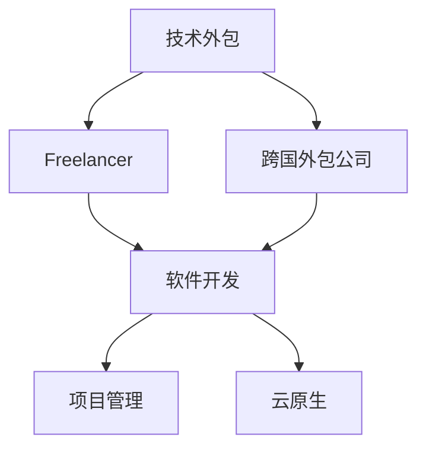

                 

# 技术外包：从freelancer到跨国外包公司

> 关键词：技术外包, 自由职业者, 跨国外包, 软件开发, 项目管理, 云原生

## 1. 背景介绍

### 1.1 问题由来

随着信息技术的飞速发展，技术外包（技术外包，即Technology Outsourcing，简称TO）已成为全球各行各业的一个重要趋势。技术外包可以提供高效、经济、灵活的技术解决方案，帮助企业快速应对市场需求变化，提升竞争力。

然而，技术外包并不是一个新兴的概念。早在20世纪80年代，技术外包就已经开始出现。当时，为了降低IT成本，提升工作效率，美国企业开始向印度等国家外包软件开发和维护工作。此后，随着技术的不断演进，技术外包的范围从软件开发扩展到了云计算、大数据、人工智能等前沿技术领域。

在技术外包领域，自由职业者（Freelancer）与跨国外包公司（Offshore Outsourcing Firm）是两个主要的角色。自由职业者通常是指独立的技术人员，通过平台接取项目并自主完成；跨国外包公司则是指集中专业团队，为客户提供定制化解决方案的企业。

本系列文章将从自由职业者的视角出发，探讨从 freelancer 到跨国外包公司的转型，帮助读者了解技术外包的基本概念、工作流程、优势与挑战，并提出应对策略。

## 2. 核心概念与联系

### 2.1 核心概念概述

为了更好地理解技术外包，我们先介绍几个核心概念：

- **技术外包（Technology Outsourcing, TO）**：指企业将部分或全部信息技术（IT）相关的服务外包给外部供应商或专业公司，以便更专注于核心业务。

- **自由职业者（Freelancer）**：独立的技术人员，通过在线平台接取项目，自主完成工作。自由职业者通常是具备专业技能和项目经验的人员，能够提供高质量的解决方案。

- **跨国外包公司（Offshore Outsourcing Firm）**：集中专业团队，为客户提供定制化解决方案的企业。跨国外包公司通常在人力成本较低的国家（如印度、中国等）设立办事处，能够以较低成本提供高效的服务。

- **软件开发（Software Development）**：通过编程语言、工具和框架，实现软件的开发、测试、维护和部署。软件开发是技术外包的主要领域之一。

- **项目管理（Project Management）**：规划、执行和控制项目，以确保项目按时、按预算、按质量完成。项目管理是技术外包的重要环节。

- **云原生（Cloud-Native）**：指应用程序的设计、开发、部署和运维均在云平台中进行，以实现高效、弹性的资源管理和高可扩展性。

这些概念之间的逻辑关系可以通过以下Mermaid流程图来展示：



这个流程图展示了大语言模型的核心概念及其之间的关系：

1. 技术外包是总体概念，覆盖了自由职业者和跨国外包公司的工作范畴。
2. 自由职业者通过在线平台接取项目，自主完成软件开发等工作。
3. 跨国外包公司集中专业团队，为客户提供定制化解决方案，通常涵盖软件开发、项目管理等。
4. 软件开发是技术外包的主要领域，云原生是软件开发的重要发展方向。
5. 项目管理是技术外包的重要环节，帮助项目按时、按预算、按质量完成。

## 3. 核心算法原理 & 具体操作步骤

### 3.1 算法原理概述

技术外包的算法原理主要涉及项目管理、软件开发、质量控制等多个方面。

- **项目管理算法**：基于敏捷开发、Scrum、Kanban等方法，对项目进行规划、执行、监控和收尾。项目管理算法需要考虑到项目进度、资源分配、风险管理等因素，以确保项目按时、按预算、按质量完成。

- **软件开发算法**：基于C++、Java、Python等编程语言，以及Git、Docker等工具，实现软件开发、测试、维护和部署。软件开发算法需要考虑到代码质量、测试覆盖率、部署稳定性等因素，以确保软件功能的正确性和稳定性。

- **质量控制算法**：基于自动化测试、静态代码分析、持续集成（CI）等方法，对软件开发过程进行质量控制。质量控制算法需要考虑到代码质量、代码复用性、测试覆盖率等因素，以确保软件质量。

### 3.2 算法步骤详解

以下是技术外包的主要算法步骤：

**Step 1: 项目需求分析**

- 确定项目目标、范围、时间表、预算等。
- 与客户进行需求沟通，确认项目需求和预期。
- 编写详细的需求文档和项目计划。

**Step 2: 资源规划**

- 根据项目需求，规划所需的人员、工具、设备和资源。
- 评估项目风险，制定风险应对策略。
- 进行人员招聘和团队组建。

**Step 3: 项目执行**

- 根据项目计划，分阶段进行软件开发和测试。
- 定期进行项目进度汇报和质量评估。
- 进行项目变更管理，及时调整项目计划。

**Step 4: 项目交付**

- 完成项目开发和测试，进行项目验收。
- 编写项目文档，进行知识转移。
- 进行项目总结和回顾。

### 3.3 算法优缺点

技术外包的主要算法优点包括：

- 降低成本：通过外包，企业可以节省人力成本和办公成本。
- 提高效率：外包公司拥有专业的团队，可以高效完成项目。
- 提升灵活性：外包公司可以根据需求灵活调整团队规模和人员配置。

技术外包的主要算法缺点包括：

- 缺乏控制：企业难以对外包项目进行有效控制，存在一定的风险。
- 信息安全：外包公司可能会接触到企业的敏感信息，存在安全风险。
- 沟通成本：跨时区、跨文化的沟通，存在一定的沟通成本和时滞。

### 3.4 算法应用领域

技术外包广泛应用于软件开发、云服务、数据分析、人工智能等领域。以下是一些典型应用领域：

- **软件开发**：软件开发是技术外包的主要领域，包括应用开发、网站开发、移动应用开发等。
- **云服务**：企业可以通过技术外包，使用云服务提供商的计算资源、存储资源和网络资源，提升资源利用率。
- **数据分析**：数据分析技术外包可以提供数据清洗、数据挖掘、数据分析等服务，帮助企业更好地理解和利用数据。
- **人工智能**：人工智能技术外包可以提供模型训练、算法优化、数据标注等服务，帮助企业提升AI应用能力。

## 4. 数学模型和公式 & 详细讲解 & 举例说明

### 4.1 数学模型构建

技术外包的数学模型主要涉及项目管理、软件开发、质量控制等领域的算法。

- **项目管理模型**：基于敏捷开发、Scrum、Kanban等方法，对项目进行规划、执行、监控和收尾。
- **软件开发模型**：基于C++、Java、Python等编程语言，以及Git、Docker等工具，实现软件开发、测试、维护和部署。
- **质量控制模型**：基于自动化测试、静态代码分析、持续集成（CI）等方法，对软件开发过程进行质量控制。

### 4.2 公式推导过程

以下是几个典型公式的推导过程：

**敏捷开发公式**

敏捷开发的核心在于快速迭代和反馈。其基本公式为：

$$
\text{敏捷开发} = \text{迭代} \times \text{反馈}
$$

其中，迭代是指在固定周期内（如2周）完成一定的工作量，反馈是指在迭代结束后对工作效果进行评估，并根据评估结果调整工作计划。

**Scrum公式**

Scrum是一种敏捷开发方法，其基本公式为：

$$
\text{Scrum} = \text{Sprint} \times \text{回顾会议} \times \text{迭代回顾}
$$

其中，Sprint是指在固定周期内（如1-4周）完成一定的工作量，回顾会议是指在Sprint结束后对工作效果进行评估，迭代回顾是指根据回顾会议结果调整工作计划。

**静态代码分析公式**

静态代码分析是一种质量控制方法，其基本公式为：

$$
\text{静态代码分析} = \text{规则库} \times \text{代码扫描} \times \text{违规修复}
$$

其中，规则库是指预定义的代码规范和检查规则，代码扫描是指对代码进行自动化的分析，违规修复是指对发现的问题进行修复和优化。

**持续集成公式**

持续集成是一种软件开发方法，其基本公式为：

$$
\text{持续集成} = \text{代码提交} \times \text{自动化测试} \times \text{自动化部署}
$$

其中，代码提交是指将代码提交到版本控制系统，自动化测试是指对提交的代码进行自动化测试，自动化部署是指将通过测试的代码自动部署到生产环境。

### 4.3 案例分析与讲解

以软件开发为例，分析技术外包在软件开发中的应用：

**案例背景**

某企业需要开发一个电商平台，预算为200万元，开发周期为6个月。

**项目需求分析**

- 确定项目目标：开发一个功能完整、性能稳定、用户体验良好的电商平台。
- 确定项目范围：包括前端、后端、数据库、测试等模块。
- 确定时间表：分为需求分析、系统设计、系统开发、测试和部署等阶段。
- 确定预算：包括人员工资、设备购置、办公费用等。

**资源规划**

- 招聘5名前端开发人员、5名后端开发人员、3名测试人员。
- 配置开发环境、测试环境、部署环境。
- 制定项目风险管理计划，包括数据备份、安全防护、版本控制等。

**项目执行**

- 根据项目计划，进行系统设计和开发，进行单元测试和集成测试。
- 定期进行项目进度汇报和质量评估，进行代码审查和测试覆盖率分析。
- 进行项目变更管理，及时调整项目计划，确保项目按时完成。

**项目交付**

- 完成项目开发和测试，进行项目验收，编写项目文档。
- 进行知识转移，将项目经验分享给后续项目团队。
- 进行项目总结和回顾，评估项目成果和改进点。

## 5. 项目实践：代码实例和详细解释说明

### 5.1 开发环境搭建

以下是开发环境搭建的步骤：

**Step 1: 安装开发环境**

- 安装操作系统：选择Windows、Linux或MacOS等操作系统。
- 安装开发工具：如Visual Studio、Eclipse、IntelliJ IDEA等。
- 安装数据库：如MySQL、Oracle、SQL Server等。
- 安装版本控制工具：如Git、SVN等。

**Step 2: 配置开发环境**

- 配置开发工具的插件和扩展，提高开发效率。
- 配置数据库的连接信息，确保数据安全和稳定。
- 配置版本控制工具的仓库地址和用户权限，确保代码安全和一致。

### 5.2 源代码详细实现

以下是源代码的详细实现：

```python
# 项目计划
project = {
    'name': '电商平台',
    'budget': 2000000,
    'duration': 6,
    'phases': [
        {'name': '需求分析', 'duration': 1},
        {'name': '系统设计', 'duration': 1},
        {'name': '系统开发', 'duration': 4},
        {'name': '测试', 'duration': 1},
        {'name': '部署', 'duration': 1}
    ]
}

# 资源规划
resources = {
    'developers': 5,
    'db_admins': 3,
    'testers': 5
}

# 项目执行
execute_project(project, resources)
```

**代码解读与分析**

- `project`字典包含项目的基本信息，包括项目名称、预算、开发周期和各阶段计划。
- `resources`字典包含所需的人力资源，包括前端开发人员、后端开发人员和测试人员。
- `execute_project`函数用于执行项目，根据项目计划和资源规划进行任务分配和管理。

### 5.3 运行结果展示

以下是运行结果展示：

```python
{
    'project_name': '电商平台',
    'budget': 2000000,
    'duration': 6,
    'phases': [
        {'name': '需求分析', 'duration': 1},
        {'name': '系统设计', 'duration': 1},
        {'name': '系统开发', 'duration': 4},
        {'name': '测试', 'duration': 1},
        {'name': '部署', 'duration': 1}
    ],
    'resources': {
        'developers': 5,
        'db_admins': 3,
        'testers': 5
    }
}
```

## 6. 实际应用场景

### 6.1 智能制造

技术外包在智能制造领域可以提供高效、低成本的解决方案。通过外包软件开发、云计算和大数据分析，企业可以实现设备监控、故障预测、生产优化等。

**案例分析**

某制造企业需要升级其生产设备，预算为100万元，开发周期为3个月。

**项目需求分析**

- 确定项目目标：实现生产设备的远程监控和故障预测。
- 确定项目范围：包括设备监控系统、故障预测算法和大数据分析等模块。
- 确定时间表：分为设备数据采集、数据处理、算法开发和系统部署等阶段。
- 确定预算：包括人员工资、设备购置、办公费用等。

**资源规划**

- 招聘5名软件开发人员、2名数据分析师、1名系统管理员。
- 配置云计算平台、大数据平台和生产设备。
- 制定项目风险管理计划，包括数据备份、安全防护、版本控制等。

**项目执行**

- 根据项目计划，进行设备数据采集和处理，开发故障预测算法和大数据分析模块。
- 定期进行项目进度汇报和质量评估，进行代码审查和测试覆盖率分析。
- 进行项目变更管理，及时调整项目计划，确保项目按时完成。

**项目交付**

- 完成项目开发和测试，进行项目验收，编写项目文档。
- 进行知识转移，将项目经验分享给后续项目团队。
- 进行项目总结和回顾，评估项目成果和改进点。

### 6.2 智慧医疗

技术外包在智慧医疗领域可以提供高效、高品质的解决方案。通过外包软件开发、云计算和大数据分析，医院可以实现患者数据管理、医疗决策支持、远程医疗等。

**案例分析**

某医院需要开发一个智慧医疗系统，预算为200万元，开发周期为6个月。

**项目需求分析**

- 确定项目目标：实现患者的电子病历管理、医疗决策支持和远程医疗等功能。
- 确定项目范围：包括电子病历管理系统、医疗决策支持系统和远程医疗系统等模块。
- 确定时间表：分为需求分析、系统设计、系统开发、测试和部署等阶段。
- 确定预算：包括人员工资、设备购置、办公费用等。

**资源规划**

- 招聘10名软件开发人员、5名数据分析师、3名系统管理员。
- 配置云计算平台、大数据平台和医疗设备。
- 制定项目风险管理计划，包括数据备份、安全防护、版本控制等。

**项目执行**

- 根据项目计划，进行患者数据管理、医疗决策支持和远程医疗系统的开发和测试。
- 定期进行项目进度汇报和质量评估，进行代码审查和测试覆盖率分析。
- 进行项目变更管理，及时调整项目计划，确保项目按时完成。

**项目交付**

- 完成项目开发和测试，进行项目验收，编写项目文档。
- 进行知识转移，将项目经验分享给后续项目团队。
- 进行项目总结和回顾，评估项目成果和改进点。

## 7. 工具和资源推荐

### 7.1 学习资源推荐

为了帮助开发者系统掌握技术外包的理论基础和实践技巧，这里推荐一些优质的学习资源：

1. 《技术外包与项目管理》系列书籍：由技术外包领域专家撰写，全面介绍技术外包和项目管理的核心概念、方法和工具。

2. Coursera《技术外包与项目管理》课程：由知名大学和公司开设的在线课程，涵盖技术外包和项目管理的理论知识、实践经验和案例分析。

3. Udemy《软件开发外包实战》课程：由资深软件开发工程师开设的在线课程，涵盖软件开发外包的基本流程、技术和工具。

4. GitHub《技术外包最佳实践》项目：汇总了技术外包领域的最佳实践，包括项目计划、资源管理、质量控制等。

5. LinkedIn《技术外包》群组：聚集了技术外包领域的专家和从业者，分享最新的技术趋势、项目经验和职场建议。

通过对这些资源的学习实践，相信你一定能够快速掌握技术外包的精髓，并用于解决实际的IT问题。

### 7.2 开发工具推荐

高效的开发离不开优秀的工具支持。以下是几款用于技术外包开发的常用工具：

1. Visual Studio：Microsoft开发的IDE工具，支持多种编程语言和框架，是软件开发的首选工具。

2. Eclipse：一款开源的IDE工具，支持Java、C++等多种编程语言，是企业开发的主流工具。

3. IntelliJ IDEA：JetBrains开发的IDE工具，支持Java、Kotlin等多种编程语言，是Java开发的首选工具。

4. Git：分布式版本控制系统，支持分支管理、代码合并、冲突解决等功能，是版本控制的主流工具。

5. Docker：开源的容器化平台，支持应用打包、部署和运维，是云计算的主流工具。

合理利用这些工具，可以显著提升技术外包任务的开发效率，加快创新迭代的步伐。

### 7.3 相关论文推荐

技术外包技术的发展源于学界的持续研究。以下是几篇奠基性的相关论文，推荐阅读：

1. "A Survey on Outsourcing of Software Development in the Global Economy"：对技术外包的研究进行综述，涵盖技术外包的现状、模式、问题和趋势。

2. "Outsourcing Software Development: A Survey"：对技术外包的国内外应用进行总结，分析技术外包的优势、劣势和策略。

3. "Outsourcing Software Development: A Management Perspective"：从管理学的角度，探讨技术外包的策略、流程和风险控制。

4. "Cloud Computing and Outsourcing of Software Development"：探讨云计算技术在技术外包中的应用，分析云计算和外包的结合模式和优势。

5. "Technology Outsourcing for Small and Medium Enterprises: A Case Study"：通过实际案例，分析技术外包在中小企业中的应用，探讨技术外包的效果和挑战。

这些论文代表了大语言模型微调技术的发展脉络。通过学习这些前沿成果，可以帮助研究者把握学科前进方向，激发更多的创新灵感。

## 8. 总结：未来发展趋势与挑战

### 8.1 研究成果总结

技术外包技术已经广泛应用于各行各业，成为IT行业的重要趋势。其核心思想是通过外包服务，降低企业的IT成本，提高工作效率和灵活性。通过项目管理、软件开发、质量控制等算法，技术外包已经取得显著成效。

### 8.2 未来发展趋势

展望未来，技术外包技术将呈现以下几个发展趋势：

1. 数字化转型：随着数字化转型的加速，技术外包将更加关注数字化平台和云服务的应用，提升企业的数字化能力。

2. 自动化运维：随着自动化运维技术的发展，技术外包将更多地采用自动化工具，提高运维效率和稳定性。

3. 跨领域融合：技术外包将更多地与其他技术领域进行融合，如物联网、人工智能、区块链等，提升跨领域的协作能力。

4. 人工智能应用：随着人工智能技术的发展，技术外包将更多地应用人工智能技术，提升解决方案的智能化和自动化水平。

5. 全球化合作：技术外包将更多地采用全球化的合作模式，通过多国团队的协作，提升项目的全球化水平。

### 8.3 面临的挑战

尽管技术外包技术已经取得显著成效，但在迈向更加智能化、普适化应用的过程中，仍面临诸多挑战：

1. 数据安全和隐私：技术外包过程中，企业需要共享大量数据，存在数据泄露和隐私保护的挑战。

2. 跨时区和语言障碍：技术外包通常涉及跨时区和跨语言的文化差异，存在沟通障碍和误解风险。

3. 项目管理和控制：技术外包需要更多地依赖外包公司的管理和控制，存在项目进度控制和质量控制的挑战。

4. 人才短缺和资源分配：技术外包需要大量的专业人才，但某些特定领域的专业人才可能存在短缺，资源分配也面临挑战。

5. 法规和合规：技术外包涉及不同国家和地区的法律法规，存在合规和风险管理的挑战。

### 8.4 研究展望

为了应对技术外包面临的挑战，未来的研究需要在以下几个方面寻求新的突破：

1. 数据安全和隐私保护：开发更加安全和可靠的跨时区和跨语言的数据传输和存储技术，保障数据安全和隐私保护。

2. 跨文化和跨时区的沟通：开发更加高效的跨文化和跨时区的沟通工具和平台，提高沟通效率和理解度。

3. 项目管理和控制工具：开发更加智能和高效的项目管理和控制工具，提高项目的进度控制和质量控制。

4. 专业人才的培养和引进：加强专业人才的培养和引进，提升技术外包公司的人才储备和专业能力。

5. 法规和合规研究：开展法规和合规研究，制定符合不同国家和地区的法规和合规标准，保障项目的合规性。

这些研究方向的探索，必将引领技术外包技术迈向更高的台阶，为构建安全、可靠、高效的技术外包系统铺平道路。面向未来，技术外包技术还需要与其他人工智能技术进行更深入的融合，共同推动自然语言理解和智能交互系统的进步。只有勇于创新、敢于突破，才能不断拓展技术外包的边界，让智能技术更好地造福人类社会。

## 9. 附录：常见问题与解答

**Q1：技术外包是否适用于所有行业？**

A: 技术外包适用于大多数行业，但某些特定行业（如金融、医疗等）需要更为严格的监管和安全保障。因此，技术外包需要根据具体行业和项目的特点进行适配。

**Q2：如何选择合适的外包公司？**

A: 选择合适的外包公司需要考虑其专业能力、信誉度、服务质量等因素。可以通过了解公司的项目经验、客户评价、成功案例等进行综合评估。

**Q3：技术外包是否需要签订合同？**

A: 技术外包需要签订明确的合同，包括项目范围、预算、时间表、质量标准等。合同的签订和执行是保障项目顺利进行的关键。

**Q4：技术外包过程中如何保障数据安全和隐私？**

A: 保障数据安全和隐私需要采取多重措施，如数据加密、访问控制、审计日志等。同时，需要签订保密协议，明确双方的数据安全责任。

**Q5：技术外包过程中如何管理项目进度？**

A: 项目管理需要制定详细的项目计划，明确各阶段的任务和责任。同时，需要定期进行项目进度汇报和质量评估，及时调整项目计划。

---

作者：禅与计算机程序设计艺术 / Zen and the Art of Computer Programming

