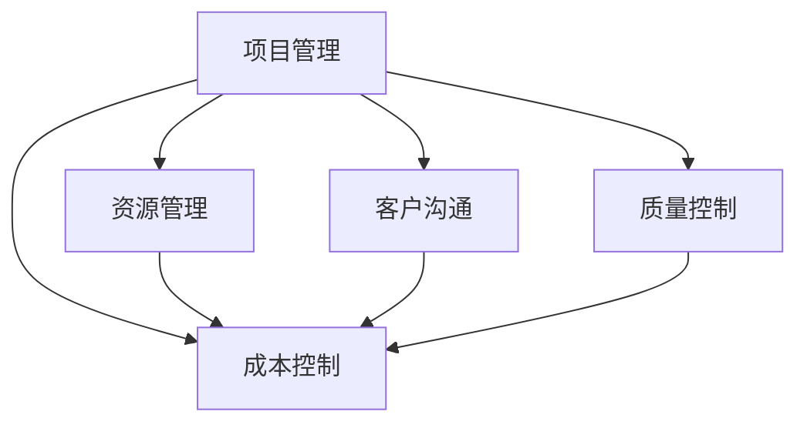

                 

# 技术外包：从接单到建立工作室

## 1. 背景介绍

### 1.1 问题由来
在现代社会中，技术外包已经成为了一个不可忽视的趋势。随着互联网和数字技术的不断发展，许多公司开始将非核心业务的IT工作外包出去，以降低运营成本，提高工作效率。这对IT行业来说既是机遇也是挑战。

### 1.2 问题核心关键点
技术外包的核心在于如何高效地承接项目，管理和交付结果。这包括但不限于项目需求分析、资源分配、进度跟踪、质量控制和客户沟通等方面。如何建立高效的团队，提升项目管理能力，为客户提供高质量的服务，成为技术外包成功的关键因素。

## 2. 核心概念与联系

### 2.1 核心概念概述
技术外包涉及多个核心概念，包括但不限于：

- **项目管理**：通过科学的项目管理方法，确保项目按时、按质、按量完成。
- **资源管理**：合理分配和使用团队成员、工具和预算，最大化利用资源。
- **客户沟通**：与客户保持密切沟通，了解需求变化，及时调整项目计划。
- **质量控制**：通过测试和验收标准，确保交付结果符合客户期望。
- **成本控制**：有效管理项目预算，避免资源浪费。

这些概念之间的联系可以通过以下Mermaid流程图来展示：



这个流程图展示了一些关键概念之间的联系，反映了技术外包项目管理的多维度特性。

## 3. 核心算法原理 & 具体操作步骤

### 3.1 算法原理概述
技术外包的管理过程可以抽象为一个多阶段优化问题。即在有限的资源和时间内，通过科学的算法和策略，最大化项目交付质量，同时最小化成本。

形式化地，假设外包公司有 $N$ 个项目，每个项目 $i$ 需要 $C_i$ 的人力成本，$T_i$ 的时间成本，$Q_i$ 的质量评分。公司拥有的总人力成本为 $M$，总时间为 $T$，则优化目标为：

$$
\max \sum_{i=1}^N Q_i - \sum_{i=1}^N (C_i + \frac{T_i}{t}) 
$$

其中，$t$ 为项目完成时间的单位，$\frac{T_i}{t}$ 表示项目 $i$ 的时间压力成本。

### 3.2 算法步骤详解
以下是基于优化模型的技术外包项目管理步骤：

**Step 1: 项目评估和筛选**
- 收集客户需求，进行项目评估，筛选出符合公司能力和市场需求的项目。
- 对项目进行初步分析，估计其人力成本、时间成本和质量评分。

**Step 2: 资源配置和计划制定**
- 根据项目评估结果，制定初步的资源配置和项目计划。
- 确定项目优先级，制定详细的项目时间表。

**Step 3: 任务分配和执行**
- 将项目分解为多个任务，分配给合适的团队成员。
- 确定每个任务的关键路径和里程碑，确保项目按时推进。

**Step 4: 进度跟踪和监控**
- 定期检查项目进度，及时发现和解决问题。
- 使用甘特图、看板等工具进行项目状态可视化。

**Step 5: 质量控制和验收**
- 实施代码审查、单元测试等质量控制措施。
- 根据客户反馈进行必要的调整和改进，确保项目质量。

**Step 6: 客户沟通和反馈**
- 与客户保持紧密沟通，定期汇报项目进展。
- 收集客户反馈，及时响应需求变化。

### 3.3 算法优缺点
技术外包管理的优点在于：
1. 降低运营成本：外包非核心业务，减轻公司财务负担。
2. 提升效率：外包公司专注于自身擅长的业务领域，提升整体效率。
3. 吸引高端人才：外包公司可以吸引行业内的优秀人才，提升团队水平。

缺点在于：
1. 信息不对称：客户和外包公司之间存在信息不对称，可能导致需求理解不准确。
2. 项目管理复杂：多项目、多团队的管理协调复杂，容易出现沟通和进度问题。
3. 质量控制风险：外包公司难以全面监控客户满意度，存在质量风险。

### 3.4 算法应用领域
技术外包管理的应用领域非常广泛，包括但不限于：

- IT咨询和系统集成：为企业提供IT规划、系统建设、运维等技术服务。
- 软件开发：承接软件项目开发，包括定制开发、维护升级等。
- 数据分析：为客户提供数据分析、数据挖掘、数据可视化等服务。
- 测试服务：提供测试服务，包括单元测试、集成测试、压力测试等。

这些领域都是技术外包的主要应用场景，涉及项目管理、资源配置、质量控制等核心概念。

## 4. 数学模型和公式 & 详细讲解 & 举例说明

### 4.1 数学模型构建
基于优化模型的技术外包项目管理，可以构建如下数学模型：

设 $N$ 个项目 $i$ 的项目质量为 $Q_i$，人力成本为 $C_i$，时间成本为 $T_i$，公司总人力成本为 $M$，总时间为 $T$。优化目标为：

$$
\max \sum_{i=1}^N Q_i - \sum_{i=1}^N (C_i + \frac{T_i}{t}) 
$$

约束条件为：

$$
\sum_{i=1}^N C_i \leq M \\
\sum_{i=1}^N \frac{T_i}{t} \leq T
$$

其中 $t$ 为项目完成时间的单位。

### 4.2 公式推导过程
上述优化模型中，$Q_i$ 和 $C_i$ 的值需要通过项目评估确定。时间成本 $T_i$ 可以通过工时估算或历史数据进行推算。设每个项目的工时为 $W_i$，则有：

$$
T_i = W_i \times t
$$

将 $T_i$ 代入优化目标和约束条件，得到：

$$
\max \sum_{i=1}^N Q_i - \sum_{i=1}^N (C_i + \frac{W_i}{t}) 
$$

$$
\sum_{i=1}^N C_i \leq M \\
\sum_{i=1}^N W_i \leq T
$$

### 4.3 案例分析与讲解
假设某外包公司有三个项目，其人力成本、时间成本和质量评分如下：

| 项目编号 | 人力成本 | 时间成本（小时） | 质量评分 |
|---|---|---|---|
| A | 10,000 | 500 | 90 |
| B | 20,000 | 1,000 | 95 |
| C | 15,000 | 750 | 85 |

公司总人力成本为 $M=30,000$，总时间为 $T=3,000$ 小时。项目完成时间的单位为 $t=40$ 小时。

根据上述模型，可以计算每个项目的最大收益：

$$
\max Q_i = \max (90 - \frac{500}{40}) + \max (95 - \frac{1000}{40}) + \max (85 - \frac{750}{40})
$$

$$
\max Q_i = 85 + 94.75 + 85 = 264.75
$$

由于 $M=30,000$，$T=3,000$，因此有：

$$
C_A + C_B + C_C \leq 30,000 \\
W_A + W_B + W_C \leq 3,000
$$

解得：

$$
C_A = 10,000, C_B = 20,000, C_C = 0 \\
W_A = 500, W_B = 500, W_C = 1,250
$$

因此，最优的资源分配为：项目 A 分配 500 小时，项目 B 分配 500 小时，项目 C 分配 1,250 小时。

## 5. 项目实践：代码实例和详细解释说明

### 5.1 开发环境搭建

为了进行技术外包项目的管理和优化，我们需要搭建一个基于 Python 的开发环境。以下是基本环境配置步骤：

1. 安装 Python 解释器和相应的包管理工具，如 Anaconda 或 pip。
2. 安装必要的 Python 包，如 pandas、numpy、matplotlib 等。
3. 安装 Python 科学计算库，如 scikit-learn、statsmodels 等。
4. 搭建分布式计算环境，如 Apache Spark、Hadoop 等。

### 5.2 源代码详细实现

以下是使用 Python 进行技术外包项目管理的示例代码：

```python
import numpy as np
import pandas as pd

# 项目数据
projects = {
    'A': {'cost': 10000, 'duration': 500, 'quality': 90},
    'B': {'cost': 20000, 'duration': 1000, 'quality': 95},
    'C': {'cost': 15000, 'duration': 750, 'quality': 85}
}

# 总预算和总时间
total_budget = 30000
total_duration = 3000
project_duration = 40

# 计算每个项目的最大收益
max_qualities = [p['quality'] - (p['duration'] / project_duration) for p in projects.values()]

# 求解最优资源分配
costs = [p['cost'] for p in projects.values()]
durations = [p['duration'] for p in projects.values()]
quality_scores = max_qualities

# 求解线性规划问题
from scipy.optimize import linprog
import matplotlib.pyplot as plt

# 设置线性规划目标函数
c = [1] * len(quality_scores)
A_eq = np.eye(len(projects))
b_eq = [total_budget] * len(projects)
A_ub = [np.array([durations])] * len(projects)
b_ub = [total_duration] * len(projects)

# 求解线性规划
result = linprog(c, A_eq, b_eq, A_ub, b_ub, bounds=(0, None))
resource_allocation = pd.DataFrame(result.x, index=projects, columns=['Allocation'])

# 输出最优资源分配
print(resource_allocation)
```

### 5.3 代码解读与分析

在上述代码中，我们首先定义了项目数据，包括人力成本、时间成本和质量评分。然后，计算了每个项目的最大收益，并求解了线性规划问题。

线性规划问题通过求解最大收益函数，得出最优的资源分配方案。其中，`scipy.optimize.linprog` 函数用于求解线性规划问题，`matplotlib.pyplot` 用于绘制结果图形。

## 6. 实际应用场景

### 6.1 公司资源配置优化

技术外包公司的核心任务之一是资源配置优化。在实际操作中，可以通过上述模型和方法，根据项目的复杂度和质量要求，合理分配人力和时间，最大化公司的收益。例如，一个软件开发公司需要承接多个项目，可以根据项目需求和团队成员的技能水平，进行动态调整和资源优化。

### 6.2 客户满意度提升

技术外包服务成功的关键在于客户满意度。通过与客户的紧密沟通，及时了解需求变化，并进行必要的调整和改进，可以有效提升客户满意度。例如，在软件开发项目中，定期与客户沟通，了解项目进展和反馈，及时解决客户关注的问题，可以提升项目的成功率和客户满意度。

### 6.3 项目管理工具使用

项目管理工具如 Jira、Trello、Asana 等，可以帮助外包公司更好地管理项目。这些工具提供进度跟踪、任务分配、质量控制等功能，可以提升项目管理效率和透明度。例如，使用 Jira 管理项目，可以实时查看每个任务的状态和进度，进行可视化展示和问题追踪。

## 7. 工具和资源推荐

### 7.1 学习资源推荐

为了提升技术外包管理能力，以下是一些推荐的学习资源：

1. 《项目管理之道》：介绍项目管理的基本概念和最佳实践。
2. 《精益创业》：介绍精益创业方法论，适用于技术外包项目的资源优化。
3. 《数据分析实战》：介绍数据分析的基本方法，适用于技术外包项目的质量控制。
4. 《Scikit-learn 实战》：介绍 scikit-learn 库的使用，适用于技术外包项目的优化模型实现。

### 7.2 开发工具推荐

以下是一些推荐的技术外包管理开发工具：

1. Jira：基于敏捷开发方法的项目管理工具，支持任务分配、进度跟踪、缺陷管理等功能。
2. Asana：面向团队协作的项目管理工具，支持任务分配、进度跟踪、文件共享等功能。
3. Trello：基于看板方法的项目管理工具，支持任务卡片、进度跟踪、协作功能。
4. GitLab：基于 DevOps 的项目管理工具，支持版本控制、CI/CD 集成、代码审查等功能。

### 7.3 相关论文推荐

以下是几篇关于技术外包管理的经典论文，推荐阅读：

1. 《A Comparative Study of Agile and Waterfall Models in Software Outsourcing》：比较敏捷开发和水落模型在软件开发外包中的应用。
2. 《Project Management in Software Outsourcing: Challenges and Strategies》：介绍软件外包项目管理的挑战和策略。
3. 《Value-Based Project Management in IT Outsourcing》：介绍价值导向的项目管理方法在信息技术外包中的应用。
4. 《Technical Debt Management in Software Outsourcing》：介绍技术债务管理在软件开发外包中的作用和策略。

## 8. 总结：未来发展趋势与挑战

### 8.1 总结

本文对技术外包从接单到建立工作室的整个过程进行了系统介绍。首先阐述了技术外包的核心概念和原理，详细讲解了基于优化模型的项目管理步骤。其次，通过实际案例分析，展示了技术外包管理的策略和工具应用。最后，介绍了技术外包的发展趋势和面临的挑战。

通过本文的系统梳理，可以看到，技术外包管理是一个复杂的多维度问题，涉及项目评估、资源配置、质量控制、客户沟通等多个方面。成功的外包管理需要科学的方法和工具，同时也需要团队的协作和持续改进。

### 8.2 未来发展趋势

展望未来，技术外包管理将呈现以下几个发展趋势：

1. 智能项目管理：借助 AI 和大数据技术，实现项目管理自动化和智能化，提升决策效率和质量。
2. 资源动态优化：通过机器学习和优化算法，实现资源配置的动态优化，提升资源利用率。
3. 客户满意度的提升：通过客户关系管理（CRM）系统，实现客户需求的实时响应和反馈，提升客户满意度。
4. 项目管理工具的创新：开发更加灵活、易于使用的项目管理工具，提高团队协作效率。

### 8.3 面临的挑战

尽管技术外包管理已经取得了一定的成果，但在实现智能化、普适化应用的过程中，仍面临以下挑战：

1. 项目管理复杂度：多项目、多团队的管理协调复杂，容易出现沟通和进度问题。
2. 客户需求变化：客户需求的不确定性，可能导致项目延期或资源浪费。
3. 质量控制难度：外包公司难以全面监控客户满意度，存在质量风险。
4. 资源利用率：资源配置不当可能导致资源浪费，影响项目成本和收益。

### 8.4 研究展望

面对技术外包管理的这些挑战，未来的研究需要在以下几个方面寻求新的突破：

1. 开发智能项目管理工具：结合 AI 和大数据技术，实现项目管理的自动化和智能化，提升决策效率和质量。
2. 探索资源动态优化算法：通过机器学习和优化算法，实现资源配置的动态优化，提升资源利用率。
3. 提升客户满意度：通过客户关系管理（CRM）系统，实现客户需求的实时响应和反馈，提升客户满意度。
4. 创新项目管理工具：开发更加灵活、易于使用的项目管理工具，提高团队协作效率。

这些研究方向的探索，必将引领技术外包管理技术迈向更高的台阶，为公司提供更加高效、可靠、灵活的外包服务。面向未来，技术外包管理还需要与其他信息技术进行更深入的融合，多路径协同发力，共同推动信息技术外包的进步。总之，技术外包管理的成功，需要科学的理论指导和实用的工具支持，方能实现高效、可靠、灵活的外包服务。

## 9. 附录：常见问题与解答

**Q1：技术外包是否适用于所有企业？**

A: 技术外包主要适用于非核心业务领域，如 IT 支持、数据分析、软件开发等。对于企业内部关键核心业务，由于信息安全和数据保密等原因，不宜完全外包。

**Q2：如何选择外包公司？**

A: 选择外包公司时，应重点关注其专业能力、团队规模、客户案例、项目管理经验等方面。可以要求外包公司提供详细的服务方案和报价，并与多家公司进行对比分析。

**Q3：如何应对客户需求变化？**

A: 应对客户需求变化，可以通过建立敏捷开发团队，采用迭代开发和持续交付的方法，定期与客户沟通，了解需求变化，并及时调整项目计划。

**Q4：如何评估外包公司的质量？**

A: 评估外包公司的质量，可以从项目交付时间、项目质量、客户满意度、项目成本等多个维度进行综合评价。可以要求外包公司提供项目进度报告、质量测试报告、客户反馈等证明材料。

**Q5：如何保障数据安全？**

A: 保障数据安全，可以采用数据加密、访问控制、审计日志等措施，确保数据传输和存储的安全性。同时，可以签订保密协议，明确外包公司和客户的数据使用和保护责任。

总之，技术外包管理是一个复杂且多维的问题，需要在实践中不断探索和优化。通过科学的理论指导和实用的工具支持，技术外包管理必将成为企业提升运营效率、降低运营成本的重要手段。面向未来，技术外包管理还需要与其他信息技术进行更深入的融合，共同推动信息技术外包的进步。

