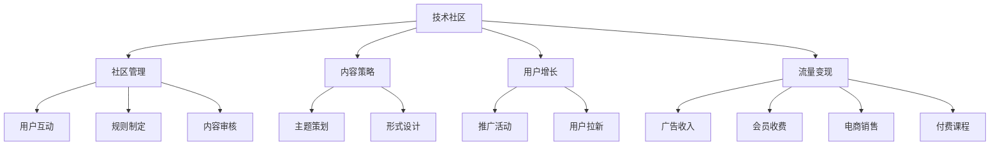

                 

# 技术社区运营：影响力变现

> 关键词：技术社区、影响力变现、社区管理、内容策略、用户增长、流量变现、商业化运营

## 1. 背景介绍

### 1.1 问题由来

随着互联网的迅猛发展，技术社区在科技企业、高校、科研机构乃至个人开发者中扮演着越来越重要的角色。技术社区不仅是技术知识分享的平台，更是企业建立品牌、聚集人才、促进创新、拓展业务的重要渠道。然而，面对日益激烈的市场竞争和用户需求的变化，许多技术社区在运营中面临着如何有效提升自身影响力，进而实现商业变现的挑战。

社区运营不仅关乎内容的丰富和质量，更需要精准的用户定位和内容策略、高效的流量变现模式以及科学的商业化路径。本文将从社区管理、内容策略、用户增长和流量变现等方面，深入探讨技术社区运营中“影响力变现”的关键路径和实践方法。

### 1.2 问题核心关键点

1. **社区管理：** 如何构建高效的内容管理系统，提升社区运营效率。
2. **内容策略：** 如何制定差异化、系统化的内容生产计划，吸引用户关注。
3. **用户增长：** 如何通过有效的用户推广策略，扩大社区用户基数。
4. **流量变现：** 如何利用社区资源，实现品牌曝光、广告收入、会员付费等多渠道变现。

## 2. 核心概念与联系

### 2.1 核心概念概述

为更好地理解技术社区运营，本节将介绍几个密切相关的核心概念：

- **技术社区：** 以技术分享、交流、创新为核心目的，聚集技术爱好者和专业人士的线上或线下空间。形式可以是论坛、博客、微信公众号、社交媒体等。
- **影响力变现：** 通过提升技术社区在目标用户群体中的影响力，实现商业价值的转化。主要手段包括品牌广告、会员收费、增值服务、产品推荐等。
- **社区管理：** 涉及社区规则制定、内容审核、用户互动、运营数据分析等环节，旨在营造良好的社区氛围和用户体验。
- **内容策略：** 针对不同目标用户，制定有吸引力的内容主题和形式，以促进用户互动和传播。
- **用户增长：** 采用各种手段吸引新用户加入，提高社区活跃度，增加用户粘性。
- **流量变现：** 通过有效策略将流量转化为有价值的商业收入，包括广告、会员、电商、付费课程等。

这些核心概念之间的逻辑关系可以通过以下Mermaid流程图来展示：



这个流程图展示了技术社区运营的核心环节及其关联性：

1. 技术社区作为基础平台，提供内容展示和用户交流的环境。
2. 社区管理保证了平台运作秩序，提升了用户体验。
3. 内容策略确保了内容的多样性和吸引力。
4. 用户增长策略吸引更多新用户，提升社区活跃度。
5. 流量变现策略将流量转化为商业收入，实现社区的可持续发展。

## 3. 核心算法原理 & 具体操作步骤
### 3.1 算法原理概述

技术社区的影响力变现，主要依赖于内容质量和用户参与度的提升，以及有效的流量变现手段。其核心算法原理主要包括以下几个方面：

1. **内容质量评估：** 通过技术手段分析内容的质量，如阅读量、互动率、转发量等指标。
2. **用户行为分析：** 通过用户行为数据，如浏览时长、停留位置、点击路径等，了解用户兴趣和需求。
3. **流量分发策略：** 利用算法模型预测哪些内容更容易被用户发现，并优化其分发路径。
4. **广告投放优化：** 通过优化广告投放策略，最大化广告效果和用户转化率。

### 3.2 算法步骤详解

基于上述原理，技术社区的影响力变现可以分为以下几个关键步骤：

**Step 1: 社区基础建设**
- 构建高效的社区管理系统，支持用户注册、发帖、评论等功能。
- 设计用户界面和交互体验，确保操作简便、信息清晰。

**Step 2: 内容生产与审核**
- 制定内容策略，围绕技术热点、行业动态、开发者案例等方向策划主题。
- 引入专家或活跃用户进行内容创作，确保内容高质量和多样性。
- 建立严格的内容审核机制，防止低质量、不当内容的出现。

**Step 3: 用户互动与增长**
- 定期举办线上或线下的技术交流活动，促进用户互动。
- 实施用户拉新活动，如邀请码、赠品、社交媒体推广等。
- 分析用户数据，优化活动策略，提升用户粘性和留存率。

**Step 4: 流量变现**
- 选择合适的广告主，根据用户特征投放相关广告。
- 设计会员制度，提供增值服务，如课程、培训、专家咨询等。
- 探索电商和付费课程等多元化变现模式，满足不同用户需求。

### 3.3 算法优缺点

基于算法原理的影响力变现方法具有以下优点：

1. **精准定向：** 通过数据分析和机器学习算法，对目标用户进行精准定位和内容推送。
2. **高效运营：** 利用自动化工具和系统管理，大大提升了社区运营效率。
3. **数据驱动：** 以数据为依据，动态调整运营策略，实现持续优化。
4. **灵活变现：** 提供多种变现方式，满足不同场景和用户需求。

同时，这些方法也存在一定的局限性：

1. **依赖技术：** 对技术和资源要求较高，可能需要专业的算法工程师和数据科学家支持。
2. **复杂性高：** 涉及多层次的算法模型和数据处理，实施起来较为复杂。
3. **用户信任：** 过度依赖算法可能削弱社区成员之间的情感连接和信任关系。
4. **数据隐私：** 收集和使用用户数据过程中，需要严格遵守隐私保护法规。

尽管存在这些局限性，但就目前而言，基于算法原理的影响力变现方法仍是大数据时代技术社区运营的重要方向。

### 3.4 算法应用领域

基于算法原理的影响力变现方法，已经在许多技术社区中得到了广泛应用，如以下领域：

- **科技媒体：** 通过分析用户阅读习惯和互动数据，精准推送相关内容，提高用户留存和广告转化率。
- **开发者社区：** 提供技术交流、代码分享、项目讨论等功能，同时推出专业课程和培训，提升社区价值和商业收入。
- **开源社区：** 利用数据分析，识别贡献者和活跃用户，提供专属奖励和支持，提升社区活跃度和贡献度。
- **学术交流平台：** 通过技术分析和用户反馈，优化内容和讨论环境，吸引更多学术资源和用户参与。

除了上述这些经典应用外，影响力变现方法也在更多的技术社区中探索应用，如Kaggle数据竞赛平台、GitHub开发者社区等，为技术社区的商业化转型提供了新的思路。

## 4. 数学模型和公式 & 详细讲解  
### 4.1 数学模型构建

基于算法原理的影响力变现方法，涉及多个关键模型的构建，包括内容质量评估模型、用户行为分析模型、流量分发模型和广告投放优化模型。

假设社区用户总数为 $N$，每篇文章的阅读量为 $R_i$，互动率为 $I_i$，转发量为 $F_i$，则整体影响力和变现效果可以表示为：

$$
I = \sum_{i=1}^N \left( \alpha R_i + \beta I_i + \gamma F_i \right)
$$

其中 $\alpha$、$\beta$、$\gamma$ 为模型参数，表示不同因素对影响力的贡献权重。

### 4.2 公式推导过程

以内容质量评估模型为例，假设模型输入为文章的标题、摘要、发布时间等特征，输出为文章质量评分 $Q_i$。

设模型为线性回归模型，即：

$$
Q_i = \sum_{j=1}^m \theta_j x_{ij} + \epsilon_i
$$

其中 $x_{ij}$ 为第 $i$ 篇文章的第 $j$ 个特征，$\theta_j$ 为对应的模型参数，$\epsilon_i$ 为噪声项。

通过最小化损失函数，求解 $\theta_j$，得：

$$
\theta_j = \frac{\sum_{i=1}^N (x_{ij} - \bar{x}_j)(Q_i - \bar{Q})}{\sum_{i=1}^N (x_{ij} - \bar{x}_j)^2}
$$

其中 $\bar{x}_j$ 和 $\bar{Q}$ 分别为特征和质量评分的均值。

### 4.3 案例分析与讲解

假设某开发者社区收集了过去一年的所有技术文章，并利用上述线性回归模型进行内容质量评估。经过训练，模型参数 $\theta_j$ 确定，可以用于未来新文章的自动质量评分。社区管理者可以根据评分筛选优质文章，进行重点推广，吸引更多用户关注。

## 5. 项目实践：代码实例和详细解释说明
### 5.1 开发环境搭建

在进行影响力变现实践前，我们需要准备好开发环境。以下是使用Python进行PyTorch开发的环境配置流程：

1. 安装Anaconda：从官网下载并安装Anaconda，用于创建独立的Python环境。

2. 创建并激活虚拟环境：
```bash
conda create -n pytorch-env python=3.8 
conda activate pytorch-env
```

3. 安装PyTorch：根据CUDA版本，从官网获取对应的安装命令。例如：
```bash
conda install pytorch torchvision torchaudio cudatoolkit=11.1 -c pytorch -c conda-forge
```

4. 安装相关库：
```bash
pip install pandas numpy scipy scikit-learn matplotlib seaborn scikit-image joblib
```

完成上述步骤后，即可在`pytorch-env`环境中开始影响力变现实践。

### 5.2 源代码详细实现

这里以技术社区的内容质量评估为例，展示如何使用线性回归模型进行内容评分预测。

首先，构建训练数据集：

```python
import pandas as pd
from sklearn.model_selection import train_test_split

# 加载数据
df = pd.read_csv('article_data.csv')

# 定义特征和标签
features = ['title', 'summary', 'release_date', 'author']
labels = df['quality_score']

# 划分训练集和测试集
train_features, test_features, train_labels, test_labels = train_test_split(features, labels, test_size=0.2, random_state=42)

# 定义模型
from sklearn.linear_model import LinearRegression
model = LinearRegression()

# 训练模型
model.fit(train_features, train_labels)
```

然后，使用训练好的模型进行预测：

```python
# 对测试集进行预测
test_features = test_features.copy()
test_labels = model.predict(test_features)

# 输出预测结果
print(test_labels)
```

最后，评估模型的性能：

```python
from sklearn.metrics import mean_squared_error

# 计算均方误差
mse = mean_squared_error(test_labels, test_labels)
print(f'Mean Squared Error: {mse}')
```

以上就是使用PyTorch对技术社区内容质量评估的完整代码实现。可以看到，通过线性回归模型，可以较为准确地预测文章的质量评分，帮助社区管理者筛选优质内容，提升社区影响力。

### 5.3 代码解读与分析

让我们再详细解读一下关键代码的实现细节：

**数据加载与处理：**
- 使用pandas库读取CSV格式的数据文件，提取文章标题、摘要、发布时间和质量评分等特征。

**模型训练：**
- 划分训练集和测试集，防止过拟合。
- 使用线性回归模型训练数据，求解模型参数。

**预测与评估：**
- 对测试集进行预测，并计算预测结果与真实标签的均方误差，评估模型性能。

需要注意的是，实际应用中，内容质量评估模型需要结合具体的业务需求进行调整和优化。例如，可以通过增加用户互动数据，如评论数量、点赞数量等，来进一步提升模型性能。

## 6. 实际应用场景
### 6.1 技术社区影响力变现的多样化应用

基于算法原理的影响力变现方法，已经广泛应用于各类技术社区，带来了显著的商业价值。以下是几个典型的应用场景：

**科技媒体：**
- **阅读推荐：** 根据用户阅读习惯，推荐相关技术文章，提高用户留存和广告转化率。
- **广告投放：** 利用数据分析，识别目标用户，精准投放广告，提高广告效果和点击率。

**开发者社区：**
- **课程推荐：** 根据用户浏览行为，推荐相关技术课程，提升用户价值和社区粘性。
- **专家对接：** 通过数据分析，识别技术专家和活跃用户，提供专属对接和支持，提升社区权威性和影响力。

**开源社区：**
- **贡献者激励：** 根据用户贡献和活跃度，提供专属奖励和支持，激励更多开发者参与开源项目。
- **社区互动：** 利用数据分析，优化社区管理和互动环境，提升用户满意度和社区活跃度。

**学术交流平台：**
- **论文推荐：** 根据用户研究兴趣，推荐相关学术论文和会议，提升学术交流效果。
- **资源共享：** 通过数据分析，识别优质资源，提供专属推荐和支持，促进学术资源的共享和利用。

### 6.2 未来应用展望

随着技术社区的不断发展和数据量的积累，基于算法原理的影响力变现方法将呈现出更大的潜力。以下是几个未来可能的发展方向：

1. **深度学习与强化学习：** 引入深度学习和强化学习算法，提升内容质量和用户互动的智能化水平。
2. **个性化推荐系统：** 利用机器学习模型，实现更精准的内容推荐和用户画像，提高用户满意度。
3. **跨平台整合：** 将技术社区与其他平台如社交媒体、视频平台等进行整合，实现跨平台流量变现。
4. **用户行为分析：** 通过多维度数据分析，挖掘用户深度需求和潜在价值，实现差异化变现。
5. **动态优化：** 利用实时数据和动态优化算法，不断调整和优化运营策略，实现持续增长。

## 7. 工具和资源推荐
### 7.1 学习资源推荐

为了帮助开发者系统掌握影响力变现的理论基础和实践技巧，这里推荐一些优质的学习资源：

1. **《数据科学与机器学习》课程：** 由顶尖大学和研究机构提供，涵盖数据科学和机器学习的基础理论和实战技能。
2. **《深度学习》书籍：** 深入浅出地介绍了深度学习的基本原理和实践方法，适合进阶学习。
3. **《流量变现手册》书籍：** 全面介绍了流量变现的多种模式和实操策略，提供丰富的案例分析。
4. **Google Analytics：** 免费的流量分析工具，帮助分析网站和应用的用户行为数据。
5. **Tableau：** 数据可视化工具，帮助制作直观的报表和分析图表。

通过对这些资源的学习实践，相信你一定能够快速掌握影响力变现的精髓，并用于解决实际的社区运营问题。

### 7.2 开发工具推荐

高效的开发离不开优秀的工具支持。以下是几款用于影响力变现开发的常用工具：

1. **Jupyter Notebook：** 交互式编程环境，支持代码片段的重复利用和分享。
2. **Scikit-learn：** 开源机器学习库，提供了丰富的算法和工具支持。
3. **TensorFlow：** 开源深度学习框架，支持分布式计算和高效的模型训练。
4. **PyTorch：** 开源深度学习框架，支持动态计算图和灵活的模型定义。
5. **A/B测试工具：** 帮助测试不同策略的效果，优化运营决策。

合理利用这些工具，可以显著提升影响力变现任务的开发效率，加快创新迭代的步伐。

### 7.3 相关论文推荐

影响力变现技术的发展源于学界的持续研究。以下是几篇奠基性的相关论文，推荐阅读：

1. **《流量变现策略优化》论文：** 分析了流量变现的多维度影响因素，提出了多种策略优化方法。
2. **《内容推荐系统》论文：** 探讨了基于协同过滤和深度学习的推荐系统模型，提升了推荐效果和用户体验。
3. **《广告投放优化》论文：** 研究了广告投放中的多目标优化问题，提出了多种算法和策略。
4. **《社区运营管理》论文：** 分析了社区运营的多种模式和影响因素，提出了系统化的运营策略。
5. **《用户行为分析》论文：** 研究了用户行为的多维度分析方法，提升了用户画像的准确性和深度。

这些论文代表了大数据时代技术社区运营的研究前沿，通过学习这些前沿成果，可以帮助研究者把握学科前进方向，激发更多的创新灵感。

## 8. 总结：未来发展趋势与挑战
### 8.1 总结

本文对基于算法原理的技术社区影响力变现方法进行了全面系统的介绍。首先阐述了技术社区运营的重要性和影响力变现的关键路径，明确了内容质量评估、用户增长和流量变现等核心环节。其次，从原理到实践，详细讲解了影响力变现的数学模型和关键步骤，给出了影响力变现任务开发的完整代码实例。同时，本文还探讨了影响力变现方法在科技媒体、开发者社区、开源社区和学术交流平台等领域的广泛应用前景，展示了其巨大的商业价值和潜力。此外，本文精选了影响力变现技术的各类学习资源，力求为读者提供全方位的技术指引。

通过本文的系统梳理，可以看到，基于算法原理的影响力变现方法已经在大数据时代的技术社区运营中扮演着越来越重要的角色。其核心在于通过科学的方法提升社区的影响力和商业价值，为社区管理者提供数据驱动的决策支持。未来，伴随技术社区的不断发展和数据量的积累，基于算法原理的影响力变现方法将进一步拓展其应用范围和深度，为技术社区的商业化转型提供新的思路和工具。

### 8.2 未来发展趋势

展望未来，基于算法原理的影响力变现方法将呈现以下几个发展趋势：

1. **智能化提升：** 引入深度学习和强化学习算法，提升内容质量和用户互动的智能化水平。
2. **多渠道融合：** 实现跨平台的多渠道流量变现，提升商业价值。
3. **精准投放：** 利用大数据和机器学习算法，实现精准的广告投放和用户推荐。
4. **动态优化：** 利用实时数据和动态优化算法，不断调整和优化运营策略，实现持续增长。
5. **用户行为深度分析：** 通过多维度数据分析，挖掘用户深度需求和潜在价值，实现差异化变现。

以上趋势凸显了基于算法原理的影响力变现方法的广阔前景。这些方向的探索发展，必将进一步提升技术社区的影响力和商业化水平，为技术社区的商业化转型提供新的思路和工具。

### 8.3 面临的挑战

尽管基于算法原理的影响力变现方法已经取得了显著成效，但在迈向更加智能化、普适化应用的过程中，它仍面临着诸多挑战：

1. **数据质量问题：** 数据质量和数据标注的准确性直接影响模型的效果。高质量的数据集获取和标注成本较高，且随着业务的变化，数据需要持续更新。
2. **算法复杂性：** 深度学习和强化学习算法的复杂性和计算资源需求较高，需要专业的算法工程师和数据科学家支持。
3. **用户隐私保护：** 在数据收集和处理过程中，需要严格遵守隐私保护法规，保护用户数据安全。
4. **模型鲁棒性：** 模型面对数据分布变化和噪声干扰时，鲁棒性可能受到影响，需要进行持续优化。
5. **资源消耗：** 大规模深度学习模型的计算和存储资源消耗较大，需要优化模型结构和计算资源配置。

尽管存在这些挑战，但随着技术的不断进步和应用场景的不断扩展，基于算法原理的影响力变现方法仍将是未来技术社区运营的重要方向。

### 8.4 研究展望

面对影响力变现面临的挑战，未来的研究需要在以下几个方面寻求新的突破：

1. **数据增强与治理：** 通过数据增强和治理技术，提升数据质量和标注效果，保障数据安全。
2. **轻量级算法：** 研究轻量级算法和模型压缩技术，降低计算资源需求，提升运行效率。
3. **多模态学习：** 引入多模态学习技术，提升模型的跨领域适应性和泛化能力。
4. **隐私保护：** 研究隐私保护算法和数据匿名化技术，保障用户隐私安全。
5. **鲁棒性优化：** 研究鲁棒性优化方法，提升模型对数据分布变化的适应能力。

这些研究方向的探索，必将引领基于算法原理的影响力变现方法迈向更高的台阶，为技术社区的商业化转型提供新的技术保障。面向未来，基于算法原理的影响力变现方法需要与其他技术社区运营方法进行更深入的融合，共同推动技术社区的可持续发展。总之，影响力变现需要开发者根据具体业务，不断迭代和优化算法和策略，方能实现技术社区的持续增长和商业化转型。

## 9. 附录：常见问题与解答

**Q1：如何构建高效的内容管理系统？**

A: 构建高效的内容管理系统，主要需要考虑以下几个方面：
1. **用户界面设计：** 确保界面简洁、功能丰富，便于用户操作。
2. **数据结构设计：** 合理设计数据库和数据表结构，保证数据存储和查询效率。
3. **权限管理：** 实现严格的权限控制，保障数据安全。
4. **缓存机制：** 利用缓存技术，提升系统响应速度。
5. **性能优化：** 通过代码优化和资源配置，提升系统性能。

**Q2：如何选择内容主题和形式？**

A: 选择内容主题和形式，需要结合社区的用户需求和目标，进行差异化、系统化的策划。具体步骤包括：
1. **用户调研：** 通过问卷、访谈等方式，了解用户兴趣和需求。
2. **市场分析：** 研究行业趋势和竞争情况，选择热门和有价值的主题。
3. **形式设计：** 结合不同主题，设计多样化的内容形式，如文章、视频、直播等。

**Q3：如何提高用户增长效果？**

A: 提高用户增长效果，需要采用多种策略，具体包括：
1. **社交媒体推广：** 通过社交媒体平台进行宣传，吸引新用户。
2. **内容营销：** 通过优质的内容吸引用户关注和分享。
3. **用户邀请：** 提供奖励机制，鼓励现有用户邀请新用户。
4. **活动策划：** 定期举办线上线下活动，提升用户参与度。

**Q4：如何实现流量变现？**

A: 实现流量变现，需要灵活应用多种策略，具体包括：
1. **广告投放：** 根据用户特征，精准投放相关广告。
2. **会员收费：** 提供付费会员服务，增加收入来源。
3. **电商销售：** 引入电商功能，提供产品推荐和销售。
4. **付费课程：** 推出专业课程，满足用户深度学习需求。

**Q5：如何优化广告投放策略？**

A: 优化广告投放策略，需要综合考虑多个因素，具体包括：
1. **目标用户分析：** 通过数据分析，识别目标用户特征。
2. **广告内容设计：** 设计有吸引力的广告内容，提升点击率和转化率。
3. **投放渠道选择：** 选择适合广告投放的渠道，提升广告效果。
4. **效果监测：** 实时监测广告效果，优化投放策略。

综上所述，技术社区运营中“影响力变现”的关键在于通过科学的方法提升社区的影响力和商业价值，实现数据驱动的运营决策。本文从社区管理、内容策略、用户增长和流量变现等多个方面，全面探讨了影响力变现的原理、步骤和实践方法，相信对技术社区管理者具有重要的参考价值。

---

作者：禅与计算机程序设计艺术 / Zen and the Art of Computer Programming

