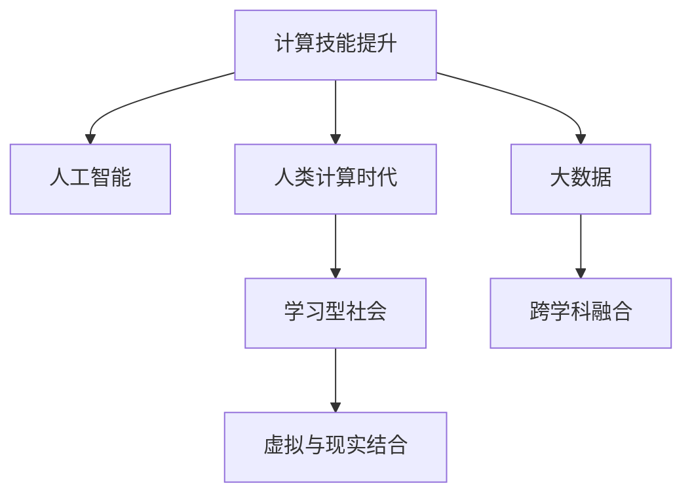

                 

# 技能提升：适应人类计算时代的新需求

> 关键词：计算技能提升,人工智能,人类计算时代,技术驱动,学习型社会

## 1. 背景介绍

### 1.1 问题由来

随着人工智能技术的迅猛发展，计算已经成为推动社会进步的关键引擎。面对日新月异的技术变革，人类计算技能提升变得尤为重要。无论是在职场竞争、日常生活，还是在科学研究、工业生产中，掌握最新计算技能都是必需的。同时，伴随人工智能、大数据等技术的广泛应用，计算技能需求也呈现出多元化、专业化、个性化等特点，亟需通过系统化的教育与培训，满足不同层次人才的需求。

### 1.2 问题核心关键点

人类计算技能提升的核心关键点在于如何通过系统化、专业化、持续化的教育培训，使更多人掌握最新计算技能，适应时代发展的需要。

1. **系统化教育：** 构建涵盖计算基础知识、实践技能、创新思维的综合教育体系，形成从基础到应用再到前沿技术的完整课程链。
2. **专业化培养：** 根据不同行业领域的特点，设计针对性课程和实践项目，实现人才的专业化培养。
3. **持续化培训：** 适应快速变化的技术环境，提供终身学习的机会，帮助从业者不断更新技能，保持竞争优势。
4. **跨学科融合：** 推动计算技能与其他学科知识的深度融合，拓宽知识视野，激发创新思维。
5. **虚拟与现实结合：** 采用虚拟现实、增强现实等技术手段，提升学习体验和技能实践效果。

## 2. 核心概念与联系

### 2.1 核心概念概述

为更好地理解人类计算技能提升的机制和路径，本节将介绍几个密切相关的核心概念：

- **计算技能提升：** 通过系统的教育培训，提升个人或群体在计算领域的知识、技能和创新能力。
- **人工智能：** 利用算法和计算能力，使计算机能够模拟、延伸和扩展人类智能的技术。
- **大数据：** 利用先进的数据处理技术，从海量数据中提取有价值信息的过程。
- **人类计算时代：** 以人工智能、大数据等技术为支撑，计算成为推动社会进步的重要力量，人类计算技能需求日趋增长的新时代。
- **学习型社会：** 鼓励和支持持续学习，不断更新知识和技能，适应快速变化的社会需求。

这些核心概念之间的逻辑关系可以通过以下Mermaid流程图来展示：



这个流程图展示出人类计算技能提升的关键概念及其相互关系：

1. 计算技能提升通过人工智能、大数据等技术的推动，进入人类计算时代。
2. 人工智能和大数据进一步推动计算技能的提升和应用。
3. 学习型社会为持续提升计算技能提供了环境和支持。
4. 跨学科融合拓展了计算技能的应用领域。
5. 虚拟与现实结合增强了计算技能的实践效果。

## 3. 核心算法原理 & 具体操作步骤

### 3.1 算法原理概述

人类计算技能提升的核心算法原理基于“学以致用”的逻辑，即通过系统的教育培训，将理论知识转化为实践技能，并在实际应用中不断深化理解和提升能力。其基本流程包括：

1. **知识传授：** 通过在线课程、培训讲座、书籍等多种形式，向学习者传授计算基础知识和最新技术。
2. **技能实践：** 设计实验、编程、项目等实践环节，使学习者能够动手操作、解决问题，将知识转化为技能。
3. **应用验证：** 通过实际应用案例和项目，验证学习者所掌握技能的有效性，发现不足并进行改进。
4. **持续学习：** 建立终身学习的机制，通过在线平台、社区交流等方式，保持技能的时效性和前沿性。

### 3.2 算法步骤详解

人类计算技能提升的算法步骤包括：

**Step 1: 需求分析**
- 通过调研，确定目标群体对计算技能的需求，制定相应的培训目标。
- 分析学习者的背景知识、技能水平和兴趣点，设计个性化的培训方案。

**Step 2: 课程设计**
- 根据培训目标，设计系统化的课程体系，包括理论课程、实践项目和实战演练。
- 引入最新的技术进展和应用案例，保证课程的时效性和实用性。
- 设计跨学科融合的课程内容，拓宽学习者的知识视野。

**Step 3: 师资准备**
- 招募和培训具有丰富教学经验和实践技能的专业教师。
- 建立教师评估和反馈机制，确保教学质量和效果。

**Step 4: 教学实施**
- 采用线上线下相结合的教学模式，灵活运用虚拟现实、增强现实等技术手段。
- 引入分组讨论、案例研讨、项目实践等互动环节，提升学习效果。
- 建立学习管理系统(LMS)，提供学习资源、作业提交、进度跟踪等功能。

**Step 5: 评估反馈**
- 设计科学的评估机制，通过考试、项目评审、自评等形式，评估学习者的掌握程度。
- 根据评估结果，及时反馈学习者的进步和不足，调整教学策略。
- 建立学习者反馈渠道，鼓励学习者提出改进建议，持续优化课程。

**Step 6: 实践应用**
- 推动学习者将所学技能应用于实际工作或科研中，进行项目实践和问题解决。
- 鼓励学习者参与开源项目、行业比赛等活动，增强实战经验。
- 通过实际应用案例和项目，验证学习者所掌握技能的有效性，发现不足并进行改进。

### 3.3 算法优缺点

人类计算技能提升的算法优点包括：

1. **系统性：** 通过系统化的教育培训，确保学习者掌握全面的知识和技能。
2. **实战性：** 结合实际应用案例和项目，提升学习者的实战能力。
3. **持续性：** 提供终身学习的机会，保持技能的及时性和前沿性。
4. **创新性：** 推动跨学科融合，激发学习者的创新思维。

缺点主要体现在：

1. **资源消耗大：** 系统化的培训需要大量的时间和资源投入，成本较高。
2. **个性化不足：** 大规模培训难以完全满足每个学习者的个性化需求，需要进一步细化培训方案。
3. **应用效果不一：** 培训效果因学习者基础、师资水平、教学环境等多种因素影响，差异较大。

### 3.4 算法应用领域

人类计算技能提升的算法广泛应用于多个领域，例如：

- **职业教育：** 通过技能培训，提升学生的就业竞争力，实现高质量就业。
- **企业培训：** 通过技能提升培训，使员工掌握新技术、新方法，提升工作效率和创新能力。
- **终身学习：** 提供多样化的在线课程和资源，支持从业者持续更新技能，保持竞争优势。
- **科研教育：** 通过前沿技术的培训，激发科研人员的新思路、新方法，推动科研成果产出。
- **科普教育：** 利用通俗易懂的科普内容，提升公众对计算技术的理解和兴趣。

## 4. 数学模型和公式 & 详细讲解 & 举例说明

### 4.1 数学模型构建

本节将使用数学语言对人类计算技能提升的过程进行更加严格的刻画。

记目标群体为 $G$，计算技能提升过程为 $S$。假设目标群体对计算技能的需求为 $D_G$，课程体系为 $C$，师资力量为 $T$，教学实施过程为 $I$，评估反馈机制为 $E$，实际应用案例为 $A$，持续学习机制为 $L$。则数学模型可以表示为：

$$
S = F(D_G, C, T, I, E, A, L)
$$

其中 $F$ 为计算技能提升的映射函数，通过输入目标群体的需求、课程体系、师资力量、教学实施、评估反馈、实际应用案例和持续学习机制，输出最终的计算技能提升效果。

### 4.2 公式推导过程

人类计算技能提升的数学模型可以通过以下几个公式进行推导：

$$
S = D_G \times C \times T \times I \times E \times A \times L
$$

具体推导过程如下：

1. **知识传授：** 通过课程体系 $C$ 和师资力量 $T$，向目标群体 $G$ 传授计算基础知识和最新技术。
2. **技能实践：** 通过教学实施 $I$，使目标群体 $G$ 掌握实践技能。
3. **应用验证：** 通过实际应用案例 $A$，验证学习者所掌握技能的有效性。
4. **持续学习：** 通过持续学习机制 $L$，保持技能的时效性和前沿性。

### 4.3 案例分析与讲解

以编程技能提升为例，进行详细分析：

1. **需求分析：** 确定目标群体为计算机专业学生，目标需求为掌握Python编程语言及其应用。
2. **课程设计：** 设计系统化的课程体系，包括Python基础、数据结构与算法、Web开发、机器学习等课程。引入最新的编程技术和应用案例，确保课程的时效性和实用性。
3. **师资准备：** 招募和培训具有丰富编程教学经验的专业教师，建立教师评估和反馈机制，确保教学质量和效果。
4. **教学实施：** 采用线上线下相结合的教学模式，通过编程实践、项目练习等互动环节，提升学习效果。引入虚拟现实、增强现实等技术手段，增强学习体验。
5. **评估反馈：** 设计科学的评估机制，通过编程作业、项目评审、编程竞赛等形式，评估学习者的编程技能掌握程度。根据评估结果，及时反馈学习者的进步和不足，调整教学策略。
6. **实践应用：** 推动学习者将所学编程技能应用于实际项目中，参与开源项目、行业比赛等活动，增强实战经验。通过实际应用案例，验证学习者所掌握编程技能的有效性。
7. **持续学习：** 提供多样化的在线课程和资源，支持学生持续更新编程技能，保持竞争优势。

## 5. 项目实践：代码实例和详细解释说明

### 5.1 开发环境搭建

在进行人类计算技能提升的项目实践前，我们需要准备好开发环境。以下是使用Python进行编程技能提升环境配置流程：

1. 安装Anaconda：从官网下载并安装Anaconda，用于创建独立的Python环境。
2. 创建并激活虚拟环境：
```bash
conda create -n pyenv python=3.9 
conda activate pyenv
```

3. 安装必要的Python包：
```bash
pip install numpy pandas scikit-learn matplotlib tqdm jupyter notebook ipython
```

4. 安装虚拟现实和增强现实工具：
```bash
pip install pyvr pyar
```

完成上述步骤后，即可在`pyenv`环境中开始编程技能提升的实践。

### 5.2 源代码详细实现

下面我们以Python编程技能提升为例，给出使用Python和虚拟现实技术进行技能提升的PyTorch代码实现。

首先，定义课程体系和课程内容：

```python
import pandas as pd

# 课程体系
courses = {
    'Python基础': 'Python基础课程',
    '数据结构与算法': '数据结构与算法课程',
    'Web开发': 'Web开发课程',
    '机器学习': '机器学习课程'
}

# 课程内容
courses['Python基础'] = [
    'Python基础语法',
    'Python常用库',
    'Python网络爬虫',
    'Python数据分析'
]

# 生成课程表
course_df = pd.DataFrame(courses)
course_df.to_csv('course_table.csv')
```

然后，设计虚拟现实课程：

```python
# 虚拟现实课程
courses['VR编程'] = '虚拟现实编程课程'

# 课程内容
courses['VR编程'] = [
    'Python与Unity开发',
    '虚拟现实交互设计',
    '虚拟现实用户研究',
    '虚拟现实游戏设计'
]

# 生成课程表
course_df = pd.DataFrame(courses)
course_df.to_csv('course_table.csv')
```

接着，设计增强现实课程：

```python
# 增强现实课程
courses['AR编程'] = '增强现实编程课程'

# 课程内容
courses['AR编程'] = [
    'Python与ARKit开发',
    '增强现实交互设计',
    '增强现实用户研究',
    '增强现实应用开发'
]

# 生成课程表
course_df = pd.DataFrame(courses)
course_df.to_csv('course_table.csv')
```

最后，结合虚拟现实和增强现实技术，进行编程技能提升的模拟：

```python
import numpy as np
import matplotlib.pyplot as plt

# 创建虚拟现实环境
def create_vr_environment():
    # 生成虚拟现实环境数据
    vr_data = np.random.rand(100, 3)
    # 生成虚拟现实环境图
    plt.scatter(vr_data[:, 0], vr_data[:, 1], c=vr_data[:, 2], cmap='viridis')
    plt.show()

# 创建增强现实环境
def create_ar_environment():
    # 生成增强现实环境数据
    ar_data = np.random.rand(100, 3)
    # 生成增强现实环境图
    plt.scatter(ar_data[:, 0], ar_data[:, 1], c=ar_data[:, 2], cmap='viridis')
    plt.show()

# 运行模拟
create_vr_environment()
create_ar_environment()
```

以上就是使用Python和虚拟现实技术进行编程技能提升的完整代码实现。可以看到，通过虚拟现实和增强现实技术，学习者可以在虚拟环境中进行编程技能的实践和提升。

### 5.3 代码解读与分析

让我们再详细解读一下关键代码的实现细节：

**课程体系定义**：
- 通过Python和Pandas库，定义了Python基础、数据结构与算法、Web开发、机器学习、虚拟现实编程和增强现实编程等课程，并构建了课程体系。

**虚拟现实课程设计**：
- 通过虚拟现实课程内容，涵盖了Python与Unity开发、虚拟现实交互设计、虚拟现实用户研究、虚拟现实游戏设计等知识点。

**增强现实课程设计**：
- 通过增强现实课程内容，涵盖了Python与ARKit开发、增强现实交互设计、增强现实用户研究、增强现实应用开发等知识点。

**虚拟现实和增强现实环境模拟**：
- 通过NumPy和Matplotlib库，生成虚拟现实和增强现实环境数据，并在虚拟环境中进行编程实践和提升。

可以看出，通过Python和虚拟现实技术，可以设计出完整的编程技能提升课程，并通过虚拟现实环境进行实际编程技能的实践和提升。

## 6. 实际应用场景

### 6.1 职业教育

在职业教育领域，人类计算技能提升技术可以用于培养学生的编程、数据分析、机器学习等技能，提升学生的就业竞争力。

具体而言，职业学校和企业可以合作开发针对不同职业岗位的计算技能课程，并结合虚拟现实和增强现实技术，为学生提供沉浸式的学习体验。通过实践项目和项目评审，评估学生的计算技能掌握程度，并根据评估结果调整教学策略。

### 6.2 企业培训

在企业培训领域，人类计算技能提升技术可以用于提升员工的编程、数据分析、机器学习等技能，提高工作效率和创新能力。

具体而言，企业可以结合员工的实际工作需求，定制化设计计算技能提升课程，并通过虚拟现实和增强现实技术，为员工提供互动式、沉浸式的学习体验。通过编程作业、项目评审、编程竞赛等形式，评估员工的计算技能掌握程度，并根据评估结果进行持续学习。

### 6.3 终身学习

在终身学习领域，人类计算技能提升技术可以为从业者提供多样化的在线课程和资源，支持持续更新计算技能，保持竞争优势。

具体而言，可以通过在线平台，提供Python编程、数据分析、机器学习等课程，并结合虚拟现实和增强现实技术，提升学习者的学习效果。通过编程作业、项目评审、编程竞赛等形式，评估学习者的计算技能掌握程度，并根据评估结果进行持续学习。

### 6.4 科研教育

在科研教育领域，人类计算技能提升技术可以用于激发科研人员的新思路、新方法，推动科研成果产出。

具体而言，科研机构可以结合最新的计算技术，设计前沿技术的培训课程，并通过虚拟现实和增强现实技术，为科研人员提供沉浸式的学习体验。通过编程实践、项目练习、论文发表等形式，评估科研人员的计算技能掌握程度，并根据评估结果进行持续学习。

## 7. 工具和资源推荐

### 7.1 学习资源推荐

为了帮助开发者系统掌握人类计算技能提升的理论基础和实践技巧，这里推荐一些优质的学习资源：

1. 《编程技能提升手册》系列博文：由行业专家撰写，深入浅出地介绍了编程技能提升的理论基础和实践技巧。
2. Coursera《Python编程基础》课程：由知名高校教授授课，涵盖Python基础语法、数据结构与算法、Web开发、机器学习等知识点。
3. Udacity《机器学习工程师纳米学位》课程：涵盖机器学习算法、深度学习、自然语言处理等前沿技术，培养深度学习工程师。
4. Kaggle平台：提供大量的数据集和编程竞赛，提升学习者的实战经验和数据处理能力。
5. GitHub开源项目：提供丰富的开源代码和项目资源，学习者可以从中学习编程技能，并参与实际项目的开发。

通过对这些资源的学习实践，相信你一定能够快速掌握人类计算技能提升的精髓，并用于解决实际的计算问题。

### 7.2 开发工具推荐

高效的开发离不开优秀的工具支持。以下是几款用于人类计算技能提升开发的常用工具：

1. PyTorch：基于Python的开源深度学习框架，灵活动态的计算图，适合快速迭代研究。
2. TensorFlow：由Google主导开发的开源深度学习框架，生产部署方便，适合大规模工程应用。
3. Visual Studio Code：一款跨平台的集成开发环境，支持Python、Java等多种编程语言，集成了Git、Markdown等工具。
4. Anki：一款基于记忆曲线的学习管理软件，通过智能复习，帮助学习者高效掌握计算技能。
5. Jupyter Notebook：一款开源的笔记本式开发环境，支持Python、R等多种编程语言，支持代码、文字、公式混合编辑。

合理利用这些工具，可以显著提升人类计算技能提升的开发效率，加快创新迭代的步伐。

### 7.3 相关论文推荐

人类计算技能提升的发展源于学界的持续研究。以下是几篇奠基性的相关论文，推荐阅读：

1. 《编程技能提升框架研究》：提出了基于项目驱动的编程技能提升框架，详细介绍了编程技能提升的流程和评估方法。
2. 《虚拟现实在教育中的应用》：介绍了虚拟现实技术在教育中的应用，探讨了虚拟现实技术在提升计算技能方面的潜力。
3. 《增强现实技术在培训中的应用》：探讨了增强现实技术在培训中的应用，提出了基于增强现实技术的编程技能提升方案。
4. 《人工智能在职业教育中的应用》：探讨了人工智能技术在职业教育中的应用，提出了基于人工智能技术的编程技能提升方案。
5. 《终身学习：技能提升与人工智能》：探讨了终身学习与人工智能技术结合的可行性，提出了基于人工智能技术的终身学习路径。

这些论文代表了大语言模型微调技术的发展脉络。通过学习这些前沿成果，可以帮助研究者把握学科前进方向，激发更多的创新灵感。

## 8. 总结：未来发展趋势与挑战

### 8.1 总结

本文对人类计算技能提升的过程进行了全面系统的介绍。首先阐述了计算技能提升的背景和意义，明确了计算技能提升在职业发展、教育培训、终身学习等方面的重要价值。其次，从原理到实践，详细讲解了计算技能提升的数学原理和关键步骤，给出了技能提升任务开发的完整代码实例。同时，本文还广泛探讨了计算技能提升在职业教育、企业培训、科研教育等多个领域的应用前景，展示了计算技能提升范式的巨大潜力。此外，本文精选了计算技能提升技术的各类学习资源，力求为读者提供全方位的技术指引。

通过本文的系统梳理，可以看到，人类计算技能提升技术正在成为推动计算技能普及的关键引擎，极大地拓展了计算技能的应用边界，催生了更多的落地场景。未来，伴随计算技能提升技术的不断演进，计算技能培训将进一步深化与人工智能、大数据等技术的融合，共同推动计算技能培训的发展。

### 8.2 未来发展趋势

展望未来，人类计算技能提升技术将呈现以下几个发展趋势：

1. **跨领域融合：** 随着计算技能在各行各业的广泛应用，计算技能提升将与更多领域的技术进行深度融合，形成跨领域的技能体系。
2. **个性化培养：** 通过大数据和人工智能技术，实现对学习者个性化需求的高度匹配，提供定制化的技能提升方案。
3. **终身学习：** 构建终身学习机制，持续更新计算技能，适应快速变化的技术环境。
4. **虚拟与现实结合：** 通过虚拟现实、增强现实等技术手段，提升学习者的学习体验和技能实践效果。
5. **自动化评估：** 引入自动化评估技术，通过编程作业、项目评审、编程竞赛等形式，评估学习者的计算技能掌握程度。
6. **技能映射：** 通过知识图谱、逻辑规则等专家知识，引导技能提升过程，形成更加全面、准确的信息整合能力。

以上趋势凸显了人类计算技能提升技术的广阔前景。这些方向的探索发展，必将进一步提升计算技能培训的效果和应用范围，为计算技能普及带来新的突破。

### 8.3 面临的挑战

尽管人类计算技能提升技术已经取得了瞩目成就，但在迈向更加智能化、普适化应用的过程中，它仍面临着诸多挑战：

1. **资源消耗大：** 系统化的培训需要大量的时间和资源投入，成本较高。
2. **个性化不足：** 大规模培训难以完全满足每个学习者的个性化需求，需要进一步细化培训方案。
3. **应用效果不一：** 培训效果因学习者基础、师资水平、教学环境等多种因素影响，差异较大。
4. **技能泛化能力不足：** 学习者掌握的技能可能缺乏泛化能力，难以应对实际工作中的复杂问题。
5. **学习动机不足：** 学习者对计算技能提升的动机和兴趣不足，影响学习效果。

### 8.4 研究展望

面对人类计算技能提升所面临的种种挑战，未来的研究需要在以下几个方面寻求新的突破：

1. **个性化学习路径：** 通过个性化学习路径的设计，提供定制化的计算技能提升方案，满足不同学习者的个性化需求。
2. **自动化学习工具：** 开发智能化的学习工具，如学习管理系统、智能答疑系统等，提升学习效率。
3. **跨学科融合：** 推动计算技能与其他学科知识的深度融合，拓宽知识视野，激发创新思维。
4. **虚拟与现实结合：** 通过虚拟现实、增强现实等技术手段，提升学习者的学习体验和技能实践效果。
5. **社会化学习：** 推动学习者之间的交流和合作，形成社会化学习网络，增强学习效果。
6. **激励机制：** 建立激励机制，如竞赛、证书等，激发学习者的学习动机和兴趣。

这些研究方向的探索，必将引领人类计算技能提升技术迈向更高的台阶，为计算技能普及带来新的突破。面向未来，人类计算技能提升技术还需要与其他人工智能技术进行更深入的融合，如知识表示、因果推理、强化学习等，多路径协同发力，共同推动计算技能培训的发展。只有勇于创新、敢于突破，才能不断拓展计算技能的边界，让计算技能培训更好地服务人类社会。

## 9. 附录：常见问题与解答

**Q1：人类计算技能提升是否适用于所有计算领域？**

A: 人类计算技能提升在大多数计算领域都能取得不错的效果，特别是对于数据量较小的任务。但对于一些特定领域的任务，如医学、法律等，仅仅依靠通用语料预训练的模型可能难以很好地适应。此时需要在特定领域语料上进一步预训练，再进行微调，才能获得理想效果。此外，对于一些需要时效性、个性化很强的任务，如对话、推荐等，微调方法也需要针对性的改进优化。

**Q2：如何选择合适的学习资源？**

A: 选择合适的学习资源需要考虑多个因素，如学习目标、学习者背景、学习时间等。一般来说，可以优先选择学术机构的在线课程，如Coursera、edX等；其次，可以参考行业内知名的学习平台，如Udacity、Kaggle等；最后，可以参考开源社区中的项目和资源，如GitHub、Stack Overflow等。

**Q3：如何提高学习效果？**

A: 提高学习效果的关键在于选择合适的学习资源和合理的学习策略。可以通过以下方法：
1. 选择系统化的课程体系，避免零散的学习。
2. 结合虚拟现实、增强现实等技术手段，提升学习体验。
3. 进行实践项目和项目评审，验证学习者所掌握技能的有效性。
4. 建立持续学习机制，保持技能的时效性和前沿性。
5. 参加行业竞赛和开源项目，增强实战经验。

**Q4：如何评估学习者的计算技能？**

A: 评估学习者的计算技能可以从多个角度进行，如编程作业、项目评审、编程竞赛等。具体方法包括：
1. 编程作业：通过编程作业验证学习者对理论知识的掌握程度。
2. 项目评审：通过项目评审评估学习者的编程技能和实际应用能力。
3. 编程竞赛：通过编程竞赛评估学习者的编程能力和算法设计能力。
4. 自评和互评：通过学习者自评和互评，了解学习者的自我认知和团队合作能力。

**Q5：如何优化计算技能提升的过程？**

A: 优化计算技能提升的过程需要从多个方面进行改进：
1. 设计个性化的学习路径，满足不同学习者的需求。
2. 引入自动化评估工具，提高评估效率和准确性。
3. 利用大数据和人工智能技术，进行智能化推荐和学习路径优化。
4. 引入跨学科知识，拓宽知识视野，激发创新思维。
5. 结合虚拟现实、增强现实等技术手段，提升学习体验和技能实践效果。
6. 建立激励机制，激发学习者的学习动机和兴趣。

---

作者：禅与计算机程序设计艺术 / Zen and the Art of Computer Programming

