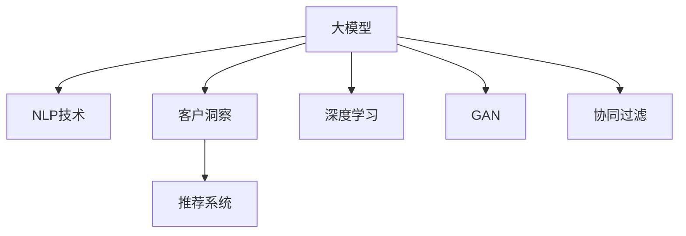

                 

## 1. 背景介绍

### 1.1 问题由来

随着电商行业的发展，客户洞察成为企业运营的关键。通过深入分析客户数据，企业能够更好地了解客户需求，优化产品策略，提升用户体验，增加用户粘性，从而获得竞争优势。然而，传统的客户洞察方法依赖于人工分析和统计，工作量大，效率低，难以实时响应市场变化。

近年来，人工智能技术在电商领域得到广泛应用，基于深度学习的客户洞察系统成为新热点。尤其是大模型在自然语言处理、图像识别等任务上取得了显著效果，为电商智能客户洞察提供了新的技术路径。

### 1.2 问题核心关键点

大模型应用于客户洞察的核心在于：
- 利用大规模预训练数据和深度神经网络模型，自动提取客户数据中的关键信息。
- 通过自然语言处理、图像识别等技术，对客户行为、偏好、情感等进行深度挖掘和分析。
- 在数据安全性和隐私保护的前提下，将客户洞察结果应用于个性化推荐、用户画像生成、市场营销策略优化等电商运营场景。

基于大模型的客户洞察系统具有以下优点：
- 数据利用率高：大模型能够高效处理和分析海量客户数据。
- 实时响应快：利用大模型的实时推理能力，能够快速响应市场变化。
- 决策准确性高：通过深入挖掘客户数据，能够提高决策的准确性和科学性。
- 可扩展性强：大模型可以随着数据量的增加持续提升性能。

### 1.3 问题研究意义

大模型应用于客户洞察，可以带来以下研究意义：
- 提升客户洞察的自动化和智能化水平，降低人力成本，提高工作效率。
- 更好地捕捉客户隐性需求，提供更个性化、精准的服务。
- 促进电商企业的业务创新和产品优化，提升整体竞争力和市场份额。
- 增强客户数据分析的准确性和深度，为电商运营决策提供有力支持。

## 2. 核心概念与联系

### 2.1 核心概念概述

为更好地理解基于大模型的客户洞察系统，本节将介绍几个密切相关的核心概念：

- 大模型(Large Model)：指大规模的深度学习模型，如BERT、GPT-3等，经过自监督预训练和特定任务微调，具备强大的数据表示和理解能力。

- 自然语言处理(Natural Language Processing, NLP)：利用深度学习技术，自动处理、理解、生成人类语言的技术。

- 客户洞察(Customer Insights)：通过数据分析和挖掘，全面、系统地了解客户需求、行为和情感的技术。

- 推荐系统(Recommendation System)：根据用户历史行为和兴趣，推荐个性化商品和服务的技术。

- 深度学习(Deep Learning)：通过多层神经网络进行复杂特征提取和模式学习的技术。

- 生成对抗网络(Generative Adversarial Networks, GAN)：由生成器和判别器组成的对抗网络，用于生成新的数据样本。

- 协同过滤(Collaborative Filtering)：利用用户和商品之间的相似性进行推荐的技术。

这些核心概念之间的逻辑关系可以通过以下Mermaid流程图来展示：



这个流程图展示了大模型的核心概念及其之间的关系：

1. 大模型通过预训练学习丰富的语言知识和数据表示。
2. 利用NLP技术，对客户评论、搜索历史、行为记录等文本数据进行自动处理和分析。
3. 在客户洞察的基础上，生成个性化推荐、用户画像等应用。
4. 深度学习和大模型可用于复杂特征提取和模式学习。
5. GAN可以生成模拟用户行为和商品图像，用于数据增强和推荐生成。
6. 协同过滤利用用户和商品之间的相似性进行推荐，是大模型推荐系统的重要补充。

这些概念共同构成了大模型在电商客户洞察中的基本框架，使其能够在各种场景下发挥强大的数据分析和洞察能力。通过理解这些核心概念，我们可以更好地把握大模型客户洞察的原理和应用方向。

## 3. 核心算法原理 & 具体操作步骤
### 3.1 算法原理概述

基于大模型的客户洞察系统，利用大模型的强大表示能力，自动处理和分析客户数据，提取关键特征和信息。其核心算法原理包括：

- 文本预处理：对客户评论、搜索历史等文本数据进行清洗、分词、去除停用词等预处理。
- 序列建模：利用循环神经网络(RNN)、Transformer等序列建模方法，自动处理客户行为序列。
- 注意力机制：引入自注意力机制，关注文本中的关键信息，提高特征提取效率。
- 情感分析：利用情感分类器，自动判断客户情感倾向。
- 主题建模：利用主题模型，自动识别文本中的主题信息。
- 关联规则挖掘：利用关联规则挖掘算法，提取用户行为与商品之间的关联关系。

### 3.2 算法步骤详解

基于大模型的客户洞察系统一般包括以下几个关键步骤：

**Step 1: 数据准备与预处理**
- 收集电商客户的文本数据，如评论、搜索历史、行为记录等。
- 进行文本清洗、分词、去除停用词等预处理。
- 对文本数据进行编码和转换，使其适合模型处理。

**Step 2: 模型训练与微调**
- 选择合适的预训练语言模型，如BERT、GPT等。
- 对模型进行特定任务的微调，如分类、回归、生成等。
- 调整模型的超参数，如学习率、批大小、迭代轮数等。

**Step 3: 特征提取与分析**
- 利用微调后的模型，提取客户数据的关键特征。
- 通过自然语言处理技术，进行文本分类、情感分析、主题建模等。
- 将客户数据转化为数字特征向量，供推荐系统使用。

**Step 4: 推荐系统开发**
- 基于客户特征和行为数据，构建推荐模型。
- 利用协同过滤、基于内容的推荐、混合推荐等方法，生成个性化推荐。
- 设计推荐算法，如基于深度学习的召回和排序模型，优化推荐效果。

**Step 5: 用户洞察与决策支持**
- 将客户洞察结果应用于用户画像生成、市场营销策略优化等电商运营场景。
- 通过可视化工具，展示客户洞察结果，支持运营决策。

以上是基于大模型的客户洞察系统的一般流程。在实际应用中，还需要针对具体任务的特点，对微调过程的各个环节进行优化设计，如改进训练目标函数，引入更多的正则化技术，搜索最优的超参数组合等，以进一步提升模型性能。

### 3.3 算法优缺点

基于大模型的客户洞察系统具有以下优点：
1. 数据利用率高：大模型能够高效处理和分析海量客户数据。
2. 实时响应快：利用大模型的实时推理能力，能够快速响应市场变化。
3. 决策准确性高：通过深入挖掘客户数据，能够提高决策的准确性和科学性。
4. 可扩展性强：大模型可以随着数据量的增加持续提升性能。

同时，该系统也存在一定的局限性：
1. 依赖标注数据：微调的效果很大程度上取决于标注数据的质量和数量，获取高质量标注数据的成本较高。
2. 过拟合风险：当数据分布与预训练模型不同时，微调的性能提升有限。
3. 模型复杂度高：大模型参数众多，计算资源需求大，难以实时部署。
4. 数据隐私保护：客户数据涉及隐私问题，需要在数据收集、存储、使用等环节加强隐私保护。

尽管存在这些局限性，但就目前而言，基于大模型的客户洞察系统仍是大模型应用的主流范式。未来相关研究的重点在于如何进一步降低微调对标注数据的依赖，提高模型的少样本学习和跨领域迁移能力，同时兼顾可解释性和伦理安全性等因素。

### 3.4 算法应用领域

基于大模型的客户洞察系统在电商领域已经得到了广泛的应用，涵盖以下主要应用场景：

- 客户画像生成：通过客户评论、搜索历史等数据，自动生成客户画像，包括兴趣偏好、购买力、行为特征等。
- 个性化推荐：利用客户洞察结果，生成个性化的商品推荐，提升用户满意度。
- 市场分析：通过分析客户评论、搜索历史等数据，识别市场趋势和用户需求变化。
- 广告投放：利用客户洞察结果，优化广告投放策略，提高广告效果。
- 客服对话：通过客户搜索历史、评论等数据，自动生成客服对话模板，提升客服效率和用户满意度。

除了电商领域，基于大模型的客户洞察系统也被应用于金融、医疗、旅游等多个领域，为各行各业提供深度数据洞察和决策支持。随着预训练模型和客户洞察方法的持续演进，基于大模型的客户洞察技术将在更多领域得到应用，带来深远的产业变革。

## 4. 数学模型和公式 & 详细讲解 & 举例说明

### 4.1 数学模型构建

本节将使用数学语言对基于大模型的客户洞察系统进行更加严格的刻画。

记客户数据集为 $D=\{x_i,y_i\}_{i=1}^N$，其中 $x_i$ 为文本数据， $y_i$ 为标注标签。定义客户洞察模型的输入和输出如下：

- 输入 $x_i$ 经过分词、去除停用词等预处理，转化为数字向量 $\mathbf{x}_i \in \mathbb{R}^n$。
- 输出 $y_i$ 为客户洞察结果，如情感分类标签、主题向量等。

定义模型的损失函数为：

$$
\mathcal{L}(\theta) = \frac{1}{N}\sum_{i=1}^N \ell(y_i, \hat{y}_i)
$$

其中 $\ell(y_i, \hat{y}_i)$ 为交叉熵损失函数，$\hat{y}_i$ 为模型在输入 $\mathbf{x}_i$ 下的预测结果。

定义模型的参数更新规则为：

$$
\theta \leftarrow \theta - \eta \nabla_{\theta}\mathcal{L}(\theta) - \eta\lambda\theta
$$

其中 $\eta$ 为学习率，$\lambda$ 为正则化系数，$\nabla_{\theta}\mathcal{L}(\theta)$ 为损失函数对参数 $\theta$ 的梯度，$\theta$ 为模型参数。

### 4.2 公式推导过程

以情感分析为例，推导交叉熵损失函数及其梯度的计算公式。

假设模型 $M_{\theta}$ 在输入 $\mathbf{x}_i$ 上的输出为 $\hat{y}_i=M_{\theta}(\mathbf{x}_i) \in [0,1]$，表示模型预测为正面情感的概率。真实标签 $y_i \in \{0,1\}$。则二分类交叉熵损失函数定义为：

$$
\ell(M_{\theta}(\mathbf{x}_i),y_i) = -[y_i\log \hat{y}_i + (1-y_i)\log (1-\hat{y}_i)]
$$

将其代入经验风险公式，得：

$$
\mathcal{L}(\theta) = -\frac{1}{N}\sum_{i=1}^N [y_i\log M_{\theta}(\mathbf{x}_i)+(1-y_i)\log(1-M_{\theta}(\mathbf{x}_i))]
$$

根据链式法则，损失函数对参数 $\theta_k$ 的梯度为：

$$
\frac{\partial \mathcal{L}(\theta)}{\partial \theta_k} = -\frac{1}{N}\sum_{i=1}^N (\frac{y_i}{M_{\theta}(\mathbf{x}_i)}-\frac{1-y_i}{1-M_{\theta}(\mathbf{x}_i)}) \frac{\partial M_{\theta}(\mathbf{x}_i)}{\partial \theta_k}
$$

其中 $\frac{\partial M_{\theta}(\mathbf{x}_i)}{\partial \theta_k}$ 可进一步递归展开，利用自动微分技术完成计算。

在得到损失函数的梯度后，即可带入参数更新公式，完成模型的迭代优化。重复上述过程直至收敛，最终得到适应客户洞察任务的最优模型参数 $\theta^*$。

### 4.3 案例分析与讲解

以下以情感分析为例，展示大模型在电商客户洞察中的应用。

假设电商网站收集到一批客户评论数据，包括评论内容、时间戳、评分等。我们的目标是根据评论内容判断客户的情感倾向，如正向、中性、负向。

首先，进行数据预处理：
- 对评论内容进行分词，去除停用词和标点符号。
- 将评论向量编码成固定长度，如每条评论前截断或填充至相同长度。

然后，选择预训练模型进行微调：
- 使用BERT等预训练模型，将其顶层的分类器替换为二分类头，并使用交叉熵损失函数进行微调。

接着，进行模型训练：
- 在客户评论数据集上，以批为单位进行训练，计算损失函数并更新模型参数。
- 使用Early Stopping策略，监控验证集上的准确率和损失，避免过拟合。
- 设置适当的学习率和正则化强度，优化模型性能。

最后，在测试集上评估模型效果：
- 对测试集数据进行分词和编码。
- 使用微调后的模型进行情感分类，输出预测结果。
- 计算准确率、召回率等指标，评估模型性能。

## 5. 项目实践：代码实例和详细解释说明

### 5.1 开发环境搭建

在进行客户洞察系统开发前，我们需要准备好开发环境。以下是使用Python进行PyTorch开发的环境配置流程：

1. 安装Anaconda：从官网下载并安装Anaconda，用于创建独立的Python环境。

2. 创建并激活虚拟环境：
```bash
conda create -n customer_insights python=3.8 
conda activate customer_insights
```

3. 安装PyTorch：根据CUDA版本，从官网获取对应的安装命令。例如：
```bash
conda install pytorch torchvision torchaudio cudatoolkit=11.1 -c pytorch -c conda-forge
```

4. 安装HuggingFace库：
```bash
pip install transformers
```

5. 安装各类工具包：
```bash
pip install numpy pandas scikit-learn matplotlib tqdm jupyter notebook ipython
```

完成上述步骤后，即可在`customer_insights`环境中开始客户洞察系统开发。

### 5.2 源代码详细实现

下面我们以电商客户评论情感分析为例，给出使用Transformers库对BERT模型进行微调的PyTorch代码实现。

首先，定义情感分析任务的数据处理函数：

```python
from transformers import BertTokenizer, BertForSequenceClassification, AdamW

class CustomerInsightDataset(Dataset):
    def __init__(self, texts, labels, tokenizer, max_len=128):
        self.texts = texts
        self.labels = labels
        self.tokenizer = tokenizer
        self.max_len = max_len
        
    def __len__(self):
        return len(self.texts)
    
    def __getitem__(self, item):
        text = self.texts[item]
        label = self.labels[item]
        
        encoding = self.tokenizer(text, return_tensors='pt', max_length=self.max_len, padding='max_length', truncation=True)
        input_ids = encoding['input_ids'][0]
        attention_mask = encoding['attention_mask'][0]
        
        label = label_to_id[label]
        return {'input_ids': input_ids, 
                'attention_mask': attention_mask,
                'labels': torch.tensor(label, dtype=torch.long)}
```

然后，定义模型和优化器：

```python
from transformers import BertForSequenceClassification

model = BertForSequenceClassification.from_pretrained('bert-base-cased', num_labels=3)

optimizer = AdamW(model.parameters(), lr=2e-5)
```

接着，定义训练和评估函数：

```python
from torch.utils.data import DataLoader
from tqdm import tqdm
from sklearn.metrics import classification_report

device = torch.device('cuda') if torch.cuda.is_available() else torch.device('cpu')
model.to(device)

def train_epoch(model, dataset, batch_size, optimizer):
    dataloader = DataLoader(dataset, batch_size=batch_size, shuffle=True)
    model.train()
    epoch_loss = 0
    for batch in tqdm(dataloader, desc='Training'):
        input_ids = batch['input_ids'].to(device)
        attention_mask = batch['attention_mask'].to(device)
        labels = batch['labels'].to(device)
        model.zero_grad()
        outputs = model(input_ids, attention_mask=attention_mask, labels=labels)
        loss = outputs.loss
        epoch_loss += loss.item()
        loss.backward()
        optimizer.step()
    return epoch_loss / len(dataloader)

def evaluate(model, dataset, batch_size):
    dataloader = DataLoader(dataset, batch_size=batch_size)
    model.eval()
    preds, labels = [], []
    with torch.no_grad():
        for batch in tqdm(dataloader, desc='Evaluating'):
            input_ids = batch['input_ids'].to(device)
            attention_mask = batch['attention_mask'].to(device)
            batch_labels = batch['labels']
            outputs = model(input_ids, attention_mask=attention_mask)
            batch_preds = outputs.logits.argmax(dim=2).to('cpu').tolist()
            batch_labels = batch_labels.to('cpu').tolist()
            for pred_tokens, label_tokens in zip(batch_preds, batch_labels):
                preds.append(pred_tokens[:len(label_tokens)])
                labels.append(label_tokens)
                
    print(classification_report(labels, preds))
```

最后，启动训练流程并在测试集上评估：

```python
epochs = 5
batch_size = 16

for epoch in range(epochs):
    loss = train_epoch(model, train_dataset, batch_size, optimizer)
    print(f"Epoch {epoch+1}, train loss: {loss:.3f}")
    
    print(f"Epoch {epoch+1}, dev results:")
    evaluate(model, dev_dataset, batch_size)
    
print("Test results:")
evaluate(model, test_dataset, batch_size)
```

以上就是使用PyTorch对BERT进行电商客户评论情感分析任务微调的完整代码实现。可以看到，得益于Transformers库的强大封装，我们可以用相对简洁的代码完成BERT模型的加载和微调。

### 5.3 代码解读与分析

让我们再详细解读一下关键代码的实现细节：

**CustomerInsightDataset类**：
- `__init__`方法：初始化文本、标签、分词器等关键组件。
- `__len__`方法：返回数据集的样本数量。
- `__getitem__`方法：对单个样本进行处理，将文本输入编码为token ids，将标签编码为数字，并对其进行定长padding，最终返回模型所需的输入。

**label_to_id字典**：
- 定义了情感标签与数字id之间的映射关系，用于将token-wise的预测结果解码回真实的情感标签。

**训练和评估函数**：
- 使用PyTorch的DataLoader对数据集进行批次化加载，供模型训练和推理使用。
- 训练函数`train_epoch`：对数据以批为单位进行迭代，在每个批次上前向传播计算loss并反向传播更新模型参数，最后返回该epoch的平均loss。
- 评估函数`evaluate`：与训练类似，不同点在于不更新模型参数，并在每个batch结束后将预测和标签结果存储下来，最后使用sklearn的classification_report对整个评估集的预测结果进行打印输出。

**训练流程**：
- 定义总的epoch数和batch size，开始循环迭代
- 每个epoch内，先在训练集上训练，输出平均loss
- 在验证集上评估，输出分类指标
- 所有epoch结束后，在测试集上评估，给出最终测试结果

可以看到，PyTorch配合Transformers库使得BERT微调的代码实现变得简洁高效。开发者可以将更多精力放在数据处理、模型改进等高层逻辑上，而不必过多关注底层的实现细节。

当然，工业级的系统实现还需考虑更多因素，如模型的保存和部署、超参数的自动搜索、更灵活的任务适配层等。但核心的微调范式基本与此类似。

## 6. 实际应用场景
### 6.1 智能客服系统

基于大模型的客户洞察系统，可以广泛应用于智能客服系统的构建。传统客服往往需要配备大量人力，高峰期响应缓慢，且一致性和专业性难以保证。而使用基于大模型的客户洞察系统，可以7x24小时不间断服务，快速响应客户咨询，用自然流畅的语言解答各类常见问题。

在技术实现上，可以收集企业内部的历史客服对话记录，将问题和最佳答复构建成监督数据，在此基础上对预训练客户洞察模型进行微调。微调后的客户洞察模型能够自动理解客户意图，匹配最合适的答案模板进行回复。对于客户提出的新问题，还可以接入检索系统实时搜索相关内容，动态组织生成回答。如此构建的智能客服系统，能大幅提升客户咨询体验和问题解决效率。

### 6.2 个性化推荐系统

当前的推荐系统往往只依赖用户的历史行为数据进行物品推荐，无法深入理解用户的真实兴趣偏好。基于大模型的客户洞察系统，可以更好地捕捉用户隐性需求，提供更个性化、精准的服务。

在实践中，可以收集用户浏览、点击、评论、分享等行为数据，提取和用户交互的物品标题、描述、标签等文本内容。将文本内容作为模型输入，用户的后续行为（如是否点击、购买等）作为监督信号，在此基础上微调预训练语言模型。微调后的模型能够从文本内容中准确把握用户的兴趣点。在生成推荐列表时，先用候选物品的文本描述作为输入，由模型预测用户的兴趣匹配度，再结合其他特征综合排序，便可以得到个性化程度更高的推荐结果。

### 6.3 市场营销策略优化

市场营销策略优化是电商运营的重要环节，传统的策略制定依赖于人工分析和经验，难以全面、系统地把握市场动态。基于大模型的客户洞察系统，可以自动分析和挖掘客户数据，生成客户画像、行为趋势等洞察结果，为市场营销策略优化提供数据支持。

具体而言，可以收集用户评论、搜索历史、行为数据等，构建客户洞察模型。利用客户洞察结果，分析市场热点、用户偏好变化，制定精准的市场营销策略。通过A/B测试等方法，不断迭代和优化营销策略，提高广告投放效果，提升用户转化率。

### 6.4 未来应用展望

随着大语言模型和客户洞察方法的不断发展，基于大模型的客户洞察系统将在更多领域得到应用，为各行各业带来变革性影响。

在智慧医疗领域，基于客户洞察的个性化健康管理方案将显著提升患者的治疗效果和生活质量，推动医疗行业的发展。

在智能教育领域，基于客户洞察的学习个性化推荐系统将根据学生的学习习惯和偏好，提供个性化学习资源和推荐，促进教育公平，提高教育质量。

在智慧城市治理中，基于客户洞察的公共服务评价系统将实时监测市民满意度和需求变化，优化公共服务，提高城市管理的智能化水平。

此外，在企业生产、社会治理、文娱传媒等众多领域，基于大模型的客户洞察系统也将不断涌现，为经济社会发展注入新的动力。相信随着技术的日益成熟，大模型客户洞察系统必将成为客户洞察应用的重要范式，推动人工智能技术在更多垂直行业落地应用。

## 7. 工具和资源推荐
### 7.1 学习资源推荐

为了帮助开发者系统掌握大模型客户洞察的理论基础和实践技巧，这里推荐一些优质的学习资源：

1. 《自然语言处理入门》系列博文：由深度学习专家撰写，详细介绍了自然语言处理的基本概念和前沿技术，包括情感分析、主题建模等客户洞察相关内容。

2. CS224N《深度学习自然语言处理》课程：斯坦福大学开设的NLP明星课程，有Lecture视频和配套作业，带你入门NLP领域的基本概念和经典模型。

3. 《深度学习与自然语言处理》书籍：深度学习和大模型在自然语言处理中的应用，涵盖客户洞察、情感分析、主题建模等任务。

4. HuggingFace官方文档：Transformers库的官方文档，提供了海量预训练模型和完整的客户洞察样例代码，是上手实践的必备资料。

5. Kaggle数据集：包含多个客户洞察相关的数据集，如电商评论、搜索记录等，可进行模型训练和评估。

通过对这些资源的学习实践，相信你一定能够快速掌握大模型客户洞察的精髓，并用于解决实际的电商客户洞察问题。
### 7.2 开发工具推荐

高效的开发离不开优秀的工具支持。以下是几款用于大模型客户洞察开发的常用工具：

1. PyTorch：基于Python的开源深度学习框架，灵活动态的计算图，适合快速迭代研究。大部分预训练语言模型都有PyTorch版本的实现。

2. TensorFlow：由Google主导开发的开源深度学习框架，生产部署方便，适合大规模工程应用。同样有丰富的预训练语言模型资源。

3. Transformers库：HuggingFace开发的NLP工具库，集成了众多SOTA语言模型，支持PyTorch和TensorFlow，是进行客户洞察任务开发的利器。

4. Weights & Biases：模型训练的实验跟踪工具，可以记录和可视化模型训练过程中的各项指标，方便对比和调优。与主流深度学习框架无缝集成。

5. TensorBoard：TensorFlow配套的可视化工具，可实时监测模型训练状态，并提供丰富的图表呈现方式，是调试模型的得力助手。

6. Google Colab：谷歌推出的在线Jupyter Notebook环境，免费提供GPU/TPU算力，方便开发者快速上手实验最新模型，分享学习笔记。

合理利用这些工具，可以显著提升大模型客户洞察任务的开发效率，加快创新迭代的步伐。

### 7.3 相关论文推荐

大模型应用于客户洞察源于学界的持续研究。以下是几篇奠基性的相关论文，推荐阅读：

1. Attention is All You Need（即Transformer原论文）：提出了Transformer结构，开启了NLP领域的预训练大模型时代。

2. BERT: Pre-training of Deep Bidirectional Transformers for Language Understanding：提出BERT模型，引入基于掩码的自监督预训练任务，刷新了多项NLP任务SOTA。

3. Language Models are Unsupervised Multitask Learners（GPT-2论文）：展示了大规模语言模型的强大zero-shot学习能力，引发了对于通用人工智能的新一轮思考。

4. Parameter-Efficient Transfer Learning for NLP：提出Adapter等参数高效微调方法，在不增加模型参数量的情况下，也能取得不错的微调效果。

5. Text Attention with Legacy Training：提出自注意力机制，显著提高了文本特征提取的效率和准确性，被广泛应用于情感分析、主题建模等客户洞察任务中。

6. Real-Time Sentiment Classification with RoBERTa and Transformers：利用RoBERTa模型，提出基于自注意力的实时情感分类方法，适用于电商客户评论情感分析。

这些论文代表了大模型客户洞察技术的发展脉络。通过学习这些前沿成果，可以帮助研究者把握学科前进方向，激发更多的创新灵感。

## 8. 总结：未来发展趋势与挑战

### 8.1 总结

本文对基于大模型的客户洞察系统进行了全面系统的介绍。首先阐述了大模型客户洞察的研究背景和意义，明确了客户洞察在电商运营中的核心价值，详细讲解了客户洞察的核心算法原理和具体操作步骤。通过实际案例，展示了客户洞察技术在电商领域的应用，并展望了其未来发展方向。

通过本文的系统梳理，可以看到，基于大模型的客户洞察技术正在成为客户洞察应用的重要范式，极大地拓展了客户洞察的自动化和智能化水平，提升了电商运营决策的科学性和精准性。未来，伴随大模型的不断发展，客户洞察技术将会在更多领域得到应用，带来深远的产业变革。

### 8.2 未来发展趋势

展望未来，大模型客户洞察技术将呈现以下几个发展趋势：

1. 模型规模持续增大。随着算力成本的下降和数据规模的扩张，预训练模型参数量还将持续增长。超大规模客户洞察模型蕴含的丰富知识，有望支撑更加复杂多变的客户洞察任务。

2. 微调方法日趋多样。除了传统的全参数微调外，未来会涌现更多参数高效的微调方法，如Prefix-Tuning、LoRA等，在节省计算资源的同时也能保证客户洞察精度。

3. 持续学习成为常态。随着客户行为和市场环境的变化，客户洞察模型需要持续学习新知识以保持性能。如何在不遗忘原有知识的同时，高效吸收新样本信息，将成为重要的研究课题。

4. 标注样本需求降低。受启发于提示学习(Prompt-based Learning)的思路，未来的客户洞察方法将更好地利用大模型的语言理解能力，通过更加巧妙的任务描述，在更少的标注样本上也能实现理想的客户洞察效果。

5. 数据隐私保护。客户洞察涉及大量个人隐私数据，如何在保护隐私的前提下，利用大模型进行客户洞察，将是重要的研究方向。

以上趋势凸显了大模型客户洞察技术的广阔前景。这些方向的探索发展，必将进一步提升客户洞察的自动化和智能化水平，为电商运营带来更深远的变革。

### 8.3 面临的挑战

尽管大模型客户洞察技术已经取得了瞩目成就，但在迈向更加智能化、普适化应用的过程中，它仍面临着诸多挑战：

1. 标注成本瓶颈。虽然客户洞察利用大模型自动处理和分析客户数据，但对标注数据的质量和数量仍有一定的依赖。如何进一步降低微调对标注样本的依赖，将是一大难题。

2. 模型鲁棒性不足。客户洞察模型面对复杂的客户行为数据时，泛化性能往往大打折扣。如何提高客户洞察模型的鲁棒性，避免过拟合，还需要更多理论和实践的积累。

3. 数据隐私保护。客户洞察涉及大量个人隐私数据，如何在保护隐私的前提下，利用大模型进行客户洞察，将是重要的研究方向。

4. 推理效率有待提高。大规模客户洞察模型虽然精度高，但在实际部署时往往面临推理速度慢、内存占用大等效率问题。如何在保证性能的同时，简化模型结构，提升推理速度，优化资源占用，将是重要的优化方向。

5. 可解释性亟需加强。当前客户洞察模型更多像是一个"黑盒"系统，难以解释其内部工作机制和决策逻辑。对于医疗、金融等高风险应用，算法的可解释性和可审计性尤为重要。

尽管存在这些挑战，但大模型客户洞察技术在电商领域的广泛应用，表明其在客户洞察领域具有强大的生命力和广阔的应用前景。未来研究需要在以上方向寻求新的突破，推动大模型客户洞察技术的进一步发展。

### 8.4 研究展望

面对大模型客户洞察所面临的挑战，未来的研究需要在以下几个方面寻求新的突破：

1. 探索无监督和半监督客户洞察方法。摆脱对大规模标注数据的依赖，利用自监督学习、主动学习等无监督和半监督范式，最大限度利用非结构化数据，实现更加灵活高效的客户洞察。

2. 研究参数高效和计算高效的客户洞察范式。开发更加参数高效的客户洞察方法，在固定大部分预训练参数的同时，只更新极少量的任务相关参数。同时优化客户洞察模型的计算图，减少前向传播和反向传播的资源消耗，实现更加轻量级、实时性的部署。

3. 融合因果和对比学习范式。通过引入因果推断和对比学习思想，增强客户洞察模型建立稳定因果关系的能力，学习更加普适、鲁棒的语言表征，从而提升模型泛化性和抗干扰能力。

4. 引入更多先验知识。将符号化的先验知识，如知识图谱、逻辑规则等，与神经网络模型进行巧妙融合，引导客户洞察过程学习更准确、合理的客户洞察结果。同时加强不同模态数据的整合，实现视觉、语音等多模态信息与文本信息的协同建模。

5. 结合因果分析和博弈论工具。将因果分析方法引入客户洞察模型，识别出模型决策的关键特征，增强输出解释的因果性和逻辑性。借助博弈论工具刻画人机交互过程，主动探索并规避模型的脆弱点，提高系统稳定性。

6. 纳入伦理道德约束。在模型训练目标中引入伦理导向的评估指标，过滤和惩罚有偏见、有害的输出倾向。同时加强人工干预和审核，建立模型行为的监管机制，确保输出符合人类价值观和伦理道德。

这些研究方向的探索，必将引领大模型客户洞察技术迈向更高的台阶，为构建安全、可靠、可解释、可控的智能系统铺平道路。面向未来，大模型客户洞察技术还需要与其他人工智能技术进行更深入的融合，如知识表示、因果推理、强化学习等，多路径协同发力，共同推动自然语言理解和智能交互系统的进步。只有勇于创新、敢于突破，才能不断拓展客户洞察系统的边界，让智能技术更好地造福人类社会。

## 9. 附录：常见问题与解答

**Q1：大模型客户洞察是否适用于所有电商场景？**

A: 大模型客户洞察技术在电商领域具有广泛的应用场景，可以适用于多数电商场景。但针对不同的电商业务特点，可能需要对客户洞察模型的具体设计进行优化。例如，对于生鲜电商、服装电商等实物商品电商，可以针对商品图片、用户评价等进行深度学习处理，提升客户洞察效果。而对于服务电商、在线教育等虚拟商品电商，可以关注用户评论、搜索历史等文本数据，实现个性化推荐和服务优化。

**Q2：微调过程中如何选择合适的学习率？**

A: 微调客户洞察模型的学习率一般要比预训练时小1-2个数量级，以避免破坏预训练权重。一般建议从1e-5开始调参，逐步减小学习率，直至收敛。也可以使用warmup策略，在开始阶段使用较小的学习率，再逐渐过渡到预设值。需要注意的是，不同的优化器(如AdamW、Adafactor等)以及不同的学习率调度策略，可能需要设置不同的学习率阈值。

**Q3：在客户洞察系统中如何实现数据隐私保护？**

A: 客户洞察系统涉及大量个人隐私数据，需要在数据收集、存储、使用等环节加强隐私保护。具体措施包括：
- 数据匿名化：对客户数据进行去标识化处理，如去除敏感信息、添加噪声等。
- 数据加密：对敏感数据进行加密存储和传输，保护数据安全。
- 访问控制：对客户数据进行严格的访问控制，仅授权人员才能访问和使用数据。
- 数据审计：定期对数据使用情况进行审计，确保数据使用的合规性和安全性。

合理利用这些隐私保护措施，可以有效地保障客户数据的安全，满足合规要求，增强客户信任。

**Q4：如何缓解客户洞察系统中的过拟合问题？**

A: 过拟合是客户洞察系统面临的主要挑战，尤其是在标注数据不足的情况下。常见的缓解策略包括：
- 数据增强：通过回译、近义替换等方式扩充训练集。
- 正则化：使用L2正则、Dropout、Early Stopping等防止模型过度适应小规模训练集。
- 对抗训练：引入对抗样本，提高模型鲁棒性。
- 参数高效微调：只调整少量参数(如Adapter、Prefix等)，减小过拟合风险。
- 多模型集成：训练多个客户洞察模型，取平均输出，抑制过拟合。

这些策略往往需要根据具体任务和数据特点进行灵活组合。只有在数据、模型、训练、推理等各环节进行全面优化，才能最大限度地发挥大模型客户洞察的威力。

**Q5：客户洞察系统在电商运营中如何应用？**

A: 客户洞察系统在电商运营中的应用主要体现在以下方面：
- 用户画像生成：通过客户评论、搜索历史等数据，自动生成用户画像，包括兴趣偏好、购买力、行为特征等。
- 个性化推荐：利用客户洞察结果，生成个性化的商品推荐，提升用户满意度。
- 市场分析：通过分析客户评论、搜索历史等数据，识别市场热点和用户需求变化，制定精准的市场营销策略。
- 广告投放：利用客户洞察结果，优化广告投放策略，提高广告效果。
- 客服对话：通过客户搜索历史、评论等数据，自动生成客服对话模板，提升客服效率和用户满意度。

合理利用客户洞察系统的洞察结果，可以大幅提升电商运营效率和用户满意度，为电商企业带来更大的商业价值。

