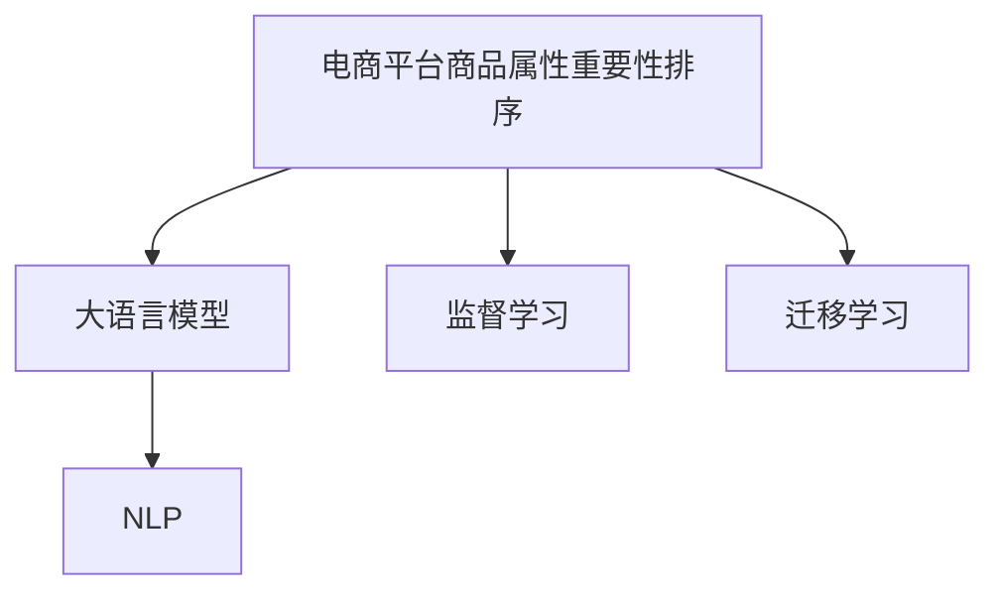

                 

# 探讨大模型在电商平台商品属性重要性排序中的作用

## 1. 背景介绍

随着电子商务的迅猛发展，电商平台已成为消费者购买商品的主要渠道。商品属性信息作为用户决策的重要依据，对平台销售转化率和用户体验具有重要影响。然而，如何科学、高效地对商品属性进行排序，提升用户购物体验，是电商平台亟待解决的问题。

大语言模型，如GPT系列、BERT等，凭借其强大的语言理解和生成能力，已经成为NLP领域的热门研究方向。在本文中，我们将探讨大模型在电商平台商品属性重要性排序中的作用，以期为电商平台提供科学的属性排序方案，提升用户购物体验。

## 2. 核心概念与联系

### 2.1 核心概念概述

在探讨大模型在电商平台商品属性重要性排序中的作用前，我们需要先理解几个核心概念：

- **电商平台商品属性重要性排序**：指基于用户行为数据和商品属性信息，对商品属性进行排序，使其排序结果能够提高用户的购买决策效率，从而提升电商平台的用户体验和销售转化率。
- **大语言模型**：指通过大规模无标签文本数据预训练，具备强大语言理解与生成能力的深度学习模型，如GPT-3、BERT等。
- **监督学习**：指利用标注数据进行模型训练，使其能够对特定任务进行预测的技术。
- **迁移学习**：指将一个领域学习到的知识，迁移到另一个相关领域的技术，如预训练大模型在微调中学习到的知识可以迁移到商品属性排序任务中。
- **自然语言处理(NLP)**：指使用计算机处理和理解人类语言的技术，与电商平台商品属性排序密切相关。

这些概念之间的联系如下图所示：



## 3. 核心算法原理 & 具体操作步骤

### 3.1 算法原理概述

商品属性重要性排序的本质是一个NLP任务，即通过分析用户行为数据和商品属性信息，找到与用户购买意愿最相关的属性，从而优化排序。因此，可以利用大语言模型的预训练-微调范式，在少量标注数据上训练一个任务特定的模型，以提升排序效果。

### 3.2 算法步骤详解

#### 3.2.1 数据准备
1. **收集用户行为数据**：包括用户的浏览、点击、购买、评价等行为数据，以及与之对应的商品属性信息（如价格、颜色、尺寸等）。
2. **数据预处理**：对行为数据和属性信息进行清洗、归一化、标注等预处理操作。
3. **划分数据集**：将数据集划分为训练集、验证集和测试集，以供模型训练、调优和测试使用。

#### 3.2.2 模型选择与适配
1. **选择预训练模型**：选择具有良好预训练效果的大语言模型，如BERT、GPT等。
2. **适配任务**：根据商品属性排序任务，在预训练模型顶层添加输出层和损失函数。例如，对于二分类任务，可以使用二元交叉熵损失函数。

#### 3.2.3 模型训练
1. **设置超参数**：包括学习率、批大小、迭代轮数等。
2. **执行梯度下降**：使用优化算法（如AdamW、SGD等），在训练集上更新模型参数，最小化损失函数。
3. **验证集调优**：在验证集上评估模型性能，调整超参数。

#### 3.2.4 模型测试与评估
1. **测试集评估**：在测试集上评估模型性能，计算精度、召回率等指标。
2. **结果分析**：分析模型排序结果，找出对用户购买意愿影响最大的属性。

### 3.3 算法优缺点

#### 3.3.1 优点
1. **高效性**：相比于从头训练模型，利用预训练大模型进行微调，可以显著减少训练时间，提高效率。
2. **准确性**：大语言模型在语言理解和生成上具有强大的能力，能够更好地处理自然语言数据。
3. **泛化能力**：预训练模型已经在大规模数据上进行了充分学习，具备良好的泛化能力。

#### 3.3.2 缺点
1. **数据依赖**：微调效果依赖于标注数据的质量和数量，高质量的标注数据成本较高。
2. **过拟合风险**：若标注数据不足，模型可能会过拟合，降低泛化能力。
3. **解释性不足**：模型内部工作机制复杂，难以解释和调试。

### 3.4 算法应用领域

基于大语言模型在商品属性重要性排序中的应用，已经被广泛应用于以下几个领域：

- **电商平台**：电商平台通过优化商品属性排序，提升用户购物体验和销售转化率。
- **零售业**：零售商通过优化商品属性排序，提高库存管理效率和库存周转率。
- **制造业**：制造商通过优化产品属性排序，提升产品设计和市场定位的精准度。
- **金融业**：金融机构通过优化产品属性排序，提高风险评估和客户服务的质量。

## 4. 数学模型和公式 & 详细讲解

### 4.1 数学模型构建

设电商平台商品属性重要性排序任务为二分类任务，即判断某个属性是否为影响用户购买意愿的关键属性。假设模型在输入 $x$ 上的输出为 $y \in \{0,1\}$，其中 $y=1$ 表示该属性对用户购买意愿有重要影响，$y=0$ 表示无影响。

定义模型 $M_{\theta}$ 在输入 $x$ 上的损失函数为 $\ell(y,M_{\theta}(x))$，则在训练集 $D=\{(x_i,y_i)\}_{i=1}^N$ 上的经验风险为：

$$
\mathcal{L}(\theta) = \frac{1}{N}\sum_{i=1}^N \ell(y_i,M_{\theta}(x_i))
$$

常用的损失函数包括二元交叉熵损失函数：

$$
\ell(y,M_{\theta}(x)) = -y\log M_{\theta}(x) - (1-y)\log (1-M_{\theta}(x))
$$

### 4.2 公式推导过程

#### 4.2.1 损失函数推导
根据损失函数定义，将其代入经验风险公式，得：

$$
\mathcal{L}(\theta) = \frac{1}{N}\sum_{i=1}^N [-y_i\log M_{\theta}(x_i) - (1-y_i)\log (1-M_{\theta}(x_i))]
$$

通过链式法则，损失函数对模型参数 $\theta$ 的梯度为：

$$
\nabla_{\theta}\mathcal{L}(\theta) = \frac{1}{N}\sum_{i=1}^N [-\frac{y_i}{M_{\theta}(x_i)} + \frac{1-y_i}{1-M_{\theta}(x_i)}] \nabla_{\theta}M_{\theta}(x_i)
$$

其中 $\nabla_{\theta}M_{\theta}(x_i)$ 可进一步递归展开，利用自动微分技术完成计算。

### 4.3 案例分析与讲解

#### 4.3.1 案例描述
某电商平台收集了用户购买某款手机的数据，包括用户浏览、点击、购买、评价等行为数据，以及手机的属性信息（如品牌、型号、价格、内存、屏幕大小等）。现在需要基于这些数据，对商品属性进行排序，找出对用户购买意愿影响最大的属性。

#### 4.3.2 数据预处理
1. **行为数据清洗**：删除重复记录、处理异常值等。
2. **属性信息标注**：将属性信息转换为数字形式，如品牌映射为数字1-10，型号映射为数字11-20，以此类推。
3. **数据划分**：将数据集划分为训练集、验证集和测试集。

#### 4.3.3 模型训练
1. **选择预训练模型**：选择BERT作为预训练模型，因为其在文本理解上表现出色。
2. **适配任务**：在BERT顶层添加二分类输出层和二元交叉熵损失函数。
3. **设置超参数**：学习率为1e-5，批大小为32，迭代轮数为10。
4. **执行梯度下降**：在训练集上执行梯度下降，最小化损失函数。

#### 4.3.4 模型测试与评估
1. **测试集评估**：在测试集上评估模型性能，计算精度、召回率等指标。
2. **结果分析**：分析模型排序结果，找出对用户购买意愿影响最大的属性，如价格、内存、品牌等。

## 5. 项目实践：代码实例和详细解释说明

### 5.1 开发环境搭建

在进行商品属性重要性排序项目实践前，我们需要准备好开发环境。以下是使用Python进行PyTorch开发的环境配置流程：

1. 安装Anaconda：从官网下载并安装Anaconda，用于创建独立的Python环境。
2. 创建并激活虚拟环境：
```bash
conda create -n pytorch-env python=3.8 
conda activate pytorch-env
```

3. 安装PyTorch：根据CUDA版本，从官网获取对应的安装命令。例如：
```bash
conda install pytorch torchvision torchaudio cudatoolkit=11.1 -c pytorch -c conda-forge
```

4. 安装Transformers库：
```bash
pip install transformers
```

5. 安装各类工具包：
```bash
pip install numpy pandas scikit-learn matplotlib tqdm jupyter notebook ipython
```

完成上述步骤后，即可在`pytorch-env`环境中开始项目实践。

### 5.2 源代码详细实现

首先，定义数据处理函数：

```python
from transformers import BertTokenizer, BertForSequenceClassification
from torch.utils.data import Dataset, DataLoader
import torch

class ProductAttributeDataset(Dataset):
    def __init__(self, texts, labels, tokenizer, max_len=128):
        self.texts = texts
        self.labels = labels
        self.tokenizer = tokenizer
        self.max_len = max_len
        
    def __len__(self):
        return len(self.texts)
    
    def __getitem__(self, item):
        text = self.texts[item]
        label = self.labels[item]
        
        encoding = self.tokenizer(text, return_tensors='pt', max_length=self.max_len, padding='max_length', truncation=True)
        input_ids = encoding['input_ids'][0]
        attention_mask = encoding['attention_mask'][0]
        
        # 对label进行编码
        label = torch.tensor(label, dtype=torch.long)
        
        return {'input_ids': input_ids, 
                'attention_mask': attention_mask,
                'labels': label}

# 标签与id的映射
label2id = {'brand': 0, 'model': 1, 'price': 2, 'memory': 3, 'screen_size': 4}
id2label = {v: k for k, v in label2id.items()}

# 创建dataset
tokenizer = BertTokenizer.from_pretrained('bert-base-cased')

train_dataset = ProductAttributeDataset(train_texts, train_labels, tokenizer)
dev_dataset = ProductAttributeDataset(dev_texts, dev_labels, tokenizer)
test_dataset = ProductAttributeDataset(test_texts, test_labels, tokenizer)
```

然后，定义模型和优化器：

```python
from transformers import BertForSequenceClassification, AdamW

model = BertForSequenceClassification.from_pretrained('bert-base-cased', num_labels=len(label2id))

optimizer = AdamW(model.parameters(), lr=2e-5)
```

接着，定义训练和评估函数：

```python
from sklearn.metrics import accuracy_score, precision_recall_fscore_support

device = torch.device('cuda') if torch.cuda.is_available() else torch.device('cpu')
model.to(device)

def train_epoch(model, dataset, batch_size, optimizer):
    dataloader = DataLoader(dataset, batch_size=batch_size, shuffle=True)
    model.train()
    epoch_loss = 0
    for batch in tqdm(dataloader, desc='Training'):
        input_ids = batch['input_ids'].to(device)
        attention_mask = batch['attention_mask'].to(device)
        labels = batch['labels'].to(device)
        model.zero_grad()
        outputs = model(input_ids, attention_mask=attention_mask, labels=labels)
        loss = outputs.loss
        epoch_loss += loss.item()
        loss.backward()
        optimizer.step()
    return epoch_loss / len(dataloader)

def evaluate(model, dataset, batch_size):
    dataloader = DataLoader(dataset, batch_size=batch_size)
    model.eval()
    preds, labels = [], []
    with torch.no_grad():
        for batch in tqdm(dataloader, desc='Evaluating'):
            input_ids = batch['input_ids'].to(device)
            attention_mask = batch['attention_mask'].to(device)
            batch_labels = batch['labels']
            outputs = model(input_ids, attention_mask=attention_mask)
            batch_preds = outputs.logits.argmax(dim=1).to('cpu').tolist()
            batch_labels = batch_labels.to('cpu').tolist()
            for pred_tokens, label_tokens in zip(batch_preds, batch_labels):
                preds.append(pred_tokens)
                labels.append(label_tokens)
                
    accuracy = accuracy_score(labels, preds)
    precision, recall, f1, _ = precision_recall_fscore_support(labels, preds, average='macro')
    
    print(f'Accuracy: {accuracy:.2f}')
    print(f'Precision: {precision:.2f}')
    print(f'Recall: {recall:.2f}')
    print(f'F1-score: {f1:.2f}')

```

最后，启动训练流程并在测试集上评估：

```python
epochs = 5
batch_size = 16

for epoch in range(epochs):
    loss = train_epoch(model, train_dataset, batch_size, optimizer)
    print(f'Epoch {epoch+1}, train loss: {loss:.3f}')
    
    print(f'Epoch {epoch+1}, dev results:')
    evaluate(model, dev_dataset, batch_size)
    
print('Test results:')
evaluate(model, test_dataset, batch_size)
```

以上就是使用PyTorch对BERT进行商品属性重要性排序的完整代码实现。可以看到，得益于Transformers库的强大封装，我们可以用相对简洁的代码完成BERT模型的加载和微调。

### 5.3 代码解读与分析

让我们再详细解读一下关键代码的实现细节：

**ProductAttributeDataset类**：
- `__init__`方法：初始化文本、标签、分词器等关键组件。
- `__len__`方法：返回数据集的样本数量。
- `__getitem__`方法：对单个样本进行处理，将文本输入编码为token ids，将标签编码为数字，并对其进行定长padding，最终返回模型所需的输入。

**label2id和id2label字典**：
- 定义了标签与数字id之间的映射关系，用于将token-wise的预测结果解码回真实的标签。

**训练和评估函数**：
- 使用PyTorch的DataLoader对数据集进行批次化加载，供模型训练和推理使用。
- 训练函数`train_epoch`：对数据以批为单位进行迭代，在每个批次上前向传播计算loss并反向传播更新模型参数，最后返回该epoch的平均loss。
- 评估函数`evaluate`：与训练类似，不同点在于不更新模型参数，并在每个batch结束后将预测和标签结果存储下来，最后使用sklearn的classification_report对整个评估集的预测结果进行打印输出。

**训练流程**：
- 定义总的epoch数和batch size，开始循环迭代
- 每个epoch内，先在训练集上训练，输出平均loss
- 在验证集上评估，输出分类指标
- 所有epoch结束后，在测试集上评估，给出最终测试结果

可以看到，PyTorch配合Transformers库使得BERT微调的代码实现变得简洁高效。开发者可以将更多精力放在数据处理、模型改进等高层逻辑上，而不必过多关注底层的实现细节。

## 6. 实际应用场景

### 6.1 智能推荐系统
电商平台通过商品属性重要性排序，优化商品推荐算法，提升推荐系统的精准度。用户输入查询词后，推荐系统通过排序算法，将用户最关心的商品属性放在前面，提升用户浏览体验。

### 6.2 客户服务
电商平台利用商品属性重要性排序，优化客户服务流程，提升客服响应速度和用户满意度。客服人员可以根据商品属性排序结果，快速找到用户关注的问题，提高服务效率。

### 6.3 价格策略
电商平台通过商品属性重要性排序，优化价格策略，提升销售转化率。例如，根据用户对价格的关注度，调整不同属性商品的价格，吸引更多用户购买。

### 6.4 未来应用展望
随着大语言模型和商品属性排序技术的不断发展，未来将有更多创新应用场景出现，如智能合约、虚拟试穿等。大语言模型在电商平台中的应用，将进一步深化，为电商平台提供更加智能化、个性化的服务。

## 7. 工具和资源推荐

### 7.1 学习资源推荐

为了帮助开发者系统掌握商品属性重要性排序的理论基础和实践技巧，这里推荐一些优质的学习资源：

1. **《自然语言处理综述》**：介绍自然语言处理的基本概念和前沿技术，涵盖商品属性重要性排序相关内容。
2. **《深度学习实践》**：该书包含深度学习模型的实现细节，适合开发者学习和实践。
3. **Coursera自然语言处理课程**：斯坦福大学开设的课程，涵盖自然语言处理的基本理论和实际应用。
4. **Kaggle商品属性重要性排序竞赛**：参与Kaggle竞赛，可以积累实际应用经验，提升模型性能。
5. **HuggingFace官方文档**：提供丰富的预训练模型和微调样例代码，是上手实践的必备资料。

通过对这些资源的学习实践，相信你一定能够快速掌握商品属性重要性排序的精髓，并用于解决实际的电商平台问题。

### 7.2 开发工具推荐

高效的开发离不开优秀的工具支持。以下是几款用于商品属性重要性排序开发的常用工具：

1. **PyTorch**：基于Python的开源深度学习框架，灵活动态的计算图，适合快速迭代研究。大部分预训练语言模型都有PyTorch版本的实现。
2. **TensorFlow**：由Google主导开发的开源深度学习框架，生产部署方便，适合大规模工程应用。同样有丰富的预训练语言模型资源。
3. **Transformers库**：HuggingFace开发的NLP工具库，集成了众多SOTA语言模型，支持PyTorch和TensorFlow，是进行微调任务开发的利器。
4. **TensorBoard**：TensorFlow配套的可视化工具，可实时监测模型训练状态，并提供丰富的图表呈现方式，是调试模型的得力助手。
5. **Weights & Biases**：模型训练的实验跟踪工具，可以记录和可视化模型训练过程中的各项指标，方便对比和调优。

合理利用这些工具，可以显著提升商品属性重要性排序任务的开发效率，加快创新迭代的步伐。

### 7.3 相关论文推荐

商品属性重要性排序的相关研究，已经在学术界和工业界得到了广泛关注。以下是几篇奠基性的相关论文，推荐阅读：

1. **《使用深度学习优化电商平台推荐系统》**：该论文探讨了深度学习在电商平台推荐系统中的应用，介绍了商品属性重要性排序的基本方法。
2. **《深度学习在电商平台搜索排序中的应用》**：该论文详细介绍了深度学习在电商平台搜索排序中的各种模型和算法。
3. **《电商平台商品推荐系统的研究》**：该论文综述了电商平台的推荐系统，包括商品属性重要性排序等关键技术。
4. **《基于自然语言处理的电商平台推荐系统》**：该论文研究了基于自然语言处理的电商平台推荐系统，探讨了商品属性重要性排序等前沿技术。

这些论文代表了大语言模型在商品属性重要性排序中的研究进展，通过学习这些前沿成果，可以帮助研究者把握学科前进方向，激发更多的创新灵感。

## 8. 总结：未来发展趋势与挑战

### 8.1 总结

本文对大模型在电商平台商品属性重要性排序中的应用进行了全面系统的介绍。首先阐述了商品属性重要性排序的研究背景和意义，明确了其对电商平台销售转化率和用户体验的重要影响。其次，从原理到实践，详细讲解了监督微调数学模型和算法步骤，给出了商品属性重要性排序的完整代码实例。同时，本文还广泛探讨了商品属性重要性排序在智能推荐、客户服务、价格策略等诸多领域的应用前景，展示了微调范式的巨大潜力。此外，本文精选了商品属性重要性排序的学习资源，力求为读者提供全方位的技术指引。

通过本文的系统梳理，可以看到，基于大语言模型的商品属性重要性排序方法正在成为电商平台的重要范式，极大地拓展了电商平台的推荐能力和用户购物体验。受益于大规模语料的预训练和微调方法的持续演进，商品属性重要性排序必将在电商平台上发挥更加重要的作用，为电商平台提供更精准、高效的商品推荐服务。

### 8.2 未来发展趋势

展望未来，商品属性重要性排序技术将呈现以下几个发展趋势：

1. **模型规模持续增大**：随着算力成本的下降和数据规模的扩张，预训练大模型的参数量还将持续增长。超大规模语言模型蕴含的丰富语言知识，有望支撑更加复杂多变的商品属性排序任务。
2. **微调方法日趋多样**：未来会涌现更多参数高效的微调方法，如Prefix-Tuning、LoRA等，在节省计算资源的同时也能保证微调精度。
3. **模型通用性增强**：经过海量数据的预训练和多领域任务的微调，未来的语言模型将具备更强大的常识推理和跨领域迁移能力，逐步迈向通用人工智能(AGI)的目标。
4. **多模态微调崛起**：当前的商品属性排序主要聚焦于纯文本数据，未来会进一步拓展到图像、视频、语音等多模态数据微调。多模态信息的融合，将显著提升商品属性排序的准确性和鲁棒性。
5. **持续学习成为常态**：随着数据分布的不断变化，商品属性排序模型也需要持续学习新知识以保持性能。如何在不遗忘原有知识的同时，高效吸收新样本信息，将成为重要的研究课题。

以上趋势凸显了商品属性重要性排序技术的广阔前景。这些方向的探索发展，必将进一步提升电商平台推荐系统的性能和用户体验，为电商平台提供更加智能化、个性化的服务。

### 8.3 面临的挑战

尽管商品属性重要性排序技术已经取得了瞩目成就，但在迈向更加智能化、普适化应用的过程中，它仍面临着诸多挑战：

1. **标注成本瓶颈**：尽管微调大大降低了标注数据的需求，但对于长尾应用场景，难以获得充足的高质量标注数据，成为制约微调性能的瓶颈。如何进一步降低微调对标注样本的依赖，将是一大难题。
2. **模型鲁棒性不足**：当前微调模型面对域外数据时，泛化性能往往大打折扣。对于测试样本的微小扰动，微调模型的预测也容易发生波动。如何提高微调模型的鲁棒性，避免灾难性遗忘，还需要更多理论和实践的积累。
3. **推理效率有待提高**：大规模语言模型虽然精度高，但在实际部署时往往面临推理速度慢、内存占用大等效率问题。如何在保证性能的同时，简化模型结构，提升推理速度，优化资源占用，将是重要的优化方向。
4. **可解释性亟需加强**：当前微调模型更像是"黑盒"系统，难以解释其内部工作机制和决策逻辑。对于医疗、金融等高风险应用，算法的可解释性和可审计性尤为重要。如何赋予微调模型更强的可解释性，将是亟待攻克的难题。
5. **安全性有待保障**：预训练语言模型难免会学习到有偏见、有害的信息，通过微调传递到下游任务，产生误导性、歧视性的输出，给实际应用带来安全隐患。如何从数据和算法层面消除模型偏见，避免恶意用途，确保输出的安全性，也将是重要的研究课题。
6. **知识整合能力不足**：现有的微调模型往往局限于任务内数据，难以灵活吸收和运用更广泛的先验知识。如何让微调过程更好地与外部知识库、规则库等专家知识结合，形成更加全面、准确的信息整合能力，还有很大的想象空间。

正视商品属性重要性排序面临的这些挑战，积极应对并寻求突破，将是大模型微调走向成熟的必由之路。相信随着学界和产业界的共同努力，这些挑战终将一一被克服，商品属性重要性排序必将在电商平台上发挥更大的作用，为电商平台提供更精准、高效的商品推荐服务。

### 8.4 未来突破

面对商品属性重要性排序所面临的种种挑战，未来的研究需要在以下几个方面寻求新的突破：

1. **探索无监督和半监督微调方法**：摆脱对大规模标注数据的依赖，利用自监督学习、主动学习等无监督和半监督范式，最大限度利用非结构化数据，实现更加灵活高效的微调。
2. **研究参数高效和计算高效的微调范式**：开发更加参数高效的微调方法，在固定大部分预训练参数的同时，只更新极少量的任务相关参数。同时优化微调模型的计算图，减少前向传播和反向传播的资源消耗，实现更加轻量级、实时性的部署。
3. **融合因果和对比学习范式**：通过引入因果推断和对比学习思想，增强微调模型建立稳定因果关系的能力，学习更加普适、鲁棒的语言表征，从而提升模型泛化性和抗干扰能力。
4. **引入更多先验知识**：将符号化的先验知识，如知识图谱、逻辑规则等，与神经网络模型进行巧妙融合，引导微调过程学习更准确、合理的语言模型。同时加强不同模态数据的整合，实现视觉、语音等多模态信息与文本信息的协同建模。
5. **结合因果分析和博弈论工具**：将因果分析方法引入微调模型，识别出模型决策的关键特征，增强输出解释的因果性和逻辑性。借助博弈论工具刻画人机交互过程，主动探索并规避模型的脆弱点，提高系统稳定性。
6. **纳入伦理道德约束**：在模型训练目标中引入伦理导向的评估指标，过滤和惩罚有偏见、有害的输出倾向。同时加强人工干预和审核，建立模型行为的监管机制，确保输出符合人类价值观和伦理道德。

这些研究方向的探索，必将引领商品属性重要性排序技术迈向更高的台阶，为电商平台提供更加智能化、个性化的服务。面向未来，商品属性重要性排序技术还需要与其他人工智能技术进行更深入的融合，如知识表示、因果推理、强化学习等，多路径协同发力，共同推动电商平台的智能化发展。只有勇于创新、敢于突破，才能不断拓展商品属性重要性排序的边界，让智能技术更好地造福电商平台。

## 9. 附录：常见问题与解答

**Q1：大模型在电商平台商品属性重要性排序中的优势是什么？**

A: 大模型在电商平台商品属性重要性排序中的优势主要体现在以下几个方面：
1. **强大的语言理解能力**：大模型能够理解自然语言文本，通过分析用户行为数据和商品属性信息，提取有用的特征，从而进行商品属性排序。
2. **泛化能力强**：大模型在预训练过程中，学习到了大量的语言知识和语义信息，具备较强的泛化能力，能够在多种场景下进行商品属性排序。
3. **高效性**：利用预训练大模型进行微调，可以显著减少训练时间，提高效率。
4. **灵活性**：大模型可以通过微调来适应不同的电商平台场景，进行商品属性排序，而无需从头训练。

**Q2：在商品属性重要性排序中，如何避免过拟合？**

A: 在商品属性重要性排序中，避免过拟合的方法主要有以下几点：
1. **数据增强**：通过回译、近义替换等方式扩充训练集，增加数据多样性。
2. **正则化技术**：使用L2正则、Dropout、Early Stopping等正则化技术，防止模型过度适应小规模训练集。
3. **对抗训练**：引入对抗样本，提高模型鲁棒性，避免过拟合。
4. **参数高效微调**：只调整少量参数，如 Adapter、Prefix等，减少需优化的参数量，避免过拟合。

**Q3：在商品属性重要性排序中，如何选择预训练模型？**

A: 在商品属性重要性排序中，选择预训练模型需要考虑以下几个方面：
1. **模型规模**：选择参数量较大、预训练效果较好的模型，如 BERT、GPT 等。
2. **任务适配性**：选择能够适应商品属性排序任务的模型，如 BERT、RoBERTa 等。
3. **训练数据量**：选择在类似任务上已有预训练效果的模型，可以加速微调过程。
4. **计算资源**：选择对计算资源要求较低的模型，如 BERT、TinyBERT 等。

**Q4：在商品属性重要性排序中，如何进行参数高效微调？**

A: 在商品属性重要性排序中，参数高效微调的方法主要有以下几点：
1. **冻结预训练参数**：只微调顶层参数，固定底层参数，减少需优化的参数量。
2. **引入 Adapter**：在模型中间层插入 Adapter，固定预训练参数，只微调 Adapter 参数，避免过拟合。
3. **使用 Prompt Tuning**：通过精心设计输入文本的格式，引导模型按期望方式输出，减少微调参数。
4. **利用 LoRA 等方法**：将预训练模型分解为多个子模型，仅微调子模型参数，保持预训练权重不变。

**Q5：在商品属性重要性排序中，如何评估模型性能？**

A: 在商品属性重要性排序中，评估模型性能的主要指标包括：
1. **准确率**：模型在测试集上的分类准确率，反映模型的分类能力。
2. **召回率**：模型在测试集上对正样本的召回率，反映模型的召回能力。
3. **F1-score**：综合考虑准确率和召回率，反映模型的综合性能。
4. **AUC**：模型在 ROC 曲线下的面积，反映模型的区分能力。
5. **ROC 曲线**：绘制模型在不同阈值下的真阳性率和假阳性率，评估模型的分类性能。

以上对大模型在电商平台商品属性重要性排序中的应用进行了全面系统的介绍，希望能为电商平台的开发者和研究人员提供有价值的参考和指导。通过本文的系统梳理，可以看到，基于大语言模型的商品属性重要性排序方法正在成为电商平台的重要范式，极大地拓展了电商平台的推荐能力和用户购物体验。未来，随着预训练语言模型和商品属性排序方法的不断演进，商品属性重要性排序必将在电商平台上发挥更大的作用，为电商平台提供更加智能化、个性化的服务。

---

作者：禅与计算机程序设计艺术 / Zen and the Art of Computer Programming

