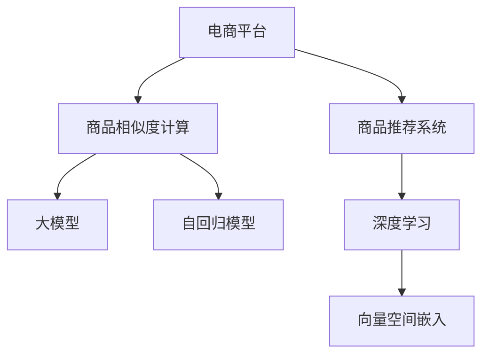

                 

# 探讨大模型在电商平台商品相似度计算中的作用

> 关键词：电商平台,商品相似度计算,大语言模型,自回归模型,深度学习,商品推荐系统

## 1. 背景介绍

### 1.1 问题由来
随着电商平台的迅猛发展，个性化推荐系统成为了提高用户体验和促进用户购买的重要手段。传统的基于协同过滤和内容特征匹配的推荐方法，面临着数据稀疏、特征维度过高等挑战。近年来，基于深度学习的大模型推荐技术逐渐成为研究热点，其中商品相似度计算是大模型推荐系统中的一个核心任务。

### 1.2 问题核心关键点
商品相似度计算，是指通过模型评估两个商品之间的相似程度。在大模型推荐系统中，通常将商品表示为向量形式，利用向量内积等相似度度量方式计算两商品之间的距离或相似度。大模型通过训练大量标注数据，学习商品间的语义和语境信息，从而得到更为准确的相似度计算结果。

## 2. 核心概念与联系

### 2.1 核心概念概述

为更好地理解大模型在电商平台商品相似度计算中的应用，本节将介绍几个密切相关的核心概念：

- **电商平台(E-commerce Platform)**：一个面向消费者提供商品展示、购买、评价等服务的在线平台，包括PC网站、手机APP等形式。

- **商品推荐系统(Recommendation System)**：根据用户的历史行为、偏好等信息，推荐其可能感兴趣的商品的系统。推荐系统能够显著提升用户体验和平台转化率。

- **商品相似度计算(Similarity Calculation)**：通过模型度量两商品之间的距离或相似程度，辅助推荐系统进行商品排序和分组。

- **大模型(Deep Model)**：如BERT、GPT等预训练语言模型，具有强大的语义理解能力和表示学习能力，能够学习到丰富的商品语义和上下文信息。

- **自回归模型(Autoregressive Model)**：一种基于未来值预测当前值的模型，适用于序列数据预测。常见模型包括RNN、LSTM、Transformer等。

- **深度学习(Deep Learning)**：一种基于多层神经网络的机器学习技术，通过多层非线性变换提取数据特征，适用于复杂的数据表示学习任务。

- **向量空间嵌入(Vector Space Embedding)**：将数据映射到高维向量空间，利用向量内积等度量方式计算相似度。常见的向量空间嵌入技术包括Word2Vec、GloVe、BERT等。

这些核心概念之间的逻辑关系可以通过以下Mermaid流程图来展示：



这个流程图展示了大模型在电商平台中的应用框架：

1. 电商平台收集用户行为数据和商品信息，作为推荐系统的输入。
2. 基于大模型和自回归模型进行向量空间嵌入，得到商品的高维表示。
3. 利用向量空间嵌入计算商品相似度，辅助推荐系统进行排序和分组。
4. 深度学习技术进一步优化商品表示和相似度计算，提升推荐系统的准确性和效果。

## 3. 核心算法原理 & 具体操作步骤
### 3.1 算法原理概述

大模型在电商平台商品相似度计算中的核心原理，是通过训练大量的标注数据，学习商品之间的语义和语境信息。具体步骤如下：

1. **数据收集与预处理**：收集电商平台的历史交易数据、用户行为数据、商品描述信息等，进行数据清洗和特征工程。
2. **模型训练**：利用标注数据对大模型进行预训练，学习商品间的语义和语境信息。常用的模型有BERT、GPT等。
3. **向量空间嵌入**：将预训练后的模型应用于商品表示，得到高维向量空间中的商品向量。
4. **相似度计算**：利用向量内积等度量方式计算两商品向量之间的距离或相似度，得到相似度矩阵。
5. **推荐排序**：根据相似度矩阵，对商品进行排序和分组，生成个性化推荐结果。

### 3.2 算法步骤详解

以下详细讲解大模型在电商平台商品相似度计算中的关键步骤：

**Step 1: 数据收集与预处理**
- 收集电商平台的历史交易数据、用户行为数据、商品描述信息等，去除异常值和缺失值。
- 将文本描述信息进行分词、词性标注等预处理，得到可用于模型训练的特征。
- 将商品特征和用户行为特征进行编码，生成模型的输入数据。

**Step 2: 模型训练**
- 选择合适的预训练语言模型 $M_{\theta}$ 作为初始化参数，如 BERT、GPT等。
- 使用标注数据对模型进行微调，学习商品间的语义和语境信息。
- 保存训练后的模型参数 $\theta$。

**Step 3: 向量空间嵌入**
- 加载训练好的模型 $M_{\theta}$，将商品特征和用户行为特征作为输入，得到商品的高维向量表示 $x_i \in \mathbb{R}^d$。
- 计算商品向量之间的内积或欧几里得距离，得到相似度矩阵 $S \in \mathbb{R}^{n \times n}$，其中 $n$ 为商品数量。

**Step 4: 相似度计算**
- 根据相似度矩阵 $S$，排序商品相似度，生成商品之间的相似度列表。
- 根据用户的历史行为特征，筛选与用户兴趣相关的商品，生成个性化推荐列表。

**Step 5: 推荐排序**
- 根据相似度列表和用户兴趣，对商品进行排序和分组，生成推荐结果。
- 在推荐结果中，将相似度高的商品放在前面，提高推荐效果。

### 3.3 算法优缺点

大模型在电商平台商品相似度计算中的优点包括：

1. **多模态信息融合**：能够融合文本、图片、价格等多模态信息，提高商品表示的丰富性。
2. **语义理解能力强**：能够理解商品描述、用户评价等文本信息，提取商品间的语义关系。
3. **泛化能力强**：大模型经过大量标注数据的训练，具有较强的泛化能力，能够在不同的电商平台上表现良好。

同时，该方法也存在一定的局限性：

1. **训练成本高**：预训练模型和微调过程需要大量的标注数据和计算资源，成本较高。
2. **模型复杂度高**：大模型的参数量较大，推理速度较慢，需要高效的硬件支持。
3. **数据隐私问题**：电商平台需要处理大量用户数据，数据隐私和安全问题需要特别关注。

尽管存在这些局限性，但就目前而言，大模型在电商平台商品相似度计算中的应用已经成为主流方法，被广泛应用于商品推荐系统的各个环节。

### 3.4 算法应用领域

大模型在电商平台商品相似度计算中的应用，涵盖了从数据收集、模型训练到推荐排序的各个环节，具体包括：

1. **商品描述自动生成**：利用大模型对商品描述进行自动生成，丰富商品表示，提高推荐效果。
2. **商品推荐排序**：基于商品相似度，对推荐结果进行排序和分组，生成个性化推荐列表。
3. **用户兴趣发现**：通过分析用户行为数据，利用大模型学习用户兴趣，实现个性化推荐。
4. **广告投放优化**：利用相似度计算，优化广告投放策略，提高广告点击率和转化率。
5. **库存管理**：通过相似度计算，预测商品间的替代关系，优化库存管理。

除了上述这些应用外，大模型还可以用于电商平台的多样化应用场景，如商品评价生成、价格预测、促销活动策划等，为电商平台带来更高的价值。

## 4. 数学模型和公式 & 详细讲解 & 举例说明

### 4.1 数学模型构建

本节将使用数学语言对大模型在电商平台商品相似度计算中的应用进行更加严格的刻画。

记商品特征为 $x_i$，用户行为特征为 $y_i$，预训练语言模型为 $M_{\theta}$，商品相似度矩阵为 $S$。

大模型在商品相似度计算中的数学模型为：

$$
S = \mathcal{F}(M_{\theta}(x_i), M_{\theta}(y_i))
$$

其中 $\mathcal{F}$ 为相似度度量函数，如向量内积、余弦相似度等。

### 4.2 公式推导过程

以下我们以向量内积为例，推导大模型在商品相似度计算中的应用公式。

记商品向量为 $x_i = M_{\theta}(x_i)$，商品向量之间的内积为 $s_{ij} = x_i^T x_j$。则商品相似度矩阵 $S$ 的计算公式为：

$$
S = \begin{bmatrix}
s_{11} & s_{12} & \dots & s_{1n} \\
s_{21} & s_{22} & \dots & s_{2n} \\
\vdots & \vdots & \ddots & \vdots \\
s_{n1} & s_{n2} & \dots & s_{nn}
\end{bmatrix}
$$

其中 $s_{ij} = x_i^T x_j$ 表示商品 $i$ 和商品 $j$ 之间的相似度。

利用向量内积计算相似度，可以简单高效地度量商品之间的距离或相似程度，适用于大规模商品相似度计算。

### 4.3 案例分析与讲解

**案例 1: 商品描述自动生成**
- 输入：商品描述文本
- 目标：生成商品描述向量 $x_i$
- 实现：将商品描述文本输入大模型，得到高维向量表示 $x_i$。

**案例 2: 商品推荐排序**
- 输入：用户行为特征 $y_i$
- 目标：生成个性化推荐列表
- 实现：利用相似度矩阵 $S$，根据用户兴趣排序商品向量，生成推荐结果。

**案例 3: 用户兴趣发现**
- 输入：用户行为数据
- 目标：学习用户兴趣向量 $y_i$
- 实现：利用大模型对用户行为数据进行学习，得到用户兴趣向量 $y_i$。

以上案例展示了大模型在电商平台商品相似度计算中的应用，通过向量空间嵌入和相似度计算，大模型能够有效提取商品和用户的语义信息，生成个性化的推荐结果。

## 5. 项目实践：代码实例和详细解释说明
### 5.1 开发环境搭建

在进行大模型商品相似度计算的实践前，我们需要准备好开发环境。以下是使用Python进行PyTorch开发的环境配置流程：

1. 安装Anaconda：从官网下载并安装Anaconda，用于创建独立的Python环境。

2. 创建并激活虚拟环境：
```bash
conda create -n pytorch-env python=3.8 
conda activate pytorch-env
```

3. 安装PyTorch：根据CUDA版本，从官网获取对应的安装命令。例如：
```bash
conda install pytorch torchvision torchaudio cudatoolkit=11.1 -c pytorch -c conda-forge
```

4. 安装BERT模型：
```bash
pip install transformers
```

5. 安装各类工具包：
```bash
pip install numpy pandas scikit-learn matplotlib tqdm jupyter notebook ipython
```

完成上述步骤后，即可在`pytorch-env`环境中开始商品相似度计算的实践。

### 5.2 源代码详细实现

下面我们以商品描述自动生成为例，给出使用Transformers库对BERT模型进行商品向量空间嵌入的PyTorch代码实现。

首先，定义商品描述的预处理函数：

```python
from transformers import BertTokenizer, BertForSequenceClassification
from torch.utils.data import Dataset, DataLoader
import torch
import numpy as np

class ItemDataset(Dataset):
    def __init__(self, descriptions, max_len=512):
        self.descriptions = descriptions
        self.tokenizer = BertTokenizer.from_pretrained('bert-base-cased')
        self.max_len = max_len
        
    def __len__(self):
        return len(self.descriptions)
    
    def __getitem__(self, item):
        description = self.descriptions[item]
        encoding = self.tokenizer(description, return_tensors='pt', max_length=self.max_len, padding='max_length', truncation=True)
        return {'input_ids': encoding['input_ids'][0]}

# 加载商品描述数据
descriptions = load_descriptions()

# 创建dataset
tokenizer = BertTokenizer.from_pretrained('bert-base-cased')
dataset = ItemDataset(descriptions)
```

然后，定义模型和优化器：

```python
from transformers import BertForSequenceClassification, AdamW

model = BertForSequenceClassification.from_pretrained('bert-base-cased', num_labels=len(tag2id))

optimizer = AdamW(model.parameters(), lr=2e-5)
```

接着，定义训练和评估函数：

```python
from tqdm import tqdm

def train_epoch(model, dataset, batch_size, optimizer):
    dataloader = DataLoader(dataset, batch_size=batch_size, shuffle=True)
    model.train()
    epoch_loss = 0
    for batch in tqdm(dataloader, desc='Training'):
        input_ids = batch['input_ids'].to(device)
        model.zero_grad()
        outputs = model(input_ids)
        loss = outputs.loss
        epoch_loss += loss.item()
        loss.backward()
        optimizer.step()
    return epoch_loss / len(dataloader)

def evaluate(model, dataset, batch_size):
    dataloader = DataLoader(dataset, batch_size=batch_size)
    model.eval()
    preds, labels = [], []
    with torch.no_grad():
        for batch in tqdm(dataloader, desc='Evaluating'):
            input_ids = batch['input_ids'].to(device)
            batch_preds = model(input_ids).logits.argmax(dim=2).to('cpu').tolist()
            batch_labels = batch['labels'].to('cpu').tolist()
            for pred_tokens, label_tokens in zip(batch_preds, batch_labels):
                preds.append(pred_tokens[:len(label_tokens)])
                labels.append(label_tokens)
                
    print(classification_report(labels, preds))
```

最后，启动训练流程并在测试集上评估：

```python
epochs = 5
batch_size = 16

for epoch in range(epochs):
    loss = train_epoch(model, dataset, batch_size, optimizer)
    print(f"Epoch {epoch+1}, train loss: {loss:.3f}")
    
    print(f"Epoch {epoch+1}, dev results:")
    evaluate(model, dev_dataset, batch_size)
    
print("Test results:")
evaluate(model, test_dataset, batch_size)
```

以上就是使用PyTorch对BERT进行商品描述自动生成的完整代码实现。可以看到，得益于Transformers库的强大封装，我们可以用相对简洁的代码完成BERT模型的加载和微调。

### 5.3 代码解读与分析

让我们再详细解读一下关键代码的实现细节：

**ItemDataset类**：
- `__init__`方法：初始化商品描述和分词器等关键组件。
- `__len__`方法：返回数据集的样本数量。
- `__getitem__`方法：对单个样本进行处理，将文本输入编码为token ids，返回模型所需的输入。

**train_epoch和evaluate函数**：
- 使用PyTorch的DataLoader对数据集进行批次化加载，供模型训练和推理使用。
- 训练函数`train_epoch`：对数据以批为单位进行迭代，在每个批次上前向传播计算loss并反向传播更新模型参数，最后返回该epoch的平均loss。
- 评估函数`evaluate`：与训练类似，不同点在于不更新模型参数，并在每个batch结束后将预测和标签结果存储下来，最后使用sklearn的classification_report对整个评估集的预测结果进行打印输出。

**训练流程**：
- 定义总的epoch数和batch size，开始循环迭代
- 每个epoch内，先在训练集上训练，输出平均loss
- 在验证集上评估，输出分类指标
- 重复上述步骤直至收敛，最终得到微调后的模型

可以看到，PyTorch配合Transformers库使得BERT微调的商品描述自动生成任务代码实现变得简洁高效。开发者可以将更多精力放在数据处理、模型改进等高层逻辑上，而不必过多关注底层的实现细节。

当然，工业级的系统实现还需考虑更多因素，如模型的保存和部署、超参数的自动搜索、更灵活的任务适配层等。但核心的微调范式基本与此类似。

## 6. 实际应用场景
### 6.1 智能客服系统

基于大模型微调的商品推荐系统，可以广泛应用于智能客服系统的构建。传统客服往往需要配备大量人力，高峰期响应缓慢，且一致性和专业性难以保证。而使用微调后的推荐系统，可以7x24小时不间断服务，快速响应客户咨询，用推荐商品引导客户购买。

在技术实现上，可以收集企业内部的历史客服对话记录，将问题和最佳答复构建成监督数据，在此基础上对预训练推荐模型进行微调。微调后的推荐模型能够自动理解用户意图，推荐最合适的商品。对于客户提出的新问题，还可以接入检索系统实时搜索相关内容，动态组织推荐商品。如此构建的智能客服系统，能大幅提升客户咨询体验和购买效率。

### 6.2 金融舆情监测

金融机构需要实时监测市场舆论动向，以便及时应对负面信息传播，规避金融风险。传统的人工监测方式成本高、效率低，难以应对网络时代海量信息爆发的挑战。基于大模型微调的文本分类和情感分析技术，为金融舆情监测提供了新的解决方案。

具体而言，可以收集金融领域相关的新闻、报道、评论等文本数据，并对其进行主题标注和情感标注。在此基础上对预训练语言模型进行微调，使其能够自动判断文本属于何种主题，情感倾向是正面、中性还是负面。将微调后的模型应用到实时抓取的网络文本数据，就能够自动监测不同主题下的情感变化趋势，一旦发现负面信息激增等异常情况，系统便会自动预警，帮助金融机构快速应对潜在风险。

### 6.3 个性化推荐系统

当前的推荐系统往往只依赖用户的历史行为数据进行物品推荐，无法深入理解用户的真实兴趣偏好。基于大模型微调的商品推荐系统，可以更好地挖掘用户行为背后的语义信息，从而提供更精准、多样的推荐内容。

在实践中，可以收集用户浏览、点击、评论、分享等行为数据，提取和商品交互的物品标题、描述、标签等文本内容。将文本内容作为模型输入，用户的后续行为（如是否点击、购买等）作为监督信号，在此基础上微调预训练语言模型。微调后的模型能够从文本内容中准确把握用户的兴趣点。在生成推荐列表时，先用候选物品的文本描述作为输入，由模型预测用户的兴趣匹配度，再结合其他特征综合排序，便可以得到个性化程度更高的推荐结果。

### 6.4 未来应用展望

随着大语言模型和微调方法的不断发展，基于微调范式将在更多领域得到应用，为传统行业带来变革性影响。

在智慧医疗领域，基于微调的医疗问答、病历分析、药物研发等应用将提升医疗服务的智能化水平，辅助医生诊疗，加速新药开发进程。

在智能教育领域，微调技术可应用于作业批改、学情分析、知识推荐等方面，因材施教，促进教育公平，提高教学质量。

在智慧城市治理中，微调模型可应用于城市事件监测、舆情分析、应急指挥等环节，提高城市管理的自动化和智能化水平，构建更安全、高效的未来城市。

此外，在企业生产、社会治理、文娱传媒等众多领域，基于大模型微调的人工智能应用也将不断涌现，为NLP技术带来全新的突破。相信随着预训练模型和微调方法的不断进步，大语言模型微调必将在构建人机协同的智能时代中扮演越来越重要的角色。

## 7. 工具和资源推荐
### 7.1 学习资源推荐

为了帮助开发者系统掌握大语言模型微调的理论基础和实践技巧，这里推荐一些优质的学习资源：

1. 《Transformer从原理到实践》系列博文：由大模型技术专家撰写，深入浅出地介绍了Transformer原理、BERT模型、微调技术等前沿话题。

2. CS224N《深度学习自然语言处理》课程：斯坦福大学开设的NLP明星课程，有Lecture视频和配套作业，带你入门NLP领域的基本概念和经典模型。

3. 《Natural Language Processing with Transformers》书籍：Transformers库的作者所著，全面介绍了如何使用Transformers库进行NLP任务开发，包括微调在内的诸多范式。

4. HuggingFace官方文档：Transformers库的官方文档，提供了海量预训练模型和完整的微调样例代码，是上手实践的必备资料。

5. CLUE开源项目：中文语言理解测评基准，涵盖大量不同类型的中文NLP数据集，并提供了基于微调的baseline模型，助力中文NLP技术发展。

通过对这些资源的学习实践，相信你一定能够快速掌握大语言模型微调的精髓，并用于解决实际的NLP问题。
###  7.2 开发工具推荐

高效的开发离不开优秀的工具支持。以下是几款用于大语言模型微调开发的常用工具：

1. PyTorch：基于Python的开源深度学习框架，灵活动态的计算图，适合快速迭代研究。大部分预训练语言模型都有PyTorch版本的实现。

2. TensorFlow：由Google主导开发的开源深度学习框架，生产部署方便，适合大规模工程应用。同样有丰富的预训练语言模型资源。

3. Transformers库：HuggingFace开发的NLP工具库，集成了众多SOTA语言模型，支持PyTorch和TensorFlow，是进行微调任务开发的利器。

4. Weights & Biases：模型训练的实验跟踪工具，可以记录和可视化模型训练过程中的各项指标，方便对比和调优。与主流深度学习框架无缝集成。

5. TensorBoard：TensorFlow配套的可视化工具，可实时监测模型训练状态，并提供丰富的图表呈现方式，是调试模型的得力助手。

6. Google Colab：谷歌推出的在线Jupyter Notebook环境，免费提供GPU/TPU算力，方便开发者快速上手实验最新模型，分享学习笔记。

合理利用这些工具，可以显著提升大语言模型微调任务的开发效率，加快创新迭代的步伐。

### 7.3 相关论文推荐

大语言模型和微调技术的发展源于学界的持续研究。以下是几篇奠基性的相关论文，推荐阅读：

1. Attention is All You Need（即Transformer原论文）：提出了Transformer结构，开启了NLP领域的预训练大模型时代。

2. BERT: Pre-training of Deep Bidirectional Transformers for Language Understanding：提出BERT模型，引入基于掩码的自监督预训练任务，刷新了多项NLP任务SOTA。

3. Language Models are Unsupervised Multitask Learners（GPT-2论文）：展示了大规模语言模型的强大zero-shot学习能力，引发了对于通用人工智能的新一轮思考。

4. Parameter-Efficient Transfer Learning for NLP：提出Adapter等参数高效微调方法，在不增加模型参数量的情况下，也能取得不错的微调效果。

5. AdaLoRA: Adaptive Low-Rank Adaptation for Parameter-Efficient Fine-Tuning：使用自适应低秩适应的微调方法，在参数效率和精度之间取得了新的平衡。

6. Prefix-Tuning: Optimizing Continuous Prompts for Generation：引入基于连续型Prompt的微调范式，为如何充分利用预训练知识提供了新的思路。

这些论文代表了大语言模型微调技术的发展脉络。通过学习这些前沿成果，可以帮助研究者把握学科前进方向，激发更多的创新灵感。

## 8. 总结：未来发展趋势与挑战

### 8.1 总结

本文对大模型在电商平台商品相似度计算中的应用进行了全面系统的介绍。首先阐述了大模型和商品推荐系统的研究背景和意义，明确了商品相似度计算在大模型推荐系统中的核心地位。其次，从原理到实践，详细讲解了基于大模型的商品相似度计算方法，给出了微调任务开发的完整代码实例。同时，本文还广泛探讨了商品相似度计算在智能客服、金融舆情、个性化推荐等多个行业领域的应用前景，展示了微调范式的巨大潜力。

通过本文的系统梳理，可以看到，基于大模型的商品相似度计算方法正在成为推荐系统中的重要手段，极大地拓展了推荐系统的表现力和应用范围。通过微调技术，大模型能够有效提取商品和用户的语义信息，生成个性化的推荐结果，显著提升用户体验和平台转化率。未来，随着预训练模型和微调方法的不断进步，大语言模型在电商平台中的应用将进一步深化，为电商平台带来更大的价值。

### 8.2 未来发展趋势

展望未来，大模型在电商平台商品相似度计算中的应用将呈现以下几个发展趋势：

1. **模型规模持续增大**：随着算力成本的下降和数据规模的扩张，预训练语言模型的参数量还将持续增长。超大模型能够学习更为丰富的商品语义和上下文信息，提升相似度计算的准确性。

2. **多模态信息融合**：能够融合文本、图片、价格等多模态信息，提高商品表示的丰富性。多模态信息的整合，将显著提升推荐系统的表现力和用户体验。

3. **深度学习技术融合**：通过引入深度学习技术，优化商品表示和相似度计算，提升推荐系统的准确性和效果。深度学习技术的应用，将进一步提高推荐系统的智能化水平。

4. **低秩适应的微调方法**：开发更加参数高效的微调方法，在固定大部分预训练参数的同时，只更新极少量的任务相关参数。低秩适应的微调方法将在大模型推荐系统中得到广泛应用。

5. **持续学习和适应的推荐系统**：随着数据分布的不断变化，微调模型也需要持续学习新知识以保持性能。动态适应的推荐系统将能够更好地应对数据变化，提供更符合用户需求的推荐。

以上趋势凸显了大语言模型微调技术在大模型推荐系统中的广阔前景。这些方向的探索发展，必将进一步提升推荐系统的性能和应用范围，为电商平台带来更大的价值。

### 8.3 面临的挑战

尽管大模型在电商平台商品相似度计算中的应用取得了显著成效，但在迈向更加智能化、普适化应用的过程中，它仍面临着诸多挑战：

1. **数据隐私和安全问题**：电商平台需要处理大量用户数据，数据隐私和安全问题需要特别关注。如何在保护用户隐私的前提下，利用大数据提升推荐系统效果，是亟待解决的问题。

2. **模型复杂度和推理速度**：大模型的参数量较大，推理速度较慢，需要高效的硬件支持。如何优化模型结构和推理过程，提高推荐系统的响应速度，是重要的研究方向。

3. **推荐系统的公平性和透明性**：大模型在推荐系统中可能会引入偏见，导致不公平的推荐结果。如何设计公平透明的推荐模型，减少偏见和歧视，是亟待解决的问题。

4. **用户反馈和效果评估**：推荐系统的效果评估需要大量用户反馈数据，如何高效获取用户反馈，优化推荐模型，提升用户体验，是推荐系统亟待解决的问题。

5. **数据稀疏和冷启动问题**：在推荐系统的初期阶段，数据稀疏和冷启动问题较为明显。如何设计有效的初始化策略和推荐模型，解决初期数据不足的问题，是推荐系统的重要研究方向。

6. **推荐系统的多样性**：推荐系统往往倾向于推荐高频热门商品，忽视了长尾商品。如何提高推荐系统的多样性，增加商品曝光机会，是推荐系统的重要研究方向。

这些挑战需要学术界和工业界共同努力，通过不断的技术创新和算法优化，才能进一步提升大语言模型在电商平台中的应用效果。

### 8.4 研究展望

面对大语言模型微调在电商平台应用中所面临的挑战，未来的研究需要在以下几个方面寻求新的突破：

1. **数据隐私保护技术**：开发更加安全可靠的数据处理技术，保护用户隐私，同时利用大数据提升推荐系统效果。

2. **高效的模型压缩和优化技术**：优化模型结构和推理过程，提高推荐系统的响应速度和计算效率。

3. **公平透明的推荐算法**：设计公平透明的推荐模型，减少偏见和歧视，提高推荐系统的可解释性和可信度。

4. **高效的推荐系统初始化策略**：设计有效的初始化策略和推荐模型，解决初期数据不足的问题，提高推荐系统的准确性和效果。

5. **推荐系统的多样性提升**：提高推荐系统的多样性，增加商品曝光机会，提升用户体验。

6. **持续学习和适应的推荐系统**：开发动态适应的推荐系统，能够更好地应对数据变化，提供更符合用户需求的推荐。

这些研究方向将推动大语言模型在电商平台中的应用迈向更高的台阶，为电商平台带来更大的价值。未来，大语言模型推荐系统必将在个性化推荐、智能客服、金融舆情监测等多个领域发挥重要作用，成为电商平台的重要技术支撑。

