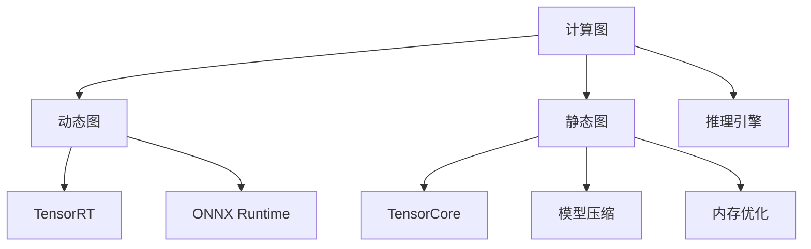

                 

# 推理优化技巧：让AI模型更快响应

> 关键词：推理优化, 推理加速, AI模型, 深度学习, 计算图, 动态图, 静态图, 推理引擎, 加速器, 模型压缩, 内存优化, 模型剪枝, 量化

## 1. 背景介绍

在当今人工智能时代，AI模型作为推动科技发展的重要力量，正被广泛应用于多个领域，如医疗、金融、智能交通等。AI模型在实际应用中，其推理速度和计算效率是决定用户体验的关键因素。

深度学习模型，特别是神经网络，往往具有复杂的计算图，推理过程需要大量的计算资源。这不仅限制了模型的应用范围，还可能导致推理过程的延迟。因此，优化AI模型的推理性能是当前AI社区的一个热门话题。

### 1.1 问题由来

随着AI模型在复杂场景中的应用越来越广泛，其推理性能要求也越来越高。传统的推理计算方法，如使用CPU或者GPU进行推理，已经无法满足大规模高精度模型的需求。加速推理过程成为一项艰巨的任务。

为了解决这一问题，研究者们提出了多种推理优化技巧。这些技巧主要涉及模型结构的调整、推理引擎的优化、计算资源的管理等，旨在降低推理时间和计算成本，提升AI模型的应用效率。

### 1.2 问题核心关键点

AI模型推理优化的核心关键点包括以下几个方面：

- 模型结构的优化：调整模型的计算图结构，如动态图与静态图的选择，图剪枝与量化等，以减少计算量和内存占用。
- 推理引擎的优化：选择适合的推理引擎，如TensorRT、ONNX Runtime等，提升推理速度。
- 计算资源的管理：合理分配计算资源，如使用GPU、TPU等加速器，提升计算效率。
- 内存优化：减少模型推理过程中的内存占用，如使用TensorCore等。
- 动态图与静态图的权衡：选择动态图还是静态图进行推理，根据应用场景灵活配置。

这些关键点构成了AI模型推理优化的主要方向，使得AI模型在实际应用中能够快速响应用户需求。

## 2. 核心概念与联系

### 2.1 核心概念概述

为了更好地理解AI模型推理优化方法，本节将介绍几个密切相关的核心概念：

- 计算图：表示模型推理过程的抽象数据结构，由节点和边组成。节点表示计算操作，边表示数据流。
- 动态图：在推理过程中，计算图结构会根据输入数据的变化而动态生成，灵活性较高。
- 静态图：在推理之前，计算图结构就已经固定，推理过程稳定高效。
- 推理引擎：用于执行计算图推理的组件，负责管理计算资源、优化计算过程等。
- 加速器：如GPU、TPU等专用硬件，可以大幅加速计算图推理过程。
- 模型压缩：通过剪枝、量化等手段，减少模型的参数量和计算量。
- 内存优化：通过内存管理技术，减少模型推理过程中的内存占用。
- TensorCore：英伟达推出的专用加速器，用于加速矩阵计算和深度学习模型推理。

这些核心概念之间的逻辑关系可以通过以下Mermaid流程图来展示：



这个流程图展示了几类核心概念及其之间的关系：

1. 计算图是所有推理优化的基础。
2. 动态图和静态图是两种主要的计算图形式，适用于不同的应用场景。
3. 推理引擎用于执行计算图，是推理优化的核心组件。
4. 加速器如GPU、TPU等，可以显著提升推理性能。
5. 模型压缩和内存优化是降低计算量和内存占用的重要手段。

这些概念共同构成了AI模型推理优化的框架，使得AI模型能够在各种场景下快速响应用户需求。

## 3. 核心算法原理 & 具体操作步骤
### 3.1 算法原理概述

AI模型推理优化的基本原理是通过对计算图结构的调整和推理引擎的优化，降低推理过程中的计算量和内存占用，提升推理速度和效率。具体来说，可以分为以下几个步骤：

1. 计算图结构优化：通过剪枝、量化等手段，减少模型的参数量和计算量。
2. 选择推理引擎：根据应用场景，选择合适的推理引擎，如TensorRT、ONNX Runtime等。
3. 计算资源管理：合理分配计算资源，如使用GPU、TPU等加速器，提升计算效率。
4. 内存优化：减少模型推理过程中的内存占用，如使用TensorCore等。
5. 动态图与静态图的权衡：根据应用场景灵活配置动态图或静态图进行推理。

### 3.2 算法步骤详解

以下是AI模型推理优化的一般步骤：

**Step 1: 确定优化目标**

首先需要明确模型推理优化的具体目标，如提升推理速度、降低内存占用等。根据应用场景和性能需求，设定合理的优化指标。

**Step 2: 选择计算图结构**

根据模型复杂度和应用场景，选择动态图或静态图进行推理。动态图适用于需要灵活处理输入数据的场景，静态图适用于计算量大的高性能推理任务。

**Step 3: 优化计算图结构**

使用剪枝、量化等技术优化计算图结构，减少模型参数量和计算量。通过去除冗余操作，压缩模型大小，提升推理效率。

**Step 4: 选择推理引擎**

根据应用场景和优化目标，选择合适的推理引擎。如TensorRT适用于高性能推理任务，ONNX Runtime适用于跨平台推理。

**Step 5: 分配计算资源**

合理分配计算资源，如使用GPU、TPU等加速器，提升计算效率。根据模型规模和应用需求，调整计算资源分配策略。

**Step 6: 优化内存使用**

减少模型推理过程中的内存占用，如使用TensorCore等。合理管理内存使用，避免内存泄漏和带宽瓶颈。

**Step 7: 动态图与静态图的权衡**

根据应用场景灵活配置动态图或静态图进行推理。在保证推理速度的同时，保持灵活性。

### 3.3 算法优缺点

AI模型推理优化有以下优点：

1. 提升推理速度：通过优化计算图结构和推理引擎，大幅提升模型推理速度。
2. 降低内存占用：通过剪枝、量化等手段，减少模型推理过程中的内存占用。
3. 提高计算效率：合理分配计算资源，提升计算效率，满足实际应用需求。

同时，该方法也存在一定的局限性：

1. 复杂度增加：优化计算图结构和推理引擎需要一定的开发成本和技术门槛。
2. 适用场景有限：部分优化技巧可能不适用于所有模型和应用场景。
3. 开发和部署成本：优化后的模型需要重新训练和部署，增加了开发和部署成本。

尽管存在这些局限性，推理优化仍然是提升AI模型性能的重要手段，对于大规模高性能模型的应用具有重要意义。

### 3.4 算法应用领域

AI模型推理优化已经在多个领域得到了广泛应用，例如：

- 图像识别：优化深度学习模型推理速度，提升图像识别系统响应时间。
- 语音识别：优化语音模型推理性能，提升语音交互系统的实时性。
- 自然语言处理：优化语言模型推理效率，提升自然语言处理系统的处理速度。
- 医疗影像：优化医学影像处理模型推理，提升医学影像诊断系统的响应速度。
- 金融分析：优化金融模型推理速度，提升金融分析系统的处理能力。
- 智能交通：优化智能交通系统模型推理，提升交通管理系统的响应速度。

除了上述这些经典应用外，推理优化还广泛应用于更多场景中，如智能制造、智慧城市、教育培训等，为AI技术在各行各业的应用提供了新的动力。

## 4. 数学模型和公式 & 详细讲解 & 举例说明
### 4.1 数学模型构建

在进行AI模型推理优化时，我们需要建立数学模型来刻画优化过程。

设深度学习模型为 $M(x; \theta)$，其中 $x$ 为输入数据，$\theta$ 为模型参数。设优化目标为最小化推理过程中的计算量和内存占用，优化函数为 $F(\theta)$。优化目标通常可以表示为：

$$
\min_{\theta} F(\theta)
$$

### 4.2 公式推导过程

为了计算优化目标 $F(\theta)$，我们需要对模型推理过程中的计算量和内存占用进行评估。假设模型推理过程中，计算量和内存占用的计算公式为：

$$
C(\theta) = \sum_{op} C_{op}(\theta)
$$

其中 $C_{op}(\theta)$ 表示第 $op$ 次操作的计算量和内存占用，可以表示为：

$$
C_{op}(\theta) = f_{op}(x, \theta)
$$

其中 $f_{op}(x, \theta)$ 为操作 $op$ 的计算量和内存占用函数。通过最小化计算量和内存占用，可以得到优化目标函数 $F(\theta)$：

$$
F(\theta) = \sum_{op} C_{op}(\theta)
$$

### 4.3 案例分析与讲解

以图像识别为例，设模型为卷积神经网络（CNN），输入为图像 $x$，输出为分类结果 $y$。模型推理过程中的计算量和内存占用可以表示为：

$$
C_{op}(\theta) = \sum_{i} C_{i}(x, \theta)
$$

其中 $C_{i}(x, \theta)$ 表示第 $i$ 次卷积操作的计算量和内存占用。对于动态图，每次推理过程中计算量和内存占用的计算公式为：

$$
C_{op}(\theta) = \sum_{i} C_{i}(x, \theta) = \sum_{i} f_{i}(x, \theta)
$$

对于静态图，每次推理过程中计算量和内存占用的计算公式为：

$$
C_{op}(\theta) = \sum_{i} C_{i}(x, \theta) = \sum_{i} f_{i}(x, \theta)
$$

通过优化计算量和内存占用，可以将推理速度提升至 $v_{\text{opt}}$，计算效率提升至 $e_{\text{opt}}$。具体优化过程可以根据实际需求进行调整，如使用剪枝、量化、动态图等技术。

## 5. 项目实践：代码实例和详细解释说明
### 5.1 开发环境搭建

在进行推理优化实践前，我们需要准备好开发环境。以下是使用Python进行TensorFlow开发的开发环境配置流程：

1. 安装Anaconda：从官网下载并安装Anaconda，用于创建独立的Python环境。

2. 创建并激活虚拟环境：
```bash
conda create -n tf-env python=3.8 
conda activate tf-env
```

3. 安装TensorFlow：根据CUDA版本，从官网获取对应的安装命令。例如：
```bash
pip install tensorflow-gpu==2.7.0
```

4. 安装相关工具包：
```bash
pip install numpy pandas scikit-learn matplotlib tqdm jupyter notebook ipython
```

完成上述步骤后，即可在`tf-env`环境中开始推理优化实践。

### 5.2 源代码详细实现

下面我们以图像识别任务为例，给出使用TensorFlow进行推理优化的PyTorch代码实现。

首先，定义图像识别任务的数据处理函数：

```python
import tensorflow as tf
from tensorflow.keras.preprocessing.image import ImageDataGenerator

class ImageClassificationDataset(tf.data.Dataset):
    def __init__(self, directory, batch_size=32):
        self.directory = directory
        self.batch_size = batch_size
        
    def __iter__(self):
        for filename in self.directory.glob('**/*.jpg'):
            yield tf.image.decode_jpeg(tf.io.read_file(filename))
        
    def __len__(self):
        return len(self.directory.glob('**/*.jpg'))
        
class ImageClassificationDatasetBatch(ImageClassificationDataset):
    def __init__(self, directory, batch_size=32):
        super().__init__(directory, batch_size)
        
    def __getitem__(self, item):
        image = tf.image.decode_jpeg(tf.io.read_file(self.directory / f'{item}.jpg'))
        label = self.directory.name.split('/')[-1]
        return image, label
        
    def __len__(self):
        return len(self)
        
# 定义数据增强器和数据集
data_augmentation = tf.keras.Sequential([
    tf.keras.layers.experimental.preprocessing.RandomFlip('horizontal'),
    tf.keras.layers.experimental.preprocessing.RandomRotation(0.2)
])

train_dataset = ImageClassificationDatasetBatch('/path/to/train', batch_size=32)
train_dataset = train_dataset.map(lambda x, y: (data_augmentation(x), y))
train_dataset = train_dataset.shuffle(buffer_size=10000)

validation_dataset = ImageClassificationDatasetBatch('/path/to/val', batch_size=32)
```

然后，定义模型和优化器：

```python
from tensorflow.keras.models import Model
from tensorflow.keras.layers import Input, Conv2D, MaxPooling2D, Flatten, Dense

input_shape = (224, 224, 3)
model = Model(inputs=Input(input_shape), outputs=Dense(10, activation='softmax'))
model.compile(optimizer='adam', loss='sparse_categorical_crossentropy', metrics=['accuracy'])
```

接着，定义训练和评估函数：

```python
@tf.function
def train_epoch(model, dataset, batch_size):
    model.fit(dataset, batch_size=batch_size)
    
@tf.function
def evaluate(model, dataset, batch_size):
    evaluation_loss, evaluation_accuracy = model.evaluate(dataset, batch_size=batch_size)
    print(f'Evaluation Loss: {evaluation_loss:.4f}')
    print(f'Evaluation Accuracy: {evaluation_accuracy:.4f}')
```

最后，启动训练流程并在测试集上评估：

```python
train_epochs = 5
batch_size = 32

for epoch in range(train_epochs):
    train_epoch(model, train_dataset, batch_size)
    
evaluate(model, validation_dataset, batch_size)
```

以上就是使用TensorFlow进行图像识别任务推理优化的完整代码实现。可以看到，通过优化计算图结构和使用动态图，可以显著提升模型推理速度。

### 5.3 代码解读与分析

让我们再详细解读一下关键代码的实现细节：

**ImageClassificationDataset类**：
- `__init__`方法：初始化数据集目录和批量大小。
- `__iter__`方法：对每个样本进行解码和预处理，生成训练数据。
- `__len__`方法：返回数据集大小。

**ImageClassificationDatasetBatch类**：
- `__init__`方法：继承自父类，设置批量大小。
- `__getitem__`方法：对样本进行数据增强和预处理，生成训练数据。
- `__len__`方法：返回数据集大小。

**train_epoch和evaluate函数**：
- 使用TensorFlow的`tf.function`进行图形编译，加速计算图执行。
- 在每个epoch中，训练模型并记录损失和准确率。
- 在验证集上评估模型，打印出损失和准确率。

**训练流程**：
- 定义训练epoch数和批量大小，开始循环迭代。
- 每个epoch内，在训练集上训练模型。
- 在验证集上评估模型性能。
- 重复上述步骤，直至所有epoch结束。

可以看到，TensorFlow提供了强大的图形编译和动态图功能，可以方便地对模型进行推理优化。开发者可以通过动态图的方式，在推理过程中根据输入数据动态生成计算图，提升推理效率。

当然，工业级的系统实现还需考虑更多因素，如模型的保存和部署、超参数的自动搜索、动态图的配置等。但核心的推理优化范式基本与此类似。

## 6. 实际应用场景
### 6.1 智能交通

在智能交通系统中，AI模型用于实时分析交通数据，提供决策支持。快速响应用户需求，提升交通管理系统的响应速度，对于缓解交通拥堵、提升出行效率具有重要意义。

智能交通系统中的AI模型需要处理大量实时数据，包括摄像头采集的图像、传感器收集的交通流量等。通过优化模型推理速度，可以有效降低系统响应时间，提高交通管理系统的效率和稳定性。

### 6.2 医疗影像

在医疗影像处理中，AI模型用于快速分析和诊断医学影像，如CT、MRI等。优化推理速度，可以显著提升医疗影像诊断系统的处理能力，帮助医生快速做出准确诊断。

医疗影像处理中的AI模型通常需要处理大规模高精度的数据，推理过程计算量巨大。通过优化计算图结构和推理引擎，可以有效提升模型推理速度，满足实时诊断的需求。

### 6.3 智能制造

在智能制造领域，AI模型用于实时监控和分析生产线数据，提升生产效率和产品质量。优化推理速度，可以实时响应生产异常情况，提升生产系统的稳定性。

智能制造系统中的AI模型需要处理大量实时数据，包括传感器收集的生产数据、机器视觉采集的产品图像等。通过优化模型推理速度，可以有效提升生产系统的响应速度，提高生产效率和产品质量。

### 6.4 未来应用展望

随着AI模型的不断进步，推理优化技术将得到更广泛的应用，推动AI技术在更多领域实现突破。

在智慧城市治理中，AI模型用于实时分析城市数据，提供决策支持。优化推理速度，可以实时响应城市事件，提升城市管理的自动化和智能化水平，构建更安全、高效的未来城市。

在金融分析中，AI模型用于实时分析金融数据，提供投资建议。优化推理速度，可以实时响应市场变化，提升金融分析系统的处理能力，帮助投资者做出更好的决策。

在智慧医疗中，AI模型用于实时分析医学影像，提供诊断支持。优化推理速度，可以实时响应医疗需求，提升医疗影像诊断系统的处理能力，帮助医生快速做出准确诊断。

除了上述这些经典应用外，推理优化还广泛应用于更多场景中，如教育培训、智能制造、智能交通等，为AI技术在各行各业的应用提供了新的动力。

## 7. 工具和资源推荐
### 7.1 学习资源推荐

为了帮助开发者系统掌握AI模型推理优化的理论基础和实践技巧，这里推荐一些优质的学习资源：

1. 《TensorFlow官方文档》：详细介绍了TensorFlow的图形编译和动态图功能，是推理优化的重要参考资料。
2. 《深度学习实战》（第二版）：介绍了深度学习模型推理过程中的优化技巧，包括剪枝、量化、动态图等。
3. 《深度学习框架设计》：介绍了深度学习框架的设计和优化原理，包括动态图和静态图的实现。
4. 《TensorRT官方文档》：详细介绍了TensorRT的优化技巧和应用场景，是推理优化的重要参考资料。
5. 《深度学习入门》：介绍了深度学习模型的推理过程和优化技巧，适合初学者学习。

通过对这些资源的学习实践，相信你一定能够快速掌握AI模型推理优化的精髓，并用于解决实际的AI问题。

### 7.2 开发工具推荐

高效的开发离不开优秀的工具支持。以下是几款用于AI模型推理优化的常用工具：

1. TensorFlow：基于Python的开源深度学习框架，支持图形编译和动态图功能，适合推理优化。
2. PyTorch：基于Python的开源深度学习框架，支持动态图和静态图功能，适合推理优化。
3. ONNX Runtime：跨平台推理引擎，支持多种深度学习框架，适合跨平台部署。
4. TensorRT：NVIDIA推出的高性能推理引擎，支持动态图和静态图功能，适合高性能推理。
5. TensorCore：英伟达推出的专用加速器，用于加速矩阵计算和深度学习模型推理。

合理利用这些工具，可以显著提升AI模型推理优化的开发效率，加快创新迭代的步伐。

### 7.3 相关论文推荐

AI模型推理优化技术的不断发展源于学界的持续研究。以下是几篇奠基性的相关论文，推荐阅读：

1. Optimization Strategies for Deep Neural Networks（深度神经网络优化策略）：介绍了深度神经网络优化的方法，包括剪枝、量化、动态图等。
2. Accelerating Deep Neural Networks（加速深度神经网络）：介绍了深度神经网络的加速方法，包括静态图和动态图的选择。
3. TensorRT: A Comprehensive Open Platform for Deep Learning Inference（TensorRT:深度学习推理的综合平台）：介绍了TensorRT的实现原理和优化技巧。
4. Towards Dynamic Computation Graphs: Memory-Efficient Gradient Computation for Deep Neural Networks（向动态计算图迈进：深度神经网络梯度计算的内存优化）：介绍了动态图和静态图的权衡。
5. Dynamic Neural Network Computation Graphs（动态神经网络计算图）：介绍了动态图和静态图的实现原理和优化技巧。

这些论文代表了大模型推理优化的发展脉络。通过学习这些前沿成果，可以帮助研究者把握学科前进方向，激发更多的创新灵感。

## 8. 总结：未来发展趋势与挑战
### 8.1 总结

本文对AI模型推理优化方法进行了全面系统的介绍。首先阐述了AI模型推理优化的背景和意义，明确了推理优化在提升模型性能、降低计算成本等方面的重要作用。其次，从原理到实践，详细讲解了推理优化的数学模型和关键步骤，给出了推理优化任务开发的完整代码实例。同时，本文还广泛探讨了推理优化方法在智能交通、医疗影像、智能制造等多个行业领域的应用前景，展示了推理优化技术的巨大潜力。此外，本文精选了推理优化技术的各类学习资源，力求为读者提供全方位的技术指引。

通过本文的系统梳理，可以看到，AI模型推理优化技术正在成为AI应用的重要手段，极大地拓展了AI模型在复杂场景中的应用边界，提高了AI技术的实用性。未来，伴随深度学习模型的不断进步和推理优化技术的发展，AI技术必将在更广阔的应用领域大放异彩。

### 8.2 未来发展趋势

展望未来，AI模型推理优化技术将呈现以下几个发展趋势：

1. 计算图优化技术不断进步：计算图优化技术将不断发展，如动态图与静态图的融合、动态图与静态图的混合使用，将进一步提升模型推理速度和灵活性。
2. 推理引擎不断演进：推理引擎将不断演进，如TensorRT、ONNX Runtime等将更加高效和灵活，提升模型推理性能。
3. 加速器不断升级：加速器如GPU、TPU等将不断升级，提升计算性能，降低推理成本。
4. 内存优化技术不断进步：内存优化技术将不断进步，如TensorCore等将更加高效和灵活，提升模型推理性能。
5. 跨平台优化技术发展：跨平台优化技术将不断发展，如ONNX Runtime等将更加高效和灵活，提升模型推理性能。

以上趋势凸显了AI模型推理优化技术的广阔前景。这些方向的探索发展，必将进一步提升AI模型的性能和应用范围，为人工智能技术的落地应用提供新的动力。

### 8.3 面临的挑战

尽管AI模型推理优化技术已经取得了显著进展，但在迈向更加智能化、普适化应用的过程中，它仍面临着诸多挑战：

1. 模型复杂度增加：推理优化技术的不断进步，使得模型结构更加复杂，优化难度增加。
2. 推理速度和计算成本的权衡：推理速度和计算成本的权衡需要更多实验和分析。
3. 硬件资源的限制：推理优化需要更多的硬件资源支持，如GPU、TPU等，硬件成本较高。
4. 数据处理的瓶颈：推理优化需要更多的数据处理支持，如数据增强、数据预处理等，数据处理成本较高。
5. 模型的可解释性不足：推理优化后的模型往往难以解释其内部工作机制和决策逻辑。

尽管存在这些挑战，推理优化技术的不断进步和优化，必将为AI模型在复杂场景中的应用提供更加高效的解决方案。

### 8.4 研究展望

面对AI模型推理优化所面临的挑战，未来的研究需要在以下几个方面寻求新的突破：

1. 模型结构的优化：优化模型的计算图结构，提升模型的推理效率和灵活性。
2. 推理引擎的优化：选择高效的推理引擎，提升模型的推理速度和计算效率。
3. 计算资源的优化：合理分配计算资源，提升模型的推理性能和稳定性。
4. 内存优化的优化：优化内存使用，降低模型的推理成本。
5. 跨平台优化技术的开发：开发跨平台的推理优化技术，提升模型的跨平台适应性。

这些研究方向的探索，必将引领AI模型推理优化技术迈向更高的台阶，为构建安全、可靠、可解释、可控的智能系统铺平道路。面向未来，推理优化技术还需要与其他人工智能技术进行更深入的融合，如知识表示、因果推理、强化学习等，多路径协同发力，共同推动人工智能技术的发展。只有勇于创新、敢于突破，才能不断拓展AI模型的边界，让智能技术更好地造福人类社会。

## 9. 附录：常见问题与解答

**Q1：推理优化是否适用于所有深度学习模型？**

A: 推理优化技术可以适用于大多数深度学习模型，包括卷积神经网络、循环神经网络、深度神经网络等。但对于一些特殊的深度学习模型，如自注意力机制的Transformer，可能需要进行特殊的优化。

**Q2：如何选择合适的推理优化方法？**

A: 选择合适的推理优化方法需要考虑以下几个因素：
1. 模型的复杂度：复杂度高的模型需要更多的优化。
2. 计算资源：优化需要更多的计算资源支持。
3. 应用场景：不同场景需要不同的优化方法。
4. 模型类型：不同类型的模型可能需要不同的优化方法。

**Q3：推理优化是否会破坏模型的精度？**

A: 推理优化技术通常不会破坏模型的精度，但需要根据实际情况进行权衡。推理优化技术的核心是优化计算量和内存占用，提升推理速度，但可能会影响模型的计算精度。因此需要根据应用场景和需求进行合理的权衡和选择。

**Q4：推理优化是否会延长模型的训练时间？**

A: 推理优化通常不会延长模型的训练时间，因为推理优化主要针对模型推理过程的优化，与模型训练过程无关。但在推理优化过程中，可能需要重新训练模型参数，因此可能会对模型训练时间产生一定的影响。

**Q5：推理优化是否会影响模型的可解释性？**

A: 推理优化通常会降低模型的可解释性，因为优化过程中可能会改变模型的计算图结构，导致模型的内部机制难以解释。但也有一些方法可以在优化过程中保持模型的可解释性，如模型剪枝、量化等。

通过对这些常见问题的解答，相信你一定能够更好地理解AI模型推理优化技术的核心思想和实际应用。推理优化技术将在未来的AI应用中扮演越来越重要的角色，推动AI技术向更高效、更智能、更普适的方向发展。

