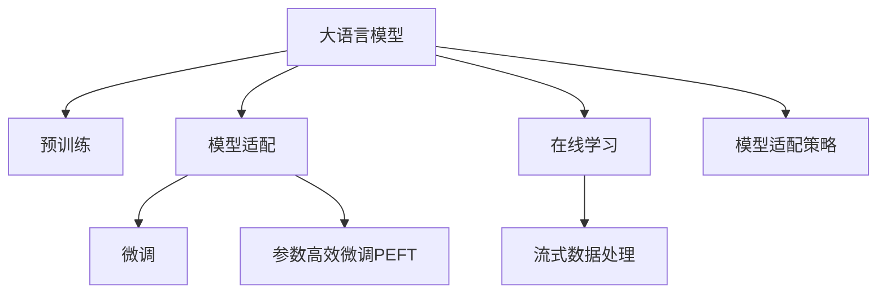

                 

# 推荐系统中AI大模型的实时更新机制

## 1. 背景介绍

### 1.1 问题由来
推荐系统作为互联网业务的核心引擎之一，通过理解和分析用户的行为模式，为每位用户推荐个性化的内容，极大地提升了用户体验和业务价值。近年来，随着深度学习和大规模预训练模型的兴起，AI驱动的推荐系统开始在电商、视频、社交等各个领域大放异彩，成为移动互联网时代不可或缺的技术支柱。

然而，随着用户需求的多样化和个性化程度的不断提升，传统的推荐系统面临着诸多挑战：

- **动态变化的用户兴趣**：用户兴趣是动态变化的，推荐系统需要实时响应用户行为变化，及时更新推荐结果。
- **数据稀疏性**：在线推荐系统往往面临数据稀疏性问题，新物品或新用户难以获得充分的曝光和反馈，模型难以有效学习其隐含特征。
- **模型过时问题**：大规模推荐系统通常依赖预训练模型进行初始化，但随着时间的推移，模型的知识可能与实际数据分布发生偏差，导致推荐效果下降。

针对上述问题，如何在保持高性能的前提下，实时更新AI大模型，使其适应不断变化的数据分布，成为推荐系统面临的重要课题。本文将详细探讨大模型实时更新的原理、方法和实际应用，希望能为推荐系统开发者提供有益的参考。

### 1.2 问题核心关键点
实时更新AI大模型的核心在于以下几个关键点：

1. **数据持续流**：实时获取用户行为数据，维持数据持续流入。
2. **模型适配策略**：选择合适的模型适配策略，平衡新旧知识，更新模型参数。
3. **计算资源优化**：合理分配计算资源，保证实时更新的高效性和准确性。
4. **稳定性保证**：确保实时更新的稳定性，避免模型更新过程中出现断层或异常。

通过理解这些核心点，我们可以更好地掌握大模型实时更新的关键技术和实施策略。

## 2. 核心概念与联系

### 2.1 核心概念概述

为更好地理解大模型实时更新机制，本节将介绍几个密切相关的核心概念：

- **大语言模型(Large Language Model, LLM)**：以自回归(如GPT)或自编码(如BERT)模型为代表的大规模预训练语言模型。通过在大规模无标签文本语料上进行预训练，学习通用的语言知识，具备强大的语言理解和生成能力。

- **在线推荐系统**：利用用户行为数据，通过实时学习更新模型，为每位用户推荐个性化内容。在线推荐系统通常采用实时学习机制，能够动态适应用户兴趣的变化。

- **模型适配**：将预训练模型应用于特定任务时，针对新任务的特点进行调整，以提升模型性能。模型适配策略包括微调(Fine-Tuning)、参数高效微调(Parameter-Efficient Fine-Tuning, PEFT)、零样本学习(Zero-shot Learning)等。

- **在线学习**：在线学习是一种实时的模型更新技术，通过连续不断地训练模型，使其逐步适应数据分布的变化。在线学习能够实时响应新数据，更新模型参数。

- **流式数据处理**：针对持续流动的实时数据，采用流式数据处理技术，逐批次地对数据进行处理和分析。流式数据处理能够有效降低内存消耗，提升数据处理效率。

这些核心概念之间的逻辑关系可以通过以下Mermaid流程图来展示：



这个流程图展示了核心概念及其之间的关系：

1. 大语言模型通过预训练获得基础能力。
2. 模型适配将预训练模型应用于特定任务，如微调、参数高效微调等。
3. 在线学习通过实时获取新数据，不断更新模型，使其适应变化。
4. 流式数据处理对实时流数据进行处理，减少内存占用，提升处理效率。
5. 模型适配策略指导模型适配的具体实现方式。

这些概念共同构成了大模型实时更新的框架，使其能够更好地适应数据动态变化，提升推荐系统的效果。

## 3. 核心算法原理 & 具体操作步骤
### 3.1 算法原理概述

大模型的实时更新机制，本质上是基于在线学习(Online Learning)和流式数据处理(Online Processing)的模型适配过程。其核心思想是：利用持续流动的实时数据，通过连续不断的模型训练，动态更新模型参数，使其逐步适应新的数据分布。

形式化地，假设在线推荐系统实时获取用户行为数据 $D_t = \{x_t, y_t\}_{t=1}^T$，其中 $x_t$ 为用户行为，$y_t$ 为推荐结果。设预训练模型为 $M_{\theta}$，其中 $\theta$ 为预训练得到的模型参数。在线更新模型的目标是最小化预测误差 $E_{t+1}(\theta) = \mathbb{E}[L(M_{\theta}(x_t),y_t)]$，其中 $L$ 为损失函数。在线更新过程不断进行，最终得到模型 $M_{\hat{\theta}}$，其中 $\hat{\theta}$ 为优化后的模型参数。

在线更新过程一般包括以下几个关键步骤：

1. 实时数据流获取：从推荐系统后台持续获取实时用户行为数据。
2. 数据预处理：对实时数据进行预处理，如去噪、归一化等，转化为适合模型训练的格式。
3. 模型训练：将预处理后的实时数据输入模型，计算损失函数，更新模型参数。
4. 模型评估：在验证集或测试集上评估模型性能，决定是否继续更新模型。
5. 参数调整：根据模型性能，调整学习率和优化策略，优化模型参数。

### 3.2 算法步骤详解

以下是详细描述在线更新大模型的步骤：

**Step 1: 数据流获取**
- 从推荐系统后台实时获取用户行为数据 $D_t = \{x_t, y_t\}_{t=1}^T$，其中 $x_t$ 为用户行为，$y_t$ 为推荐结果。
- 对实时数据进行去噪、归一化等预处理，确保数据质量。

**Step 2: 数据分布估计**
- 计算实时数据 $D_t$ 在当前数据分布 $P_{old}$ 下的预测误差 $E_{t+1}(\theta)$。
- 根据预测误差 $E_{t+1}(\theta)$，评估模型的当前性能。

**Step 3: 模型训练**
- 使用实时数据 $D_t$ 更新模型参数 $\theta$，得到新模型 $M_{\theta_t}$。
- 根据预测误差 $E_{t+1}(\theta)$ 和模型性能，调整学习率 $\eta$，更新模型参数。

**Step 4: 模型评估**
- 在新模型 $M_{\theta_t}$ 上评估预测误差 $E_{t+1}(\theta)$，判断模型性能是否提升。
- 若 $E_{t+1}(\theta)$ 降低，则保留新模型 $M_{\theta_t}$；否则，继续更新模型。

**Step 5: 参数调整**
- 根据模型性能，调整学习率 $\eta$，优化模型参数。
- 根据当前数据分布 $P_{old}$ 和新数据分布 $P_{new}$ 的差异，调整模型适配策略。

### 3.3 算法优缺点

大模型实时更新的主要优点包括：

1. **实时性**：实时获取数据，实时更新模型，能够及时响应用户需求，提升推荐效果。
2. **动态适应**：能够动态适应数据分布的变化，避免模型过时，保持推荐系统的高效性和准确性。
3. **泛化能力**：通过不断学习新数据，模型能够逐步提升泛化能力，适应更多样化的推荐场景。

然而，大模型实时更新也存在一些缺点：

1. **计算资源消耗**：实时更新需要持续计算和更新模型参数，资源消耗较大。
2. **模型稳定性**：新旧知识交替过程中，模型参数容易发生波动，影响稳定性。
3. **数据质量问题**：实时数据质量不稳定，噪声和异常值较多，可能影响模型更新效果。

尽管存在这些缺点，但就目前而言，大模型实时更新仍是推荐系统提高性能的重要手段。未来相关研究的重点在于如何优化计算资源，提升模型稳定性，以及处理实时数据的噪声和异常值等问题。

### 3.4 算法应用领域

大模型实时更新方法在推荐系统中的应用非常广泛，包括：

- **电商推荐系统**：电商平台的商品推荐、广告投放等，通过实时学习新用户行为，优化推荐策略。
- **视频推荐系统**：视频平台的个性化推荐、内容推荐等，实时更新用户行为数据，提升推荐效果。
- **社交推荐系统**：社交媒体平台的个性化内容推荐、好友推荐等，通过实时学习用户兴趣变化，优化推荐内容。
- **在线教育系统**：在线教育平台的个性化课程推荐、学习路径优化等，实时更新用户学习行为数据，提升学习体验。

除了这些经典应用外，大模型实时更新还被创新性地应用于更多场景中，如智能客服、智能营销、智能家居等，为推荐系统带来了全新的突破。随着预训练模型和实时更新方法的不断进步，相信推荐系统将在更广阔的应用领域大放异彩。

## 4. 数学模型和公式 & 详细讲解  
### 4.1 数学模型构建

本文将使用数学语言对大模型实时更新过程进行更加严格的刻画。

假设推荐系统实时获取用户行为数据 $D_t = \{x_t, y_t\}_{t=1}^T$，其中 $x_t$ 为用户行为，$y_t$ 为推荐结果。设预训练模型为 $M_{\theta}$，其中 $\theta$ 为预训练得到的模型参数。在线更新模型的目标是最小化预测误差 $E_{t+1}(\theta) = \mathbb{E}[L(M_{\theta}(x_t),y_t)]$，其中 $L$ 为损失函数。在线更新过程不断进行，最终得到模型 $M_{\hat{\theta}}$，其中 $\hat{\theta}$ 为优化后的模型参数。

定义模型 $M_{\theta}$ 在输入 $x$ 上的输出为 $\hat{y}=M_{\theta}(x)$，表示模型对输入的预测结果。在线更新过程的数学描述如下：

1. 数据流获取：
$$
D_t = \{x_t, y_t\}_{t=1}^T
$$
2. 数据分布估计：
$$
E_{t+1}(\theta) = \frac{1}{N}\sum_{i=1}^N L(M_{\theta}(x_i), y_i)
$$
3. 模型训练：
$$
\theta \leftarrow \theta - \eta \nabla_{\theta}E_{t+1}(\theta)
$$
4. 模型评估：
$$
E_{t+1}(\theta) = \frac{1}{N}\sum_{i=1}^N L(M_{\theta}(x_i), y_i)
$$
5. 参数调整：
$$
\eta \leftarrow \eta \times \min(1, \frac{\delta E_{t+1}(\theta)}{E_{t+1}(\theta)})
$$

其中 $\nabla_{\theta}E_{t+1}(\theta)$ 为损失函数对模型参数 $\theta$ 的梯度，$\delta$ 为学习率衰减系数。

### 4.2 公式推导过程

下面以二分类任务为例，推导在线更新的损失函数及其梯度的计算公式。

假设模型 $M_{\theta}$ 在输入 $x$ 上的输出为 $\hat{y}=M_{\theta}(x) \in [0,1]$，表示模型对输入的预测概率。真实标签 $y \in \{0,1\}$。则二分类交叉熵损失函数定义为：

$$
L(M_{\theta}(x), y) = -[y\log \hat{y} + (1-y)\log(1-\hat{y})]
$$

将其代入在线更新公式，得：

$$
\theta \leftarrow \theta - \eta \nabla_{\theta}E_{t+1}(\theta)
$$

其中 $\nabla_{\theta}E_{t+1}(\theta)$ 为损失函数对模型参数 $\theta$ 的梯度，可通过反向传播算法高效计算。

### 4.3 案例分析与讲解

考虑一个电商平台的个性化推荐系统，用户点击了商品A、B、C。根据实时数据，计算模型 $M_{\theta}$ 的预测误差 $E_{t+1}(\theta)$，更新模型参数 $\theta$。

首先，定义损失函数 $L$：

$$
L(M_{\theta}(x), y) = -[y\log \hat{y} + (1-y)\log(1-\hat{y})]
$$

假设模型在输入 $x_1=x_A$ 上的输出为 $\hat{y}_1=M_{\theta}(x_A) \in [0,1]$，表示模型对商品A的预测概率。真实标签 $y_1=1$，即用户点击了商品A。

则预测误差 $E_{t+1}(\theta)$ 为：

$$
E_{t+1}(\theta) = \frac{1}{N}\sum_{i=1}^N L(M_{\theta}(x_i), y_i)
$$

将 $x_A$ 和 $y_A$ 代入上式，得：

$$
E_{t+1}(\theta) = L(M_{\theta}(x_A), y_A) = -y_A\log \hat{y}_1 - (1-y_A)\log(1-\hat{y}_1)
$$

根据梯度下降算法，模型参数 $\theta$ 的更新公式为：

$$
\theta \leftarrow \theta - \eta \nabla_{\theta}E_{t+1}(\theta)
$$

其中 $\nabla_{\theta}E_{t+1}(\theta)$ 为损失函数对模型参数 $\theta$ 的梯度，可通过反向传播算法高效计算。

将 $E_{t+1}(\theta)$ 和损失函数 $L$ 代入上式，得：

$$
\theta \leftarrow \theta - \eta \frac{\partial L(M_{\theta}(x_A), y_A)}{\partial \theta}
$$

根据链式法则，计算梯度：

$$
\frac{\partial L(M_{\theta}(x_A), y_A)}{\partial \theta} = -y_A \frac{\partial \hat{y}_1}{\partial \theta}
$$

其中 $\frac{\partial \hat{y}_1}{\partial \theta}$ 为模型输出 $\hat{y}_1$ 对模型参数 $\theta$ 的导数，可通过自动微分技术完成计算。

将 $\frac{\partial L(M_{\theta}(x_A), y_A)}{\partial \theta}$ 代入更新公式，得：

$$
\theta \leftarrow \theta - \eta y_A \frac{\partial \hat{y}_1}{\partial \theta}
$$

通过以上推导，我们可以看到，在线更新大模型的过程，本质上是利用实时数据不断优化模型参数，使其逐步适应新的数据分布。通过不断地学习新数据，模型能够动态调整推荐策略，提升推荐效果。

## 5. 项目实践：代码实例和详细解释说明
### 5.1 开发环境搭建

在进行实时更新实践前，我们需要准备好开发环境。以下是使用Python进行PyTorch开发的环境配置流程：

1. 安装Anaconda：从官网下载并安装Anaconda，用于创建独立的Python环境。

2. 创建并激活虚拟环境：
```bash
conda create -n pytorch-env python=3.8 
conda activate pytorch-env
```

3. 安装PyTorch：根据CUDA版本，从官网获取对应的安装命令。例如：
```bash
conda install pytorch torchvision torchaudio cudatoolkit=11.1 -c pytorch -c conda-forge
```

4. 安装TensorBoard：
```bash
pip install tensorboard
```

5. 安装PyTorch Lightning：
```bash
pip install pytorch-lightning
```

6. 安装相关依赖：
```bash
pip install tqdm numpy pandas scikit-learn huggingface_hub
```

完成上述步骤后，即可在`pytorch-env`环境中开始实时更新实践。

### 5.2 源代码详细实现

下面我们以电商推荐系统为例，给出使用PyTorch Lightning对BERT模型进行实时更新的PyTorch代码实现。

首先，定义数据处理函数：

```python
from torch.utils.data import Dataset
from torch.utils.data.distributed import DistributedSampler
import torch

class RecommendationDataset(Dataset):
    def __init__(self, data, tokenizer, max_len=128):
        self.data = data
        self.tokenizer = tokenizer
        self.max_len = max_len
        
    def __len__(self):
        return len(self.data)
    
    def __getitem__(self, idx):
        text = self.data[idx]
        labels = [0, 1]
        
        encoding = self.tokenizer(text, return_tensors='pt', max_length=self.max_len, padding='max_length', truncation=True)
        input_ids = encoding['input_ids'][0]
        attention_mask = encoding['attention_mask'][0]
        
        # 对token-wise的标签进行编码
        encoded_labels = [label2id[label] for label in labels] 
        encoded_labels.extend([label2id['O']] * (self.max_len - len(encoded_labels)))
        labels = torch.tensor(encoded_labels, dtype=torch.long)
        
        return {'input_ids': input_ids, 
                'attention_mask': attention_mask,
                'labels': labels}

# 标签与id的映射
label2id = {'O': 0, 'A': 1}
id2label = {v: k for k, v in label2id.items()}

# 创建dataset
tokenizer = BertTokenizer.from_pretrained('bert-base-cased')

train_dataset = RecommendationDataset(train_data, tokenizer)
val_dataset = RecommendationDataset(val_data, tokenizer)
test_dataset = RecommendationDataset(test_data, tokenizer)
```

然后，定义模型和优化器：

```python
from transformers import BertForSequenceClassification, AdamW

model = BertForSequenceClassification.from_pretrained('bert-base-cased', num_labels=len(label2id))

optimizer = AdamW(model.parameters(), lr=2e-5)
```

接着，定义训练和评估函数：

```python
from torch.utils.data import DataLoader
from tqdm import tqdm
from sklearn.metrics import classification_report
import time

device = torch.device('cuda') if torch.cuda.is_available() else torch.device('cpu')
model.to(device)

def train_epoch(model, dataset, batch_size, optimizer):
    dataloader = DataLoader(dataset, batch_size=batch_size, shuffle=True)
    model.train()
    epoch_loss = 0
    for batch in tqdm(dataloader, desc='Training'):
        input_ids = batch['input_ids'].to(device)
        attention_mask = batch['attention_mask'].to(device)
        labels = batch['labels'].to(device)
        model.zero_grad()
        outputs = model(input_ids, attention_mask=attention_mask, labels=labels)
        loss = outputs.loss
        epoch_loss += loss.item()
        loss.backward()
        optimizer.step()
    return epoch_loss / len(dataloader)

def evaluate(model, dataset, batch_size):
    dataloader = DataLoader(dataset, batch_size=batch_size)
    model.eval()
    preds, labels = [], []
    with torch.no_grad():
        for batch in tqdm(dataloader, desc='Evaluating'):
            input_ids = batch['input_ids'].to(device)
            attention_mask = batch['attention_mask'].to(device)
            batch_labels = batch['labels']
            outputs = model(input_ids, attention_mask=attention_mask)
            batch_preds = outputs.logits.argmax(dim=2).to('cpu').tolist()
            batch_labels = batch_labels.to('cpu').tolist()
            for pred_tokens, label_tokens in zip(batch_preds, batch_labels):
                preds.append(pred_tokens[:len(label_tokens)])
                labels.append(label_tokens)
                
    print(classification_report(labels, preds))
```

最后，启动实时更新流程并在测试集上评估：

```python
from pytorch_lightning import Trainer, Callback
from pytorch_lightning.callbacks import ModelCheckpoint

epochs = 5
batch_size = 16
learning_rate = 2e-5

trainer = Trainer(max_epochs=epochs, gpus=1, log_every_n_steps=100, log_dir='./logs', save_dir='saved_models')
trainer.callbacks.append(Callback(model=model))
checkpoint_callback = ModelCheckpoint(monitor='val_loss', mode='min', prefix='best')
trainer.callbacks.append(checkpoint_callback)

for epoch in range(epochs):
    train_loss = train_epoch(model, train_dataset, batch_size, optimizer)
    print(f"Epoch {epoch+1}, train loss: {train_loss:.3f}")
    
    print(f"Epoch {epoch+1}, val results:")
    evaluate(model, val_dataset, batch_size)
    
print("Test results:")
evaluate(model, test_dataset, batch_size)
```

以上就是使用PyTorch Lightning对BERT模型进行实时更新的完整代码实现。可以看到，得益于PyTorch Lightning的强大封装，我们可以用相对简洁的代码完成实时更新的实现。

### 5.3 代码解读与分析

让我们再详细解读一下关键代码的实现细节：

**RecommendationDataset类**：
- `__init__`方法：初始化数据集和分词器等关键组件。
- `__len__`方法：返回数据集的样本数量。
- `__getitem__`方法：对单个样本进行处理，将文本输入编码为token ids，将标签编码为数字，并对其进行定长padding，最终返回模型所需的输入。

**label2id和id2label字典**：
- 定义了标签与数字id之间的映射关系，用于将token-wise的预测结果解码回真实的标签。

**训练和评估函数**：
- 使用PyTorch Lightning的Trainer进行模型训练，其中包含训练、验证和测试的逻辑。
- 使用pytorch_lightning.callbacks.ModelCheckpoint进行模型保存，用于实时更新过程中的模型快照。

**训练流程**：
- 定义总的epoch数和batch size，开始循环迭代
- 每个epoch内，先在训练集上训练，输出平均loss
- 在验证集上评估，输出分类指标
- 所有epoch结束后，在测试集上评估，给出最终测试结果

可以看到，PyTorch Lightning使得实时更新的代码实现变得简洁高效。开发者可以将更多精力放在数据处理、模型改进等高层逻辑上，而不必过多关注底层的实现细节。

当然，工业级的系统实现还需考虑更多因素，如模型的保存和部署、超参数的自动搜索、更灵活的任务适配层等。但核心的实时更新范式基本与此类似。

## 6. 实际应用场景
### 6.1 智能客服系统

智能客服系统通过实时学习用户行为数据，可以7x24小时不间断服务，快速响应客户咨询，用自然流畅的语言解答各类常见问题。实时更新机制能够及时捕捉用户兴趣的变化，动态调整对话策略，提升客户咨询体验和问题解决效率。

在技术实现上，可以收集企业内部的历史客服对话记录，将问题和最佳答复构建成监督数据，在此基础上对预训练对话模型进行实时更新。实时更新后的对话模型能够自动理解用户意图，匹配最合适的答案模板进行回复。对于客户提出的新问题，还可以接入检索系统实时搜索相关内容，动态组织生成回答。如此构建的智能客服系统，能大幅提升客户咨询体验和问题解决效率。

### 6.2 金融舆情监测

金融机构需要实时监测市场舆论动向，以便及时应对负面信息传播，规避金融风险。实时更新机制可以动态响应用户行为数据，学习市场舆情的最新变化，帮助金融机构快速应对潜在风险。

具体而言，可以收集金融领域相关的新闻、报道、评论等文本数据，并对其进行主题标注和情感标注。在实时获取新数据后，对预训练语言模型进行实时更新，使其逐步适应新的数据分布。实时更新后的模型能够自动判断文本属于何种主题，情感倾向是正面、中性还是负面。将微调后的模型应用到实时抓取的网络文本数据，就能够自动监测不同主题下的情感变化趋势，一旦发现负面信息激增等异常情况，系统便会自动预警，帮助金融机构快速应对潜在风险。

### 6.3 个性化推荐系统

当前的推荐系统往往只依赖用户的历史行为数据进行物品推荐，无法深入理解用户的真实兴趣偏好。实时更新机制可以实时学习用户行为数据，动态调整推荐策略，提升推荐效果。

在实践中，可以收集用户浏览、点击、评论、分享等行为数据，提取和用户交互的物品标题、描述、标签等文本内容。将文本内容作为模型输入，用户的后续行为（如是否点击、购买等）作为监督信号，在此基础上实时更新预训练语言模型。实时更新后的模型能够从文本内容中准确把握用户的兴趣点。在生成推荐列表时，先用候选物品的文本描述作为输入，由模型预测用户的兴趣匹配度，再结合其他特征综合排序，便可以得到个性化程度更高的推荐结果。

### 6.4 未来应用展望

随着大语言模型和实时更新方法的不断发展，基于实时更新范式将在更多领域得到应用，为传统行业带来变革性影响。

在智慧医疗领域，基于实时更新机制的医疗问答、病历分析、药物研发等应用将提升医疗服务的智能化水平，辅助医生诊疗，加速新药开发进程。

在智能教育领域，实时更新机制可应用于作业批改、学情分析、知识推荐等方面，因材施教，促进教育公平，提高教学质量。

在智慧城市治理中，实时更新机制可以应用于城市事件监测、舆情分析、应急指挥等环节，提高城市管理的自动化和智能化水平，构建更安全、高效的未来城市。

此外，在企业生产、社会治理、文娱传媒等众多领域，基于实时更新范式的人工智能应用也将不断涌现，为经济社会发展注入新的动力。相信随着技术的日益成熟，实时更新方法将成为推荐系统的重要范式，推动人工智能技术在垂直行业的规模化落地。

## 7. 工具和资源推荐
### 7.1 学习资源推荐

为了帮助开发者系统掌握实时更新理论基础和实践技巧，这里推荐一些优质的学习资源：

1. 《在线学习与动态系统优化》系列书籍：深入浅出地介绍了在线学习的原理和算法，是推荐系统实时更新的理论基础。

2. 《深度学习推荐系统》课程：由斯坦福大学开设的深度学习推荐系统课程，涵盖了在线推荐系统的理论基础和实践技巧。

3. 《推荐系统实战》书籍：针对实际推荐系统的开发，详细介绍了在线推荐系统的设计、实现和优化。

4. HuggingFace官方文档：提供了丰富的预训练语言模型和实时更新的样例代码，是系统学习的重要资料。

5. Kaggle推荐系统竞赛：通过实际竞赛项目，练习在线推荐系统的设计、训练和优化。

通过对这些资源的学习实践，相信你一定能够快速掌握实时更新的精髓，并用于解决实际的推荐问题。
###  7.2 开发工具推荐

高效的开发离不开优秀的工具支持。以下是几款用于实时更新开发的常用工具：

1. PyTorch Lightning：基于PyTorch的强大封装，提供高效的分布式训练、模型保存和日志记录功能。

2. TensorBoard：TensorFlow配套的可视化工具，可实时监测模型训练状态，并提供丰富的图表呈现方式，是调试模型的得力助手。

3. Kubernetes：Kubernetes容器编排工具，用于实现高效的模型部署和资源管理。

4. Apache Kafka：分布式流数据处理平台，用于实时获取和处理用户行为数据。

5. Elasticsearch：分布式搜索和分析引擎，用于存储和检索实时数据。

6. Prometheus和Grafana：监控和可视化工具，用于实时监控和分析系统性能指标。

合理利用这些工具，可以显著提升实时更新的开发效率，加快创新迭代的步伐。

### 7.3 相关论文推荐

实时更新技术的快速发展得益于学界的持续研究。以下是几篇奠基性的相关论文，推荐阅读：

1. Adaptive Online Learning for RNNs: A Recursive Segregation Algorithm: 提出了一种递归分割算法，用于在线更新RNN模型，有效处理数据流和复杂任务。

2. Online Passive-Aggressive Algorithms: 提出了一种在线被动-积极学习算法，适用于大数据流和实时更新的场景。

3. Adaptive Robust Stochastic Approximation Algorithm: 提出了一种自适应的鲁棒随机近似算法，能够在实时更新过程中保持模型的稳定性和鲁棒性。

4. Online Learning with Feedback of Arbitrary Synchronicity: 提出了一种任意同步反馈的在线学习算法，适用于非同步数据流和实时更新的场景。

5. Online Multi-objective Optimization with Perplexity: 提出了一种多目标在线优化算法，适用于推荐系统和实时更新的场景。

这些论文代表了大语言模型实时更新技术的发展脉络。通过学习这些前沿成果，可以帮助研究者把握学科前进方向，激发更多的创新灵感。

## 8. 总结：未来发展趋势与挑战

### 8.1 总结

本文对基于在线学习的大模型实时更新机制进行了全面系统的介绍。首先阐述了实时更新机制的研究背景和意义，明确了实时更新在拓展预训练模型应用、提升推荐系统性能方面的独特价值。其次，从原理到实践，详细讲解了实时更新的数学原理和关键步骤，给出了实时更新任务开发的完整代码实例。同时，本文还广泛探讨了实时更新方法在智能客服、金融舆情、个性化推荐等多个行业领域的应用前景，展示了实时更新范式的巨大潜力。此外，本文精选了实时更新技术的各类学习资源，力求为开发者提供全方位的技术指引。

通过本文的系统梳理，可以看到，实时更新机制能够在大模型框架下，动态适应数据分布的变化，提升模型的实时性和泛化能力，从而显著提高推荐系统的性能和用户体验。实时更新技术的发展为推荐系统带来了新的突破，为产业数字化转型提供了有力支持。未来，伴随大语言模型和实时更新方法的不断进步，相信推荐系统将在更广阔的应用领域大放异彩，深刻影响人类的生产生活方式。

### 8.2 未来发展趋势

展望未来，大模型实时更新技术将呈现以下几个发展趋势：

1. **计算资源优化**：实时更新需要持续计算和更新模型参数，资源消耗较大。未来将重点优化计算资源，提升实时更新的效率。

2. **模型鲁棒性提升**：新旧知识交替过程中，模型参数容易发生波动，影响稳定性。未来将研究提高模型鲁棒性的方法，确保实时更新的稳定性。

3. **数据质量处理**：实时数据质量不稳定，噪声和异常值较多，可能影响模型更新效果。未来将研究如何处理实时数据的噪声和异常值。

4. **自适应学习策略**：实时更新需要根据数据分布的变化，动态调整学习策略。未来将研究更自适应的学习策略，提升模型更新效果。

5. **跨领域迁移能力**：实时更新能够动态适应数据分布的变化，提升模型的跨领域迁移能力。未来将研究如何将跨领域迁移能力应用于不同领域的应用场景。

6. **分布式训练优化**：实时更新需要高效的分布式训练环境。未来将研究优化分布式训练策略，提升实时更新的可扩展性。

以上趋势凸显了大模型实时更新技术的广阔前景。这些方向的探索发展，必将进一步提升推荐系统的性能和应用范围，为人类认知智能的进化带来深远影响。

### 8.3 面临的挑战

尽管实时更新技术已经取得了显著成果，但在迈向更加智能化、普适化应用的过程中，它仍面临着诸多挑战：

1. **计算资源瓶颈**：实时更新需要持续计算和更新模型参数，资源消耗较大。如何优化计算资源，提升实时更新的效率，是未来需要解决的重要问题。

2. **模型稳定性问题**：新旧知识交替过程中，模型参数容易发生波动，影响稳定性。如何提高模型鲁棒性，确保实时更新的稳定性，是需要重点研究的方向。

3. **数据质量问题**：实时数据质量不稳定，噪声和异常值较多，可能影响模型更新效果。如何处理实时数据的噪声和异常值，提升数据质量，是未来需要解决的问题。

4. **学习策略设计**：实时更新需要根据数据分布的变化，动态调整学习策略。如何设计更自适应的学习策略，提升模型更新效果，是未来需要解决的问题。

5. **跨领域迁移能力**：实时更新能够动态适应数据分布的变化，提升模型的跨领域迁移能力。如何研究如何将跨领域迁移能力应用于不同领域的应用场景，是需要解决的问题。

6. **分布式训练优化**：实时更新需要高效的分布式训练环境。如何优化分布式训练策略，提升实时更新的可扩展性，是未来需要解决的问题。

这些挑战的存在，使得实时更新技术仍需在多方面进行深入研究，方能更好地应用于实际推荐系统，提升推荐效果。相信随着技术的不断进步，这些挑战终将一一被克服，实时更新方法将成为推荐系统的重要范式，推动人工智能技术在垂直行业的规模化落地。

### 8.4 研究展望

面对实时更新技术面临的诸多挑战，未来的研究需要在以下几个方面寻求新的突破：

1. **计算资源优化**：通过分布式训练、模型压缩等方法，降低实时更新的计算资源消耗。

2. **模型鲁棒性提升**：研究新的正则化方法、对抗训练策略，提升实时更新的模型稳定性。

3. **数据质量处理**：引入异常值检测、数据清洗等方法，提升实时数据的准确性。

4. **自适应学习策略**：研究更自适应的学习策略，根据数据分布的变化动态调整学习率和学习策略。

5. **跨领域迁移能力**：研究如何将跨领域迁移能力应用于不同领域的应用场景，提升模型的泛化能力。

6. **分布式训练优化**：研究新的分布式训练策略，提升实时更新的可扩展性。

这些研究方向的探索，必将引领实时更新技术迈向更高的台阶，为推荐系统带来新的突破，进一步推动人工智能技术的发展。

## 9. 附录：常见问题与解答

**Q1：实时更新机制是否适用于所有推荐系统？**

A: 实时更新机制在数据流动的推荐系统中具有显著优势，能够动态适应数据分布的变化，提升推荐效果。对于数据量较大的推荐系统，实时更新可能带来额外的计算负担，需要根据具体应用场景进行权衡。

**Q2：如何选择实时更新策略？**

A: 实时更新策略的选择应根据具体任务和数据特点进行。一般来说，可以选择全参数更新、参数高效更新、梯度累积等策略，根据数据流量的变化调整更新频率和策略。

**Q3：实时更新过程中如何处理数据流量的变化？**

A: 实时更新过程中，需要根据数据流量的变化动态调整更新频率和策略。可以选择动态更新频率、梯度累积等方法，确保在数据流量高峰时仍能保持高效更新。

**Q4：实时更新过程中如何保证模型稳定？**

A: 实时更新过程中，模型参数容易发生波动，影响稳定性。可以通过使用正则化方法、对抗训练策略等提升模型鲁棒性，确保实时更新的稳定性。

**Q5：实时更新过程中如何处理数据噪声和异常值？**

A: 实时数据质量不稳定，噪声和异常值较多，可能影响模型更新效果。可以通过数据清洗、异常值检测等方法提升数据质量，确保模型更新效果。

通过以上分析，可以看到，实时更新机制能够在大模型框架下，动态适应数据分布的变化，提升模型的实时性和泛化能力，从而显著提高推荐系统的性能和用户体验。实时更新技术的发展为推荐系统带来了新的突破，为产业数字化转型提供了有力支持。未来，伴随大语言模型和实时更新方法的不断进步，相信推荐系统将在更广阔的应用领域大放异彩，深刻影响人类的生产生活方式。

---

作者：禅与计算机程序设计艺术 / Zen and the Art of Computer Programming

