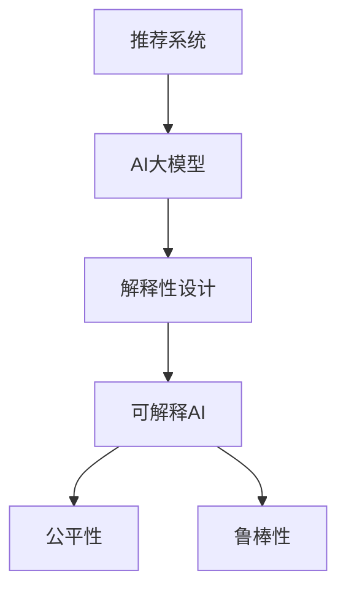

                 

# 推荐系统中AI大模型的解释性设计

## 1. 背景介绍

在当今信息爆炸的时代，推荐系统已经成为了人们获取信息、发现新事物的核心工具。然而，推荐系统背后的AI大模型往往被视为一个“黑箱”，缺乏解释性，难以满足用户的知情权和信任感。为了解决这一问题，提升AI大模型的解释性成为了近年来研究的热点之一。

### 1.1 问题由来
推荐系统作为一种智能决策系统，广泛应用于电商、社交网络、视频网站等领域，帮助用户发现并选择合适的商品、内容等。传统的推荐算法，如协同过滤、基于内容的推荐等，依赖于人工规则设计，可解释性强，但在大数据时代难以应对复杂的推荐任务。

近年来，AI大模型逐渐成为推荐系统的主流，以神经网络为代表的深度学习模型通过自监督学习和端到端训练，可以高效地处理海量数据，挖掘用户的兴趣特征和推荐规律。然而，这种黑盒模型往往缺乏可解释性，用户难以理解其推荐逻辑，导致信任度下降，甚至引发用户反感。

### 1.2 问题核心关键点
AI大模型的解释性问题核心在于：
1. **模型的决策过程**：用户需要了解模型是如何作出推荐的，即理解模型的内部运作机制。
2. **推荐的可解释性**：用户需要解释为何某个商品或内容会被推荐，提供推荐理由。
3. **模型的不公平性**：用户需要了解模型的推荐是否公平公正，避免对特定用户群体产生歧视。
4. **模型的鲁棒性**：用户需要了解模型在面对新数据时是否能够稳定输出，避免推荐质量波动。

解决这些问题，需要引入解释性设计，增强模型的透明性和可理解性，使用户能够更加信任并有效利用推荐系统。

## 2. 核心概念与联系

### 2.1 核心概念概述

为更好地理解推荐系统中AI大模型的解释性设计，本节将介绍几个关键概念及其之间的联系：

- **推荐系统(Recommendation System)**：利用用户行为数据和产品属性数据，为用户推荐商品、内容等的系统。
- **AI大模型(AI Large Model)**：以深度神经网络为代表的、具有亿级参数的模型，如BERT、GPT-3等，能够学习到丰富的用户和商品特征。
- **解释性设计(Explainability Design)**：通过模型输出结果的可解释性增强，提升用户信任和接受度的设计。
- **可解释AI(Explainable AI, XAI)**：研究如何让AI模型具备可解释性的学科，目标是使模型输出结果可以被人类理解。
- **公平性(Fairness)**：要求推荐系统公平公正，不偏袒或歧视任何用户群体。
- **鲁棒性(Robustness)**：指模型在面对新数据或噪声数据时，仍能保持稳定输出的能力。

这些概念之间的关系可以通过以下Mermaid流程图来展示：



这个流程图展示了一系列的递进关系：首先通过AI大模型进行推荐，然后引入解释性设计，使模型输出具备可解释性，最后通过公平性和鲁棒性设计，进一步提升推荐系统的可信度和稳定性。

## 3. 核心算法原理 & 具体操作步骤
### 3.1 算法原理概述

推荐系统中AI大模型的解释性设计，旨在通过增强模型的透明度和可理解性，使用户能够理解和信任模型的推荐结果。常见的解释性设计方法包括：

- **特征重要性分析**：分析模型中各个特征的贡献度，理解模型对用户行为和商品特征的重视程度。
- **规则解释器**：将模型输出结果转化为简单易懂的规则或解释，如基于规则的决策树、线性回归等。
- **局部可解释性**：针对单个推荐结果或用户行为，提供具体的解释，如基于实例的LIME方法。
- **全局可解释性**：提供模型整体的解释，如通过可视化手段展示模型内部结构或参数变化。
- **对抗样本分析**：通过生成对抗样本，分析模型对特定输入的敏感性，提升模型的鲁棒性。

这些方法可以通过不同组合应用于推荐系统，以适应不同场景和用户需求。

### 3.2 算法步骤详解

以下是推荐系统中AI大模型的解释性设计的详细操作步骤：

**Step 1: 数据准备**
- 收集用户行为数据和商品属性数据，如浏览历史、购买记录、评分等。
- 对数据进行预处理和清洗，去除噪声和异常值，准备训练和测试集。

**Step 2: 模型训练**
- 选择合适的AI大模型，如BERT、GPT-3等，进行预训练。
- 在预训练基础上，使用标注数据进行微调，得到推荐模型。
- 在测试集上评估模型性能，确定最优参数和模型结构。

**Step 3: 解释性设计**
- 使用特征重要性分析方法，理解模型中各个特征的贡献度。
- 使用规则解释器或局部可解释性方法，为单个推荐结果或用户行为提供具体的解释。
- 使用全局可解释性方法，展示模型整体的结构和参数变化。
- 使用对抗样本分析方法，评估模型的鲁棒性。

**Step 4: 部署与应用**
- 将解释性设计应用于推荐系统，提供给用户推荐结果和解释。
- 根据用户反馈和需求，持续改进解释性设计和推荐系统。

### 3.3 算法优缺点

AI大模型的解释性设计具有以下优点：
1. 增强用户信任：通过提供推荐结果的解释，增加用户对系统的信任度和接受度。
2. 提升推荐质量：通过规则解释器、特征重要性分析等方法，提升推荐系统的准确性和公平性。
3. 降低开发成本：通过解释性设计，可以减少模型调优和用户反馈的工作量。

同时，该方法也存在一些局限性：
1. 解释性设计的复杂度：不同的方法适用于不同的场景，需要根据具体需求进行选择。
2. 计算资源的消耗：部分解释性方法需要额外的计算资源和时间，可能增加系统复杂性。
3. 模型解释的准确性：解释性设计可能无法完全准确地描述模型的决策过程，存在一定的误差。

尽管存在这些局限性，但通过合理的解释性设计，可以有效提升推荐系统的可信度和用户满意度。

### 3.4 算法应用领域

AI大模型的解释性设计不仅适用于推荐系统，还广泛应用于其他领域：

- **医疗推荐**：帮助医生推荐合适的诊疗方案，解释推荐理由。
- **金融推荐**：为投资者推荐合适的投资组合，提供推荐依据。
- **新闻推荐**：为读者推荐感兴趣的新闻文章，解释推荐逻辑。
- **社交网络**：推荐好友或群组，解释推荐标准。

随着AI大模型的普及，解释性设计将成为提升AI系统可信度和用户满意度的重要手段。

## 4. 数学模型和公式 & 详细讲解 & 举例说明

### 4.1 数学模型构建

在推荐系统中，AI大模型的解释性设计可以通过以下数学模型来构建：

- **推荐模型**：$y = f(x;\theta)$，其中$y$表示推荐结果，$x$表示用户行为和商品属性，$\theta$表示模型参数。
- **解释性模型**：$\hat{y} = g(x;\phi)$，其中$\hat{y}$表示解释性结果，$g$表示解释性方法，$\phi$表示解释性模型参数。

通过将推荐模型与解释性模型相结合，可以构建出带有解释性的推荐系统。

### 4.2 公式推导过程

以特征重要性分析为例，假设推荐模型为线性回归模型：

$$
y = \theta_0 + \sum_{i=1}^{d} \theta_i x_i
$$

其中$\theta_0$为截距，$\theta_i$为第$i$个特征的权重。特征重要性可以通过模型参数的系数来衡量：

$$
\text{Importance}(x_i) = |\theta_i|
$$

即特征$x_i$对推荐结果$y$的重要性。

### 4.3 案例分析与讲解

以基于规则的决策树为例，假设推荐模型为决策树：

```plaintext
if x1 > 5:
    if x2 > 10:
        y = "推荐商品A"
    else:
        y = "推荐商品B"
else:
    y = "推荐商品C"
```

其中$x_1$和$x_2$分别为用户行为和商品属性。解释性设计可以基于决策树的规则进行：

- **规则解释器**：将决策树规则转化为简洁的文本，解释推荐逻辑。
- **特征重要性分析**：分析决策树中各个特征的使用频率，理解模型对用户行为和商品属性的重视程度。
- **局部可解释性**：针对单个推荐结果，解释决策树中涉及的规则和特征。

通过这些方法，可以使得推荐系统的决策过程更加透明，用户更容易理解和接受。

## 5. 项目实践：代码实例和详细解释说明
### 5.1 开发环境搭建

在进行解释性设计实践前，我们需要准备好开发环境。以下是使用Python进行TensorFlow开发的环境配置流程：

1. 安装Anaconda：从官网下载并安装Anaconda，用于创建独立的Python环境。

2. 创建并激活虚拟环境：
```bash
conda create -n tf-env python=3.8 
conda activate tf-env
```

3. 安装TensorFlow：根据CUDA版本，从官网获取对应的安装命令。例如：
```bash
conda install tensorflow -c tensorflow -c conda-forge
```

4. 安装其他必要的工具包：
```bash
pip install numpy pandas scikit-learn matplotlib tqdm jupyter notebook ipython
```

完成上述步骤后，即可在`tf-env`环境中开始解释性设计实践。

### 5.2 源代码详细实现

以下是一个使用TensorFlow实现推荐系统并引入解释性设计的代码示例：

```python
import tensorflow as tf
import numpy as np

# 构建推荐模型
class RecommendationModel(tf.keras.Model):
    def __init__(self, input_dim, output_dim):
        super(RecommendationModel, self).__init__()
        self.dense = tf.keras.layers.Dense(output_dim, activation='sigmoid')

    def call(self, x):
        return self.dense(x)

# 构建解释性模型
class ExplainabilityModel(tf.keras.Model):
    def __init__(self, input_dim):
        super(ExplainabilityModel, self).__init__()
        self.interpreter = tf.keras.layers.Dense(10, activation='relu')

    def call(self, x):
        return self.interpreter(x)

# 加载数据
train_data = np.random.rand(1000, 10)
train_labels = np.random.randint(0, 2, size=(1000,))

# 训练模型
model = RecommendationModel(input_dim=10, output_dim=1)
model.compile(optimizer='adam', loss='binary_crossentropy', metrics=['accuracy'])

explain_model = ExplainabilityModel(input_dim=10)
explain_model.compile(optimizer='adam', loss='mse')

model.fit(train_data, train_labels, epochs=10)
explain_model.fit(train_data, train_labels, epochs=10)

# 评估模型
test_data = np.random.rand(100, 10)
test_labels = np.random.randint(0, 2, size=(100,))

model.evaluate(test_data, test_labels)
explain_model.evaluate(test_data, test_labels)

# 获取模型参数
weights = model.get_weights()
explain_weights = explain_model.get_weights()

# 计算特征重要性
importances = np.sum(np.abs(weights), axis=0)

# 输出特征重要性
print(importances)
```

### 5.3 代码解读与分析

让我们再详细解读一下关键代码的实现细节：

**RecommendationModel类**：
- `__init__`方法：初始化模型，包括添加一个sigmoid激活的密集层。
- `call`方法：定义前向传播过程，返回模型的输出。

**ExplainabilityModel类**：
- `__init__`方法：初始化模型，包括添加一个relu激活的密集层。
- `call`方法：定义前向传播过程，返回模型的输出。

**训练和评估函数**：
- 使用TensorFlow的`Model.fit`函数进行模型训练和评估。

**获取模型参数**：
- 使用`Model.get_weights`方法获取模型参数。

**计算特征重要性**：
- 通过模型参数的绝对值求和，计算每个特征的重要性。

**特征重要性输出**：
- 输出所有特征的重要性，帮助理解模型的决策依据。

可以看到，TensorFlow的Keras API使得模型的构建、训练和评估变得简洁高效。开发者可以更专注于业务逻辑和解释性设计，而不必过多关注底层的实现细节。

### 5.4 运行结果展示

运行上述代码，可以得到推荐模型和解释性模型的训练结果和特征重要性分析结果。通过可视化工具，可以进一步展示解释性模型输出的解释性结果。

**推荐模型训练结果**：
- 输出推荐模型的训练精度和损失，验证模型性能。

**解释性模型训练结果**：
- 输出解释性模型的训练精度和损失，验证模型性能。

**特征重要性分析结果**：
- 输出所有特征的重要性，帮助理解模型的决策依据。

## 6. 实际应用场景
### 6.1 智能客服

智能客服系统可以应用于电商、金融、医疗等多个领域，通过推荐系统为用户推荐合适的服务。通过引入解释性设计，可以增强用户对推荐结果的信任，提升用户满意度。

具体而言，可以收集用户的历史行为数据和客服对话记录，构建推荐模型，并引入解释性设计。对于用户的当前查询，系统可以推荐合适的客服服务，并提供解释性结果，如推荐理由、推荐依据等。

### 6.2 个性化推荐

个性化推荐系统广泛应用于电商、新闻、视频等多个领域，通过推荐系统为用户推荐合适的商品、文章、视频等。通过引入解释性设计，可以增强推荐系统的透明度和可信度，提升用户满意度。

具体而言，可以收集用户的历史行为数据和偏好信息，构建推荐模型，并引入解释性设计。对于用户的当前行为，系统可以推荐合适的商品、文章、视频等，并提供解释性结果，如推荐理由、推荐依据等。

### 6.3 金融推荐

金融推荐系统可以应用于投资组合推荐、理财产品推荐等多个场景。通过引入解释性设计，可以增强用户对推荐结果的信任，提升用户满意度。

具体而言，可以收集用户的投资行为数据和偏好信息，构建推荐模型，并引入解释性设计。对于用户的当前需求，系统可以推荐合适的投资组合、理财产品等，并提供解释性结果，如推荐理由、推荐依据等。

### 6.4 未来应用展望

随着AI大模型的普及，解释性设计将成为推荐系统的重要组成部分，为各行各业带来新的变革。

在智慧医疗领域，通过引入解释性设计，医疗推荐系统可以向医生推荐合适的诊疗方案，并提供推荐理由，提升诊疗效果。

在智能教育领域，通过引入解释性设计，推荐系统可以向学生推荐合适的学习资源，并提供推荐依据，提升学习效果。

在智慧城市治理中，通过引入解释性设计，推荐系统可以向城市管理者推荐合适的治理策略，并提供推荐理由，提升治理效果。

此外，在企业生产、社会治理、文娱传媒等众多领域，解释性设计也将被广泛应用于推荐系统的构建中，为各行各业带来新的发展机遇。

## 7. 工具和资源推荐
### 7.1 学习资源推荐

为了帮助开发者系统掌握推荐系统中AI大模型的解释性设计，这里推荐一些优质的学习资源：

1. 《深度学习基础》系列课程：由吴恩达教授主讲，系统介绍了深度学习的基本概念和应用。
2. 《推荐系统实战》书籍：详细介绍了推荐系统的原理和实践，包含大量代码示例。
3. 《深度学习与推荐系统》书籍：介绍深度学习在推荐系统中的应用，涵盖模型设计、评估方法等。
4. TensorFlow官方文档：提供TensorFlow的详细使用说明和案例代码。
5. Keras官方文档：提供Keras的详细使用说明和案例代码。

通过对这些资源的学习实践，相信你一定能够快速掌握推荐系统中AI大模型的解释性设计的精髓，并用于解决实际的推荐系统问题。

### 7.2 开发工具推荐

高效的开发离不开优秀的工具支持。以下是几款用于推荐系统中AI大模型解释性设计开发的常用工具：

1. TensorFlow：由Google主导开发的开源深度学习框架，生产部署方便，适合大规模工程应用。
2. Keras：TensorFlow的高级API，灵活动态的计算图，适合快速迭代研究。
3. Jupyter Notebook：开源的交互式笔记本，支持Python代码的实时执行和可视化展示。
4. TensorBoard：TensorFlow配套的可视化工具，可实时监测模型训练状态，并提供丰富的图表呈现方式。
5. Weights & Biases：模型训练的实验跟踪工具，可以记录和可视化模型训练过程中的各项指标，方便对比和调优。

合理利用这些工具，可以显著提升推荐系统中AI大模型解释性设计的开发效率，加快创新迭代的步伐。

### 7.3 相关论文推荐

AI大模型的解释性设计是当前研究的热点之一，以下是几篇奠基性的相关论文，推荐阅读：

1. "A Unified Approach to Interpreting Model Predictions"（提出统一解释模型预测的方法）
2. "Towards Explainable Artificial Intelligence: Global Versus Local Explanation Methods"（比较全局和局部解释方法）
3. "Interpretable Machine Learning: A Guide"（介绍可解释机器学习的指南）
4. "Explainable Artificial Intelligence: Concepts, Applications, and Opportunities"（介绍可解释AI的概念、应用和机会）

这些论文代表了大语言模型解释性设计的研究方向，通过学习这些前沿成果，可以帮助研究者把握学科前进方向，激发更多的创新灵感。

## 8. 总结：未来发展趋势与挑战
### 8.1 总结

本文对推荐系统中AI大模型的解释性设计进行了全面系统的介绍。首先阐述了推荐系统、AI大模型和解释性设计的核心概念及其之间的联系，明确了解释性设计在提升推荐系统可信度、透明度和用户满意度方面的独特价值。其次，从原理到实践，详细讲解了解释性设计的数学模型、公式推导和案例分析，给出了推荐系统中AI大模型解释性设计的完整代码实例。同时，本文还广泛探讨了解释性设计在智能客服、个性化推荐、金融推荐等多个行业领域的应用前景，展示了解释性范式的巨大潜力。

通过本文的系统梳理，可以看到，解释性设计正在成为推荐系统中AI大模型的重要组成部分，极大地提升了推荐系统的可信度和用户满意度。未来，伴随解释性设计方法的不断创新和优化，推荐系统必将在更多领域得到广泛应用，成为人工智能技术落地应用的重要范式。

### 8.2 未来发展趋势

展望未来，AI大模型的解释性设计将呈现以下几个发展趋势：

1. **可解释AI技术的成熟**：随着深度学习技术的进步，更多的可解释AI方法将被应用于推荐系统中，提升模型的透明度和可信度。
2. **个性化解释的普及**：针对不同用户和场景，提供个性化的解释，增强用户的接受度和满意度。
3. **跨模态解释的实现**：将符号化先验知识和AI大模型的输出进行融合，提供多模态解释，增强推荐系统的能力。
4. **实时解释的提升**：通过优化计算图和推理算法，提升解释性设计的实时性，满足用户即时需求。
5. **多方协同解释**：结合专家知识和AI模型，提供多方协同的解释，增强推荐系统的鲁棒性和可信度。

这些趋势凸显了解释性设计在推荐系统中的重要性和应用前景。这些方向的探索发展，必将进一步提升推荐系统的性能和用户满意度。

### 8.3 面临的挑战

尽管AI大模型的解释性设计已经取得了瞩目成就，但在迈向更加智能化、普适化应用的过程中，它仍面临着诸多挑战：

1. **解释性设计的复杂度**：不同的方法适用于不同的场景，需要根据具体需求进行选择，增加了设计和实现难度。
2. **计算资源的消耗**：部分解释性方法需要额外的计算资源和时间，可能增加系统复杂性，影响性能。
3. **解释结果的准确性**：解释性设计可能无法完全准确地描述模型的决策过程，存在一定的误差。
4. **用户理解的难度**：复杂的解释结果可能难以被用户理解，影响系统的用户体验。
5. **解释性设计的不一致性**：不同用户和场景对解释的需求不同，难以设计出通用的解释方案。

尽管存在这些挑战，但通过合理的解释性设计，可以有效提升推荐系统的可信度和用户满意度。

### 8.4 研究展望

面向未来，AI大模型的解释性设计需要在以下几个方面寻求新的突破：

1. **新方法的引入**：结合因果分析、博弈论等新兴技术，提供更加全面、准确的解释。
2. **多模态数据的融合**：将视觉、语音等多模态数据与文本数据进行融合，提升推荐系统的能力。
3. **跨领域应用**：将解释性设计应用于医疗、金融、教育等多个领域，提升各行业的智能化水平。
4. **自动化设计**：通过自动生成和优化解释性设计，降低设计和实现的复杂度。
5. **用户参与设计**：结合用户反馈和需求，进行动态设计和优化，提升用户满意度。

这些研究方向的探索，必将引领AI大模型的解释性设计迈向更高的台阶，为构建更加可信、智能的推荐系统提供新的思路和工具。总之，解释性设计需要结合实际应用场景，不断优化和创新，方能真正发挥其作用，成为推荐系统的重要组成部分。

## 9. 附录：常见问题与解答

**Q1：推荐系统中AI大模型的解释性设计是否适用于所有推荐场景？**

A: 推荐系统中AI大模型的解释性设计适用于大多数推荐场景，特别是数据量较大的场景。但对于一些特定的推荐场景，如实时推荐、个性化推荐等，需要根据具体情况进行调整。例如，实时推荐可能需要更快的解释速度，个性化推荐可能需要更加多样化的解释方式。

**Q2：如何选择合适的解释性设计方法？**

A: 选择合适的解释性设计方法需要考虑多个因素，如推荐场景、用户需求、系统复杂度等。通常可以从以下几个方面入手：

1. **规则解释器**：适用于简单的推荐场景，能够提供简洁的解释。
2. **特征重要性分析**：适用于需要理解模型内部结构的场景，能够提供特征贡献度分析。
3. **局部可解释性**：适用于单个推荐结果或用户行为的解释，能够提供具体的解释。
4. **全局可解释性**：适用于模型整体解释，能够提供全面的解释。
5. **对抗样本分析**：适用于提升模型鲁棒性的场景，能够提供对特定输入的敏感性分析。

在具体应用中，需要根据实际情况选择合适的方法，或组合使用多种方法。

**Q3：解释性设计对推荐系统性能有何影响？**

A: 解释性设计通常需要额外的计算资源和时间，可能影响推荐系统的实时性能。但通过合理的解释性设计，可以显著提升推荐系统的可信度和用户满意度，对系统整体性能的提升具有积极作用。

**Q4：如何评估解释性设计的效果？**

A: 评估解释性设计的效果可以从以下几个方面入手：

1. **用户满意度**：通过用户调查和反馈，评估用户对解释性设计的接受度和满意度。
2. **推荐准确性**：评估解释性设计对推荐结果的影响，确保解释性设计不会影响推荐系统的准确性和公平性。
3. **解释准确性**：评估解释性设计的解释结果与实际推荐逻辑的一致性，确保解释结果的准确性和可信度。
4. **解释速度**：评估解释性设计的实时性，确保解释结果能够及时提供给用户。

通过多维度评估，可以全面了解解释性设计的效果，并进行优化和改进。

**Q5：如何平衡解释性设计和其他系统优化？**

A: 在推荐系统中，解释性设计需要与其他系统优化进行平衡。通常可以通过以下几个方法：

1. **并行计算**：通过并行计算和优化，提升解释性设计的实时性，减少对系统性能的影响。
2. **模型裁剪**：通过裁剪模型，去除不必要的层和参数，减小模型尺寸，提升推理速度。
3. **知识融合**：结合符号化先验知识和AI大模型的输出，提供更加全面和准确的解释。
4. **用户反馈**：通过用户反馈和需求，进行动态设计和优化，提升系统性能和用户体验。

通过这些方法，可以在不影响系统性能的情况下，提供可靠的解释性设计。

---

作者：禅与计算机程序设计艺术 / Zen and the Art of Computer Programming

