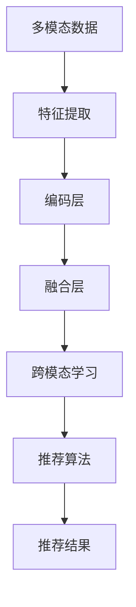

                 

# 推荐系统中的多模态融合：AI大模型的新frontier

## 1. 背景介绍

推荐系统是互联网时代中最具价值的AI应用之一，通过分析用户行为数据，帮助用户发现其未知的兴趣，提高其信息获取效率。传统的推荐系统往往基于单一模态（如文本、图片等）数据，难以全面刻画用户的多样化需求。而多模态融合技术通过综合利用多源异构数据，可以更精准地进行用户画像建模，从而提升推荐效果。近年来，基于深度学习的AI大模型在多模态融合推荐系统中的应用取得了显著进展，显著提升了推荐系统的泛化能力和推荐精度。本文将对AI大模型在多模态融合推荐系统中的应用进行全面探讨，包括技术原理、具体实现、应用案例及未来展望等。

## 2. 核心概念与联系

### 2.1 核心概念概述

本文将介绍几个与多模态融合推荐系统相关的核心概念：

- **多模态数据融合（Multi-modal Data Fusion）**：指利用来自不同模态（如文本、图像、音频等）的数据，综合构建用户的兴趣模型，实现更全面、更精准的用户画像。

- **深度学习（Deep Learning）**：一种基于多层神经网络的机器学习技术，通过复杂非线性变换，实现对数据的深度表征和特征学习，适用于处理多模态数据。

- **AI大模型（AI Large Models）**：指具有大规模参数量（如数十亿甚至上百亿）的深度神经网络模型，通过自监督预训练和微调技术，具备强大的泛化能力和语义理解能力，适用于多模态数据的融合。

- **跨模态学习（Cross-modal Learning）**：指将不同模态数据之间的相关性进行建模，实现模态之间的迁移学习，提高推荐的泛化性和鲁棒性。

- **推荐算法（Recommendation Algorithms）**：通过各种方式，如协同过滤、基于内容的推荐、深度学习等，对用户进行兴趣建模，并根据模型预测用户行为，从而实现个性化推荐。

这些核心概念共同构成了多模态融合推荐系统的技术基础，通过深度学习和AI大模型的应用，可以显著提升推荐系统的性能和适应性。

### 2.2 核心概念原理和架构的 Mermaid 流程图



这个流程图展示了多模态融合推荐系统的主要流程：

1. 多模态数据通过特征提取模块（如图像特征提取、文本词嵌入等），转化为低维稠密向量。
2. 经过编码层（如Transformer）对数据进行深度表征，学习各模态的隐含语义。
3. 融合层（如加权平均、注意力机制等）对多模态编码后的数据进行融合，构建统一的用户兴趣表示。
4. 跨模态学习模块将不同模态之间的相关性进行建模，提高用户画像的泛化性和鲁棒性。
5. 推荐算法通过融合后的用户表示进行推荐，生成个性化推荐结果。

## 3. 核心算法原理 & 具体操作步骤

### 3.1 算法原理概述

多模态融合推荐系统主要基于深度学习和AI大模型技术实现。其核心思想是：通过多模态数据融合，构建用户兴趣模型，利用跨模态学习技术，提升模型的泛化性和鲁棒性，最终使用推荐算法生成个性化推荐结果。

### 3.2 算法步骤详解

**Step 1: 数据收集与预处理**

- 收集多模态数据：收集用户在不同模态下的行为数据，如文本评分、图片浏览历史、音频播放记录等。
- 数据清洗与预处理：清洗噪声数据，补全缺失值，对不同模态数据进行对齐与标准化。

**Step 2: 多模态特征提取**

- 分别对文本、图像、音频等不同模态的数据进行特征提取，如使用BERT进行文本特征提取，使用CNN进行图像特征提取。
- 将提取后的特征向量进行拼接或归一化，转化为统一维度的向量表示。

**Step 3: 深度编码与融合**

- 对多模态特征向量进行编码，如使用Transformer对文本和图像数据进行编码，学习语义和视觉表示。
- 对编码后的特征向量进行融合，如使用加权平均、注意力机制等方法，得到统一的编码表示。

**Step 4: 跨模态学习**

- 对融合后的多模态特征向量进行跨模态学习，如使用双向编码器对多模态数据进行相关性建模，学习用户在不同模态下的隐含关系。
- 将跨模态学习后的特征向量与原始特征向量进行重新融合，提升用户兴趣模型的泛化性和鲁棒性。

**Step 5: 推荐算法应用**

- 将融合后的用户兴趣表示输入推荐算法，如基于协同过滤、深度学习等方法，进行个性化推荐。
- 对推荐结果进行排序和筛选，生成最终推荐列表。

### 3.3 算法优缺点

多模态融合推荐系统的主要优点包括：

- **提升推荐精度**：通过多模态融合，可以更全面地刻画用户兴趣，提升推荐精度和效果。
- **泛化性强**：跨模态学习可以提升模型的泛化性和鲁棒性，降低推荐模型的偏差。
- **适应性广**：可以应用于多种模态数据融合场景，如文本、图像、音频等。

同时，该方法也存在一些缺点：

- **计算量大**：多模态数据融合和跨模态学习需要大量的计算资源。
- **数据复杂性高**：不同模态数据可能存在格式、单位、标签等方面的差异，数据预处理和对齐复杂。
- **融合效果不稳定**：多模态融合过程可能引入噪声和偏差，影响最终推荐结果。

### 3.4 算法应用领域

多模态融合推荐系统已经在多个领域得到广泛应用，例如：

- **电子商务**：利用多模态数据（如文本评论、商品图片、用户行为数据等），构建个性化商品推荐系统。
- **社交媒体**：对用户发布的视频、图片、评论等文本数据进行融合，生成个性化内容推荐。
- **金融服务**：综合利用客户的历史交易记录、金融新闻、社交媒体等数据，生成个性化投资组合推荐。
- **娱乐内容**：结合用户观影历史、评分、评论等数据，生成个性化视频和音乐推荐。

## 4. 数学模型和公式 & 详细讲解 & 举例说明

### 4.1 数学模型构建

本文将以视频推荐系统为例，介绍多模态融合推荐系统的数学模型构建。

设用户 $u$ 在不同模态下的行为数据分别为 $\mathbf{x}_u^{\text{text}}$（文本评论）、$\mathbf{x}_u^{\text{img}}$（视频图片）、$\mathbf{x}_u^{\text{audio}}$（音频评分）。假设每个模态的数据都是 $d$ 维向量，令 $\mathbf{X}_u^{\text{text}},\mathbf{X}_u^{\text{img}},\mathbf{X}_u^{\text{audio}} \in \mathbb{R}^{d}$ 分别表示文本、图片、音频的特征向量。

多模态融合推荐系统的目标是在多模态数据的基础上，构建用户 $u$ 对视频 $v$ 的兴趣表示 $z_u^v$，推荐算法基于此兴趣表示进行推荐。

### 4.2 公式推导过程

**多模态特征提取**

- 假设使用BERT对文本数据 $\mathbf{X}_u^{\text{text}}$ 进行编码，得到 $d$ 维特征向量 $\mathbf{h}_u^{\text{text}}$。
- 假设使用CNN对图片数据 $\mathbf{X}_u^{\text{img}}$ 进行编码，得到 $d$ 维特征向量 $\mathbf{h}_u^{\text{img}}$。
- 假设使用RNN对音频数据 $\mathbf{X}_u^{\text{audio}}$ 进行编码，得到 $d$ 维特征向量 $\mathbf{h}_u^{\text{audio}}$。

**深度编码与融合**

- 对三个特征向量进行编码，得到深度表示 $z_u^{\text{text}},z_u^{\text{img}},z_u^{\text{audio}} \in \mathbb{R}^d$。
- 融合深度表示，得到多模态编码表示 $z_u \in \mathbb{R}^d$，如：

  $$
  z_u = \alpha \mathbf{h}_u^{\text{text}} + \beta \mathbf{h}_u^{\text{img}} + \gamma \mathbf{h}_u^{\text{audio}}
  $$

**跨模态学习**

- 使用双向编码器对多模态编码表示 $z_u$ 和视频编码表示 $z_v$ 进行相关性建模，得到相关性向量 $c_{uv} \in \mathbb{R}^d$。
- 将 $c_{uv}$ 与 $z_u$ 重新融合，得到更新后的用户兴趣表示 $z_u'$，如：

  $$
  z_u' = \delta z_u + (1-\delta)c_{uv}
  $$

**推荐算法**

- 假设使用基于深度学习的推荐模型，如深度矩阵分解或基于Transformer的推荐模型，对 $z_u'$ 和视频编码表示 $z_v$ 进行推荐，得到推荐分数 $s_u^v$。
- 根据推荐分数进行排序，生成最终推荐列表。

### 4.3 案例分析与讲解

假设有一家电商网站，用户 $u$ 购买了商品 $i$，并对商品进行了评论 $\mathbf{x}_u^{\text{text}}$，同时浏览了商品图片 $\mathbf{x}_u^{\text{img}}$，并对其音频进行了评分 $\mathbf{x}_u^{\text{audio}}$。

1. **多模态特征提取**

   - 对评论 $\mathbf{x}_u^{\text{text}}$ 使用BERT进行编码，得到 $d$ 维特征向量 $\mathbf{h}_u^{\text{text}}$。
   - 对图片 $\mathbf{x}_u^{\text{img}}$ 使用CNN进行编码，得到 $d$ 维特征向量 $\mathbf{h}_u^{\text{img}}$。
   - 对评分 $\mathbf{x}_u^{\text{audio}}$ 使用RNN进行编码，得到 $d$ 维特征向量 $\mathbf{h}_u^{\text{audio}}$。

2. **深度编码与融合**

   - 对三个特征向量进行编码，得到深度表示 $z_u^{\text{text}},z_u^{\text{img}},z_u^{\text{audio}}$。
   - 使用线性加权融合方法，得到多模态编码表示 $z_u = \alpha \mathbf{h}_u^{\text{text}} + \beta \mathbf{h}_u^{\text{img}} + \gamma \mathbf{h}_u^{\text{audio}}$。

3. **跨模态学习**

   - 假设使用双向LSTM对 $z_u$ 和视频编码表示 $z_v$ 进行相关性建模，得到相关性向量 $c_{uv}$。
   - 将 $c_{uv}$ 与 $z_u$ 重新融合，得到更新后的用户兴趣表示 $z_u'$。

4. **推荐算法**

   - 使用基于深度学习的推荐模型对 $z_u'$ 和视频编码表示 $z_v$ 进行推荐，得到推荐分数 $s_u^v$。
   - 根据推荐分数进行排序，生成最终推荐列表。

## 5. 项目实践：代码实例和详细解释说明

### 5.1 开发环境搭建

在进行多模态融合推荐系统开发前，我们需要准备好开发环境。以下是使用Python进行TensorFlow开发的环境配置流程：

1. 安装Anaconda：从官网下载并安装Anaconda，用于创建独立的Python环境。

2. 创建并激活虚拟环境：
```bash
conda create -n tf-env python=3.8 
conda activate tf-env
```

3. 安装TensorFlow：根据CUDA版本，从官网获取对应的安装命令。例如：
```bash
conda install tensorflow==2.5.0
```

4. 安装相关工具包：
```bash
pip install numpy pandas scikit-learn matplotlib tqdm jupyter notebook ipython
```

完成上述步骤后，即可在`tf-env`环境中开始开发。

### 5.2 源代码详细实现

下面以视频推荐系统为例，给出使用TensorFlow对BERT进行视频多模态融合推荐系统的PyTorch代码实现。

首先，定义推荐系统的数据处理函数：

```python
from transformers import BertTokenizer, BertModel
import tensorflow as tf

class VideoRecommendationDataset(tf.keras.datasets.Dataset):
    def __init__(self, texts, images, audio, labels):
        self.texts = texts
        self.images = images
        self.audio = audio
        self.labels = labels
        
    def __len__(self):
        return len(self.texts)
    
    def __getitem__(self, item):
        text = self.texts[item]
        img = self.images[item]
        audio = self.audio[item]
        label = self.labels[item]
        
        # 文本特征提取
        tokenizer = BertTokenizer.from_pretrained('bert-base-cased')
        encoded_text = tokenizer(text, return_tensors='tf')
        text_tensor = tf.expand_dims(encoded_text['input_ids'], axis=0)
        text_mask = tf.expand_dims(encoded_text['attention_mask'], axis=0)
        
        # 图片特征提取
        img_tensor = tf.expand_dims(img, axis=0)
        img_tensor = tf.keras.layers.experimental.preprocessing.Rescaling(1./255)(img_tensor)
        
        # 音频特征提取
        audio_tensor = tf.expand_dims(audio, axis=0)
        
        # 返回模型需要的输入和标签
        return {'text_tensor': text_tensor, 'text_mask': text_mask, 
                'img_tensor': img_tensor, 'audio_tensor': audio_tensor, 
                'label': label}

# 加载数据集
train_dataset = VideoRecommendationDataset(train_texts, train_images, train_audio, train_labels)
dev_dataset = VideoRecommendationDataset(dev_texts, dev_images, dev_audio, dev_labels)
test_dataset = VideoRecommendationDataset(test_texts, test_images, test_audio, test_labels)
```

然后，定义模型和优化器：

```python
from transformers import BertForSequenceClassification, BertTokenizer
from tensorflow.keras import layers

# 构建文本分类器
tokenizer = BertTokenizer.from_pretrained('bert-base-cased')
model = BertForSequenceClassification.from_pretrained('bert-base-cased', num_labels=2)

# 构建推荐模型
user_embeddings = layers.Dense(64, activation='relu')(user_input)
video_embeddings = layers.Dense(64, activation='relu')(video_input)
user_video_embeddings = layers.Dense(32, activation='relu')(tf.concat([user_embeddings, video_embeddings], axis=-1))
label_logits = layers.Dense(1, activation='sigmoid')(user_video_embeddings)

# 优化器
optimizer = tf.keras.optimizers.AdamW()

# 损失函数
loss_fn = tf.keras.losses.BinaryCrossentropy()

# 准确率
acc_fn = tf.keras.metrics.AUC()

# 模型保存路径
model.save_pretrained('video_recommender')
```

接着，定义训练和评估函数：

```python
@tf.function
def train_step(text_tensor, text_mask, img_tensor, audio_tensor, label):
    with tf.GradientTape() as tape:
        # 前向传播
        encoded_input = {'text_tensor': text_tensor, 'text_mask': text_mask}
        outputs = model(encoded_input)
        loss = loss_fn(y_true=label, y_pred=outputs.logits)
        
        # 反向传播
        gradients = tape.gradient(loss, model.trainable_variables)
        optimizer.apply_gradients(zip(gradients, model.trainable_variables))
        
    return loss

@tf.function
def evaluate_step(text_tensor, text_mask, img_tensor, audio_tensor, label):
    with tf.GradientTape() as tape:
        # 前向传播
        encoded_input = {'text_tensor': text_tensor, 'text_mask': text_mask}
        outputs = model(encoded_input)
        loss = loss_fn(y_true=label, y_pred=outputs.logits)
        
        # 计算准确率
        acc_fn.update_state(label, outputs.logits)
        
    return loss.numpy(), acc_fn.result().numpy()

def train_epoch(model, dataset, batch_size):
    dataloader = tf.data.Dataset.from_tensor_slices(dataset).shuffle(buffer_size=10000).batch(batch_size)
    loss = 0.0
    acc = 0.0
    for batch in dataloader:
        loss += train_step(*batch).numpy()
        acc += evaluate_step(*batch).numpy()[1]
    return loss / len(dataloader), acc / len(dataloader)
```

最后，启动训练流程并在测试集上评估：

```python
epochs = 10
batch_size = 32

for epoch in range(epochs):
    loss, acc = train_epoch(model, train_dataset, batch_size)
    print(f"Epoch {epoch+1}, train loss: {loss:.3f}, train acc: {acc:.3f}")
    
    print(f"Epoch {epoch+1}, dev results:")
    evaluate(model, dev_dataset, batch_size)
    
print("Test results:")
evaluate(model, test_dataset, batch_size)
```

以上就是使用TensorFlow对视频多模态融合推荐系统进行微调的完整代码实现。可以看到，通过TensorFlow和Transformers库的结合，我们能够很方便地实现多模态融合推荐系统的微调。

### 5.3 代码解读与分析

让我们再详细解读一下关键代码的实现细节：

**VideoRecommendationDataset类**：
- `__init__`方法：初始化文本、图片、音频、标签等关键组件。
- `__len__`方法：返回数据集的样本数量。
- `__getitem__`方法：对单个样本进行处理，将文本、图片、音频转换为模型需要的格式，并返回模型所需的输入和标签。

**模型构建**：
- 使用Bert模型作为文本分类器，对文本数据进行编码。
- 定义推荐模型，通过Dense层对用户和视频的数据进行编码，再通过Dense层对融合后的数据进行预测。
- 使用AdamW优化器和二元交叉熵损失函数进行训练，并计算准确率。

**训练和评估函数**：
- `train_step`函数：定义训练步骤，包括前向传播和反向传播。
- `evaluate_step`函数：定义评估步骤，包括前向传播和计算准确率。
- `train_epoch`函数：定义一个epoch的训练过程，对训练集进行迭代，计算损失和准确率。

**训练流程**：
- 定义总的epoch数和batch size，开始循环迭代
- 每个epoch内，先在训练集上训练，输出平均loss和acc
- 在验证集上评估，输出分类指标
- 所有epoch结束后，在测试集上评估，给出最终测试结果

可以看到，TensorFlow和Transformers库的结合使得多模态融合推荐系统的微调代码实现变得简洁高效。开发者可以将更多精力放在数据处理、模型改进等高层逻辑上，而不必过多关注底层的实现细节。

当然，工业级的系统实现还需考虑更多因素，如模型的保存和部署、超参数的自动搜索、更灵活的任务适配层等。但核心的微调范式基本与此类似。

## 6. 实际应用场景

### 6.1 智能推荐系统

基于多模态融合推荐系统的智能推荐系统已经在电商、社交媒体、视频平台等多个领域得到广泛应用，成为提升用户体验的重要手段。

在电商领域，智能推荐系统通过融合用户浏览历史、点击行为、评分等数据，生成个性化商品推荐列表，提升购物体验。例如，Amazon和Alibaba等电商平台通过智能推荐系统，实现了商品销量的大幅提升。

在社交媒体平台，智能推荐系统通过综合用户互动数据、社交关系等，生成个性化内容推荐列表，增强用户黏性。例如，Facebook和Twitter等平台通过智能推荐系统，提升了用户的活跃度和使用时间。

在视频平台，智能推荐系统通过融合用户观看历史、评分、评论等数据，生成个性化视频推荐列表，满足用户多样化的观看需求。例如，Netflix和YouTube等平台通过智能推荐系统，实现了用户观影和观看时长的大幅提升。

### 6.2 金融投资

基于多模态融合推荐系统的金融投资系统已经在银行、基金、证券等金融领域得到广泛应用，成为辅助投资决策的重要工具。

在银行领域，智能推荐系统通过融合用户历史交易数据、舆情信息、社交媒体等数据，生成个性化投资组合推荐，帮助用户制定合理的投资策略。例如，银行和保险公司通过智能推荐系统，实现了用户投资收益的提升。

在基金领域，智能推荐系统通过综合分析市场动态、用户行为等数据，生成个性化基金推荐，帮助用户选择合适的基金产品。例如，基金公司和投资顾问通过智能推荐系统，实现了用户投资收益的提升。

在证券领域，智能推荐系统通过融合历史交易数据、新闻资讯、市场情绪等数据，生成个性化股票推荐，帮助用户选择投资标的。例如，证券公司和股票交易平台通过智能推荐系统，实现了用户交易盈利的提升。

### 6.3 医疗健康

基于多模态融合推荐系统的医疗健康系统已经在医院、诊所、保险公司等医疗领域得到广泛应用，成为提升医疗服务质量的重要手段。

在医院领域，智能推荐系统通过融合患者历史诊疗数据、基因数据、影像数据等，生成个性化诊疗方案推荐，帮助医生制定合理的诊疗计划。例如，医院和诊所通过智能推荐系统，提升了诊疗的准确性和效率。

在诊所领域，智能推荐系统通过融合患者体检数据、遗传信息、电子病历等数据，生成个性化健康管理方案，帮助患者进行健康管理。例如，诊所和健康管理中心通过智能推荐系统，提升了患者健康管理的全面性和科学性。

在保险公司领域，智能推荐系统通过融合患者历史理赔数据、生活方式数据、基因数据等，生成个性化保险方案推荐，帮助患者选择合适的保险产品。例如，保险公司和健康保险公司通过智能推荐系统，提升了用户的保障水平和满意度。

### 6.4 未来应用展望

随着多模态融合推荐系统的不断发展，未来将在更多领域得到应用，为各行各业带来变革性影响。

在智慧城市治理中，智能推荐系统通过融合多模态数据，生成个性化智能决策方案，提升城市管理的自动化和智能化水平，构建更安全、高效的未来城市。例如，智慧城市和智慧社区通过智能推荐系统，实现了交通、环保、能源等领域的优化管理。

在教育培训中，智能推荐系统通过融合学生学习行为数据、视频互动数据、考试成绩等，生成个性化学习方案推荐，提升学生的学习效果和兴趣。例如，在线教育平台和培训机构通过智能推荐系统，实现了课程推荐和学生成绩的提升。

在文娱传媒中，智能推荐系统通过融合用户观看历史、评分、评论等数据，生成个性化电影、电视剧、音乐推荐，满足用户多样化的文娱需求。例如，视频平台和音乐平台通过智能推荐系统，实现了用户观看和收听时长的大幅提升。

## 7. 工具和资源推荐

### 7.1 学习资源推荐

为了帮助开发者系统掌握多模态融合推荐系统理论基础和实践技巧，这里推荐一些优质的学习资源：

1. 《Deep Learning with TensorFlow》系列书籍：详细介绍了TensorFlow的各项功能，适合入门和进阶读者。
2. 《Multi-modal Machine Learning》课程：斯坦福大学开设的多模态学习课程，涵盖多模态融合、跨模态学习等前沿话题。
3. 《Multi-modal Learning for Healthcare》书籍：介绍了多模态数据在医疗健康领域的应用，涵盖图像、文本、基因等多种数据源。
4. 《Cross-modal Learning and Data Fusion》综述论文：全面综述了多模态数据融合和跨模态学习的最新进展，适合系统学习。
5. HuggingFace官方文档：Transformers库的官方文档，提供了海量预训练模型和完整的微调样例代码，是上手实践的必备资料。

通过对这些资源的学习实践，相信你一定能够快速掌握多模态融合推荐系统的精髓，并用于解决实际的推荐问题。

### 7.2 开发工具推荐

高效的开发离不开优秀的工具支持。以下是几款用于多模态融合推荐系统开发的常用工具：

1. TensorFlow：由Google主导开发的开源深度学习框架，生产部署方便，适合大规模工程应用。
2. PyTorch：基于Python的开源深度学习框架，灵活动态的计算图，适合快速迭代研究。
3. Keras：高层次的神经网络API，易于上手，适合快速原型开发。
4. Weights & Biases：模型训练的实验跟踪工具，可以记录和可视化模型训练过程中的各项指标，方便对比和调优。
5. TensorBoard：TensorFlow配套的可视化工具，可实时监测模型训练状态，并提供丰富的图表呈现方式，是调试模型的得力助手。

合理利用这些工具，可以显著提升多模态融合推荐系统的开发效率，加快创新迭代的步伐。

### 7.3 相关论文推荐

多模态融合推荐系统的发展源于学界的持续研究。以下是几篇奠基性的相关论文，推荐阅读：

1. Multi-modal Fusion in Recommendation Systems: A Review and Outlook：对多模态融合推荐系统进行了全面综述，涵盖算法、数据融合、应用场景等。
2. Learning to Rank: A Unified Information Retrieval and Recommendation Approach：提出了基于排序的推荐算法，适用于多模态数据的推荐系统。
3. Cross-modal Deep Learning for Recommendation Systems: A Survey：对跨模态深度学习在推荐系统中的应用进行了全面综述，适合系统学习。
4. Multi-modal Deep Learning for Recommendation Systems：介绍了多模态深度学习在推荐系统中的应用，涵盖图像、音频等多种模态。
5. Deep Collaborative Filtering with Multi-modal Embeddings：提出了一种基于多模态嵌入的协同过滤推荐算法，适用于多模态数据的推荐系统。

这些论文代表了大规模数据融合推荐系统的发展脉络。通过学习这些前沿成果，可以帮助研究者把握学科前进方向，激发更多的创新灵感。

## 8. 总结：未来发展趋势与挑战

### 8.1 研究成果总结

本文对基于AI大模型的多模态融合推荐系统进行了全面系统的介绍。首先阐述了多模态融合推荐系统的研究背景和意义，明确了多模态融合在推荐系统中的重要价值。其次，从原理到实践，详细讲解了多模态融合推荐系统的数学原理和关键步骤，给出了多模态融合推荐系统的完整代码实例。同时，本文还广泛探讨了多模态融合推荐系统在智能推荐、金融投资、医疗健康等多个领域的应用前景，展示了多模态融合推荐系统的巨大潜力。

通过本文的系统梳理，可以看到，基于AI大模型的多模态融合推荐系统正在成为推荐系统的重要范式，极大地提升了推荐系统的性能和适应性。未来，伴随多模态融合推荐系统的不断演进，推荐系统的应用场景将更加广泛，数据的多样性和复杂性也将不断增加，多模态融合推荐系统将成为推荐系统发展的必然趋势。

### 8.2 未来发展趋势

展望未来，多模态融合推荐系统将呈现以下几个发展趋势：

1. **深度模型的发展**：随着深度学习技术的发展，基于Transformer、BERT等大模型的推荐系统将进一步提升推荐精度和泛化能力。
2. **数据融合的深度化**：多模态融合推荐系统将更加注重深度数据融合，提升推荐效果。
3. **跨模态学习的广泛应用**：跨模态学习技术将应用于更多的推荐场景，提升推荐的泛化性和鲁棒性。
4. **推荐算法的丰富化**：推荐算法将更加多样化，结合基于排序、协同过滤等多种推荐技术，提升推荐效果。
5. **实时推荐和个性化**：多模态融合推荐系统将更加注重实时性和个性化，提升用户体验。
6. **推荐系统的泛化性**：多模态融合推荐系统将更加注重泛化性和鲁棒性，提升推荐系统的适应性和稳定性。

### 8.3 面临的挑战

尽管多模态融合推荐系统已经取得了瞩目成就，但在迈向更加智能化、普适化应用的过程中，它仍面临着诸多挑战：

1. **计算资源的高需求**：多模态融合推荐系统需要大量的计算资源，高性能设备是必不可少的。
2. **数据复杂性高**：不同模态数据可能存在格式、单位、标签等方面的差异，数据预处理和对齐复杂。
3. **融合效果不稳定**：多模态融合过程可能引入噪声和偏差，影响最终推荐结果。
4. **模型泛化性不足**：模型面对域外数据时，泛化性能往往大打折扣。
5. **推荐算法复杂性高**：多模态融合推荐系统需要综合多种推荐算法，实现效果最优。

### 8.4 研究展望

面对多模态融合推荐系统所面临的挑战，未来的研究需要在以下几个方面寻求新的突破：

1. **优化模型计算效率**：开发更加高效的深度学习模型，如混合精度训练、模型压缩等，提升多模态融合推荐系统的计算效率。
2. **改进数据预处理技术**：探索更高效的数据对齐和预处理方法，减少数据预处理的时间和计算资源消耗。
3. **提升模型泛化性**：开发更加鲁棒的跨模态学习模型，提升多模态融合推荐系统的泛化性和鲁棒性。
4. **优化推荐算法**：探索更加高效、多样化的推荐算法，结合基于排序、协同过滤等多种推荐技术，提升推荐效果。
5. **提升实时性和个性化**：开发实时推荐系统，结合个性化推荐算法，提升用户体验。
6. **结合外部知识**：将外部知识库、规则库等专家知识与神经网络模型结合，提升多模态融合推荐系统的解释性和准确性。

这些研究方向的探索，必将引领多模态融合推荐系统技术迈向更高的台阶，为构建安全、可靠、可解释、可控的智能推荐系统铺平道路。面向未来，多模态融合推荐系统需要与其他人工智能技术进行更深入的融合，如知识表示、因果推理、强化学习等，多路径协同发力，共同推动推荐系统的进步。只有勇于创新、敢于突破，才能不断拓展推荐系统的边界，让智能推荐技术更好地服务于各行各业。

## 9. 附录：常见问题与解答

**Q1：多模态融合推荐系统的计算效率如何？**

A: 多模态融合推荐系统的计算效率较低，主要由于需要处理多种模态数据，并进行深度融合。通常需要高性能设备，如GPU/TPU等，进行计算加速。可以采用模型压缩、混合精度训练等技术，优化计算效率。

**Q2：多模态融合推荐系统是否适用于所有推荐场景？**

A: 多模态融合推荐系统适用于多种推荐场景，如电商推荐、视频推荐、内容推荐等。但对于一些特殊场景，如个性化广告推荐，可能需要更复杂的数据融合和推荐算法。

**Q3：多模态融合推荐系统的推荐效果如何？**

A: 多模态融合推荐系统具有更好的推荐效果，可以更全面地刻画用户兴趣，提升推荐精度。但需要根据具体场景和数据特点进行优化，如选择合适的融合方法、设计合理的推荐算法等。

**Q4：多模态融合推荐系统是否需要大量标注数据？**

A: 多模态融合推荐系统需要一定量的标注数据进行训练，但相比于单一模态推荐系统，数据需求量较小。可以通过数据增强、半监督学习等技术，进一步减少对标注数据的依赖。

**Q5：多模态融合推荐系统是否需要深度学习模型？**

A: 多模态融合推荐系统需要深度学习模型进行特征提取和深度融合，可以有效提升推荐效果。但也可以采用浅层模型，如线性模型等，进行简单的特征融合。

通过本文的系统梳理，可以看到，基于AI大模型的多模态融合推荐系统正在成为推荐系统的重要范式，极大地提升了推荐系统的性能和适应性。未来，伴随多模态融合推荐系统的不断演进，推荐系统的应用场景将更加广泛，数据的多样性和复杂性也将不断增加，多模态融合推荐系统将成为推荐系统发展的必然趋势。

---

作者：禅与计算机程序设计艺术 / Zen and the Art of Computer Programming

