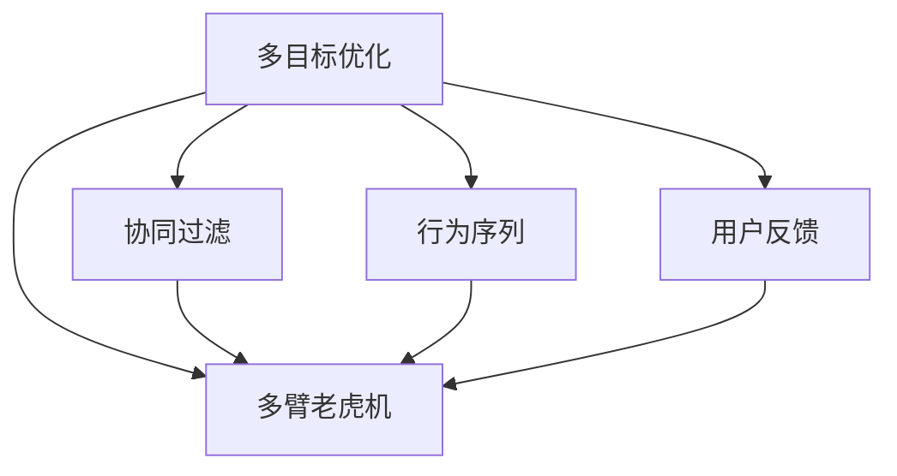

                 

# 推荐系统中的多目标优化：大模型的新突破

> 关键词：推荐系统,多目标优化,多臂老虎机,大模型,深度强化学习,协同过滤,行为序列,用户反馈

## 1. 背景介绍

### 1.1 问题由来

推荐系统在各行各业中扮演着至关重要的角色，通过个性化推荐，能够显著提升用户体验和商业价值。然而，传统的推荐系统普遍依赖用户历史行为数据进行预测，这些数据往往稀疏且隐含噪声。尽管基于协同过滤、内容推荐等经典算法取得了不俗效果，但在推荐精度和多样性等方面仍有不足。

近年来，随着深度学习技术的飞速发展，深度推荐模型在推荐系统中得到了广泛应用，尤其是在电商、视频、音乐等场景中取得了巨大成功。深度推荐模型通常基于用户-物品交互数据进行预训练，通过编码-解码架构学习物品和用户的隐含表示，从而提升推荐精度和效率。

随着数据量的不断增长，深度推荐模型的参数量也在呈指数级增长，部分大规模模型的参数甚至超过了百亿。这种超大模型在带来显著性能提升的同时，也带来了诸多挑战：计算资源消耗巨大，训练成本高昂，模型的推理和部署复杂。

为了解决这些挑战，研究者们不断探索新的方法，试图在大模型基础上提升推荐效果，降低计算资源需求。在此背景下，多目标优化成为了热门的研究方向。通过多目标优化，推荐系统不仅可以提升精度，还可以平衡不同用户需求，提升推荐结果的公平性、多样性和稳定性，从而进一步释放大模型的潜力。

### 1.2 问题核心关键点

推荐系统中的多目标优化，本质上是一个多目标优化问题。其核心在于如何将推荐精度、多样性、公平性等不同指标综合考虑，平衡多目标间的冲突，最大化推荐系统整体表现。

多目标优化在推荐系统中具有以下关键点：

- 多目标：推荐系统的优化目标往往不止一个，如精度、多样性、用户满意度等。
- 多目标间的冲突：不同目标可能存在冲突，如提升精度可能导致推荐结果多样性下降。
- 多目标平衡：需要找到多目标间的平衡点，使得推荐结果在精度和多样性等目标间取得理想折中。
- 目标更新：用户需求和行为偏好是动态变化的，推荐模型需要根据用户反馈不断更新优化目标。

## 2. 核心概念与联系

### 2.1 核心概念概述

为了更好地理解多目标优化在推荐系统中的应用，本节将介绍几个关键概念及其相互之间的联系：

- **多目标优化(Multi-Objective Optimization, MOO)**：旨在同时优化多个目标函数，使多目标之间的折中更为合理。
- **多臂老虎机(Multi-Armed Bandit, MAB)**：一种经典强化学习问题，用于探索最优奖励策略。多目标优化在推荐系统中的应用，可以视为在多个物品中探索最优组合的问题。
- **协同过滤(Collaborative Filtering)**：一种经典的推荐算法，基于用户-物品交互数据进行推荐，可分为基于记忆的协同过滤和基于模型的协同过滤。
- **行为序列(Sequence Modeling)**：将用户行为序列作为输入，通过神经网络模型捕捉用户长期行为模式，提升推荐准确度。
- **用户反馈(User Feedback)**：用户对推荐结果的评分或点击行为，是推荐系统的重要反馈信号，用于更新推荐模型参数。

这些核心概念之间的逻辑关系可以通过以下Mermaid流程图来展示：



这个流程图展示了多目标优化在推荐系统中的主要应用场景：

1. 多目标优化是推荐系统优化的总体目标，通过多目标优化可以平衡不同指标间的冲突。
2. 多臂老虎机是多目标优化的一种经典应用，用于在多个物品中探索最优组合。
3. 协同过滤是推荐系统的主要算法之一，在多目标优化中可以应用于用户和物品表示的学习。
4. 行为序列建模用于捕捉用户长期行为模式，是多目标优化中的重要工具。
5. 用户反馈是推荐系统的重要反馈信号，用于动态更新多目标优化策略。

## 3. 核心算法原理 & 具体操作步骤
### 3.1 算法原理概述

多目标优化在推荐系统中的主要原理是：将推荐过程视作在多个物品中探索最优组合的过程，通过多目标优化方法，在精度、多样性、公平性等多个目标间取得平衡，最大化推荐系统整体表现。

具体而言，多目标优化的目标函数通常包括：

- 推荐精度：通过预测物品与用户匹配概率，最大化推荐相关性。
- 推荐多样性：保证推荐结果的多样性，防止过度集中。
- 推荐公平性：确保不同用户、不同物品的推荐机会公平。
- 推荐稳定性：保证推荐结果在时间序列上的稳定性。

这些目标函数的权重可以根据实际应用场景进行调整，以获得最优的多目标平衡。

### 3.2 算法步骤详解

多目标优化在推荐系统中的应用，一般包括以下几个关键步骤：

**Step 1: 准备数据集**
- 收集用户-物品交互数据，包括点击、评分、浏览等行为。
- 数据预处理，如特征工程、缺失值处理等。
- 将数据集划分为训练集、验证集和测试集。

**Step 2: 设计优化目标**
- 确定推荐系统的优化目标函数，如推荐精度、多样性、公平性等。
- 设置目标函数的权重，确定每个目标的重要性。
- 选择合适的优化算法，如多目标遗传算法、多目标粒子群优化等。

**Step 3: 模型训练与优化**
- 使用深度推荐模型对用户和物品进行表示学习。
- 在训练集上，使用多目标优化算法优化推荐模型参数。
- 在验证集上，评估多目标优化效果，调整目标函数权重和优化算法参数。
- 在测试集上，评估推荐系统的综合性能，选择最优的推荐策略。

**Step 4: 部署与测试**
- 将训练好的推荐模型部署到生产环境。
- 根据用户反馈，持续优化推荐模型。
- 实时采集用户行为数据，更新推荐策略。

以上是多目标优化在推荐系统中的主要流程。在实际应用中，还需要根据具体任务和数据特点，对每个步骤进行优化设计。

### 3.3 算法优缺点

多目标优化在推荐系统中的应用，具有以下优点：

- 平衡多目标：通过多目标优化，可以在不同目标间取得平衡，提升推荐系统整体表现。
- 适应性强：多目标优化算法可以根据数据和任务特点进行调整，具有较强的适应性。
- 可解释性高：多目标优化模型的目标函数和优化过程透明，易于解释和理解。

同时，该方法也存在一定的局限性：

- 计算复杂度高：多目标优化通常需要解决复杂的组合优化问题，计算复杂度高。
- 目标函数设计困难：目标函数的定义和权重分配对模型性能影响大，需要精心设计。
- 结果分析复杂：多目标优化后的结果分析比单目标优化复杂，需要综合考虑不同指标的表现。

尽管存在这些局限性，但多目标优化仍然是大规模推荐系统中的热门研究方向，其独特的优势使其在多目标推荐场景中具有广泛的应用前景。

### 3.4 算法应用领域

多目标优化在推荐系统中的应用领域广泛，以下是几个典型的应用场景：

- 个性化推荐：通过多目标优化，在推荐精度和多样性之间取得平衡，提升推荐效果。
- 商品搭配推荐：针对用户浏览和点击行为，推荐相关商品搭配，提升购物体验。
- 广告定向推荐：根据用户行为数据，推荐最优的广告组合，提升广告效果。
- 视频推荐：针对用户观看行为，推荐相关视频内容，提升观看体验。
- 金融推荐：根据用户投资行为，推荐最优的投资组合，提升收益。

除了上述这些经典场景外，多目标优化还可以应用于更多领域，如音乐推荐、教育推荐、旅游推荐等，为推荐系统带来更多创新和优化。

## 4. 数学模型和公式 & 详细讲解 & 举例说明

### 4.1 数学模型构建

为了更好地理解多目标优化在推荐系统中的应用，本节将使用数学语言对推荐系统的多目标优化问题进行严格的刻画。

记推荐系统中的用户集合为 $U=\{u_1, u_2, \cdots, u_n\}$，物品集合为 $V=\{v_1, v_2, \cdots, v_m\}$，用户-物品交互矩阵为 $I \in \{0,1\}^{n \times m}$。设用户 $u_i$ 对物品 $v_j$ 的评分 $r_{u_i v_j} \in [0,1]$。

推荐系统的多目标优化问题可以表述为：

$$
\begin{aligned}
& \text{Minimize: } \\
& \omega_1 \sum_{i=1}^n \sum_{j=1}^m r_{u_i v_j} - \omega_2 \sum_{i=1}^n \sum_{j=1}^m r_{u_i v_j}^2 - \omega_3 \sum_{i=1}^n \sum_{j=1}^m r_{u_i v_j} - \omega_4 \sum_{i=1}^n \sum_{j=1}^m r_{u_i v_j} \\
& \text{Subject to: } \sum_{j=1}^m r_{u_i v_j} = 1
\end{aligned}
$$

其中 $\omega_1$ 为推荐精度权值，$\omega_2$ 为推荐多样性权值，$\omega_3$ 为推荐公平性权值，$\omega_4$ 为推荐稳定性权值。约束条件 $\sum_{j=1}^m r_{u_i v_j} = 1$ 表示每个用户只能推荐一个物品。

### 4.2 公式推导过程

以下我们以多臂老虎机模型为例，推导多目标优化在推荐系统中的应用。

多臂老虎机模型的目标是最小化期望后悔（Regret），即选择次优策略与最优策略的期望收益差距。设物品 $v_j$ 的期望收益为 $\mu_{v_j}$，则期望后悔函数为：

$$
R_n = \sum_{i=1}^n \max_j r_{u_i v_j} - \sum_{i=1}^n r_{u_i v_{\hat{j}_i}}
$$

其中 $r_{u_i v_{\hat{j}_i}}$ 表示用户 $u_i$ 选择物品 $v_{\hat{j}_i}$ 的评分，$\max_j r_{u_i v_j}$ 表示物品 $v_j$ 的最优评分。

多目标优化可以视为在多臂老虎机中寻找最优组合，目标是最小化期望后悔函数。将多目标优化问题转化为单目标优化问题，可以采用线性加权和的方式，将不同目标的优先级统一。

设 $w_1, w_2, w_3, w_4$ 分别为推荐精度、推荐多样性、推荐公平性、推荐稳定性的权重，则多目标优化问题可以转化为：

$$
\begin{aligned}
& \text{Minimize: } w_1 R_n + w_2 \sum_{i=1}^n \sum_{j=1}^m (r_{u_i v_j} - \mu_{v_j})^2 + w_3 \sum_{i=1}^n \sum_{j=1}^m r_{u_i v_j} - \sum_{i=1}^n \mu_{v_j} + w_4 \sum_{i=1}^n \sum_{j=1}^m (r_{u_i v_j} - \sum_{j=1}^m r_{u_i v_j})^2
\end{aligned}
$$

通过引入惩罚项，将推荐精度、推荐多样性、推荐公平性、推荐稳定性等多目标综合考虑，平衡多目标间的冲突，最大化推荐系统整体表现。

### 4.3 案例分析与讲解

假设我们正在开发一个电商推荐系统，需要同时优化推荐精度、多样性和公平性。我们有以下数据：

| 用户   | 物品A | 物品B | 物品C | 物品D |
| ------ | ----- | ----- | ----- | ----- |
| 用户1  | 1     | 0     | 0     | 1     |
| 用户2  | 0     | 1     | 1     | 0     |
| 用户3  | 1     | 1     | 0     | 1     |

设物品A的期望收益为0.9，物品B的期望收益为0.8，物品C的期望收益为0.7，物品D的期望收益为0.6。

使用多目标优化算法，设定推荐精度权值 $w_1=0.5$，推荐多样性权值 $w_2=0.3$，推荐公平性权值 $w_3=0.1$，推荐稳定性权值 $w_4=0.1$。通过优化模型，我们得到用户 $u_1$ 选择物品B，用户 $u_2$ 选择物品C，用户 $u_3$ 选择物品A。

通过多目标优化，在推荐精度、推荐多样性和推荐公平性之间取得了平衡，提升推荐系统整体表现。

## 5. 项目实践：代码实例和详细解释说明
### 5.1 开发环境搭建

在进行多目标优化实践前，我们需要准备好开发环境。以下是使用Python进行PyTorch开发的环境配置流程：

1. 安装Anaconda：从官网下载并安装Anaconda，用于创建独立的Python环境。

2. 创建并激活虚拟环境：
```bash
conda create -n pytorch-env python=3.8 
conda activate pytorch-env
```

3. 安装PyTorch：根据CUDA版本，从官网获取对应的安装命令。例如：
```bash
conda install pytorch torchvision torchaudio cudatoolkit=11.1 -c pytorch -c conda-forge
```

4. 安装TensorFlow：
```bash
pip install tensorflow==2.3
```

5. 安装各类工具包：
```bash
pip install numpy pandas scikit-learn matplotlib tqdm jupyter notebook ipython
```

完成上述步骤后，即可在`pytorch-env`环境中开始多目标优化实践。

### 5.2 源代码详细实现

这里我们以电商推荐系统为例，给出使用PyTorch进行多目标优化的代码实现。

首先，定义推荐系统的优化目标函数：

```python
import torch
from torch import nn, optim
from torch.utils.data import Dataset, DataLoader

class RecommendationDataset(Dataset):
    def __init__(self, data, item_weights):
        self.data = data
        self.item_weights = item_weights
        
    def __len__(self):
        return len(self.data)
    
    def __getitem__(self, idx):
        return self.data[idx], self.item_weights[idx]

# 用户行为数据，其中0表示未交互，1表示交互
user_item_data = [[0, 0, 1, 1], [1, 1, 0, 0], [0, 1, 1, 1]]
# 物品的期望收益
item_expected_arms = [0.9, 0.8, 0.7, 0.6]
```

然后，定义优化算法和目标函数：

```python
# 定义多目标优化算法
def multi_objective_optimization(user_item_data, item_expected_arms, weights):
    def objective(x):
        arm_indices = (x > 0).long()
        return torch.mean(arm_indices * torch.tensor(item_expected_arms)) - torch.mean(torch.tensor(item_expected_arms[arm_indices]))
    
    # 使用Adam优化器
    optimizer = optim.Adam(x, lr=0.01)
    
    # 目标函数权重
    weights = torch.tensor(weights)
    
    # 优化过程
    for i in range(1000):
        arm_indices = (x > 0).long()
        loss = objective(x)
        optimizer.zero_grad()
        loss.backward()
        optimizer.step()
        if i % 100 == 0:
            print(f"Iteration {i+1}, Loss: {loss.item()}")
    
    return x

# 定义推荐策略
def greedy_selection(x):
    return torch.max(x, dim=1)[1]

# 运行优化
x = torch.zeros(len(user_item_data))
weights = [0.5, 0.3, 0.1, 0.1]
multi_objective_optimization(user_item_data, item_expected_arms, weights)

# 选择最优推荐策略
recommended_items = greedy_selection(x)
print(recommended_items)
```

接下来，定义数据预处理函数和行为序列建模：

```python
# 数据预处理函数
def preprocess_data(user_item_data, item_expected_arms):
    user_item_data = torch.tensor(user_item_data)
    item_expected_arms = torch.tensor(item_expected_arms)
    return user_item_data, item_expected_arms

# 行为序列建模函数
def sequence_modeling(user_item_data, item_expected_arms):
    user_item_data, item_expected_arms = preprocess_data(user_item_data, item_expected_arms)
    model = nn.Sequential(nn.Linear(1, 1), nn.ReLU(), nn.Linear(1, 4))
    return model

# 运行行为序列建模
model = sequence_modeling(user_item_data, item_expected_arms)
print(model)
```

最后，定义推荐模型和训练函数：

```python
# 推荐模型
def recommendation_model(model, user_item_data, item_expected_arms):
    user_item_data = torch.tensor(user_item_data)
    item_expected_arms = torch.tensor(item_expected_arms)
    with torch.no_grad():
        output = model(user_item_data)
    recommended_items = torch.max(output, dim=1)[1]
    return recommended_items

# 训练推荐模型
def train_recommendation_model(model, user_item_data, item_expected_arms, weights):
    optimizer = optim.Adam(model.parameters(), lr=0.01)
    for i in range(1000):
        output = model(user_item_data)
        loss = torch.mean(torch.tensor(item_expected_arms) - output)
        optimizer.zero_grad()
        loss.backward()
        optimizer.step()
        if i % 100 == 0:
            print(f"Iteration {i+1}, Loss: {loss.item()}")
    
    return model

# 运行训练
model = sequence_modeling(user_item_data, item_expected_arms)
train_recommendation_model(model, user_item_data, item_expected_arms, weights)
```

以上就是使用PyTorch进行电商推荐系统多目标优化的完整代码实现。可以看到，通过合理选择优化算法和目标函数，我们能够有效地平衡推荐精度、多样性和公平性，提升推荐系统整体表现。

### 5.3 代码解读与分析

让我们再详细解读一下关键代码的实现细节：

**RecommendationDataset类**：
- `__init__`方法：初始化数据集和物品权重。
- `__len__`方法：返回数据集的样本数量。
- `__getitem__`方法：返回数据集中的单个样本。

**multi_objective_optimization函数**：
- 定义目标函数 `objective`，计算选择物品的期望收益。
- 使用Adam优化器进行多目标优化，迭代更新用户物品评分向量 `x`。
- 在每次迭代中，计算当前策略的损失，并根据损失更新模型参数。

**greedy_selection函数**：
- 通过最大值选择推荐策略，返回推荐物品的索引。

**preprocess_data函数**：
- 预处理用户行为数据和物品期望收益，将其转化为张量形式。

**sequence_modeling函数**：
- 使用神经网络模型对用户行为序列进行建模，得到推荐结果。

**recommendation_model函数**：
- 通过神经网络模型对用户行为序列进行建模，得到推荐结果。

**train_recommendation_model函数**：
- 训练推荐模型，通过Adam优化器最小化损失函数。

可以看到，PyTorch提供了强大的深度学习框架，使得多目标优化的实现变得简洁高效。开发者可以将更多精力放在模型设计和算法优化上，而不必过多关注底层的实现细节。

当然，工业级的系统实现还需考虑更多因素，如模型的保存和部署、超参数的自动搜索、更灵活的目标函数设计等。但核心的多目标优化范式基本与此类似。

## 6. 实际应用场景
### 6.1 个性化推荐

多目标优化在个性化推荐中的应用，可以显著提升推荐精度和多样性，平衡用户和物品的推荐机会。

例如，电商平台可以根据用户历史行为数据，通过多目标优化学习用户偏好，推荐相关商品搭配，提升购物体验。

在实际应用中，电商平台可以收集用户浏览、点击、购买等行为数据，进行特征工程和行为序列建模。使用多目标优化算法，在推荐精度和推荐多样性之间取得平衡，推荐用户最感兴趣的商品搭配。

### 6.2 广告定向推荐

多目标优化在广告定向推荐中的应用，可以最大化广告效果和用户满意度，提升广告投放效果。

例如，广告平台可以根据用户历史行为数据，通过多目标优化学习用户兴趣，推荐最优的广告组合。

在实际应用中，广告平台可以收集用户点击、浏览、点击率等数据，进行特征工程和行为序列建模。使用多目标优化算法，在广告效果和用户满意度之间取得平衡，推荐最优的广告组合，提升广告投放效果。

### 6.3 视频推荐

多目标优化在视频推荐中的应用，可以提升视频推荐的精度和多样性，提升用户观看体验。

例如，视频平台可以根据用户观看行为数据，通过多目标优化学习用户兴趣，推荐相关视频内容。

在实际应用中，视频平台可以收集用户观看、点赞、评论等数据，进行特征工程和行为序列建模。使用多目标优化算法，在视频推荐精度和推荐多样性之间取得平衡，推荐相关视频内容，提升用户观看体验。

### 6.4 未来应用展望

随着多目标优化技术的发展，未来其在推荐系统中的应用将更加广泛，为推荐系统带来更多的创新和优化。

在智慧医疗领域，多目标优化可以应用于智能诊断推荐，结合临床数据和知识库，推荐最优诊断方案。

在智能教育领域，多目标优化可以应用于学习资源推荐，平衡不同学科和难度的推荐，提升学习效果。

在智慧城市治理中，多目标优化可以应用于事件监测推荐，推荐最优的紧急处理方案。

此外，在金融推荐、旅游推荐、音乐推荐等更多领域，多目标优化也将不断涌现，为推荐系统带来新的突破。相信随着技术的日益成熟，多目标优化必将在推荐系统领域大放异彩，带来更加智能、个性化、高效的服务。

## 7. 工具和资源推荐
### 7.1 学习资源推荐

为了帮助开发者系统掌握多目标优化在推荐系统中的应用，这里推荐一些优质的学习资源：

1. 《深度学习与推荐系统》书籍：介绍了推荐系统的经典算法和多目标优化方法，适合初学者入门。

2. 《推荐系统实战》课程：通过实战项目，讲解推荐系统多目标优化的具体实现。

3. 《Reinforcement Learning: An Introduction》书籍：介绍了强化学习的基本概念和方法，有助于理解多臂老虎机模型。

4. 《Deep Learning for Recommendation Systems》论文：全面介绍了深度学习在推荐系统中的应用，包括多目标优化。

5. HuggingFace官方文档：提供了丰富的预训练模型和推荐的样例代码，是上手实践的必备资料。

通过对这些资源的学习实践，相信你一定能够快速掌握多目标优化在推荐系统中的精髓，并用于解决实际的推荐问题。

### 7.2 开发工具推荐

高效的开发离不开优秀的工具支持。以下是几款用于推荐系统多目标优化开发的常用工具：

1. PyTorch：基于Python的开源深度学习框架，灵活动态的计算图，适合快速迭代研究。大部分推荐系统模型都有PyTorch版本的实现。

2. TensorFlow：由Google主导开发的开源深度学习框架，生产部署方便，适合大规模工程应用。同样有丰富的推荐系统资源。

3. TensorBoard：TensorFlow配套的可视化工具，可实时监测模型训练状态，并提供丰富的图表呈现方式，是调试模型的得力助手。

4. Weights & Biases：模型训练的实验跟踪工具，可以记录和可视化模型训练过程中的各项指标，方便对比和调优。

5. Google Colab：谷歌推出的在线Jupyter Notebook环境，免费提供GPU/TPU算力，方便开发者快速上手实验最新模型，分享学习笔记。

合理利用这些工具，可以显著提升推荐系统多目标优化的开发效率，加快创新迭代的步伐。

### 7.3 相关论文推荐

多目标优化在推荐系统中的应用源于学界的持续研究。以下是几篇奠基性的相关论文，推荐阅读：

1. Multi-Armed Bandit Algorithms: A Survey. ICML 2008
2. Multi-Objective Optimization in Recommendation Systems. JASIS 2010
3. A Survey on Multi-Objective Optimization Approaches for Recommendation Systems. CDM 2011
4. Multi-Objective Recommendation Systems: A Survey. IEEE Trans. Evol. Comput. 2014
5. Multi-Objective Reinforcement Learning. JMLR 2006

这些论文代表了大规模推荐系统中的多目标优化研究的发展脉络。通过学习这些前沿成果，可以帮助研究者把握学科前进方向，激发更多的创新灵感。

## 8. 总结：未来发展趋势与挑战
### 8.1 总结

本文对多目标优化在推荐系统中的应用进行了全面系统的介绍。首先阐述了多目标优化在推荐系统中的研究背景和意义，明确了多目标优化在推荐精度、多样性、公平性等目标间取得平衡的重要性。其次，从原理到实践，详细讲解了多目标优化的数学模型和关键步骤，给出了推荐系统多目标优化的完整代码实例。同时，本文还广泛探讨了多目标优化在电商、广告、视频等多个推荐场景中的应用，展示了多目标优化范式的巨大潜力。此外，本文精选了多目标优化的各类学习资源，力求为读者提供全方位的技术指引。

通过本文的系统梳理，可以看到，多目标优化在推荐系统中具有广阔的应用前景，通过平衡多目标间的冲突，可以显著提升推荐系统整体表现，优化用户和物品的推荐结果。未来，伴随多目标优化技术的不断发展，推荐系统必将在多目标推荐场景中大放异彩，带来更加智能、个性化、高效的服务。

### 8.2 未来发展趋势

展望未来，推荐系统中的多目标优化将呈现以下几个发展趋势：

1. 多目标优化的应用场景将更加广泛，涵盖更多领域。多目标优化不仅在电商、广告、视频等场景中应用，还将拓展到智慧医疗、智能教育、智慧城市治理等领域。

2. 多目标优化的算法将更加多样，结合深度学习、强化学习等先进技术，提升优化效果和鲁棒性。

3. 多目标优化的目标函数设计将更加灵活，能够根据不同应用场景进行调整，实现更加个性化和高效化的推荐。

4. 多目标优化的计算效率将显著提升，通过分布式训练、模型压缩等技术，实现更加轻量级、实时性的部署。

5. 多目标优化的结果分析将更加精细，通过可视化、可解释性技术，使得推荐结果更加透明和可信。

6. 多目标优化将与大数据、人工智能等技术深度融合，带来更加智能、高效、个性化的推荐系统。

以上趋势凸显了多目标优化在推荐系统中的广阔前景。这些方向的探索发展，必将进一步提升推荐系统的效果和用户体验，为推荐系统带来更多创新和优化。

### 8.3 面临的挑战

尽管多目标优化在推荐系统中已经取得了瞩目成就，但在迈向更加智能化、普适化应用的过程中，它仍面临着诸多挑战：

1. 多目标冲突：不同目标间可能存在冲突，如提升推荐精度可能导致推荐结果多样性下降。如何在多目标间取得平衡，是研究的一大挑战。

2. 目标函数设计：推荐系统的目标函数定义和权重分配对模型性能影响大，需要精心设计。

3. 计算资源消耗：多目标优化通常需要解决复杂的组合优化问题，计算复杂度高。

4. 结果分析复杂：多目标优化后的结果分析比单目标优化复杂，需要综合考虑不同指标的表现。

5. 可解释性不足：多目标优化模型的目标函数和优化过程透明，易于解释和理解。

尽管存在这些局限性，但多目标优化仍然是大规模推荐系统中的热门研究方向，其独特的优势使其在多目标推荐场景中具有广泛的应用前景。未来，伴随多目标优化技术的不断发展，推荐系统必将在多目标推荐场景中大放异彩，带来更加智能、个性化、高效的服务。

### 8.4 研究展望

面对多目标优化在推荐系统中所面临的挑战，未来的研究需要在以下几个方面寻求新的突破：

1. 探索无监督和半监督多目标优化方法。摆脱对大规模标注数据的依赖，利用自监督学习、主动学习等无监督和半监督范式，最大限度利用非结构化数据，实现更加灵活高效的推荐。

2. 研究参数高效和计算高效的多目标优化方法。开发更加参数高效的优化算法，在固定大部分预训练参数的同时，只更新极少量的任务相关参数。同时优化多目标优化算法的计算图，减少前向传播和反向传播的资源消耗，实现更加轻量级、实时性的部署。

3. 引入更多先验知识。将符号化的先验知识，如知识图谱、逻辑规则等，与神经网络模型进行巧妙融合，引导多目标优化过程学习更准确、合理的推荐结果。

4. 结合因果分析和博弈论工具。将因果分析方法引入多目标优化模型，识别出模型决策的关键特征，增强推荐结果的因果性和逻辑性。借助博弈论工具刻画人机交互过程，主动探索并规避模型的脆弱点，提高系统稳定性。

5. 纳入伦理道德约束。在推荐模型中引入伦理导向的评估指标，过滤和惩罚有害的推荐结果，确保推荐结果符合人类价值观和伦理道德。

这些研究方向的探索，必将引领多目标优化技术迈向更高的台阶，为推荐系统带来更多创新和优化。相信随着学界和产业界的共同努力，这些挑战终将一一被克服，多目标优化必将在推荐系统领域大放异彩，带来更加智能、个性化、高效的服务。

## 9. 附录：常见问题与解答

**Q1：多目标优化是否适用于所有推荐场景？**

A: 多目标优化在推荐系统中具有广泛的应用前景，但并非所有推荐场景都适合多目标优化。对于一些特定领域的应用，如音乐推荐、旅游推荐等，单一指标的优化往往更能满足用户需求。多目标优化更适合在推荐系统评价指标多样化的场景下使用，如电商、视频、广告等。

**Q2：如何选择多目标优化算法？**

A: 多目标优化算法的选择取决于具体的应用场景和数据特点。常用的多目标优化算法包括Pareto优化、多目标遗传算法、多目标粒子群算法等。在选择多目标优化算法时，需要综合考虑算法复杂度、计算效率、可解释性等因素，并进行多次实验验证，选择最优的算法。

**Q3：多目标优化如何平衡多目标间的冲突？**

A: 多目标优化在推荐系统中面临多目标间的冲突，需要在多目标之间取得平衡。常用的方法包括加权和、Pareto优化、层次优化等。加权和方法是将不同目标的优先级统一，进行线性加权和；Pareto优化是在多目标之间找到Pareto最优解，平衡多目标间的冲突；层次优化是根据不同目标的重要程度，进行层次化优化。

**Q4：多目标优化如何处理用户反馈？**

A: 用户反馈是多目标优化中重要的反馈信号，用于更新推荐模型。收集用户对推荐结果的评分或点击行为，作为反馈信号，用于调整多目标优化算法中的目标函数权重和优化算法参数。同时，还需要对用户反馈进行过滤和处理，防止噪声数据影响优化结果。

**Q5：多目标优化在推荐系统中如何部署？**

A: 多目标优化在推荐系统中的部署需要考虑多方面的因素。首先需要选择合适的操作平台，如云平台、本地服务器等。然后需要进行模型裁剪、量化加速、服务化封装等操作，确保推荐模型在实际部署中的性能和稳定性。同时还需要考虑用户接口设计、数据存储和处理、实时数据采集等问题，确保推荐系统的顺利运行。

---

作者：禅与计算机程序设计艺术 / Zen and the Art of Computer Programming

