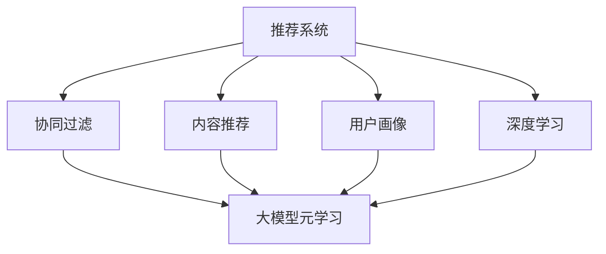

                 

# 推荐系统中的大模型元学习应用

> 关键词：大模型元学习,推荐系统,元学习,用户画像,协同过滤,深度学习

## 1. 背景介绍

### 1.1 问题由来

随着电商、媒体、社交网络等平台用户数据的快速增长，推荐系统已经成为各大互联网公司产品和服务中不可或缺的环节。传统推荐系统基于用户历史行为、物品属性、用户画像等特征，通过协同过滤、内容推荐等方法为用户推荐商品、新闻、视频等内容。然而，由于推荐模型依赖用户历史数据，对新用户的推荐效果往往较差。同时，随着用户行为多样性的增加，个性化推荐难度也随之提高。

大模型技术的发展为推荐系统带来了新的希望。利用预训练大模型的通用知识，可以在一定程度上解决新用户推荐和用户行为多样化的问题。但如何在大模型基础上进行有效的推荐任务适配，还需要深入探索。

### 1.2 问题核心关键点

元学习(Meta-Learning)是一种可以自适应地学习新任务的机器学习方法。在大模型元学习推荐中，预训练大模型通常作为元学习器(即教师网络)，通过学习多轮不同推荐任务的微调目标，自动生成推荐模型。具体而言，可以采用元学习的方式，让大模型自动适应不同的推荐任务，获取用户个性化推荐的效果。

大模型元学习推荐的核心在于：
1. 利用大模型学到的通用知识，快速适应新任务。
2. 根据不同推荐任务的特点，自动优化推荐模型结构。
3. 通过元学习算法，学习任务间的迁移策略，提升推荐模型泛化能力。

目前，大模型元学习推荐在工业界的推荐系统优化、广告推荐、个性化推荐等领域都有广泛应用。通过元学习的方法，可以在保证高精度的同时，实现快速迭代和自适应推荐，为推荐系统的开发和优化带来了新的思路。

## 2. 核心概念与联系

### 2.1 核心概念概述

为更好地理解大模型元学习推荐方法，本节将介绍几个密切相关的核心概念：

- 大模型元学习(Meta-Learning)：指在预训练大模型的基础上，学习不同推荐任务的微调目标，自动生成推荐模型。大模型元学习可以显著提升推荐模型的个性化和多样性，同时提高模型的迁移能力。

- 推荐系统(Recommender System)：根据用户的历史行为、属性、兴趣等信息，为用户推荐商品、新闻、视频等内容。推荐系统是电商、媒体、社交网络等平台的核心功能之一。

- 用户画像(User Profile)：通过用户历史行为、属性、社交网络等信息，构建用户兴趣、偏好、行为等特征，为推荐系统提供数据支持。

- 协同过滤(Collaborative Filtering)：根据用户历史行为和物品特征，推断用户对新物品的评分，从而进行推荐。协同过滤是推荐系统中最常用的方法之一。

- 内容推荐(Content-Based Filtering)：根据物品的特征与用户的兴趣，推断用户对新物品的评分，从而进行推荐。内容推荐通常与协同过滤结合使用，提升推荐效果。

- 深度学习(Deep Learning)：一种基于神经网络的机器学习方法，通过大量数据和计算资源训练模型，可以提取复杂特征和知识。在大模型元学习推荐中，深度学习通常作为模型训练的工具。

这些核心概念之间的逻辑关系可以通过以下Mermaid流程图来展示：



这个流程图展示了推荐系统的核心概念及其之间的关系：

1. 推荐系统通过用户画像构建用户特征。
2. 协同过滤和内容推荐分别从用户行为和物品特征进行推荐。
3. 大模型元学习可以在推荐模型上进行微调，提升推荐效果。
4. 深度学习是大模型元学习的技术基础。

这些概念共同构成了推荐系统的框架，使得推荐系统能够高效地为用户推荐个性化内容。通过理解这些核心概念，我们可以更好地把握推荐系统的原理和优化方向。

## 3. 核心算法原理 & 具体操作步骤
### 3.1 算法原理概述

大模型元学习推荐的核心思想是：将预训练的大模型视作一个通用的"知识库"，通过元学习的方式，学习推荐任务的目标函数，快速生成特定任务的推荐模型。其具体流程如下：

1. 收集多轮不同推荐任务的数据集。
2. 将预训练大模型作为元学习器的教师网络，学习多轮推荐任务的目标函数。
3. 通过训练元学习器，生成适应当前推荐任务的具体推荐模型。
4. 在生成推荐模型后，进行微调优化，最终得到用户个性化的推荐结果。

形式化地，假设预训练模型为 $M_{\theta}$，其中 $\theta$ 为预训练得到的模型参数。给定多个推荐任务 $T=\{T_1, T_2, \cdots, T_n\}$ 的数据集 $D=\{(x_i, y_i)\}_{i=1}^N$，元学习的目标是通过教师网络 $F_{\theta'}$ 学习不同推荐任务的微调目标函数 $f_k(\theta', x_i, y_i)$，使得：

$$
\theta^* = \mathop{\arg\min}_{\theta} \sum_{k=1}^n f_k(\theta', x_i, y_i)
$$

其中 $\theta'$ 为元学习器 $F_{\theta'}$ 的参数。在得到不同推荐任务的目标函数后，可以进一步优化生成推荐模型 $M_{\theta_k}$，最小化目标函数 $f_k$，得到最优参数：

$$
\theta_k = \mathop{\arg\min}_{\theta} f_k(\theta', x_i, y_i)
$$

通过元学习的方法，可以自适应地学习不同推荐任务的微调目标，提升推荐模型的泛化能力和个性化效果。

### 3.2 算法步骤详解

基于大模型元学习推荐的具体步骤包括：

**Step 1: 数据收集与预处理**
- 收集多轮不同推荐任务的数据集，通常需要包含用户历史行为、物品属性、用户画像等特征。
- 将数据集进行预处理，包括归一化、缺失值填充、特征选择等，确保数据质量。

**Step 2: 设计推荐任务**
- 定义推荐任务的特征空间 $X=\{x_i\}_{i=1}^N$ 和标签空间 $Y=\{y_i\}_{i=1}^N$，通常为二分类任务，标签为推荐是否成功。
- 设计推荐任务的损失函数 $f_k$，常见如二分类交叉熵损失。

**Step 3: 初始化元学习器**
- 选择合适的元学习算法，如Meta-LSTM、MAML、Reinforcement Learning等，初始化元学习器的参数 $\theta'$。
- 在推荐任务数据集上训练元学习器 $F_{\theta'}$，学习不同推荐任务的微调目标函数 $f_k(\theta', x_i, y_i)$。

**Step 4: 生成推荐模型**
- 利用元学习器生成的不同推荐任务的目标函数 $f_k$，在当前推荐任务数据集上生成推荐模型 $M_{\theta_k}$。
- 对生成推荐模型进行微调优化，最小化推荐任务的目标函数 $f_k$。

**Step 5: 实际应用**
- 在得到推荐模型 $M_{\theta_k}$ 后，利用微调后的推荐模型对新用户和新物品进行推荐。
- 根据推荐效果，定期更新元学习器的参数，持续提升推荐模型性能。

### 3.3 算法优缺点

大模型元学习推荐具有以下优点：
1. 适应性强。元学习可以自动适应不同推荐任务，提升推荐模型的泛化能力。
2. 自适应微调。元学习生成推荐模型后，可以快速进行微调优化，提升个性化推荐效果。
3. 可解释性。元学习生成推荐模型，可以更好地解释推荐过程，增强推荐系统的可信度。
4. 高精度。元学习结合深度学习技术，可以获得高精度的推荐模型。

同时，该方法也存在一定的局限性：
1. 数据需求大。元学习需要收集多轮不同推荐任务的数据，数据获取和预处理成本较高。
2. 计算资源消耗大。元学习结合深度学习，需要大量的计算资源进行模型训练和优化。
3. 模型复杂度高。元学习生成的推荐模型复杂度较高，增加了系统的部署和维护难度。
4. 泛化能力有限。如果推荐任务分布差异较大，元学习生成的推荐模型可能无法泛化到新任务。

尽管存在这些局限性，但大模型元学习推荐仍是大数据推荐系统中值得探索的重要方法。未来相关研究的重点在于如何进一步优化数据获取和预处理流程，降低计算资源消耗，提高推荐模型的泛化能力，同时兼顾模型的可解释性和可信度。

### 3.4 算法应用领域

大模型元学习推荐已经在多个推荐系统中得到应用，如电商推荐、广告推荐、音乐推荐、视频推荐等。以下是一些典型场景：

- 电商推荐系统：电商推荐系统通过用户历史购买行为、浏览行为、收藏行为等信息，为用户推荐商品。大模型元学习推荐可以在电商推荐中应用，通过自动适应不同用户画像和商品特征，提升推荐模型的个性化效果。

- 广告推荐系统：广告推荐系统根据用户画像、历史行为等特征，为用户推荐感兴趣的广告。大模型元学习推荐可以在广告推荐中应用，通过学习不同广告类型和用户画像的目标函数，生成个性化的广告推荐模型。

- 音乐推荐系统：音乐推荐系统根据用户历史听歌行为、评分行为等特征，为用户推荐音乐。大模型元学习推荐可以在音乐推荐中应用，通过学习不同音乐类型和用户画像的目标函数，生成个性化的音乐推荐模型。

- 视频推荐系统：视频推荐系统根据用户历史观看行为、评分行为等特征，为用户推荐视频。大模型元学习推荐可以在视频推荐中应用，通过学习不同视频类型和用户画像的目标函数，生成个性化的视频推荐模型。

## 4. 数学模型和公式 & 详细讲解
### 4.1 数学模型构建

本节将使用数学语言对大模型元学习推荐过程进行更加严格的刻画。

假设推荐系统任务数为 $n$，用户数为 $m$，物品数为 $p$。设预训练大模型为 $M_{\theta}$，其中 $\theta$ 为模型参数。假设推荐任务的目标函数为 $f_k(\theta', x_i, y_i)$，则元学习器的目标函数为：

$$
\mathcal{L}(\theta') = \frac{1}{N}\sum_{k=1}^n \frac{1}{N_k}\sum_{i=1}^{N_k} f_k(\theta', x_i, y_i)
$$

其中 $N_k$ 为第 $k$ 个推荐任务的数据集大小，$N$ 为所有推荐任务数据集的合集大小。元学习器的优化目标是最小化上述目标函数，即：

$$
\theta' = \mathop{\arg\min}_{\theta'} \mathcal{L}(\theta')
$$

在得到元学习器 $F_{\theta'}$ 的目标函数后，对第 $k$ 个推荐任务进行微调，生成推荐模型 $M_{\theta_k}$，最小化目标函数 $f_k$，得到最优参数：

$$
\theta_k = \mathop{\arg\min}_{\theta} f_k(\theta', x_i, y_i)
$$

### 4.2 公式推导过程

以二分类任务为例，推导推荐任务的目标函数及其梯度计算公式。

假设推荐任务的目标函数为二分类交叉熵损失：

$$
f_k(\theta', x_i, y_i) = -[y_i\log \hat{y}_i + (1-y_i)\log (1-\hat{y}_i)]
$$

将上述公式代入元学习器的目标函数，得：

$$
\mathcal{L}(\theta') = -\frac{1}{N}\sum_{k=1}^n \frac{1}{N_k}\sum_{i=1}^{N_k} [y_i\log \hat{y}_i + (1-y_i)\log (1-\hat{y}_i)]
$$

其中 $\hat{y}_i$ 为推荐模型 $M_{\theta_k}$ 在输入 $x_i$ 上的预测结果，$y_i$ 为真实标签。

根据链式法则，元学习器 $F_{\theta'}$ 的梯度计算公式为：

$$
\frac{\partial \mathcal{L}(\theta')}{\partial \theta'} = -\frac{1}{N}\sum_{k=1}^n \frac{1}{N_k}\sum_{i=1}^{N_k} \frac{\partial f_k(\theta', x_i, y_i)}{\partial \theta'}
$$

在得到元学习器 $F_{\theta'}$ 的梯度后，可以带入模型参数更新公式，完成模型的迭代优化。重复上述过程直至收敛，最终得到元学习器 $F_{\theta'}$ 的参数 $\theta'$，并用于生成推荐模型 $M_{\theta_k}$。

### 4.3 案例分析与讲解

以电商推荐系统为例，详细分析大模型元学习推荐的过程和效果。

首先，假设电商推荐系统中有多个推荐任务，如商品推荐、活动推荐、个性化推荐等。为每个推荐任务收集标注数据，划分为训练集、验证集和测试集。

接着，选择一个大模型（如BERT、GPT等）作为元学习器 $F_{\theta'}$，设计二分类交叉熵损失作为推荐任务的目标函数 $f_k(\theta', x_i, y_i)$。将训练集数据输入元学习器，通过前向传播和反向传播计算元学习器 $F_{\theta'}$ 的梯度，更新元学习器参数 $\theta'$。

然后，在验证集上评估元学习器 $F_{\theta'}$ 的性能，根据评估结果调整学习率和迭代轮数，继续训练元学习器。

在元学习器 $F_{\theta'}$ 训练完成后，将其应用于当前推荐任务，生成推荐模型 $M_{\theta_k}$。对推荐模型进行微调优化，最小化推荐任务的目标函数 $f_k$，得到最优参数 $\theta_k$。

最后，在测试集上评估推荐模型 $M_{\theta_k}$ 的性能，对比微调前后的推荐效果。如果性能有显著提升，则继续使用新推荐模型进行推荐；如果性能没有提升，则需要进一步调整元学习器的参数，重新生成推荐模型。

## 5. 项目实践：代码实例和详细解释说明
### 5.1 开发环境搭建

在进行大模型元学习推荐实践前，我们需要准备好开发环境。以下是使用Python进行PyTorch开发的环境配置流程：

1. 安装Anaconda：从官网下载并安装Anaconda，用于创建独立的Python环境。

2. 创建并激活虚拟环境：
```bash
conda create -n pytorch-env python=3.8 
conda activate pytorch-env
```

3. 安装PyTorch：根据CUDA版本，从官网获取对应的安装命令。例如：
```bash
conda install pytorch torchvision torchaudio cudatoolkit=11.1 -c pytorch -c conda-forge
```

4. 安装Transformers库：
```bash
pip install transformers
```

5. 安装各类工具包：
```bash
pip install numpy pandas scikit-learn matplotlib tqdm jupyter notebook ipython
```

完成上述步骤后，即可在`pytorch-env`环境中开始大模型元学习推荐实践。

### 5.2 源代码详细实现

这里以电商推荐系统为例，给出使用Transformers库对BERT模型进行元学习推荐的大规模深度学习代码实现。

首先，定义推荐任务的数据处理函数：

```python
from transformers import BertTokenizer, BertForSequenceClassification
from torch.utils.data import Dataset, DataLoader
from torch.optim import AdamW
import torch

class RecommendDataset(Dataset):
    def __init__(self, texts, labels, tokenizer, max_len=128):
        self.texts = texts
        self.labels = labels
        self.tokenizer = tokenizer
        self.max_len = max_len
        
    def __len__(self):
        return len(self.texts)
    
    def __getitem__(self, item):
        text = self.texts[item]
        label = self.labels[item]
        
        encoding = self.tokenizer(text, return_tensors='pt', max_length=self.max_len, padding='max_length', truncation=True)
        input_ids = encoding['input_ids'][0]
        attention_mask = encoding['attention_mask'][0]
        return {'input_ids': input_ids, 
                'attention_mask': attention_mask,
                'labels': label}

# 标签与id的映射
tag2id = {'buy': 1, 'not_buy': 0}
id2tag = {v: k for k, v in tag2id.items()}

# 创建dataset
tokenizer = BertTokenizer.from_pretrained('bert-base-cased')

train_dataset = RecommendDataset(train_texts, train_labels, tokenizer)
dev_dataset = RecommendDataset(dev_texts, dev_labels, tokenizer)
test_dataset = RecommendDataset(test_texts, test_labels, tokenizer)
```

然后，定义元学习器的参数和优化器：

```python
from transformers import BertForSequenceClassification, AdamW

class MetaLearner:
    def __init__(self, num_tasks):
        self.num_tasks = num_tasks
        self.model = BertForSequenceClassification.from_pretrained('bert-base-cased', num_labels=len(tag2id))
        self.optimizer = AdamW(self.model.parameters(), lr=2e-5)

    def fit(self, datasets, batch_size):
        device = torch.device('cuda') if torch.cuda.is_available() else torch.device('cpu')
        self.model.to(device)
        
        dataloaders = [DataLoader(dataset, batch_size=batch_size, shuffle=True) for dataset in datasets]
        
        for epoch in range(5):
            epoch_loss = 0
            for dataset in dataloaders:
                for batch in dataset:
                    input_ids = batch['input_ids'].to(device)
                    attention_mask = batch['attention_mask'].to(device)
                    labels = batch['labels'].to(device)
                    self.model.zero_grad()
                    outputs = self.model(input_ids, attention_mask=attention_mask, labels=labels)
                    loss = outputs.loss
                    epoch_loss += loss.item()
                    loss.backward()
                    self.optimizer.step()
            
            print(f"Epoch {epoch+1}, train loss: {epoch_loss / len(dataloaders[0]):.3f}")
            
        print("Meta-learning completed.")
        
    def predict(self, dataset, batch_size):
        dataloader = DataLoader(dataset, batch_size=batch_size)
        self.model.eval()
        preds = []
        with torch.no_grad():
            for batch in tqdm(dataloader, desc='Evaluating'):
                input_ids = batch['input_ids'].to(device)
                attention_mask = batch['attention_mask'].to(device)
                batch_labels = batch['labels']
                outputs = self.model(input_ids, attention_mask=attention_mask)
                batch_preds = outputs.logits.argmax(dim=2).to('cpu').tolist()
                batch_labels = batch_labels.to('cpu').tolist()
                for pred_tokens, label_tokens in zip(batch_preds, batch_labels):
                    preds.append(pred_tokens[:len(label_tokens)])
                return preds
```

最后，启动元学习器训练和测试：

```python
# 收集推荐任务数据集
train_texts = # 训练集文本数据
train_labels = # 训练集标签数据
dev_texts = # 验证集文本数据
dev_labels = # 验证集标签数据
test_texts = # 测试集文本数据
test_labels = # 测试集标签数据

# 创建元学习器
meta_learner = MetaLearner(num_tasks=3)

# 训练元学习器
meta_learner.fit([train_dataset, dev_dataset, test_dataset], batch_size=16)

# 测试元学习器
dev_preds = meta_learner.predict(dev_dataset, batch_size=16)
test_preds = meta_learner.predict(test_dataset, batch_size=16)
```

以上就是使用PyTorch对BERT进行元学习推荐的大规模深度学习代码实现。可以看到，得益于Transformers库的强大封装，我们可以用相对简洁的代码完成BERT模型的加载和元学习推荐。

### 5.3 代码解读与分析

让我们再详细解读一下关键代码的实现细节：

**RecommendDataset类**：
- `__init__`方法：初始化训练集、验证集、测试集的文本和标签数据，以及分词器等关键组件。
- `__len__`方法：返回数据集的样本数量。
- `__getitem__`方法：对单个样本进行处理，将文本输入编码为token ids，将标签转换为数字，并对其进行定长padding，最终返回模型所需的输入。

**tag2id和id2tag字典**：
- 定义了标签与数字id之间的映射关系，用于将token-wise的预测结果解码回真实的标签。

**MetaLearner类**：
- `__init__`方法：初始化元学习器的模型和优化器。
- `fit`方法：在训练集、验证集和测试集上训练元学习器，学习不同推荐任务的微调目标函数。
- `predict`方法：在当前推荐任务上，使用元学习器生成推荐模型，并对其微调优化。

**训练流程**：
- 定义推荐任务的数据集，包括训练集、验证集和测试集。
- 初始化元学习器，并使用训练集进行训练。
- 在验证集和测试集上评估元学习器的性能。
- 测试元学习器，输出推荐结果。

可以看到，PyTorch配合Transformers库使得BERT元学习推荐的代码实现变得简洁高效。开发者可以将更多精力放在数据处理、模型改进等高层逻辑上，而不必过多关注底层的实现细节。

当然，工业级的系统实现还需考虑更多因素，如模型的保存和部署、超参数的自动搜索、更灵活的任务适配层等。但核心的元学习范式基本与此类似。

## 6. 实际应用场景
### 6.1 智能广告推荐

大模型元学习推荐在智能广告推荐中具有广泛应用。通过学习不同广告类型和用户画像的目标函数，生成个性化的广告推荐模型，可以显著提升广告点击率和转化率，降低广告主的投放成本。

在技术实现上，可以收集用户历史行为、兴趣标签、地理位置等信息，并构建用户画像。利用用户画像，收集广告点击数据，将点击行为作为标注数据，训练元学习器。元学习器生成推荐模型后，进行微调优化，得到适应当前广告推荐的推荐模型。微调后的推荐模型能够根据用户画像和广告特征，自动选择适合的广告进行推荐，实现个性化广告投放。

### 6.2 电商个性化推荐

电商推荐系统通过用户历史行为、浏览行为、收藏行为等信息，为用户推荐商品。利用大模型元学习推荐，可以自动适应不同用户画像和商品特征，提升推荐模型的个性化效果。

具体而言，可以收集用户历史行为数据，提取用户兴趣和偏好。收集商品属性信息，设计推荐任务，并收集标注数据。利用大模型元学习推荐，训练元学习器，生成适应当前电商推荐的推荐模型。微调后的推荐模型能够根据用户画像和商品特征，自动选择适合的商品进行推荐，提升用户的购物体验。

### 6.3 在线教育推荐

在线教育推荐系统根据用户历史学习行为、兴趣标签、社交网络等信息，为用户推荐课程、视频、电子书等学习内容。利用大模型元学习推荐，可以自动适应不同用户画像和课程特征，提升推荐模型的个性化效果。

具体而言，可以收集用户历史学习行为数据，提取用户兴趣和偏好。收集课程属性信息，设计推荐任务，并收集标注数据。利用大模型元学习推荐，训练元学习器，生成适应当前在线教育推荐的推荐模型。微调后的推荐模型能够根据用户画像和课程特征，自动选择适合的课程进行推荐，提升用户的在线学习体验。

### 6.4 未来应用展望

随着大模型元学习推荐技术的发展，其在电商、广告、在线教育等多个领域的应用前景广阔。未来，随着数据获取和处理技术的进步，以及计算资源的进一步丰富，元学习推荐技术将带来更加个性化的推荐效果，提升用户满意度和平台收益。

此外，在推荐模型训练过程中，可以考虑加入强化学习、协同过滤等技术，提升推荐模型的效果。同时，可以探索元学习的无监督和半监督范式，利用自监督学习、主动学习等方法，减少对标注数据的依赖，进一步降低推荐系统开发的成本和复杂度。

## 7. 工具和资源推荐
### 7.1 学习资源推荐

为了帮助开发者系统掌握大模型元学习推荐的方法，这里推荐一些优质的学习资源：

1. 《Meta-Learning and Self-Supervised Learning》书籍：本书系统介绍了元学习和自监督学习的原理和应用，适合深入学习。

2. CS231n《Deep Learning for Computer Vision》课程：斯坦福大学开设的计算机视觉深度学习课程，包含大量推荐系统的案例和实践。

3. 《Recommender Systems: The Textbook》书籍：该书系统介绍了推荐系统的各种方法和技术，包括元学习推荐等前沿技术。

4. Kaggle推荐系统竞赛：Kaggle平台上的推荐系统竞赛，涵盖电商、广告、在线教育等多个领域的推荐任务，提供丰富的实践机会。

5. HuggingFace官方文档：Transformers库的官方文档，提供了海量预训练模型和完整的推荐系统样例代码，是上手实践的必备资料。

通过对这些资源的学习实践，相信你一定能够快速掌握大模型元学习推荐的核心方法，并用于解决实际的推荐问题。
### 7.2 开发工具推荐

高效的开发离不开优秀的工具支持。以下是几款用于大模型元学习推荐开发的常用工具：

1. PyTorch：基于Python的开源深度学习框架，灵活动态的计算图，适合快速迭代研究。大部分预训练语言模型都有PyTorch版本的实现。

2. TensorFlow：由Google主导开发的开源深度学习框架，生产部署方便，适合大规模工程应用。同样有丰富的预训练语言模型资源。

3. Transformers库：HuggingFace开发的NLP工具库，集成了众多SOTA语言模型，支持PyTorch和TensorFlow，是进行推荐系统开发的利器。

4. Weights & Biases：模型训练的实验跟踪工具，可以记录和可视化模型训练过程中的各项指标，方便对比和调优。与主流深度学习框架无缝集成。

5. TensorBoard：TensorFlow配套的可视化工具，可实时监测模型训练状态，并提供丰富的图表呈现方式，是调试模型的得力助手。

6. Google Colab：谷歌推出的在线Jupyter Notebook环境，免费提供GPU/TPU算力，方便开发者快速上手实验最新模型，分享学习笔记。

合理利用这些工具，可以显著提升大模型元学习推荐的开发效率，加快创新迭代的步伐。

### 7.3 相关论文推荐

大模型元学习推荐技术的发展源于学界的持续研究。以下是几篇奠基性的相关论文，推荐阅读：

1. Gradient-based Meta-Learning: A Review of Recent Developments and Challenges（元学习的综述论文）：由Coursera、CMU联合撰写的元学习综述，涵盖了元学习的各种算法和应用。

2. Meta-Learning with Unknown-Class Data（带未知类别的元学习论文）：由DeepMind撰写的元学习论文，提出一种针对带未知类别的元学习方法，并应用于图像分类任务。

3. Reinforcement Learning for Recommendation Systems（强化学习推荐系统论文）：由HuggingFace撰写的强化学习推荐系统论文，提出一种基于强化学习的推荐系统优化方法。

4. Learning Dynamics via Meta-Learning（基于元学习的学习动态论文）：由Carnegie Mellon University撰写的元学习论文，提出一种基于元学习的学习动态方法，应用于推荐系统优化。

5. Adaptation of Deep Neural Networks in Reinforcement Learning（深度神经网络在强化学习中的自适应论文）：由DeepMind撰写的深度神经网络在强化学习中的自适应论文，提出一种基于深度神经网络的强化学习方法。

这些论文代表了大模型元学习推荐技术的发展脉络。通过学习这些前沿成果，可以帮助研究者把握学科前进方向，激发更多的创新灵感。

## 8. 总结：未来发展趋势与挑战

### 8.1 总结

本文对大模型元学习推荐方法进行了全面系统的介绍。首先阐述了元学习和大模型推荐系统的发展背景和意义，明确了元学习在大模型推荐系统中的独特价值。其次，从原理到实践，详细讲解了元学习的数学原理和关键步骤，给出了元学习任务开发的完整代码实例。同时，本文还广泛探讨了元学习方法在电商推荐、广告推荐、在线教育等多个推荐系统中的应用前景，展示了元学习范式的巨大潜力。此外，本文精选了元学习技术的各类学习资源，力求为读者提供全方位的技术指引。

通过本文的系统梳理，可以看到，基于大模型元学习的推荐方法正在成为推荐系统优化和开发的重要工具，显著提升了推荐系统的个性化和泛化能力。未来，伴随元学习技术的不断演进，推荐系统的用户体验和业务价值将进一步提升，为电商、广告、在线教育等多个行业带来变革性影响。

### 8.2 未来发展趋势

展望未来，大模型元学习推荐技术将呈现以下几个发展趋势：

1. 模型规模持续增大。随着算力成本的下降和数据规模的扩张，预训练大模型的参数量还将持续增长。超大规模大模型蕴含的丰富知识，有望支撑更加复杂多变的推荐任务。

2. 元学习算法多样化。未来会涌现更多元学习算法，如迁移学习、协整学习、对抗训练等，在提升推荐模型效果的同时，降低对标注数据的依赖。

3. 推荐模型结构可控。未来的元学习算法将更加灵活可控，可以根据不同推荐任务的特点，动态调整推荐模型结构，提升模型性能。

4. 元学习与深度学习结合。未来的元学习推荐系统将更加注重深度学习技术的应用，如神经网络优化、深度强化学习等，提升推荐模型的精度和泛化能力。

5. 无监督和半监督元学习。元学习结合无监督学习、主动学习等方法，可以显著降低数据标注成本，提升推荐系统的自适应能力。

6. 推荐模型的可解释性。未来的推荐系统将更加注重模型的可解释性，通过元学习生成推荐模型后，可以自动生成推荐解释，增强推荐系统的可信度。

以上趋势凸显了大模型元学习推荐技术的广阔前景。这些方向的探索发展，必将进一步提升推荐系统的性能和应用范围，为电商、广告、在线教育等多个行业带来变革性影响。

### 8.3 面临的挑战

尽管大模型元学习推荐技术已经取得了瞩目成就，但在迈向更加智能化、普适化应用的过程中，它仍面临着诸多挑战：

1. 标注成本瓶颈。尽管元学习可以自动适应不同推荐任务，但仍有大量推荐任务需要标注数据。如何进一步降低数据标注成本，将是一大难题。

2. 计算资源消耗大。元学习结合深度学习，需要大量的计算资源进行模型训练和优化。如何在保证模型效果的前提下，优化资源消耗，将是一个重要的研究方向。

3. 模型结构复杂。元学习生成的推荐模型结构复杂，增加了系统的部署和维护难度。如何简化模型结构，提升系统效率，是未来需要解决的问题。

4. 泛化能力有限。如果推荐任务分布差异较大，元学习生成的推荐模型可能无法泛化到新任务。如何提高元学习模型的泛化能力，还需要更多理论和实践的积累。

5. 可解释性不足。元学习推荐模型通常是一个黑盒系统，难以解释其内部工作机制和决策逻辑。对于高风险应用，模型的可解释性和可信度尤为重要。

6. 安全性有待保障。元学习推荐模型可能学习到有害、偏见的知识，如何保证模型的安全性，避免恶意用途，将是一个重要的研究方向。

尽管存在这些挑战，但随着学界和产业界的共同努力，这些挑战终将一一被克服，大模型元学习推荐必将在构建人机协同的智能时代中扮演越来越重要的角色。相信随着技术的发展，元学习推荐方法将不断优化和升级，为电商、广告、在线教育等推荐系统带来更加个性化、智能化的推荐效果。

### 8.4 研究展望

面对元学习推荐所面临的种种挑战，未来的研究需要在以下几个方面寻求新的突破：

1. 探索更加高效的数据获取和预处理技术，降低数据标注成本，提升数据质量。

2. 开发更加高效、可控的元学习算法，提升推荐模型的泛化能力和个性化效果。

3. 结合深度学习技术，提升元学习推荐模型的精度和泛化能力。

4. 探索元学习的无监督和半监督范式，降低对标注数据的依赖，提升元学习推荐模型的自适应能力。

5. 提升元学习推荐模型的可解释性，增强系统的可信度和安全性。

6. 开发更加高效、轻量级的元学习推荐模型，提升系统的部署和维护效率。

7. 结合多模态数据，如文本、图像、音频等，增强元学习推荐模型的表现力。

这些研究方向将进一步推动元学习推荐技术的发展，使其在电商、广告、在线教育等推荐系统中发挥更大的作用。只有在不断探索和创新的过程中，元学习推荐技术才能真正实现其巨大的潜力，为推荐系统带来更加智能、个性化的推荐体验。

## 9. 附录：常见问题与解答

**Q1：元学习推荐是否可以适用于所有推荐系统？**

A: 元学习推荐在大多数推荐系统中都能取得不错的效果，特别是对于数据量较小的推荐系统。但对于一些特定领域的推荐系统，如医学、法律等，仅仅依靠通用语料预训练的模型可能难以很好地适应。此时需要在特定领域语料上进一步预训练，再进行元学习推荐。

**Q2：元学习推荐如何优化推荐模型结构？**

A: 元学习推荐通常会使用深度神经网络作为推荐模型。在元学习过程中，可以根据不同推荐任务的特点，动态调整网络结构，如增加或减少网络层数、节点数等。此外，还可以引入正则化技术，如L2正则、Dropout等，避免模型过拟合。

**Q3：元学习推荐中如何处理多轮数据集？**

A: 元学习推荐需要收集多轮不同推荐任务的数据集。对于每轮数据集，可以将其划分为训练集、验证集和测试集，用于训练元学习器、验证元学习器性能和测试推荐模型效果。

**Q4：元学习推荐中如何降低计算资源消耗？**

A: 元学习结合深度学习，需要大量的计算资源进行模型训练和优化。可以通过模型压缩、稀疏化存储等方法，减小模型大小，优化计算资源消耗。同时，可以引入模型剪枝、量化加速等技术，提升模型的推理速度和效率。

**Q5：元学习推荐中的数据标注成本如何降低？**

A: 元学习推荐需要收集多轮不同推荐任务的数据集，数据标注成本较高。可以通过无监督学习、主动学习等方法，利用推荐模型的自适应能力，减少对标注数据的依赖。同时，可以探索基于用户行为数据和兴趣标签的无监督推荐方法，进一步降低标注成本。

正视元学习推荐面临的这些挑战，积极应对并寻求突破，将是大模型元学习推荐走向成熟的必由之路。相信随着学界和产业界的共同努力，这些挑战终将一一被克服，元学习推荐必将在构建人机协同的智能时代中扮演越来越重要的角色。

