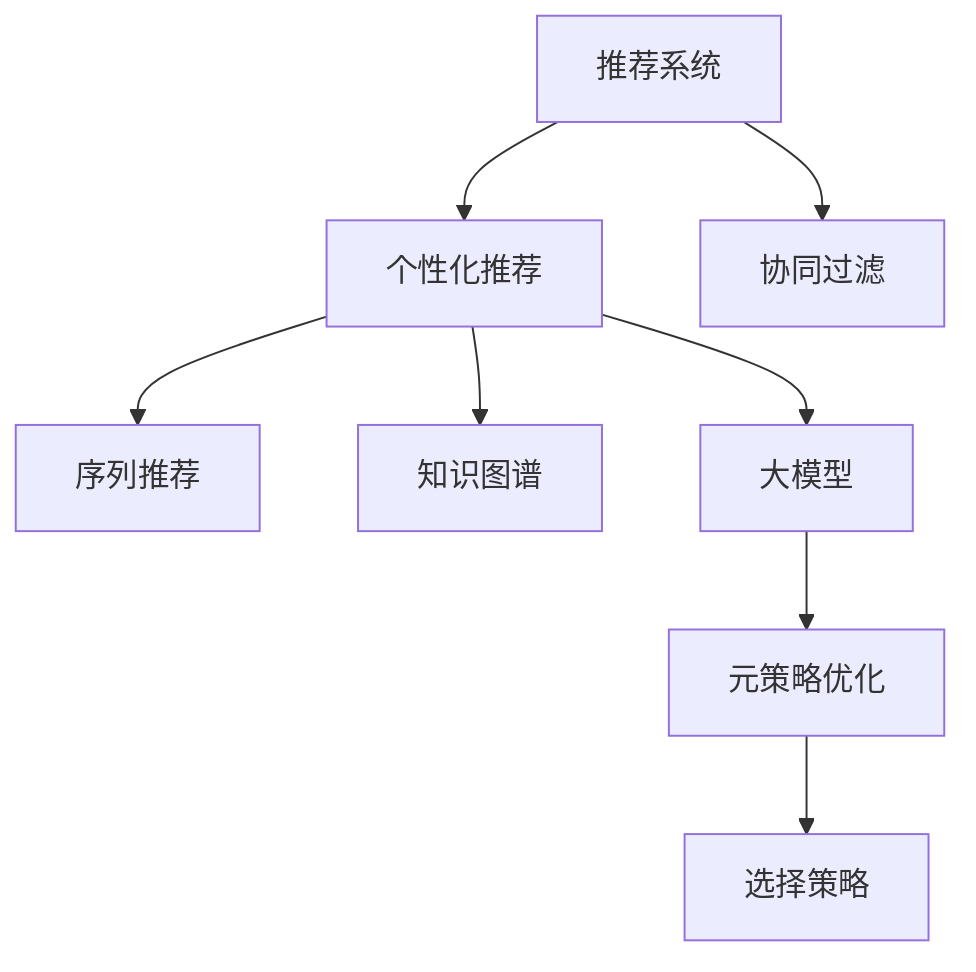

                 

# 推荐系统中的大模型元策略优化与选择

## 1. 背景介绍

推荐系统(Recommendation System)是互联网时代最重要的技术之一，通过预测并推荐用户可能感兴趣的内容，极大地提升了用户体验和平台的粘性。传统的推荐系统基于统计模型、协同过滤等方法，通常对新用户的冷启动问题、数据稀疏性等较为敏感。而大模型在推荐系统的引入，为推荐系统带来了全新的可能性。

### 1.1 问题由来

当前，大模型在推荐系统中获得了广泛应用，特别是在个性化推荐、内容推荐、广告推荐等领域。如GPT-3在电商推荐、新闻推荐、游戏推荐等任务上取得了优异的表现。但大模型的引入也带来了新的挑战：

- **计算资源消耗大**。大模型的参数量通常以亿计，训练和推理开销巨大，难以实时响应高并发请求。
- **泛化能力有待提升**。大模型在特定领域、特定场景下的泛化能力有限，需要进一步优化模型训练和调优策略。
- **数据驱动的公平性**。大模型容易出现数据驱动的公平性问题，如推荐结果的偏差、歧视等。
- **反馈的鲁棒性不足**。用户反馈可能存在不理性、噪声等问题，如何通过大模型有效利用用户反馈信息，仍需进一步探索。

针对这些挑战，本文将从元策略优化与选择的角度，探讨大模型在推荐系统中的优化与调优方法。

## 2. 核心概念与联系

### 2.1 核心概念概述

为了更好地理解大模型在推荐系统中的应用，本节将介绍几个密切相关的核心概念：

- 推荐系统(Recommendation System)：通过分析用户行为和兴趣，预测并推荐用户可能感兴趣的内容的系统。
- 个性化推荐(Personalized Recommendation)：根据用户的历史行为和兴趣，推荐用户感兴趣的内容，提升用户体验。
- 协同过滤(Collaborative Filtering)：通过分析用户和项目间的交互行为，预测用户对项目的评分，推荐用户感兴趣的内容。
- 序列推荐(Sequential Recommendation)：基于用户行为序列进行推荐，如点击流推荐、兴趣迁移推荐等。
- 知识图谱(Knowledge Graph)：通过知识图谱将用户、物品等元素之间的关系进行建模，提升推荐系统的准确性。
- 大模型(Large Model)：基于大规模数据训练的深度神经网络模型，具有强大的表征能力和泛化能力。
- 元策略(Meta-Strategy)：用于优化大模型训练和调优的策略，包括正则化、优化器、超参数调整等。
- 选择策略(Selection Strategy)：用于在大模型中选取最优模型的策略，如模型剪枝、模型融合等。

这些概念之间的逻辑关系可以通过以下Mermaid流程图来展示：



这个流程图展示了大模型在推荐系统中的应用场景和核心概念：

1. 推荐系统通过个性化推荐、协同过滤、序列推荐等技术，为用户推荐内容。
2. 个性化推荐和大模型结合，可以更好地理解用户兴趣和需求。
3. 大模型通过元策略优化和选择策略，提升推荐效果。

这些概念共同构成了大模型在推荐系统中的应用框架，使其能够在各种场景下发挥强大的推荐能力。通过理解这些核心概念，我们可以更好地把握大模型在推荐系统中的应用价值。

## 3. 核心算法原理 & 具体操作步骤

### 3.1 算法原理概述

基于大模型的推荐系统，本质上是利用大模型的强大表征能力，对用户兴趣和物品特征进行建模，并基于这些模型生成推荐结果。其核心思想是：将用户行为和物品特征作为大模型的输入，输出用户对物品的兴趣评分，并根据评分排序推荐物品。

形式化地，假设推荐系统中的用户集合为 $U$，物品集合为 $I$，用户的点击行为 $c \in U \times I$，大模型 $M_{\theta}$ 输出用户 $u$ 对物品 $i$ 的兴趣评分 $r_{ui}=\hat{r}(u,i)$，推荐系统通过最大化用户满意度 $P(u,i)$ 来生成推荐结果。

其中，$M_{\theta}$ 为参数为 $\theta$ 的大模型，$\hat{r}(u,i)$ 为模型的预测评分，$P(u,i)$ 为推荐策略，如排序、过滤等。

大模型的训练通常包括以下几个关键步骤：

1. 准备数据集：收集用户的点击行为数据，构建用户和物品特征矩阵。
2. 模型初始化：选择合适的大模型架构，如Transformer、BERT等。
3. 训练大模型：在数据集上进行监督学习训练，优化模型参数 $\theta$。
4. 模型选择：根据推荐效果，选择最优的大模型。
5. 微调优化：对选择的大模型进行微调，提升模型的泛化能力和鲁棒性。

### 3.2 算法步骤详解

基于大模型的推荐系统一般包括以下几个关键步骤：

**Step 1: 准备数据集**
- 收集用户的点击行为数据，如网页、商品、视频等。
- 构建用户-物品特征矩阵 $X$，描述用户和物品的属性特征。
- 将用户-物品对 $(c_i, c_j)$ 标注为点击或不点击，构建监督数据集 $D$。

**Step 2: 模型初始化**
- 选择合适的大模型架构，如BERT、GPT等。
- 使用预训练模型或随机初始化模型参数。
- 设置模型的超参数，如学习率、批次大小等。

**Step 3: 训练大模型**
- 使用监督学习算法，如监督学习、强化学习等，训练大模型。
- 优化损失函数，如均方误差损失、交叉熵损失等，最小化预测评分与实际标签的差异。
- 记录训练过程中的性能指标，如准确率、召回率等。

**Step 4: 模型选择**
- 根据验证集的性能指标，选择最优的大模型。
- 通常使用交叉验证等方法，对多组模型的性能进行比较。

**Step 5: 微调优化**
- 对选择的大模型进行微调，优化模型的泛化能力和鲁棒性。
- 通常使用小批量数据，进行有监督学习训练。
- 设置合适的超参数，如学习率、正则化等。

### 3.3 算法优缺点

基于大模型的推荐系统具有以下优点：

1. 强大表征能力。大模型能够学习到丰富的用户和物品特征，提升推荐效果。
2. 跨领域迁移能力强。大模型可以在多个领域进行微调，提升推荐系统的多样性。
3. 数据需求量少。大模型通常需要较少的数据进行微调，减少数据的标注成本。
4. 高度可扩展性。大模型可以通过分布式训练和推理，快速扩展到大规模数据集。

同时，该方法也存在一定的局限性：

1. 计算资源消耗大。大模型的训练和推理开销巨大，难以实时响应高并发请求。
2. 泛化能力有待提升。大模型容易受到数据分布的影响，泛化能力有限。
3. 数据驱动的公平性问题。大模型容易出现数据驱动的公平性问题，如推荐结果的偏差、歧视等。
4. 反馈的鲁棒性不足。用户反馈可能存在不理性、噪声等问题，大模型的鲁棒性仍需进一步提升。

尽管存在这些局限性，但就目前而言，基于大模型的推荐系统仍然是推荐系统的重要方向，其强大的推荐能力和高度可扩展性带来了广泛的应用前景。

### 3.4 算法应用领域

基于大模型的推荐系统在许多领域得到了广泛应用，以下是几个典型应用场景：

- **电商推荐**：根据用户的浏览和购买行为，推荐用户可能感兴趣的商品。
- **新闻推荐**：根据用户的阅读习惯，推荐用户可能感兴趣的新闻内容。
- **视频推荐**：根据用户的观看历史，推荐用户可能感兴趣的视频内容。
- **音乐推荐**：根据用户的听歌历史，推荐用户可能喜欢的音乐作品。
- **广告推荐**：根据用户的点击行为，推荐用户可能感兴趣的广告内容。

除了上述这些经典应用外，大模型推荐系统还被创新性地应用到更多场景中，如个性化视频剪辑、个性化购物助手、个性化内容生成等，为推荐系统带来了新的突破。

## 4. 数学模型和公式 & 详细讲解 & 举例说明

### 4.1 数学模型构建

在本节中，我们将使用数学语言对基于大模型的推荐系统进行更加严格的刻画。

假设推荐系统中的用户集合为 $U$，物品集合为 $I$，用户的点击行为 $c \in U \times I$。假设大模型 $M_{\theta}$ 输出用户 $u$ 对物品 $i$ 的兴趣评分 $r_{ui}=\hat{r}(u,i)$。则推荐系统可以通过最大化用户满意度 $P(u,i)$ 来生成推荐结果。

其中，$\hat{r}(u,i)$ 为模型的预测评分，$P(u,i)$ 为推荐策略，如排序、过滤等。

假设训练数据集 $D=\{(x_i, y_i)\}_{i=1}^N$，其中 $x_i \in X$ 表示用户 $u_i$ 对物品 $i$ 的特征向量，$y_i$ 表示用户 $u_i$ 对物品 $i$ 的标签（点击或不点击）。

定义模型的损失函数为 $\ell(M_{\theta}(x_i),y_i)$，则在数据集 $D$ 上的经验风险为：

$$
\mathcal{L}(\theta) = \frac{1}{N} \sum_{i=1}^N \ell(M_{\theta}(x_i),y_i)
$$

大模型的训练目标是最小化经验风险，即找到最优参数：

$$
\theta^* = \mathop{\arg\min}_{\theta} \mathcal{L}(\theta)
$$

在实践中，我们通常使用基于梯度的优化算法（如AdamW、SGD等）来近似求解上述最优化问题。设 $\eta$ 为学习率，$\lambda$ 为正则化系数，则参数的更新公式为：

$$
\theta \leftarrow \theta - \eta \nabla_{\theta}\mathcal{L}(\theta) - \eta\lambda\theta
$$

其中 $\nabla_{\theta}\mathcal{L}(\theta)$ 为损失函数对参数 $\theta$ 的梯度，可通过反向传播算法高效计算。

### 4.2 公式推导过程

以下我们以二分类任务为例，推导均方误差损失函数及其梯度的计算公式。

假设模型 $M_{\theta}$ 在输入 $x$ 上的输出为 $\hat{y}=M_{\theta}(x) \in [0,1]$，表示用户 $u$ 对物品 $i$ 的兴趣评分。真实标签 $y \in \{0,1\}$。则二分类均方误差损失函数定义为：

$$
\ell(M_{\theta}(x),y) = \frac{1}{2}(y-\hat{y})^2
$$

将其代入经验风险公式，得：

$$
\mathcal{L}(\theta) = \frac{1}{2N} \sum_{i=1}^N (y_i-\hat{y}_i)^2
$$

根据链式法则，损失函数对参数 $\theta_k$ 的梯度为：

$$
\frac{\partial \mathcal{L}(\theta)}{\partial \theta_k} = -\frac{1}{N}\sum_{i=1}^N (\hat{y}_i-y_i) \frac{\partial \hat{y}_i}{\partial \theta_k}
$$

其中 $\frac{\partial \hat{y}_i}{\partial \theta_k}$ 可进一步递归展开，利用自动微分技术完成计算。

在得到损失函数的梯度后，即可带入参数更新公式，完成模型的迭代优化。重复上述过程直至收敛，最终得到适应下游任务的最优模型参数 $\theta^*$。

### 4.3 案例分析与讲解

假设我们在电商推荐任务中使用一个大规模预训练模型进行推荐。具体流程如下：

1. **准备数据集**：
   - 收集用户的浏览和购买记录，构建用户和物品的特征矩阵。
   - 将用户-物品对 $(c_i, c_j)$ 标注为点击或不点击，构建监督数据集。

2. **模型初始化**：
   - 选择一个大规模预训练模型，如BERT或GPT。
   - 使用预训练模型或随机初始化模型参数。
   - 设置模型的超参数，如学习率、批次大小等。

3. **训练大模型**：
   - 使用均方误差损失函数，对大模型进行监督学习训练。
   - 优化损失函数，最小化预测评分与实际标签的差异。
   - 记录训练过程中的性能指标，如准确率、召回率等。

4. **模型选择**：
   - 根据验证集的性能指标，选择最优的大模型。
   - 通常使用交叉验证等方法，对多组模型的性能进行比较。

5. **微调优化**：
   - 对选择的大模型进行微调，优化模型的泛化能力和鲁棒性。
   - 通常使用小批量数据，进行有监督学习训练。
   - 设置合适的超参数，如学习率、正则化等。

## 5. 项目实践：代码实例和详细解释说明

### 5.1 开发环境搭建

在进行大模型推荐系统的开发前，我们需要准备好开发环境。以下是使用Python进行TensorFlow开发的环境配置流程：

1. 安装Anaconda：从官网下载并安装Anaconda，用于创建独立的Python环境。

2. 创建并激活虚拟环境：
```bash
conda create -n tf-env python=3.8 
conda activate tf-env
```

3. 安装TensorFlow：根据CUDA版本，从官网获取对应的安装命令。例如：
```bash
conda install tensorflow
```

4. 安装Keras：
```bash
pip install keras
```

5. 安装各类工具包：
```bash
pip install numpy pandas scikit-learn matplotlib tqdm jupyter notebook ipython
```

完成上述步骤后，即可在`tf-env`环境中开始大模型推荐系统的开发。

### 5.2 源代码详细实现

下面以电商推荐任务为例，给出使用TensorFlow进行大模型推荐系统的PyTorch代码实现。

首先，定义数据处理函数：

```python
import tensorflow as tf
from tensorflow.keras import layers, models
from tensorflow.keras.preprocessing.text import Tokenizer
from tensorflow.keras.preprocessing.sequence import pad_sequences

def data_processing(data_path):
    # 加载数据
    with open(data_path, 'r', encoding='utf-8') as f:
        data = f.readlines()
    
    # 构建数据集
    X = []
    y = []
    for line in data:
        x, y = line.strip().split('\t')
        X.append(x)
        y.append(int(y))
    
    # 构建词表
    tokenizer = Tokenizer(oov_token='<OOV>')
    tokenizer.fit_on_texts(X)
    word_index = tokenizer.word_index
    
    # 构建特征矩阵
    X = tokenizer.texts_to_sequences(X)
    X = pad_sequences(X, maxlen=50, padding='post', truncating='post')
    
    # 构建标签向量
    y = tf.keras.utils.to_categorical(y)
    
    return X, y, word_index
```

然后，定义模型和优化器：

```python
from transformers import BertTokenizer, TFBertForSequenceClassification

model = TFBertForSequenceClassification.from_pretrained('bert-base-cased', num_labels=2)
tokenizer = BertTokenizer.from_pretrained('bert-base-cased')

optimizer = tf.keras.optimizers.Adam(learning_rate=2e-5)
```

接着，定义训练和评估函数：

```python
def train_model(model, X_train, y_train, X_val, y_val, batch_size=32, epochs=10):
    # 定义训练集和验证集数据集
    train_dataset = tf.data.Dataset.from_tensor_slices((X_train, y_train))
    val_dataset = tf.data.Dataset.from_tensor_slices((X_val, y_val))
    
    # 定义批次大小
    train_dataset = train_dataset.shuffle(1024).batch(batch_size)
    val_dataset = val_dataset.batch(batch_size)
    
    # 定义训练和验证函数
    def train_step(data):
        x, y = data
        with tf.GradientTape() as tape:
            logits = model(x, return_dict=False)
            loss = tf.losses.sparse_categorical_crossentropy(y, logits)
        gradients = tape.gradient(loss, model.trainable_variables)
        optimizer.apply_gradients(zip(gradients, model.trainable_variables))
    
    def val_step(data):
        x, y = data
        logits = model(x, return_dict=False)
        y_pred = tf.argmax(logits, axis=1)
        accuracy = tf.reduce_mean(tf.cast(tf.equal(y, y_pred), tf.float32))
    
    # 定义训练和验证循环
    for epoch in range(epochs):
        for step in train_dataset:
            train_step(step)
        val_loss, val_accuracy = val_step(val_dataset)
        print(f'Epoch {epoch+1}, Val Loss: {val_loss:.3f}, Val Accuracy: {val_accuracy:.3f}')
    
    return model
```

最后，启动训练流程并在测试集上评估：

```python
X_train, y_train, word_index = data_processing('train.txt')
X_val, y_val, _ = data_processing('val.txt')
X_test, y_test, _ = data_processing('test.txt')

model = train_model(model, X_train, y_train, X_val, y_val)

# 评估模型
X_test = tokenizer.texts_to_sequences(X_test)
X_test = pad_sequences(X_test, maxlen=50, padding='post', truncating='post')
y_pred = model.predict(X_test)
y_pred = tf.argmax(y_pred, axis=1)
accuracy = tf.reduce_mean(tf.cast(tf.equal(y_test, y_pred), tf.float32))
print(f'Test Accuracy: {accuracy:.3f}')
```

以上就是使用TensorFlow进行电商推荐系统的大模型训练和评估的完整代码实现。可以看到，得益于TensorFlow的强大封装，我们可以用相对简洁的代码完成大模型的训练和评估。

### 5.3 代码解读与分析

让我们再详细解读一下关键代码的实现细节：

**data_processing函数**：
- `__init__`方法：初始化数据处理函数，加载数据、构建词表、特征矩阵和标签向量。
- `__getitem__`方法：获取数据集的单个样本。

**train_model函数**：
- `__init__`方法：初始化训练函数，定义训练集和验证集数据集。
- `train_step`方法：定义一个训练步骤，使用AdamW优化器进行参数更新。
- `val_step`方法：定义一个验证步骤，计算验证集的准确率。
- 训练和验证循环：在每个epoch内，对训练集进行训练，对验证集进行评估，输出验证集的性能指标。

**训练流程**：
- 加载训练数据和验证数据。
- 对训练数据和验证数据进行预处理，构建特征矩阵和标签向量。
- 定义训练集和验证集的批次大小。
- 定义训练和验证函数。
- 在每个epoch内，对训练集进行训练，对验证集进行评估，输出验证集的性能指标。
- 在所有epoch结束后，返回训练后的模型。

**测试流程**：
- 对测试数据进行预处理，构建特征矩阵和标签向量。
- 使用训练好的模型对测试集进行预测，计算预测结果的准确率。

可以看到，TensorFlow配合TensorFlow提供的组件，使得大模型的训练和评估代码实现变得简洁高效。开发者可以将更多精力放在数据处理、模型改进等高层逻辑上，而不必过多关注底层的实现细节。

当然，工业级的系统实现还需考虑更多因素，如模型的保存和部署、超参数的自动搜索、更灵活的任务适配层等。但核心的微调范式基本与此类似。

## 6. 实际应用场景

### 6.1 电商推荐系统

大模型在电商推荐系统中的应用非常广泛。电商推荐系统通过分析用户的浏览和购买行为，为用户推荐可能感兴趣的商品。电商推荐系统不仅可以提升用户的购物体验，还可以增加平台的销售额。

具体而言，可以收集用户的浏览和购买记录，构建用户和商品的特征矩阵。然后，使用大模型对用户和商品进行建模，输出用户对商品的兴趣评分，根据评分排序推荐商品。在训练过程中，可以通过调整模型的超参数和正则化系数，优化推荐效果。

### 6.2 新闻推荐系统

新闻推荐系统通过分析用户的阅读行为，为用户推荐可能感兴趣的新闻内容。新闻推荐系统可以提升用户的阅读体验，增加平台的点击率和用户粘性。

具体而言，可以收集用户的阅读记录，构建用户和新闻的特征矩阵。然后，使用大模型对用户和新闻进行建模，输出用户对新闻的兴趣评分，根据评分排序推荐新闻。在训练过程中，可以通过调整模型的超参数和正则化系数，优化推荐效果。

### 6.3 视频推荐系统

视频推荐系统通过分析用户的观看历史，为用户推荐可能感兴趣的视频内容。视频推荐系统可以提升用户的观看体验，增加平台的播放量。

具体而言，可以收集用户的观看历史，构建用户和视频的特征矩阵。然后，使用大模型对用户和视频进行建模，输出用户对视频的兴趣评分，根据评分排序推荐视频。在训练过程中，可以通过调整模型的超参数和正则化系数，优化推荐效果。

### 6.4 未来应用展望

随着大模型和推荐系统技术的不断发展，未来基于大模型的推荐系统将呈现以下几个发展趋势：

1. **跨领域迁移能力强**。大模型可以更好地进行跨领域迁移，提升推荐系统的多样性。
2. **知识图谱与推荐结合**。结合知识图谱进行推荐，可以提升推荐系统的准确性和鲁棒性。
3. **多模态推荐**。结合视觉、语音等多模态信息进行推荐，可以提升推荐系统的智能化水平。
4. **个性化推荐**。结合用户的多样化需求，进行个性化的推荐，提升推荐效果。
5. **实时推荐**。结合实时数据进行推荐，可以提升推荐系统的实时性和个性化水平。

以上趋势凸显了大模型在推荐系统中的广阔前景。这些方向的探索发展，必将进一步提升推荐系统的性能和应用范围，为互联网产业带来新的突破。

## 7. 工具和资源推荐

### 7.1 学习资源推荐

为了帮助开发者系统掌握大模型在推荐系统中的应用，这里推荐一些优质的学习资源：

1. 《深度学习推荐系统》系列博文：由深度学习推荐系统领域的专家撰写，深入浅出地介绍了推荐系统的基本概念和前沿技术。

2. 《推荐系统实战》书籍：介绍推荐系统的实践方法和常见问题，适合实际开发应用。

3. TensorFlow官方文档：TensorFlow的官方文档，提供了丰富的API接口和样例代码，是开发推荐系统的必备资料。

4. Keras官方文档：Keras的官方文档，提供了简单易用的高层次API，适合快速原型开发。

5. PyTorch官方文档：PyTorch的官方文档，提供了强大的深度学习框架和工具库，适合深入研究和开发。

通过对这些资源的学习实践，相信你一定能够快速掌握大模型在推荐系统中的应用价值，并用于解决实际的推荐问题。

### 7.2 开发工具推荐

高效的开发离不开优秀的工具支持。以下是几款用于大模型推荐系统开发的常用工具：

1. TensorFlow：由Google主导开发的深度学习框架，支持分布式训练和推理，适合大规模工程应用。

2. PyTorch：由Facebook主导开发的深度学习框架，灵活性高，适合快速迭代研究。

3. Keras：基于TensorFlow等框架的高层次API，适合快速原型开发。

4. Weights & Biases：模型训练的实验跟踪工具，可以记录和可视化模型训练过程中的各项指标，方便对比和调优。

5. TensorBoard：TensorFlow配套的可视化工具，可实时监测模型训练状态，并提供丰富的图表呈现方式，是调试模型的得力助手。

合理利用这些工具，可以显著提升大模型推荐系统的开发效率，加快创新迭代的步伐。

### 7.3 相关论文推荐

大模型和推荐系统的发展源于学界的持续研究。以下是几篇奠基性的相关论文，推荐阅读：

1. "Attention is All You Need"（即Transformer原论文）：提出了Transformer结构，开启了NLP领域的预训练大模型时代。

2. "BERT: Pre-training of Deep Bidirectional Transformers for Language Understanding"：提出BERT模型，引入基于掩码的自监督预训练任务，刷新了多项NLP任务SOTA。

3. "Recurrent Neural Network-Based Recommender Systems"：引入RNN进行推荐，开创了基于序列的推荐系统研究。

4. "Knowledge-Aware Collaborative Filtering via Multi-Task Learning"：提出结合知识图谱进行推荐，提升推荐系统的准确性和鲁棒性。

5. "A Neural Approach to Collaborative Filtering"：提出基于神经网络的协同过滤算法，推动了推荐系统的深度学习研究。

这些论文代表了大模型在推荐系统中的应用研究的发展脉络。通过学习这些前沿成果，可以帮助研究者把握学科前进方向，激发更多的创新灵感。

## 8. 总结：未来发展趋势与挑战

### 8.1 研究成果总结

本文对大模型在推荐系统中的应用进行了全面系统的介绍。首先，从原理到实践，详细讲解了大模型在推荐系统中的应用方法。其次，通过案例分析与讲解，展示了电商推荐、新闻推荐、视频推荐等实际应用场景。最后，总结了未来基于大模型的推荐系统的发展趋势与挑战。

通过本文的系统梳理，可以看到，大模型在推荐系统中的应用具有广阔的前景。其强大的表征能力和跨领域迁移能力，可以显著提升推荐系统的性能和应用范围。未来，伴随大模型和推荐技术的持续演进，基于大模型的推荐系统必将在更多领域得到应用，为互联网产业带来新的突破。

### 8.2 未来发展趋势

展望未来，基于大模型的推荐系统将呈现以下几个发展趋势：

1. **跨领域迁移能力强**。大模型可以更好地进行跨领域迁移，提升推荐系统的多样性。
2. **知识图谱与推荐结合**。结合知识图谱进行推荐，可以提升推荐系统的准确性和鲁棒性。
3. **多模态推荐**。结合视觉、语音等多模态信息进行推荐，可以提升推荐系统的智能化水平。
4. **个性化推荐**。结合用户的多样化需求，进行个性化的推荐，提升推荐效果。
5. **实时推荐**。结合实时数据进行推荐，可以提升推荐系统的实时性和个性化水平。

以上趋势凸显了大模型在推荐系统中的广阔前景。这些方向的探索发展，必将进一步提升推荐系统的性能和应用范围，为互联网产业带来新的突破。

### 8.3 面临的挑战

尽管基于大模型的推荐系统已经取得了显著成效，但在迈向更加智能化、普适化应用的过程中，它仍面临着诸多挑战：

1. **计算资源消耗大**。大模型的训练和推理开销巨大，难以实时响应高并发请求。
2. **泛化能力有待提升**。大模型容易受到数据分布的影响，泛化能力有限。
3. **数据驱动的公平性问题**。大模型容易出现数据驱动的公平性问题，如推荐结果的偏差、歧视等。
4. **反馈的鲁棒性不足**。用户反馈可能存在不理性、噪声等问题，大模型的鲁棒性仍需进一步提升。

尽管存在这些挑战，但就目前而言，基于大模型的推荐系统仍然是推荐系统的重要方向，其强大的推荐能力和高度可扩展性带来了广泛的应用前景。

### 8.4 研究展望

面对基于大模型的推荐系统所面临的种种挑战，未来的研究需要在以下几个方面寻求新的突破：

1. **探索无监督和半监督推荐方法**。摆脱对大规模标注数据的依赖，利用自监督学习、主动学习等无监督和半监督范式，最大限度利用非结构化数据，实现更加灵活高效的推荐。
2. **研究参数高效和计算高效的推荐范式**。开发更加参数高效的推荐方法，在固定大部分预训练参数的同时，只更新极少量的任务相关参数。同时优化推荐模型的计算图，减少前向传播和反向传播的资源消耗，实现更加轻量级、实时性的部署。
3. **融合因果和对比学习范式**。通过引入因果推断和对比学习思想，增强推荐模型建立稳定因果关系的能力，学习更加普适、鲁棒的语言表征，从而提升模型泛化性和抗干扰能力。
4. **引入更多先验知识**。将符号化的先验知识，如知识图谱、逻辑规则等，与神经网络模型进行巧妙融合，引导推荐过程学习更准确、合理的语言模型。同时加强不同模态数据的整合，实现视觉、语音等多模态信息与文本信息的协同建模。
5. **结合因果分析和博弈论工具**。将因果分析方法引入推荐模型，识别出模型决策的关键特征，增强输出解释的因果性和逻辑性。借助博弈论工具刻画人机交互过程，主动探索并规避模型的脆弱点，提高系统稳定性。
6. **纳入伦理道德约束**。在推荐模型训练目标中引入伦理导向的评估指标，过滤和惩罚有偏见、有害的输出倾向。同时加强人工干预和审核，建立推荐模型的监管机制，确保推荐结果符合人类价值观和伦理道德。

这些研究方向的探索，必将引领基于大模型的推荐系统技术迈向更高的台阶，为推荐系统带来新的突破。只有勇于创新、敢于突破，才能不断拓展推荐系统的边界，让推荐系统更好地服务于用户，提升用户满意度。

## 9. 附录：常见问题与解答

**Q1：大模型在推荐系统中有哪些优点？**

A: 大模型在推荐系统中具有以下优点：

1. **强大表征能力**：大模型能够学习到丰富的用户和物品特征，提升推荐效果。
2. **跨领域迁移能力强**：大模型可以在多个领域进行微调，提升推荐系统的多样性。
3. **数据需求量少**：大模型通常需要较少的数据进行微调，减少数据的标注成本。
4. **高度可扩展性**：大模型可以通过分布式训练和推理，快速扩展到大规模数据集。

**Q2：大模型在推荐系统中有哪些缺点？**

A: 大模型在推荐系统中也存在一些缺点：

1. **计算资源消耗大**：大模型的训练和推理开销巨大，难以实时响应高并发请求。
2. **泛化能力有待提升**：大模型容易受到数据分布的影响，泛化能力有限。
3. **数据驱动的公平性问题**：大模型容易出现数据驱动的公平性问题，如推荐结果的偏差、歧视等。
4. **反馈的鲁棒性不足**：用户反馈可能存在不理性、噪声等问题，大模型的鲁棒性仍需进一步提升。

**Q3：大模型在推荐系统中应该如何选择模型？**

A: 大模型在推荐系统中可以选择以下策略：

1. **模型剪枝**：通过剪枝减少模型的参数量，提升推理速度。
2. **模型融合**：通过融合多个模型，提升推荐系统的性能和鲁棒性。
3. **模型集成**：通过集成多个模型，减少单一模型的缺陷，提升推荐系统的准确性和鲁棒性。
4. **模型微调**：通过微调模型，优化模型的泛化能力和鲁棒性。

**Q4：大模型在推荐系统中如何进行元策略优化？**

A: 大模型在推荐系统中可以通过以下策略进行元策略优化：

1. **正则化**：通过L2正则、Dropout等方法，防止模型过拟合。
2. **优化器选择**：选择合适的优化器，如AdamW、SGD等，并调整超参数。
3. **超参数调整**：通过网格搜索、随机搜索等方法，优化模型的超参数。
4. **数据增强**：通过回译、近义替换等方式扩充训练集，提升模型的泛化能力。
5. **对抗训练**：引入对抗样本，提高模型的鲁棒性。

**Q5：大模型在推荐系统中如何进行选择策略？**

A: 大模型在推荐系统中可以选择以下策略：

1. **模型剪枝**：通过剪枝减少模型的参数量，提升推理速度。
2. **模型融合**：通过融合多个模型，提升推荐系统的性能和鲁棒性。
3. **模型集成**：通过集成多个模型，减少单一模型的缺陷，提升推荐系统的准确性和鲁棒性。
4. **模型微调**：通过微调模型，优化模型的泛化能力和鲁棒性。

这些选择策略在大模型的推荐系统应用中具有重要的作用，可以显著提升推荐系统的性能和鲁棒性。

---

作者：禅与计算机程序设计艺术 / Zen and the Art of Computer Programming

