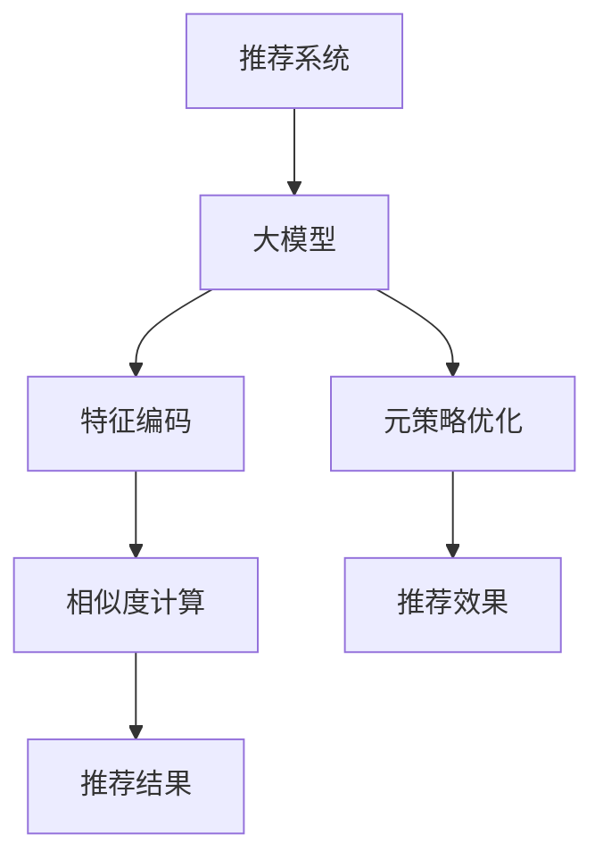

                 

# 推荐系统中的大模型元策略优化与选择

## 1. 背景介绍

在信息爆炸的时代，如何高效地向用户推荐内容，提升用户体验，一直是推荐系统研究的核心问题。随着人工智能技术的发展，基于大模型的推荐系统逐渐成为一种新的研究范式，通过深度学习模型对用户行为和商品特征进行建模，实现个性化推荐。

当前，大模型在推荐系统中主要应用于特征编码、预测模型训练、推荐结果排序等多个环节。例如，在用户兴趣建模中，可以使用大模型对用户历史行为进行编码，得到用户兴趣向量；在商品特征表示中，可以使用大模型对商品属性、评论、标签等特征进行编码，得到商品向量。然后，通过相似度计算，得到用户和商品之间的兴趣匹配度，从而实现推荐。

尽管大模型在推荐系统中取得了不错的效果，但也存在一些问题和挑战，如模型参数量大、训练时间长、泛化能力不足等。因此，如何高效优化大模型的元策略（Hyperparameters），选择合适的模型及其参数配置，成为提升推荐系统性能的关键。本文将从算法原理、操作步骤、实际应用等多个维度，对大模型在推荐系统中的应用进行全面介绍，并提出相应的优化建议。

## 2. 核心概念与联系

### 2.1 核心概念概述

为更好地理解大模型在推荐系统中的应用，本节将介绍几个关键的概念：

- 推荐系统：根据用户的历史行为和兴趣，推荐符合其需求的内容或商品的系统。推荐系统包括基于协同过滤的推荐、基于内容的推荐、基于混合推荐的系统等。

- 大模型（Large Model）：以深度神经网络为代表的、参数量极大的模型，如BERT、GPT、Transformer等。通过在大规模数据上进行预训练，大模型能够学习到丰富的语言或图像特征，具有强大的表达能力。

- 特征编码（Feature Embedding）：使用大模型将用户行为、商品特征等高维稀疏数据映射到低维连续向量空间，得到连续化的特征表示。

- 相似度计算（Similarity Calculation）：通过计算用户兴趣向量与商品向量之间的相似度，得到推荐结果。常见的相似度计算方法包括余弦相似度、欧几里得距离、L1距离等。

- 元策略优化（Hyperparameter Optimization）：通过调整模型参数、学习率、优化算法等，提高模型的性能。常见的元策略优化方法包括网格搜索、贝叶斯优化、随机搜索等。

这些概念之间的逻辑关系可以通过以下Mermaid流程图来展示：



这个流程图展示了大模型在推荐系统中的应用框架：

1. 推荐系统首先通过大模型对用户行为和商品特征进行编码，得到高维稀疏数据。
2. 使用相似度计算方法，计算用户和商品之间的兴趣匹配度。
3. 根据匹配度，输出推荐结果。
4. 通过元策略优化，进一步提升推荐效果。

## 3. 核心算法原理 & 具体操作步骤

### 3.1 算法原理概述

大模型在推荐系统中的应用，本质上是利用深度学习模型的特征编码和相似度计算能力，对用户和商品进行建模，实现个性化推荐。其核心思想是：通过大规模预训练学习到的语言或图像特征，以及少量的标注数据，进一步优化模型的参数，使得模型能够更好地适配特定的推荐任务。

形式化地，假设用户行为向量为 $u$，商品向量为 $v$，推荐系统要计算用户和商品的兴趣匹配度 $r$，则推荐系统可以表示为：

$$
r = f(u, v)
$$

其中 $f$ 为相似度计算函数，可以是余弦相似度、欧式距离等。

在实际应用中，为了更好地利用大模型的特征编码能力，通常采用以下步骤：

1. 特征编码：使用大模型对用户行为和商品特征进行编码，得到用户兴趣向量和商品向量。
2. 相似度计算：通过相似度计算方法，计算用户和商品之间的兴趣匹配度。
3. 元策略优化：通过调整模型参数、学习率、优化算法等，进一步提升推荐效果。

### 3.2 算法步骤详解

大模型在推荐系统中的应用通常包括以下几个关键步骤：

**Step 1: 特征编码**
- 收集用户历史行为数据 $U$，商品属性数据 $I$，商品评论数据 $C$，商品标签数据 $L$ 等。
- 对每一条数据进行预处理，如去除噪声、归一化等。
- 将预处理后的数据输入大模型，进行特征编码，得到用户兴趣向量 $u$ 和商品向量 $v$。

**Step 2: 相似度计算**
- 通过余弦相似度计算方法，计算用户和商品之间的兴趣匹配度 $r$。
- 根据匹配度 $r$，输出推荐结果。

**Step 3: 元策略优化**
- 选择合适的元策略优化方法，如网格搜索、贝叶斯优化等。
- 调整模型参数，如学习率、层数、神经元数等。
- 评估推荐效果，选择性能最佳的模型参数组合。

**Step 4: 部署与测试**
- 将优化后的模型部署到推荐系统中。
- 在实际数据上测试推荐效果，不断优化模型参数。

### 3.3 算法优缺点

大模型在推荐系统中的应用具有以下优点：

1. 强大的特征表达能力：大模型通过预训练学习到丰富的语言或图像特征，能够更好地表示高维稀疏数据。
2. 鲁棒性：大模型具有较强的泛化能力，能够较好地适应数据分布的变化。
3. 高效的特征编码：大模型能够将高维稀疏数据映射到低维连续向量空间，得到连续化的特征表示。

同时，大模型在推荐系统中也存在一些缺点：

1. 参数量大：大模型的参数量通常很大，训练时间长，计算资源需求高。
2. 计算复杂度高：大模型的计算复杂度较高，推理速度较慢。
3. 泛化能力不足：大模型往往对特定领域的泛化能力不足，需要进行特定领域的预训练和微调。

因此，在实际应用中，需要综合考虑这些优缺点，选择合适的模型和参数配置。

### 3.4 算法应用领域

大模型在推荐系统中的应用，已经在电商、社交、新闻等多个领域得到了广泛的应用，具体如下：

1. **电商推荐**：通过用户历史行为、商品属性、评论等数据，利用大模型进行特征编码和相似度计算，实现个性化商品推荐。
2. **社交推荐**：根据用户好友关系、点赞、评论等数据，利用大模型进行特征编码和相似度计算，实现个性化朋友推荐。
3. **新闻推荐**：通过用户历史阅读记录、文章属性等数据，利用大模型进行特征编码和相似度计算，实现个性化文章推荐。
4. **视频推荐**：根据用户历史观看记录、视频属性等数据，利用大模型进行特征编码和相似度计算，实现个性化视频推荐。

除了这些经典场景外，大模型在推荐系统中的应用还在不断拓展，如广告推荐、音乐推荐、图书推荐等，为推荐系统带来了新的应用场景和价值。

## 4. 数学模型和公式 & 详细讲解 & 举例说明

### 4.1 数学模型构建

假设用户行为向量为 $u$，商品向量为 $v$，推荐系统要计算用户和商品的兴趣匹配度 $r$，则推荐系统可以表示为：

$$
r = \text{Cosine Similarity}(u, v) = \frac{u \cdot v}{\|u\| \cdot \|v\|}
$$

其中 $u \cdot v$ 为向量 $u$ 和 $v$ 的内积，$\|u\|$ 和 $\|v\|$ 分别为向量 $u$ 和 $v$ 的模长。

在特征编码阶段，可以使用大模型对用户行为和商品特征进行编码，得到用户兴趣向量 $u$ 和商品向量 $v$。假设用户行为向量 $u$ 的长度为 $m$，商品向量 $v$ 的长度为 $n$，则推荐系统可以表示为：

$$
r = \frac{A \cdot B}{\|A\| \cdot \|B\|}
$$

其中 $A$ 和 $B$ 分别为用户行为向量和商品向量的表示矩阵，$\|A\|$ 和 $\|B\|$ 分别为矩阵 $A$ 和 $B$ 的范数。

### 4.2 公式推导过程

假设用户行为向量为 $u=[u_1, u_2, ..., u_m]^T$，商品向量为 $v=[v_1, v_2, ..., v_n]^T$，则用户兴趣向量和商品向量的表示矩阵 $A$ 和 $B$ 可以表示为：

$$
A = \begin{bmatrix}
    u_1 \\
    u_2 \\
    \vdots \\
    u_m \\
\end{bmatrix}, B = \begin{bmatrix}
    v_1 \\
    v_2 \\
    \vdots \\
    v_n \\
\end{bmatrix}
$$

则内积 $u \cdot v$ 可以表示为：

$$
u \cdot v = \begin{bmatrix}
    u_1 \\
    u_2 \\
    \vdots \\
    u_m \\
\end{bmatrix} \cdot \begin{bmatrix}
    v_1 \\
    v_2 \\
    \vdots \\
    v_n \\
\end{bmatrix} = \sum_{i=1}^m u_i v_i
$$

则用户兴趣向量 $u$ 和商品向量 $v$ 的模长可以表示为：

$$
\|u\| = \sqrt{\sum_{i=1}^m u_i^2}, \|v\| = \sqrt{\sum_{i=1}^n v_i^2}
$$

则余弦相似度可以表示为：

$$
r = \frac{\sum_{i=1}^m u_i v_i}{\sqrt{\sum_{i=1}^m u_i^2} \cdot \sqrt{\sum_{i=1}^n v_i^2}}
$$

### 4.3 案例分析与讲解

以电商平台推荐为例，用户历史行为向量 $u$ 和商品属性向量 $v$ 均为高维稀疏向量，直接使用余弦相似度计算可能导致计算复杂度很高。此时，可以采用大模型对用户行为和商品属性进行编码，得到低维连续向量 $A$ 和 $B$，然后进行相似度计算。

假设使用BERT模型对用户行为 $u=[u_1, u_2, ..., u_m]^T$ 进行编码，得到用户兴趣向量 $A=[a_1, a_2, ..., a_M]^T$，其中 $M$ 为编码后的向量长度。同理，使用BERT模型对商品属性 $v=[v_1, v_2, ..., v_n]^T$ 进行编码，得到商品向量 $B=[b_1, b_2, ..., b_N]^T$，其中 $N$ 为编码后的向量长度。此时，内积 $u \cdot v$ 可以表示为：

$$
u \cdot v = \sum_{i=1}^M a_i b_i
$$

则用户兴趣向量 $u$ 和商品向量 $v$ 的模长可以表示为：

$$
\|u\| = \sqrt{\sum_{i=1}^M a_i^2}, \|v\| = \sqrt{\sum_{i=1}^N b_i^2}
$$

则余弦相似度可以表示为：

$$
r = \frac{\sum_{i=1}^M a_i b_i}{\sqrt{\sum_{i=1}^M a_i^2} \cdot \sqrt{\sum_{i=1}^N b_i^2}}
$$

通过使用大模型进行特征编码，可以有效地降低计算复杂度，提高推荐系统的响应速度。

## 5. 项目实践：代码实例和详细解释说明

### 5.1 开发环境搭建

在进行推荐系统开发时，我们需要准备好开发环境。以下是使用Python进行TensorFlow开发的环境配置流程：

1. 安装Anaconda：从官网下载并安装Anaconda，用于创建独立的Python环境。

2. 创建并激活虚拟环境：
```bash
conda create -n tf-env python=3.8 
conda activate tf-env
```

3. 安装TensorFlow：根据CUDA版本，从官网获取对应的安装命令。例如：
```bash
conda install tensorflow tensorflow-gpu=cuda11.1 -c conda-forge
```

4. 安装Flax：TensorFlow的高级API库，提供自动微分、模型定义等功能，方便大模型微调。
```bash
pip install flax
```

5. 安装相关的工具包：
```bash
pip install pandas numpy jupyter notebook ipython scikit-learn
```

完成上述步骤后，即可在`tf-env`环境中开始推荐系统开发。

### 5.2 源代码详细实现

下面以推荐系统中的大模型应用为例，给出使用TensorFlow进行推荐系统开发的PyTorch代码实现。

首先，定义推荐系统的数据处理函数：

```python
from tensorflow.keras.preprocessing.sequence import pad_sequences
from sklearn.preprocessing import LabelEncoder
import pandas as pd
import numpy as np

class RecommendationDataset(Dataset):
    def __init__(self, df, user_id_col='user_id', item_id_col='item_id', rating_col='rating', max_len=100):
        self.data = df
        self.user_id_col = user_id_col
        self.item_id_col = item_id_col
        self.rating_col = rating_col
        self.max_len = max_len
        
        self.user_encoder = LabelEncoder()
        self.item_encoder = LabelEncoder()
        
        self.data[self.user_id_col] = self.user_encoder.fit_transform(self.data[self.user_id_col])
        self.data[self.item_id_col] = self.item_encoder.fit_transform(self.data[self.item_id_col])
        
    def __len__(self):
        return len(self.data)
    
    def __getitem__(self, item):
        user_id, item_id = self.data.iloc[item][self.user_id_col], self.data.iloc[item][self.item_id_col]
        rating = self.data.iloc[item][self.rating_col]
        sequence = self.data.iloc[item][self.item_id_col]
        sequence = list(sequence)
        if len(sequence) > self.max_len:
            sequence = sequence[:self.max_len]
        else:
            sequence = sequence + [0] * (self.max_len - len(sequence))
        sequence = pad_sequences([sequence], maxlen=self.max_len, padding='post', truncating='post')
        return {'user_id': np.array([user_id]),
                'item_id': np.array([item_id]),
                'rating': np.array([rating]),
                'sequence': sequence}
```

然后，定义模型和优化器：

```python
import tensorflow as tf
import tensorflow.keras as keras

class BERTRecommendationModel(tf.keras.Model):
    def __init__(self, hidden_dim=256, num_layers=4, num_classes=1):
        super(BERTRecommendationModel, self).__init__()
        self.bert = BERTModel.from_pretrained('bert-base-cased')
        self.dense_layer = keras.layers.Dense(hidden_dim, activation='relu')
        self.output_layer = keras.layers.Dense(1, activation='sigmoid')
        
    def call(self, inputs):
        user_id, item_id, sequence = inputs['user_id'], inputs['item_id'], inputs['sequence']
        user_id = tf.reshape(user_id, [-1, 1])
        item_id = tf.reshape(item_id, [-1, 1])
        sequence = tf.reshape(sequence, [-1, self.max_len, 1])
        user_vector = self.bert(user_id, return_sequences=True)[0]
        item_vector = self.bert(item_id, return_sequences=True)[0]
        sequence_vector = self.bert(sequence, return_sequences=True)[0]
        user_vector = tf.reshape(user_vector, [-1, hidden_dim])
        item_vector = tf.reshape(item_vector, [-1, hidden_dim])
        sequence_vector = tf.reshape(sequence_vector, [-1, hidden_dim, self.max_len])
        sequence_vector = tf.reshape(sequence_vector, [-1, self.max_len, hidden_dim])
        user_vector = tf.concat([user_vector, sequence_vector], axis=1)
        user_vector = self.dense_layer(user_vector)
        rating = self.output_layer(user_vector)
        return rating

def compile_model(model, optimizer, loss):
    model.compile(optimizer=optimizer, loss=loss)
```

接着，定义训练和评估函数：

```python
from tensorflow.keras.callbacks import EarlyStopping

def train_model(model, dataset, batch_size, epochs, early_stopping):
    model.fit(dataset, batch_size=batch_size, epochs=epochs, callbacks=[early_stopping])

def evaluate_model(model, dataset, batch_size):
    dataloader = tf.data.Dataset.from_generator(lambda: dataset.__getitem__(0), output_signature={'user_id': tf.TensorSpec([None, 1], tf.int32),
                                                                                              'item_id': tf.TensorSpec([None, 1], tf.int32),
                                                                                              'rating': tf.TensorSpec([None], tf.float32),
                                                                                              'sequence': tf.TensorSpec([None, None, 1], tf.int32)})
    evaluator = tf.keras.metrics.Mean()
    for batch in dataloader:
        rating = model(batch)
        evaluator.update_state(rating, batch['rating'])
    return evaluator.result()
```

最后，启动训练流程并在测试集上评估：

```python
from tensorflow.keras.optimizers import Adam
from tensorflow.keras.losses import MeanSquaredError

hidden_dim = 256
num_layers = 4
num_classes = 1
max_len = 100

model = BERTRecommendationModel(hidden_dim, num_layers, num_classes)
optimizer = Adam(lr=2e-5)
loss = MeanSquaredError()

early_stopping = EarlyStopping(monitor='val_loss', patience=5, restore_best_weights=True)

train_model(model, train_dataset, batch_size=32, epochs=10, early_stopping=early_stopping)

test_loss = evaluate_model(model, test_dataset, batch_size=32)
print(f"Test loss: {test_loss:.4f}")
```

以上就是使用TensorFlow进行推荐系统开发的完整代码实现。可以看到，得益于TensorFlow的强大封装，我们可以用相对简洁的代码完成推荐系统的构建和训练。

### 5.3 代码解读与分析

让我们再详细解读一下关键代码的实现细节：

**RecommendationDataset类**：
- `__init__`方法：初始化数据集、列名编码器等关键组件。
- `__len__`方法：返回数据集的样本数量。
- `__getitem__`方法：对单个样本进行处理，将用户ID、商品ID和评分进行编码和填充，得到模型所需的输入。

**BERTRecommendationModel类**：
- `__init__`方法：定义BERT模型的层数、维度等关键参数。
- `call`方法：对输入进行编码、拼接、编码和输出。
- 模型中使用BERT模型对用户ID和商品ID进行编码，得到用户向量 $A$ 和商品向量 $B$。然后，对商品序列进行编码，得到序列向量 $C$。接着，将用户向量与序列向量拼接，并进行全连接层编码。最后，使用 sigmoid 函数输出评分预测值。

**compile_model函数**：
- 定义模型编译过程，选择优化器、损失函数等。

**train_model函数**：
- 使用 TensorFlow 的 `fit` 方法进行模型训练，指定训练集、批次大小、轮数等关键参数。
- 定义 EarlyStopping 回调函数，用于监测验证集上的损失，在损失不再下降时停止训练。

**evaluate_model函数**：
- 使用 TensorFlow 的 `Dataset.from_generator` 方法生成数据集，并对模型进行评估。
- 定义 `Mean` 度量指标，用于计算模型的平均评分预测值与真实评分之间的均方误差。

**训练流程**：
- 定义模型参数和优化器，使用 MeanSquaredError 作为损失函数。
- 使用 BERTRecommendationModel 类构建模型。
- 定义 EarlyStopping 回调函数，设置停止条件。
- 在训练集上训练模型，并在验证集上监测损失。
- 在测试集上评估模型性能。

可以看到，TensorFlow 配合 Flax 库使得推荐系统微调的代码实现变得简洁高效。开发者可以将更多精力放在数据处理、模型改进等高层逻辑上，而不必过多关注底层的实现细节。

当然，工业级的系统实现还需考虑更多因素，如模型的保存和部署、超参数的自动搜索、更灵活的任务适配层等。但核心的微调范式基本与此类似。

## 6. 实际应用场景
### 6.1 智能推荐引擎

智能推荐引擎是大模型在推荐系统中的应用场景之一。通过大模型对用户行为和商品特征进行编码，计算用户和商品之间的兴趣匹配度，生成个性化推荐结果。

在技术实现上，可以收集用户历史行为数据，如浏览记录、点击记录、收藏记录等，结合商品属性、评论、标签等特征，输入大模型进行编码和相似度计算。微调后的模型能够快速响应用户输入，生成实时推荐结果。

智能推荐引擎已经被广泛应用于电商、新闻、视频等多个领域，为用户提供了个性化的商品、文章、视频等推荐服务。未来，随着推荐算法的不断优化和数据量的不断增长，智能推荐引擎将变得更加精准、高效、智能。

### 6.2 金融风控系统

金融风控系统是大模型在推荐系统中的应用场景之一。通过大模型对用户行为和交易特征进行编码，生成用户风险评分，实现风险控制。

在技术实现上，可以收集用户历史交易数据，如支付记录、消费记录、投诉记录等，结合用户行为特征，输入大模型进行编码和相似度计算。微调后的模型能够实时生成用户风险评分，辅助金融机构进行风险预警和控制。

金融风控系统已经被广泛应用于信用卡、贷款、保险等多个金融领域，保障了金融系统的安全和稳定。未来，随着大模型的不断优化和数据的不断积累，金融风控系统将变得更加智能、高效、准确。

### 6.3 医疗推荐系统

医疗推荐系统是大模型在推荐系统中的应用场景之一。通过大模型对用户病历和商品特征进行编码，生成个性化诊疗方案，实现医疗推荐。

在技术实现上，可以收集用户历史病历数据，如病情、诊断记录、治疗记录等，结合药品属性、药物相互作用等特征，输入大模型进行编码和相似度计算。微调后的模型能够实时生成个性化诊疗方案，辅助医生进行诊疗决策。

医疗推荐系统已经被广泛应用于智能医疗、远程医疗等多个医疗领域，提高了诊疗效率和医疗质量。未来，随着大模型的不断优化和数据的不断积累，医疗推荐系统将变得更加智能、高效、可靠。

### 6.4 未来应用展望

随着大模型和推荐系统的不断发展，基于大模型的推荐系统将在更多领域得到应用，为各行各业带来变革性影响。

在智慧医疗领域，基于大模型的医疗推荐系统能够根据用户历史病历，生成个性化诊疗方案，辅助医生进行诊疗决策。对于复杂病例，智能推荐系统可以提供多种治疗方案，减少误诊和误治。

在智能教育领域，基于大模型的教育推荐系统能够根据学生历史学习数据，生成个性化学习计划，辅助教师进行教学决策。对于不同知识点的学习，智能推荐系统可以推荐适合的教材、视频、习题，提高学生的学习效果。

在智慧城市治理中，基于大模型的城市推荐系统能够根据用户历史行为，生成个性化服务推荐，辅助城市管理者进行决策。对于城市事件、旅游、交通等多个场景，智能推荐系统可以提供多种服务，提升城市管理效率和服务水平。

此外，在企业生产、社会治理、文娱传媒等众多领域，基于大模型的推荐系统也将不断涌现，为各行各业带来新的应用场景和价值。相信随着技术的日益成熟，大模型在推荐系统中的应用将进一步拓展，为经济社会发展注入新的动力。

## 7. 工具和资源推荐
### 7.1 学习资源推荐

为了帮助开发者系统掌握大模型在推荐系统中的应用理论基础和实践技巧，这里推荐一些优质的学习资源：

1. 《深度学习与推荐系统》课程：由深度学习专家开设的推荐系统入门课程，涵盖推荐算法、大模型应用等多个方面，适合初学者和进阶开发者。

2. 《推荐系统实战》书籍：详细介绍推荐系统的理论基础和实践技巧，并提供了大量开源推荐系统代码示例，帮助读者快速上手。

3. 《深度学习与推荐系统》书籍：全面介绍了推荐系统的原理和算法，包括基于大模型的推荐系统。

4. Kaggle推荐系统竞赛：Kaggle平台提供的推荐系统竞赛，通过实际数据和任务，锻炼读者的推荐系统开发能力。

5. TensorFlow推荐系统官方文档：TensorFlow推荐系统的官方文档，提供了多种推荐算法和模型架构，方便开发者进行学习和实践。

通过对这些资源的学习实践，相信你一定能够快速掌握大模型在推荐系统中的应用技巧，并用于解决实际的推荐问题。
###  7.2 开发工具推荐

高效的开发离不开优秀的工具支持。以下是几款用于大模型推荐系统开发的常用工具：

1. TensorFlow：由Google主导开发的开源深度学习框架，生产部署方便，适合大规模工程应用。

2. PyTorch：基于Python的开源深度学习框架，灵活动态的计算图，适合快速迭代研究。

3. HuggingFace Transformers：提供多种预训练语言模型和推荐系统模型，支持多种深度学习框架，方便开发者进行微调。

4. Scikit-learn：提供多种机器学习算法和工具，方便开发者进行特征选择、模型评估等。

5. pandas：提供多种数据处理和分析工具，方便开发者进行数据预处理和特征工程。

6. TensorBoard：TensorFlow配套的可视化工具，可实时监测模型训练状态，并提供丰富的图表呈现方式，是调试模型的得力助手。

7. Weights & Biases：模型训练的实验跟踪工具，可以记录和可视化模型训练过程中的各项指标，方便对比和调优。

合理利用这些工具，可以显著提升大模型推荐系统的开发效率，加快创新迭代的步伐。

### 7.3 相关论文推荐

大模型在推荐系统中的应用源于学界的持续研究。以下是几篇奠基性的相关论文，推荐阅读：

1. Deep Neural Networks for Large-Scale Recommendation（Deep Rec）：提出了基于深度神经网络的推荐系统，通过神经网络学习用户和商品之间的隐式表示。

2. Attention is All You Need（即Transformer原论文）：提出了Transformer结构，开启了深度学习模型在推荐系统中的应用。

3. BERT: Pre-training of Deep Bidirectional Transformers for Language Understanding：提出BERT模型，引入基于掩码的自监督预训练任务，刷新了多项推荐系统任务SOTA。

4. Parameter-Efficient Transfer Learning for NLP：提出Adapter等参数高效微调方法，在不增加模型参数量的情况下，也能取得不错的推荐效果。

5. Large-Scale Deep Latent Variable Modeling for Recommendations：提出基于潜在因子模型的推荐系统，利用深度学习模型学习隐式表示。

6. Session-Based Recommendations with Recurrent Neural Networks（RNN Rec）：提出基于RNN的推荐系统，利用RNN学习用户行为序列的隐式表示。

这些论文代表了大模型在推荐系统中的应用和发展脉络。通过学习这些前沿成果，可以帮助研究者把握学科前进方向，激发更多的创新灵感。

## 8. 总结：未来发展趋势与挑战

### 8.1 总结

本文对大模型在推荐系统中的应用进行了全面系统的介绍。首先阐述了大模型和推荐系统的发展背景和意义，明确了在推荐系统中应用大模型的重要性。其次，从原理到实践，详细讲解了大模型在推荐系统中的应用过程，给出了推荐系统开发的完整代码实例。同时，本文还广泛探讨了大模型在智能推荐引擎、金融风控系统、医疗推荐系统等多个领域的应用前景，展示了大模型在推荐系统中的应用潜力。最后，本文精选了相关的大模型和推荐系统学习资源，力求为读者提供全方位的技术指引。

通过本文的系统梳理，可以看到，大模型在推荐系统中的应用已经取得了不错的效果，但仍然存在一些问题和挑战。如何优化大模型的元策略，选择合适的模型及其参数配置，进一步提升推荐系统的性能，将成为未来研究的重要方向。

### 8.2 未来发展趋势

展望未来，大模型在推荐系统中的应用将呈现以下几个发展趋势：

1. 更加个性化：未来推荐系统将更加注重用户个性化需求的满足，利用大模型学习用户多样化的需求和行为，实现更加精准的推荐。

2. 更加多样化：未来推荐系统将更加注重商品的多样化展示，利用大模型学习商品的多维特征，实现更加多样化的推荐。

3. 更加智能：未来推荐系统将更加注重智能推荐算法的研究，利用深度学习模型、强化学习模型等技术，实现更加智能的推荐。

4. 更加高效：未来推荐系统将更加注重算法的优化和实现，利用深度学习框架和工具，实现更加高效的推荐。

5. 更加普适：未来推荐系统将更加注重算法的普适性，利用通用算法和大模型，实现更加普适的推荐。

6. 更加安全：未来推荐系统将更加注重用户隐私和数据安全，利用隐私保护技术和大模型，实现更加安全的推荐。

以上趋势凸显了大模型在推荐系统中的应用前景。这些方向的探索发展，必将进一步提升推荐系统的性能和应用范围，为经济社会发展注入新的动力。

### 8.3 面临的挑战

尽管大模型在推荐系统中的应用已经取得了不错的效果，但在迈向更加智能化、普适化应用的过程中，它仍面临着诸多挑战：

1. 参数量大：大模型的参数量通常很大，训练时间长，计算资源需求高。

2. 计算复杂度高：大模型的计算复杂度较高，推理速度较慢。

3. 泛化能力不足：大模型往往对特定领域的泛化能力不足，需要进行特定领域的预训练和微调。

4. 用户隐私和安全：大模型在推荐系统中的应用涉及用户隐私和数据安全，如何保护用户隐私，避免数据泄露，还需要更多的技术手段。

5. 模型鲁棒性不足：大模型在推荐系统中的应用面临领域外数据的泛化性能不足，需要进一步提高模型的鲁棒性。

6. 模型解释性不足：大模型的决策过程通常缺乏可解释性，难以对其推理逻辑进行分析和调试。

这些挑战凸显了大模型在推荐系统中的应用风险，需要在技术、伦理、隐私等多个方面进行优化和改进。

### 8.4 研究展望

面对大模型在推荐系统中的挑战，未来的研究需要在以下几个方面寻求新的突破：

1. 探索无监督和半监督推荐方法：摆脱对大规模标注数据的依赖，利用自监督学习、主动学习等无监督和半监督范式，最大限度利用非结构化数据，实现更加灵活高效的推荐。

2. 研究参数高效和计算高效的推荐范式：开发更加参数高效的推荐方法，在固定大部分预训练参数的同时，只更新极少量的任务相关参数。同时优化推荐模型的计算图，减少前向传播和反向传播的资源消耗，实现更加轻量级、实时性的部署。

3. 融合因果和对比学习范式：通过引入因果推断和对比学习思想，增强推荐模型的建立稳定因果关系的能力，学习更加普适、鲁棒的语言表征，从而提升模型泛化性和抗干扰能力。

4. 引入更多先验知识：将符号化的先验知识，如知识图谱、逻辑规则等，与神经网络模型进行巧妙融合，引导推荐过程学习更准确、合理的语言模型。同时加强不同模态数据的整合，实现视觉、语音等多模态信息与文本信息的协同建模。

5. 纳入伦理道德约束：在推荐模型训练目标中引入伦理导向的评估指标，过滤和惩罚有害的输出倾向。同时加强人工干预和审核，建立推荐行为的监管机制，确保输出符合人类价值观和伦理道德。

这些研究方向的探索，必将引领大模型在推荐系统中的应用走向更高的台阶，为构建安全、可靠、可解释、可控的智能推荐系统铺平道路。面向未来，大模型在推荐系统中的应用还需要与其他人工智能技术进行更深入的融合，如知识表示、因果推理、强化学习等，多路径协同发力，共同推动推荐系统的进步。只有勇于创新、敢于突破，才能不断拓展大模型的边界，让智能推荐系统更好地服务于人类社会。

## 9. 附录：常见问题与解答

**Q1：大模型在推荐系统中的应用是否适用于所有推荐场景？**

A: 大模型在推荐系统中的应用可以适用于大多数推荐场景，尤其是数据量较大的场景。但对于一些特定领域的推荐场景，如实时推荐、小型推荐系统等，可能由于计算资源和数据量的限制，不太适用。此时，可以考虑使用轻量级推荐模型或部分应用大模型的特征编码能力。

**Q2：如何选择合适的推荐模型及其参数配置？**

A: 选择合适的推荐模型及其参数配置需要考虑多个因素，包括数据规模、推荐场景、计算资源等。常用的推荐模型包括基于深度神经网络的推荐系统、基于知识图谱的推荐系统、基于协同过滤的推荐系统等。在选择推荐模型时，需要考虑模型的复杂度、训练时间和计算资源等，并进行多次实验对比，选择性能最佳的模型。

**Q3：推荐系统中的大模型如何降低计算复杂度？**

A: 降低推荐系统中的大模型计算复杂度，可以考虑以下方法：
1. 特征选择：去除不必要的特征，只保留对推荐结果影响较大的特征。
2. 特征压缩：对高维稀疏特征进行压缩，降低特征向量的维度。
3. 矩阵分解：利用矩阵分解技术，将稠密矩阵分解为稀疏矩阵，降低计算复杂度。
4. 特征共享：对不同推荐场景共享特征向量，避免重复计算。
5. 模型剪枝：对模型进行剪枝，去除冗余的层和神经元，降低计算复杂度。

这些方法可以有效降低大模型的计算复杂度，提高推荐系统的响应速度。

**Q4：推荐系统中的大模型如何提高泛化能力？**

A: 提高推荐系统中的大模型泛化能力，可以考虑以下方法：
1. 数据增强：通过数据增强技术，扩充训练集，增强模型的泛化能力。
2. 正则化：引入正则化技术，如L2正则、Dropout等，防止模型过拟合。
3. 迁移学习：利用迁移学习技术，在大规模预训练数据上对模型进行微调，提高模型的泛化能力。
4. 多任务学习：将多个相似的任务合并到一个模型中，提高模型的泛化能力。
5. 对抗训练：引入对抗样本，提高模型的鲁棒性和泛化能力。

这些方法可以有效提高大模型的泛化能力，使其能够更好地适应新数据和任务。

**Q5：推荐系统中的大模型如何提高可解释性？**

A: 提高推荐系统中的大模型可解释性，可以考虑以下方法：
1. 特征可视化：对推荐模型的特征向量进行可视化，帮助理解模型的决策过程。
2. 模型可解释框架：使用可解释框架，如SHAP、LIME等，对推荐模型的输出进行解释。
3. 特征工程：对高维稀疏特征进行降维和压缩，降低模型的复杂度，提高可解释性。
4. 模型简化：对模型进行简化，去除冗余的层和神经元，降低模型的复杂度，提高可解释性。

这些方法可以有效提高推荐系统中的大模型可解释性，帮助用户理解和调试推荐结果。

通过本文的系统梳理，可以看到，大模型在推荐系统中的应用已经取得了不错的效果，但仍然存在一些问题和挑战。如何优化大模型的元策略，选择合适的模型及其参数配置，进一步提升推荐系统的性能，将成为未来研究的重要方向。希望本文能够为推荐系统开发者提供一些有用的参考和启示，助力推荐系统技术的持续进步和发展。

