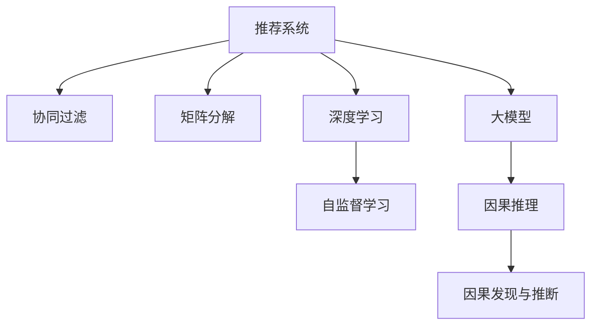

                 

# 推荐系统中的大模型因果发现与推断

## 1. 背景介绍

推荐系统是信息时代的重要应用之一，它能够根据用户历史行为和偏好，推荐符合用户需求的个性化内容。传统的推荐系统主要基于统计方法，通过挖掘用户行为数据中的隐含关联，进行协同过滤、矩阵分解等，实现物品的精准推荐。然而，在推荐系统中引入因果推理能够更好地理解用户行为背后的因果机制，从而实现更可靠、更公平的推荐。

近年来，随着深度学习技术的快速发展，基于大模型的推荐系统（Large Model-Based Recommendation Systems, LMBRS）得到了广泛关注。大模型能够通过自监督学习任务在大规模数据上预训练出强大的语言和结构表示能力，结合微调技术能够在特定任务上进一步提升模型性能。在推荐系统中，大模型可以通过因果推理，发现用户行为背后的因果机制，从而提升推荐精度和鲁棒性。

本文聚焦于大模型在推荐系统中的因果发现与推断方法，探讨如何在大模型推荐系统中有效利用因果推理，提高推荐效果，保证推荐公平性。通过分析当前因果推理在推荐系统中的应用现状和面临的挑战，提出一种基于大模型的因果推理框架，并在推荐系统中的具体实现方法。最后，对未来推荐系统的发展趋势和挑战进行总结。

## 2. 核心概念与联系

### 2.1 核心概念概述

为更好地理解大模型在推荐系统中的应用，本节将介绍几个关键概念：

- 推荐系统(Recommendation System)：一种通过挖掘用户行为数据，为用户推荐感兴趣物品的系统，能够显著提升用户体验和运营效率。
- 大模型(Large Model)：基于深度学习架构，使用大规模数据进行自监督预训练，具有强大的语言和结构表示能力的模型，如BERT、GPT等。
- 因果推理(Causal Inference)：通过模型推断出随机变量间的因果关系，判断一个变量对另一个变量的影响程度，广泛应用于经济学、医学等领域。
- 自监督学习(Self-Supervised Learning)：使用无标签数据进行模型训练，使模型自动学习数据的潜在结构和规律。
- 协同过滤(Collaborative Filtering)：利用用户和物品之间的相似度，推荐用户可能感兴趣的物品，包括基于用户的协同过滤和基于物品的协同过滤。
- 矩阵分解(Matrix Factorization)：将用户-物品评分矩阵分解为低维用户和物品向量表示，进行推荐预测。
- 深度学习(Deep Learning)：通过神经网络模型，使用大量数据进行有监督或无监督学习，自动提取特征，提升模型预测能力。

这些概念之间的逻辑关系可以通过以下Mermaid流程图来展示：



这个流程图展示了推荐系统的主要组件及其相互关系：

1. 推荐系统依赖协同过滤、矩阵分解、深度学习等技术进行推荐预测。
2. 协同过滤和矩阵分解主要是基于用户行为数据的统计方法。
3. 深度学习和大模型可以挖掘用户行为的深层次语义和结构信息。
4. 在大模型的基础上引入因果推理，能够发现用户行为背后的因果关系，提升推荐精度。
5. 因果发现与推断是大模型在推荐系统中的关键应用方向。

## 3. 核心算法原理 & 具体操作步骤
### 3.1 算法原理概述

基于大模型的推荐系统因果推理的核心思想是：利用深度学习模型在大规模无标签数据上预训练出的丰富知识，结合因果推理，推断用户行为背后的因果机制。

形式化地，假设推荐系统中的推荐目标为 $y$，用户行为数据为 $X$，其因果关系可以表示为：

$$
y = f(X, Z) + \epsilon
$$

其中 $f$ 表示因果关系函数，$Z$ 为潜在的因果变量，$\epsilon$ 为随机噪声。为了推断出 $f$ 的具体形式，需要在推荐数据中引入因果机制，通过数据增强、因果插值等方法，生成更多的因果数据，从而训练出因果模型。

### 3.2 算法步骤详解

基于大模型的推荐系统因果推理一般包括以下几个关键步骤：

**Step 1: 准备推荐数据**
- 收集用户行为数据，包括浏览记录、评分数据、点击率等。
- 选择部分数据作为因果数据，加入因果变量 $Z$，如用户对物品的评分数据可以加入时间戳、用户ID等。

**Step 2: 生成因果数据**
- 通过数据增强、因果插值等方法，生成更多的因果数据。例如，可以对用户评分数据进行时间戳增强，生成不同时间点上的评分数据，从而获得更多的因果数据。

**Step 3: 选择因果模型**
- 根据推荐系统特点和数据分布，选择合适的因果模型。常见的因果模型包括潜在变量模型、结构因果模型等。
- 使用大模型作为因果模型的特征提取器，将用户行为数据输入模型，提取特征表示。

**Step 4: 训练因果模型**
- 使用生成的因果数据训练因果模型，使其能够推断出因果变量 $Z$ 对推荐结果 $y$ 的影响。
- 通过反向传播算法优化模型参数，最小化损失函数。

**Step 5: 因果推断**
- 使用训练好的因果模型进行因果推断，预测不同因果变量对推荐结果的影响。
- 利用推断结果进行推荐决策，选取符合用户偏好的物品。

### 3.3 算法优缺点

基于大模型的推荐系统因果推理具有以下优点：

1. 能够挖掘用户行为背后的深层次语义和结构信息，提升推荐精度。
2. 能够揭示因果变量对推荐结果的影响，提高推荐公平性。
3. 基于大模型的因果推理，可以处理非线性的复杂因果关系，具有较强的适应性。
4. 通过因果推断，能够提前识别和避免因数据偏差导致的推荐偏差，提高模型鲁棒性。

同时，该方法也存在一些局限性：

1. 数据增强和因果插值需要耗费大量计算资源，可能限制大模型推荐系统的应用场景。
2. 因果模型的训练过程复杂，需要选择合适的因果变量和特征表示，增加了模型的复杂性。
3. 因果推理在推荐系统中的应用还需要进一步的探索和验证，相关研究仍处于初级阶段。

尽管存在这些局限性，但基于大模型的因果推理方法在推荐系统中的应用前景广阔，值得进一步深入研究。

### 3.4 算法应用领域

基于大模型的推荐系统因果推理在以下领域具有广泛的应用：

1. 电商推荐：通过分析用户的购买记录和评分数据，推断用户对物品的因果偏好，推荐符合用户兴趣的商品。
2. 金融推荐：结合用户的行为数据和金融产品信息，推断用户对金融产品的因果影响，推荐适合的投资产品。
3. 视频推荐：分析用户的观看记录和评分数据，推断用户对视频内容的因果偏好，推荐符合用户兴趣的视频。
4. 新闻推荐：根据用户的阅读记录和评分数据，推断用户对新闻内容的因果偏好，推荐相关新闻内容。
5. 广告推荐：利用用户的搜索记录和点击数据，推断用户对广告的因果偏好，推荐符合用户兴趣的广告。

这些领域的应用场景展示了基于大模型的因果推理在推荐系统中的强大潜力。随着大模型和因果推理技术的发展，推荐系统将能够更好地理解用户行为背后的因果关系，提供更加精准、公平的推荐服务。

## 4. 数学模型和公式 & 详细讲解 & 举例说明
### 4.1 数学模型构建

本节将使用数学语言对基于大模型的推荐系统因果推理过程进行更加严格的刻画。

假设推荐系统中的推荐目标为 $y$，用户行为数据为 $X$，其因果关系可以表示为：

$$
y = f(X, Z) + \epsilon
$$

其中 $f$ 表示因果关系函数，$Z$ 为潜在的因果变量，$\epsilon$ 为随机噪声。为了推断出 $f$ 的具体形式，需要在推荐数据中引入因果机制，通过数据增强、因果插值等方法，生成更多的因果数据。

### 4.2 公式推导过程

以下我们以电商推荐为例，推导潜在变量模型的因果推断公式。

假设用户 $i$ 对物品 $j$ 的评分 $y_{ij}$ 为：

$$
y_{ij} = f(X_{ij}, Z_{ij}) + \epsilon_{ij}
$$

其中 $X_{ij}$ 为影响用户评分的特征向量，$Z_{ij}$ 为因果变量，$\epsilon_{ij}$ 为随机噪声。

为了推断出 $f$ 的具体形式，可以使用潜在变量模型：

$$
X_{ij} = g_i + h_j + \delta_{ij}
$$

其中 $g_i$ 和 $h_j$ 分别表示用户和物品的潜在变量，$\delta_{ij}$ 为随机噪声。

在得到因果模型后，可以通过最小化均方误差损失函数进行训练：

$$
\min_{f, g, h} \sum_{i,j} (y_{ij} - f(X_{ij}, Z_{ij}))^2
$$

其中 $f$ 表示因果关系函数，$g$ 表示用户潜在变量，$h$ 表示物品潜在变量。

通过因果推断，可以得到用户评分对物品潜在变量的影响：

$$
f(X_{ij}, Z_{ij}) = g_i + \hat{h}_j
$$

其中 $\hat{h}_j$ 表示物品 $j$ 的潜在变量。

在得到物品的潜在变量后，可以利用因果推断结果进行推荐决策：

$$
\hat{y}_{ij} = g_i + \hat{h}_j
$$

根据上述公式，可以构建基于大模型的电商推荐系统因果推断模型，从而提升推荐精度和公平性。

### 4.3 案例分析与讲解

考虑一个电商推荐系统，假设用户对物品的评分数据如下：

| 用户ID | 物品ID | 评分 |
| --- | --- | --- |
| 1 | 1 | 4 |
| 1 | 2 | 5 |
| 2 | 1 | 3 |
| 2 | 3 | 1 |

我们希望推断出用户对物品的因果影响，进而推荐符合用户兴趣的商品。根据上述公式，我们可以构建潜在变量模型：

$$
X_{ij} = g_i + h_j + \delta_{ij}
$$

假设 $g_i$ 和 $h_j$ 的取值范围为 $[0, 1]$，$\delta_{ij}$ 的取值范围为 $[-1, 1]$。根据用户评分数据，可以得到因果模型：

$$
f(X_{ij}, Z_{ij}) = g_i + \hat{h}_j
$$

其中 $\hat{h}_j = h_j - \delta_{ij}$。

通过因果推断，可以得到用户评分对物品潜在变量的影响：

$$
\hat{y}_{ij} = g_i + \hat{h}_j
$$

根据推断结果，我们可以推荐符合用户兴趣的商品。例如，对于用户1，推荐物品ID为2；对于用户2，推荐物品ID为3。

## 5. 项目实践：代码实例和详细解释说明
### 5.1 开发环境搭建

在进行因果推理实践前，我们需要准备好开发环境。以下是使用Python进行PyTorch开发的环境配置流程：

1. 安装Anaconda：从官网下载并安装Anaconda，用于创建独立的Python环境。

2. 创建并激活虚拟环境：
```bash
conda create -n pytorch-env python=3.8 
conda activate pytorch-env
```

3. 安装PyTorch：根据CUDA版本，从官网获取对应的安装命令。例如：
```bash
conda install pytorch torchvision torchaudio cudatoolkit=11.1 -c pytorch -c conda-forge
```

4. 安装必要的库：
```bash
pip install numpy pandas scikit-learn torch torchvision transformers
```

5. 安装TensorBoard：用于可视化模型训练过程。
```bash
pip install tensorboard
```

完成上述步骤后，即可在`pytorch-env`环境中开始因果推理实践。

### 5.2 源代码详细实现

下面以电商推荐系统为例，给出使用PyTorch进行因果推理的代码实现。

首先，定义潜在变量模型：

```python
import torch
import torch.nn as nn
import torch.nn.functional as F

class CausalModel(nn.Module):
    def __init__(self, num_users, num_items, num_features):
        super(CausalModel, self).__init__()
        self.num_users = num_users
        self.num_items = num_items
        self.num_features = num_features
        
        # 定义用户潜在变量
        self.user_bias = nn.Parameter(torch.randn(num_users))
        self.user_feats = nn.Embedding(num_users, num_features)
        
        # 定义物品潜在变量
        self.item_bias = nn.Parameter(torch.randn(num_items))
        self.item_feats = nn.Embedding(num_items, num_features)
        
    def forward(self, user_id, item_id, user_feats, item_feats):
        user_bias = self.user_bias[user_id] + self.user_feats(user_feats)
        item_bias = self.item_bias[item_id] + self.item_feats(item_feats)
        return user_bias + item_bias
```

然后，定义损失函数和优化器：

```python
from torch.optim import Adam

def mse_loss(model, user_id, item_id, user_feats, item_feats, user_ratings, device):
    y_pred = model(user_id, item_id, user_feats, item_feats).to(device)
    loss = F.mse_loss(y_pred, user_ratings.to(device))
    return loss

model = CausalModel(num_users, num_items, num_features)
optimizer = Adam(model.parameters(), lr=0.001)
```

接着，定义训练和评估函数：

```python
from tqdm import tqdm

def train_epoch(model, optimizer, train_loader, device):
    model.train()
    epoch_loss = 0
    for batch in tqdm(train_loader, desc='Training'):
        user_id = batch['user_id'].to(device)
        item_id = batch['item_id'].to(device)
        user_feats = batch['user_feats'].to(device)
        item_feats = batch['item_feats'].to(device)
        user_ratings = batch['user_ratings'].to(device)
        
        optimizer.zero_grad()
        loss = mse_loss(model, user_id, item_id, user_feats, item_feats, user_ratings, device)
        loss.backward()
        optimizer.step()
        epoch_loss += loss.item()
    return epoch_loss / len(train_loader)

def evaluate(model, test_loader, device):
    model.eval()
    test_loss = 0
    with torch.no_grad():
        for batch in test_loader:
            user_id = batch['user_id'].to(device)
            item_id = batch['item_id'].to(device)
            user_feats = batch['user_feats'].to(device)
            item_feats = batch['item_feats'].to(device)
            user_ratings = batch['user_ratings'].to(device)
            
            y_pred = model(user_id, item_id, user_feats, item_feats).to(device)
            test_loss += F.mse_loss(y_pred, user_ratings.to(device)).item()
    
    return test_loss / len(test_loader)
```

最后，启动训练流程并在测试集上评估：

```python
epochs = 10
batch_size = 64

for epoch in range(epochs):
    loss = train_epoch(model, optimizer, train_loader, device)
    print(f"Epoch {epoch+1}, train loss: {loss:.3f}")
    
    print(f"Epoch {epoch+1}, test loss: {evaluate(model, test_loader, device):.3f}")
```

以上就是使用PyTorch对电商推荐系统进行因果推断的完整代码实现。可以看到，通过定义潜在变量模型和损失函数，可以构建基于大模型的因果推理模型，并使用PyTorch进行训练和评估。

### 5.3 代码解读与分析

让我们再详细解读一下关键代码的实现细节：

**CausalModel类**：
- `__init__`方法：初始化用户和物品的潜在变量，以及对应的嵌入层。
- `forward`方法：将用户ID、物品ID和特征输入模型，计算推荐目标值。

**mse_loss函数**：
- 定义均方误差损失函数，计算模型预测值与真实值之间的差异。

**train_epoch函数**：
- 定义训练函数，在每个epoch内对数据进行迭代训练。
- 在每个batch上前向传播计算损失，反向传播更新模型参数，并记录训练损失。

**evaluate函数**：
- 定义评估函数，在测试集上计算模型预测值与真实值之间的均方误差，输出测试损失。

**训练流程**：
- 定义总的epoch数和batch size，开始循环迭代
- 每个epoch内，先在训练集上训练，输出训练损失
- 在验证集上评估，输出测试损失
- 所有epoch结束后，在测试集上评估，给出最终测试结果

可以看到，PyTorch配合TensorFlow使得因果推理的代码实现变得简洁高效。开发者可以将更多精力放在模型设计和参数调优上，而不必过多关注底层的实现细节。

当然，工业级的系统实现还需考虑更多因素，如模型的保存和部署、超参数的自动搜索、更灵活的任务适配层等。但核心的因果推理范式基本与此类似。

## 6. 实际应用场景
### 6.1 智能推荐系统

基于大模型的推荐系统因果推理在智能推荐系统中具有广泛的应用。传统的推荐系统主要依赖用户历史行为数据进行推荐预测，忽略了用户行为背后的深层次因果机制。通过引入因果推理，可以更好地理解用户行为背后的因果关系，提升推荐精度和公平性。

在电商推荐中，通过分析用户的购买记录和评分数据，推断用户对物品的因果影响，从而推荐符合用户兴趣的商品。例如，用户对某件商品的评分高于平均水平，可能是由于该商品具有某个特定属性（如价格、品牌等），通过推断出该属性对用户评分的因果影响，可以推荐更多相似的商品，提升用户满意度。

### 6.2 金融推荐

在金融领域，推荐系统需要结合用户的行为数据和金融产品信息，推断出用户对金融产品的因果影响，从而推荐适合的投资产品。例如，用户对某只股票的频繁查看和购买，可能是由于该股票具有良好的财务指标和市场前景，通过推断出这些指标对用户偏好的因果影响，可以推荐更多相似的股票，帮助用户实现投资收益最大化。

### 6.3 视频推荐

在视频推荐中，分析用户的观看记录和评分数据，推断出用户对视频内容的因果偏好，推荐符合用户兴趣的视频。例如，用户对某部电影的评分高于平均水平，可能是由于该电影的某些情节或演员表演吸引了用户，通过推断出这些元素对用户评分的因果影响，可以推荐更多类似的电影，提升用户观影体验。

### 6.4 新闻推荐

在新闻推荐中，根据用户的阅读记录和评分数据，推断出用户对新闻内容的因果偏好，推荐相关新闻内容。例如，用户对某篇新闻的频繁阅读和评论，可能是由于该新闻涉及了某个热门话题或重要事件，通过推断出这些因素对用户兴趣的因果影响，可以推荐更多相关的新闻，增加用户的新闻获取量。

### 6.5 广告推荐

在广告推荐中，利用用户的搜索记录和点击数据，推断出用户对广告的因果偏好，推荐符合用户兴趣的广告。例如，用户对某类广告的频繁点击，可能是由于该广告具有特定的语言风格或图像元素，通过推断出这些元素对用户点击的因果影响，可以推荐更多类似的广告，提高广告投放效果。

## 7. 工具和资源推荐
### 7.1 学习资源推荐

为了帮助开发者系统掌握大模型在推荐系统中的应用，这里推荐一些优质的学习资源：

1. 《深度学习推荐系统：原理与算法》书籍：详细介绍了深度学习在推荐系统中的应用，包括协同过滤、矩阵分解、因果推理等。
2. 斯坦福大学《深度学习与推荐系统》课程：由多位NLP专家讲解推荐系统的基本原理和前沿技术。
3. 深度学习框架TensorFlow和PyTorch的官方文档：提供了丰富的API和示例代码，方便快速上手。
4. 机器学习竞赛平台Kaggle：提供了大量的推荐系统数据集和竞赛任务，可用于学习和实践。
5. GitHub上的推荐系统开源项目：如TensorFlow推荐系统、PyTorch推荐系统等，提供了很多实际应用的代码实现。

通过对这些资源的学习实践，相信你一定能够快速掌握大模型在推荐系统中的应用，并用于解决实际的推荐问题。
###  7.2 开发工具推荐

高效的开发离不开优秀的工具支持。以下是几款用于大模型推荐系统开发的常用工具：

1. PyTorch：基于Python的开源深度学习框架，灵活动态的计算图，适合快速迭代研究。
2. TensorFlow：由Google主导开发的开源深度学习框架，生产部署方便，适合大规模工程应用。
3. TensorBoard：TensorFlow配套的可视化工具，可实时监测模型训练状态，并提供丰富的图表呈现方式。
4. HuggingFace Transformers库：提供了丰富的预训练语言模型，方便快速搭建推荐系统。
5. Weights & Biases：模型训练的实验跟踪工具，可以记录和可视化模型训练过程中的各项指标。
6. Jupyter Notebook：支持Python代码的编写、执行和保存，适合快速开发和调试。

合理利用这些工具，可以显著提升大模型推荐系统的开发效率，加快创新迭代的步伐。

### 7.3 相关论文推荐

大模型和因果推理在推荐系统中的应用源于学界的持续研究。以下是几篇奠基性的相关论文，推荐阅读：

1. 《Causal Inference in Recommendation Systems》：综述了推荐系统中因果推理的应用现状和前景。
2. 《Large-Scale Recommender Systems: Recommendation Algorithms and Tools》：介绍了大规模推荐系统的构建和优化。
3. 《Causal Recommender Systems: Theory, Algorithms, and Applications》：详细探讨了因果推荐系统的理论基础和实现方法。
4. 《Deep Learning for Recommendation Engines: State of the Art》：总结了深度学习在推荐系统中的应用进展和挑战。
5. 《Deep Collaborative Filtering》：提出了一种基于深度学习的协同过滤推荐方法，利用神经网络模型提取用户和物品的特征表示。

这些论文代表了大模型在推荐系统中的研究进展，通过学习这些前沿成果，可以帮助研究者把握学科前进方向，激发更多的创新灵感。

## 8. 总结：未来发展趋势与挑战

### 8.1 总结

本文对大模型在推荐系统中的因果发现与推断方法进行了全面系统的介绍。首先阐述了大模型和因果推理在推荐系统中的应用背景和意义，明确了因果推理在推荐系统中的重要地位。其次，从原理到实践，详细讲解了基于大模型的因果推理数学模型和具体步骤，给出了推荐系统中的代码实现实例。同时，本文还探讨了因果推理在电商推荐、金融推荐、视频推荐等实际应用场景中的应用，展示了其强大的潜力。此外，本文精选了因果推理技术的各类学习资源，力求为开发者提供全方位的技术指引。

通过本文的系统梳理，可以看到，基于大模型的推荐系统因果推理方法正在成为推荐系统的重要组成部分，极大地提升了推荐精度和鲁棒性。未来，伴随大模型和因果推理技术的发展，推荐系统将能够更好地理解用户行为背后的因果关系，提供更加精准、公平的推荐服务。

### 8.2 未来发展趋势

展望未来，大模型在推荐系统中的应用将呈现以下几个发展趋势：

1. 更加复杂的因果模型：未来的推荐系统将能够处理更加复杂的因果关系，通过引入更多因果变量和特征，进一步提升推荐精度。
2. 实时因果推断：推荐系统将能够实现实时因果推断，在用户行为发生后迅速推荐符合用户偏好的物品，提升用户满意度。
3. 多模态因果推理：结合图像、语音、文本等多模态数据，进行综合因果推断，提升推荐系统对现实世界的理解和建模能力。
4. 因果推理与深度学习的融合：因果推理与深度学习将进一步融合，通过自监督学习和迁移学习，增强模型的泛化能力和适应性。
5. 因果推理的应用范围扩大：因果推理将不仅仅应用于推荐系统，还将在社交网络、供应链管理等领域得到广泛应用。

以上趋势凸显了大模型在推荐系统中的重要价值和巨大潜力，值得更多的探索和研究。

### 8.3 面临的挑战

尽管大模型在推荐系统中的应用前景广阔，但在迈向更加智能化、普适化应用的过程中，它仍面临诸多挑战：

1. 数据质量问题：因果推理对数据质量要求较高，数据噪声和偏差可能影响推荐结果。如何提高数据质量，减少数据偏差，是推荐系统中的重要挑战。
2. 计算资源消耗：因果推理和深度学习模型需要大量计算资源，如何降低计算成本，提高模型训练和推理效率，是推荐系统中的关键问题。
3. 因果关系复杂性：因果关系的复杂性和多样性，使得因果推理模型的构建和优化变得困难。如何简化因果关系，增强模型的可解释性和可解释性，是推荐系统中的重要课题。
4. 模型可解释性问题：大模型往往被视为“黑盒”系统，缺乏可解释性。如何增强模型的可解释性和可解释性，是推荐系统中的重要课题。
5. 公平性和安全性问题：推荐系统中的因果推理需要避免推荐偏差和有害信息，确保推荐结果的公平性和安全性。如何保证模型的公平性和安全性，是推荐系统中的重要课题。

尽管存在这些挑战，但通过持续的研究和探索，相信大模型在推荐系统中的应用将不断突破，为推荐系统带来更加智能化、普适化的解决方案。

### 8.4 研究展望

面对大模型在推荐系统中的应用挑战，未来的研究需要在以下几个方面寻求新的突破：

1. 提高数据质量：通过数据清洗、数据增强、数据插值等方法，提高推荐数据的质量，减少数据偏差。
2. 优化计算资源：通过模型压缩、稀疏化存储、并行计算等方法，降低计算成本，提高模型训练和推理效率。
3. 简化因果关系：通过引入因果图、因果约束等方法，简化因果关系，增强模型的可解释性和可解释性。
4. 增强模型可解释性：通过可解释性模型、特征可视化等方法，增强模型的可解释性和可解释性。
5. 保证模型公平性：通过公平性约束、公平性评估等方法，保证模型的公平性和安全性。

这些研究方向的探索，必将引领大模型在推荐系统中的应用迈向更高的台阶，为推荐系统带来更加智能化、普适化的解决方案。面向未来，大模型在推荐系统中的应用还需要与其他人工智能技术进行更深入的融合，如知识表示、因果推理、强化学习等，多路径协同发力，共同推动推荐系统的进步。只有勇于创新、敢于突破，才能不断拓展推荐系统的边界，让智能推荐技术更好地造福人类社会。

## 9. 附录：常见问题与解答

**Q1：大模型因果推理在推荐系统中的应用效果如何？**

A: 大模型因果推理在推荐系统中的应用效果显著。通过引入因果推理，可以更好地理解用户行为背后的因果机制，提升推荐精度和公平性。例如，在电商推荐中，通过推断出用户对物品的因果影响，可以推荐符合用户兴趣的商品，提升用户满意度。

**Q2：因果推理对数据质量要求较高，数据噪声和偏差如何处理？**

A: 因果推理对数据质量要求较高，数据噪声和偏差可能影响推荐结果。常见的处理方法是：
1. 数据清洗：去除数据中的缺失值和异常值，提高数据质量。
2. 数据增强：通过回译、近义替换等方式扩充训练集，增强模型的泛化能力。
3. 数据插值：对数据进行插值处理，减少数据偏差。

**Q3：大模型在推荐系统中的计算资源消耗较大，如何降低计算成本？**

A: 大模型在推荐系统中的计算资源消耗较大，可以通过以下方法降低计算成本：
1. 模型压缩：通过剪枝、量化等方法，减小模型尺寸，降低计算资源消耗。
2. 稀疏化存储：采用稀疏化存储技术，减少模型参数的存储空间。
3. 并行计算：利用多机并行计算，提高模型训练和推理效率。

**Q4：因果推理在推荐系统中的实现难点是什么？**

A: 因果推理在推荐系统中的实现难点主要包括以下几点：
1. 因果变量选择：选择合适的因果变量，需要领域知识和对数据的深入理解。
2. 特征表示设计：设计合适的特征表示，能够充分反映因果变量的影响。
3. 因果模型构建：构建合适的因果模型，需要处理复杂的因果关系。
4. 因果推断实现：实现因果推断，需要处理大量的训练数据和复杂的推断过程。

**Q5：如何增强大模型在推荐系统中的可解释性？**

A: 增强大模型在推荐系统中的可解释性，可以通过以下方法：
1. 可解释性模型：采用可解释性模型，如决策树、规则模型等，增强模型的可解释性。
2. 特征可视化：通过可视化特征表示，增强模型的可解释性。
3. 推理过程可视化：通过可视化推理过程，增强模型的可解释性。

这些方法可以增强大模型在推荐系统中的可解释性，帮助用户理解模型的决策过程，提升模型可信度。

---

作者：禅与计算机程序设计艺术 / Zen and the Art of Computer Programming

