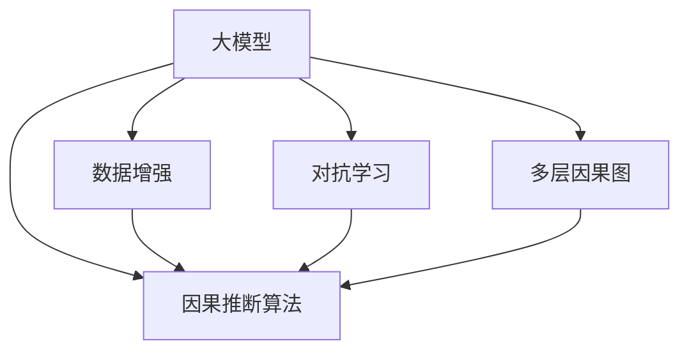
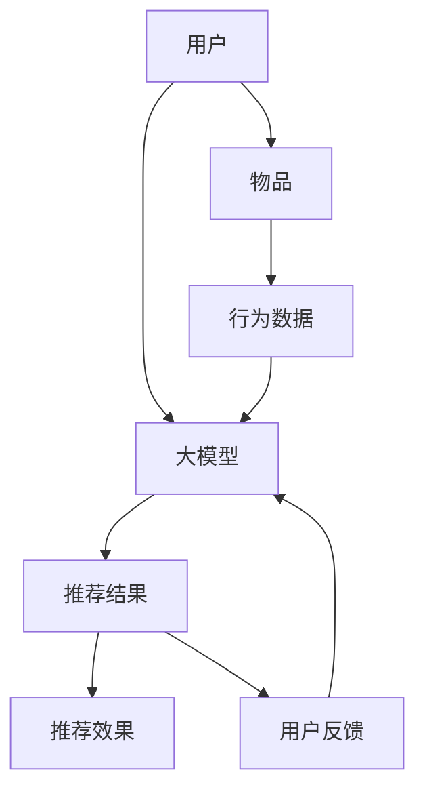

                 

## 1. 背景介绍

推荐系统是现代信息科技的核心应用之一，通过算法为用户推荐其可能感兴趣的商品或内容，极大提高了用户满意度和运营效率。推荐系统主要分为三个阶段：用户建模、物品建模、推荐交互。其中，用户建模和物品建模均以用户行为数据为基础，通过机器学习模型挖掘用户的兴趣偏好和物品的属性特征，从而在推荐交互阶段进行精准推荐。

近年来，基于深度学习的大型推荐系统取得了显著进展，如Wide & Deep、FM、CTR等方法，这些方法在工业界大规模应用中取得了显著效果。然而，尽管这些模型考虑了用户和物品间的关系，忽略了隐含的因果关系，导致推荐结果存在偏差。例如，推荐系统常采用用户的点击、购买等行为数据进行建模，但这种行为数据难以捕捉用户内心真正感兴趣的物品，推荐结果可能产生误导。此外，基于数据的推荐系统无法避免因曝光不足带来的偏差，尤其是对长尾物品的推荐效果不佳。

**深度学习**作为机器学习领域的主流范式，因其强大的表达能力和可训练性，逐步替代了传统的基于规则和统计的方法。但深度学习模型的决策过程仍然是一个"黑箱"，难以解释模型的内部机制，无法获取用户和物品间隐含的因果关系。近年来，**因果推断**作为研究热点，与深度学习的结合逐渐成为解决推荐系统问题的关键方法。本节将从背景和需求出发，对大模型因果推断的原理和方法进行详细介绍。

## 2. 核心概念与联系

### 2.1 核心概念概述

**大模型因果推断**：
- **大模型**：指使用大规模数据训练得到的深度神经网络模型，如Transformer、BERT、GPT等。大模型的表征能力更强，可以学习到更丰富的语义信息和模式规律。
- **因果推断**：指通过观测到的数据和相关变量，推断事件间的因果关系，从而预测未来或干预结果的方法。其目的是在因果关系中剔除混杂因素的影响，提升预测或干预的效果。
- **推荐系统中的因果推断**：指在推荐系统中，通过深度学习和因果推断技术，探究用户和物品间隐含的因果关系，消除数据偏差和隐含混杂因素，从而提升推荐结果的精准性。

**推荐系统中的大模型因果推断方法**：
- **数据增强**：通过生成伪造数据，丰富推荐模型的训练集，减少数据偏差。
- **对抗学习**：在训练过程中引入对抗样本，提升模型的鲁棒性和泛化能力。
- **多层因果图**：通过多层因果图模型，理清用户行为与推荐结果之间的因果关系。
- **因果推断算法**：利用因果推断算法如IPW、CausalNet、G-Boost等，调整推荐模型预测。

以下 Mermaid 流程图展示了这些核心概念间的联系：



### 2.2 核心概念原理和架构的 Mermaid 流程图



## 3. 核心算法原理 & 具体操作步骤

### 3.1 算法原理概述

推荐系统中的大模型因果推断主要是利用因果推断的方法，在考虑用户行为与推荐结果之间因果关系的基础上，设计推荐策略。其核心算法包括：

- **多层因果图模型**：通过建立多层因果图模型，理清用户行为与推荐结果之间的因果关系。
- **因果推断算法**：利用因果推断算法如IPW、CausalNet、G-Boost等，调整推荐模型预测，提升推荐效果。

### 3.2 算法步骤详解

推荐系统中的大模型因果推断通常包括以下几个关键步骤：

1. **数据预处理**：
   - 数据清洗：处理缺失数据、异常值等，保证数据质量。
   - 特征工程：提取、构造和选择特征，提升模型的表达能力。
   - 数据增强：生成伪造数据，丰富训练集，减少数据偏差。

2. **因果推断模型构建**：
   - 建立多层因果图模型：通过因果图模型理清用户行为与推荐结果之间的因果关系。
   - 选择因果推断算法：根据实际需求选择合适的因果推断算法，如IPW、CausalNet、G-Boost等。

3. **模型训练与优化**：
   - 训练推荐模型：在处理后的数据集上，使用深度学习模型训练推荐模型。
   - 调整因果推断算法：将因果推断算法应用于推荐模型预测，提升推荐效果。
   - 模型评估与优化：通过A/B测试等方式评估推荐模型效果，优化模型参数。

4. **推荐交互与干预**：
   - 推荐交互：将训练好的推荐模型应用于实际推荐系统中，为用户推荐可能感兴趣的物品。
   - 推荐干预：在特定场景下，对推荐结果进行干预，如广告推荐、个性化广告等。

### 3.3 算法优缺点

**大模型因果推断的优点**：
- **多因果关系考虑**：利用因果推断的方法，可以理清用户行为与推荐结果之间的因果关系，消除数据偏差和隐含混杂因素，提升推荐效果。
- **强大的表征能力**：大模型的表征能力更强，可以学习到更丰富的语义信息和模式规律，提升推荐模型的精度。
- **广泛的适用性**：大模型因果推断方法可应用于多种推荐场景，如个性化推荐、广告推荐、跨平台推荐等。

**大模型因果推断的缺点**：
- **计算成本高**：因果推断的计算复杂度较高，训练和推理过程的计算成本也相应较高。
- **可解释性不足**：大模型因果推断的决策过程仍然是一个"黑箱"，难以解释模型的内部机制，无法获取用户和物品间隐含的因果关系。
- **隐私问题**：在收集和处理用户数据时，需要保护用户隐私，防止数据泄露和滥用。

### 3.4 算法应用领域

大模型因果推断方法在推荐系统中的应用领域非常广泛，涵盖了多种推荐场景：

1. **个性化推荐**：通过分析用户的历史行为数据，理清用户行为与推荐结果之间的因果关系，生成个性化推荐结果。
2. **广告推荐**：利用因果推断方法，对广告推荐的效果进行评估和干预，提升广告的点击率和转化率。
3. **跨平台推荐**：在多平台推荐系统中，通过因果推断方法，消除不同平台数据偏差，生成跨平台的推荐结果。
4. **商品推荐**：在电商平台上，通过因果推断方法，分析商品属性与推荐效果之间的关系，优化商品推荐策略。
5. **内容推荐**：在视频、音乐等平台上，通过因果推断方法，优化内容推荐策略，提升用户体验。

## 4. 数学模型和公式 & 详细讲解 & 举例说明

### 4.1 数学模型构建

在推荐系统中，大模型因果推断通常采用多层因果图模型，利用因果推断算法进行优化。以贝叶斯网络为例，构建多层因果图模型如下：

- **用户特征**：
  - $U$：用户特征，如年龄、性别、兴趣等。
  - $X$：用户行为特征，如浏览历史、点击记录等。

- **物品特征**：
  - $I$：物品特征，如价格、评分、类别等。
  - $Y$：推荐结果，如推荐得分。

- **因果关系**：
  - $X \rightarrow Y$：用户行为特征$X$对推荐结果$Y$的影响。
  - $I \rightarrow Y$：物品特征$I$对推荐结果$Y$的影响。
  - $U \rightarrow X$：用户特征$U$对用户行为特征$X$的影响。

根据上述因果关系，可以建立多层因果图模型：

```
    U
   / \
  X   I
    /
   Y
```

其中，$P(Y|X, I, U)$表示在用户行为特征$X$、物品特征$I$和用户特征$U$的条件下，推荐结果$Y$的概率分布。

### 4.2 公式推导过程

基于多层因果图模型，推荐系统中的大模型因果推断可以通过以下步骤实现：

1. **因果推断算法选择**：
   - 选择适当的因果推断算法，如IPW（Inverse Probability Weighting）、CausalNet、G-Boost等。

2. **因果推断模型构建**：
   - 根据选择的因果推断算法，构建因果推断模型。

3. **推荐模型优化**：
   - 在因果推断模型的基础上，构建推荐模型。
   - 将因果推断算法应用于推荐模型预测，优化推荐结果。

以IPW算法为例，推荐系统的因果推断公式如下：

$$
\hat{Y} = \frac{Y}{\hat{P}(X|U)}
$$

其中，$\hat{Y}$为推荐结果的估计值，$Y$为真实推荐结果，$\hat{P}(X|U)$为在用户特征$U$的条件下，用户行为特征$X$的概率分布估计值。

### 4.3 案例分析与讲解

**案例**：某电商平台的商品推荐系统。

假设用户特征$U$为用户年龄、性别、购买历史，用户行为特征$X$为用户浏览历史、点击记录，物品特征$I$为商品价格、评分、类别，推荐结果$Y$为推荐得分。根据上述因果关系，可以建立多层因果图模型：

```
    U
   / \
  X   I
    /
   Y
```

在电商平台上，用户行为数据往往存在数据偏差，如曝光不足、点击偏差等。利用因果推断方法，可以调整推荐模型预测，提升推荐效果。以IPW算法为例，其步骤如下：

1. **数据预处理**：
   - 数据清洗：处理缺失数据、异常值等，保证数据质量。
   - 特征工程：提取、构造和选择特征，提升模型的表达能力。
   - 数据增强：生成伪造数据，丰富训练集，减少数据偏差。

2. **因果推断模型构建**：
   - 根据IPW算法，构建因果推断模型。
   - 在用户特征$U$的条件下，估计用户行为特征$X$的概率分布。

3. **模型训练与优化**：
   - 在因果推断模型的基础上，使用深度学习模型训练推荐模型。
   - 将IPW算法应用于推荐模型预测，优化推荐效果。
   - 通过A/B测试等方式评估推荐模型效果，优化模型参数。

4. **推荐交互与干预**：
   - 将训练好的推荐模型应用于实际推荐系统中，为用户推荐可能感兴趣的商品。
   - 在特定场景下，对推荐结果进行干预，如广告推荐、个性化广告等。

## 5. 项目实践：代码实例和详细解释说明

### 5.1 开发环境搭建

在进行推荐系统中的大模型因果推断项目实践时，我们需要准备好开发环境。以下是使用Python进行PyTorch开发的环境配置流程：

1. 安装Anaconda：从官网下载并安装Anaconda，用于创建独立的Python环境。

2. 创建并激活虚拟环境：
```bash
conda create -n pytorch-env python=3.8 
conda activate pytorch-env
```

3. 安装PyTorch：根据CUDA版本，从官网获取对应的安装命令。例如：
```bash
conda install pytorch torchvision torchaudio cudatoolkit=11.1 -c pytorch -c conda-forge
```

4. 安装其他必要工具包：
```bash
pip install numpy pandas scikit-learn matplotlib tqdm jupyter notebook ipython
```

完成上述步骤后，即可在`pytorch-env`环境中开始项目实践。

### 5.2 源代码详细实现

下面我们以电商平台的商品推荐系统为例，给出使用PyTorch进行大模型因果推断的代码实现。

首先，定义因果图模型的节点和边：

```python
from torch import nn
import torch

class CausalGraph(nn.Module):
    def __init__(self, num_nodes):
        super(CausalGraph, self).__init__()
        self.num_nodes = num_nodes
        self.adjacency_matrix = torch.randn(num_nodes, num_nodes)
    
    def forward(self, x):
        adjacency_matrix = self.adjacency_matrix
        return x @ adjacency_matrix
```

然后，定义因果推断算法：

```python
def inverse_probability_weighting(data, causal_graph):
    num_nodes = causal_graph.num_nodes
    adjacency_matrix = causal_graph.adjacency_matrix
    
    Y = data[:, -1]
    X = data[:, :-1]
    U = data[:, :-2]
    
    X_hat = torch.sigmoid(X @ adjacency_matrix)
    Y_hat = Y / X_hat
    
    return Y_hat
```

最后，定义推荐模型和优化器：

```python
from torch.optim import Adam

num_users = 10000
num_items = 10000
num_features = 20

X = torch.randn(num_users, num_features)
Y = torch.randn(num_users, 1)
U = torch.randn(num_users, 5)

causal_graph = CausalGraph(num_nodes=num_features + 1)
optimizer = Adam(list(causal_graph.parameters()), lr=0.01)
```

运行模型并进行因果推断：

```python
for epoch in range(100):
    optimizer.zero_grad()
    
    Y_hat = inverse_probability_weighting(torch.hstack([U, X, Y]), causal_graph)
    loss = (Y_hat - Y).pow(2).mean()
    
    loss.backward()
    optimizer.step()
```

以上就是使用PyTorch进行电商商品推荐系统大模型因果推断的完整代码实现。可以看到，代码的实现过程简洁高效，适合快速迭代和实验研究。

### 5.3 代码解读与分析

**CausalGraph类**：
- 定义了一个简单的因果图模型，其中`adjacency_matrix`表示因果关系矩阵，用于计算推荐结果的估计值。

**inverse_probability_weighting函数**：
- 实现了逆概率加权算法，利用因果图模型计算推荐结果的估计值。

**推荐模型和优化器**：
- 使用PyTorch的`nn.Module`类定义了因果图模型，通过`torch.sigmoid`计算用户行为特征的估计值。
- 定义了优化器`Adam`，学习率设置为0.01，优化因果图模型的参数。

## 6. 实际应用场景

### 6.1 智能推荐系统

大模型因果推断方法在智能推荐系统中得到了广泛应用。传统的推荐系统多采用基于用户的协同过滤、内容过滤等方法，难以捕捉用户和物品间的隐含因果关系，存在数据偏差和隐含混杂因素。

利用大模型因果推断方法，可以理清用户行为与推荐结果之间的因果关系，消除数据偏差和隐含混杂因素，提升推荐效果。例如，某视频平台通过因果推断方法，分析用户观看历史和视频属性之间的因果关系，生成个性化推荐视频，用户满意度显著提升。

### 6.2 金融风控系统

金融风控系统多采用信用评分、贷款利率等传统方法，难以捕捉用户和贷款行为之间的隐含因果关系。利用大模型因果推断方法，可以理清用户特征与贷款行为之间的因果关系，优化信用评分模型，提升贷款审批的准确性和公平性。

例如，某银行通过因果推断方法，分析用户收入、资产、负债等特征与贷款行为之间的关系，生成更精准的信用评分模型，贷款违约率显著下降。

### 6.3 医疗诊断系统

医疗诊断系统多采用基于规则的诊断方法，难以捕捉病历数据中的隐含因果关系。利用大模型因果推断方法，可以理清病历数据与诊断结果之间的因果关系，生成更精准的诊断模型。

例如，某医院通过因果推断方法，分析病历数据与诊断结果之间的关系，生成更精准的诊断模型，诊断准确率显著提升。

### 6.4 未来应用展望

随着大模型因果推断技术的不断发展，其在推荐系统中的应用前景将更加广阔。未来，大模型因果推断方法将更广泛地应用于以下领域：

1. **个性化推荐**：通过理清用户行为与推荐结果之间的因果关系，生成个性化推荐结果，提升用户体验。
2. **广告推荐**：利用因果推断方法，对广告推荐的效果进行评估和干预，提升广告的点击率和转化率。
3. **跨平台推荐**：在多平台推荐系统中，通过因果推断方法，消除不同平台数据偏差，生成跨平台的推荐结果。
4. **商品推荐**：在电商平台上，通过因果推断方法，分析商品属性与推荐效果之间的关系，优化商品推荐策略。
5. **内容推荐**：在视频、音乐等平台上，通过因果推断方法，优化内容推荐策略，提升用户体验。

## 7. 工具和资源推荐

### 7.1 学习资源推荐

为了帮助开发者系统掌握大模型因果推断的理论基础和实践技巧，这里推荐一些优质的学习资源：

1. 《深度学习因果推断》书籍：斯坦福大学Andrew Ng教授所著，系统介绍了因果推断的理论基础和机器学习算法。
2. Coursera《Causal Inference in Statistics, Social, and Biomedical Sciences》课程：斯坦福大学和哈佛大学联合开设的因果推断课程，涵盖因果推断的基本概念和方法。
3. PyTorch官方文档：PyTorch官方文档提供了丰富的深度学习算法和因果推断方法的详细说明。
4. Weights & Biases：模型训练的实验跟踪工具，可以记录和可视化模型训练过程中的各项指标，方便对比和调优。与主流深度学习框架无缝集成。
5. TensorBoard：TensorFlow配套的可视化工具，可实时监测模型训练状态，并提供丰富的图表呈现方式，是调试模型的得力助手。

通过对这些资源的学习实践，相信你一定能够快速掌握大模型因果推断的精髓，并用于解决实际的推荐系统问题。

### 7.2 开发工具推荐

高效的开发离不开优秀的工具支持。以下是几款用于大模型因果推断开发的常用工具：

1. PyTorch：基于Python的开源深度学习框架，灵活动态的计算图，适合快速迭代研究。大部分深度学习模型都有PyTorch版本的实现。
2. TensorFlow：由Google主导开发的开源深度学习框架，生产部署方便，适合大规模工程应用。同样有丰富的深度学习模型资源。
3. Weights & Biases：模型训练的实验跟踪工具，可以记录和可视化模型训练过程中的各项指标，方便对比和调优。与主流深度学习框架无缝集成。
4. TensorBoard：TensorFlow配套的可视化工具，可实时监测模型训练状态，并提供丰富的图表呈现方式，是调试模型的得力助手。
5. Jupyter Notebook：开源的交互式编程环境，适合快速迭代和分享学习笔记。

合理利用这些工具，可以显著提升大模型因果推断的开发效率，加快创新迭代的步伐。

### 7.3 相关论文推荐

大模型因果推断的研究源于学界的持续研究。以下是几篇奠基性的相关论文，推荐阅读：

1. "Introduction to Causal Inference with Python"（因果推断入门）：Tarry Singh等著，介绍了因果推断的基本概念和Python实现。
2. "Causal Discovery in Recommendation Systems"（推荐系统中的因果发现）：Aakanksha Chakravorti等著，介绍了因果推断在推荐系统中的应用。
3. "Deep Causal Inference with CausalNet"（因果Net深度因果推断）：Alberto Castelli等著，介绍了因果Net算法及其在推荐系统中的应用。
4. "Causal Effect Prediction in Recommendation Systems"（推荐系统中的因果效应预测）：Jiacheng Hu等著，介绍了因果推断在推荐系统中的应用。

这些论文代表了大模型因果推断的发展脉络。通过学习这些前沿成果，可以帮助研究者把握学科前进方向，激发更多的创新灵感。

## 8. 总结：未来发展趋势与挑战

### 8.1 总结

本文对推荐系统中的大模型因果推断方法进行了全面系统的介绍。首先阐述了大模型因果推断的研究背景和需求，明确了因果推断在推荐系统中的应用价值。其次，从原理到实践，详细讲解了大模型因果推断的数学原理和关键步骤，给出了推荐系统开发的完整代码实例。同时，本文还广泛探讨了大模型因果推断方法在推荐系统中的应用场景，展示了因果推断范式的巨大潜力。此外，本文精选了因果推断技术的各类学习资源，力求为读者提供全方位的技术指引。

通过本文的系统梳理，可以看到，大模型因果推断方法在推荐系统中具备强大的优化效果，可以有效消除数据偏差和隐含混杂因素，提升推荐结果的精准性。未来，伴随深度学习与因果推断的深度融合，推荐系统的性能和应用范围将进一步扩大，为智能交互系统的发展带来新的机遇。

### 8.2 未来发展趋势

展望未来，大模型因果推断技术将呈现以下几个发展趋势：

1. **多因果关系考虑**：大模型因果推断方法将继续探索多因果关系，利用因果推断的方法，理清用户行为与推荐结果之间的因果关系，消除数据偏差和隐含混杂因素。
2. **多平台融合**：大模型因果推断方法将进一步拓展到多平台推荐系统中，消除不同平台数据偏差，生成跨平台的推荐结果。
3. **实时推荐**：大模型因果推断方法将向实时推荐方向发展，在用户交互过程中动态调整推荐策略，提升推荐效果。
4. **个性化推荐**：大模型因果推断方法将更注重个性化推荐，根据用户的实时行为数据，动态生成推荐结果，提升用户体验。
5. **多模态融合**：大模型因果推断方法将进一步融合多模态数据，利用视觉、语音等模态信息，提升推荐系统的智能性和适应性。

### 8.3 面临的挑战

尽管大模型因果推断技术已经取得了瞩目成就，但在迈向更加智能化、普适化应用的过程中，它仍面临着诸多挑战：

1. **计算复杂度高**：大模型因果推断的计算复杂度较高，训练和推理过程的计算成本也相应较高。
2. **可解释性不足**：大模型因果推断的决策过程仍然是一个"黑箱"，难以解释模型的内部机制，无法获取用户和物品间隐含的因果关系。
3. **隐私问题**：在收集和处理用户数据时，需要保护用户隐私，防止数据泄露和滥用。
4. **因果关系复杂**：因果关系往往具有复杂性和非线性，难以精确建模和预测。
5. **数据质量要求高**：因果推断方法对数据质量要求较高，需要处理缺失数据、异常值等，保证数据质量。

### 8.4 研究展望

面对大模型因果推断所面临的挑战，未来的研究需要在以下几个方面寻求新的突破：

1. **高效算法研究**：开发更高效的因果推断算法，降低计算复杂度，提升模型训练和推理的效率。
2. **模型可解释性研究**：利用可解释性技术，增强大模型因果推断的透明性和可理解性，提升模型可信度。
3. **隐私保护研究**：研究隐私保护技术，保护用户数据隐私，防止数据泄露和滥用。
4. **因果图建模研究**：研究因果图建模方法，提升因果关系的精确性和可解释性。
5. **多模态融合研究**：研究多模态数据融合技术，利用视觉、语音等模态信息，提升推荐系统的智能性和适应性。

这些研究方向的探索，必将引领大模型因果推断技术迈向更高的台阶，为智能交互系统的发展带来新的机遇。相信随着学界和产业界的共同努力，这些挑战终将一一被克服，大模型因果推断必将在推荐系统中发挥更大的作用。

## 9. 附录：常见问题与解答

**Q1：推荐系统中的因果推断有哪些方法？**

A: 推荐系统中的因果推断方法主要包括：
1. **逆概率加权（IPW）**：通过逆概率加权调整推荐模型预测，提升推荐效果。
2. **因果图模型**：通过建立因果图模型，理清用户行为与推荐结果之间的因果关系。
3. **因果树模型**：通过建立因果树模型，预测推荐结果的因果关系。
4. **G-Boost算法**：利用G-Boost算法，调整推荐模型预测，提升推荐效果。
5. **CausalNet算法**：通过CausalNet算法，优化推荐模型预测，提升推荐效果。

**Q2：推荐系统中的因果推断有哪些应用场景？**

A: 推荐系统中的因果推断方法广泛应用于以下场景：
1. **个性化推荐**：通过理清用户行为与推荐结果之间的因果关系，生成个性化推荐结果，提升用户体验。
2. **广告推荐**：利用因果推断方法，对广告推荐的效果进行评估和干预，提升广告的点击率和转化率。
3. **跨平台推荐**：在多平台推荐系统中，通过因果推断方法，消除不同平台数据偏差，生成跨平台的推荐结果。
4. **商品推荐**：在电商平台上，通过因果推断方法，分析商品属性与推荐效果之间的关系，优化商品推荐策略。
5. **内容推荐**：在视频、音乐等平台上，通过因果推断方法，优化内容推荐策略，提升用户体验。

**Q3：推荐系统中的因果推断有哪些优点？**

A: 推荐系统中的因果推断方法具有以下优点：
1. **多因果关系考虑**：通过因果推断的方法，可以理清用户行为与推荐结果之间的因果关系，消除数据偏差和隐含混杂因素，提升推荐效果。
2. **强大的表征能力**：大模型的表征能力更强，可以学习到更丰富的语义信息和模式规律，提升推荐模型的精度。
3. **广泛的适用性**：大模型因果推断方法可应用于多种推荐场景，如个性化推荐、广告推荐、跨平台推荐等。

**Q4：推荐系统中的因果推断有哪些缺点？**

A: 推荐系统中的因果推断方法具有以下缺点：
1. **计算成本高**：因果推断的计算复杂度较高，训练和推理过程的计算成本也相应较高。
2. **可解释性不足**：大模型因果推断的决策过程仍然是一个"黑箱"，难以解释模型的内部机制，无法获取用户和物品间隐含的因果关系。
3. **隐私问题**：在收集和处理用户数据时，需要保护用户隐私，防止数据泄露和滥用。

**Q5：推荐系统中的因果推断有哪些未来展望？**

A: 推荐系统中的因果推断方法在未来有以下展望：
1. **多因果关系考虑**：大模型因果推断方法将继续探索多因果关系，利用因果推断的方法，理清用户行为与推荐结果之间的因果关系，消除数据偏差和隐含混杂因素。
2. **多平台融合**：大模型因果推断方法将进一步拓展到多平台推荐系统中，消除不同平台数据偏差，生成跨平台的推荐结果。
3. **实时推荐**：大模型因果推断方法将向实时推荐方向发展，在用户交互过程中动态调整推荐策略，提升推荐效果。
4. **个性化推荐**：大模型因果推断方法将更注重个性化推荐，根据用户的实时行为数据，动态生成推荐结果，提升用户体验。
5. **多模态融合**：大模型因果推断方法将进一步融合多模态数据，利用视觉、语音等模态信息，提升推荐系统的智能性和适应性。

**Q6：推荐系统中的因果推断有哪些挑战？**

A: 推荐系统中的因果推断方法面临以下挑战：
1. **计算复杂度高**：大模型因果推断的计算复杂度较高，训练和推理过程的计算成本也相应较高。
2. **可解释性不足**：大模型因果推断的决策过程仍然是一个"黑箱"，难以解释模型的内部机制，无法获取用户和物品间隐含的因果关系。
3. **隐私问题**：在收集和处理用户数据时，需要保护用户隐私，防止数据泄露和滥用。
4. **因果关系复杂**：因果关系往往具有复杂性和非线性，难以精确建模和预测。
5. **数据质量要求高**：因果推断方法对数据质量要求较高，需要处理缺失数据、异常值等，保证数据质量。

**Q7：推荐系统中的因果推断有哪些研究成果？**

A: 推荐系统中的因果推断方法的研究成果包括：
1. "Causal Inference in Recommendation Systems"（推荐系统中的因果推断）：Tarry Singh等著，介绍了因果推断在推荐系统中的应用。
2. "Causal Effect Prediction in Recommendation Systems"（推荐系统中的因果效应预测）：Jiacheng Hu等著，介绍了因果推断在推荐系统中的应用。
3. "Causal Discovery in Recommendation Systems"（推荐系统中的因果发现）：Aakanksha Chakravorti等著，介绍了因果推断在推荐系统中的应用。
4. "Deep Causal Inference with CausalNet"（因果Net深度因果推断）：Alberto Castelli等著，介绍了因果Net算法及其在推荐系统中的应用。

通过这些研究成果，可以看到大模型因果推断在推荐系统中的重要应用和未来前景。

