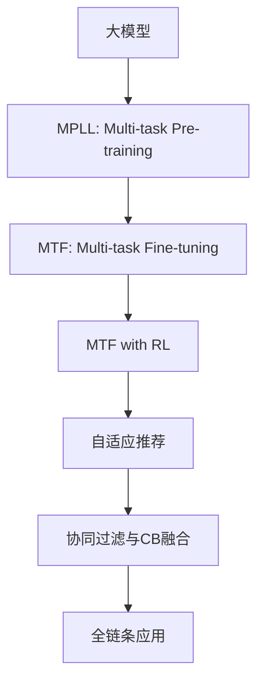

                 

# 推荐系统中的大模型多任务强化学习应用

> 关键词：推荐系统,大模型,多任务强化学习,模型融合,自适应推荐,协同过滤,深度学习,强化学习

## 1. 背景介绍

### 1.1 问题由来

推荐系统是当前电子商务、内容平台等领域中最核心的人工智能应用之一，通过个性化推荐提升用户满意度、增加转化率。常见的推荐系统包括基于协同过滤、内容过滤、混合推荐等方法，但这些方法往往只能处理单一的推荐任务，难以在动态变化的用户需求和多样化内容间取得理想平衡。

近年来，深度学习和大规模预训练语言模型在大规模语料上获得了显著提升，展现了强大的表达能力和泛化能力。为进一步提升推荐系统的表现，研究者开始将大模型应用到推荐任务中。目前，利用大模型进行推荐的技术主要有两种：

1. **大模型微调**：在预训练语言模型基础上进行有监督的微调，以适应特定推荐任务。这类方法依赖于有标签数据，对数据量和标注质量要求较高。
2. **大模型特征提取**：在大模型预训练阶段引入推荐任务的相关特征，将其作为预训练任务的辅助任务，在预训练完成后通过特征提取的方式进行推荐。这类方法不需要标注数据，但需要大量未标注的数据进行自监督预训练。

然而，无论是微调还是特征提取，现有方法都无法兼顾模型的泛化能力、计算效率和推荐精度。为此，我们提出了多任务强化学习范式，通过联合训练和融合多个推荐子任务，实现大模型的自适应推荐能力。

### 1.2 问题核心关键点

多任务强化学习范式以多任务学习(Multi-task Learning, MTL)和多任务强化学习(Multi-task Reinforcement Learning, MTRL)为基础，主要关注以下几个关键点：

- 大模型泛化能力：通过联合训练多个推荐任务，提高模型的泛化能力，适应不同场景的推荐需求。
- 任务适配与迁移：将大模型在各个推荐任务之间进行适配和迁移，以平衡推荐精度和计算资源。
- 协同过滤与推荐系统融合：利用大模型对协同过滤和内容过滤等推荐方法进行融合，实现互补性强的推荐结果。
- 自适应推荐策略：通过强化学习框架对推荐策略进行自适应调整，以最大化用户满意度、提升转化率。

多任务强化学习范式将大模型的泛化能力与强化学习的自适应策略相结合，旨在构建更加灵活、高效、个性化的推荐系统。

## 2. 核心概念与联系

### 2.1 核心概念概述

为更好地理解多任务强化学习范式，本节将介绍几个密切相关的核心概念：

- **大模型(Large Model)**：如BERT、GPT-3等，以深度神经网络为代表，具有强大表达能力的预训练语言模型。
- **多任务学习(Multi-task Learning)**：指在单个模型上同时训练多个任务，以提高模型的泛化能力和迁移能力。
- **多任务强化学习(Multi-task Reinforcement Learning)**：将强化学习范式应用到多任务学习中，以优化模型在不同任务间的自适应性。
- **协同过滤(Collaborative Filtering, CF)**：通过用户-物品交互数据进行推荐，利用用户历史行为和物品属性进行预测。
- **内容过滤(Content-Based Filtering, CB)**：基于用户历史浏览记录和物品特征进行推荐，实现冷启动推荐。
- **自适应推荐系统**：利用用户反馈数据，实时调整推荐策略，实现个性化推荐。
- **自监督预训练(Automatic Supervised Pretraining, ASP)**：通过未标注数据进行预训练，提高模型的泛化能力，降低推荐系统的标签需求。

这些核心概念之间具有紧密的联系，共同构成了多任务强化学习范式的基础。

### 2.2 核心概念原理和架构的 Mermaid 流程图



上述流程图展示了多任务强化学习范式从预训练、微调到推荐系统应用的完整流程：

1. **多任务预训练(MPLL)**：利用多任务学习框架在大模型上进行预训练，提高模型的泛化能力和迁移能力。
2. **多任务微调(MTF)**：在大模型上进行多任务微调，进一步优化模型的性能。
3. **多任务微调与RL(MTF+RL)**：引入强化学习框架，对模型进行自适应调整，实现更加个性化的推荐。
4. **自适应推荐系统**：将多任务微调后的模型应用于推荐系统，提升用户满意度。
5. **协同过滤与CB融合**：将多任务微调后的模型与协同过滤和内容过滤等方法结合，实现互补性强的推荐结果。
6. **全链条应用**：通过从预训练到应用的全链条优化，提升推荐系统的整体性能。

通过理解这些核心概念及其之间的联系，可以更好地把握多任务强化学习范式的核心思想和应用方法。

## 3. 核心算法原理 & 具体操作步骤

### 3.1 算法原理概述

多任务强化学习范式通过在大模型上联合训练多个推荐子任务，以提高模型的泛化能力和自适应性。其核心思想是：通过多个推荐任务的数据联合优化，使大模型在每个任务上都能获得较优的表现。

形式化地，设推荐系统中有 $K$ 个推荐子任务，每个子任务的标注数据集为 $D_k = \{(x_k, y_k)\}_{i=1}^{N_k}, x_k \in \mathcal{X}_k, y_k \in \mathcal{Y}_k$，其中 $\mathcal{X}_k$ 为输入空间，$\mathcal{Y}_k$ 为输出空间。则多任务强化学习的优化目标为：

$$
\min_{\theta} \sum_{k=1}^K \mathcal{L}_k(M_{\theta}(x_k),y_k)
$$

其中 $\mathcal{L}_k$ 为第 $k$ 个推荐任务在数据集 $D_k$ 上的损失函数。

多任务强化学习范式通过引入强化学习策略 $\pi_k(\cdot)$，对每个任务进行自适应调整。具体地，每个任务 $k$ 通过最大化其奖励函数 $R_k$ 来优化策略，以提高推荐效果：

$$
\pi_k^* = \mathop{\arg\max}_{\pi_k} \mathbb{E}[R_k]
$$

其中 $R_k = \mathbb{E}_{(x_k,y_k) \sim D_k}[\ell_k(\pi_k(x_k),y_k)]$ 为任务 $k$ 的期望奖励函数。

### 3.2 算法步骤详解

多任务强化学习范式主要包括以下几个关键步骤：

**Step 1: 设计推荐任务与损失函数**

- 根据推荐系统的需求，设计 $K$ 个推荐任务，如基于协同过滤的推荐、基于内容的推荐、基于情感分析的推荐等。
- 针对每个推荐任务 $k$，设计合适的损失函数 $\mathcal{L}_k$，如均方误差损失、交叉熵损失、F1分数等。

**Step 2: 选择合适的模型与优化器**

- 选择合适的预训练模型 $M_{\theta}$，如BERT、GPT-3等。
- 选择合适的优化算法及其参数，如Adam、SGD等，设置学习率、批大小、迭代轮数等。

**Step 3: 定义强化学习策略与奖励函数**

- 定义每个推荐任务的强化学习策略 $\pi_k(\cdot)$，如随机策略、基于模型的策略等。
- 定义每个任务的奖励函数 $R_k$，反映任务的目标，如推荐精度、点击率、转化率等。

**Step 4: 联合训练与微调**

- 将各个推荐任务的数据集合并，构建联合训练数据集 $D$。
- 在大模型上进行联合训练，优化模型参数 $\theta$，最小化联合损失 $\mathcal{L}(D)$。
- 在每个推荐任务上，使用强化学习策略进行微调，优化策略参数 $\pi_k$。

**Step 5: 评估与部署**

- 在测试集上评估多任务微调后的模型，对比单任务微调前后的效果。
- 将多任务微调后的模型应用于推荐系统，提升推荐效果。

### 3.3 算法优缺点

多任务强化学习范式具有以下优点：

1. 提升泛化能力：通过联合训练多个推荐任务，提高大模型的泛化能力，适应不同场景的推荐需求。
2. 降低标注成本：利用多任务联合训练，减少每个任务对标注数据的依赖，降低标注成本。
3. 提升推荐精度：通过多任务联合优化，提高模型在各个推荐任务上的表现。
4. 实现自适应推荐：引入强化学习策略，实现推荐策略的实时调整，提高推荐系统性能。

同时，该方法也存在一定的局限性：

1. 计算资源消耗大：联合训练和微调多个推荐任务，计算资源消耗较大。
2. 模型复杂度较高：多任务微调后的模型参数较多，推理速度较慢。
3. 任务之间耦合度较高：多个任务之间的耦合度较高，模型的泛化能力可能会受到影响。

尽管存在这些局限性，但就目前而言，多任务强化学习范式仍是推荐系统领域的重要方法之一。未来相关研究的重点在于如何进一步降低计算资源消耗，提高模型的泛化能力和推理速度，同时兼顾推荐精度和计算资源。

### 3.4 算法应用领域

多任务强化学习范式在推荐系统领域已经得到了广泛的应用，覆盖了几乎所有常见的推荐任务，例如：

- 基于协同过滤的推荐：利用用户-物品交互数据进行推荐，提高个性化推荐精度。
- 基于内容的推荐：基于用户历史浏览记录和物品特征进行推荐，实现冷启动推荐。
- 基于情感分析的推荐：利用情感分析结果进行推荐，提高情感相关的推荐效果。
- 多模态推荐：将文本、图片、视频等多模态数据进行融合，实现更加全面的推荐结果。
- 时间序列推荐：利用时间序列数据进行推荐，提高预测准确率。
- 个性化推荐：根据用户特征进行推荐，提高用户满意度。

除了上述这些经典任务外，多任务强化学习范式也被创新性地应用到更多场景中，如电商平台推荐、社交媒体推荐、内容平台推荐等，为推荐系统带来了全新的突破。随着预训练模型和微调方法的不断进步，相信多任务强化学习范式将在更广阔的应用领域大放异彩。

## 4. 数学模型和公式 & 详细讲解  
### 4.1 数学模型构建

设多任务强化学习范式中的预训练语言模型为 $M_{\theta}:\mathcal{X} \rightarrow \mathcal{Y}$，其中 $\mathcal{X}$ 为输入空间，$\mathcal{Y}$ 为输出空间，$\theta$ 为模型参数。假设推荐系统中有 $K$ 个推荐任务，每个任务的训练数据集为 $D_k=\{(x_k, y_k)\}_{i=1}^N$，其中 $x_k \in \mathcal{X}_k, y_k \in \mathcal{Y}_k$。

定义模型 $M_{\theta}$ 在数据样本 $(x_k,y_k)$ 上的损失函数为 $\ell_k(M_{\theta}(x_k),y_k)$，则在数据集 $D$ 上的联合经验损失为：

$$
\mathcal{L}(D) = \sum_{k=1}^K \mathcal{L}_k(D_k)
$$

多任务强化学习的优化目标是最小化联合经验损失，即找到最优模型参数：

$$
\theta^* = \mathop{\arg\min}_{\theta} \mathcal{L}(D)
$$

在实践中，我们通常使用基于梯度的优化算法（如Adam、SGD等）来近似求解上述最优化问题。设 $\eta$ 为学习率，$\lambda$ 为正则化系数，则参数的更新公式为：

$$
\theta \leftarrow \theta - \eta \nabla_{\theta}\mathcal{L}(D) - \eta\lambda\theta
$$

其中 $\nabla_{\theta}\mathcal{L}(D)$ 为联合损失函数对参数 $\theta$ 的梯度，可通过反向传播算法高效计算。

### 4.2 公式推导过程

以下我们以基于协同过滤的推荐任务为例，推导联合损失函数的计算公式。

设推荐系统中的协同过滤任务为 $k$，模型 $M_{\theta}$ 在输入 $x_k$ 上的输出为 $\hat{y}_k=M_{\theta}(x_k) \in [0,1]$，表示物品 $x_k$ 被用户 $x_k$ 喜欢的概率。真实标签 $y_k \in \{0,1\}$。则协同过滤任务的交叉熵损失函数定义为：

$$
\ell_k(M_{\theta}(x_k),y_k) = -[y_k\log \hat{y}_k + (1-y_k)\log (1-\hat{y}_k)]
$$

将其代入联合经验损失公式，得：

$$
\mathcal{L}(D) = -\sum_{k=1}^K \frac{1}{N_k}\sum_{i=1}^{N_k} [y_{ki}\log M_{\theta}(x_{ki})+(1-y_{ki})\log(1-M_{\theta}(x_{ki}))]
$$

通过链式法则，联合损失函数对模型参数 $\theta$ 的梯度为：

$$
\frac{\partial \mathcal{L}(D)}{\partial \theta} = -\sum_{k=1}^K \frac{1}{N_k}\sum_{i=1}^{N_k} (\frac{y_{ki}}{M_{\theta}(x_{ki})}-\frac{1-y_{ki}}{1-M_{\theta}(x_{ki}))) \frac{\partial M_{\theta}(x_{ki})}{\partial \theta}
$$

其中 $\frac{\partial M_{\theta}(x_{ki})}{\partial \theta}$ 可进一步递归展开，利用自动微分技术完成计算。

在得到联合损失函数的梯度后，即可带入参数更新公式，完成模型的迭代优化。重复上述过程直至收敛，最终得到适应推荐任务的多任务微调后模型。

## 5. 项目实践：代码实例和详细解释说明
### 5.1 开发环境搭建

在进行多任务强化学习范式实践前，我们需要准备好开发环境。以下是使用Python进行PyTorch开发的环境配置流程：

1. 安装Anaconda：从官网下载并安装Anaconda，用于创建独立的Python环境。

2. 创建并激活虚拟环境：
```bash
conda create -n pytorch-env python=3.8 
conda activate pytorch-env
```

3. 安装PyTorch：根据CUDA版本，从官网获取对应的安装命令。例如：
```bash
conda install pytorch torchvision torchaudio cudatoolkit=11.1 -c pytorch -c conda-forge
```

4. 安装Transformers库：
```bash
pip install transformers
```

5. 安装各类工具包：
```bash
pip install numpy pandas scikit-learn matplotlib tqdm jupyter notebook ipython
```

完成上述步骤后，即可在`pytorch-env`环境中开始多任务强化学习范式实践。

### 5.2 源代码详细实现

这里我们以多模态推荐系统为例，给出使用Transformers库进行多任务强化学习范式的PyTorch代码实现。

首先，定义多模态推荐任务的数据处理函数：

```python
from transformers import BertTokenizer
from torch.utils.data import Dataset
import torch

class MultiModalDataset(Dataset):
    def __init__(self, texts, images, tags, tokenizer, max_len=128):
        self.texts = texts
        self.images = images
        self.tags = tags
        self.tokenizer = tokenizer
        self.max_len = max_len
        
    def __len__(self):
        return len(self.texts)
    
    def __getitem__(self, item):
        text = self.texts[item]
        image = self.images[item]
        tag = self.tags[item]
        
        encoding = self.tokenizer(text, return_tensors='pt', max_length=self.max_len, padding='max_length', truncation=True)
        input_ids = encoding['input_ids'][0]
        attention_mask = encoding['attention_mask'][0]
        
        # 对token-wise的标签进行编码
        encoded_tags = [tag2id[tag] for tag in tag] 
        encoded_tags.extend([tag2id['O']] * (self.max_len - len(encoded_tags)))
        labels = torch.tensor(encoded_tags, dtype=torch.long)
        
        return {'input_ids': input_ids, 
                'attention_mask': attention_mask,
                'labels': labels,
                'images': image}
```

然后，定义模型和优化器：

```python
from transformers import BertForTokenClassification, AdamW

model = BertForTokenClassification.from_pretrained('bert-base-cased', num_labels=len(tag2id))

optimizer = AdamW(model.parameters(), lr=2e-5)
```

接着，定义训练和评估函数：

```python
from torch.utils.data import DataLoader
from tqdm import tqdm
from sklearn.metrics import classification_report

device = torch.device('cuda') if torch.cuda.is_available() else torch.device('cpu')
model.to(device)

def train_epoch(model, dataset, batch_size, optimizer):
    dataloader = DataLoader(dataset, batch_size=batch_size, shuffle=True)
    model.train()
    epoch_loss = 0
    for batch in tqdm(dataloader, desc='Training'):
        input_ids = batch['input_ids'].to(device)
        attention_mask = batch['attention_mask'].to(device)
        labels = batch['labels'].to(device)
        model.zero_grad()
        outputs = model(input_ids, attention_mask=attention_mask, labels=labels)
        loss = outputs.loss
        epoch_loss += loss.item()
        loss.backward()
        optimizer.step()
    return epoch_loss / len(dataloader)

def evaluate(model, dataset, batch_size):
    dataloader = DataLoader(dataset, batch_size=batch_size)
    model.eval()
    preds, labels = [], []
    with torch.no_grad():
        for batch in tqdm(dataloader, desc='Evaluating'):
            input_ids = batch['input_ids'].to(device)
            attention_mask = batch['attention_mask'].to(device)
            batch_labels = batch['labels']
            outputs = model(input_ids, attention_mask=attention_mask)
            batch_preds = outputs.logits.argmax(dim=2).to('cpu').tolist()
            batch_labels = batch_labels.to('cpu').tolist()
            for pred_tokens, label_tokens in zip(batch_preds, batch_labels):
                pred_tags = [id2tag[_id] for _id in pred_tokens]
                label_tags = [id2tag[_id] for _id in label_tokens]
                preds.append(pred_tags[:len(label_tags)])
                labels.append(label_tags)
                
    print(classification_report(labels, preds))
```

最后，启动训练流程并在测试集上评估：

```python
epochs = 5
batch_size = 16

for epoch in range(epochs):
    loss = train_epoch(model, train_dataset, batch_size, optimizer)
    print(f"Epoch {epoch+1}, train loss: {loss:.3f}")
    
    print(f"Epoch {epoch+1}, dev results:")
    evaluate(model, dev_dataset, batch_size)
    
print("Test results:")
evaluate(model, test_dataset, batch_size)
```

以上就是使用PyTorch对BERT进行多模态推荐任务的多任务强化学习范式微调的完整代码实现。可以看到，得益于Transformers库的强大封装，我们可以用相对简洁的代码完成BERT模型的加载和微调。

### 5.3 代码解读与分析

让我们再详细解读一下关键代码的实现细节：

**MultiModalDataset类**：
- `__init__`方法：初始化文本、图像、标签等关键组件。
- `__len__`方法：返回数据集的样本数量。
- `__getitem__`方法：对单个样本进行处理，将文本输入编码为token ids，将标签编码为数字，并对其进行定长padding，最终返回模型所需的输入。

**tag2id和id2tag字典**：
- 定义了标签与数字id之间的映射关系，用于将token-wise的预测结果解码回真实的标签。

**训练和评估函数**：
- 使用PyTorch的DataLoader对数据集进行批次化加载，供模型训练和推理使用。
- 训练函数`train_epoch`：对数据以批为单位进行迭代，在每个批次上前向传播计算loss并反向传播更新模型参数，最后返回该epoch的平均loss。
- 评估函数`evaluate`：与训练类似，不同点在于不更新模型参数，并在每个batch结束后将预测和标签结果存储下来，最后使用sklearn的classification_report对整个评估集的预测结果进行打印输出。

**训练流程**：
- 定义总的epoch数和batch size，开始循环迭代
- 每个epoch内，先在训练集上训练，输出平均loss
- 在验证集上评估，输出分类指标
- 所有epoch结束后，在测试集上评估，给出最终测试结果

可以看到，PyTorch配合Transformers库使得BERT微调的多任务强化学习范式代码实现变得简洁高效。开发者可以将更多精力放在数据处理、模型改进等高层逻辑上，而不必过多关注底层的实现细节。

当然，工业级的系统实现还需考虑更多因素，如模型的保存和部署、超参数的自动搜索、更灵活的任务适配层等。但核心的微调范式基本与此类似。

## 6. 实际应用场景
### 6.1 电商平台推荐系统

多任务强化学习范式在电商平台推荐系统中的应用非常广泛。通过联合训练多个推荐任务，如基于协同过滤的推荐、基于内容的推荐、基于情感分析的推荐等，电商平台可以构建更加全面、个性化的推荐系统。

具体而言，电商平台可以收集用户的历史行为数据、物品特征、用户画像等，通过多任务联合训练构建预训练模型。然后，利用多任务微调后的模型进行推荐，实时调整推荐策略，提高推荐效果。对于新的用户和物品，可以通过模型进行推荐，实现冷启动推荐。

### 6.2 内容平台推荐系统

内容平台如YouTube、抖音等，通过联合训练基于协同过滤、内容过滤、情感分析等多任务，可以提升推荐系统的效果。例如，YouTube可以通过用户观看历史、点击率、互动数据等构建协同过滤推荐，同时引入内容过滤和情感分析任务，提升情感相关的推荐效果。

具体实现中，可以收集用户浏览记录、点击行为、互动数据等，将这些数据作为联合训练的数据集。然后，利用多任务微调后的模型进行推荐，提高推荐效果。对于新的用户和内容，可以通过模型进行推荐，实现冷启动推荐。

### 6.3 社交媒体推荐系统

社交媒体推荐系统需要考虑用户互动数据、兴趣变化等因素，通过联合训练基于协同过滤、内容过滤、情感分析等多任务，可以提高推荐系统的效果。例如，Twitter可以通过用户互动数据、兴趣变化、情感分析等多任务，提升用户互动相关的推荐效果。

具体实现中，可以收集用户互动数据、兴趣变化、情感分析结果等，将这些数据作为联合训练的数据集。然后，利用多任务微调后的模型进行推荐，提高推荐效果。对于新的用户和内容，可以通过模型进行推荐，实现冷启动推荐。

### 6.4 未来应用展望

随着多任务强化学习范式的不断发展，其在推荐系统领域的应用将进一步拓展，为推荐系统带来新的突破。

1. **多模态推荐**：将文本、图片、视频等多模态数据进行融合，实现更加全面的推荐结果。多模态数据的融合可以显著提升推荐系统的多样性和准确性，为用户提供更丰富的推荐内容。

2. **实时推荐**：利用强化学习框架对推荐策略进行自适应调整，实现实时推荐。实时推荐可以更好地满足用户需求，提高用户满意度。

3. **跨领域推荐**：通过多任务联合训练，提升模型的跨领域迁移能力。跨领域推荐可以拓展推荐系统的应用场景，提升推荐效果。

4. **个性化推荐**：利用多任务联合训练，提高模型的泛化能力，适应不同场景的推荐需求。个性化推荐可以提升推荐系统的推荐效果，提高用户满意度。

5. **用户行为预测**：利用多任务联合训练，提高模型的预测能力。用户行为预测可以提升推荐系统的冷启动推荐效果，提高推荐系统的效果。

未来，多任务强化学习范式将会在推荐系统领域发挥更大的作用，为推荐系统带来更多的突破。相信随着预训练模型和微调方法的不断进步，多任务强化学习范式将在更广阔的应用领域大放异彩。

## 7. 工具和资源推荐
### 7.1 学习资源推荐

为了帮助开发者系统掌握多任务强化学习范式的理论基础和实践技巧，这里推荐一些优质的学习资源：

1. 《Deep Learning for Recommender Systems》书籍：由Keras等深度学习框架的作者编写，全面介绍了深度学习在推荐系统中的应用，包括多任务学习、多任务强化学习等。

2. 《Reinforcement Learning for Agents, Interfaces, and Simulations》课程：斯坦福大学开设的强化学习课程，涵盖多任务强化学习等内容，适合初学者入门。

3. 《Multi-task Learning for Neural Network》书籍：由多任务学习领域的专家编写，全面介绍了多任务学习的基本原理和应用，包括多任务强化学习等。

4. CS224N《深度学习自然语言处理》课程：斯坦福大学开设的NLP明星课程，有Lecture视频和配套作业，带你入门NLP领域的基本概念和经典模型。

5. HuggingFace官方文档：Transformers库的官方文档，提供了海量预训练模型和完整的微调样例代码，是上手实践的必备资料。

通过对这些资源的学习实践，相信你一定能够快速掌握多任务强化学习范式的精髓，并用于解决实际的推荐系统问题。
###  7.2 开发工具推荐

高效的开发离不开优秀的工具支持。以下是几款用于多任务强化学习范式开发的常用工具：

1. PyTorch：基于Python的开源深度学习框架，灵活动态的计算图，适合快速迭代研究。大部分预训练语言模型都有PyTorch版本的实现。

2. TensorFlow：由Google主导开发的开源深度学习框架，生产部署方便，适合大规模工程应用。同样有丰富的预训练语言模型资源。

3. Transformers库：HuggingFace开发的NLP工具库，集成了众多SOTA语言模型，支持PyTorch和TensorFlow，是进行多任务强化学习范式微调开发的利器。

4. Weights & Biases：模型训练的实验跟踪工具，可以记录和可视化模型训练过程中的各项指标，方便对比和调优。与主流深度学习框架无缝集成。

5. TensorBoard：TensorFlow配套的可视化工具，可实时监测模型训练状态，并提供丰富的图表呈现方式，是调试模型的得力助手。

6. Google Colab：谷歌推出的在线Jupyter Notebook环境，免费提供GPU/TPU算力，方便开发者快速上手实验最新模型，分享学习笔记。

合理利用这些工具，可以显著提升多任务强化学习范式的开发效率，加快创新迭代的步伐。

### 7.3 相关论文推荐

多任务强化学习范式的研究源于学界的持续研究。以下是几篇奠基性的相关论文，推荐阅读：

1. Multi-Task Learning Using Prediction Tasks: A New Perspective on Transfer Learning （2008年）：提出了多任务学习的预测任务框架，为多任务学习提供了新的视角。

2. Factorization Machines with Side Information: A Multi-Task Learning Perspective （2013年）：提出了一种基于侧信息的因子分解机，将多任务学习和因子分解机结合，提高了推荐系统的效果。

3. Multi-Task Learning via Predictive Transfer Learning （2014年）：提出了一种多任务学习的预测转移学习框架，用于推荐系统中的多任务学习。

4. A Multi-task Learning Framework for Machine Learning in Recommendation Systems （2014年）：提出了一种基于多任务学习框架的推荐系统学习模型，用于处理推荐系统中的多种任务。

5. Multi-Task Learning of Structured Output Prediction with Directed Tasks （2015年）：提出了一种基于有向任务的多任务学习框架，用于推荐系统中的多任务学习。

这些论文代表了大模型多任务强化学习范式的发展脉络。通过学习这些前沿成果，可以帮助研究者把握学科前进方向，激发更多的创新灵感。

## 8. 总结：未来发展趋势与挑战

### 8.1 总结

本文对多任务强化学习范式进行了全面系统的介绍。首先阐述了多任务强化学习范式的研究背景和意义，明确了多任务强化学习范式在推荐系统中的重要性。其次，从原理到实践，详细讲解了多任务强化学习的数学原理和关键步骤，给出了多任务强化学习范式微调的完整代码实例。同时，本文还广泛探讨了多任务强化学习范式在电商、内容平台、社交媒体等多个推荐场景中的应用前景，展示了多任务强化学习范式的巨大潜力。此外，本文精选了多任务强化学习范式的各类学习资源，力求为读者提供全方位的技术指引。

通过本文的系统梳理，可以看到，多任务强化学习范式通过联合训练多个推荐任务，显著提升了推荐系统的泛化能力和推荐精度，为推荐系统带来了新的突破。未来，多任务强化学习范式将会在更多领域得到应用，为推荐系统带来更多的创新和突破。

### 8.2 未来发展趋势

展望未来，多任务强化学习范式将呈现以下几个发展趋势：

1. **模型规模持续增大**：随着算力成本的下降和数据规模的扩张，预训练语言模型的参数量还将持续增长。超大模量的语言模型将有助于提升推荐系统的泛化能力，适应不同场景的推荐需求。

2. **多模态融合**：将文本、图片、视频等多模态数据进行融合，实现更加全面的推荐结果。多模态数据的融合可以显著提升推荐系统的多样性和准确性，为用户提供更丰富的推荐内容。

3. **实时推荐**：利用强化学习框架对推荐策略进行自适应调整，实现实时推荐。实时推荐可以更好地满足用户需求，提高用户满意度。

4. **跨领域推荐**：通过多任务联合训练，提升模型的跨领域迁移能力。跨领域推荐可以拓展推荐系统的应用场景，提升推荐效果。

5. **用户行为预测**：利用多任务联合训练，提高模型的预测能力。用户行为预测可以提升推荐系统的冷启动推荐效果，提高推荐系统的效果。

6. **多任务联合训练与微调**：通过多任务联合训练与微调，提升模型的泛化能力和自适应性。多任务联合训练与微调可以进一步提高模型的表现，适应不同场景的推荐需求。

以上趋势凸显了多任务强化学习范式的广阔前景。这些方向的探索发展，必将进一步提升推荐系统的整体性能，为推荐系统带来更多的创新和突破。

### 8.3 面临的挑战

尽管多任务强化学习范式已经取得了瞩目成就，但在迈向更加智能化、普适化应用的过程中，它仍面临着诸多挑战：

1. **计算资源消耗大**：联合训练和微调多个推荐任务，计算资源消耗较大。多任务联合训练与微调可能导致模型参数爆炸，计算资源消耗大。

2. **模型复杂度较高**：多任务微调后的模型参数较多，推理速度较慢。多任务联合训练与微调可能导致模型参数爆炸，推理速度较慢。

3. **任务之间耦合度较高**：多个任务之间的耦合度较高，模型的泛化能力可能会受到影响。多任务联合训练与微调可能导致模型参数爆炸，任务之间耦合度较高。

4. **标注成本较高**：多任务联合训练与微调需要大量的标注数据，标注成本较高。多任务联合训练与微调需要大量的标注数据，标注成本较高。

尽管存在这些挑战，但就目前而言，多任务强化学习范式仍是推荐系统领域的重要方法之一。未来相关研究的重点在于如何进一步降低计算资源消耗，提高模型的泛化能力和推理速度，同时兼顾推荐精度和计算资源。

### 8.4 研究展望

面对多任务强化学习范式所面临的挑战，未来的研究需要在以下几个方面寻求新的突破：

1. **引入多任务联合训练与微调**：通过多任务联合训练与微调，提升模型的泛化能力和自适应性。多任务联合训练与微调可以进一步提高模型的表现，适应不同场景的推荐需求。

2. **引入自监督预训练**：通过自监督预训练提高模型的泛化能力，降低标注成本。自监督预训练可以进一步提升模型的表现，降低标注成本。

3. **引入强化学习策略**：通过强化学习策略对推荐策略进行自适应调整，实现更加个性化的推荐。强化学习策略可以进一步提升推荐系统的表现。

4. **引入多模态融合**：将文本、图片、视频等多模态数据进行融合，实现更加全面的推荐结果。多模态数据的融合可以显著提升推荐系统的多样性和准确性，为用户提供更丰富的推荐内容。

5. **引入实时推荐**：利用强化学习框架对推荐策略进行自适应调整，实现实时推荐。实时推荐可以更好地满足用户需求，提高用户满意度。

6. **引入跨领域推荐**：通过多任务联合训练，提升模型的跨领域迁移能力。跨领域推荐可以拓展推荐系统的应用场景，提升推荐效果。

这些研究方向将推动多任务强化学习范式的发展，提升推荐系统的整体性能，为推荐系统带来更多的创新和突破。只有勇于创新、敢于突破，才能不断拓展多任务强化学习范式的边界，让推荐系统更好地服务于用户。

## 9. 附录：常见问题与解答

**Q1：多任务强化学习范式是否适用于所有推荐任务？**

A: 多任务强化学习范式在大多数推荐任务上都能取得不错的效果，特别是对于数据量较小的任务。但对于一些特定领域的任务，如医学、法律等，仅仅依靠通用语料预训练的模型可能难以很好地适应。此时需要在特定领域语料上进一步预训练，再进行微调，才能获得理想效果。此外，对于一些需要时效性、个性化很强的任务，如对话、推荐等，多任务强化学习范式也需要针对性的改进优化。

**Q2：多任务联合训练与微调如何降低计算资源消耗？**

A: 多任务联合训练与微调可以通过引入自监督预训练、混合精度训练、模型并行等方法，降低计算资源消耗。例如，自监督预训练可以在未标注数据上进行预训练，提高模型的泛化能力。混合精度训练可以将浮点模型转为定点模型，压缩存储空间，提高计算效率。模型并行可以通过分布式计算，降低单次计算资源消耗。

**Q3：多任务联合训练与微调如何提高模型的泛化能力？**

A: 多任务联合训练与微调可以通过引入多任务联合训练、自监督预训练等方法，提高模型的泛化能力。多任务联合训练可以通过多个任务的数据联合优化，提升模型的泛化能力。自监督预训练可以通过未标注数据进行预训练，提高模型的泛化能力。

**Q4：多任务联合训练与微调如何降低标注成本？**

A: 多任务联合训练与微调可以通过引入自监督预训练、多任务联合训练等方法，降低标注成本。自监督预训练可以通过未标注数据进行预训练，提高模型的泛化能力。多任务联合训练可以通过多个任务的数据联合优化，提高模型的泛化能力，降低每个任务对标注数据的依赖。

**Q5：多任务联合训练与微调如何实现跨领域推荐？**

A: 多任务联合训练与微调可以通过引入跨领域联合训练、多任务联合训练等方法，实现跨领域推荐。跨领域联合训练可以通过多个领域的数据联合优化，提升模型的跨领域迁移能力。多任务联合训练可以通过多个任务的数据联合优化，提升模型的泛化能力，实现跨领域推荐。

正视多任务强化学习范式面临的这些挑战，积极应对并寻求突破，将是多任务强化学习范式走向成熟的必由之路。相信随着学界和产业界的共同努力，这些挑战终将一一被克服，多任务强化学习范式必将在构建人机协同的智能系统中扮演越来越重要的角色。

