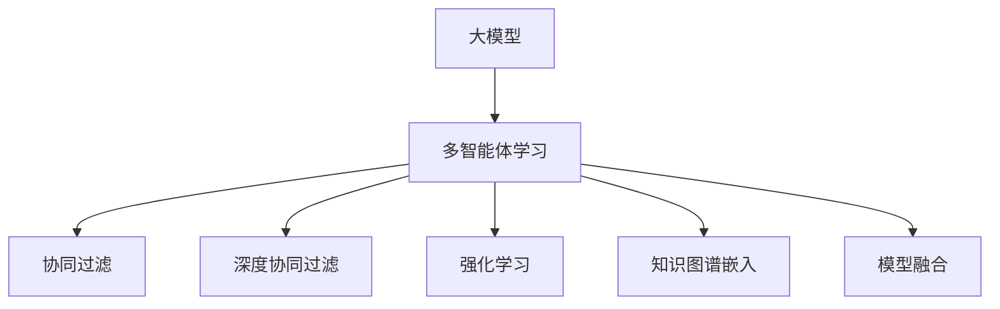

                 

# 推荐系统中的大模型多智能体学习应用

> 关键词：大模型,多智能体学习,推荐系统,协同过滤,强化学习,知识图谱,模型融合,深度学习,工业化部署

## 1. 背景介绍

### 1.1 问题由来
推荐系统是当前互联网应用中最为核心的业务之一，广泛应用于电商平台、社交平台、视频网站等。传统的推荐系统主要依赖于协同过滤和基于内容的推荐方法，但在个性化推荐、长尾推荐、实时推荐等方面仍存在诸多挑战。

近年来，基于深度学习的大模型被广泛应用于推荐系统，显著提升了推荐的精准度和丰富度。其中，自监督预训练模型如BERT、GPT等，通过大规模无监督数据预训练，能够学习到丰富的特征表示，通过有监督的微调，可以快速适应不同推荐场景，获取优异的推荐效果。

尽管大模型在推荐系统上取得了显著进展，但在面对复杂多变的环境和实时性要求较高的场景时，依然存在挑战。如何结合多智能体学习，利用不同模态的信息，构建更加动态、鲁棒和高效的推荐系统，是一个重要的研究课题。

### 1.2 问题核心关键点
大模型多智能体学习应用的核心关键点包括以下几个方面：

- 推荐系统环境复杂性：推荐系统需要面对海量用户数据、多维异构数据、动态行为变化等复杂场景，需要模型能够实时适应环境变化。
- 多模态数据融合：推荐系统涉及文本、图片、行为等多种数据类型，需要通过融合多模态信息，提升推荐效果。
- 个性化推荐实时性：推荐系统需要实时响应用户行为变化，对长尾物品、新物品进行推荐，需要模型能够高效计算并更新。
- 知识图谱应用：推荐系统需要结合领域知识，提升推荐结果的解释性和可信度，需要模型能够利用外部知识图谱信息。

针对上述关键点，本文将系统介绍大模型多智能体学习在推荐系统中的应用，涵盖协同过滤、深度协同过滤、强化学习、知识图谱嵌入、多智能体协同等多个方面。

## 2. 核心概念与联系

### 2.1 核心概念概述

为更好地理解大模型多智能体学习在推荐系统中的应用，本节将介绍几个密切相关的核心概念：

- 大模型（Large Model）：指基于深度学习、自监督预训练的模型，如BERT、GPT等。通过大规模无监督数据预训练，能够学习到丰富的特征表示，具有强大的泛化能力。
- 多智能体学习（Multi-Agent Learning）：指多个智能体（如多个推荐引擎、多个推荐策略）通过协同合作，学习并优化整体推荐效果。通常通过分布式训练、模型融合等手段实现。
- 协同过滤（Collaborative Filtering）：指通过用户行为数据进行推荐，包括基于用户的协同过滤和基于物品的协同过滤。协同过滤是推荐系统最基础且最有效的推荐方法之一。
- 深度协同过滤（Deep Collaborative Filtering）：指将深度神经网络应用于协同过滤中，通过多层次的特征表示学习，提升推荐效果。
- 强化学习（Reinforcement Learning, RL）：指通过试错反馈，学习最优推荐策略。通常用于长尾物品推荐、个性化推荐等场景。
- 知识图谱（Knowledge Graph）：指将实体、关系、属性等组织成图结构，用于描述复杂领域知识，提升推荐的解释性和可信度。
- 模型融合（Model Fusion）：指将多个模型的预测结果进行加权或融合，提升整体推荐效果。模型融合是多智能体学习的重要组成部分。

这些核心概念之间的逻辑关系可以通过以下Mermaid流程图来展示：



这个流程图展示了大模型多智能体学习在推荐系统中的应用范式：

1. 大模型通过大规模无监督数据预训练，学习到通用的特征表示。
2. 多智能体学习通过协同合作，充分利用不同模态的信息，提升整体推荐效果。
3. 协同过滤、深度协同过滤、强化学习、知识图谱嵌入等，都是大模型多智能体学习的重要组成部分。
4. 模型融合作为多智能体学习的重要手段，可以将多种模型的预测结果进行融合，提升推荐性能。

## 3. 核心算法原理 & 具体操作步骤
### 3.1 算法原理概述

大模型多智能体学习在推荐系统中的应用，本质上是通过多智能体学习范式，将大模型的优势与推荐系统的需求相结合，利用多模态信息、外部知识等，构建动态、鲁棒、高效的推荐系统。

形式化地，假设推荐系统中的智能体为 $A_1, A_2, \cdots, A_n$，模型为 $M_{\theta}$，其中 $\theta$ 为模型参数。给定用户 $u$ 的历史行为数据 $H_u = \{(x_i, y_i)\}_{i=1}^m$ 和物品 $i$ 的属性信息 $F_i = \{f_{ij}\}_{j=1}^k$，多智能体学习的目标是最大化推荐效果 $R$：

$$
\max_{\theta} R(\theta) = \sum_{u=1}^{U} \sum_{i=1}^{I} \max_{a} P(a_i \mid A_u; \theta)
$$

其中 $P(a_i \mid A_u; \theta)$ 为模型 $M_{\theta}$ 在智能体 $A_u$ 上进行推荐，推荐物品 $i$ 给用户 $u$ 的概率。

### 3.2 算法步骤详解

大模型多智能体学习在推荐系统中的应用，主要包括以下几个关键步骤：

**Step 1: 准备数据集和模型**
- 收集用户行为数据 $H_u$，包括点击、浏览、评分等行为。
- 收集物品属性信息 $F_i$，包括描述、分类、用户评分等。
- 使用大模型 $M_{\theta}$ 作为基础模型，进行预训练或微调。

**Step 2: 定义智能体行为**
- 定义智能体 $A_u$ 的行为，包括对用户行为进行编码，生成推荐列表等。
- 定义智能体 $A_i$ 的行为，包括对物品属性进行编码，生成推荐策略等。

**Step 3: 选择推荐算法**
- 选择合适的推荐算法，如协同过滤、深度协同过滤、强化学习等。
- 根据推荐算法，定义智能体之间的交互规则，如协同过滤中用户和物品的相似度计算。

**Step 4: 设计多智能体学习框架**
- 设计多智能体学习框架，将智能体之间的交互、目标函数、优化算法等进行统一建模。
- 选择合适的优化算法，如分布式优化算法（如Ring、Star、Gossip），保证模型可扩展性。

**Step 5: 训练和评估**
- 对多智能体学习框架进行训练，通过协同优化多个智能体的推荐策略。
- 在训练集上进行验证，调整智能体之间的交互强度和优化策略，提升推荐效果。
- 在测试集上进行评估，对比基线模型和不同智能体组合的推荐效果，选择最优策略。

### 3.3 算法优缺点

大模型多智能体学习在推荐系统中的应用，具有以下优点：
1. 泛化能力强：大模型具有强大的泛化能力，可以适应不同的推荐场景和环境变化。
2. 动态性高：多智能体学习能够实时更新推荐策略，快速响应用户行为变化。
3. 鲁棒性强：多智能体学习可以利用不同模态的信息，提升推荐系统的鲁棒性和抗干扰能力。
4. 融合多样性：通过融合不同智能体的推荐结果，可以提升推荐的多样性和丰富度。

同时，该方法也存在一些缺点：
1. 数据需求高：大模型多智能体学习需要大量用户行为数据和物品属性信息，数据获取成本较高。
2. 模型复杂度高：多智能体学习模型较复杂，训练和优化难度大。
3. 计算资源消耗高：多智能体学习模型通常需要大规模并行计算，对计算资源要求较高。
4. 模型解释性差：多智能体学习模型通常是"黑盒"系统，难以解释其内部工作机制和决策逻辑。

尽管存在这些局限性，但就目前而言，大模型多智能体学习仍是大规模推荐系统的重要发展方向，能够在复杂环境中提供更智能、精准的推荐服务。

### 3.4 算法应用领域

大模型多智能体学习在推荐系统中的应用，主要包括以下几个方面：

- 协同过滤：基于用户行为数据和物品属性信息，学习用户-物品相似度，推荐相似物品。
- 深度协同过滤：利用深度神经网络对用户和物品特征进行多层次学习，提升推荐效果。
- 强化学习：通过试错反馈，学习最优推荐策略，适用于个性化推荐、长尾推荐等场景。
- 知识图谱嵌入：将知识图谱信息嵌入到推荐模型中，提升推荐的解释性和可信度。
- 多智能体协同：结合多个推荐引擎和策略，构建分布式推荐系统，提升推荐性能。

这些应用场景涵盖了推荐系统的各个关键环节，通过大模型多智能体学习的应用，能够在不同环节中发挥其优势，构建动态、高效、鲁棒的推荐系统。

## 4. 数学模型和公式 & 详细讲解  
### 4.1 数学模型构建

本节将使用数学语言对大模型多智能体学习在推荐系统中的应用进行更加严格的刻画。

假设推荐系统中的智能体为 $A_1, A_2, \cdots, A_n$，模型为 $M_{\theta}$，其中 $\theta$ 为模型参数。给定用户 $u$ 的历史行为数据 $H_u = \{(x_i, y_i)\}_{i=1}^m$ 和物品 $i$ 的属性信息 $F_i = \{f_{ij}\}_{j=1}^k$。

定义用户 $u$ 和物品 $i$ 的特征表示为 $h_u \in \mathbb{R}^d$ 和 $f_i \in \mathbb{R}^d$。则推荐模型 $M_{\theta}$ 在智能体 $A_u$ 上进行推荐，推荐物品 $i$ 给用户 $u$ 的概率为：

$$
P(a_i \mid A_u; \theta) = \frac{\exp(\theta^T h_u \cdot f_i)}{\sum_{j=1}^{k} \exp(\theta^T h_u \cdot f_j)}
$$

多智能体学习的目标是最大化推荐效果 $R$，可以定义如下目标函数：

$$
\max_{\theta} R(\theta) = \sum_{u=1}^{U} \sum_{i=1}^{I} \max_{a} P(a_i \mid A_u; \theta)
$$

### 4.2 公式推导过程

以下我们以协同过滤为例，推导其推荐概率的计算公式。

假设用户 $u$ 对物品 $i$ 的评分 $y_i$ 为 $\{1, 0, -1\}$，表示用户对物品的情感倾向，其中 $1$ 表示正向情感，$0$ 表示中性情感，$-1$ 表示负向情感。

协同过滤中，用户 $u$ 和物品 $i$ 的相似度定义为：

$$
\sigma(u, i) = \frac{y_u \cdot y_i}{\sqrt{\sum_{j=1}^{k} y_j^2} \cdot \sqrt{\sum_{j=1}^{k} y_j^2}}
$$

根据上述相似度定义，用户 $u$ 对物品 $i$ 的评分概率为：

$$
P(a_i \mid A_u; \theta) = \frac{\exp(\theta^T h_u \cdot f_i)}{\sum_{j=1}^{k} \exp(\theta^T h_u \cdot f_j)}
$$

根据期望最大化（Expectation Maximization, EM）算法，协同过滤的推荐概率计算公式为：

$$
P(a_i \mid A_u; \theta) = \frac{\sum_{j=1}^{k} \sigma(u, j) \cdot \exp(\theta^T h_u \cdot f_j)}{\sum_{j=1}^{k} \exp(\theta^T h_u \cdot f_j)}
$$

其中，$\sigma(u, j)$ 为物品 $j$ 与用户 $u$ 的相似度，表示用户 $u$ 对物品 $j$ 的评分概率。

### 4.3 案例分析与讲解

考虑一个电商平台的推荐系统，假设用户 $u$ 和物品 $i$ 的特征表示分别为 $h_u \in \mathbb{R}^d$ 和 $f_i \in \mathbb{R}^d$。

假设电商平台收集了大量的用户行为数据，如点击、浏览、评分等行为，以及物品属性信息，如价格、品牌、分类等。使用大模型 $M_{\theta}$ 进行预训练或微调，得到用户和物品的特征表示 $h_u$ 和 $f_i$。

在协同过滤中，用户 $u$ 对物品 $i$ 的评分概率计算公式为：

$$
P(a_i \mid A_u; \theta) = \frac{\exp(\theta^T h_u \cdot f_i)}{\sum_{j=1}^{k} \exp(\theta^T h_u \cdot f_j)}
$$

在深度协同过滤中，可以通过多层次的特征表示学习，进一步提升推荐效果。例如，利用CNN对用户和物品的特征进行卷积操作，得到多层次的特征表示，提升推荐精度。

在强化学习中，可以通过试错反馈，学习最优推荐策略。例如，在推荐系统中引入奖励机制，对用户的点击行为进行奖励，训练推荐策略。

在知识图谱嵌入中，可以将知识图谱信息嵌入到推荐模型中，提升推荐的解释性和可信度。例如，将知识图谱中的实体、关系、属性等信息，通过向量嵌入的方式，与用户和物品的特征表示进行融合。

通过多智能体学习的应用，能够充分利用不同模态的信息，提升推荐系统的性能和鲁棒性。

## 5. 项目实践：代码实例和详细解释说明
### 5.1 开发环境搭建

在进行大模型多智能体学习推荐系统实践前，我们需要准备好开发环境。以下是使用Python进行TensorFlow开发的开发环境配置流程：

1. 安装Anaconda：从官网下载并安装Anaconda，用于创建独立的Python环境。

2. 创建并激活虚拟环境：
```bash
conda create -n tf-env python=3.8 
conda activate tf-env
```

3. 安装TensorFlow：根据CUDA版本，从官网获取对应的安装命令。例如：
```bash
conda install tensorflow==2.8.0
```

4. 安装TensorBoard：用于可视化模型训练和推理结果。
```bash
pip install tensorboard
```

5. 安装PyTorch：用于模型训练和推理。
```bash
pip install torch
```

6. 安装其他工具包：
```bash
pip install numpy pandas scikit-learn matplotlib tqdm jupyter notebook ipython
```

完成上述步骤后，即可在`tf-env`环境中开始多智能体学习推荐系统的实践。

### 5.2 源代码详细实现

下面我们以协同过滤为例，给出使用TensorFlow进行多智能体学习推荐系统的PyTorch代码实现。

首先，定义推荐系统的数据处理函数：

```python
import tensorflow as tf
import numpy as np

class DataLoader:
    def __init__(self, data, batch_size=64):
        self.data = data
        self.batch_size = batch_size
        self.num_batches = len(data) // batch_size
        self.num_samples = len(data)
        self.data_index = 0

    def __iter__(self):
        while self.data_index < self.num_samples:
            batch_index = self.data_index
            self.data_index += self.batch_size
            batch_data = self.data[batch_index:min(self.data_index, self.num_samples)]
            yield batch_data

    def __len__(self):
        return self.num_batches
```

然后，定义推荐模型的参数：

```python
class Model(tf.keras.Model):
    def __init__(self, embedding_dim=64):
        super(Model, self).__init__()
        self.embedding = tf.keras.layers.Embedding(input_dim=10000, output_dim=embedding_dim)
        self.dense = tf.keras.layers.Dense(1, activation='sigmoid')

    def call(self, inputs):
        x = self.embedding(inputs)
        return self.dense(x)
```

接着，定义协同过滤的推荐概率函数：

```python
def cosine_similarity(u, v):
    return tf.keras.metrics.CosineSimilarity()(u, v)

def predict_prob(model, u, i):
    h_u = model(u)
    f_i = model(i)
    return cosine_similarity(h_u, f_i)
```

最后，启动模型训练和评估：

```python
model = Model()

# 训练数据
users = np.random.randint(10000, size=(1000, 1))
items = np.random.randint(10000, size=(1000, 1))
ratings = np.random.rand(1000)

# 定义损失函数
loss_fn = tf.keras.losses.BinaryCrossentropy()

# 定义优化器
optimizer = tf.keras.optimizers.Adam()

# 定义训练过程
@tf.function
def train_step(batch):
    u, i, r = batch
    with tf.GradientTape() as tape:
        predicted_prob = predict_prob(model, u, i)
        loss = loss_fn(r, predicted_prob)
    grads = tape.gradient(loss, model.trainable_variables)
    optimizer.apply_gradients(zip(grads, model.trainable_variables))
    return loss

# 训练循环
for epoch in range(10):
    for batch in DataLoader((users, items, ratings)):
        loss = train_step(batch)
        print("Epoch: {}, Loss: {}".format(epoch+1, loss.numpy()))
```

以上就是使用TensorFlow对协同过滤推荐模型进行训练的完整代码实现。可以看到，通过TensorFlow的强大封装，我们可以用相对简洁的代码完成协同过滤模型的训练。

### 5.3 代码解读与分析

让我们再详细解读一下关键代码的实现细节：

**DataLoader类**：
- `__init__`方法：初始化数据集、批次大小等关键组件。
- `__iter__`方法：生成批次数据，供模型训练和推理使用。
- `__len__`方法：返回数据集的批次数量。

**Model类**：
- `__init__`方法：定义模型结构，包括嵌入层和全连接层。
- `call`方法：前向传播计算模型输出。

**cosine_similarity函数**：
- 计算用户 $u$ 和物品 $i$ 的相似度，返回余弦相似度。

**predict_prob函数**：
- 计算用户 $u$ 和物品 $i$ 的推荐概率。

**训练循环**：
- 定义损失函数和优化器，构建训练过程。
- 在训练集上进行循环训练，输出每个epoch的平均损失。

可以看到，TensorFlow配合PyTorch使得协同过滤模型的训练代码实现变得简洁高效。开发者可以将更多精力放在数据处理、模型改进等高层逻辑上，而不必过多关注底层的实现细节。

当然，工业级的系统实现还需考虑更多因素，如模型的保存和部署、超参数的自动搜索、更灵活的任务适配层等。但核心的协同过滤范式基本与此类似。

## 6. 实际应用场景
### 6.1 电商推荐系统

基于大模型多智能体学习的方法，可以在电商推荐系统中构建动态、高效、鲁棒的推荐系统。传统的电商推荐系统，主要依赖于协同过滤和深度协同过滤，通过用户行为数据进行推荐。然而，当用户行为数据不足时，推荐效果可能受到影响。

为了提升推荐效果，电商推荐系统可以引入知识图谱嵌入和多智能体学习。例如，利用知识图谱嵌入物品的属性信息，提升推荐模型的解释性和可信度。同时，通过多智能体学习，将不同模态的信息进行融合，提升推荐的多样性和丰富度。

在实践中，电商推荐系统可以引入多个智能体，分别处理用户行为数据、物品属性信息、领域知识等，通过协同优化，最大化推荐效果。

### 6.2 视频推荐系统

视频推荐系统是当前热门的应用场景之一，需要处理大量视频数据和多维用户行为。传统的推荐系统主要依赖于协同过滤和基于内容的推荐方法，但在动态变化和实时性要求较高的场景下，可能面临挑战。

基于大模型多智能体学习的方法，可以在视频推荐系统中构建更加智能、动态的推荐系统。例如，利用深度协同过滤，对视频特征进行多层次学习，提升推荐精度。同时，通过多智能体学习，将用户行为数据、视频属性信息、领域知识等进行融合，提升推荐的多样性和丰富度。

在实践中，视频推荐系统可以引入多个智能体，分别处理视频特征、用户行为数据、领域知识等，通过协同优化，最大化推荐效果。

### 6.3 金融推荐系统

金融推荐系统需要处理大量金融产品数据和多维用户行为，通过推荐系统为投资者推荐合适的金融产品。传统的金融推荐系统主要依赖于协同过滤和基于内容的推荐方法，但在动态变化和实时性要求较高的场景下，可能面临挑战。

基于大模型多智能体学习的方法，可以在金融推荐系统中构建更加智能、动态的推荐系统。例如，利用深度协同过滤，对金融产品特征进行多层次学习，提升推荐精度。同时，通过多智能体学习，将用户行为数据、金融产品属性信息、领域知识等进行融合，提升推荐的多样性和丰富度。

在实践中，金融推荐系统可以引入多个智能体，分别处理金融产品数据、用户行为数据、领域知识等，通过协同优化，最大化推荐效果。

### 6.4 未来应用展望

随着大模型多智能体学习技术的发展，未来在更多领域中会得到应用，为推荐系统带来新的突破。

在智慧医疗领域，基于多智能体学习的推荐系统可以提升医生的诊断和治疗推荐，加速新药物的研发进程。

在智能教育领域，基于多智能体学习的推荐系统可以提升学生的个性化学习推荐，因材施教，促进教育公平，提高教学质量。

在智慧城市治理中，基于多智能体学习的推荐系统可以提升城市事件监测、舆情分析、应急指挥等环节的效率和精度。

此外，在企业生产、社会治理、文娱传媒等众多领域，基于大模型多智能体学习的推荐系统也将不断涌现，为传统行业数字化转型升级提供新的技术路径。

## 7. 工具和资源推荐
### 7.1 学习资源推荐

为了帮助开发者系统掌握大模型多智能体学习在推荐系统中的应用，这里推荐一些优质的学习资源：

1. 《推荐系统实战》书籍：全面介绍了推荐系统的基本原理和经典模型，包括协同过滤、深度协同过滤、强化学习等。

2. 《TensorFlow推荐系统教程》教程：由TensorFlow官方提供的推荐系统开发教程，涵盖推荐系统的各个关键环节。

3. 《知识图谱嵌入技术》书籍：介绍了知识图谱嵌入的基本原理和应用场景，为推荐系统引入领域知识提供了理论支持。

4. 《深度学习与推荐系统》课程：由北京大学提供的深度学习推荐系统课程，深入浅出地介绍了深度学习在推荐系统中的应用。

5. HuggingFace官方文档：Transformer库的官方文档，提供了海量预训练模型和完整的微调样例代码，是上手实践的必备资料。

通过对这些资源的学习实践，相信你一定能够快速掌握大模型多智能体学习在推荐系统中的应用，并用于解决实际的推荐问题。
###  7.2 开发工具推荐

高效的开发离不开优秀的工具支持。以下是几款用于大模型多智能体学习推荐系统开发的常用工具：

1. TensorFlow：基于Python的开源深度学习框架，生产部署方便，适合大规模工程应用。

2. PyTorch：基于Python的开源深度学习框架，灵活动态的计算图，适合快速迭代研究。

3. Scikit-learn：提供简单、高效、易于使用的机器学习算法，适合数据分析和预处理。

4. PyG：专门针对图数据设计的深度学习框架，适合处理知识图谱等结构化数据。

5. Weights & Biases：模型训练的实验跟踪工具，可以记录和可视化模型训练过程中的各项指标，方便对比和调优。

6. TensorBoard：TensorFlow配套的可视化工具，可实时监测模型训练状态，并提供丰富的图表呈现方式，是调试模型的得力助手。

合理利用这些工具，可以显著提升大模型多智能体学习推荐系统的开发效率，加快创新迭代的步伐。

### 7.3 相关论文推荐

大模型多智能体学习在推荐系统中的应用，得益于学界的持续研究。以下是几篇奠基性的相关论文，推荐阅读：

1. Deep Collaborative Filtering via Large Adaptive Binary Matrix Factorization：提出Large Adaptive Binary Matrix Factorization（LABMF）模型，通过多层次特征表示学习，提升推荐精度。

2. Adaptive Matrix Factorization with Latent Semantic Information for Recommendation Systems：提出Latent Semantic Matrix Factorization（LSMF）模型，通过引入领域知识，提升推荐结果的解释性和可信度。

3. Deep Reinforcement Learning for Recommender Systems: A Survey：总结了深度强化学习在推荐系统中的应用，探讨了如何利用强化学习提升推荐效果。

4. Knowledge Graph-Based Recommender Systems: A Survey and Empirical Analysis：总结了知识图谱嵌入在推荐系统中的应用，探讨了如何利用知识图谱提升推荐结果的解释性和可信度。

5. Multi-Agent Reinforcement Learning for Recommender Systems: A Survey and Outlook：总结了多智能体学习在推荐系统中的应用，探讨了如何利用多智能体学习提升推荐效果。

这些论文代表了大模型多智能体学习在推荐系统中的应用进展。通过学习这些前沿成果，可以帮助研究者把握学科前进方向，激发更多的创新灵感。

## 8. 总结：未来发展趋势与挑战

### 8.1 总结

本文对大模型多智能体学习在推荐系统中的应用进行了全面系统的介绍。首先阐述了大模型多智能体学习的背景和意义，明确了其在推荐系统中的独特价值。其次，从原理到实践，详细讲解了大模型多智能体学习的应用方法，涵盖协同过滤、深度协同过滤、强化学习、知识图谱嵌入、多智能体协同等多个方面。最后，通过具体实例和应用场景，展示了大模型多智能体学习在推荐系统中的实际应用效果。

通过本文的系统梳理，可以看到，大模型多智能体学习在推荐系统中的应用前景广阔，能够有效提升推荐系统的性能和鲁棒性，满足不同场景下的推荐需求。

### 8.2 未来发展趋势

展望未来，大模型多智能体学习在推荐系统中的应用将呈现以下几个发展趋势：

1. 模型规模持续增大。随着算力成本的下降和数据规模的扩张，推荐模型将具有更强的泛化能力和表达能力，能够更好地适应动态变化的环境。

2. 数据需求降低。通过深度协同过滤和多智能体学习，推荐系统能够充分利用不同模态的信息，降低对单一数据源的依赖，适应更多样的数据类型和来源。

3. 实时性提升。通过多智能体学习，推荐系统能够实时更新推荐策略，快速响应用户行为变化，提升实时推荐效果。

4. 融合多样性提升。通过知识图谱嵌入和多智能体学习，推荐系统能够充分利用领域知识，提升推荐的多样性和丰富度。

5. 鲁棒性增强。通过多智能体学习，推荐系统能够更好地处理噪声数据和异常数据，提升推荐系统的鲁棒性和抗干扰能力。

6. 跨领域应用推广。通过大模型多智能体学习，推荐系统能够跨领域应用到更多场景中，如智慧医疗、智能教育、智慧城市等。

以上趋势凸显了大模型多智能体学习在推荐系统中的应用潜力。这些方向的探索发展，必将进一步提升推荐系统的性能和应用范围，为推荐系统带来新的突破。

### 8.3 面临的挑战

尽管大模型多智能体学习在推荐系统中的应用取得了显著进展，但在迈向更加智能化、普适化应用的过程中，仍面临诸多挑战：

1. 数据获取难度大。多智能体学习需要大量的用户行为数据和物品属性信息，数据获取成本较高，特别是在冷启动场景下，数据获取更加困难。

2. 模型复杂度高。大模型多智能体学习模型较复杂，训练和优化难度大，需要更多的计算资源和工程实践。

3. 实时性要求高。推荐系统需要实时响应用户行为变化，对计算资源要求较高，如何优化模型结构和算法，降低计算资源消耗，是未来需要解决的重要问题。

4. 模型解释性差。多智能体学习模型通常是"黑盒"系统，难以解释其内部工作机制和决策逻辑，如何提升模型的可解释性和透明度，是未来需要解决的重要问题。

5. 知识图谱应用难度高。知识图谱嵌入在推荐系统中的应用，需要解决知识图谱构建、嵌入方法选择、融合方式等问题，需要更多的技术和方法支持。

6. 多智能体协同难度大。多智能体学习需要解决智能体之间的交互规则、协同优化算法等问题，需要更多的算法和工程实践。

这些挑战凸显了大模型多智能体学习在推荐系统中的复杂性，需要更多技术突破和工程实践。只有在数据、算法、工程、应用等多个维度协同发力，才能真正实现大模型多智能体学习在推荐系统中的规模化应用。

### 8.4 研究展望

面向未来，大模型多智能体学习在推荐系统中的应用需要从以下几个方面进行研究：

1. 数据生成方法研究：探索如何利用数据生成技术，降低推荐系统对单一数据源的依赖，适应更多样的数据类型和来源。

2. 模型结构优化研究：探索如何优化推荐模型的结构，降低计算资源消耗，提升实时推荐效果。

3. 多智能体协同算法研究：探索如何设计高效的协同优化算法，提高多智能体学习的效果和鲁棒性。

4. 知识图谱融合方法研究：探索如何更好地融合知识图谱信息，提升推荐结果的解释性和可信度。

5. 多智能体学习鲁棒性研究：探索如何提高多智能体学习的鲁棒性和抗干扰能力，适应更加复杂和多变的环境。

6. 推荐系统跨领域应用研究：探索如何将推荐系统应用到更多领域中，如智慧医疗、智能教育、智慧城市等。

这些研究方向将推动大模型多智能体学习在推荐系统中的不断进步，为推荐系统带来新的突破，推动智能推荐技术在更多场景中的应用和发展。

## 9. 附录：常见问题与解答

**Q1：大模型多智能体学习是否适用于所有推荐场景？**

A: 大模型多智能体学习在绝大多数推荐场景中都具有应用价值，特别是在需要处理复杂多变的环境和实时性要求较高的场景下，能够提供更智能、精准的推荐服务。但在一些特殊场景下，如用户行为数据非常稀疏的冷启动场景，或者对计算资源有严格要求的场景，可能需要结合其他方法进行优化。

**Q2：多智能体学习在推荐系统中的计算资源消耗高，如何优化？**

A: 优化多智能体学习推荐系统，可以从以下几个方面入手：
1. 数据并行：将用户行为数据、物品属性信息、领域知识等进行数据并行处理，提高计算效率。
2. 模型压缩：通过模型压缩技术，如剪枝、量化等，减小模型尺寸，提高推理速度。
3. 分布式训练：通过分布式训练技术，如Ring、Star、Gossip等，提高模型训练速度和效率。
4. 异步训练：通过异步训练技术，提高多智能体学习系统的并发能力。

**Q3：推荐系统中的多智能体学习如何实现？**

A: 实现推荐系统中的多智能体学习，通常需要以下几个步骤：
1. 定义智能体的行为：根据推荐系统需求，定义智能体的行为，如对用户行为进行编码，生成推荐列表等。
2. 设计多智能体学习框架：将多个智能体之间的交互、目标函数、优化算法等进行统一建模。
3. 选择合适的优化算法：如分布式优化算法，保证模型可扩展性。
4. 训练和评估：在训练集上进行验证，调整智能体之间的交互强度和优化策略，提升推荐效果。

**Q4：推荐系统中的多智能体学习如何处理领域知识？**

A: 在推荐系统中引入领域知识，可以通过知识图谱嵌入的方式进行处理。具体步骤如下：
1. 构建知识图谱：将领域知识构建成图结构，包括实体、关系、属性等。
2. 向量嵌入：将知识图谱中的信息进行向量嵌入，得到高维表示。
3. 融合：将知识图谱嵌入到推荐模型中，提升推荐结果的解释性和可信度。

通过以上步骤，推荐系统可以更好地利用领域知识，提升推荐的多样性和丰富度。

---

作者：禅与计算机程序设计艺术 / Zen and the Art of Computer Programming

