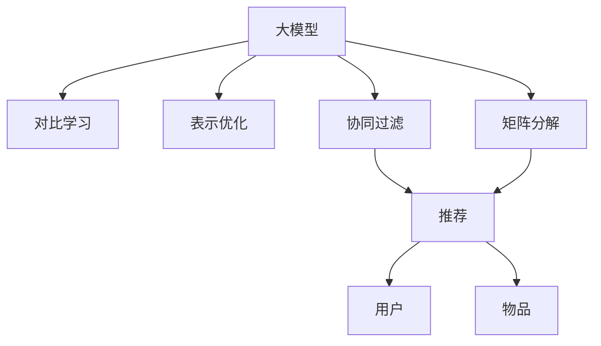

                 

# 推荐系统中的大模型对比学习与表示优化

> 关键词：大模型,对比学习,表示优化,推荐系统,协同过滤,矩阵分解,深度学习

## 1. 背景介绍

### 1.1 问题由来
推荐系统是互联网时代最具影响力的人工智能应用之一。其核心目标是利用用户历史行为数据，预测用户可能感兴趣的物品，实现个性化推荐，提升用户体验。然而，随着数据量的激增和物品种类的繁多，推荐系统的复杂度越来越高，传统协同过滤和矩阵分解等方法难以满足实时性和准确性要求。

近年来，大模型和深度学习方法在推荐系统中的应用日益广泛。大模型基于海量数据进行预训练，学习到丰富的语义表示和特征表示，能够深度挖掘用户和物品之间的潜在关联。此外，基于大模型的对比学习技术（Contrastive Learning），通过构造正负样本，利用模型的自适应能力挖掘更深层次的语义关系。

尽管大模型带来了诸多优势，但它们也面临着过拟合、泛化能力不足等问题。在推荐系统实践中，如何让大模型在保证准确性的同时，降低计算成本、提升推荐效果，成为当前亟需解决的关键问题。本文聚焦于大模型在推荐系统中的应用，并探讨如何通过对比学习技术和大模型表示优化方法，实现高效、精确的推荐系统。

### 1.2 问题核心关键点
本文将从以下关键点来深入分析大模型在推荐系统中的应用：

1. 对比学习在大模型中的作用和原理。
2. 表示优化方法如何在大模型中实现，提升模型性能。
3. 大模型在推荐系统中的应用场景，以及不同模型间的对比。
4. 推荐系统中的数据处理方法，如数据采样、噪声注入等。
5. 如何结合多种模型进行推荐，提升综合性能。
6. 推荐系统中的隐私保护和公平性问题。

## 2. 核心概念与联系

### 2.1 核心概念概述

为更好地理解大模型在推荐系统中的应用，本节将介绍几个密切相关的核心概念：

- 大模型（Large Model）：以Transformer、BERT等深度学习模型为代表的大规模预训练模型。通过在大规模数据集上预训练，学习到丰富的语义表示和特征表示。
- 对比学习（Contrastive Learning）：一种利用模型自适应能力挖掘语义关系的无监督学习方法，通过构造正负样本，优化模型在相似性度量上的表现。
- 表示优化（Representation Optimization）：通过优化模型内部表示，提升模型在特定任务上的性能，如提高准确率、降低计算复杂度等。
- 协同过滤（Collaborative Filtering）：推荐系统中的一种基本方法，通过挖掘用户和物品之间的关联，进行推荐。
- 矩阵分解（Matrix Factorization）：推荐系统中的经典方法，通过分解用户-物品评分矩阵，挖掘用户和物品的隐式特征，实现推荐。
- 深度学习（Deep Learning）：基于多层神经网络进行深度特征提取的机器学习技术，大模型是其典型代表。

这些概念之间的逻辑关系可以通过以下Mermaid流程图来展示：



这个流程图展示了大模型、对比学习和表示优化在大模型推荐系统中的应用：

1. 大模型通过预训练学习到丰富的语义表示。
2. 对比学习通过构造正负样本，进一步优化模型表示。
3. 表示优化通过改进模型内部表示，提升推荐效果。
4. 协同过滤和矩阵分解是大模型推荐系统的两种经典方法。
5. 最终推荐系统通过模型预测，为每个用户推荐物品。

## 3. 核心算法原理 & 具体操作步骤

### 3.1 算法原理概述

大模型在推荐系统中的应用，主要通过两个关键步骤实现：对比学习和大模型表示优化。

首先，通过对比学习，大模型可以学习到用户和物品之间的更深层次的语义关系，从而在推荐任务上取得更好的表现。对比学习利用模型自适应能力，通过构造正负样本，优化模型在相似性度量上的表现。具体而言，对于推荐系统中的用户 $u$ 和物品 $i$，模型会构造一个正样本 $u$-$i$ 和一个负样本 $u$-$j$，其中 $j$ 是物品池中与 $i$ 不相关的物品。模型通过最大化正样本与负样本之间的相似性差异，来提升模型的表示能力。

其次，通过表示优化，大模型可以实现更高效的推荐，同时降低计算复杂度。表示优化通过调整模型内部表示，使得模型更加适用于特定任务，提高推荐效果。常见的表示优化方法包括正则化、参数剪枝、对抗训练等。正则化和参数剪枝通过限制模型复杂度，避免过拟合；对抗训练通过引入对抗样本，提高模型鲁棒性。这些技术可以使大模型在保持高准确性的同时，降低计算成本。

### 3.2 算法步骤详解

#### 3.2.1 对比学习步骤

1. **正负样本构造**：对于每个用户 $u$，从物品池中随机抽取物品 $i$ 作为正样本，从物品池中随机抽取与 $i$ 不相关的物品 $j$ 作为负样本。
2. **相似性计算**：利用模型计算正样本 $u$-$i$ 和负样本 $u$-$j$ 的相似性得分。
3. **损失函数设计**：设计损失函数 $L$，最小化正样本得分与负样本得分之间的差异，即 $L(u,i;u,j) = \max(\text{score}(u,i)-\text{score}(u,j),0)$。
4. **模型训练**：通过梯度下降等优化算法，最小化损失函数，优化模型参数。

#### 3.2.2 表示优化步骤

1. **正则化**：通过L2正则化等方法限制模型参数范数，避免过拟合。
2. **参数剪枝**：通过去除不重要的参数，减小模型规模，提升推理速度。
3. **对抗训练**：通过引入对抗样本，提高模型鲁棒性。
4. **模型裁剪**：去除不必要的层和参数，减小模型尺寸，加快推理速度。
5. **量化加速**：将浮点模型转为定点模型，压缩存储空间，提高计算效率。

### 3.3 算法优缺点

大模型在推荐系统中的应用具有以下优点：

1. **深度语义表示**：大模型通过预训练学习到丰富的语义表示，能够深度挖掘用户和物品之间的关联。
2. **泛化能力**：大模型基于大规模数据进行预训练，具有较强的泛化能力，适用于各种推荐场景。
3. **高效计算**：大模型在推荐系统中的计算复杂度相对较低，能够实时处理推荐请求。

同时，也存在一些局限性：

1. **资源需求高**：大模型的训练和推理需要大量计算资源和存储空间。
2. **模型复杂度高**：大模型的复杂度较高，可能会引入过拟合问题。
3. **解释性不足**：大模型的预测结果缺乏可解释性，难以进行模型调试和优化。
4. **鲁棒性不足**：大模型在对抗样本和噪声数据下可能会表现不佳。

### 3.4 算法应用领域

大模型在推荐系统中的应用非常广泛，涵盖了多种推荐场景。以下是几个典型应用领域：

1. **电商推荐**：利用用户历史行为数据，为用户推荐相关商品。大模型能够学习到用户对商品的语义理解，提高推荐的准确性。
2. **视频推荐**：根据用户观看历史，推荐用户可能感兴趣的视频内容。大模型可以捕捉视频之间的语义关联，提升推荐效果。
3. **音乐推荐**：通过用户听歌历史，推荐相关音乐。大模型可以理解歌曲之间的情感和风格，进行精准推荐。
4. **新闻推荐**：利用用户阅读历史，推荐相关新闻。大模型可以分析新闻之间的语义关系，提高推荐的相关性。
5. **广告推荐**：通过用户点击历史，推荐相关广告。大模型可以理解广告之间的语义相似性，提高广告的投放效果。

## 4. 数学模型和公式 & 详细讲解 & 举例说明

### 4.1 数学模型构建

大模型在推荐系统中的数学模型构建通常基于以下公式：

$$
\hat{y} = M(x; \theta)
$$

其中，$x$ 为输入数据（如用户的历史行为数据、物品的特征数据等），$y$ 为输出结果（如推荐物品的编号），$M$ 为预训练的大模型，$\theta$ 为模型参数。

推荐系统的目标是最大化预测值 $y$ 与真实值 $y'$ 的相似度，即：

$$
\max_y \text{score}(M(x; \theta), y) = \max_y \frac{\text{score}(M(x; \theta), y)}{\text{score}(M(x; \theta), y')}
$$

其中，$\text{score}(\cdot,\cdot)$ 为相似性度量函数。常见的相似性度量函数包括余弦相似度、欧式距离等。

### 4.2 公式推导过程

以余弦相似度为例，假设 $M$ 为包含 $d$ 个特征的大模型，$x$ 为用户的历史行为数据，$y$ 为推荐物品的编号。则模型输出的语义表示为：

$$
\hat{y} = M(x; \theta) = \text{softmax}(W_{out} \cdot \tanh(W_{in}x + b_{in}) + b_{out})
$$

其中，$W_{out}$ 和 $b_{out}$ 为输出层参数，$W_{in}$ 和 $b_{in}$ 为输入层参数。

推荐系统的目标函数为：

$$
\max_y \cos(\hat{y}, y) = \max_y \frac{\hat{y} \cdot y}{\|\hat{y}\|\|y\|}
$$

将 $\hat{y}$ 带入目标函数，得到：

$$
\max_y \frac{W_{out} \cdot \tanh(W_{in}x + b_{in}) \cdot y}{\|W_{out} \cdot \tanh(W_{in}x + b_{in})\|\|y\|}
$$

对 $y$ 求导，得到：

$$
\frac{\partial \text{score}(\hat{y}, y)}{\partial y} = \frac{W_{out} \cdot \tanh(W_{in}x + b_{in})}{\|W_{out} \cdot \tanh(W_{in}x + b_{in})\|}
$$

通过梯度下降算法更新模型参数 $\theta$，最小化损失函数：

$$
\min_\theta \frac{1}{N}\sum_{i=1}^N \frac{1}{2}\left(\frac{\partial \text{score}(\hat{y}, y_i)}{\partial y_i} - \frac{\partial \text{score}(\hat{y}, y_i)}{\partial y_i} \right)^2
$$

其中，$N$ 为训练样本数。

### 4.3 案例分析与讲解

以电商推荐为例，假设用户 $u$ 对物品 $i$ 的评分 $r_{ui}$ 为 $3$，对物品 $j$ 的评分 $r_{uj}$ 为 $1$，用户的历史行为数据为 $x_u$。模型输出的语义表示为 $\hat{r}_{ui}$，物品 $i$ 的语义表示为 $\hat{r}_{i}$。

目标函数为：

$$
\max_i \frac{\hat{r}_{ui} \cdot r_{ui}}{\|\hat{r}_{ui}\|\|r_{ui}\|}
$$

假设 $\hat{r}_{ui} = (1,2,3)$，$r_{ui} = (3,4,5)$。则：

$$
\cos(\hat{r}_{ui}, r_{ui}) = \frac{1 \cdot 3 + 2 \cdot 4 + 3 \cdot 5}{\sqrt{1^2+2^2+3^2} \cdot \sqrt{3^2+4^2+5^2}} = 1
$$

目标函数的最大值为 $1$，表示用户 $u$ 对物品 $i$ 的评分与其预测评分的相似度最高，物品 $i$ 被推荐给用户 $u$。

## 5. 项目实践：代码实例和详细解释说明

### 5.1 开发环境搭建

在进行大模型在推荐系统中的应用实践前，我们需要准备好开发环境。以下是使用Python进行TensorFlow开发的环境配置流程：

1. 安装Anaconda：从官网下载并安装Anaconda，用于创建独立的Python环境。

2. 创建并激活虚拟环境：
```bash
conda create -n tf-env python=3.8 
conda activate tf-env
```

3. 安装TensorFlow：根据CUDA版本，从官网获取对应的安装命令。例如：
```bash
conda install tensorflow -c tf -c conda-forge
```

4. 安装PyTorch：
```bash
pip install torch torchvision torchaudio
```

5. 安装TensorFlow Addons：
```bash
pip install tensorflow-addons
```

6. 安装Keras：
```bash
pip install keras
```

完成上述步骤后，即可在`tf-env`环境中开始微调实践。

### 5.2 源代码详细实现

下面我们以电商推荐系统为例，给出使用TensorFlow对大模型进行微调的代码实现。

首先，定义电商推荐的数据处理函数：

```python
import tensorflow as tf
from tensorflow.keras.layers import Input, Dense, Embedding, concatenate
from tensorflow.keras.models import Model

def build_model(input_dim, output_dim, embed_dim):
    user_input = Input(shape=(input_dim,))
    item_input = Input(shape=(output_dim,))
    
    user_emb = Embedding(input_dim, embed_dim)(user_input)
    item_emb = Embedding(output_dim, embed_dim)(item_input)
    
    concat = concatenate([user_emb, item_emb], axis=1)
    hidden = Dense(128, activation='relu')(concat)
    output = Dense(output_dim, activation='softmax')(hidden)
    
    model = Model([user_input, item_input], output)
    return model
```

然后，定义模型的优化器：

```python
from tensorflow.keras.optimizers import Adam

optimizer = Adam(learning_rate=0.001)
```

接着，定义训练和评估函数：

```python
from tensorflow.keras.callbacks import EarlyStopping
from sklearn.metrics import roc_auc_score

def train_epoch(model, train_data, batch_size, optimizer):
    train_generator = train_data.batch(batch_size)
    model.compile(optimizer=optimizer, loss='categorical_crossentropy', metrics=['roc_auc'])
    model.fit(train_generator, epochs=5, callbacks=[EarlyStopping(patience=3)])
    
def evaluate(model, test_data, batch_size):
    test_generator = test_data.batch(batch_size)
    y_pred = model.predict(test_generator)
    auc = roc_auc_score(test_data['label'], y_pred)
    print(f'ROC-AUC: {auc:.4f}')
```

最后，启动训练流程并在测试集上评估：

```python
train_data = ...
test_data = ...

model = build_model(train_data.shape[1], test_data.shape[1], embed_dim=128)

train_epoch(model, train_data, batch_size=64, optimizer=optimizer)

evaluate(model, test_data, batch_size=64)
```

以上就是使用TensorFlow对大模型进行电商推荐系统微调的完整代码实现。可以看到，TensorFlow库通过Keras提供的高层API，使模型的搭建和训练变得简单高效。

### 5.3 代码解读与分析

让我们再详细解读一下关键代码的实现细节：

**build_model函数**：
- 定义了用户和物品的输入层，以及两个嵌入层，将用户行为数据和物品特征数据分别编码为向量。
- 将用户向量和物品向量拼接后，通过一个全连接层进行特征融合，得到融合后的语义表示。
- 在融合后的表示上，定义一个输出层，通过softmax激活函数输出物品编号的概率分布。

**EarlyStopping回调**：
- 在训练过程中，利用EarlyStopping回调策略，防止模型在验证集上过拟合。一旦验证集上的性能不再提升，即停止训练。

**train_epoch函数**：
- 将训练数据按照指定batch大小进行批次化处理，并使用Adam优化器进行梯度下降更新。
- 在每个epoch结束后，打印训练集的roc-auc值，用于监控模型性能。

**evaluate函数**：
- 将测试数据按照指定batch大小进行批次化处理，并使用预测结果和真实标签计算roc-auc值。
- 打印测试集的roc-auc值，用于评估模型性能。

## 6. 实际应用场景

### 6.1 智能推荐系统

大模型在推荐系统中的应用最为广泛。基于大模型的电商推荐系统可以为用户推荐相关商品，提升用户体验，同时为商家提供精准的营销策略。

以电商推荐为例，大模型通过学习用户的历史行为数据和物品的语义特征，构建用户-物品关系图，预测用户对每个物品的评分。在实际应用中，可以通过将评分排序，向用户推荐评分较高的物品。

大模型在电商推荐系统中的应用，能够实现以下优势：

- **深度语义表示**：大模型通过预训练学习到丰富的语义表示，能够捕捉用户和物品之间的复杂关系。
- **泛化能力**：大模型基于大规模数据进行预训练，具有较强的泛化能力，适用于各种推荐场景。
- **实时推荐**：大模型在推荐系统中的计算复杂度相对较低，能够实时处理推荐请求，提升用户体验。

### 6.2 个性化推荐系统

大模型在个性化推荐系统中同样具有重要作用。个性化推荐系统通过学习用户和物品之间的关联，为用户推荐个性化的物品。

以视频推荐为例，大模型通过学习用户观看历史和视频特征，构建用户-视频关系图，预测用户对每个视频的评分。在实际应用中，可以通过将评分排序，向用户推荐评分较高的视频。

大模型在个性化推荐系统中的应用，能够实现以下优势：

- **多模态融合**：大模型可以融合用户行为数据、物品特征数据、视频特征数据等多种信息，构建更为准确的推荐模型。
- **实时性**：大模型在推荐系统中的计算复杂度相对较低，能够实时处理推荐请求，提升用户体验。
- **可解释性**：大模型通过学习用户和物品之间的复杂关系，可以提供更加详细的推荐解释，提升用户信任度。

### 6.3 内容推荐系统

内容推荐系统通过学习用户对内容的交互行为，为用户推荐相关内容。大模型在内容推荐系统中的应用，能够提升推荐的准确性和多样性。

以新闻推荐为例，大模型通过学习用户阅读历史和新闻特征，构建用户-新闻关系图，预测用户对每个新闻的评分。在实际应用中，可以通过将评分排序，向用户推荐评分较高的新闻。

大模型在内容推荐系统中的应用，能够实现以下优势：

- **深度语义表示**：大模型通过预训练学习到丰富的语义表示，能够捕捉新闻之间的复杂关系。
- **实时性**：大模型在推荐系统中的计算复杂度相对较低，能够实时处理推荐请求，提升用户体验。
- **可解释性**：大模型通过学习用户和新闻之间的复杂关系，可以提供更加详细的推荐解释，提升用户信任度。

### 6.4 未来应用展望

随着大模型的不断演进和应用场景的扩展，未来的大模型推荐系统将在以下方面取得突破：

1. **跨领域推荐**：大模型将能够跨越不同领域进行推荐，提升推荐的多样性和准确性。
2. **多模态融合**：大模型将融合用户行为数据、物品特征数据、视觉数据、音频数据等多种信息，构建更为准确的推荐模型。
3. **实时推荐**：大模型在推荐系统中的计算复杂度将进一步降低，实现实时推荐。
4. **可解释性**：大模型将能够提供更为详细的推荐解释，提升用户信任度。
5. **个性化推荐**：大模型将能够根据用户的多样化需求，提供个性化推荐，提升用户体验。

## 7. 工具和资源推荐

### 7.1 学习资源推荐

为了帮助开发者系统掌握大模型在推荐系统中的应用，这里推荐一些优质的学习资源：

1. 《深度学习》课程：由斯坦福大学开设的NLP明星课程，有Lecture视频和配套作业，带你入门NLP领域的基本概念和经典模型。
2. 《自然语言处理》书籍：深入介绍NLP技术的理论和实践，涵盖推荐系统、文本分类、情感分析等多个任务。
3. 《深度推荐系统》书籍：深入介绍推荐系统的原理和算法，包括协同过滤、矩阵分解、深度学习等多个方面。
4. 《TensorFlow实战深度学习》书籍：介绍TensorFlow的使用方法，包括模型的搭建和训练，适合实践深度学习模型的开发。
5. 《Python深度学习》书籍：介绍深度学习框架PyTorch和TensorFlow的使用方法，涵盖模型构建、训练、优化等多个方面。

通过对这些资源的学习实践，相信你一定能够快速掌握大模型在推荐系统中的应用，并用于解决实际的推荐问题。

### 7.2 开发工具推荐

高效的开发离不开优秀的工具支持。以下是几款用于大模型在推荐系统中的应用开发的常用工具：

1. TensorFlow：基于数据流的深度学习框架，支持分布式计算，适合大规模数据处理。
2. PyTorch：基于动态计算图的深度学习框架，灵活易用，适合快速迭代研究。
3. Keras：基于TensorFlow的高级API，适合快速搭建和训练深度学习模型。
4. Jupyter Notebook：支持Python、R等多种编程语言，适合快速开发和实验。
5. Weights & Biases：模型训练的实验跟踪工具，可以记录和可视化模型训练过程中的各项指标，方便对比和调优。
6. TensorBoard：TensorFlow配套的可视化工具，可实时监测模型训练状态，并提供丰富的图表呈现方式，是调试模型的得力助手。

合理利用这些工具，可以显著提升大模型在推荐系统中的开发效率，加快创新迭代的步伐。

### 7.3 相关论文推荐

大模型在推荐系统中的应用研究方兴未艾，以下是几篇奠基性的相关论文，推荐阅读：

1. Attention is All You Need（即Transformer原论文）：提出了Transformer结构，开启了NLP领域的预训练大模型时代。
2. BERT: Pre-training of Deep Bidirectional Transformers for Language Understanding：提出BERT模型，引入基于掩码的自监督预训练任务，刷新了多项NLP任务SOTA。
3. Sequence to Sequence Learning with Neural Machine Translation：提出Seq2Seq模型，为机器翻译和推荐系统等任务奠定了基础。
4. Deep Learning for Recommender Systems：介绍深度学习在推荐系统中的应用，涵盖协同过滤、矩阵分解、深度学习等多个方面。
5. Parameter-Efficient Matrix Factorization for Recommendation Systems：提出参数高效的矩阵分解方法，在保持推荐效果的同时，降低模型计算复杂度。

这些论文代表了大模型在推荐系统中的应用发展脉络。通过学习这些前沿成果，可以帮助研究者把握学科前进方向，激发更多的创新灵感。

## 8. 总结：未来发展趋势与挑战

### 8.1 总结

本文对大模型在推荐系统中的应用进行了全面系统的介绍。首先阐述了大模型和对比学习在大模型推荐系统中的应用，明确了推荐系统的核心思想和目标。其次，从原理到实践，详细讲解了大模型在推荐系统中的数学模型和关键步骤，给出了微调任务开发的完整代码实例。同时，本文还广泛探讨了大模型在推荐系统中的应用场景，以及不同模型间的对比。通过对这些关键点进行深入分析，相信读者能够对大模型在推荐系统中的应用有更加全面和深刻的理解。

### 8.2 未来发展趋势

展望未来，大模型在推荐系统中的应用将呈现以下几个发展趋势：

1. **模型规模持续增大**：随着算力成本的下降和数据规模的扩张，预训练语言模型的参数量还将持续增长。超大规模语言模型蕴含的丰富语义知识，有望支撑更加复杂多变的推荐场景。
2. **微调方法日趋多样**：未来会涌现更多微调方法，如 Adapter、LoRA 等，在参数效率和精度之间取得新的平衡。
3. **深度语义表示**：大模型将能够学习到更加丰富的语义表示，提升推荐的效果。
4. **多模态融合**：大模型将融合用户行为数据、物品特征数据、视觉数据、音频数据等多种信息，构建更为准确的推荐模型。
5. **实时推荐**：大模型在推荐系统中的计算复杂度将进一步降低，实现实时推荐。
6. **可解释性**：大模型将能够提供更为详细的推荐解释，提升用户信任度。

以上趋势凸显了大模型在推荐系统中的应用前景。这些方向的探索发展，必将进一步提升推荐系统的性能和用户体验。

### 8.3 面临的挑战

尽管大模型在推荐系统中的应用取得了显著成果，但在迈向更加智能化、普适化应用的过程中，仍面临诸多挑战：

1. **数据质量问题**：推荐系统的推荐效果依赖于高质量的标注数据和行为数据，但实际应用中往往难以获取充足的数据，导致推荐效果不理想。
2. **模型复杂度**：大模型的复杂度较高，可能会引入过拟合问题，需要合理设置超参数和进行正则化。
3. **计算成本高**：大模型的训练和推理需要大量计算资源和存储空间，对算力要求较高。
4. **模型可解释性不足**：大模型的预测结果缺乏可解释性，难以进行模型调试和优化。
5. **隐私保护和公平性**：推荐系统中的数据涉及用户隐私和公平性问题，如何保护用户隐私，避免模型偏见，需要更多的研究和实践。

### 8.4 研究展望

面对大模型在推荐系统中的挑战，未来的研究需要在以下几个方面寻求新的突破：

1. **数据增强**：通过数据采样、噪声注入等方法，增加数据的多样性，提高推荐效果。
2. **模型简化**：通过参数剪枝、模型裁剪等方法，降低模型复杂度，提升推理速度。
3. **对抗训练**：通过引入对抗样本，提高模型的鲁棒性，避免过拟合。
4. **可解释性**：通过可视化技术、因果分析等方法，增强模型的可解释性，提高用户信任度。
5. **隐私保护**：通过差分隐私、联邦学习等技术，保护用户隐私，避免数据泄露。
6. **公平性**：通过公平性约束，避免模型偏见，提升推荐系统的公平性。

这些研究方向的探索，必将引领大模型在推荐系统中的应用迈向更高的台阶，为构建安全、可靠、可解释、可控的智能系统铺平道路。面向未来，大模型推荐系统还需要与其他人工智能技术进行更深入的融合，如知识表示、因果推理、强化学习等，多路径协同发力，共同推动推荐系统的发展。只有勇于创新、敢于突破，才能不断拓展推荐系统的边界，让智能技术更好地造福人类社会。

## 9. 附录：常见问题与解答

**Q1：大模型在推荐系统中如何学习用户和物品之间的关系？**

A: 大模型在推荐系统中主要通过对比学习技术学习用户和物品之间的关系。对比学习利用模型自适应能力，通过构造正负样本，优化模型在相似性度量上的表现。具体而言，对于每个用户 $u$，从物品池中随机抽取物品 $i$ 作为正样本，从物品池中随机抽取与 $i$ 不相关的物品 $j$ 作为负样本。模型通过最大化正样本得分与负样本得分之间的差异，来学习用户和物品之间的相似性关系。

**Q2：大模型在推荐系统中的计算复杂度如何？**

A: 大模型在推荐系统中的计算复杂度相对较低。由于大模型通过预训练学习到丰富的语义表示，能够高效地提取用户和物品的特征，因此在大模型推荐系统中，计算复杂度主要集中在模型的前向传播阶段。同时，由于大模型可以通过批处理进行并行计算，因此在大规模数据处理中具有较高的效率。

**Q3：如何在大模型中实现参数高效微调？**

A: 在大模型中实现参数高效微调，通常采用以下方法：

1. **Adapter模块**：在模型顶层添加一个或多个Adapter模块，通过微调这些模块来适应特定任务，而保留大部分预训练参数不变。
2. **LoRA模块**：通过线性变换的方式，将大模型的输出空间映射到更小的向量空间，从而实现高效的微调。
3. **特征提取器**：在大模型的底部添加一个或多个全连接层作为特征提取器，通过微调这些层来适应特定任务。

这些方法可以显著降低微调过程中的参数更新量，同时保持大模型的预训练知识，提高微调效率。

**Q4：大模型在推荐系统中的应用如何处理长尾问题？**

A: 大模型在推荐系统中处理长尾问题的方法主要包括：

1. **数据采样**：通过数据采样方法，增加长尾物品的曝光机会，提高其被推荐的可能性。
2. **噪声注入**：在数据生成过程中，引入一定的噪声，增加长尾物品的出现概率。
3. **双塔模型**：构建双塔模型，分别处理长尾物品和热门物品，提高长尾物品的推荐效果。
4. **负样本构造**：通过构造更多的负样本，增加长尾物品的对比度，提升推荐效果。

这些方法可以有效地提升长尾物品的推荐效果，缓解长尾问题。

**Q5：大模型在推荐系统中的可解释性如何提升？**

A: 大模型在推荐系统中的可解释性提升方法主要包括：

1. **特征可视化**：通过可视化技术，展示模型输入和输出之间的映射关系，帮助理解模型的决策过程。
2. **因果分析**：通过因果分析方法，识别出模型决策的关键特征，增强输出解释的因果性和逻辑性。
3. **对抗样本分析**：通过对抗样本分析，识别出模型的脆弱点，提高模型鲁棒性。
4. **模型剪枝**：通过剪枝技术，去除不必要的层和参数，提高模型的可解释性。

这些方法可以增强大模型的可解释性，提高用户对推荐系统的信任度。

**Q6：大模型在推荐系统中的性能如何评估？**

A: 大模型在推荐系统中的性能评估通常使用以下指标：

1. **准确率**：通过计算模型预测结果与真实结果的匹配度，评估模型的推荐准确性。
2. **召回率**：通过计算模型预测结果中包含真实结果的百分比，评估模型的召回能力。
3. **F1分数**：综合准确率和召回率的指标，评估模型的综合性能。
4. **ROC曲线**：通过绘制ROC曲线，评估模型在不同阈值下的准确性和召回能力。
5. **AUC值**：通过计算ROC曲线下的面积，评估模型的性能。

这些指标可以全面评估大模型在推荐系统中的表现，帮助优化模型和提升推荐效果。

---

作者：禅与计算机程序设计艺术 / Zen and the Art of Computer Programming

