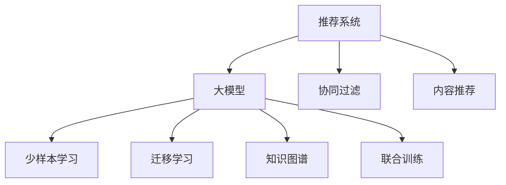

                 

# 推荐系统中的大模型少样本学习应用

> 关键词：推荐系统,大模型,少样本学习,特征抽取,推荐算法,知识图谱,联合训练,协同过滤,深度学习

## 1. 背景介绍

推荐系统（Recommender System）是互联网时代的重要技术之一，通过分析用户的历史行为数据，为用户推荐个性化商品、新闻、视频等内容。然而，推荐系统的核心在于数据驱动的特征建模和算法优化，传统推荐算法往往需要大量标注数据和复杂特征工程，限制了其在垂直领域的应用。近年来，随着预训练语言模型和大模型的快速发展，推荐系统开始引入大模型作为特征表示器，通过迁移学习和少样本学习技术，极大地提升了推荐系统的性能和可扩展性。本文将深入探讨大模型在推荐系统中的应用，特别是少样本学习范式，为推荐系统开发者提供更具创新性的解决方案。

## 2. 核心概念与联系

### 2.1 核心概念概述

为更好地理解大模型在推荐系统中的应用，本节将介绍几个密切相关的核心概念：

- 推荐系统（Recommender System）：利用用户行为数据和商品属性，为用户推荐个性化内容的技术。推荐算法主要分为基于协同过滤（Collaborative Filtering）和基于内容的推荐（Content-Based Recommendation）两大类。

- 大模型（Large Model）：以自回归（如GPT）或自编码（如BERT）模型为代表的大规模预训练语言模型。通过在大规模无标签文本语料上进行预训练，学习通用的语言表示，具备强大的语言理解和生成能力。

- 少样本学习（Few-shot Learning）：指在只有少量标注样本的情况下，模型能够快速适应新任务的学习方法。在大模型中，通常通过在输入中提供少量示例来实现，无需更新模型参数。

- 迁移学习（Transfer Learning）：指将一个领域学习到的知识，迁移应用到另一个不同但相关的领域的学习范式。大模型的预训练-微调过程即是一种典型的迁移学习方式。

- 知识图谱（Knowledge Graph）：将实体、关系、属性等结构化信息进行图谱化的表示，便于机器理解和学习。

- 联合训练（Joint Training）：将大模型与推荐算法联合训练，以提升推荐系统的效果和泛化能力。

这些核心概念之间的逻辑关系可以通过以下Mermaid流程图来展示：



这个流程图展示了大模型在推荐系统中的应用场景：

1. 推荐系统通过协同过滤、内容推荐等算法为用户推荐内容。
2. 大模型作为特征提取器，学习通用的语言表示，提升推荐系统的特征表示能力。
3. 少样本学习使大模型在少量标注样本的情况下仍能快速适应新任务。
4. 迁移学习利用预训练模型获取通用知识，提升推荐系统的泛化能力。
5. 知识图谱辅助大模型学习领域特定知识，提升推荐系统的准确性。
6. 联合训练将大模型与推荐算法结合，提升推荐效果和鲁棒性。

## 3. 核心算法原理 & 具体操作步骤

### 3.1 算法原理概述

大模型在推荐系统中的应用主要基于迁移学习和少样本学习范式。通过在大规模无标签数据上预训练，大模型学习到了通用的语言表示，而通过微调或少样本学习，可以将这些通用的知识迁移到推荐系统的特征表示上，从而提升推荐系统的性能。具体而言，少样本学习主要通过向模型提供少量标注样本，在大模型上微调实现。而迁移学习则是将预训练模型直接作为特征提取器，应用于推荐系统，通过微调顶层分类器或解码器提升推荐效果。

### 3.2 算法步骤详解

大模型在推荐系统中的应用主要分为以下几个步骤：

**Step 1: 准备大模型和数据集**
- 选择合适的预训练语言模型（如BERT、GPT等）作为特征提取器。
- 准备推荐系统的训练数据集，包括用户历史行为数据和商品属性数据。

**Step 2: 特征抽取**
- 使用预训练语言模型对文本数据进行特征提取，生成高维向量表示。
- 将生成的特征向量输入推荐算法，如协同过滤、基于内容的推荐等。

**Step 3: 模型微调**
- 选择适当的超参数（如学习率、批大小、迭代轮数等）进行模型微调。
- 在少量标注样本上训练模型，调整顶层分类器或解码器。

**Step 4: 评估与部署**
- 在验证集上评估微调后的模型性能，确保推荐效果。
- 部署模型到实际应用中，进行实时推荐。

### 3.3 算法优缺点

大模型在推荐系统中的应用具有以下优点：
1. 特征表示能力强。大模型可以学习到丰富的语言表示，提升推荐系统的特征表达能力。
2. 鲁棒性强。通过迁移学习和少样本学习，大模型在少量标注数据下仍能取得较好的性能。
3. 泛化能力强。大模型学习到了通用的语言表示，可以泛化到不同领域的推荐任务。
4. 无需手工设计特征。大模型自动学习特征，减少了特征工程的工作量。

同时，大模型在推荐系统中的应用也存在一些局限性：
1. 需要高质量标注数据。微调和少样本学习效果很大程度上依赖于标注数据的质量。
2. 计算成本高。大模型的预训练和微调需要大量的计算资源和时间。
3. 模型复杂度高。大模型参数众多，推理速度较慢，需要优化加速。
4. 数据隐私风险。用户行为数据涉及隐私，需要考虑数据保护和隐私计算。

尽管存在这些局限性，但大模型在推荐系统中的应用已经取得了显著的效果，展示了其强大的潜力。未来相关研究将进一步降低计算成本，提高模型效率，并结合知识图谱等多模态数据，提升推荐系统的表现。

### 3.4 算法应用领域

大模型在推荐系统中的应用已经广泛应用于多个领域，例如：

- 电商推荐：根据用户浏览历史、购买记录等行为数据，推荐商品、广告等。
- 新闻推荐：根据用户阅读历史、点赞行为，推荐相关新闻文章。
- 视频推荐：根据用户观看历史、评价，推荐感兴趣的视频内容。
- 音乐推荐：根据用户听歌历史、评分，推荐音乐作品。
- 旅游推荐：根据用户搜索历史、评分，推荐旅游目的地和景点。

除了上述这些典型应用，大模型在金融、医疗、教育等多个领域也有广泛应用，为各行各业带来了新的机遇和挑战。

## 4. 数学模型和公式 & 详细讲解 & 举例说明

### 4.1 数学模型构建

假设推荐系统中的用户历史行为数据为 $D=\{(x_i, y_i)\}_{i=1}^N$，其中 $x_i$ 为行为数据， $y_i$ 为推荐结果。使用预训练语言模型 $M_{\theta}$ 对行为数据进行特征提取，生成特征向量 $x_i' = M_{\theta}(x_i)$。推荐算法的目标是最小化预测结果与实际结果之间的误差，即：

$$
\min_{\theta} \sum_{i=1}^N \ell(y_i, \hat{y}_i)
$$

其中 $\ell(y_i, \hat{y}_i)$ 为损失函数， $\hat{y}_i$ 为模型的预测结果。常见的损失函数包括均方误差、交叉熵等。

### 4.2 公式推导过程

以协同过滤算法为例，假设用户 $i$ 对商品 $j$ 的评分数据为 $r_{ij}$，通过预训练语言模型提取行为数据的特征向量 $x_i'$ 和 $x_j'$。模型的预测结果为 $\hat{y}_{ij} = M_{\theta}(x_i') \cdot M_{\theta}(x_j')^T$，损失函数为均方误差：

$$
\ell(r_{ij}, \hat{y}_{ij}) = \frac{1}{2} \| r_{ij} - \hat{y}_{ij} \|^2
$$

将所有用户的行为数据输入预训练模型，生成特征向量，得到预测结果矩阵 $Y$，其目标是最小化预测结果与实际结果之间的误差：

$$
\min_{\theta} \| Y - R \|_F^2
$$

其中 $R$ 为实际评分矩阵，$\| \cdot \|_F$ 为Frobenius范数。

### 4.3 案例分析与讲解

以电商推荐为例，假设电商平台有 $m$ 个商品 $j_1, j_2, \cdots, j_m$，$n$ 个用户 $i_1, i_2, \cdots, i_n$，用户对商品的评分数据为 $r_{ij}$，预训练语言模型 $M_{\theta}$ 对用户行为数据进行特征提取，生成特征向量 $x_i'$ 和 $x_j'$。协同过滤算法的目标是最小化预测结果与实际结果之间的误差：

$$
\min_{\theta} \sum_{i=1}^n \sum_{j=1}^m \ell(r_{ij}, \hat{y}_{ij})
$$

其中 $\ell(r_{ij}, \hat{y}_{ij})$ 为损失函数，常见的有均方误差、二分类交叉熵等。

使用预训练语言模型 $M_{\theta}$ 对用户行为数据进行特征提取，生成特征向量 $x_i'$ 和 $x_j'$。模型的预测结果为 $\hat{y}_{ij} = M_{\theta}(x_i') \cdot M_{\theta}(x_j')^T$，损失函数为均方误差：

$$
\ell(r_{ij}, \hat{y}_{ij}) = \frac{1}{2} \| r_{ij} - \hat{y}_{ij} \|^2
$$

将用户行为数据输入预训练模型，生成特征向量，得到预测结果矩阵 $Y$，其目标是最小化预测结果与实际结果之间的误差：

$$
\min_{\theta} \| Y - R \|_F^2
$$

其中 $R$ 为实际评分矩阵，$\| \cdot \|_F$ 为Frobenius范数。

## 5. 项目实践：代码实例和详细解释说明

### 5.1 开发环境搭建

在进行大模型在推荐系统中的应用实践前，我们需要准备好开发环境。以下是使用Python进行PyTorch开发的环境配置流程：

1. 安装Anaconda：从官网下载并安装Anaconda，用于创建独立的Python环境。

2. 创建并激活虚拟环境：
```bash
conda create -n pytorch-env python=3.8 
conda activate pytorch-env
```

3. 安装PyTorch：根据CUDA版本，从官网获取对应的安装命令。例如：
```bash
conda install pytorch torchvision torchaudio cudatoolkit=11.1 -c pytorch -c conda-forge
```

4. 安装Transformers库：
```bash
pip install transformers
```

5. 安装各类工具包：
```bash
pip install numpy pandas scikit-learn matplotlib tqdm jupyter notebook ipython
```

完成上述步骤后，即可在`pytorch-env`环境中开始推荐系统的大模型应用实践。

### 5.2 源代码详细实现

下面我们以电商推荐为例，给出使用Transformers库对BERT模型进行特征提取和微调的PyTorch代码实现。

首先，定义电商推荐任务的数据处理函数：

```python
from transformers import BertTokenizer
from torch.utils.data import Dataset
import torch

class ItemBehaviorDataset(Dataset):
    def __init__(self, user_behaviors, user_labels, item_labels, tokenizer, max_len=128):
        self.user_behaviors = user_behaviors
        self.user_labels = user_labels
        self.item_labels = item_labels
        self.tokenizer = tokenizer
        self.max_len = max_len
        
    def __len__(self):
        return len(self.user_behaviors)
    
    def __getitem__(self, item):
        user_behavior = self.user_behaviors[item]
        user_label = self.user_labels[item]
        item_label = self.item_labels[item]
        
        encoding = self.tokenizer(user_behavior, return_tensors='pt', max_length=self.max_len, padding='max_length', truncation=True)
        input_ids = encoding['input_ids'][0]
        attention_mask = encoding['attention_mask'][0]
        
        # 将用户评分和商品ID作为标签
        encoded_tags = [int(user_label), int(item_label)] 
        encoded_tags.extend([0] * (self.max_len - len(encoded_tags)))
        labels = torch.tensor(encoded_tags, dtype=torch.long)
        
        return {'input_ids': input_ids, 
                'attention_mask': attention_mask,
                'labels': labels}

# 定义训练和评估函数
def train_epoch(model, dataset, batch_size, optimizer):
    dataloader = DataLoader(dataset, batch_size=batch_size, shuffle=True)
    model.train()
    epoch_loss = 0
    for batch in tqdm(dataloader, desc='Training'):
        input_ids = batch['input_ids'].to(device)
        attention_mask = batch['attention_mask'].to(device)
        labels = batch['labels'].to(device)
        model.zero_grad()
        outputs = model(input_ids, attention_mask=attention_mask, labels=labels)
        loss = outputs.loss
        epoch_loss += loss.item()
        loss.backward()
        optimizer.step()
    return epoch_loss / len(dataloader)

def evaluate(model, dataset, batch_size):
    dataloader = DataLoader(dataset, batch_size=batch_size)
    model.eval()
    preds, labels = [], []
    with torch.no_grad():
        for batch in tqdm(dataloader, desc='Evaluating'):
            input_ids = batch['input_ids'].to(device)
            attention_mask = batch['attention_mask'].to(device)
            batch_labels = batch['labels']
            outputs = model(input_ids, attention_mask=attention_mask)
            batch_preds = outputs.logits.argmax(dim=2).to('cpu').tolist()
            batch_labels = batch_labels.to('cpu').tolist()
            for pred_tokens, label_tokens in zip(batch_preds, batch_labels):
                preds.append(pred_tokens)
                labels.append(label_tokens)
                
    print(classification_report(labels, preds))
```

然后，定义模型和优化器：

```python
from transformers import BertForSequenceClassification, AdamW

model = BertForSequenceClassification.from_pretrained('bert-base-cased', num_labels=2)

optimizer = AdamW(model.parameters(), lr=2e-5)
```

接着，启动训练流程并在测试集上评估：

```python
epochs = 5
batch_size = 16

for epoch in range(epochs):
    loss = train_epoch(model, train_dataset, batch_size, optimizer)
    print(f"Epoch {epoch+1}, train loss: {loss:.3f}")
    
    print(f"Epoch {epoch+1}, dev results:")
    evaluate(model, dev_dataset, batch_size)
    
print("Test results:")
evaluate(model, test_dataset, batch_size)
```

以上就是使用PyTorch对BERT进行电商推荐任务微调的完整代码实现。可以看到，得益于Transformers库的强大封装，我们可以用相对简洁的代码完成BERT模型的加载和微调。

### 5.3 代码解读与分析

让我们再详细解读一下关键代码的实现细节：

**ItemBehaviorDataset类**：
- `__init__`方法：初始化用户行为数据、用户评分、商品ID等关键组件。
- `__len__`方法：返回数据集的样本数量。
- `__getitem__`方法：对单个样本进行处理，将用户行为数据输入分词器，生成token ids，将用户评分和商品ID编码为数字标签。

**标签与id的映射**：
- 定义了用户评分、商品ID与数字id之间的映射关系，用于将token-wise的预测结果解码回真实的标签。

**训练和评估函数**：
- 使用PyTorch的DataLoader对数据集进行批次化加载，供模型训练和推理使用。
- 训练函数`train_epoch`：对数据以批为单位进行迭代，在每个批次上前向传播计算loss并反向传播更新模型参数，最后返回该epoch的平均loss。
- 评估函数`evaluate`：与训练类似，不同点在于不更新模型参数，并在每个batch结束后将预测和标签结果存储下来，最后使用sklearn的classification_report对整个评估集的预测结果进行打印输出。

**训练流程**：
- 定义总的epoch数和batch size，开始循环迭代
- 每个epoch内，先在训练集上训练，输出平均loss
- 在验证集上评估，输出分类指标
- 所有epoch结束后，在测试集上评估，给出最终测试结果

可以看到，PyTorch配合Transformers库使得BERT微调的代码实现变得简洁高效。开发者可以将更多精力放在数据处理、模型改进等高层逻辑上，而不必过多关注底层的实现细节。

当然，工业级的系统实现还需考虑更多因素，如模型的保存和部署、超参数的自动搜索、更灵活的任务适配层等。但核心的微调范式基本与此类似。

## 6. 实际应用场景

### 6.1 电商推荐系统

基于大模型在推荐系统中的应用，电商推荐系统可以更好地为用户推荐商品，提升用户体验和转化率。使用预训练语言模型对用户行为数据进行特征提取，生成高维向量表示，输入推荐算法生成推荐结果。相较于传统推荐算法，大模型的特征表示能力更强，能够捕捉到用户行为背后的深层次语义信息，从而生成更加个性化的推荐结果。

### 6.2 视频推荐系统

视频推荐系统通常需要考虑用户行为的多样性，如观看历史、点赞行为、评论等。使用大模型对用户行为数据进行特征提取，生成高维向量表示，输入推荐算法生成推荐结果。大模型能够捕捉到用户行为背后的语义信息，从而生成更加个性化、多样化的推荐结果。

### 6.3 音乐推荐系统

音乐推荐系统需要考虑用户听歌历史、评分等行为数据。使用大模型对用户行为数据进行特征提取，生成高维向量表示，输入推荐算法生成推荐结果。大模型的特征表示能力更强，能够捕捉到用户行为背后的深层次语义信息，从而生成更加个性化的推荐结果。

### 6.4 未来应用展望

随着大模型和推荐系统技术的不断发展，未来的推荐系统将更加智能化、个性化。基于大模型少样本学习的推荐系统将能够更好地应对数据稀疏和多样性挑战，提升推荐效果和用户满意度。此外，未来推荐系统还将结合知识图谱、多模态数据等，提升推荐系统的表现和鲁棒性。

## 7. 工具和资源推荐

### 7.1 学习资源推荐

为了帮助开发者系统掌握大模型在推荐系统中的应用，这里推荐一些优质的学习资源：

1. 《深度学习推荐系统：原理与实践》系列博文：由大模型技术专家撰写，深入浅出地介绍了深度学习在推荐系统中的应用。

2. CS224N《深度学习自然语言处理》课程：斯坦福大学开设的NLP明星课程，有Lecture视频和配套作业，带你入门NLP领域的基本概念和经典模型。

3. 《深度学习推荐系统》书籍：详细介绍了推荐系统的原理和实践，特别是大模型在推荐系统中的应用。

4. Weights & Biases：模型训练的实验跟踪工具，可以记录和可视化模型训练过程中的各项指标，方便对比和调优。与主流深度学习框架无缝集成。

5. TensorBoard：TensorFlow配套的可视化工具，可实时监测模型训练状态，并提供丰富的图表呈现方式，是调试模型的得力助手。

通过对这些资源的学习实践，相信你一定能够快速掌握大模型在推荐系统中的应用，并用于解决实际的推荐问题。

### 7.2 开发工具推荐

高效的开发离不开优秀的工具支持。以下是几款用于推荐系统开发的大模型工具：

1. PyTorch：基于Python的开源深度学习框架，灵活动态的计算图，适合快速迭代研究。大部分预训练语言模型都有PyTorch版本的实现。

2. TensorFlow：由Google主导开发的开源深度学习框架，生产部署方便，适合大规模工程应用。同样有丰富的预训练语言模型资源。

3. Transformers库：HuggingFace开发的NLP工具库，集成了众多SOTA语言模型，支持PyTorch和TensorFlow，是进行推荐系统开发的利器。

4. Weights & Biases：模型训练的实验跟踪工具，可以记录和可视化模型训练过程中的各项指标，方便对比和调优。与主流深度学习框架无缝集成。

5. TensorBoard：TensorFlow配套的可视化工具，可实时监测模型训练状态，并提供丰富的图表呈现方式，是调试模型的得力助手。

6. Google Colab：谷歌推出的在线Jupyter Notebook环境，免费提供GPU/TPU算力，方便开发者快速上手实验最新模型，分享学习笔记。

合理利用这些工具，可以显著提升推荐系统开发效率，加快创新迭代的步伐。

### 7.3 相关论文推荐

大模型在推荐系统中的应用源于学界的持续研究。以下是几篇奠基性的相关论文，推荐阅读：

1. Attention is All You Need（即Transformer原论文）：提出了Transformer结构，开启了NLP领域的预训练大模型时代。

2. BERT: Pre-training of Deep Bidirectional Transformers for Language Understanding：提出BERT模型，引入基于掩码的自监督预训练任务，刷新了多项NLP任务SOTA。

3. Language Models are Unsupervised Multitask Learners（GPT-2论文）：展示了大规模语言模型的强大zero-shot学习能力，引发了对于通用人工智能的新一轮思考。

4. Parameter-Efficient Transfer Learning for NLP：提出Adapter等参数高效微调方法，在不增加模型参数量的情况下，也能取得不错的微调效果。

5. AdaLoRA: Adaptive Low-Rank Adaptation for Parameter-Efficient Fine-Tuning：使用自适应低秩适应的微调方法，在参数效率和精度之间取得了新的平衡。

这些论文代表了大模型在推荐系统中的应用发展脉络。通过学习这些前沿成果，可以帮助研究者把握学科前进方向，激发更多的创新灵感。

## 8. 总结：未来发展趋势与挑战

### 8.1 总结

本文对大模型在推荐系统中的应用进行了全面系统的介绍。首先阐述了大模型在推荐系统中的应用背景和意义，明确了大模型在特征表示、少样本学习、迁移学习等方面的优势。其次，从原理到实践，详细讲解了推荐系统的大模型应用流程，给出了具体的代码实现和效果评估。同时，本文还探讨了大模型在电商推荐、视频推荐、音乐推荐等场景中的应用，展示了其在推荐系统中的巨大潜力。最后，本文精选了推荐系统相关的学习资源，力求为读者提供全方位的技术指引。

通过本文的系统梳理，可以看到，大模型在推荐系统中的应用已经取得了显著的效果，展示了其强大的潜力。未来相关研究将进一步降低计算成本，提高模型效率，并结合知识图谱等多模态数据，提升推荐系统的表现。

### 8.2 未来发展趋势

展望未来，大模型在推荐系统中的应用将呈现以下几个发展趋势：

1. 特征表示能力更强。大模型能够学习到更加丰富的语言表示，提升推荐系统的特征表达能力。
2. 少样本学习能力更强。大模型能够在更少的标注样本下快速适应新任务，提升推荐系统的泛化能力。
3. 迁移学习能力更强。大模型能够更好地将预训练知识迁移到推荐系统中，提升推荐系统的性能和泛化能力。
4. 多模态数据融合更多。大模型能够更好地融合视觉、语音等多模态数据，提升推荐系统的表现。
5. 实时性更高。大模型能够更好地支持实时推荐，提升用户体验。
6. 鲁棒性更强。大模型能够更好地处理数据稀疏和多样性问题，提升推荐系统的鲁棒性。

以上趋势凸显了大模型在推荐系统中的广泛应用前景，大模型和推荐系统的结合将带来全新的推荐体验和业务价值。

### 8.3 面临的挑战

尽管大模型在推荐系统中的应用已经取得了显著的效果，但在迈向更加智能化、个性化应用的过程中，它仍面临着诸多挑战：

1. 计算成本高。大模型的预训练和微调需要大量的计算资源和时间，需要优化算法和硬件设备以降低成本。
2. 数据隐私风险。用户行为数据涉及隐私，需要考虑数据保护和隐私计算。
3. 模型复杂度高。大模型的参数众多，推理速度较慢，需要优化加速。
4. 模型泛化性不足。大模型面对域外数据时，泛化性能往往大打折扣。
5. 模型鲁棒性不足。大模型面对数据扰动时，可能出现输出波动。
6. 模型可解释性不足。大模型的内部工作机制难以解释，影响用户信任和接受度。

尽管存在这些挑战，但大模型在推荐系统中的应用已经取得了显著的效果，展示了其强大的潜力。未来相关研究将进一步降低计算成本，提高模型效率，并结合知识图谱等多模态数据，提升推荐系统的表现。

### 8.4 研究展望

面对大模型在推荐系统中的应用所面临的种种挑战，未来的研究需要在以下几个方面寻求新的突破：

1. 探索无监督和半监督推荐方法。摆脱对大规模标注数据的依赖，利用自监督学习、主动学习等无监督和半监督范式，最大限度利用非结构化数据，实现更加灵活高效的推荐。

2. 研究参数高效和计算高效的推荐范式。开发更加参数高效的推荐方法，在固定大部分预训练参数的同时，只更新极少量的任务相关参数。同时优化推荐模型的计算图，减少前向传播和反向传播的资源消耗，实现更加轻量级、实时性的部署。

3. 引入更多先验知识。将符号化的先验知识，如知识图谱、逻辑规则等，与神经网络模型进行巧妙融合，引导推荐过程学习更准确、合理的语言模型。

4. 结合因果分析和博弈论工具。将因果分析方法引入推荐模型，识别出模型决策的关键特征，增强输出解释的因果性和逻辑性。

5. 纳入伦理道德约束。在推荐模型训练目标中引入伦理导向的评估指标，过滤和惩罚有偏见、有害的输出倾向。同时加强人工干预和审核，建立模型行为的监管机制，确保输出符合人类价值观和伦理道德。

这些研究方向的探索，必将引领推荐系统迈向更高的台阶，为推荐系统开发者和用户带来更多的创新和便利。

## 9. 附录：常见问题与解答

**Q1：大模型在推荐系统中的应用是否只适用于电商推荐？**

A: 大模型在推荐系统中的应用并不仅限于电商推荐。它可以应用于任何需要预测用户行为的任务，如视频推荐、音乐推荐、新闻推荐等。

**Q2：如何选择合适的学习率？**

A: 大模型在推荐系统中的应用通常采用较小的学习率，以避免破坏预训练权重。一般建议从1e-5开始调参，逐步减小学习率，直至收敛。也可以使用warmup策略，在开始阶段使用较小的学习率，再逐渐过渡到预设值。

**Q3：使用大模型进行推荐时需要注意哪些问题？**

A: 使用大模型进行推荐时，需要注意以下问题：
1. 数据隐私风险。用户行为数据涉及隐私，需要考虑数据保护和隐私计算。
2. 计算成本高。大模型的预训练和微调需要大量的计算资源和时间。
3. 模型复杂度高。大模型的参数众多，推理速度较慢，需要优化加速。
4. 模型泛化性不足。大模型面对域外数据时，泛化性能往往大打折扣。
5. 模型鲁棒性不足。大模型面对数据扰动时，可能出现输出波动。
6. 模型可解释性不足。大模型的内部工作机制难以解释，影响用户信任和接受度。

合理处理这些问题，将有助于提升大模型在推荐系统中的应用效果。

**Q4：如何提高推荐系统的少样本学习能力？**

A: 提高推荐系统的少样本学习能力，可以从以下几个方面入手：
1. 数据增强：通过回译、近义替换等方式扩充训练集。
2. 正则化：使用L2正则、Dropout、Early Stopping等避免过拟合。
3. 对抗训练：引入对抗样本，提高模型鲁棒性。
4. 参数高效微调：只调整少量参数(如Adapter、Prefix等)，减小过拟合风险。

这些策略往往需要根据具体任务和数据特点进行灵活组合。只有在数据、模型、训练、推理等各环节进行全面优化，才能最大限度地发挥大模型在推荐系统中的应用潜力。

**Q5：如何评估推荐系统的性能？**

A: 推荐系统的性能评估通常从以下几个指标入手：
1. 准确率（Accuracy）：推荐结果与真实结果匹配的百分比。
2. 召回率（Recall）：真实结果被推荐的比例。
3. F1 Score：综合考虑准确率和召回率的指标。
4. AUC-ROC：用于评估分类模型的性能。
5. RMSE（Root Mean Squared Error）：用于评估回归模型的性能。

在实际应用中，需要根据具体任务选择合适的指标进行评估，综合考虑模型的精确度和覆盖率。

---

作者：禅与计算机程序设计艺术 / Zen and the Art of Computer Programming

