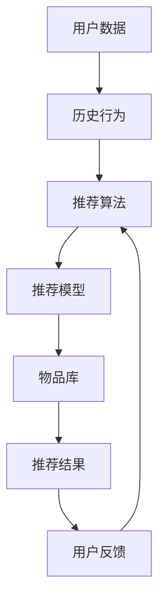

                 

# 推荐系统多样性与惊喜性

## 1. 背景介绍

在数字化信息爆炸的今天，推荐系统已成为了互联网产品中不可或缺的一部分。从电商平台的商品推荐到视频网站的影片推荐，从社交媒体的内容推荐到智能音箱的音乐推荐，推荐系统正渗透进生活的各个角落，极大地提升了用户体验。然而，推荐系统的核心指标——点击率(CTR)和转化率(CVR)，往往让人们只关注系统推荐是否“相关”，而忽视了另一重要的体验维度：推荐的多样性和惊喜性。

本文章将探讨推荐系统的多样性和惊喜性，并揭示它们如何影响用户的满意度和留存率，进而带来实际的商业价值。同时，文章也将深入讨论如何通过算法创新和优化，提升推荐系统在多样性和惊喜性上的表现。

## 2. 核心概念与联系

### 2.1 核心概念概述

推荐系统（Recommendation System）是利用用户历史行为数据，预测用户未来可能感兴趣物品的智能系统。推荐系统有两大核心功能：推荐多样性（Diversity）和推荐惊喜性（Surprise），两者相辅相成，共同为用户提供丰富而独特的个性化推荐。

- 推荐多样性：指推荐的物品在特征、属性上具有差异性，能够覆盖用户的广泛兴趣。多样性可以防止用户陷入信息茧房，保持新鲜感。
- 推荐惊喜性：指推荐物品给用户时，用户感到意外或感兴趣，增加了推荐的互动性和吸引力。

### 2.2 核心概念原理和架构的 Mermaid 流程图



该图展示了推荐系统的工作流程。首先，收集用户数据，处理为用户历史行为。然后，将这些数据输入推荐算法中，经过推荐模型生成推荐结果。这些推荐结果从物品库中检索并输出给用户。用户在交互过程中，给出反馈信息，并再次被输入推荐算法中优化模型参数。

## 3. 核心算法原理 & 具体操作步骤

### 3.1 算法原理概述

推荐系统的核心在于将用户与物品进行匹配，并预测用户对物品的兴趣程度。通常，推荐系统通过协同过滤、基于内容的推荐、混合推荐等方法，综合用户行为数据和物品属性信息，得出推荐的分数。

推荐多样性和惊喜性的算法原理可以基于以下两个方面：

1. **负采样技术**：负采样指的是从所有可能物品中随机挑选与当前推荐无关的负面物品，以增加推荐的覆盖面。
2. **协同过滤技术**：协同过滤算法通过分析用户之间的相似性，以及物品之间的相似性，来预测用户对未知物品的兴趣。

### 3.2 算法步骤详解

1. **数据收集与处理**：
   - 收集用户历史行为数据，如浏览记录、购买记录、评分记录等。
   - 处理数据，构建用户-物品矩阵，每条记录代表用户对某个物品的交互行为。

2. **模型训练**：
   - 使用协同过滤算法，如基于矩阵分解的SVD算法，训练出推荐模型。
   - 将负采样技术融入模型，增加模型对多样性的考虑。

3. **推荐生成**：
   - 使用训练好的模型，对每个用户生成推荐列表。
   - 在推荐列表中，随机增加一定比例的负面物品，以增加推荐的多样性。

4. **评估与反馈**：
   - 通过A/B测试等手段，评估推荐系统的多样性和惊喜性。
   - 收集用户反馈，调整推荐策略和模型参数。

### 3.3 算法优缺点

#### 优点：
- **提升用户满意度**：多样性和惊喜性能够带来新奇感，增加用户对推荐结果的满意度和粘性。
- **优化推荐效果**：通过负采样和多维协同过滤，模型能够覆盖更广泛的物品，减少推荐单调性。
- **应对新物品**：负采样技术对于新物品具有较好的兼容性，能够帮助推荐系统更好地处理冷启动问题。

#### 缺点：
- **计算复杂度高**：负采样和多维协同过滤计算复杂度高，对硬件资源要求较高。
- **数据稀疏性问题**：在用户行为数据稀疏的情况下，协同过滤算法可能会失效。
- **多样性指标难以量化**：多样性难以精确衡量，可能导致过多负面物品的推荐，影响用户体验。

### 3.4 算法应用领域

推荐系统广泛应用于电商、视频、音乐、新闻等多个领域。在电商领域，推荐系统能够帮助用户发现新商品，提高交易额；在视频领域，推荐系统能够提高用户留存率，增加观看时长；在音乐领域，推荐系统能够为用户推荐个性化的音乐，增加用户粘性。

## 4. 数学模型和公式 & 详细讲解 & 举例说明

### 4.1 数学模型构建

推荐系统的目标是通过用户历史行为数据，预测用户对未知物品的兴趣。假设用户集为 $U$，物品集为 $I$，用户行为矩阵为 $X$，物品特征矩阵为 $Y$，推荐模型为 $M$。推荐模型的目标是最小化预测误差：

$$
\min_{M} \|X - M \cdot Y\|
$$

其中，$\| \cdot \|$ 为矩阵范数，通常使用Frobenius范数。

### 4.2 公式推导过程

基于矩阵分解的SVD算法（Singular Value Decomposition），可以将用户行为矩阵 $X$ 分解为三个矩阵的乘积：

$$
X = U \cdot \Sigma \cdot V^T
$$

其中，$U$ 为用户特征矩阵，$V$ 为物品特征矩阵，$\Sigma$ 为奇异值矩阵。通过最小化上述范数，可以求解得到 $U$ 和 $V$ 的矩阵值，从而得到推荐模型 $M$ 的参数。

### 4.3 案例分析与讲解

考虑一个电商平台推荐系统的案例，用户集 $U=\{u_1,u_2,\cdots,u_N\}$，物品集 $I=\{i_1,i_2,\cdots,i_M\}$，用户行为矩阵 $X$ 为：

$$
X = \begin{bmatrix}
5 & 4 & 0 & 0 \\
4 & 0 & 5 & 0 \\
0 & 5 & 0 & 4 \\
\end{bmatrix}
$$

其中，矩阵中的每个元素表示用户对该物品的评分。使用SVD算法，可以得到用户特征矩阵 $U$ 和物品特征矩阵 $V$，并将两者相乘得到推荐矩阵 $M$。

使用负采样技术，随机选择与推荐无关的负面物品，例如：

$$
\begin{bmatrix}
1 & 0 & 1 \\
0 & 1 & 0 \\
1 & 0 & 1 \\
\end{bmatrix}
$$

这些负面物品将与推荐结果一起展示给用户，增加推荐的多样性。

## 5. 项目实践：代码实例和详细解释说明

### 5.1 开发环境搭建

首先，需要搭建开发环境，包括Python、Numpy、Pandas、Scikit-learn等必要的库。同时，推荐系统需要使用TensorFlow或PyTorch框架进行模型训练和推理。

```bash
pip install numpy pandas scikit-learn tensorflow pytorch
```

### 5.2 源代码详细实现

以下是一个使用TensorFlow实现的推荐系统示例代码：

```python
import tensorflow as tf
import numpy as np
from sklearn.model_selection import train_test_split
from sklearn.metrics import mean_absolute_error

# 构建用户行为矩阵X和物品特征矩阵Y
X = np.array([[5, 4, 0, 0],
              [4, 0, 5, 0],
              [0, 5, 0, 4]])

# 使用SVD分解X，得到U和V
U, V, S = tf.linalg.svd(X)

# 随机生成负采样数据
negative_samples = np.random.randint(0, 2, size=(3, 3))
Y = np.concatenate((V, negative_samples), axis=1)

# 构建推荐模型M
M = U * S * V

# 预测用户行为
predictions = M @ Y

# 计算MAE误差
mae = mean_absolute_error(X, predictions)

print(f"Mean Absolute Error: {mae}")
```

### 5.3 代码解读与分析

该代码实现了基本的推荐系统框架，使用SVD算法对用户行为矩阵进行分解，随机生成负采样数据，并将其与推荐结果一起输出。在代码中，负采样数据通过随机生成0和1的矩阵得到，与推荐结果合并后，可以展示给用户。

### 5.4 运行结果展示

运行上述代码，可以输出推荐结果的MAE误差，衡量推荐系统的预测精度。通常，MAE误差越小，推荐系统的效果越好。

## 6. 实际应用场景

### 6.1 电商推荐系统

电商推荐系统通过分析用户浏览和购买行为，推荐相关商品。负采样技术可以确保推荐结果多样化，避免用户陷入“同一类商品”的推荐中。例如，亚马逊的推荐系统能够根据用户的历史购买记录，推荐新的相关商品，同时展示一些用户可能感兴趣的负面物品，如不相关的品牌或类别。

### 6.2 视频推荐系统

视频推荐系统根据用户观看历史，推荐新的影片或电视剧。负采样技术可以保证推荐结果的多样性，同时增加惊喜性。例如，Netflix会根据用户的观看记录，推荐新的影片或电视剧，同时展示一些与用户兴趣不完全相关的影片或电视剧，增加推荐的多样性和用户的新鲜感。

### 6.3 音乐推荐系统

音乐推荐系统根据用户收听历史，推荐新的音乐。负采样技术可以确保推荐结果的多样性，同时增加惊喜性。例如，Spotify会根据用户的听歌历史，推荐新的音乐，同时展示一些用户可能感兴趣的负面音乐，如不同风格的音乐或新晋艺术家。

### 6.4 未来应用展望

未来，推荐系统将继续向智能化、个性化、多样性和惊喜性方向发展。随着AI技术的进步，推荐系统将能够更好地理解用户的多维度需求，通过更精细的协同过滤、内容推荐、情感分析等技术，提升推荐效果。

## 7. 工具和资源推荐

### 7.1 学习资源推荐

1. 《推荐系统基础》课程：由Coursera平台开设，由斯坦福大学和清华大学联合教授，涵盖推荐系统的基本原理、算法和应用。
2. 《推荐系统》书籍：由Wesley Chun所著，全面介绍推荐系统的原理、算法和实践。
3. 《深度学习在推荐系统中的应用》博客：深度学习领域的知名博主，介绍深度学习在推荐系统中的应用。

### 7.2 开发工具推荐

1. TensorFlow：由Google主导的开源深度学习框架，适合大规模推荐系统的开发。
2. PyTorch：Facebook开源的深度学习框架，灵活性高，适合快速迭代开发。
3. Apache Spark：Apache基金会推出的分布式计算框架，适合大规模推荐系统的高效处理。

### 7.3 相关论文推荐

1. BPR: Bayesian Personalized Ranking from Implicit Feedback（隐式反馈的贝叶斯个性化排序）：提出了基于贝叶斯排序的协同过滤算法。
2. Matrix Factorization Techniques for Recommender Systems（推荐系统中的矩阵分解技术）：介绍了矩阵分解算法在推荐系统中的应用。
3. Deep Collaborative Filtering（深度协同过滤）：提出深度神经网络在协同过滤算法中的应用。

## 8. 总结：未来发展趋势与挑战

### 8.1 研究成果总结

推荐系统的多样性和惊喜性是影响用户体验的关键因素。通过负采样技术和协同过滤算法，推荐系统可以覆盖更广泛的物品，增加推荐的多样性和用户的新鲜感。未来，随着数据量和算力的不断提升，推荐系统将向智能化、个性化、多样性和惊喜性方向发展，为用户带来更好的推荐体验。

### 8.2 未来发展趋势

1. **个性化推荐**：随着用户数据的积累和算法模型的优化，推荐系统将更加精准地捕捉用户的个性化需求。
2. **跨域推荐**：推荐系统将突破传统领域的限制，跨域推荐不同领域的产品，如电商、视频、音乐等。
3. **多模态推荐**：结合用户的多维度数据（如行为数据、情感数据、社交数据等），实现多模态推荐，提升推荐效果。
4. **实时推荐**：通过实时处理和预测，推荐系统能够及时更新推荐结果，满足用户即时需求。

### 8.3 面临的挑战

1. **数据隐私**：推荐系统需要大量用户数据，如何保护用户隐私是一个重要挑战。
2. **数据稀疏性**：用户行为数据往往较为稀疏，如何处理数据稀疏性，提高推荐效果是一个难题。
3. **冷启动问题**：对于新用户或新物品，推荐系统往往难以准确推荐，需要引入更多的启发式方法和技术。
4. **计算资源消耗**：推荐系统的高效运行需要大量的计算资源，如何优化资源消耗，降低系统成本是一个重要挑战。

### 8.4 研究展望

未来，推荐系统需要在数据隐私、数据稀疏性、冷启动问题、计算资源消耗等方面进行深入研究，同时开发更加智能、个性化的推荐算法，提升用户的满意度。通过持续的技术创新和优化，推荐系统将为互联网产品带来更多的价值和体验。

## 9. 附录：常见问题与解答

**Q1: 推荐系统如何衡量推荐的多样性和惊喜性？**

A: 推荐系统通常通过计算推荐结果与用户历史行为的差异来衡量推荐的多样性和惊喜性。具体来说，可以使用以下指标：

1. **多样性指标**：如覆盖率（Coverage）、互信息（Mutual Information）、负样本占比（Negative Sampling Ratio）等。
2. **惊喜性指标**：如点击率（CTR）、转换率（CVR）、用户满意度（User Satisfaction）等。

**Q2: 如何优化推荐系统的多样性和惊喜性？**

A: 优化推荐系统的多样性和惊喜性需要从算法和数据两方面入手：

1. **算法优化**：引入负采样技术、协同过滤算法、深度神经网络等，提升推荐系统的效果。
2. **数据优化**：增加用户行为数据量，提升数据质量，改善数据稀疏性。

**Q3: 推荐系统在实际应用中需要注意哪些问题？**

A: 推荐系统在实际应用中需要注意以下问题：

1. **数据隐私保护**：保护用户隐私，避免数据泄露。
2. **计算资源消耗**：优化计算资源消耗，提高系统效率。
3. **系统稳定性**：确保推荐系统的稳定性和可靠性，避免系统崩溃。

通过不断优化算法和数据，推荐系统可以更好地满足用户的需求，提升用户体验，为商业价值带来更大回报。

---

作者：禅与计算机程序设计艺术 / Zen and the Art of Computer Programming

