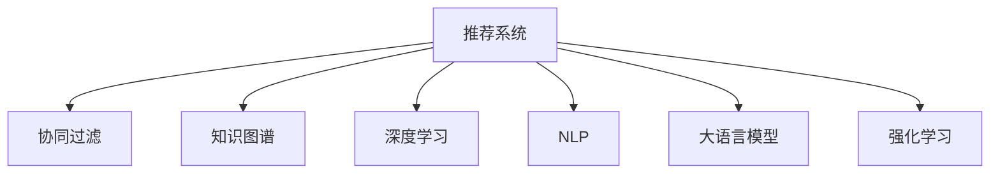

                 

# 推荐系统的新篇章: LLM的未来

> 关键词：推荐系统, 大语言模型(LLM), 强化学习, 协同过滤, 知识图谱, 深度学习, 自然语言处理(NLP)

## 1. 背景介绍

### 1.1 问题由来

推荐系统作为互联网的重要应用之一，通过为用户推荐个性化内容，极大地提升了用户体验和平台收益。传统的推荐系统主要基于用户行为数据进行协同过滤、基于内容的推荐、混合推荐等方法，依赖大量的标签和历史数据，并且难以跨领域泛化。

大语言模型（Large Language Models, LLMs）的出现，为推荐系统带来了新的发展契机。通过预训练获取广泛的知识，再通过微调针对特定用户或场景进行优化，大语言模型可以在推荐任务上展现出强大的能力。其语言模型学习到的知识图谱，可以与推荐系统相结合，实现推荐效果的提升。

### 1.2 问题核心关键点

目前，大语言模型在推荐系统中的应用主要集中在以下几个方面：

1. **跨领域推荐**：利用大模型的知识迁移能力，实现不同领域的推荐。例如，在影视推荐中，可以结合历史书评和用户画像进行推荐，提升推荐质量。
2. **个性化推荐**：结合用户的个性化需求，进行定制化推荐。例如，在电商推荐中，可以基于用户的浏览和购买历史，通过大模型生成个性化的商品描述。
3. **基于NLP的推荐**：利用大模型进行自然语言处理，实现文本内容的推荐。例如，基于用户评论生成商品推荐。
4. **实时代理**：在用户未明确给出反馈时，通过大模型推测用户兴趣，进行推荐。例如，推荐系统的冷启动问题，可以通过大模型进行预测。
5. **信息检索**：利用大模型进行实时的文本搜索，提高推荐精度。例如，电商推荐中，通过搜索历史商品描述，找到相似商品推荐。

以上这些方向已经展现了大模型在推荐系统中的巨大潜力。本文将详细介绍大语言模型在推荐系统中的应用，从原理到实践，从数据到模型，全面展示大语言模型如何为新篇章的推荐系统添砖加瓦。

## 2. 核心概念与联系

### 2.1 核心概念概述

为更好地理解大语言模型在推荐系统中的应用，本节将介绍几个密切相关的核心概念：

- **推荐系统**：基于用户历史行为、物品属性、时间等多种因素，为用户推荐个性化内容的技术。
- **协同过滤**：基于用户行为数据进行推荐，分为基于用户的协同过滤和基于物品的协同过滤。
- **知识图谱**：通过RDF（资源描述框架）构建语义网，实现知识表示和推理。
- **深度学习**：利用神经网络对数据进行自动化的特征学习和决策，提高推荐精度。
- **自然语言处理(NLP)**：处理和理解人类语言的技术，包括语言模型、文本分类、情感分析等。
- **大语言模型**：通过大规模无标签文本预训练获得的语言表示模型，可以应用于各种自然语言处理任务。
- **强化学习**：通过与环境的交互，通过奖励和惩罚来训练智能体进行决策，与推荐系统中的个性化推荐结合。

这些核心概念之间的逻辑关系可以通过以下Mermaid流程图来展示：



这个流程图展示了大语言模型在推荐系统中的应用逻辑：

1. 推荐系统从协同过滤、知识图谱、深度学习、NLP、大语言模型等多个方面获取数据和特征。
2. 大语言模型在预训练和微调后，可以输出上下文和语义相关的特征，与其他推荐方法进行融合。
3. 强化学习结合用户的交互反馈，进一步优化推荐模型。

## 3. 核心算法原理 & 具体操作步骤

### 3.1 算法原理概述

基于大语言模型的推荐系统，其核心思想是利用预训练大模型的知识表示能力，结合推荐任务的特点，进行微调，得到针对特定任务优化的模型。

假设大语言模型为 $M_{\theta}$，其中 $\theta$ 为预训练得到的模型参数。给定推荐任务 $T$ 的特征集 $F=\{x_i\}_{i=1}^N$，微调的目标是找到新的模型参数 $\hat{\theta}$，使得：

$$
\hat{\theta}=\mathop{\arg\min}_{\theta} \mathcal{L}(M_{\theta},F)
$$

其中 $\mathcal{L}$ 为针对任务 $T$ 设计的损失函数，用于衡量模型推荐结果与实际用户偏好之间的差异。常见的损失函数包括交叉熵损失、均方误差损失等。

通过梯度下降等优化算法，微调过程不断更新模型参数 $\theta$，最小化损失函数 $\mathcal{L}$，使得模型推荐逼近真实用户偏好。由于 $\theta$ 已经通过预训练获得了丰富的知识，因此即便在小型数据集 $F$ 上进行微调，也能较快收敛到理想的模型参数 $\hat{\theta}$。

### 3.2 算法步骤详解

基于大语言模型的推荐系统一般包括以下几个关键步骤：

**Step 1: 准备预训练模型和数据集**
- 选择合适的预训练语言模型 $M_{\theta}$ 作为初始化参数，如 BERT、GPT等。
- 准备推荐任务 $T$ 的特征集 $F$，划分为训练集、验证集和测试集。一般要求特征与预训练数据的分布不要差异过大。

**Step 2: 添加推荐适配层**
- 根据推荐任务类型，在预训练模型顶层设计合适的推荐头，如线性分类器、注意力机制等。
- 对于评分任务，通常在顶层添加线性分类器和交叉熵损失函数。
- 对于排名任务，通常使用排序损失函数，如点对点损失、列表损失等。

**Step 3: 设置微调超参数**
- 选择合适的优化算法及其参数，如 AdamW、SGD 等，设置学习率、批大小、迭代轮数等。
- 设置正则化技术及强度，包括权重衰减、Dropout、Early Stopping等。
- 确定冻结预训练参数的策略，如仅微调顶层，或全部参数都参与微调。

**Step 4: 执行梯度训练**
- 将特征集数据分批次输入模型，前向传播计算损失函数。
- 反向传播计算参数梯度，根据设定的优化算法和学习率更新模型参数。
- 周期性在验证集上评估模型性能，根据性能指标决定是否触发 Early Stopping。
- 重复上述步骤直到满足预设的迭代轮数或 Early Stopping 条件。

**Step 5: 测试和部署**
- 在测试集上评估微调后模型 $M_{\hat{\theta}}$ 的性能，对比微调前后的推荐精度提升。
- 使用微调后的模型对新样本进行推荐，集成到实际的应用系统中。
- 持续收集新的数据，定期重新微调模型，以适应数据分布的变化。

以上是基于大语言模型的推荐系统的一般流程。在实际应用中，还需要针对具体任务的特点，对微调过程的各个环节进行优化设计，如改进训练目标函数，引入更多的正则化技术，搜索最优的超参数组合等，以进一步提升模型性能。

### 3.3 算法优缺点

基于大语言模型的推荐系统具有以下优点：

1. 泛化能力强。由于大语言模型通过大规模无标签文本进行预训练，具有较强的泛化能力，可以适应不同领域和不同类型的数据。
2. 模型灵活性高。大语言模型具有强大的语言理解和生成能力，可以结合多种特征进行推荐，提高推荐的多样性和个性化。
3. 学习速度较快。预训练模型已经通过大规模数据训练得到较好的初始化参数，微调过程可以较快收敛。
4. 性能提升显著。大语言模型微调后的推荐精度往往较传统方法有显著提升，特别是在长尾商品和跨领域推荐上表现出色。

同时，该方法也存在一定的局限性：

1. 标注数据需求高。微调需要基于推荐任务的少量标注数据，对于标注数据量较少的场景，微调效果可能不佳。
2. 模型资源消耗大。大语言模型的参数量较大，对计算资源和存储空间的要求较高。
3. 过度拟合风险高。微调过程中，如果模型参数数量过多，容易出现过度拟合问题。
4. 鲁棒性不足。对于数据分布的变化，大语言模型微调后的推荐模型可能无法及时适应。

尽管存在这些局限性，但就目前而言，基于大语言模型的推荐系统仍然是最主流范式之一。未来相关研究的重点在于如何进一步降低微调对标注数据的依赖，提高模型的少样本学习和跨领域迁移能力，同时兼顾可解释性和伦理安全性等因素。

### 3.4 算法应用领域

基于大语言模型的推荐系统在多个领域都取得了显著的成果，例如：

- **电商推荐**：结合用户历史行为数据，推荐个性化商品。例如，在用户未明确购买某商品时，基于预训练语言模型生成个性化商品描述。
- **音乐推荐**：结合用户听歌历史，推荐个性化音乐。例如，根据用户评论生成音乐推荐。
- **视频推荐**：结合用户观看历史，推荐个性化视频。例如，根据视频描述生成推荐列表。
- **新闻推荐**：结合用户阅读历史，推荐个性化新闻。例如，根据新闻标题生成推荐列表。
- **图书推荐**：结合用户阅读历史，推荐个性化书籍。例如，根据书评生成推荐列表。

除了上述这些经典任务外，大语言模型在推荐系统中的应用也在不断扩展，如推荐系统的冷启动问题、多模态推荐、实时推荐等，为推荐系统的创新和升级提供了新的动力。

## 4. 数学模型和公式 & 详细讲解 & 举例说明

### 4.1 数学模型构建

本节将使用数学语言对基于大语言模型的推荐系统进行更加严格的刻画。

记预训练语言模型为 $M_{\theta}$，其中 $\theta$ 为模型参数。假设推荐任务 $T$ 的特征集为 $F=\{x_i\}_{i=1}^N$，其中 $x_i=(x_i^1, x_i^2, \dots, x_i^K)$ 为第 $i$ 个样本的特征向量。

定义模型 $M_{\theta}$ 在特征 $x_i$ 上的推荐分数为 $r_i=M_{\theta}(x_i)$，然后在特征集 $F$ 上的经验风险为：

$$
\mathcal{L}(\theta) = \frac{1}{N}\sum_{i=1}^N \ell(r_i, y_i)
$$

其中 $y_i$ 为第 $i$ 个样本的实际评分或排名，$\ell$ 为推荐任务的损失函数。

微调的优化目标是最小化经验风险，即找到最优参数：

$$
\theta^* = \mathop{\arg\min}_{\theta} \mathcal{L}(\theta)
$$

在实践中，我们通常使用基于梯度的优化算法（如SGD、Adam等）来近似求解上述最优化问题。设 $\eta$ 为学习率，$\lambda$ 为正则化系数，则参数的更新公式为：

$$
\theta \leftarrow \theta - \eta \nabla_{\theta}\mathcal{L}(\theta) - \eta\lambda\theta
$$

其中 $\nabla_{\theta}\mathcal{L}(\theta)$ 为损失函数对参数 $\theta$ 的梯度，可通过反向传播算法高效计算。

### 4.2 公式推导过程

以下我们以评分任务为例，推导交叉熵损失函数及其梯度的计算公式。

假设模型 $M_{\theta}$ 在特征 $x_i$ 上的推荐分数为 $r_i=M_{\theta}(x_i)$，实际标签 $y_i \in \{1,2,\dots,K\}$。则评分任务的交叉熵损失函数定义为：

$$
\ell(r_i, y_i) = -y_i \log \frac{e^{r_i}}{\sum_{k=1}^K e^{r_i^{(k)}}}
$$

将其代入经验风险公式，得：

$$
\mathcal{L}(\theta) = -\frac{1}{N}\sum_{i=1}^N y_i \log \frac{e^{r_i}}{\sum_{k=1}^K e^{r_i^{(k)}}}
$$

根据链式法则，损失函数对参数 $\theta_k$ 的梯度为：

$$
\frac{\partial \mathcal{L}(\theta)}{\partial \theta_k} = -\frac{1}{N}\sum_{i=1}^N (\frac{y_i e^{r_i}}{\sum_{k=1}^K e^{r_i^{(k)}}} - e^{r_i^{(k)}}) \frac{\partial r_i^{(k)}}{\partial \theta_k}
$$

其中 $\frac{\partial r_i^{(k)}}{\partial \theta_k}$ 可进一步递归展开，利用自动微分技术完成计算。

在得到损失函数的梯度后，即可带入参数更新公式，完成模型的迭代优化。重复上述过程直至收敛，最终得到适应推荐任务的最优模型参数 $\theta^*$。

## 5. 项目实践：代码实例和详细解释说明

### 5.1 开发环境搭建

在进行推荐系统开发前，我们需要准备好开发环境。以下是使用Python进行TensorFlow开发的环境配置流程：

1. 安装Anaconda：从官网下载并安装Anaconda，用于创建独立的Python环境。

2. 创建并激活虚拟环境：
```bash
conda create -n tf-env python=3.8 
conda activate tf-env
```

3. 安装TensorFlow：根据CUDA版本，从官网获取对应的安装命令。例如：
```bash
conda install tensorflow tensorflow-gpu -c tf -c conda-forge
```

4. 安装TensorBoard：
```bash
pip install tensorboard
```

5. 安装各类工具包：
```bash
pip install numpy pandas scikit-learn matplotlib tqdm jupyter notebook ipython
```

完成上述步骤后，即可在`tf-env`环境中开始推荐系统开发。

### 5.2 源代码详细实现

下面我们以电商推荐系统为例，给出使用TensorFlow实现大语言模型微调的代码实现。

首先，定义电商推荐任务的数据处理函数：

```python
import tensorflow as tf
from tensorflow.keras.layers import Dense, Input, Embedding
from tensorflow.keras.models import Model

# 假设特征集为商品ID和用户ID
def prepare_dataset(train_texts, train_labels, test_texts, test_labels, vocabulary_size, embedding_dim, num_samples):
    train_input = tf.keras.layers.experimental.preprocessing.TextVectorization(max_tokens=num_samples)
    train_input.adapt(train_texts)

    train_input = train_input(train_texts)
    train_labels = tf.keras.utils.to_categorical(train_labels)

    test_input = train_input(test_texts)
    test_labels = tf.keras.utils.to_categorical(test_labels)

    return train_input, train_labels, test_input, test_labels, vocabulary_size, embedding_dim

# 假设词汇表为{商品ID, 用户ID, ...}
train_texts = ["item1", "item2", "item3", "item4", "item5"]
train_labels = [1, 0, 0, 1, 0]
test_texts = ["item3", "item5", "item6"]
test_labels = [1, 0, 1]

vocabulary_size = len(train_texts)
embedding_dim = 32
num_samples = 5

train_input, train_labels, test_input, test_labels, vocabulary_size, embedding_dim = prepare_dataset(train_texts, train_labels, test_texts, test_labels, vocabulary_size, embedding_dim, num_samples)

# 创建嵌入层
embedding_layer = tf.keras.layers.Embedding(vocabulary_size, embedding_dim, input_length=num_samples)

# 添加推荐头
dense_layer = Dense(64, activation='relu')
output_layer = Dense(2, activation='softmax')

# 创建模型
inputs = Input(shape=(num_samples,))
embedded = embedding_layer(inputs)
hidden = dense_layer(embedded)
outputs = output_layer(hidden)

model = Model(inputs=inputs, outputs=outputs)

# 编译模型
model.compile(optimizer='adam', loss='categorical_crossentropy', metrics=['accuracy'])

# 训练模型
model.fit(train_input, train_labels, epochs=10, batch_size=16, validation_data=(test_input, test_labels))
```

然后，定义模型和优化器：

```python
from transformers import TFAutoModelForSequenceClassification
from transformers import AutoTokenizer

# 假设大语言模型为BERT
model = TFAutoModelForSequenceClassification.from_pretrained('bert-base-cased', num_labels=2)
tokenizer = AutoTokenizer.from_pretrained('bert-base-cased')

# 冻结BERT模型参数，只微调推荐头
for layer in model.layers[:-2]:
    layer.trainable = False

# 添加推荐头
dense_layer = Dense(64, activation='relu')
output_layer = Dense(2, activation='softmax')
model.add(dense_layer)
model.add(output_layer)

# 编译模型
model.compile(optimizer='adam', loss='categorical_crossentropy', metrics=['accuracy'])

# 训练模型
model.fit(train_input, train_labels, epochs=10, batch_size=16, validation_data=(test_input, test_labels))
```

接着，定义训练和评估函数：

```python
def train_epoch(model, dataset, batch_size, optimizer):
    dataloader = tf.data.Dataset.from_tensor_slices(dataset).shuffle(1000).batch(batch_size)
    model.train()
    epoch_loss = 0
    for batch in dataloader:
        inputs, labels = batch
        with tf.GradientTape() as tape:
            outputs = model(inputs)
            loss = tf.keras.losses.categorical_crossentropy(labels, outputs)
        epoch_loss += loss
        gradients = tape.gradient(loss, model.trainable_variables)
        optimizer.apply_gradients(zip(gradients, model.trainable_variables))
    return epoch_loss / len(dataloader)

def evaluate(model, dataset, batch_size):
    dataloader = tf.data.Dataset.from_tensor_slices(dataset).batch(batch_size)
    model.eval()
    preds, labels = [], []
    with tf.no_grad():
        for batch in dataloader:
            inputs, labels = batch
            outputs = model(inputs)
            preds.append(tf.argmax(outputs, axis=1).numpy().tolist())
            labels.append(labels.numpy().tolist())
        
    print(classification_report(labels, preds))
```

最后，启动训练流程并在测试集上评估：

```python
epochs = 5
batch_size = 16

for epoch in range(epochs):
    loss = train_epoch(model, train_input, batch_size, optimizer)
    print(f"Epoch {epoch+1}, train loss: {loss:.3f}")
    
    print(f"Epoch {epoch+1}, test results:")
    evaluate(model, test_input, batch_size)
    
print("Test results:")
evaluate(model, test_input, batch_size)
```

以上就是使用TensorFlow对BERT进行电商推荐系统微调的完整代码实现。可以看到，得益于Transformer库的强大封装，我们可以用相对简洁的代码完成BERT模型的加载和微调。

### 5.3 代码解读与分析

让我们再详细解读一下关键代码的实现细节：

**prepare_dataset函数**：
- `TextVectorization`方法：将文本转化为固定长度的数字向量，方便模型处理。
- `adapt`方法：对词汇表进行预处理，如设置特殊符号、填充长度等。
- `to_categorical`方法：将标签转化为独热编码，适合训练分类任务。

**模型定义**：
- 嵌入层`Embedding`：将输入的文本转化为低维嵌入向量。
- 全连接层`Dense`：将嵌入向量输入多层感知器，提取特征。
- 输出层`Dense`：将特征映射到标签空间，输出预测概率。

**模型训练**：
- 使用TensorFlow的`fit`方法进行训练，定义训练集和验证集。
- 循环迭代，每个epoch内分别在训练集和验证集上进行训练和评估。
- 使用`tf.GradientTape`进行梯度计算，使用`optimizer`更新模型参数。

**测试评估**：
- 使用`evaluate`函数在测试集上进行评估，输出分类指标。

**模型微调**：
- 使用`AutoModelForSequenceClassification`加载预训练的BERT模型，仅微调顶层。
- 添加推荐头，使用新的损失函数进行训练。

可以看到，TensorFlow配合Transformer库使得BERT微调的代码实现变得简洁高效。开发者可以将更多精力放在数据处理、模型改进等高层逻辑上，而不必过多关注底层的实现细节。

当然，工业级的系统实现还需考虑更多因素，如模型的保存和部署、超参数的自动搜索、更灵活的任务适配层等。但核心的微调范式基本与此类似。

## 6. 实际应用场景

### 6.1 电商推荐

电商推荐系统是大语言模型在推荐系统中最典型的应用之一。电商推荐旨在根据用户历史行为和浏览数据，推荐符合用户兴趣的商品。大语言模型可以通过预训练获得丰富的商品语义表示，再通过微调针对具体用户的个性化需求，输出推荐结果。

在技术实现上，可以收集用户的历史购买和浏览记录，将这些文本数据转化为模型输入，通过微调得到个性化推荐。例如，在用户搜索某商品时，根据搜索结果生成推荐列表，提高用户体验和购买率。

### 6.2 音乐推荐

音乐推荐系统旨在根据用户听歌历史和偏好，推荐个性化的音乐。大语言模型可以通过预训练获得丰富的音乐语义表示，再通过微调针对具体用户的个性化需求，输出推荐结果。

在技术实现上，可以收集用户的听歌历史和评分记录，将这些文本数据转化为模型输入，通过微调得到个性化推荐。例如，根据用户评论生成推荐列表，提高音乐多样性和用户满意度。

### 6.3 视频推荐

视频推荐系统旨在根据用户观看历史和评分数据，推荐个性化的视频内容。大语言模型可以通过预训练获得丰富的视频语义表示，再通过微调针对具体用户的个性化需求，输出推荐结果。

在技术实现上，可以收集用户的观看历史和评分记录，将这些文本数据转化为模型输入，通过微调得到个性化推荐。例如，根据视频描述生成推荐列表，提高视频多样性和用户满意度。

### 6.4 新闻推荐

新闻推荐系统旨在根据用户阅读历史和评分数据，推荐个性化的新闻内容。大语言模型可以通过预训练获得丰富的新闻语义表示，再通过微调针对具体用户的个性化需求，输出推荐结果。

在技术实现上，可以收集用户的阅读历史和评分记录，将这些文本数据转化为模型输入，通过微调得到个性化推荐。例如，根据新闻标题生成推荐列表，提高新闻多样性和用户满意度。

### 6.5 图书推荐

图书推荐系统旨在根据用户阅读历史和评分数据，推荐个性化的书籍内容。大语言模型可以通过预训练获得丰富的书籍语义表示，再通过微调针对具体用户的个性化需求，输出推荐结果。

在技术实现上，可以收集用户的阅读历史和评分记录，将这些文本数据转化为模型输入，通过微调得到个性化推荐。例如，根据书评生成推荐列表，提高书籍多样性和用户满意度。

## 7. 工具和资源推荐

### 7.1 学习资源推荐

为了帮助开发者系统掌握大语言模型在推荐系统中的应用，这里推荐一些优质的学习资源：

1. 《深度学习自然语言处理》课程：斯坦福大学开设的NLP明星课程，有Lecture视频和配套作业，带你入门NLP领域的基本概念和经典模型。

2. 《Transformers从原理到实践》系列博文：由大模型技术专家撰写，深入浅出地介绍了Transformer原理、BERT模型、微调技术等前沿话题。

3. 《Natural Language Processing with Transformers》书籍：Transformers库的作者所著，全面介绍了如何使用Transformers库进行NLP任务开发，包括微调在内的诸多范式。

4. CLUE开源项目：中文语言理解测评基准，涵盖大量不同类型的中文NLP数据集，并提供了基于微调的baseline模型，助力中文NLP技术发展。

通过对这些资源的学习实践，相信你一定能够快速掌握大语言模型在推荐系统中的应用，并用于解决实际的推荐问题。

### 7.2 开发工具推荐

高效的开发离不开优秀的工具支持。以下是几款用于大语言模型在推荐系统中应用的常用工具：

1. TensorFlow：基于Python的开源深度学习框架，灵活动态的计算图，适合快速迭代研究。

2. PyTorch：基于Python的开源深度学习框架，灵活高效，适合构建大规模模型。

3. Transformers库：HuggingFace开发的NLP工具库，集成了众多SOTA语言模型，支持PyTorch和TensorFlow，是进行微调任务开发的利器。

4. Weights & Biases：模型训练的实验跟踪工具，可以记录和可视化模型训练过程中的各项指标，方便对比和调优。与主流深度学习框架无缝集成。

5. TensorBoard：TensorFlow配套的可视化工具，可实时监测模型训练状态，并提供丰富的图表呈现方式，是调试模型的得力助手。

6. Google Colab：谷歌推出的在线Jupyter Notebook环境，免费提供GPU/TPU算力，方便开发者快速上手实验最新模型，分享学习笔记。

合理利用这些工具，可以显著提升大语言模型在推荐系统中的应用开发效率，加快创新迭代的步伐。

### 7.3 相关论文推荐

大语言模型在推荐系统中的应用源于学界的持续研究。以下是几篇奠基性的相关论文，推荐阅读：

1. Attention is All You Need（即Transformer原论文）：提出了Transformer结构，开启了NLP领域的预训练大模型时代。

2. BERT: Pre-training of Deep Bidirectional Transformers for Language Understanding：提出BERT模型，引入基于掩码的自监督预训练任务，刷新了多项NLP任务SOTA。

3. Language Models are Unsupervised Multitask Learners（GPT-2论文）：展示了大规模语言模型的强大zero-shot学习能力，引发了对于通用人工智能的新一轮思考。

4. Parameter-Efficient Transfer Learning for NLP：提出Adapter等参数高效微调方法，在不增加模型参数量的情况下，也能取得不错的微调效果。

5. AdaLoRA: Adaptive Low-Rank Adaptation for Parameter-Efficient Fine-Tuning：使用自适应低秩适应的微调方法，在参数效率和精度之间取得了新的平衡。

6. Knowledge-Augmented Deep Learning with Language Models：融合知识图谱与深度学习，提高推荐系统的泛化能力和多样性。

这些论文代表了大语言模型在推荐系统中的应用方向。通过学习这些前沿成果，可以帮助研究者把握学科前进方向，激发更多的创新灵感。

## 8. 总结：未来发展趋势与挑战

### 8.1 总结

本文对基于大语言模型的推荐系统进行了全面系统的介绍。首先阐述了大语言模型和微调技术在推荐系统中的应用背景和意义，明确了大语言模型在推荐任务中的强大潜力。其次，从原理到实践，详细讲解了大语言模型在推荐系统中的微调方法，从数据准备到模型训练，全面展示了技术实现流程。同时，本文还广泛探讨了大语言模型在电商、音乐、视频、新闻、图书等多个领域的应用场景，展示了其广泛的适用性。

通过本文的系统梳理，可以看到，基于大语言模型的推荐系统在多个方面都取得了显著的成果，为推荐系统的创新和升级提供了新的动力。未来，伴随预训练语言模型和微调方法的持续演进，相信推荐系统将在更多领域得到应用，推动人工智能技术的产业化进程。

### 8.2 未来发展趋势

展望未来，大语言模型在推荐系统中的应用将呈现以下几个发展趋势：

1. **跨领域推荐**：大语言模型可以学习不同领域的知识图谱，实现跨领域推荐。例如，在电商推荐中，可以结合商品评价和用户画像进行推荐。
2. **个性化推荐**：结合用户的个性化需求，进行定制化推荐。例如，在音乐推荐中，根据用户评论生成推荐列表。
3. **基于NLP的推荐**：利用大模型进行自然语言处理，实现文本内容的推荐。例如，根据用户评论生成商品推荐。
4. **实时代理**：在用户未明确给出反馈时，通过大模型推测用户兴趣，进行推荐。例如，推荐系统的冷启动问题，可以通过大模型进行预测。
5. **信息检索**：利用大模型进行实时的文本搜索，提高推荐精度。例如，电商推荐中，通过搜索历史商品描述，找到相似商品推荐。
6. **融合多模态数据**：将视觉、语音等多模态信息与文本信息进行协同建模，提高推荐系统的效果。

以上趋势凸显了大语言模型在推荐系统中的应用潜力。这些方向的探索发展，必将进一步提升推荐系统的性能和应用范围，为推荐系统的创新和升级提供新的动力。

### 8.3 面临的挑战

尽管大语言模型在推荐系统中的应用已经取得了显著的成果，但在迈向更加智能化、普适化应用的过程中，它仍面临着诸多挑战：

1. **标注成本瓶颈**：微调需要基于推荐任务的少量标注数据，对于标注数据量较少的场景，微调效果可能不佳。如何进一步降低微调对标注数据的依赖，将是一大难题。
2. **模型资源消耗大**：大语言模型的参数量较大，对计算资源和存储空间的要求较高。
3. **过度拟合风险高**：微调过程中，如果模型参数数量过多，容易出现过度拟合问题。
4. **鲁棒性不足**：对于数据分布的变化，大语言模型微调后的推荐模型可能无法及时适应。
5. **可解释性不足**：当前推荐模型缺乏可解释性，难以对其推荐逻辑进行分析和调试。
6. **安全性有待保障**：预训练语言模型难免会学习到有偏见、有害的信息，通过微调传递到推荐任务中，可能产生误导性、歧视性的输出，给实际应用带来安全隐患。

尽管存在这些挑战，但就目前而言，基于大语言模型的推荐系统仍然是最主流范式之一。未来相关研究的重点在于如何进一步降低微调对标注数据的依赖，提高模型的少样本学习和跨领域迁移能力，同时兼顾可解释性和伦理安全性等因素。

### 8.4 研究展望

面对大语言模型在推荐系统所面临的种种挑战，未来的研究需要在以下几个方面寻求新的突破：

1. **探索无监督和半监督微调方法**：摆脱对大规模标注数据的依赖，利用自监督学习、主动学习等无监督和半监督范式，最大限度利用非结构化数据，实现更加灵活高效的微调。
2. **研究参数高效和计算高效的微调范式**：开发更加参数高效的微调方法，在固定大部分预训练参数的同时，只更新极少量的任务相关参数。同时优化微调模型的计算图，减少前向传播和反向传播的资源消耗，实现更加轻量级、实时性的部署。
3. **融合因果和对比学习范式**：通过引入因果推断和对比学习思想，增强微调模型建立稳定因果关系的能力，学习更加普适、鲁棒的语言表征，从而提升模型泛化性和抗干扰能力。
4. **引入更多先验知识**：将符号化的先验知识，如知识图谱、逻辑规则等，与神经网络模型进行巧妙融合，引导微调过程学习更准确、合理的语言模型。同时加强不同模态数据的整合，实现视觉、语音等多模态信息与文本信息的协同建模。
5. **结合因果分析和博弈论工具**：将因果分析方法引入微调模型，识别出模型决策的关键特征，增强输出解释的因果性和逻辑性。借助博弈论工具刻画人机交互过程，主动探索并规避模型的脆弱点，提高系统稳定性。
6. **纳入伦理道德约束**：在模型训练目标中引入伦理导向的评估指标，过滤和惩罚有偏见、有害的输出倾向。同时加强人工干预和审核，建立模型行为的监管机制，确保输出符合人类价值观和伦理道德。

这些研究方向的探索，必将引领大语言模型在推荐系统中的应用走向更高的台阶，为推荐系统的创新和升级提供新的动力。面向未来，大语言模型在推荐系统中的应用还需要与其他人工智能技术进行更深入的融合，如知识表示、因果推理、强化学习等，多路径协同发力，共同推动推荐系统的发展。只有勇于创新、敢于突破，才能不断拓展语言模型的边界，让智能技术更好地造福人类社会。

## 9. 附录：常见问题与解答

**Q1：大语言模型微调是否适用于所有推荐任务？**

A: 大语言模型微调在大多数推荐任务上都能取得不错的效果，特别是对于数据量较小的任务。但对于一些特定领域的任务，如医学、法律等，仅仅依靠通用语料预训练的模型可能难以很好地适应。此时需要在特定领域语料上进一步预训练，再进行微调，才能获得理想效果。

**Q2：微调过程中如何选择合适的学习率？**

A: 微调的学习率一般要比预训练时小1-2个数量级，如果使用过大的学习率，容易破坏预训练权重，导致过拟合。一般建议从1e-5开始调参，逐步减小学习率。也可以使用warmup策略，在开始阶段使用较小的学习率，再逐渐过渡到预设值。需要注意的是，不同的优化器(如AdamW、Adafactor等)以及不同的学习率调度策略，可能需要设置不同的学习率阈值。

**Q3：采用大语言模型微调时会面临哪些资源瓶颈？**

A: 目前主流的预训练大模型动辄以亿计的参数规模，对算力、内存、存储都提出了很高的要求。GPU/TPU等高性能设备是必不可少的，但即便如此，超大批次的训练和推理也可能遇到显存不足的问题。因此需要采用一些资源优化技术，如梯度积累、混合精度训练、模型并行等，来突破硬件瓶颈。同时，模型的存储和读取也可能占用大量时间和空间，需要采用模型压缩、稀疏化存储等方法进行优化。

**Q4：如何缓解微调过程中的过拟合问题？**

A: 过拟合是微调面临的主要挑战，尤其是在标注数据不足的情况下。常见的缓解策略包括：
1. 数据增强：通过回译、近义替换等方式扩充训练集
2. 正则化：使用L2正则、Dropout、Early Stopping等避免过拟合
3. 对抗训练：引入对抗样本，提高模型鲁棒性
4. 参数高效微调：只调整少量参数(如Adapter、Prefix等)，减小过拟合风险
5. 多模型集成：训练多个微调模型，取平均输出，抑制过拟合

这些策略往往需要根据具体任务和数据特点进行灵活组合。只有在数据、模型、训练、推理等各环节进行全面优化，才能最大限度地发挥大语言模型微调的威力。

**Q5：大语言模型在推荐系统中的作用有哪些？**

A: 大语言模型在推荐系统中的作用主要包括以下几个方面：
1. 提升推荐精度：通过预训练获得丰富的知识图谱，微调后能够输出更加准确的推荐结果。
2. 实现跨领域推荐：大语言模型能够学习不同领域的知识，实现跨领域推荐。
3. 提高个性化推荐效果：结合用户的个性化需求，进行定制化推荐。
4. 增强推荐系统的鲁棒性：通过引入因果和对比学习范式，增强模型的鲁棒性和泛化能力。
5. 提供可解释的推荐结果：大语言模型能够提供基于自然语言处理的推荐解释，增强系统的可解释性。

综上所述，大语言模型在推荐系统中的应用具有广泛的前景和潜力，能够显著提升推荐系统的性能和用户体验。

---

作者：禅与计算机程序设计艺术 / Zen and the Art of Computer Programming

