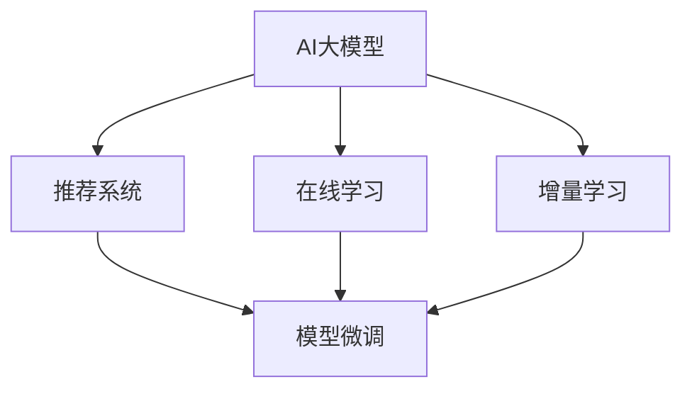

                 

# 推荐系统的时效性：AI大模型的动态调整策略

## 1. 背景介绍

### 1.1 问题由来

在数字化转型加速的今天，推荐系统成为驱动互联网平台价值的核心引擎。以电商、视频、新闻等平台为例，推荐系统通过分析用户行为数据，预测用户需求，为其推荐可能感兴趣的物品，从而实现业务增长。传统的推荐模型如协同过滤、基于内容的推荐，由于其固定和静态的特性，难以应对用户兴趣的多样化和快速变化，无法提供持续的时效性推荐。

随着AI大模型的崛起，推荐系统开始借助深度学习模型，引入知识图谱、神经协同过滤等技术，大幅提升了推荐的质量和覆盖面。然而，面对用户兴趣的快速变化，现有的大模型推荐系统仍存在一定的滞后性，难以提供即时的、个性化的推荐服务。特别是在用户行为瞬息万变的情况下，推荐系统如何动态地适应新的数据，保持时效性，成为了一个亟待解决的挑战。

### 1.2 问题核心关键点

动态调整是推荐系统保持时效性的核心方法。针对不同用户和不同的业务场景，推荐系统需要动态调整其模型参数，以适应新的数据和用户行为，实现高实时性的个性化推荐。动态调整可以分为在线学习(Online Learning)和增量学习(Incremental Learning)等两种主要方式。在线学习通过实时接收新数据，不断更新模型参数，而增量学习则通过小批量数据更新模型，避免影响模型稳定性。

动态调整的成功与否，很大程度上取决于模型的可解释性、鲁棒性和泛化能力。模型的可解释性使得调整过程更加透明、可控；鲁棒性确保模型在不同环境、噪声下仍能稳定工作；泛化能力则保证了模型对新数据的适应性。此外，动态调整过程还需要平衡模型的实时性、准确性和资源消耗，找到最优的权衡点。

## 2. 核心概念与联系

### 2.1 核心概念概述

为更好地理解AI大模型在推荐系统中的动态调整策略，本节将介绍几个密切相关的核心概念：

- AI大模型：以BERT、GPT、Transformer等深度学习模型为代表的，参数量庞大、表现力强、泛化能力优秀的模型。通过在大规模数据上进行预训练，大模型具备强大的特征提取能力，可用于推荐系统的建模和预测。

- 推荐系统：通过分析用户行为数据，预测用户兴趣，为用户推荐可能感兴趣的物品或内容。推荐系统是互联网业务的核心，具有广泛的商业价值。

- 在线学习：一种通过不断接收新数据来更新模型参数的学习方式，旨在实时响应用户行为变化，提高推荐的时效性。

- 增量学习：一种在小批量数据上逐步更新模型参数的学习方式，旨在保持模型的稳定性和精度，避免过度训练和过拟合。

- 自适应学习：一种根据环境变化自动调整学习策略的方法，使模型能够自动适应新数据和变化的用户行为。

- 模型微调：通过在特定数据集上进行有监督学习，优化模型参数，提高模型在新数据上的表现。

这些核心概念之间的逻辑关系可以通过以下Mermaid流程图来展示：



这个流程图展示了大模型在推荐系统中的应用流程：

1. AI大模型作为推荐系统的基础，提供强大的特征提取和预测能力。
2. 在线学习允许模型实时接收新数据，动态更新，提高推荐的时效性。
3. 增量学习通过小批量数据更新，保持模型稳定，避免过拟合。
4. 模型微调通过有监督学习优化模型，提高在新数据上的表现。

## 3. 核心算法原理 & 具体操作步骤
### 3.1 算法原理概述

AI大模型在推荐系统中的动态调整策略，本质上是一种通过有监督学习或无监督学习不断优化模型参数的过程。其核心思想是：通过不断接收新的用户行为数据，及时调整模型参数，以适应新的用户偏好和行为模式，实现实时推荐。

具体而言，假设推荐系统由AI大模型 $M_{\theta}$ 和在线学习模块 $L$ 构成，用户行为数据流记为 $D_t$。在线学习模块 $L$ 负责接收新数据流，计算模型的损失函数，并使用梯度下降等优化算法更新模型参数，即：

$$
\theta_{t+1} = \theta_t - \eta_t \nabla_{\theta_t}\mathcal{L}(D_t; M_{\theta_t})
$$

其中 $\theta_{t+1}$ 为更新后的模型参数，$\eta_t$ 为学习率，$\nabla_{\theta_t}\mathcal{L}(D_t; M_{\theta_t})$ 为模型在当前数据流 $D_t$ 上的损失函数的梯度。

在线学习通过不断接收新数据，动态更新模型参数，实现了推荐系统的实时调整。相比之下，增量学习则是通过小批量数据流，逐步更新模型，避免对模型稳定性的破坏，从而在保持时效性的同时，保持模型精度。

### 3.2 算法步骤详解

AI大模型在推荐系统中的动态调整一般包括以下几个关键步骤：

**Step 1: 准备预训练模型和在线学习框架**

- 选择合适的AI大模型，如BERT、GPT等，作为推荐系统的基础。
- 搭建在线学习框架，选择合适的优化算法（如Adam、SGD等）及其参数，如学习率、批大小、迭代轮数等。

**Step 2: 数据流处理**

- 收集用户行为数据流 $D_t$，例如点击、购买、浏览、评分等。
- 对数据流进行预处理和增量化处理，确保数据的时效性和稳定性。

**Step 3: 在线学习**

- 使用在线学习算法，不断接收新数据流 $D_t$，计算当前模型的损失函数。
- 根据损失函数梯度，使用优化算法更新模型参数，得到更新后的模型 $M_{\theta_{t+1}}$。
- 将更新后的模型应用到新的数据流中，生成推荐结果。

**Step 4: 模型评估与反馈**

- 在实时推荐过程中，对推荐结果进行评估，计算推荐质量指标。
- 根据推荐质量反馈调整模型参数，如更新学习率、调整模型结构等。
- 通过A/B测试等方法，评估模型调整的效果，选择最优的调整策略。

**Step 5: 增量学习**

- 对小批量数据流进行增量学习，逐步更新模型参数。
- 在增量学习过程中，可以采用随机梯度下降等优化算法，减少对模型稳定性的影响。
- 定期对增量学习后的模型进行评估和调整，确保模型精度和实时性。

### 3.3 算法优缺点

AI大模型在推荐系统中的动态调整策略，具有以下优点：

- 实时性高：通过在线学习，能够及时响应用户行为变化，提供即时的推荐服务。
- 鲁棒性强：增量学习通过小批量数据更新，避免对模型稳定性的破坏，提高了模型的鲁棒性。
- 泛化能力强：AI大模型通过大规模数据预训练，具备较强的泛化能力，能够适应新的用户偏好和行为模式。

同时，该方法也存在一定的局限性：

- 数据处理复杂：在线学习要求对实时数据流进行高效的增量处理，对系统性能和稳定性要求较高。
- 计算资源消耗大：大规模数据流的在线学习，对计算资源要求较高，需要高效的硬件支持和优化算法。
- 模型可解释性差：动态调整的模型通常较为复杂，难以进行有效的解释和调试。

尽管存在这些局限性，但就目前而言，AI大模型在推荐系统中的动态调整策略仍是最为主流和有效的推荐方法。未来相关研究将继续在提升实时性、优化计算资源消耗和提高模型可解释性等方面发力。

### 3.4 算法应用领域

AI大模型在推荐系统中的动态调整策略，广泛应用于电商、视频、新闻、社交等各类互联网平台中。具体应用场景包括：

- 电商推荐系统：通过用户点击、购买、浏览等行为数据，实时生成商品推荐，提升用户转化率和购物体验。
- 视频推荐系统：分析用户观看历史和评分，实时推荐可能感兴趣的视频内容。
- 新闻推荐系统：根据用户阅读历史和互动数据，实时推荐相关新闻文章，提升用户阅读时长和满意度。
- 社交推荐系统：分析用户互动和兴趣变化，实时推荐可能感兴趣的朋友和内容，增强用户粘性和平台活力。

## 4. 数学模型和公式 & 详细讲解
### 4.1 数学模型构建

假设推荐系统由AI大模型 $M_{\theta}$ 和在线学习模块 $L$ 构成，用户行为数据流记为 $D_t$。推荐模型输出为用户可能感兴趣的物品或内容的概率分布，记为 $P(Y|X; M_{\theta})$。

定义推荐模型的损失函数为：

$$
\mathcal{L}(M_{\theta}, D_t) = \sum_{i=1}^{N_t} \ell(M_{\theta}(x_i), y_i)
$$

其中 $\ell$ 为推荐质量指标，如交叉熵损失、均方误差等。$N_t$ 为数据流 $D_t$ 中的样本数量。

在线学习模块 $L$ 负责不断接收新数据流 $D_t$，计算模型的损失函数，并使用梯度下降等优化算法更新模型参数，即：

$$
\theta_{t+1} = \theta_t - \eta_t \nabla_{\theta_t}\mathcal{L}(D_t; M_{\theta_t})
$$

在增量学习过程中，使用小批量数据流 $D_{t'}$ 更新模型，得到增量后的模型参数 $\theta_{t'}$：

$$
\theta_{t'} = \theta_t - \eta' \nabla_{\theta_t}\mathcal{L}(D_{t'}; M_{\theta_t})
$$

其中 $\eta'$ 为增量学习的小批量学习率。

### 4.2 公式推导过程

以下我们以电商推荐系统为例，推导在线学习算法的基本公式。

假设推荐模型 $M_{\theta}$ 在输入 $x_i$ 上的输出为 $\hat{y}_i = M_{\theta}(x_i)$，表示物品 $i$ 被用户 $i$ 购买的概率。真实标签 $y_i \in \{0,1\}$，表示用户是否购买了物品 $i$。

定义推荐模型的损失函数为交叉熵损失：

$$
\ell(M_{\theta}(x_i), y_i) = -[y_i\log M_{\theta}(x_i) + (1-y_i)\log (1-M_{\theta}(x_i))]
$$

根据在线学习算法，模型参数更新公式为：

$$
\theta_{t+1} = \theta_t - \eta_t \frac{1}{N_t} \sum_{i=1}^{N_t} \nabla_{\theta_t}\ell(M_{\theta}(x_i), y_i)
$$

其中 $\nabla_{\theta_t}\ell(M_{\theta}(x_i), y_i)$ 为损失函数对参数 $\theta_t$ 的梯度。

在增量学习过程中，使用小批量数据流 $D_{t'}$ 更新模型，得到增量后的模型参数 $\theta_{t'}$：

$$
\theta_{t'} = \theta_t - \eta' \frac{1}{N_{t'}} \sum_{i=1}^{N_{t'}} \nabla_{\theta_t}\ell(M_{\theta}(x_i), y_i)
$$

其中 $N_{t'}$ 为小批量数据流 $D_{t'}$ 中的样本数量，$\eta'$ 为增量学习的小批量学习率。

在在线学习过程中，为了提高模型的实时性，通常会使用随机梯度下降(SGD)或小批量梯度下降等优化算法。通过不断地接收新数据，并使用小批量梯度下降算法更新模型参数，推荐系统能够及时响应用户行为变化，提供实时的推荐服务。

## 5. 项目实践：代码实例和详细解释说明
### 5.1 开发环境搭建

在进行推荐系统的动态调整实践前，我们需要准备好开发环境。以下是使用Python进行TensorFlow开发的环境配置流程：

1. 安装Anaconda：从官网下载并安装Anaconda，用于创建独立的Python环境。

2. 创建并激活虚拟环境：
```bash
conda create -n recommendation-env python=3.8 
conda activate recommendation-env
```

3. 安装TensorFlow：根据CUDA版本，从官网获取对应的安装命令。例如：
```bash
conda install tensorflow tensorflow-gpu=2.7 -c conda-forge
```

4. 安装各类工具包：
```bash
pip install numpy pandas scikit-learn matplotlib tqdm jupyter notebook ipython
```

完成上述步骤后，即可在`recommendation-env`环境中开始推荐系统的动态调整实践。

### 5.2 源代码详细实现

这里以电商推荐系统为例，给出使用TensorFlow对推荐模型进行在线学习的PyTorch代码实现。

首先，定义推荐模型的输入输出和损失函数：

```python
import tensorflow as tf

# 定义输入
x = tf.keras.layers.Input(shape=(10,))
# 定义输出
y = tf.keras.layers.Dense(1, activation='sigmoid')(x)
# 定义损失函数
loss_fn = tf.keras.losses.BinaryCrossentropy(from_logits=True)
```

然后，定义推荐模型的优化器和训练过程：

```python
# 定义优化器
optimizer = tf.keras.optimizers.Adam(learning_rate=0.001)
# 定义训练过程
@tf.function
def train_step(data):
    with tf.GradientTape() as tape:
        predictions = model(data)
        loss = loss_fn(y_true=data['label'], y_pred=predictions)
    gradients = tape.gradient(loss, model.trainable_variables)
    optimizer.apply_gradients(zip(gradients, model.trainable_variables))
    return loss
```

接着，定义数据流处理和模型评估函数：

```python
# 定义数据流处理函数
def preprocess_data(data):
    # 对数据进行预处理和标准化
    data['label'] = data['label'].astype('float32')
    data['label'] /= 2.0 - 1.0
    data['label'] -= 0.5
    return data

# 定义模型评估函数
def evaluate_model(model, data):
    # 对数据进行预处理和标准化
    data['label'] = data['label'].astype('float32')
    data['label'] /= 2.0 - 1.0
    data['label'] -= 0.5
    # 评估模型
    y_pred = model(data)
    y_true = data['label']
    loss = loss_fn(y_true=y_true, y_pred=y_pred)
    return loss
```

最后，启动训练流程并在测试集上评估：

```python
# 定义推荐模型
model = tf.keras.Sequential([
    tf.keras.layers.Dense(64, activation='relu'),
    tf.keras.layers.Dense(1, activation='sigmoid')
])

# 定义数据集
data = {'x': X_train, 'label': y_train}

# 训练模型
for epoch in range(num_epochs):
    for i in range(len(train_data)):
        train_loss = train_step(data)
        evaluate_loss = evaluate_model(model, test_data)
        print(f'Epoch {epoch+1}, train loss: {train_loss:.3f}, test loss: {evaluate_loss:.3f}')
```

以上就是使用TensorFlow对推荐模型进行在线学习的完整代码实现。可以看到，TensorFlow提供了强大的自动微分功能和优化器，可以方便地实现动态调整。

### 5.3 代码解读与分析

让我们再详细解读一下关键代码的实现细节：

**Input层**：
- 定义输入层的维度为10，可以根据实际数据特征维度进行调整。

**Dense层**：
- 定义第一个全连接层，64个神经元，激活函数为ReLU。
- 定义输出层，1个神经元，激活函数为Sigmoid，用于生成用户购买的概率。

**损失函数**：
- 定义交叉熵损失函数，用于计算模型输出与真实标签之间的差异。

**优化器**：
- 定义Adam优化器，学习率为0.001，用于更新模型参数。

**训练过程**：
- 定义训练函数 `train_step`，使用GradientTape自动计算梯度，并使用Adam优化器更新模型参数。
- 在每次训练迭代中，计算损失，并使用 `evaluate_model` 函数评估模型在测试集上的表现。

**数据预处理**：
- 定义数据预处理函数 `preprocess_data`，对数据进行标准化和归一化处理。

**模型评估**：
- 定义模型评估函数 `evaluate_model`，使用交叉熵损失函数评估模型在测试集上的表现。

可以看到，TensorFlow的自动微分和优化器功能极大地简化了动态调整的代码实现。开发者可以更专注于数据预处理、模型设计和调整策略的设计，而不必过多关注底层的计算图实现。

当然，工业级的系统实现还需考虑更多因素，如模型的保存和部署、超参数的自动搜索、更灵活的任务适配层等。但核心的动态调整范式基本与此类似。

## 6. 实际应用场景
### 6.1 智能电商

基于AI大模型的动态调整策略，智能电商推荐系统能够实时响应用户行为变化，提供个性化的商品推荐。在用户浏览、点击、购买等行为发生时，系统能够即时更新推荐模型参数，生成最符合用户当前兴趣的商品推荐。这种实时调整的机制，能够有效提升用户满意度和购买转化率。

在技术实现上，电商推荐系统可以收集用户的行为数据，通过在线学习算法不断更新模型参数，实时生成推荐结果。例如，在用户浏览商品时，系统会记录用户点击的商品，并根据这些点击行为，动态调整推荐模型，生成最相关的商品推荐。在用户购买商品后，系统会即时更新模型参数，生成新的推荐结果，以更好地适应用户的后续行为。

### 6.2 视频流媒体

视频流媒体平台通过动态调整推荐模型，为用户提供个性化的视频内容推荐。在用户观看视频时，系统能够即时分析用户行为数据，调整推荐模型参数，生成最符合用户当前兴趣的视频内容推荐。这种实时调整的机制，能够有效提升用户观看时长和满意度。

在技术实现上，视频流媒体平台可以收集用户的观看历史、评分、互动数据等行为数据，通过在线学习算法不断更新推荐模型参数，实时生成推荐结果。例如，在用户观看视频时，系统会记录用户的观看行为，并根据这些行为，动态调整推荐模型，生成最相关的视频内容推荐。在用户对视频进行评分或评论后，系统会即时更新模型参数，生成新的推荐结果，以更好地适应用户的后续行为。

### 6.3 新闻推荐系统

新闻推荐系统通过动态调整推荐模型，为用户提供个性化的新闻文章推荐。在用户阅读新闻时，系统能够即时分析用户行为数据，调整推荐模型参数，生成最符合用户当前兴趣的新闻文章推荐。这种实时调整的机制，能够有效提升用户阅读时长和满意度。

在技术实现上，新闻推荐系统可以收集用户的阅读历史、互动数据等行为数据，通过在线学习算法不断更新推荐模型参数，实时生成推荐结果。例如，在用户阅读新闻时，系统会记录用户的阅读行为，并根据这些行为，动态调整推荐模型，生成最相关的新闻文章推荐。在用户对新闻进行评分或评论后，系统会即时更新模型参数，生成新的推荐结果，以更好地适应用户的后续行为。

## 7. 工具和资源推荐
### 7.1 学习资源推荐

为了帮助开发者系统掌握AI大模型在推荐系统中的动态调整方法，这里推荐一些优质的学习资源：

1. 《深度学习理论与实战》系列书籍：该书深入浅出地介绍了深度学习的理论和实践，涵盖推荐系统、动态调整等内容。

2. Coursera《深度学习专项课程》：由斯坦福大学和DeepMind等机构开设，系统介绍了深度学习的理论基础和应用技术，包含推荐系统、在线学习等内容。

3. Kaggle《深度学习竞赛》：通过参加深度学习竞赛，实践推荐系统动态调整的具体实现，积累实战经验。

4. TensorFlow官方文档：详细介绍了TensorFlow的使用方法，包括动态调整算法和优化器的实现。

5. PyTorch官方文档：详细介绍了PyTorch的使用方法，包括动态调整算法和优化器的实现。

通过对这些资源的学习实践，相信你一定能够快速掌握AI大模型在推荐系统中的动态调整方法，并用于解决实际的推荐问题。

### 7.2 开发工具推荐

高效的开发离不开优秀的工具支持。以下是几款用于推荐系统动态调整开发的常用工具：

1. TensorFlow：基于Python的开源深度学习框架，灵活的计算图，适合动态调整算法的实现。

2. PyTorch：基于Python的开源深度学习框架，灵活动态的计算图，适合动态调整算法的实现。

3. Keras：基于TensorFlow和PyTorch的高层API，适合快速原型开发和调试。

4. Weights & Biases：模型训练的实验跟踪工具，可以记录和可视化模型训练过程中的各项指标，方便对比和调优。

5. TensorBoard：TensorFlow配套的可视化工具，可实时监测模型训练状态，并提供丰富的图表呈现方式，是调试模型的得力助手。

6. Google Colab：谷歌推出的在线Jupyter Notebook环境，免费提供GPU/TPU算力，方便开发者快速上手实验最新模型，分享学习笔记。

合理利用这些工具，可以显著提升推荐系统动态调整任务的开发效率，加快创新迭代的步伐。

### 7.3 相关论文推荐

AI大模型在推荐系统中的动态调整技术，发展源于学界的持续研究。以下是几篇奠基性的相关论文，推荐阅读：

1. Neural Collaborative Filtering：引入神经网络结构，改进协同过滤推荐算法，提升推荐质量。

2. DeepFM: A Scalable and Efficient Approach for Cross-Device Advertisement Conversion Prediction：通过深度学习模型，改进跨设备广告推荐算法。

3. Attention-Based Recommender Systems：引入注意力机制，改进推荐模型，提升推荐效果。

4. Neural Maximal Causal Inference with Representation Learning for Online Recommendation：通过因果推理和表示学习，改进在线推荐模型。

5. Meta-Learning for Dynamic Recommendation Systems：通过元学习，改进动态推荐模型，提升推荐效果和实时性。

这些论文代表了大模型在推荐系统中的动态调整技术的发展脉络。通过学习这些前沿成果，可以帮助研究者把握学科前进方向，激发更多的创新灵感。

## 8. 总结：未来发展趋势与挑战

### 8.1 总结

本文对AI大模型在推荐系统中的动态调整方法进行了全面系统的介绍。首先阐述了动态调整在推荐系统保持时效性方面的核心价值，明确了在线学习、增量学习等动态调整方法的作用。其次，从原理到实践，详细讲解了动态调整的数学原理和关键步骤，给出了推荐系统的动态调整代码实例。同时，本文还广泛探讨了动态调整方法在电商、视频、新闻等多个行业领域的应用前景，展示了动态调整范式的巨大潜力。此外，本文精选了动态调整技术的各类学习资源，力求为读者提供全方位的技术指引。

通过本文的系统梳理，可以看到，AI大模型在推荐系统中的动态调整方法正在成为推荐系统的重要范式，极大地提升了推荐的质量和实时性，满足了用户多样化和快速变化的需求。未来，伴随深度学习技术和推荐算法的发展，基于动态调整的推荐系统必将在更多领域大放异彩，为业务提供更加精准和实时的推荐服务。

### 8.2 未来发展趋势

展望未来，AI大模型在推荐系统中的动态调整技术将呈现以下几个发展趋势：

1. 实时性不断提升。未来推荐系统将更多地采用在线学习算法，实时接收新数据，动态更新模型参数，提供更高的推荐时效性。

2. 模型精度不断提高。随着推荐模型结构和训练数据量的增加，推荐模型的精度将不断提升，提供更准确的推荐结果。

3. 跨领域融合增强。未来推荐系统将更多地与社交网络、物联网、金融等领域融合，提供更加全面和个性化的推荐服务。

4. 用户隐私保护强化。随着用户隐私保护的重视，推荐系统将更多地采用差分隐私、联邦学习等技术，保护用户数据隐私。

5. 模型解释性增强。未来推荐系统将更多地采用可解释性强的模型，提高推荐过程的透明性和可控性，增强用户信任。

6. 对抗攻击防范增强。未来推荐系统将更多地采用对抗训练、鲁棒性增强等技术，防范恶意对抗攻击，保护推荐系统安全。

以上趋势凸显了动态调整技术在推荐系统中的重要性和前景。这些方向的探索发展，必将进一步提升推荐系统的效果和用户满意度，为业务提供更大的价值。

### 8.3 面临的挑战

尽管AI大模型在推荐系统中的动态调整技术已经取得了一定的进展，但在迈向更加智能化、普适化应用的过程中，仍面临诸多挑战：

1. 计算资源消耗大。大规模数据流的在线学习，对计算资源要求较高，需要高效的硬件支持和优化算法。

2. 模型可解释性差。动态调整的模型通常较为复杂，难以进行有效的解释和调试。

3. 用户隐私保护难度高。动态调整的推荐系统需要频繁更新模型，涉及大量用户数据，数据隐私保护成为一个难题。

4. 对抗攻击防范难度高。恶意对抗攻击的防范是一个长期且复杂的任务，需要持续的研究和改进。

5. 实时性保障难度高。在大规模数据流的在线学习过程中，如何保证推荐的时效性和稳定性，仍是一个技术难题。

尽管存在这些挑战，但随着技术的不断进步，相信AI大模型在推荐系统中的动态调整方法将继续走向成熟，提供更加精准、实时的推荐服务。

### 8.4 研究展望

面对AI大模型在推荐系统中的动态调整所面临的挑战，未来的研究需要在以下几个方面寻求新的突破：

1. 研究更高效的在线学习算法。通过算法优化和硬件加速，降低计算资源消耗，提高推荐系统实时性。

2. 研究更可解释的动态调整算法。通过模型结构和优化策略的设计，提高动态调整算法的透明性和可控性。

3. 研究更强的隐私保护技术。通过差分隐私、联邦学习等技术，保护用户数据隐私，同时保证推荐系统的实时性和准确性。

4. 研究更强的对抗攻击防范技术。通过对抗训练、鲁棒性增强等技术，防范恶意对抗攻击，确保推荐系统的安全。

5. 研究更强的模型泛化能力。通过迁移学习、多任务学习等技术，提升模型对新数据的适应性，减少对预训练数据的依赖。

6. 研究更强的跨领域融合能力。通过跨领域数据融合、知识图谱等技术，提升推荐系统的跨领域融合能力，提供更加全面和个性化的推荐服务。

这些研究方向的探索，必将引领AI大模型在推荐系统中的动态调整技术迈向更高的台阶，为业务提供更加精准和实时的推荐服务。面向未来，AI大模型推荐系统需要在技术、业务、伦理等多方面协同发力，共同推动推荐技术的发展和应用。

## 9. 附录：常见问题与解答

**Q1：在线学习算法是否适用于所有推荐系统？**

A: 在线学习算法适用于数据流较大的推荐系统，如电商、视频等。但对于小规模推荐系统，由于数据流较小，可能不适合在线学习，可以考虑使用增量学习算法。

**Q2：动态调整过程对模型性能的影响有哪些？**

A: 动态调整过程对模型性能的影响主要体现在以下几个方面：

1. 过拟合风险：在线学习算法频繁更新模型，可能引入过拟合风险，影响模型泛化能力。

2. 模型复杂度：在线学习算法使用随机梯度下降等优化算法，可能引入噪声，影响模型精度。

3. 实时性提升：在线学习算法实时接收新数据，动态更新模型，提供更高的推荐时效性。

4. 稳定性保障：增量学习算法使用小批量数据更新，避免对模型稳定性的破坏，提高模型的鲁棒性。

因此，在使用动态调整算法时，需要注意平衡模型复杂度、实时性和稳定性，找到最优的权衡点。

**Q3：动态调整算法如何优化计算资源消耗？**

A: 动态调整算法可以通过以下方法优化计算资源消耗：

1. 使用小批量梯度下降算法：通过小批量数据流更新模型，减少每次更新的计算资源消耗。

2. 使用高效的硬件支持：如GPU/TPU等高性能设备，提高计算速度和内存带宽。

3. 使用模型压缩和稀疏化技术：通过模型裁剪、量化等技术，减小模型尺寸，提高计算效率。

4. 使用增量学习算法：通过小批量数据流逐步更新模型，避免对模型稳定性的破坏，提高计算效率。

通过这些优化措施，可以显著降低动态调整算法的计算资源消耗，提升推荐系统的实时性和稳定性。

**Q4：动态调整算法如何保障推荐系统的安全性？**

A: 动态调整算法可以通过以下方法保障推荐系统的安全性：

1. 数据隐私保护：使用差分隐私、联邦学习等技术，保护用户数据隐私，同时保证推荐系统的实时性和准确性。

2. 对抗攻击防范：使用对抗训练、鲁棒性增强等技术，防范恶意对抗攻击，确保推荐系统的安全。

3. 模型鲁棒性增强：通过正则化、Dropout等技术，增强模型的鲁棒性，避免模型过拟合和泛化能力下降。

4. 系统安全性设计：在推荐系统设计中引入安全性设计，如访问鉴权、数据脱敏等措施，保障系统安全。

通过这些措施，可以显著提高推荐系统的安全性，防止恶意攻击和数据泄露，保障用户数据和推荐系统的安全。

**Q5：动态调整算法如何提高推荐系统的实时性？**

A: 动态调整算法可以通过以下方法提高推荐系统的实时性：

1. 使用在线学习算法：通过实时接收新数据流，动态更新模型参数，提供更高的推荐时效性。

2. 使用增量学习算法：通过小批量数据流逐步更新模型，避免对模型稳定性的破坏，提高推荐系统的实时性。

3. 使用高效的数据流处理算法：通过快速的数据流处理算法，实时接收和处理新数据，提供高效的推荐服务。

4. 使用高效的前向传播和反向传播算法：通过优化算法和硬件加速，提高计算速度和内存带宽，提升推荐系统的实时性。

通过这些措施，可以显著提高推荐系统的实时性，为用户提供更及时、精准的推荐服务。

---

作者：禅与计算机程序设计艺术 / Zen and the Art of Computer Programming

