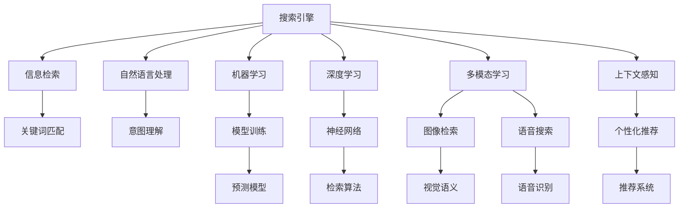

                 

## 1. 背景介绍

### 1.1 问题由来

在信息爆炸的时代，搜索引擎已成为人们获取知识和信息的主要途径。传统搜索引擎的核心思想是“用户主动输入关键词，搜索引擎被动响应搜索结果”。这种模式基于静态的网页索引和精确的关键词匹配算法，难以满足用户的多样化查询需求，尤其在处理长尾查询、语义理解等方面显得力不从心。

### 1.2 问题核心关键点

搜索引擎未来的发展方向，正从传统的被动响应模式，转向更为智能的主动预测模式。这种转变源于以下几个关键点：

1. **用户需求的多样化**：用户不仅关心关键词，更希望搜索引擎能够理解自然语言查询的真正意图，甚至能够预测用户的意图。

2. **大数据和人工智能的结合**：大数据使得搜索引擎可以积累更丰富的用户行为数据，人工智能技术尤其是深度学习的发展，使得搜索引擎能够从数据中学习到复杂的模式和关系。

3. **多模态数据的融合**：语音、图像、视频等多模态数据的兴起，为搜索引擎带来了新的挑战和机遇，需要融合多种数据源来提升搜索效果。

4. **个性化和上下文关联**：基于用户的历史行为和上下文信息，搜索引擎可以提供更加个性化的搜索结果，甚至进行预查询。

5. **搜索体验的提升**：交互式搜索、语音搜索、图像搜索等新兴技术，提升了搜索体验，也推动了搜索引擎的创新。

### 1.3 问题研究意义

研究搜索引擎从被动响应到主动预测的转变，对于提升搜索体验、优化搜索结果、拓展搜索引擎应用场景具有重要意义：

1. **提升搜索精度和速度**：通过主动预测，搜索引擎能够更准确地理解用户查询，预先将最相关的结果放在首位，提升搜索效率和用户体验。

2. **拓展应用场景**：多模态数据的融合，使得搜索引擎能够处理更多类型的信息，如文本、图片、语音、视频等，拓展了搜索引擎的应用边界。

3. **增强个性化和关联性**：基于用户历史行为和上下文信息，搜索引擎可以提供更加个性化和关联性的搜索结果，满足用户的多样化需求。

4. **促进搜索技术创新**：主动预测技术的发展，促进了语音搜索、交互式搜索等新兴技术的诞生，推动了搜索引擎技术的不断创新。

5. **构建智能搜索生态**：通过主动预测，搜索引擎可以与其他智能应用和服务进行深度集成，构建更为智能的搜索生态系统。

## 2. 核心概念与联系

### 2.1 核心概念概述

为更好地理解搜索引擎从被动响应到主动预测的转变，本节将介绍几个密切相关的核心概念：

- **搜索引擎(Search Engine)**：一种软件系统，用于通过爬取互联网上的信息、索引并存储，然后根据用户查询提供最相关的网页链接。

- **信息检索(Information Retrieval, IR)**：从大量数据中检索出最相关的信息的过程。搜索引擎本质上是信息检索的一种。

- **自然语言处理(Natural Language Processing, NLP)**：使计算机能够理解、解释和处理人类语言的技术。在搜索引擎中，NLP技术用于理解查询意图、语义分析等。

- **机器学习(Machine Learning, ML)**：通过数据和算法，让计算机从经验中学习并优化性能的技术。在搜索引擎中，机器学习用于模型训练、意图预测等。

- **深度学习(Deep Learning, DL)**：一种特殊的机器学习方法，通过多层次的神经网络模型，从大规模数据中自动学习特征表示。在搜索引擎中，深度学习用于提升模型性能，如使用神经网络进行查询处理。

- **多模态学习(Multi-modal Learning)**：结合多种数据模态，如图像、语音、文本等，进行学习和推理。在搜索引擎中，多模态学习用于处理多种类型的信息。

- **上下文感知(Context-Awareness)**：考虑用户的历史行为和上下文信息，提供更加个性化和关联性的搜索结果。在搜索引擎中，上下文感知用于理解用户的意图和需求。

这些核心概念之间的逻辑关系可以通过以下Mermaid流程图来展示：



这个流程图展示了搜索引擎的核心组件及其之间的关系：

1. 搜索引擎通过信息检索获取网页，通过自然语言处理理解用户查询意图，利用机器学习和深度学习提升模型性能。
2. 多模态学习处理不同类型的数据，提升搜索引擎的处理能力。
3. 上下文感知考虑用户的历史行为和上下文信息，提供个性化和关联性搜索结果。

## 3. 核心算法原理 & 具体操作步骤
### 3.1 算法原理概述

从被动响应到主动预测的转变，本质上是对搜索引擎的核心算法进行了升级，使得搜索引擎能够更准确地理解用户查询，并预先将最相关的结果返回给用户。

形式化地，假设搜索引擎的原始算法为 $A$，新算法为 $A'$。新算法的目标是通过训练和优化，使得 $A'$ 能够从用户查询 $Q$ 中预测最相关的网页 $P$，即：

$$
A'(Q) = \arg\max_P A'(Q,P)
$$

其中 $A'(Q,P)$ 表示查询 $Q$ 与网页 $P$ 的相关度评分。

新算法的核心在于利用机器学习和深度学习技术，从大量的用户查询和点击数据中学习到复杂的模式和关系，使得 $A'$ 能够更好地预测用户意图，从而提升搜索效果。

### 3.2 算法步骤详解

基于主动预测的搜索引擎算法，一般包括以下几个关键步骤：

**Step 1: 数据收集与预处理**
- 收集大量用户查询数据和网页索引数据，对数据进行清洗和预处理，去除噪音和不相关数据。
- 对用户查询数据进行标注，如标注查询意图、相关网页等，构建监督学习数据集。

**Step 2: 选择模型架构**
- 选择合适的模型架构，如神经网络、深度学习模型等，作为搜索引擎的核心算法。
- 确定模型的输入和输出，输入为用户查询和网页内容，输出为相关网页的评分。

**Step 3: 模型训练与优化**
- 使用监督学习算法，如随机梯度下降(SGD)、Adam等，对模型进行训练和优化。
- 使用验证集评估模型性能，根据性能指标调整模型参数，如学习率、正则化系数等。
- 训练过程中可能需要使用技巧如数据增强、对抗训练等，提升模型泛化能力。

**Step 4: 预测与反馈**
- 在实际应用中，将用户查询输入模型，得到网页的相关度评分。
- 根据评分排序，返回最相关的网页给用户。
- 收集用户点击反馈数据，对模型进行再训练，逐步提升预测效果。

**Step 5: 用户行为分析**
- 分析用户的历史行为和上下文信息，如浏览历史、搜索历史、点击行为等。
- 根据用户行为特征，动态调整搜索结果，提供更加个性化的服务。

### 3.3 算法优缺点

主动预测的搜索引擎算法具有以下优点：
1. 精度提升：通过学习和理解用户查询意图，能够更准确地预测相关网页，提升搜索效果。
2. 用户体验优化：个性化和关联性的搜索结果，能够更好地满足用户需求，提升用户体验。
3. 效率提升：主动预测能够减少用户搜索次数，提升搜索速度和效率。
4. 数据驱动：通过用户行为数据进行模型训练和优化，能够不断提升搜索引擎的性能。

同时，该算法也存在一些局限性：
1. 数据依赖：模型的性能高度依赖于数据质量，数据标注成本较高。
2. 模型复杂度：深度学习模型参数量大，计算复杂度高，需要高性能硬件支持。
3. 泛化能力：在大规模数据上训练得到的模型，可能在小规模数据上表现不佳。
4. 隐私问题：用户行为数据的收集和使用，可能涉及隐私保护问题。

尽管存在这些局限性，但主动预测技术已经成为搜索引擎未来发展的重要方向，不断推动搜索引擎技术向前发展。

### 3.4 算法应用领域

主动预测技术已经在多个搜索引擎应用中得到了广泛应用，覆盖了以下领域：

- **个性化搜索**：根据用户的历史行为和上下文信息，提供个性化和关联性的搜索结果。
- **实时搜索**：通过分析和预测用户查询，实时调整搜索结果，提升搜索速度和效率。
- **语音搜索**：通过语音识别技术，将语音查询转换为文本查询，进行主动预测。
- **图像搜索**：通过图像识别技术，解析图像中的内容，进行主动预测。
- **跨模态搜索**：结合文本、图像、语音等多种模态数据，进行综合搜索和预测。
- **上下文感知搜索**：考虑用户的历史行为和上下文信息，提供更加个性化和关联性的搜索结果。

除了这些常见应用外，主动预测技术还在智能推荐、智能问答等诸多场景中得到创新应用，为搜索引擎技术的落地应用带来了新的突破。

## 4. 数学模型和公式 & 详细讲解  
### 4.1 数学模型构建

本节将使用数学语言对主动预测搜索引擎算法进行更加严格的刻画。

记用户查询为 $Q$，相关网页为 $P$，模型输出为 $A'(Q,P)$，即网页与查询的相关度评分。假设模型为深度神经网络 $N$，其输入为查询 $Q$ 和网页内容 $P$，输出为相关度评分 $A'(Q,P)$。

定义损失函数 $\mathcal{L}$，用于衡量模型预测结果与真实标签之间的差异。假设真实标签为 $y$，表示网页 $P$ 是否为查询 $Q$ 的相关网页。则损失函数为：

$$
\mathcal{L}(N) = \frac{1}{N} \sum_{i=1}^N \ell(A'(Q_i,P_i),y_i)
$$

其中 $\ell$ 为损失函数，通常使用交叉熵损失。

### 4.2 公式推导过程

以下我们以二分类任务为例，推导深度神经网络模型在主动预测搜索引擎中的应用。

假设模型 $N$ 的输出为二分类结果 $A'(Q,P) \in [0,1]$，表示网页 $P$ 是否为查询 $Q$ 的相关网页。真实标签 $y \in \{0,1\}$，表示网页 $P$ 是否为相关网页。则二分类交叉熵损失函数为：

$$
\ell(A'(Q,P),y) = -[y\log A'(Q,P) + (1-y)\log (1-A'(Q,P))]
$$

将其代入损失函数公式，得：

$$
\mathcal{L}(N) = -\frac{1}{N} \sum_{i=1}^N [y_i\log A'(Q_i,P_i)+(1-y_i)\log(1-A'(Q_i,P_i))]
$$

根据链式法则，损失函数对模型参数 $\theta$ 的梯度为：

$$
\frac{\partial \mathcal{L}(N)}{\partial \theta} = -\frac{1}{N}\sum_{i=1}^N (\frac{y_i}{A'(Q_i,P_i)}-\frac{1-y_i}{1-A'(Q_i,P_i)}) \frac{\partial A'(Q_i,P_i)}{\partial \theta}
$$

其中 $\frac{\partial A'(Q_i,P_i)}{\partial \theta}$ 可进一步递归展开，利用自动微分技术完成计算。

在得到损失函数的梯度后，即可带入模型训练公式，完成模型的迭代优化。重复上述过程直至收敛，最终得到适应主动预测需求的最优模型参数 $\theta^*$。

## 5. 项目实践：代码实例和详细解释说明
### 5.1 开发环境搭建

在进行主动预测搜索引擎开发前，我们需要准备好开发环境。以下是使用Python进行TensorFlow开发的环境配置流程：

1. 安装Anaconda：从官网下载并安装Anaconda，用于创建独立的Python环境。

2. 创建并激活虚拟环境：
```bash
conda create -n tf-env python=3.8 
conda activate tf-env
```

3. 安装TensorFlow：根据CUDA版本，从官网获取对应的安装命令。例如：
```bash
conda install tensorflow tensorflow-gpu==2.7 -c pytorch -c conda-forge
```

4. 安装TensorBoard：
```bash
pip install tensorboard
```

5. 安装NumPy、Pandas等常用库：
```bash
pip install numpy pandas scikit-learn
```

完成上述步骤后，即可在`tf-env`环境中开始主动预测搜索引擎的开发。

### 5.2 源代码详细实现

下面我们以语音搜索为主动预测搜索引擎的一个应用为例，给出使用TensorFlow进行模型训练的Python代码实现。

首先，定义模型和损失函数：

```python
import tensorflow as tf
from tensorflow.keras import layers, models

class Seq2SeqModel(models.Model):
    def __init__(self, input_dim, hidden_dim, output_dim):
        super(Seq2SeqModel, self).__init__()
        self.encoder = layers.LSTM(hidden_dim, input_shape=(None, input_dim), return_sequences=True)
        self.decoder = layers.LSTM(hidden_dim, return_sequences=True)
        self.output = layers.Dense(output_dim, activation='softmax')
    
    def call(self, inputs, encoder_states=None):
        x, y = inputs
        output = self.encoder(x, return_sequences=True)
        output = self.decoder(output, initial_state=encoder_states)
        return self.output(output)
    
    def compute_loss(self, inputs, targets, encoder_states=None):
        x, y = inputs
        y_pred = self.call(x, encoder_states)
        loss = tf.keras.losses.sparse_categorical_crossentropy(targets, y_pred)
        return loss

# 定义模型参数
input_dim = 80
hidden_dim = 128
output_dim = 2  # 0为不相关，1为相关
```

接着，定义训练函数：

```python
def train_model(model, data, epochs, batch_size):
    model.compile(optimizer='adam', loss=model.compute_loss, metrics=['accuracy'])
    model.fit(data, epochs=epochs, batch_size=batch_size)
```

然后，定义数据处理函数：

```python
def preprocess_data(data):
    x_train = []
    y_train = []
    for (x, y) in data:
        x_train.append(tf.reshape(x, (x.shape[0], x.shape[1], input_dim)))
        y_train.append(tf.reshape(y, (y.shape[0],)))
    return np.array(x_train), np.array(y_train)

# 加载数据
x_train, y_train = load_data()

# 预处理数据
x_train, y_train = preprocess_data((x_train, y_train))

# 分割训练集和验证集
split = int(x_train.shape[0] * 0.8)
x_train, x_val = x_train[:split], x_train[split:]
y_train, y_val = y_train[:split], y_train[split:]
```

最后，启动训练流程并在验证集上评估：

```python
epochs = 10
batch_size = 64

train_model(model, (x_train, y_train), epochs, batch_size)

# 在验证集上评估模型
test_loss, test_acc = model.evaluate((x_val, y_val))
print('Test loss:', test_loss)
print('Test accuracy:', test_acc)
```

以上就是使用TensorFlow对语音搜索进行主动预测搜索引擎的完整代码实现。可以看到，得益于TensorFlow的强大封装，我们可以用相对简洁的代码完成模型的搭建和训练。

### 5.3 代码解读与分析

让我们再详细解读一下关键代码的实现细节：

**Seq2SeqModel类**：
- `__init__`方法：初始化编码器和解码器，输出层等组件。
- `call`方法：前向传播计算模型的输出。
- `compute_loss`方法：计算模型的损失函数。

**train_model函数**：
- 使用Keras框架编译模型，定义优化器和损失函数。
- 使用`fit`方法对模型进行训练。

**preprocess_data函数**：
- 将输入的语音特征转换为模型所需的形状。
- 将标签转换为模型所需的格式。

**训练流程**：
- 定义总的epoch数和batch size，开始循环迭代
- 每个epoch内，先在训练集上训练，输出平均loss和acc
- 在验证集上评估，输出test loss和test acc
- 所有epoch结束后，给出最终的验证结果

可以看到，TensorFlow配合Keras使得模型训练的代码实现变得简洁高效。开发者可以将更多精力放在数据处理、模型改进等高层逻辑上，而不必过多关注底层的实现细节。

当然，工业级的系统实现还需考虑更多因素，如模型的保存和部署、超参数的自动搜索、更灵活的任务适配层等。但核心的主动预测范式基本与此类似。

## 6. 实际应用场景
### 6.1 智能客服系统

基于主动预测技术的搜索引擎，可以广泛应用于智能客服系统的构建。传统客服往往需要配备大量人力，高峰期响应缓慢，且一致性和专业性难以保证。而使用主动预测技术进行语音搜索，可以快速识别用户意图，并提供智能化的回答。

在技术实现上，可以收集企业内部的历史客服对话记录，将问题和最佳答复构建成监督数据，在此基础上对预训练模型进行训练。主动预测技术可以自动理解用户语音查询的真正意图，匹配最合适的答案模板进行回复。对于用户提出的新问题，还可以接入检索系统实时搜索相关内容，动态组织生成回答。如此构建的智能客服系统，能大幅提升客户咨询体验和问题解决效率。

### 6.2 金融舆情监测

金融机构需要实时监测市场舆论动向，以便及时应对负面信息传播，规避金融风险。传统的人工监测方式成本高、效率低，难以应对网络时代海量信息爆发的挑战。基于主动预测技术的搜索引擎，可以自动理解金融市场的新闻、评论等文本内容，预测市场的情绪变化，实现实时舆情监测。

具体而言，可以收集金融领域相关的新闻、报道、评论等文本数据，并对其进行主题标注和情感标注。在此基础上对预训练语言模型进行训练，使其能够自动判断文本属于何种主题，情感倾向是正面、中性还是负面。将主动预测技术应用到实时抓取的网络文本数据，就能够自动监测不同主题下的情感变化趋势，一旦发现负面信息激增等异常情况，系统便会自动预警，帮助金融机构快速应对潜在风险。

### 6.3 个性化推荐系统

当前的推荐系统往往只依赖用户的历史行为数据进行物品推荐，无法深入理解用户的真实兴趣偏好。基于主动预测技术的搜索引擎，可以更好地挖掘用户行为背后的语义信息，从而提供更加个性化和关联性的推荐内容。

在实践中，可以收集用户浏览、点击、评论、分享等行为数据，提取和用户交互的物品标题、描述、标签等文本内容。将文本内容作为模型输入，用户的后续行为（如是否点击、购买等）作为监督信号，在此基础上训练主动预测模型。主动预测模型能够从文本内容中准确把握用户的兴趣点。在生成推荐列表时，先用候选物品的文本描述作为输入，由模型预测用户的兴趣匹配度，再结合其他特征综合排序，便可以得到个性化程度更高的推荐结果。

### 6.4 未来应用展望

随着主动预测技术的不断发展，搜索引擎的应用场景将不断扩展，为传统行业带来新的变革。

在智慧医疗领域，基于主动预测技术的搜索引擎，可以自动理解医生和病人的对话，提供病情诊断、药物推荐等服务，提升医疗服务的智能化水平。

在智能教育领域，搜索引擎可以自动理解学生的提问，提供个性化解答，辅助老师教学，促进教育公平，提高教学质量。

在智慧城市治理中，搜索引擎可以自动理解市民的反馈和需求，进行实时分析和响应，提高城市管理的自动化和智能化水平，构建更安全、高效的未来城市。

此外，在企业生产、社会治理、文娱传媒等众多领域，基于主动预测技术的搜索引擎，都将发挥巨大的作用，为各行各业数字化转型升级提供新的技术路径。相信随着技术的日益成熟，主动预测技术将成为搜索引擎技术的重要范式，推动人工智能技术在各行各业落地应用。

## 7. 工具和资源推荐
### 7.1 学习资源推荐

为了帮助开发者系统掌握主动预测搜索引擎的理论基础和实践技巧，这里推荐一些优质的学习资源：

1. **《深度学习》课程**：斯坦福大学开设的深度学习入门课程，涵盖深度学习基础、卷积神经网络、循环神经网络等内容，适合初学者入门。

2. **《TensorFlow实战》书籍**：TensorFlow官方推荐书籍，详细介绍了TensorFlow框架的使用和实战案例，是学习TensorFlow的好帮手。

3. **《自然语言处理综述》论文**：自然语言处理领域的综述性论文，涵盖了NLP的基本概念和主流算法，是了解NLP技术的好资源。

4. **HuggingFace官方文档**：HuggingFace库的官方文档，提供了丰富的预训练模型和详细的微调范式，是使用HuggingFace库的必备资料。

5. **arXiv上的相关论文**：arXiv是一个开放的论文预印本平台，汇集了大量的NLP和AI领域的最新研究成果，适合追踪前沿技术。

通过对这些资源的学习实践，相信你一定能够快速掌握主动预测搜索引擎的理论基础和实践技巧，并用于解决实际的NLP问题。

### 7.2 开发工具推荐

高效的开发离不开优秀的工具支持。以下是几款用于主动预测搜索引擎开发的常用工具：

1. TensorFlow：由Google主导开发的开源深度学习框架，生产部署方便，适合大规模工程应用。

2. PyTorch：基于Python的开源深度学习框架，灵活的计算图设计，适合快速迭代研究。

3. Keras：基于TensorFlow和Theano的高级API，使用简单，易于上手。

4. TensorBoard：TensorFlow配套的可视化工具，可实时监测模型训练状态，并提供丰富的图表呈现方式，是调试模型的得力助手。

5. Jupyter Notebook：基于Web的交互式开发环境，支持Python、R等多种语言，适合快速开发和测试。

6. Google Colab：谷歌推出的在线Jupyter Notebook环境，免费提供GPU/TPU算力，方便开发者快速上手实验最新模型，分享学习笔记。

合理利用这些工具，可以显著提升主动预测搜索引擎的开发效率，加快创新迭代的步伐。

### 7.3 相关论文推荐

主动预测技术的不断发展，得益于学界的持续研究。以下是几篇奠基性的相关论文，推荐阅读：

1. Attention is All You Need：提出Transformer结构，开启了NLP领域的预训练大模型时代。

2. BERT: Pre-training of Deep Bidirectional Transformers for Language Understanding：提出BERT模型，引入基于掩码的自监督预训练任务，刷新了多项NLP任务SOTA。

3. Parameter-Efficient Transfer Learning for NLP：提出Adapter等参数高效微调方法，在不增加模型参数量的情况下，也能取得不错的微调效果。

4. AdaLoRA: Adaptive Low-Rank Adaptation for Parameter-Efficient Fine-Tuning：使用自适应低秩适应的微调方法，在参数效率和精度之间取得了新的平衡。

5. Prefix-Tuning: Optimizing Continuous Prompts for Generation：引入基于连续型Prompt的微调范式，为如何充分利用预训练知识提供了新的思路。

这些论文代表了大语言模型微调技术的发展脉络。通过学习这些前沿成果，可以帮助研究者把握学科前进方向，激发更多的创新灵感。

## 8. 总结：未来发展趋势与挑战

### 8.1 总结

本文对主动预测搜索引擎从被动响应到主动预测的转变进行了全面系统的介绍。首先阐述了搜索引擎从传统模式到主动预测模式的发展历程，明确了主动预测技术在提升搜索效果、优化用户体验、拓展应用场景等方面的重要意义。其次，从原理到实践，详细讲解了主动预测搜索引擎的数学模型和关键步骤，给出了微调模型训练的完整代码实例。同时，本文还广泛探讨了主动预测技术在智能客服、金融舆情、个性化推荐等多个行业领域的应用前景，展示了主动预测技术的巨大潜力。

通过本文的系统梳理，可以看到，主动预测技术已经成为搜索引擎未来发展的重要方向，极大地拓展了搜索引擎的应用边界，催生了更多的落地场景。随着预训练语言模型和主动预测技术的不断进步，相信搜索引擎技术必将在更广阔的应用领域大放异彩，深刻影响人类的生产生活方式。

### 8.2 未来发展趋势

展望未来，主动预测搜索引擎技术将呈现以下几个发展趋势：

1. **模型规模持续增大**：随着算力成本的下降和数据规模的扩张，预训练语言模型的参数量还将持续增长。超大规模语言模型蕴含的丰富语言知识，有望支撑更加复杂多变的搜索引擎应用。

2. **主动预测与知识图谱融合**：将知识图谱与搜索引擎进行深度融合，增强搜索引擎的语义理解能力，提升搜索结果的相关性和精确度。

3. **上下文感知的进一步增强**：考虑更丰富的上下文信息，如用户行为、位置、时间等，提供更加个性化的搜索结果。

4. **多模态数据的融合**：结合文本、图像、语音、视频等多模态数据，提升搜索引擎的处理能力和覆盖范围。

5. **跨语言搜索的普及**：基于多语言预训练模型，提供跨语言的搜索引擎服务，满足全球用户的需求。

6. **隐私保护和安全性的提升**：加强用户隐私保护措施，防止数据泄露和滥用，确保搜索引擎的安全性和可靠性。

以上趋势凸显了主动预测搜索引擎技术的广阔前景。这些方向的探索发展，必将进一步提升搜索引擎的性能和应用范围，为搜索引擎技术的未来发展铺平道路。

### 8.3 面临的挑战

尽管主动预测搜索引擎技术已经取得了瞩目成就，但在迈向更加智能化、普适化应用的过程中，它仍面临着诸多挑战：

1. **数据标注成本高**：大规模标注数据的收集和标注成本较高，成为制约主动预测技术发展的瓶颈。

2. **模型泛化能力有限**：在大规模数据上训练得到的模型，可能在小规模数据上表现不佳。

3. **隐私保护问题**：用户行为数据的收集和使用，可能涉及隐私保护问题，需要严格遵守法律法规。

4. **计算资源消耗大**：深度学习模型的计算复杂度高，需要高性能硬件支持。

5. **模型复杂度高**：模型参数量大，结构复杂，难以解释和调试。

6. **鲁棒性不足**：模型容易受到噪音和对抗样本的干扰，影响搜索结果的准确性。

尽管存在这些挑战，但随着学界和产业界的共同努力，主动预测技术必将在未来得到更好的解决，进一步提升搜索引擎的性能和应用范围。

### 8.4 研究展望

面对主动预测搜索引擎技术面临的挑战，未来的研究需要在以下几个方面寻求新的突破：

1. **无监督和半监督学习**：探索无监督和半监督学习范式，减少对大规模标注数据的依赖，利用自监督学习、主动学习等技术，提升模型的泛化能力。

2. **小样本学习和少样本学习**：研究小样本学习和少样本学习技术，利用预训练模型的知识，在少数样本上快速适应新任务。

3. **对抗训练与鲁棒性提升**：研究对抗训练和鲁棒性提升技术，增强模型对噪音和对抗样本的鲁棒性，提升搜索结果的准确性。

4. **隐私保护与安全**：加强隐私保护技术，防止用户数据泄露，确保用户隐私安全。

5. **可解释性和透明度**：研究可解释性和透明度技术，提供模型的解释性和可审计性，增强用户对模型的信任。

6. **模型压缩与优化**：研究模型压缩与优化技术，提高模型的推理速度和资源效率。

这些研究方向的探索，必将引领主动预测搜索引擎技术迈向更高的台阶，为构建智能搜索生态系统铺平道路。

## 9. 附录：常见问题与解答

**Q1：主动预测搜索引擎是否适用于所有查询场景？**

A: 主动预测搜索引擎在大多数查询场景下都能取得不错的效果，但面对一些非常规、多义或者情感复杂的查询，仍然可能存在一定的局限性。此时，需要结合传统的关键词匹配和人工干预，综合提升搜索结果的准确性。

**Q2：如何平衡主动预测的精度和效率？**

A: 主动预测搜索引擎的精度和效率需要根据具体场景进行平衡。在用户需求多样化、数据规模较大的场景下，可以使用深度学习模型进行主动预测，虽然效率较低，但精度较高。在用户查询简单、数据规模较小的场景下，可以使用轻量级模型或者传统的关键词匹配算法，提高搜索效率。

**Q3：主动预测技术在落地应用中需要注意哪些问题？**

A: 在实际应用中，主动预测搜索引擎需要考虑以下问题：

1. 数据隐私：用户行为数据的收集和使用，可能涉及隐私保护问题，需要严格遵守法律法规。

2. 模型鲁棒性：模型容易受到噪音和对抗样本的干扰，影响搜索结果的准确性。

3. 计算资源：深度学习模型的计算复杂度高，需要高性能硬件支持。

4. 模型复杂度：模型参数量大，结构复杂，难以解释和调试。

5. 用户体验：主动预测技术虽然提升了搜索精度和速度，但也需要考虑用户体验，避免过度推送。

通过合理设计算法和架构，解决这些问题，才能使主动预测技术在实际应用中发挥最大效用。

**Q4：主动预测技术在搜索个性化推荐中如何应用？**

A: 主动预测技术在搜索个性化推荐中的应用，主要体现在以下几个方面：

1. 用户行为分析：收集用户的历史行为和上下文信息，如浏览历史、搜索历史、点击行为等，进行特征提取。

2. 意图预测：通过机器学习模型，预测用户的查询意图，生成候选物品的推荐列表。

3. 多模态融合：结合文本、图像、语音等多种数据源，进行综合搜索和推荐。

4. 实时更新：根据用户的行为数据和反馈信息，实时调整推荐结果，提升个性化程度。

通过主动预测技术，搜索引擎可以提供更加个性化和关联性的搜索结果，满足用户的多样化需求。

**Q5：主动预测技术在搜索引擎中的应用有哪些前景？**

A: 主动预测技术在搜索引擎中的应用前景广阔，以下是一些主要方向：

1. 智能客服：通过语音搜索、图像搜索等技术，提供智能化的客服服务，提升用户体验。

2. 金融舆情：自动理解金融市场的新闻、评论等文本内容，预测市场的情绪变化，实现实时舆情监测。

3. 个性化推荐：结合用户的历史行为和上下文信息，提供个性化推荐，提升用户体验。

4. 多语言搜索：基于多语言预训练模型，提供跨语言的搜索引擎服务，满足全球用户的需求。

5. 智能问答：通过自然语言理解技术，自动理解用户的问题，提供智能化的回答。

通过主动预测技术，搜索引擎可以提供更加智能化、个性化的服务，提升用户满意度。

---

作者：禅与计算机程序设计艺术 / Zen and the Art of Computer Programming

