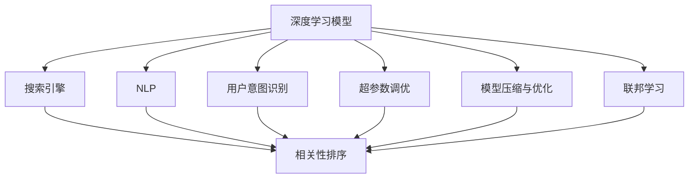

                 

## 1. 背景介绍

随着互联网的飞速发展和搜索引擎技术的不断进步，深度学习在搜索引擎领域的应用变得越来越广泛。深度学习模型不仅能够更好地理解和处理海量数据，还能够提升搜索结果的相关性和排名算法。搜索引擎的深度学习算法优化成为了提升用户体验和搜索结果质量的重要手段。

## 2. 核心概念与联系

### 2.1 核心概念概述

为更好地理解搜索引擎的深度学习算法优化方法，本节将介绍几个密切相关的核心概念：

- **深度学习模型**：如神经网络、卷积神经网络（CNN）、循环神经网络（RNN）、长短期记忆网络（LSTM）等，这些模型能够自动学习和提取输入数据中的复杂特征。

- **搜索引擎**：如Google、Bing、Yahoo等，这些平台利用算法和数据处理技术，提供搜索服务的网站或应用。

- **相关性排序**：搜索引擎的核心任务之一，即根据用户的查询意图和输入文本，从大量网页中筛选出最相关的结果，并按照相关性进行排序。

- **自然语言处理（NLP）**：搜索引擎算法中经常使用的技术，用于理解和处理文本数据，如分词、命名实体识别、情感分析、句法分析等。

- **用户意图识别**：根据用户的查询输入，识别出用户的意图，并据此优化搜索结果的相关性和排序。

- **超参数调优**：在模型训练过程中，调整模型的超参数（如学习率、批次大小、迭代次数等）以优化模型性能。

- **模型压缩与优化**：为提高模型的推理速度和减少计算资源消耗，对模型进行压缩和优化。

- **联邦学习**：一种分布式机器学习方法，能够在用户隐私得到保护的同时，进行模型训练和优化。

这些核心概念之间的逻辑关系可以通过以下Mermaid流程图来展示：



这个流程图展示了深度学习模型、搜索引擎、相关性排序等核心概念之间的联系，及其在搜索引擎算法优化中的作用。

## 3. 核心算法原理 & 具体操作步骤

### 3.1 算法原理概述

深度学习算法在搜索引擎中的应用，主要集中在以下几个方面：

- **文本表示**：将用户查询和搜索结果转换为计算机可以理解和处理的向量表示。

- **模型训练**：通过标注数据训练模型，使得模型能够更好地理解查询意图和搜索结果的相关性。

- **推荐系统**：根据用户的历史行为和偏好，利用深度学习模型推荐最相关的搜索结果。

- **个性化排序**：根据用户的历史数据和实时行为，调整排序算法，提供更加个性化的搜索结果。

- **实时更新**：通过在线学习，不断更新模型，以适应新的数据和用户行为。

### 3.2 算法步骤详解

深度学习算法在搜索引擎中的应用，通常分为以下几个步骤：

**Step 1: 数据预处理**
- 对用户查询和搜索结果进行预处理，如分词、去除停用词、词性标注等。
- 将处理后的数据转换为向量表示，如词袋模型、TF-IDF、Word2Vec、BERT等。

**Step 2: 模型训练**
- 选择合适的深度学习模型，如CNN、RNN、LSTM、Transformer等。
- 使用标注数据训练模型，通过优化算法（如梯度下降、Adam等）更新模型参数。
- 使用交叉验证等技术进行模型评估和调优。

**Step 3: 模型部署**
- 将训练好的模型部署到搜索引擎的服务器上。
- 使用推理框架（如TensorFlow、PyTorch）进行实时推理。

**Step 4: 实时更新**
- 根据用户反馈和行为数据，实时更新模型参数，提升模型性能。
- 使用增量学习等技术，减少实时更新的计算开销。

### 3.3 算法优缺点

深度学习算法在搜索引擎中的应用，具有以下优点：

- **高性能**：深度学习模型能够处理复杂的非线性关系，提升搜索结果的相关性和排序精度。

- **自适应性**：模型能够自动学习新的特征和模式，适应新的查询和数据。

- **可扩展性**：深度学习模型可以通过增加层数和节点数，提高模型的表达能力。

- **个性化推荐**：深度学习模型能够根据用户的历史行为和偏好，提供个性化的搜索结果。

然而，深度学习算法在搜索引擎中也存在一些缺点：

- **计算资源需求高**：深度学习模型通常需要大量的计算资源和存储空间。

- **模型解释性差**：深度学习模型往往是"黑盒"系统，难以解释其内部决策逻辑。

- **对抗样本敏感**：深度学习模型对输入数据的微小扰动敏感，容易被恶意攻击。

- **数据标注成本高**：深度学习模型通常需要大量的标注数据进行训练，标注成本较高。

### 3.4 算法应用领域

深度学习算法在搜索引擎中的应用，已经涵盖了以下几个领域：

- **文本分类**：将网页进行分类，如新闻、博客、评论等。

- **关键词抽取**：从文本中抽取关键词，用于改进搜索引擎的召回率。

- **问答系统**：根据用户提出的问题，从搜索结果中筛选出最佳答案。

- **语义搜索**：理解自然语言查询的语义，提供更精准的搜索结果。

- **广告推荐**：根据用户的浏览和点击行为，推荐相关广告。

- **垃圾过滤**：识别和过滤掉低质量或无关的网页。

- **图像识别**：从图像中提取特征，用于改进搜索结果的展示效果。

以上这些应用领域展示了深度学习算法在搜索引擎中的广泛应用，极大地提升了搜索引擎的性能和用户体验。

## 4. 数学模型和公式 & 详细讲解

### 4.1 数学模型构建

深度学习模型在搜索引擎中的应用，通常基于以下数学模型构建：

- **词向量表示**：将单词转换为高维向量表示，如Word2Vec、GloVe等。

- **卷积神经网络（CNN）**：用于处理文本和图像数据，提取局部特征。

- **循环神经网络（RNN）**：用于处理序列数据，如文本和时间序列数据。

- **长短期记忆网络（LSTM）**：一种特殊的RNN，用于处理长序列数据，避免梯度消失问题。

- **Transformer**：一种自注意力机制的神经网络，用于处理序列数据，性能优于RNN和LSTM。

### 4.2 公式推导过程

以Transformer模型为例，推导其自注意力机制的公式。

Transformer模型中的自注意力机制包含三个子层：查询（Q）、键（K）、值（V）。对于输入序列 $x$，其向量表示为 $x \in \mathbb{R}^{n \times d}$，其中 $n$ 是序列长度，$d$ 是向量维度。

自注意力机制的公式如下：

$$
\text{Attention}(Q, K, V) = \text{softmax}(\frac{QK^T}{\sqrt{d}})V
$$

其中 $Q$、$K$、$V$ 分别表示查询向量、键向量和值向量，$QK^T$ 表示查询向量和键向量的点积。$\text{softmax}(\frac{QK^T}{\sqrt{d}})$ 表示将点积矩阵进行softmax归一化，得到注意力权重矩阵。

在实际应用中，还需要对自注意力机制进行缩放和位置编码，以适应长序列数据和位置信息。

### 4.3 案例分析与讲解

以谷歌的BERT模型为例，分析其应用于搜索引擎中的效果。

BERT模型在搜索引擎中的应用，主要通过以下步骤实现：

1. 使用预训练的BERT模型对用户查询和搜索结果进行编码，得到向量表示。

2. 利用Transformer的自注意力机制，对查询向量进行加权求和，得到综合表示。

3. 使用全连接层和softmax函数，计算查询向量和搜索结果向量之间的相似度。

4. 根据相似度排序，得到搜索结果的相关性排名。

通过这种方式，BERT模型可以更好地理解和处理自然语言查询，提升搜索结果的相关性和排序精度。

## 5. 项目实践：代码实例和详细解释说明

### 5.1 开发环境搭建

在进行深度学习算法优化实践前，我们需要准备好开发环境。以下是使用Python进行TensorFlow开发的环境配置流程：

1. 安装Anaconda：从官网下载并安装Anaconda，用于创建独立的Python环境。

2. 创建并激活虚拟环境：
```bash
conda create -n tf-env python=3.8
conda activate tf-env
```

3. 安装TensorFlow：根据CUDA版本，从官网获取对应的安装命令。例如：
```bash
conda install tensorflow=2.8.0=cudatoolkit=11.1
```

4. 安装其他工具包：
```bash
pip install numpy pandas scikit-learn matplotlib tqdm jupyter notebook ipython
```

完成上述步骤后，即可在`tf-env`环境中开始深度学习算法优化的实践。

### 5.2 源代码详细实现

这里我们以文本分类任务为例，给出使用TensorFlow对BERT模型进行优化训练的PyTorch代码实现。

首先，定义文本分类任务的数据处理函数：

```python
import tensorflow as tf
from tensorflow.keras.preprocessing.text import Tokenizer
from tensorflow.keras.preprocessing.sequence import pad_sequences
from tensorflow.keras.layers import Embedding, Dense, LSTM, Bidirectional, GlobalAveragePooling1D
from tensorflow.keras.models import Sequential

# 定义文本分类任务的数据处理函数
def text_preprocessing(texts, labels):
    # 文本分词
    tokenizer = Tokenizer()
    tokenizer.fit_on_texts(texts)
    sequences = tokenizer.texts_to_sequences(texts)
    
    # 填充序列
    max_len = max([len(x) for x in sequences])
    sequences = pad_sequences(sequences, maxlen=max_len, padding='post')
    
    # 将标签转换为独热编码
    labels = tf.keras.utils.to_categorical(labels)
    
    return sequences, labels
```

然后，定义模型和优化器：

```python
# 定义BERT模型的输入和输出维度
vocab_size = len(tokenizer.word_index) + 1
embedding_dim = 128
hidden_units = 64
dropout_rate = 0.5

# 定义BERT模型的层
model = Sequential()
model.add(Embedding(vocab_size, embedding_dim, input_length=max_len))
model.add(Bidirectional(LSTM(hidden_units, dropout=dropout_rate, return_sequences=True)))
model.add(GlobalAveragePooling1D())
model.add(Dense(2, activation='softmax'))

# 定义优化器
optimizer = tf.keras.optimizers.Adam(learning_rate=0.001)
```

接着，定义训练和评估函数：

```python
# 定义训练和评估函数
def train_epoch(model, dataset, batch_size, optimizer):
    model.compile(loss='categorical_crossentropy', optimizer=optimizer, metrics=['accuracy'])
    model.fit(dataset, batch_size=batch_size, epochs=10, validation_split=0.2)
    
def evaluate(model, dataset, batch_size):
    model.evaluate(dataset, batch_size=batch_size)
```

最后，启动训练流程并在测试集上评估：

```python
# 定义训练集和测试集
train_texts = ...
train_labels = ...
test_texts = ...
test_labels = ...

# 进行文本预处理
train_sequences, train_labels = text_preprocessing(train_texts, train_labels)
test_sequences, test_labels = text_preprocessing(test_texts, test_labels)

# 训练模型
train_epoch(model, train_sequences, train_labels, optimizer)

# 评估模型
evaluate(model, test_sequences, test_labels)
```

以上就是使用TensorFlow对BERT模型进行文本分类任务优化训练的完整代码实现。可以看到，得益于TensorFlow的强大封装，我们可以用相对简洁的代码完成BERT模型的训练和评估。

### 5.3 代码解读与分析

让我们再详细解读一下关键代码的实现细节：

**text_preprocessing函数**：
- 该函数实现了文本分词、填充序列和标签编码等功能。
- 首先使用`Tokenizer`对文本进行分词，并获取单词索引表。
- 然后对分词后的序列进行填充，确保所有序列长度一致。
- 最后使用`to_categorical`将标签转换为独热编码，方便模型训练。

**模型定义**：
- 首先定义模型的输入和输出维度，如词汇表大小、嵌入维度、隐藏单元数量、Dropout率等。
- 然后按照顺序添加BERT模型的各层，包括嵌入层、双向LSTM层、全局平均池化层和全连接层。
- 最后添加优化器，进行模型编译。

**训练和评估函数**：
- 使用`compile`方法定义模型的损失函数、优化器和评估指标。
- 使用`fit`方法进行模型训练，并指定批大小、迭代次数和验证集比例。
- 使用`evaluate`方法评估模型的性能，输出损失和准确率。

**训练流程**：
- 首先定义训练集和测试集。
- 对文本进行预处理，得到填充后的序列和标签。
- 调用训练函数进行模型训练，并输出训练结果。
- 调用评估函数在测试集上评估模型性能。

可以看到，TensorFlow使得深度学习算法优化任务的代码实现变得简洁高效。开发者可以将更多精力放在数据处理、模型改进等高层逻辑上，而不必过多关注底层的实现细节。

当然，工业级的系统实现还需考虑更多因素，如模型的保存和部署、超参数的自动搜索、更灵活的任务适配层等。但核心的优化范式基本与此类似。

## 6. 实际应用场景

### 6.1 智能客服系统

深度学习算法在智能客服系统中的应用，可以显著提升客服效率和客户满意度。传统客服系统需要配备大量人力，高峰期响应缓慢，且无法提供全天候服务。而使用深度学习算法优化的智能客服系统，能够24小时不间断服务，快速响应客户咨询，并根据客户的历史行为和偏好，提供个性化推荐和问题解答。

在技术实现上，可以收集客户的历史咨询记录，使用深度学习模型进行分析和建模，然后通过微调优化模型，使其能够自动理解客户意图，匹配最合适的答案模板进行回复。对于客户提出的新问题，还可以接入检索系统实时搜索相关内容，动态组织生成回答。如此构建的智能客服系统，能大幅提升客户咨询体验和问题解决效率。

### 6.2 金融舆情监测

深度学习算法在金融舆情监测中的应用，可以帮助金融机构实时监测市场舆论动向，及时应对负面信息传播，规避金融风险。传统的人工监测方式成本高、效率低，难以应对网络时代海量信息爆发的挑战。而使用深度学习算法优化的文本分类和情感分析模型，能够自动判断文本属于何种主题，情感倾向是正面、中性还是负面。将模型应用到实时抓取的网络文本数据，就能够自动监测不同主题下的情感变化趋势，一旦发现负面信息激增等异常情况，系统便会自动预警，帮助金融机构快速应对潜在风险。

### 6.3 个性化推荐系统

深度学习算法在个性化推荐系统中的应用，可以显著提升推荐效果和用户满意度。当前的推荐系统往往只依赖用户的历史行为数据进行物品推荐，无法深入理解用户的真实兴趣偏好。而使用深度学习算法优化的推荐系统，能够更好地挖掘用户行为背后的语义信息，从而提供更加精准、多样的推荐内容。

在实践中，可以收集用户浏览、点击、评论、分享等行为数据，提取和用户交互的物品标题、描述、标签等文本内容。将文本内容作为模型输入，用户的后续行为（如是否点击、购买等）作为监督信号，在此基础上训练深度学习模型。优化的模型能够从文本内容中准确把握用户的兴趣点。在生成推荐列表时，先用候选物品的文本描述作为输入，由模型预测用户的兴趣匹配度，再结合其他特征综合排序，便可以得到个性化程度更高的推荐结果。

### 6.4 未来应用展望

随着深度学习算法和优化方法的不断发展，其应用范围将进一步拓展，为更多行业带来变革性影响。

在智慧医疗领域，深度学习算法优化的图像识别和自然语言处理技术，可以提升诊断和治疗的精准性，辅助医生诊疗，加速新药开发进程。

在智能教育领域，深度学习算法优化的作业批改、学情分析、知识推荐等应用，因材施教，促进教育公平，提高教学质量。

在智慧城市治理中，深度学习算法优化的城市事件监测、舆情分析、应急指挥等环节，提高城市管理的自动化和智能化水平，构建更安全、高效的未来城市。

此外，在企业生产、社会治理、文娱传媒等众多领域，深度学习算法优化的应用也将不断涌现，为经济社会发展注入新的动力。相信随着技术的日益成熟，深度学习算法优化的应用将更加广泛，为人类社会带来更多的便利和进步。

## 7. 工具和资源推荐

### 7.1 学习资源推荐

为了帮助开发者系统掌握深度学习算法优化的理论基础和实践技巧，这里推荐一些优质的学习资源：

1. **《深度学习》书籍**：由深度学习领域的知名专家撰写，全面介绍了深度学习的原理、模型和应用，是学习深度学习的经典教材。

2. **CS231n《卷积神经网络》课程**：斯坦福大学开设的深度学习课程，重点介绍了卷积神经网络的原理和应用，适合初学者和进阶者。

3. **CS224n《自然语言处理》课程**：斯坦福大学开设的深度学习课程，介绍了自然语言处理的基本概念和深度学习模型的应用，适合从事自然语言处理相关工作的开发者。

4. **DeepLearning.ai《深度学习专业》课程**：由深度学习领域的知名专家Andrew Ng授课，介绍了深度学习的应用和实践，适合有一定基础的开发者。

5. **TensorFlow官方文档**：TensorFlow的官方文档，提供了丰富的API和示例代码，适合初学者和进阶者。

6. **Kaggle平台**：Kaggle是一个数据科学和机器学习的竞赛平台，提供大量数据集和模型竞赛，适合实践和提升技能。

通过对这些资源的学习实践，相信你一定能够快速掌握深度学习算法优化的精髓，并用于解决实际的搜索引擎优化问题。

### 7.2 开发工具推荐

高效的开发离不开优秀的工具支持。以下是几款用于深度学习算法优化开发的常用工具：

1. **PyTorch**：由Facebook开发的深度学习框架，支持动态计算图，适合快速迭代研究。

2. **TensorFlow**：由Google主导开发的深度学习框架，生产部署方便，适合大规模工程应用。

3. **Jupyter Notebook**：一种交互式的Python编程环境，适合快速实验和可视化分析。

4. **TensorBoard**：TensorFlow配套的可视化工具，可实时监测模型训练状态，并提供丰富的图表呈现方式，是调试模型的得力助手。

5. **Weights & Biases**：模型训练的实验跟踪工具，可以记录和可视化模型训练过程中的各项指标，方便对比和调优。

6. **Horovod**：一种分布式深度学习框架，支持多GPU、多节点训练，适合大规模模型训练。

合理利用这些工具，可以显著提升深度学习算法优化的开发效率，加快创新迭代的步伐。

### 7.3 相关论文推荐

深度学习算法优化技术的发展源于学界的持续研究。以下是几篇奠基性的相关论文，推荐阅读：

1. **ImageNet Classification with Deep Convolutional Neural Networks**：由Alex Krizhevsky等人提出的卷积神经网络，在图像分类任务中取得了巨大成功。

2. **Google's Neural Machine Translation System: Bridging the Gap between Human and Machine Translation**：由Google提出的基于深度学习模型的机器翻译系统，大幅提升了机器翻译的质量。

3. **Attention is All You Need**：由Google提出的Transformer模型，基于自注意力机制，在自然语言处理任务中取得了优异性能。

4. **BERT: Pre-training of Deep Bidirectional Transformers for Language Understanding**：由Google提出的BERT模型，通过预训练和微调，提升了自然语言处理任务的效果。

5. **Adversarial Examples for Text Classification**：由OpenAI提出的对抗样本攻击方法，展示了深度学习模型对抗样本的脆弱性。

6. **Towards Explainable Deep Learning**：由IBM提出的可解释深度学习模型，致力于提高模型的透明性和可解释性。

这些论文代表了大深度学习算法优化的发展脉络。通过学习这些前沿成果，可以帮助研究者把握学科前进方向，激发更多的创新灵感。

## 8. 总结：未来发展趋势与挑战

### 8.1 研究成果总结

本文对深度学习算法优化的背景和原理进行了全面系统的介绍。首先阐述了深度学习算法在搜索引擎中的应用，明确了算法优化的重要性和意义。其次，从原理到实践，详细讲解了深度学习算法优化的数学模型和关键步骤，给出了搜索引擎优化的完整代码实例。同时，本文还广泛探讨了深度学习算法优化在智能客服、金融舆情、个性化推荐等多个领域的应用前景，展示了算法优化的巨大潜力。此外，本文精选了深度学习算法优化的各类学习资源，力求为读者提供全方位的技术指引。

通过本文的系统梳理，可以看到，深度学习算法优化在搜索引擎中的应用，极大地提升了搜索结果的相关性和排序精度，带来了显著的用户体验提升。未来，伴随深度学习算法和优化方法的不断演进，搜索技术必将在更多领域得到应用，为各行各业带来变革性影响。

### 8.2 未来发展趋势

展望未来，深度学习算法优化技术将呈现以下几个发展趋势：

1. **大规模模型**：随着计算资源和算法的进步，深度学习模型的规模将持续增大。超大规模模型蕴含的丰富特征，能够更好地处理复杂的数据和任务。

2. **自监督学习**：利用未标注数据进行自监督学习，减少标注成本，提高模型的泛化能力。

3. **跨模态学习**：将文本、图像、语音等多种模态数据进行融合，提升模型的综合表达能力。

4. **联邦学习**：通过分布式训练，保护用户隐私，同时提高模型的性能和泛化能力。

5. **模型压缩与优化**：开发更加高效的模型压缩和优化方法，提高模型的推理速度和计算效率。

6. **对抗样本防御**：研究对抗样本生成和防御方法，提升模型的鲁棒性和安全性。

7. **可解释性**：开发可解释性强的深度学习模型，增强模型的透明性和可信度。

以上趋势凸显了深度学习算法优化的广阔前景。这些方向的探索发展，必将进一步提升搜索引擎的性能和用户体验，为人工智能技术带来更多的应用价值。

### 8.3 面临的挑战

尽管深度学习算法优化技术已经取得了瞩目成就，但在迈向更加智能化、普适化应用的过程中，它仍面临着诸多挑战：

1. **计算资源瓶颈**：深度学习模型通常需要大量的计算资源和存储空间，如何优化资源使用，提高计算效率，仍然是一个重要问题。

2. **模型复杂度**：深度学习模型复杂度较高，难以解释其内部决策逻辑，如何提高模型的可解释性，仍然是一个重要课题。

3. **数据隐私保护**：深度学习模型通常需要大量的标注数据进行训练，如何保护用户隐私，仍然是一个重要问题。

4. **对抗样本攻击**：深度学习模型对对抗样本攻击的敏感性，仍然是一个重要问题，需要进一步研究对抗样本生成和防御方法。

5. **模型泛化能力**：深度学习模型在特定任务上的表现往往很好，但在新的数据和任务上泛化能力较弱，需要进一步研究模型的泛化能力。

6. **模型压缩与优化**：如何开发更加高效的模型压缩和优化方法，提高模型的推理速度和计算效率，仍然是一个重要问题。

7. **跨模态数据融合**：如何将文本、图像、语音等多种模态数据进行融合，提高模型的综合表达能力，仍然是一个重要问题。

8. **模型可解释性**：如何提高模型的透明性和可信度，仍然是一个重要课题。

面对这些挑战，深度学习算法优化技术需要不断地进行改进和创新，才能在未来的应用中发挥更大的作用。

### 8.4 研究展望

未来，深度学习算法优化技术需要在以下几个方面寻求新的突破：

1. **自监督学习和跨模态学习**：利用未标注数据进行自监督学习，减少标注成本，提高模型的泛化能力。同时，研究跨模态数据融合方法，提高模型的综合表达能力。

2. **联邦学习和分布式训练**：通过分布式训练，保护用户隐私，同时提高模型的性能和泛化能力。

3. **模型压缩与优化**：开发更加高效的模型压缩和优化方法，提高模型的推理速度和计算效率。

4. **对抗样本防御**：研究对抗样本生成和防御方法，提升模型的鲁棒性和安全性。

5. **模型可解释性**：开发可解释性强的深度学习模型，增强模型的透明性和可信度。

6. **模型泛化能力**：研究模型的泛化能力，提高模型在新数据和任务上的表现。

7. **计算资源优化**：优化计算资源使用，提高计算效率，降低计算成本。

这些研究方向的研究进展，将进一步提升深度学习算法优化的应用范围和性能，为人工智能技术带来更多的应用价值。

## 9. 附录：常见问题与解答

**Q1：深度学习算法优化的计算资源需求如何优化？**

A: 深度学习算法优化的计算资源需求可以通过以下几个方法进行优化：

1. **模型压缩与优化**：开发更加高效的模型压缩和优化方法，如剪枝、量化、蒸馏等，减少模型的参数和计算量。

2. **分布式训练**：使用分布式训练框架，如Horovod、TensorFlow分布式训练等，提高模型的训练效率。

3. **异构计算**：使用GPU、TPU等异构计算资源，提高计算效率。

4. **增量学习**：使用增量学习等方法，减少实时更新的计算开销。

5. **混合精度训练**：使用混合精度训练，减少计算资源的消耗。

6. **自动混合精度**：使用自动混合精度技术，动态调整训练精度，提高计算效率。

7. **模型剪枝与量化**：使用模型剪枝与量化技术，减少模型的计算量和存储空间。

8. **模型压缩**：使用模型压缩技术，如压缩算法、算法优化等，减小模型的计算量和存储空间。

通过这些方法，可以显著降低深度学习算法优化的计算资源需求，提高模型的训练和推理效率。

**Q2：深度学习算法优化的模型复杂度如何优化？**

A: 深度学习算法优化的模型复杂度可以通过以下几个方法进行优化：

1. **剪枝与量化**：使用剪枝与量化技术，减少模型的参数和计算量，提高模型的计算效率。

2. **蒸馏**：使用知识蒸馏等技术，将大模型的知识迁移到小模型上，减少模型的复杂度。

3. **自动化**：使用自动化工具，如TensorFlow Lite、TensorFlow Mobile等，将大模型转换为适合移动设备的小模型。

4. **模型压缩**：使用模型压缩技术，如Huffman编码、FPGA加速等，减少模型的计算量和存储空间。

5. **算法优化**：使用算法优化技术，如卷积算法优化、深度网络优化等，提高模型的计算效率。

6. **分布式训练**：使用分布式训练框架，如Horovod、TensorFlow分布式训练等，提高模型的训练效率。

7. **混合精度训练**：使用混合精度训练，减少计算资源的消耗。

8. **自动混合精度**：使用自动混合精度技术，动态调整训练精度，提高计算效率。

9. **模型剪枝与量化**：使用模型剪枝与量化技术，减少模型的计算量和存储空间。

通过这些方法，可以显著降低深度学习算法优化的模型复杂度，提高模型的计算效率。

**Q3：深度学习算法优化的模型泛化能力如何提升？**

A: 深度学习算法优化的模型泛化能力可以通过以下几个方法进行提升：

1. **自监督学习**：利用未标注数据进行自监督学习，减少标注成本，提高模型的泛化能力。

2. **跨模态学习**：将文本、图像、语音等多种模态数据进行融合，提升模型的综合表达能力。

3. **联邦学习**：通过分布式训练，保护用户隐私，同时提高模型的性能和泛化能力。

4. **对抗样本防御**：研究对抗样本生成和防御方法，提升模型的鲁棒性和安全性。

5. **模型可解释性**：开发可解释性强的深度学习模型，增强模型的透明性和可信度。

6. **模型泛化能力**：研究模型的泛化能力，提高模型在新数据和任务上的表现。

7. **数据增强**：使用数据增强技术，如回译、近义替换等方式扩充训练集，提高模型的泛化能力。

8. **超参数调优**：使用超参数调优技术，如网格搜索、随机搜索、贝叶斯优化等，提高模型的泛化能力。

9. **模型压缩与优化**：开发更加高效的模型压缩和优化方法，提高模型的计算效率。

通过这些方法，可以显著提升深度学习算法优化的模型泛化能力，提高模型在新数据和任务上的表现。

**Q4：深度学习算法优化的数据隐私保护如何实现？**

A: 深度学习算法优化的数据隐私保护可以通过以下几个方法实现：

1. **差分隐私**：使用差分隐私技术，在模型训练过程中加入噪声，保护用户隐私。

2. **联邦学习**：通过分布式训练，保护用户隐私，同时提高模型的性能和泛化能力。

3. **本地训练**：在客户端进行本地训练，保护用户隐私，同时提高模型的计算效率。

4. **模型蒸馏**：使用知识蒸馏等技术，将大模型的知识迁移到小模型上，保护用户隐私。

5. **安全多方计算**：使用安全多方计算技术，保护用户隐私，同时提高模型的性能和泛化能力。

6. **加密技术**：使用加密技术，保护用户隐私，同时提高模型的计算效率。

7. **数据匿名化**：使用数据匿名化技术，保护用户隐私，同时提高模型的泛化能力。

8. **差分隐私**：使用差分隐私技术，在模型训练过程中加入噪声，保护用户隐私。

9. **本地训练**：在客户端进行本地训练，保护用户隐私，同时提高模型的计算效率。

通过这些方法，可以显著保护深度学习算法优化的数据隐私，同时提高模型的性能和泛化能力。

**Q5：深度学习算法优化的可解释性如何提高？**

A: 深度学习算法优化的可解释性可以通过以下几个方法进行提高：

1. **可解释性模型**：使用可解释性强的深度学习模型，如LIME、SHAP等，提高模型的透明性和可信度。

2. **特征可视化**：使用特征可视化技术，如t-SNE、LLE等，提高模型的透明性和可信度。

3. **模型压缩**：使用模型压缩技术，如剪枝、量化等，提高模型的计算效率。

4. **模型蒸馏**：使用知识蒸馏等技术，将大模型的知识迁移到小模型上，提高模型的透明性和可信度。

5. **对抗样本生成**：使用对抗样本生成技术，提高模型的鲁棒性和安全性。

6. **自动混合精度**：使用自动混合精度技术，动态调整训练精度，提高计算效率。

7. **模型剪枝与量化**：使用模型剪枝与量化技术，减少模型的计算量和存储空间。

8. **模型压缩**：使用模型压缩技术，如Huffman编码、FPGA加速等，提高模型的计算效率。

通过这些方法，可以显著提高深度学习算法优化的可解释性，增强模型的透明性和可信度。

---

作者：禅与计算机程序设计艺术 / Zen and the Art of Computer Programming

