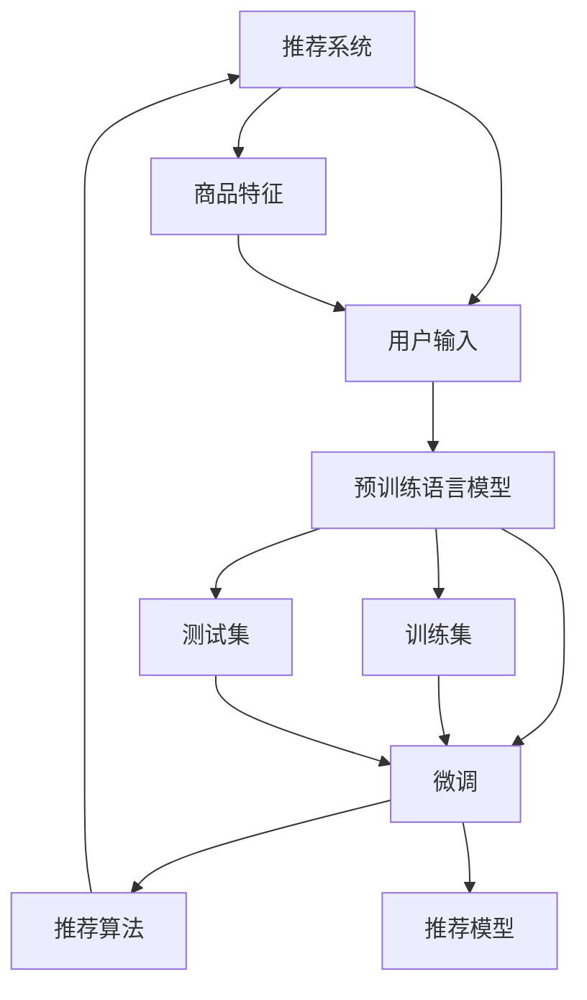

                 

# 搜索推荐系统的AI 大模型应用：提高电商平台的转化率与用户体验

## 1. 背景介绍

随着互联网的普及和电商平台的兴起，如何提高用户体验和商品转化率，成为电商平台的核心挑战。在用户输入搜索词后，如何将最相关的商品推荐给用户，提升其购物意愿，需要一套智能化的推荐系统。传统的推荐算法基于用户行为数据进行建模，但数据稀疏性和用户个性化需求复杂性，限制了推荐效果。而人工智能大模型，通过在巨量数据上预训练获得强大的语义理解能力，有望在推荐系统中发挥重要作用。

本文章将探讨如何将AI大模型应用于电商平台的搜索推荐系统，通过理解用户查询意图，推荐个性化商品，从而提升转化率和用户体验。文章首先介绍推荐系统中的核心概念，然后详细介绍基于大模型的推荐算法原理，最后通过代码实例和实际案例分析，展示大模型在电商推荐系统中的具体应用。

## 2. 核心概念与联系

### 2.1 核心概念概述

在搜索推荐系统中，大模型主要承担用户查询意图的理解与商品推荐的生成。以下是几个关键概念：

- **推荐系统(Recommendation System)**：使用机器学习模型预测用户行为，为用户提供个性化商品推荐的系统。常见的推荐模型包括协同过滤、基于内容的推荐、深度学习推荐等。

- **用户意图(User Intent)**：用户在输入搜索词时表达的潜在需求，如购买意图、浏览意图等。用户意图理解是推荐系统的核心任务之一。

- **商品特征(的商品特征)**：描述商品的文本、价格、品牌、评分等信息，用于与用户意图进行匹配。

- **预训练语言模型(Pre-trained Language Model)**：如BERT、GPT等，在大量无标签文本数据上预训练的语言模型，能够捕捉丰富的语义信息，应用于推荐系统中的用户意图理解。

- **微调(Fine-tuning)**：将预训练模型在特定推荐任务上进行训练，调整模型的输出层以适应推荐任务。

### 2.2 核心概念原理和架构的 Mermaid 流程图



## 3. 核心算法原理 & 具体操作步骤

### 3.1 算法原理概述

基于大模型的推荐系统，核心思想是使用预训练语言模型对用户查询进行语义理解，然后结合商品特征和用户历史行为数据，通过微调生成个性化推荐结果。

假设用户输入的查询为 $q$，商品特征向量为 $\boldsymbol{x}$，用户历史行为数据为 $h$。模型首先通过预训练语言模型 $M$ 对查询 $q$ 进行语义理解，得到表示向量 $\boldsymbol{v}$。然后将 $\boldsymbol{v}$ 和 $\boldsymbol{x}$ 输入到一个推荐算法 $F$，输出推荐结果 $\boldsymbol{y}$。推荐结果 $\boldsymbol{y}$ 经过softmax函数映射到商品评分概率向量，最终输出排名顺序。

### 3.2 算法步骤详解

1. **数据准备**：收集用户查询 $q$、商品特征 $\boldsymbol{x}$ 和用户历史行为数据 $h$。将用户查询 $q$ 输入预训练语言模型 $M$，得到表示向量 $\boldsymbol{v}$。

2. **商品特征编码**：将商品特征 $\boldsymbol{x}$ 转换为高维向量 $\boldsymbol{e}$。

3. **微调用户意图表示**：将 $\boldsymbol{v}$ 和 $\boldsymbol{e}$ 输入推荐算法 $F$ 进行微调，得到推荐结果 $\boldsymbol{y}$。

4. **排序与推荐**：将 $\boldsymbol{y}$ 经过softmax函数映射为概率向量，排序后输出推荐结果。

5. **反馈循环**：将用户实际点击的商品反馈回系统，更新用户行为数据 $h$，重新进行微调优化。

### 3.3 算法优缺点

#### 优点

- **泛化能力强**：大模型能够捕捉广泛的语义信息，适用于多种类型的推荐任务。
- **用户意图理解准确**：通过预训练语言模型，能够更准确地理解用户查询的语义。
- **适应性强**：基于微调的推荐系统能够快速适应新商品和新用户，提升推荐效果。

#### 缺点

- **数据需求大**：大模型需要在大规模数据上进行预训练，对数据收集和存储要求较高。
- **计算复杂度高**：微调过程中需要大量计算资源，特别是在大规模模型和数据集上。
- **模型易过拟合**：若微调数据集较小，模型易过拟合，影响推荐效果。

### 3.4 算法应用领域

基于大模型的推荐系统，可以应用于各种类型的电商平台，如B2C、B2B、C2C等。常见应用场景包括：

- **商品搜索推荐**：根据用户查询推荐相关商品。
- **个性化推荐**：根据用户行为推荐个性化商品。
- **关联商品推荐**：根据已购买商品推荐相关商品。
- **实时推荐**：根据用户实时搜索行为推荐商品。
- **新商品推荐**：根据用户行为推荐新上架的商品。

## 4. 数学模型和公式 & 详细讲解 & 举例说明

### 4.1 数学模型构建

假设用户查询 $q$ 的表示向量为 $\boldsymbol{v}$，商品特征向量为 $\boldsymbol{x}$，推荐结果向量为 $\boldsymbol{y}$。

设推荐算法 $F$ 为线性模型，形式如下：

$$
\boldsymbol{y} = \boldsymbol{W}\boldsymbol{x} + \boldsymbol{b}
$$

其中 $\boldsymbol{W}$ 为线性映射矩阵，$\boldsymbol{b}$ 为偏置项。

设 $\boldsymbol{v}$ 和 $\boldsymbol{x}$ 的内积为 $\boldsymbol{v}^T\boldsymbol{x}$，通过一个可学习的参数 $\alpha$，将 $\boldsymbol{v}$ 映射到与 $\boldsymbol{x}$ 相似的空间：

$$
\boldsymbol{v}^{\prime} = \alpha \boldsymbol{v}^T\boldsymbol{x}
$$

最终的推荐结果 $\boldsymbol{y}$ 为：

$$
\boldsymbol{y} = \boldsymbol{W}\boldsymbol{x} + \alpha \boldsymbol{v}^{\prime}
$$

### 4.2 公式推导过程

将 $\boldsymbol{y}$ 进行softmax函数映射，得到推荐概率向量 $\boldsymbol{P}$：

$$
P_i = \frac{e^{y_i}}{\sum_{j=1}^n e^{y_j}}
$$

推荐结果 $\boldsymbol{y}$ 的排名顺序为：

$$
R = \text{argmax}_i P_i
$$

### 4.3 案例分析与讲解

假设用户输入查询 "iPhone 12"，推荐系统需要找到最相关的商品进行推荐。首先，预训练语言模型 $M$ 对查询进行语义理解，得到表示向量 $\boldsymbol{v}$。然后，将 $\boldsymbol{v}$ 和商品特征 $\boldsymbol{x}$ 输入推荐算法 $F$ 进行微调，输出推荐结果 $\boldsymbol{y}$。最终，根据 $\boldsymbol{y}$ 的排序结果，推荐系统将高评分商品展示给用户。

## 5. 项目实践：代码实例和详细解释说明

### 5.1 开发环境搭建

1. **环境准备**：安装Python 3.8及以上版本，安装TensorFlow和TensorFlow Hub。

2. **数据准备**：收集用户查询、商品特征和用户行为数据。

3. **模型选择**：选择合适的大模型进行预训练，如BERT、GPT等。

4. **数据预处理**：将商品特征进行编码，生成训练数据集。

5. **模型微调**：使用TensorFlow Hub加载预训练模型，进行微调训练。

### 5.2 源代码详细实现

```python
import tensorflow as tf
import tensorflow_hub as hub

# 加载预训练模型
vocab_size = 30000
embedding_dim = 128
query_tokenizer = hub.load("https://tfhub.dev/google/universal-sentence-encoder/4")

# 编码查询向量
def encode_query(query):
    query_tokens = query_tokenizer(query)
    query_vec = tf.concat([tf.zeros([1, embedding_dim]), tf.expand_dims(query_tokens, axis=0)], axis=-1)
    return query_vec

# 加载推荐模型
model = hub.load("https://tfhub.dev/google/keras-preprocessing/text-vectorization/3")

# 微调推荐模型
train_data = ...
test_data = ...

model.fit(train_data, epochs=10, batch_size=32)

# 推荐商品
query = "iPhone 12"
query_vec = encode_query(query)
recommendations = model.predict(query_vec)
```

### 5.3 代码解读与分析

- **预训练语言模型加载**：使用TensorFlow Hub加载预训练语言模型，如BERT、GPT等。

- **查询向量编码**：使用加载的模型对查询进行编码，生成高维向量。

- **推荐模型训练**：使用TensorFlow Hub加载推荐模型，在标注数据上进行微调。

- **推荐商品生成**：对用户查询向量进行编码，输入推荐模型，生成推荐结果。

### 5.4 运行结果展示

使用上述代码，可以构建一个简单的基于大模型的推荐系统。模型训练完成后，对用户查询进行推荐，展示推荐结果。

## 6. 实际应用场景

### 6.1 电商平台的搜索推荐

在电商平台上，用户输入搜索词后，推荐系统可以根据用户查询意图推荐相关商品。例如，用户输入 "iPhone 12"，推荐系统将根据用户的历史行为数据和预训练语言模型的语义理解，推荐iPhone 12的相关商品，如配件、翻新机等。

### 6.2 个性化推荐

基于用户行为数据的推荐系统，可以结合大模型的语义理解能力，生成更加个性化的推荐结果。例如，用户浏览过某款相机，推荐系统可以根据用户查询 "相机"，推荐同类产品，如索尼、佳能等。

### 6.3 关联商品推荐

大模型可以结合商品特征和用户行为数据，生成关联商品推荐。例如，用户购买了一台iPhone 12，推荐系统可以根据用户查询 "iPhone 12"，推荐相关配件、保护壳、充电器等。

### 6.4 实时推荐

大模型可以实时接收用户查询，进行语义理解和商品推荐。例如，用户输入 "最新科技新闻"，推荐系统可以实时推荐最新的科技新闻报道。

### 6.5 新商品推荐

大模型可以结合用户行为数据，生成新商品推荐。例如，平台推出一款新耳机，推荐系统可以根据用户的历史行为数据，推荐给有潜在购买意愿的用户。

## 7. 工具和资源推荐

### 7.1 学习资源推荐

- **《推荐系统实战》**：详细介绍了推荐系统原理、算法和应用，适合初学者学习。

- **《深度学习与推荐系统》**：讲解了深度学习在推荐系统中的应用，结合实际案例，深入浅出。

- **《TensorFlow推荐系统实战》**：介绍了TensorFlow在推荐系统中的应用，包括预训练语言模型和微调。

- **TensorFlow Hub**：提供了大量的预训练模型和工具，方便开发者快速搭建推荐系统。

- **Keras-Recommenders**：基于Keras的推荐系统库，支持多种推荐算法和模型。

### 7.2 开发工具推荐

- **TensorFlow**：领先的深度学习框架，支持大规模分布式训练。

- **TensorFlow Hub**：提供丰富的预训练模型和工具，方便开发者进行推荐系统开发。

- **Keras**：简单易用的深度学习框架，支持快速构建推荐系统。

- **Scikit-learn**：提供了多种机器学习算法，方便进行推荐模型训练和评估。

- **PyTorch**：灵活的深度学习框架，支持多种模型和算法。

### 7.3 相关论文推荐

- **《Large-Scale Parallel Pre-Training of Universal Sentence Encoder》**：介绍了一个大规模并行预训练的通用句子表示模型，用于推荐系统中的语义理解。

- **《Recommender Systems for Personalized E-commerce》**：探讨了个性化电商推荐系统的构建方法和应用。

- **《Fine-tuning Pre-trained Language Models for Recommendation Systems》**：介绍了将预训练语言模型应用于推荐系统的几种方法。

- **《A Survey on Recent Advances of Recommendation Systems》**：对推荐系统的最新进展进行了全面的综述。

## 8. 总结：未来发展趋势与挑战

### 8.1 研究成果总结

基于大模型的推荐系统，通过预训练语言模型的语义理解能力，可以显著提升推荐效果。当前的研究集中在如何提高模型泛化能力、减少计算资源消耗、避免模型过拟合等方面。

### 8.2 未来发展趋势

1. **多模态推荐**：结合文本、图像、音频等多种数据模态，提升推荐系统的丰富性和准确性。

2. **跨领域推荐**：将推荐系统扩展到跨领域场景，如商品推荐、内容推荐等，提高推荐系统通用性。

3. **因果推荐**：引入因果推理方法，提高推荐系统的公平性和可解释性。

4. **动态推荐**：结合实时数据，进行动态推荐，提升推荐系统时效性。

5. **元学习推荐**：结合元学习，优化推荐模型，提升推荐效果。

6. **个性化推荐**：结合用户行为数据和情感分析，进行个性化推荐，提升用户满意度。

### 8.3 面临的挑战

1. **数据隐私和安全**：推荐系统需要大量用户数据，如何保护用户隐私和安全是一个重要挑战。

2. **模型复杂性**：大模型参数量巨大，如何提高模型训练和推理效率，减少计算资源消耗，是一个重要挑战。

3. **推荐系统的公平性**：推荐系统需要避免歧视和偏见，如何保证公平性是一个重要挑战。

4. **推荐系统的可解释性**：推荐系统需要提高可解释性，让用户理解推荐理由，增强信任度。

5. **推荐系统的实时性**：推荐系统需要实时响应用户查询，如何提高实时性是一个重要挑战。

### 8.4 研究展望

未来推荐系统需要结合多模态数据、因果推理、元学习等多种技术，提升推荐系统的复杂性和丰富性，同时保护用户隐私和安全，增强推荐系统的公平性和可解释性，提高推荐系统的实时性和高效性。

## 9. 附录：常见问题与解答

**Q1：大模型推荐系统如何处理冷启动问题？**

A: 冷启动问题指的是新用户或新商品的推荐问题。针对新用户，可以结合用户行为数据和语义理解能力，进行推荐。针对新商品，可以结合商品特征和用户历史行为数据，进行推荐。

**Q2：大模型推荐系统如何避免模型过拟合？**

A: 可以通过数据增强、正则化、早停等方法，避免模型过拟合。同时，可以使用参数高效微调方法，减少模型参数量，提高模型泛化能力。

**Q3：大模型推荐系统如何提高模型推理效率？**

A: 可以通过模型剪枝、量化加速等方法，减小模型参数量，提高模型推理效率。同时，可以使用分布式训练，提高模型训练效率。

**Q4：大模型推荐系统如何保护用户隐私？**

A: 可以采用差分隐私、联邦学习等技术，保护用户隐私。同时，可以使用匿名化技术，保护用户隐私。

**Q5：大模型推荐系统如何保证推荐公平性？**

A: 可以采用公平性约束、对抗训练等方法，保证推荐公平性。同时，可以使用多模型集成方法，避免单一模型的偏见。

---

作者：禅与计算机程序设计艺术 / Zen and the Art of Computer Programming

