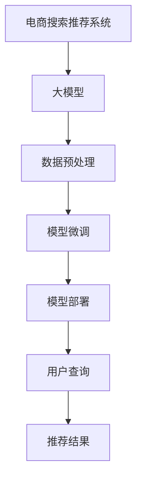

                 

# 搜索推荐系统的AI 大模型融合：电商平台提高用户体验与转化率

## 1. 背景介绍

### 1.1 问题由来

在电子商务平台，提升用户体验和转化率是企业成功的关键。搜索和推荐系统作为用户与商品交互的重要桥梁，直接影响了用户体验和销售转化。传统的搜索和推荐算法基于规则或统计模型，难以应对复杂多变的用户行为和商品特性。而随着AI大模型的崛起，通过深度学习的方式，可以在大规模数据上学习到更加精准的表示和关联，从而实现更高效、个性化的搜索推荐服务。

### 1.2 问题核心关键点

大模型在电商搜索推荐中的应用，主要关注以下几个核心关键点：

- **数据利用**：如何高效利用电商平台的商品、用户行为等海量数据，提高模型的泛化能力和适应性。
- **推荐质量**：如何通过优化模型结构，提升推荐结果的相关性和多样性，满足用户的个性化需求。
- **搜索效率**：如何优化模型推理过程，降低搜索推荐的延迟，提升用户体验。
- **交互深度**：如何通过交互反馈机制，动态调整模型参数，适应用户反馈和行为变化。
- **应用场景**：如何针对不同的电商应用场景，如首页推荐、搜索结果页、购物车、商品详情页等，设计合适的搜索推荐模型。

### 1.3 问题研究意义

大模型在电商搜索推荐中的应用，对提升电商平台的竞争力和用户体验具有重要意义：

- **增强个性化推荐**：利用大模型的强大表示能力，学习用户个性化偏好，提供更加精准的推荐内容。
- **提升搜索效果**：通过大模型学习复杂的查询语义，提高搜索结果的相关性和多样性，增强用户的搜索体验。
- **优化库存管理**：通过大模型预测商品的销售趋势和用户偏好，优化库存管理和商品上架策略。
- **降低运营成本**：自动化、智能化的搜索推荐系统，减少了人工干预，降低了运营成本。
- **驱动增长转化**：通过精准推荐，提高用户购买决策的精准度，推动电商平台的增长和转化。

## 2. 核心概念与联系

### 2.1 核心概念概述

为更好地理解大模型在电商搜索推荐中的应用，本节将介绍几个关键概念：

- **电商搜索推荐系统**：通过算法模型将用户查询和商品信息进行匹配，提供个性化推荐的系统。电商平台的搜索推荐系统通常由搜索引擎和推荐引擎组成，共同完成用户搜索和商品推荐的双重任务。

- **大模型**：以自回归模型（如GPT）或自编码模型（如BERT）为代表的深度学习模型，通过大规模数据进行预训练，学习到丰富的语言和知识表示。在大模型上进行微调，可以显著提升推荐和搜索的准确性和个性化程度。

- **数据预处理**：对原始电商数据进行清洗、归一化、特征工程等处理，以适配大模型的输入要求。数据预处理的质量直接影响了模型的效果。

- **模型微调**：在大模型的基础上，使用电商平台的标注数据进行有监督学习，优化模型在电商任务上的表现。微调可以提升模型的泛化能力，更好地适应电商数据的特点。

- **模型部署**：将微调后的模型部署到电商平台的推荐引擎中，实时响应用户的搜索和推荐请求，提供高效、个性化的服务。

这些核心概念之间的逻辑关系可以通过以下Mermaid流程图来展示：



这个流程图展示了大模型在电商搜索推荐系统中的应用流程：

1. 电商平台的数据经过预处理后，作为输入数据对大模型进行微调。
2. 微调后的模型部署到推荐引擎，实时响应用户的查询请求。
3. 用户查询后，模型根据推荐结果，动态生成商品推荐列表。
4. 推荐结果再次用于数据预处理和微调，形成闭环优化。

## 3. 核心算法原理 & 具体操作步骤

### 3.1 算法原理概述

基于大模型的电商搜索推荐系统，主要利用大模型的预训练表示能力，结合电商任务的数据特点，进行有监督学习，以提升推荐和搜索的质量。算法原理主要分为以下几个步骤：

1. **数据预处理**：对电商数据进行清洗、特征工程、归一化等预处理，适配大模型的输入格式。
2. **大模型微调**：在大模型的基础上，使用电商平台的标注数据进行有监督学习，优化模型在电商任务上的表现。
3. **模型部署**：将微调后的模型部署到推荐引擎中，实时响应用户的搜索和推荐请求。
4. **交互反馈**：根据用户对推荐结果的反馈，动态调整模型参数，提高推荐的个性化和相关性。

### 3.2 算法步骤详解

下面详细介绍每个步骤的详细操作步骤：

**Step 1: 数据预处理**

电商数据通常包含商品信息、用户行为、交易记录等多种数据类型，需要进行预处理才能适配大模型的输入要求。具体步骤如下：

1. **数据清洗**：去除无效、噪声数据，处理缺失值。
2. **特征工程**：提取商品属性、用户属性、行为特征等，生成高维向量表示。
3. **归一化**：对特征进行归一化，使其满足大模型的输入分布。
4. **数据增强**：通过合成、变换等方式，扩充训练数据集。

**Step 2: 大模型微调**

在预处理后的数据上，进行大模型的微调训练，具体步骤如下：

1. **选择合适的预训练模型**：如BERT、GPT-3、XLNet等，根据任务特点选择合适的模型。
2. **添加任务适配层**：根据任务类型，添加相应的输出层和损失函数，如分类任务使用交叉熵损失，回归任务使用均方误差损失等。
3. **设置微调超参数**：包括学习率、批大小、迭代轮数、正则化技术等。
4. **执行梯度训练**：前向传播计算损失函数，反向传播更新模型参数。
5. **保存模型**：将微调后的模型保存到文件或数据库中，以备后续使用。

**Step 3: 模型部署**

将微调后的模型部署到电商平台的推荐引擎中，具体步骤如下：

1. **选择合适的部署平台**：如AWS、GCP、阿里云等，根据需求选择合适的云平台。
2. **模型集成**：将微调后的模型集成到推荐引擎中，进行实时推理。
3. **接口设计**：设计API接口，实现用户查询和推荐结果的交互。
4. **性能优化**：对部署的模型进行性能优化，如模型压缩、推理加速等。

**Step 4: 交互反馈**

根据用户对推荐结果的反馈，动态调整模型参数，提高推荐的个性化和相关性，具体步骤如下：

1. **收集反馈数据**：通过点击率、转化率等指标，收集用户对推荐结果的反馈。
2. **模型更新**：根据反馈数据，动态调整模型参数，优化推荐效果。
3. **迭代优化**：循环进行数据预处理、模型微调、模型部署和反馈调整，不断优化模型性能。

### 3.3 算法优缺点

基于大模型的电商搜索推荐系统，具有以下优点：

1. **高效性**：利用大模型的预训练表示能力，可以在少量标注数据的情况下，快速提升推荐效果。
2. **个性化**：通过微调学习用户个性化偏好，提供更精准的推荐内容。
3. **适应性**：利用大模型强大的泛化能力，可以适应复杂多变的电商数据。
4. **稳定性**：大模型通过大量的预训练，具备较高的稳定性和可靠性。

同时，该方法也存在一定的局限性：

1. **资源消耗**：大模型需要较大的计算资源和存储资源，对硬件要求较高。
2. **数据依赖**：微调效果依赖于标注数据的质量和数量，标注成本较高。
3. **模型复杂度**：大模型的复杂度较高，微调过程较为繁琐。
4. **反馈延迟**：根据反馈调整模型参数，需要一定的时间，无法实时响应用户变化。
5. **解释性不足**：大模型的决策过程较复杂，缺乏可解释性，难以理解和调试。

尽管存在这些局限性，但就目前而言，基于大模型的微调方法仍是电商搜索推荐系统的主流范式。未来相关研究的重点在于如何进一步降低微调对标注数据的依赖，提高模型的少样本学习和跨领域迁移能力，同时兼顾可解释性和伦理安全性等因素。

### 3.4 算法应用领域

大模型在电商搜索推荐系统中的应用，已经覆盖了诸多场景，包括：

- **首页推荐**：根据用户历史行为和浏览记录，推荐相关商品。
- **搜索结果页推荐**：根据用户搜索查询，推荐相关商品和相关内容。
- **购物车推荐**：根据用户购物车中的商品，推荐相关商品和配件。
- **商品详情页推荐**：根据用户浏览商品详情页的行为，推荐相关商品和相关内容。
- **用户画像生成**：通过分析用户行为，生成用户画像，提供个性化推荐。
- **商品分类优化**：根据用户搜索和推荐数据，优化商品分类结构。

这些应用场景展示了大模型在电商搜索推荐系统中的广泛适用性和强大的能力。随着预训练模型和微调方法的持续演进，相信电商搜索推荐系统将在更多场景下得到应用，进一步提升用户体验和平台转化率。

## 4. 数学模型和公式 & 详细讲解 & 举例说明

### 4.1 数学模型构建

本节将使用数学语言对基于大模型的电商搜索推荐系统进行更加严格的刻画。

记电商数据集为 $D=\{(x_i,y_i)\}_{i=1}^N$，其中 $x_i$ 为商品和用户行为特征，$y_i$ 为推荐标签（点击、购买等）。大模型为 $M_{\theta}$，其中 $\theta$ 为模型参数。

定义模型 $M_{\theta}$ 在输入 $x$ 上的输出为 $\hat{y}=M_{\theta}(x)$，表示模型对输入 $x$ 的预测结果。推荐任务的目标是最大化模型在数据集 $D$ 上的准确性，即最小化损失函数 $\mathcal{L}(\theta)$：

$$
\mathcal{L}(\theta) = -\frac{1}{N} \sum_{i=1}^N \log \hat{y}_i
$$

在微调过程中，通过梯度下降等优化算法，不断更新模型参数 $\theta$，使得 $\mathcal{L}(\theta)$ 最小化，从而提高模型的推荐效果。

### 4.2 公式推导过程

以二分类推荐任务为例，推导交叉熵损失函数及其梯度的计算公式。

假设模型 $M_{\theta}$ 在输入 $x$ 上的输出为 $\hat{y}=M_{\theta}(x) \in [0,1]$，表示商品被用户点击的概率。真实标签 $y \in \{0,1\}$。则二分类交叉熵损失函数定义为：

$$
\ell(M_{\theta}(x),y) = -[y\log \hat{y} + (1-y)\log (1-\hat{y})]
$$

将其代入经验风险公式，得：

$$
\mathcal{L}(\theta) = -\frac{1}{N}\sum_{i=1}^N [y_i\log M_{\theta}(x_i)+(1-y_i)\log(1-M_{\theta}(x_i))]
$$

根据链式法则，损失函数对参数 $\theta_k$ 的梯度为：

$$
\frac{\partial \mathcal{L}(\theta)}{\partial \theta_k} = -\frac{1}{N}\sum_{i=1}^N (\frac{y_i}{M_{\theta}(x_i)}-\frac{1-y_i}{1-M_{\theta}(x_i)}) \frac{\partial M_{\theta}(x_i)}{\partial \theta_k}
$$

其中 $\frac{\partial M_{\theta}(x_i)}{\partial \theta_k}$ 可进一步递归展开，利用自动微分技术完成计算。

在得到损失函数的梯度后，即可带入参数更新公式，完成模型的迭代优化。重复上述过程直至收敛，最终得到适应电商推荐任务的最优模型参数 $\theta^*$。

## 5. 项目实践：代码实例和详细解释说明

### 5.1 开发环境搭建

在进行电商搜索推荐系统开发前，我们需要准备好开发环境。以下是使用Python进行PyTorch开发的环境配置流程：

1. 安装Anaconda：从官网下载并安装Anaconda，用于创建独立的Python环境。

2. 创建并激活虚拟环境：
```bash
conda create -n ecommerce-env python=3.8 
conda activate ecommerce-env
```

3. 安装PyTorch：根据CUDA版本，从官网获取对应的安装命令。例如：
```bash
conda install pytorch torchvision torchaudio cudatoolkit=11.1 -c pytorch -c conda-forge
```

4. 安装Transformer库：
```bash
pip install transformers
```

5. 安装各类工具包：
```bash
pip install numpy pandas scikit-learn matplotlib tqdm jupyter notebook ipython
```

完成上述步骤后，即可在`ecommerce-env`环境中开始电商搜索推荐系统的开发。

### 5.2 源代码详细实现

下面我们以二分类推荐任务为例，给出使用Transformers库对BERT模型进行电商搜索推荐系统微调的PyTorch代码实现。

首先，定义推荐任务的数据处理函数：

```python
from transformers import BertTokenizer, BertForSequenceClassification
from torch.utils.data import Dataset
import torch

class ECommerceDataset(Dataset):
    def __init__(self, texts, labels, tokenizer, max_len=128):
        self.texts = texts
        self.labels = labels
        self.tokenizer = tokenizer
        self.max_len = max_len
        
    def __len__(self):
        return len(self.texts)
    
    def __getitem__(self, item):
        text = self.texts[item]
        label = self.labels[item]
        
        encoding = self.tokenizer(text, return_tensors='pt', max_length=self.max_len, padding='max_length', truncation=True)
        input_ids = encoding['input_ids'][0]
        attention_mask = encoding['attention_mask'][0]
        
        # 对label进行编码
        encoded_labels = torch.tensor(label, dtype=torch.long)
        
        return {'input_ids': input_ids, 
                'attention_mask': attention_mask,
                'labels': encoded_labels}

# 标签与id的映射
label2id = {'1': 0, '0': 1}

# 创建dataset
tokenizer = BertTokenizer.from_pretrained('bert-base-cased')

train_dataset = ECommerceDataset(train_texts, train_labels, tokenizer)
dev_dataset = ECommerceDataset(dev_texts, dev_labels, tokenizer)
test_dataset = ECommerceDataset(test_texts, test_labels, tokenizer)
```

然后，定义模型和优化器：

```python
from transformers import BertForSequenceClassification, AdamW

model = BertForSequenceClassification.from_pretrained('bert-base-cased', num_labels=2)

optimizer = AdamW(model.parameters(), lr=2e-5)
```

接着，定义训练和评估函数：

```python
from torch.utils.data import DataLoader
from tqdm import tqdm
from sklearn.metrics import classification_report

device = torch.device('cuda') if torch.cuda.is_available() else torch.device('cpu')
model.to(device)

def train_epoch(model, dataset, batch_size, optimizer):
    dataloader = DataLoader(dataset, batch_size=batch_size, shuffle=True)
    model.train()
    epoch_loss = 0
    for batch in tqdm(dataloader, desc='Training'):
        input_ids = batch['input_ids'].to(device)
        attention_mask = batch['attention_mask'].to(device)
        labels = batch['labels'].to(device)
        model.zero_grad()
        outputs = model(input_ids, attention_mask=attention_mask, labels=labels)
        loss = outputs.loss
        epoch_loss += loss.item()
        loss.backward()
        optimizer.step()
    return epoch_loss / len(dataloader)

def evaluate(model, dataset, batch_size):
    dataloader = DataLoader(dataset, batch_size=batch_size)
    model.eval()
    preds, labels = [], []
    with torch.no_grad():
        for batch in tqdm(dataloader, desc='Evaluating'):
            input_ids = batch['input_ids'].to(device)
            attention_mask = batch['attention_mask'].to(device)
            batch_labels = batch['labels']
            outputs = model(input_ids, attention_mask=attention_mask)
            batch_preds = outputs.logits.argmax(dim=2).to('cpu').tolist()
            batch_labels = batch_labels.to('cpu').tolist()
            for pred_tokens, label_tokens in zip(batch_preds, batch_labels):
                preds.append(pred_tokens[:len(label_tokens)])
                labels.append(label_tokens)
                
    print(classification_report(labels, preds))
```

最后，启动训练流程并在测试集上评估：

```python
epochs = 5
batch_size = 16

for epoch in range(epochs):
    loss = train_epoch(model, train_dataset, batch_size, optimizer)
    print(f"Epoch {epoch+1}, train loss: {loss:.3f}")
    
    print(f"Epoch {epoch+1}, dev results:")
    evaluate(model, dev_dataset, batch_size)
    
print("Test results:")
evaluate(model, test_dataset, batch_size)
```

以上就是使用PyTorch对BERT进行电商搜索推荐系统微调的完整代码实现。可以看到，得益于Transformers库的强大封装，我们可以用相对简洁的代码完成BERT模型的加载和微调。

### 5.3 代码解读与分析

让我们再详细解读一下关键代码的实现细节：

**ECommerceDataset类**：
- `__init__`方法：初始化文本、标签、分词器等关键组件。
- `__len__`方法：返回数据集的样本数量。
- `__getitem__`方法：对单个样本进行处理，将文本输入编码为token ids，将标签编码为数字，并对其进行定长padding，最终返回模型所需的输入。

**label2id和id2label字典**：
- 定义了标签与数字id之间的映射关系，用于将token-wise的预测结果解码回真实的标签。

**训练和评估函数**：
- 使用PyTorch的DataLoader对数据集进行批次化加载，供模型训练和推理使用。
- 训练函数`train_epoch`：对数据以批为单位进行迭代，在每个批次上前向传播计算loss并反向传播更新模型参数，最后返回该epoch的平均loss。
- 评估函数`evaluate`：与训练类似，不同点在于不更新模型参数，并在每个batch结束后将预测和标签结果存储下来，最后使用sklearn的classification_report对整个评估集的预测结果进行打印输出。

**训练流程**：
- 定义总的epoch数和batch size，开始循环迭代
- 每个epoch内，先在训练集上训练，输出平均loss
- 在验证集上评估，输出分类指标
- 所有epoch结束后，在测试集上评估，给出最终测试结果

可以看到，PyTorch配合Transformers库使得BERT微调的代码实现变得简洁高效。开发者可以将更多精力放在数据处理、模型改进等高层逻辑上，而不必过多关注底层的实现细节。

当然，工业级的系统实现还需考虑更多因素，如模型的保存和部署、超参数的自动搜索、更灵活的任务适配层等。但核心的微调范式基本与此类似。

## 6. 实际应用场景

### 6.1 电商搜索推荐

基于大模型的电商搜索推荐技术，可以广泛应用于电商平台的商品推荐和搜索服务。传统的推荐系统往往基于规则或统计模型，难以处理复杂多变的用户行为和商品特性。而使用大模型进行微调，可以学习到更加精准的用户和商品表示，提供个性化的商品推荐和搜索结果。

在技术实现上，可以收集用户的历史行为数据和商品属性数据，将数据进行预处理后，作为监督数据对大模型进行微调。微调后的模型能够自动理解用户兴趣和商品特性，生成个性化推荐结果。通过动态调整推荐策略，还可以提高推荐的多样性和相关性，提升用户的购物体验和转化率。

### 6.2 实时个性化推荐

在电商平台上，用户的购物行为是实时变化的。传统的推荐系统往往无法实时响应用户行为的变化。而使用大模型进行实时推荐，可以实时捕捉用户的兴趣和行为变化，动态调整推荐结果，提高推荐的个性化和相关性。

在技术实现上，可以设计实时数据流，将用户的实时行为数据输入微调后的模型，动态生成推荐结果。通过不断的在线学习和优化，确保推荐结果能够即时反映用户变化，提升用户的购物体验和转化率。

### 6.3 跨领域推荐

传统的推荐系统往往只能处理单一领域的推荐任务，难以适应复杂的电商场景。而使用大模型进行跨领域推荐，可以将不同领域的数据进行融合，生成更加全面的推荐结果。

在技术实现上，可以将不同领域的数据进行预处理后，作为监督数据对大模型进行微调。微调后的模型能够自动理解不同领域的用户行为和商品特性，生成跨领域的推荐结果。通过动态调整推荐策略，还可以提高跨领域的推荐效果，提升用户的购物体验和转化率。

### 6.4 未来应用展望

随着大模型和微调技术的不断发展，基于大模型的电商搜索推荐系统将在更多领域得到应用，为电商平台的运营带来更多创新和机遇。

在智慧零售领域，大模型可以用于智能货架、智能仓储等场景，提高零售效率和顾客满意度。

在金融科技领域，大模型可以用于风险评估、信用评分等任务，提升金融服务的智能化水平。

在供应链管理领域，大模型可以用于预测需求、优化库存等任务，提高供应链的响应速度和效率。

此外，在智能制造、医疗健康、智慧城市等多个领域，大模型也将在电商搜索推荐系统之外，展现更多的应用价值。相信随着技术的不断进步，大模型微调将在构建人机协同的智能社会中扮演越来越重要的角色。

## 7. 工具和资源推荐

### 7.1 学习资源推荐

为了帮助开发者系统掌握大模型在电商搜索推荐中的应用，这里推荐一些优质的学习资源：

1. 《Transformer from Research to Production》系列博文：由大模型技术专家撰写，深入浅出地介绍了Transformer原理、BERT模型、微调技术等前沿话题。

2. CS229《机器学习》课程：斯坦福大学开设的机器学习明星课程，有Lecture视频和配套作业，带你入门机器学习和深度学习的基本概念和经典模型。

3. 《Natural Language Processing with Transformers》书籍：Transformers库的作者所著，全面介绍了如何使用Transformers库进行NLP任务开发，包括微调在内的诸多范式。

4. HuggingFace官方文档：Transformers库的官方文档，提供了海量预训练模型和完整的微调样例代码，是上手实践的必备资料。

5. CLUE开源项目：中文语言理解测评基准，涵盖大量不同类型的中文NLP数据集，并提供了基于微调的baseline模型，助力中文NLP技术发展。

通过对这些资源的学习实践，相信你一定能够快速掌握大模型在电商搜索推荐系统中的应用，并用于解决实际的NLP问题。

### 7.2 开发工具推荐

高效的开发离不开优秀的工具支持。以下是几款用于电商搜索推荐系统开发的常用工具：

1. PyTorch：基于Python的开源深度学习框架，灵活动态的计算图，适合快速迭代研究。大部分预训练语言模型都有PyTorch版本的实现。

2. TensorFlow：由Google主导开发的开源深度学习框架，生产部署方便，适合大规模工程应用。同样有丰富的预训练语言模型资源。

3. Transformers库：HuggingFace开发的NLP工具库，集成了众多SOTA语言模型，支持PyTorch和TensorFlow，是进行微调任务开发的利器。

4. Weights & Biases：模型训练的实验跟踪工具，可以记录和可视化模型训练过程中的各项指标，方便对比和调优。与主流深度学习框架无缝集成。

5. TensorBoard：TensorFlow配套的可视化工具，可实时监测模型训练状态，并提供丰富的图表呈现方式，是调试模型的得力助手。

6. Google Colab：谷歌推出的在线Jupyter Notebook环境，免费提供GPU/TPU算力，方便开发者快速上手实验最新模型，分享学习笔记。

合理利用这些工具，可以显著提升大模型在电商搜索推荐系统中的应用效果，加快创新迭代的步伐。

### 7.3 相关论文推荐

大模型在电商搜索推荐系统中的应用，源于学界的持续研究。以下是几篇奠基性的相关论文，推荐阅读：

1. Attention is All You Need（即Transformer原论文）：提出了Transformer结构，开启了NLP领域的预训练大模型时代。

2. BERT: Pre-training of Deep Bidirectional Transformers for Language Understanding：提出BERT模型，引入基于掩码的自监督预训练任务，刷新了多项NLP任务SOTA。

3. Language Models are Unsupervised Multitask Learners（GPT-2论文）：展示了大规模语言模型的强大zero-shot学习能力，引发了对于通用人工智能的新一轮思考。

4. Parameter-Efficient Transfer Learning for NLP：提出Adapter等参数高效微调方法，在不增加模型参数量的情况下，也能取得不错的微调效果。

5. Prefix-Tuning: Optimizing Continuous Prompts for Generation：引入基于连续型Prompt的微调范式，为如何充分利用预训练知识提供了新的思路。

6. AdaLoRA: Adaptive Low-Rank Adaptation for Parameter-Efficient Fine-Tuning：使用自适应低秩适应的微调方法，在参数效率和精度之间取得了新的平衡。

这些论文代表了大模型在电商搜索推荐系统中的应用方向。通过学习这些前沿成果，可以帮助研究者把握学科前进方向，激发更多的创新灵感。

## 8. 总结：未来发展趋势与挑战

### 8.1 总结

本文对基于大模型的电商搜索推荐系统进行了全面系统的介绍。首先阐述了电商搜索推荐系统的大模型应用背景和意义，明确了大模型在提高用户体验和转化率方面的独特价值。其次，从原理到实践，详细讲解了电商搜索推荐系统的核心算法流程和具体实现步骤。最后，介绍了大模型在电商搜索推荐系统的实际应用场景，展示了其广泛的适用性和强大的能力。

通过本文的系统梳理，可以看到，基于大模型的电商搜索推荐系统正在成为电商平台的重要技术支撑，极大地提升了电商平台的竞争力和用户满意度。未来，伴随大模型和微调方法的持续演进，相信电商搜索推荐系统将在更多领域得到应用，进一步提升用户体验和平台转化率。

### 8.2 未来发展趋势

展望未来，大模型在电商搜索推荐系统中的应用将呈现以下几个发展趋势：

1. **模型规模持续增大**：随着算力成本的下降和数据规模的扩张，预训练语言模型的参数量还将持续增长。超大规模语言模型蕴含的丰富语言知识，有望支撑更加复杂多变的电商推荐任务。

2. **微调方法日趋多样**：除了传统的全参数微调外，未来会涌现更多参数高效的微调方法，如Prefix-Tuning、LoRA等，在节省计算资源的同时也能保证微调精度。

3. **持续学习成为常态**：随着数据分布的不断变化，微调模型也需要持续学习新知识以保持性能。如何在不遗忘原有知识的同时，高效吸收新样本信息，将成为重要的研究课题。

4. **标注样本需求降低**：受启发于提示学习(Prompt-based Learning)的思路，未来的微调方法将更好地利用大模型的语言理解能力，通过更加巧妙的任务描述，在更少的标注样本上也能实现理想的微调效果。

5. **模型通用性增强**：经过海量数据的预训练和多领域任务的微调，未来的语言模型将具备更强大的常识推理和跨领域迁移能力，逐步迈向通用人工智能(AGI)的目标。

以上趋势凸显了大模型在电商搜索推荐系统中的广阔前景。这些方向的探索发展，必将进一步提升电商平台的搜索推荐系统，为电商平台的运营带来更多创新和机遇。

### 8.3 面临的挑战

尽管大模型在电商搜索推荐系统中的应用已经取得了一定的成功，但在迈向更加智能化、普适化应用的过程中，仍面临诸多挑战：

1. **数据成本高**：虽然微调减少了标注数据的需求，但获取高质量标注数据的成本仍然较高。如何降低微调对标注样本的依赖，仍是一个需要解决的问题。

2. **资源消耗大**：大模型需要较大的计算资源和存储资源，对硬件要求较高。如何优化模型的计算图和推理过程，降低资源消耗，是未来的一个重要研究方向。

3. **模型复杂度高**：大模型的复杂度较高，微调过程较为繁琐。如何简化模型结构，提高微调的效率和可解释性，是一个重要的研究方向。

4. **实时性要求高**：电商平台的搜索推荐系统需要实时响应用户行为变化。如何在保证推荐效果的同时，提升系统的实时性，是一个重要的研究方向。

5. **安全性风险**：预训练语言模型难免会学习到有偏见、有害的信息，通过微调传递到推荐系统，可能对用户造成负面影响。如何从数据和算法层面消除模型偏见，确保推荐系统的安全性，是一个重要的研究方向。

6. **可解释性不足**：大模型的决策过程较复杂，缺乏可解释性，难以理解和调试。如何赋予推荐系统更强的可解释性，是未来的一个重要研究方向。

尽管存在这些挑战，但大模型在电商搜索推荐系统中的应用前景广阔，未来研究需进一步攻克这些挑战，才能更好地推动电商平台的智能化发展。

### 8.4 研究展望

面向未来，大模型在电商搜索推荐系统中的研究可以从以下几个方向展开：

1. **数据增强与合成**：利用数据增强和合成技术，扩充训练数据集，提高模型的泛化能力和鲁棒性。

2. **知识图谱融合**：将知识图谱等结构化知识与神经网络模型结合，提高推荐系统的准确性和相关性。

3. **多模态融合**：将视觉、语音、文本等多模态数据融合，提升推荐系统的综合性能。

4. **对抗样本训练**：利用对抗样本训练技术，增强推荐系统的鲁棒性和安全性。

5. **联邦学习**：在分布式环境中，利用联邦学习技术，保护用户隐私的同时，提升推荐系统的性能。

6. **自监督学习**：利用自监督学习技术，提高推荐系统的泛化能力和适应性。

7. **混合推荐**：将机器学习算法与深度学习算法混合，提升推荐系统的性能和效率。

8. **跨领域推荐**：利用跨领域推荐技术，提高推荐系统的多样化。

9. **自动化模型优化**：利用自动化模型优化技术，提高推荐系统的实时性和效率。

10. **模型压缩与量化**：利用模型压缩与量化技术，降低推荐系统的计算资源和存储资源消耗。

这些研究方向将进一步推动大模型在电商搜索推荐系统中的应用，提升推荐系统的智能化水平和用户体验，驱动电商平台的增长和转化。总之，大模型在电商搜索推荐系统中的应用前景广阔，未来研究需进一步探索和优化。

## 9. 附录：常见问题与解答

**Q1：大模型在电商搜索推荐中的作用是什么？**

A: 大模型在电商搜索推荐中的作用是利用其预训练表示能力，学习用户和商品的语义表示，通过微调生成个性化的推荐结果和搜索答案。具体而言，大模型可以从电商平台的商品、用户行为等数据中学习到丰富的语言和知识表示，提高推荐系统的准确性和相关性，提升用户的购物体验和转化率。

**Q2：如何优化大模型在电商搜索推荐中的训练过程？**

A: 优化大模型在电商搜索推荐中的训练过程，可以从以下几个方面入手：
1. 数据预处理：对电商数据进行清洗、特征工程、归一化等预处理，适配大模型的输入要求。
2. 正则化技术：使用L2正则、Dropout、Early Stopping等防止过拟合。
3. 学习率调度：采用warmup策略，在开始阶段使用较小的学习率，再逐渐过渡到预设值。
4. 动态调整参数：根据用户反馈动态调整模型参数，提高推荐效果。
5. 模型裁剪与量化：对大模型进行裁剪与量化，减少资源消耗，提升推理速度。

**Q3：大模型在电商搜索推荐中是否存在负面影响？**

A: 大模型在电商搜索推荐中存在一些负面影响，如数据隐私问题、偏见问题、计算资源消耗大等。为应对这些问题，可以采取以下措施：
1. 数据隐私保护：在数据预处理过程中，去除敏感信息，保护用户隐私。
2. 模型公平性：在训练过程中，引入公平性约束，避免模型偏见。
3. 计算资源优化：利用分布式计算、模型压缩等技术，降低计算资源消耗。
4. 可解释性增强：利用可解释性技术，提高推荐系统的透明性和可理解性。

这些措施可以在一定程度上缓解大模型在电商搜索推荐中的负面影响，提高系统的可靠性与安全性。

