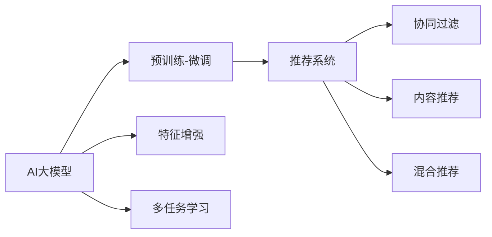

                 

# 搜索推荐系统的AI 大模型融合：电商平台的核心竞争力与转型策略

> 关键词：搜索推荐系统,AI大模型融合,电商平台,核心竞争力,转型策略

## 1. 背景介绍

### 1.1 问题由来
随着互联网的迅猛发展和电子商务的普及，电商平台逐渐成为人们购物的重要渠道。为提升用户体验和销售转化率，搜索推荐系统成为电商平台的标配。传统的推荐算法主要依赖静态特征工程、协同过滤等技术，已逐渐显现出模型泛化能力弱、用户冷启动等问题。随着AI技术的发展，AI大模型开始在推荐系统中发挥越来越重要的作用。

AI大模型，特别是预训练语言模型，通过在大规模文本数据上进行自监督学习，学习到了丰富的语义知识和背景知识。这些模型被广泛应用于文本分类、命名实体识别、情感分析、信息抽取等NLP任务中，取得了不俗的效果。通过将AI大模型引入搜索推荐系统，可以有效解决传统推荐算法的局限性，提升推荐效果，为电商平台带来竞争优势。

### 1.2 问题核心关键点
1. **核心概念**：
   - **AI大模型**：以Transformer、BERT、GPT等深度学习模型为代表的预训练语言模型。
   - **搜索推荐系统**：通过用户行为数据和学习到的用户画像，为用户推荐感兴趣的物品。
   - **融合策略**：将大模型嵌入推荐系统中，提升推荐模型的泛化能力和精度。

2. **核心问题**：
   - **大模型与推荐算法融合**：如何将大模型的丰富语义知识与推荐算法进行有效结合，避免冗余信息。
   - **泛化能力提升**：如何利用大模型学习到的知识，提升推荐系统的泛化能力，应对多样化用户需求。
   - **模型效率优化**：如何在保持模型效果的前提下，提升推荐模型的计算效率，满足实时推荐的需求。

3. **核心目标**：
   - **用户画像优化**：通过AI大模型的融合，生成更加全面、准确的个人画像，提升个性化推荐效果。
   - **商品特征挖掘**：利用大模型自动抽取商品信息，提升商品特征描述的精度。
   - **推荐算法创新**：探索新的推荐算法和策略，利用大模型的语义理解能力，实现更精准的推荐。

## 2. 核心概念与联系

### 2.1 核心概念概述

AI大模型融合推荐系统主要涉及以下几个核心概念：

1. **AI大模型**：
   - **Transformer模型**：通过多头注意力机制，可以捕捉输入序列间的复杂关系，适用于各种NLP任务。
   - **BERT模型**：通过掩码语言模型和Next Sentence Prediction任务进行预训练，具备强大的上下文理解能力。
   - **GPT模型**：通过自回归生成任务进行预训练，具备零样本生成和文本生成的强大能力。

2. **推荐系统**：
   - **协同过滤**：基于用户历史行为和物品评分数据的推荐算法。
   - **内容推荐**：基于物品属性和描述的推荐算法。
   - **混合推荐**：将协同过滤和内容推荐等算法融合，提升推荐效果。

3. **融合策略**：
   - **预训练-微调**：在预训练模型上进行微调，适配推荐任务。
   - **特征增强**：将大模型提取的特征融入推荐模型的特征空间。
   - **多任务学习**：在多任务上进行预训练，学习到更全面的语义知识。

这些核心概念之间的逻辑关系可以通过以下Mermaid流程图来展示：



这个流程图展示了大模型与推荐系统的核心概念及其之间的关系：

1. **大模型训练**：通过大规模语料预训练，生成AI大模型。
2. **微调和适配**：在推荐任务上对大模型进行微调，适配推荐系统。
3. **特征增强**：利用大模型提取的特征，提升推荐模型的特征表示能力。
4. **多任务学习**：通过多任务学习，学习到更全面的语义知识。
5. **推荐算法融合**：将协同过滤、内容推荐等算法与大模型融合，提升推荐效果。

## 3. 核心算法原理 & 具体操作步骤
### 3.1 算法原理概述

AI大模型融合推荐系统的核心算法原理，是基于预训练-微调策略，将大模型与推荐算法进行有效结合。其核心思想是：将预训练模型看作一个强大的"特征提取器"，通过在下游推荐任务上进行有监督地微调，使模型输出能够匹配推荐任务的目标。

形式化地，假设预训练模型为 $M_{\theta}$，其中 $\theta$ 为预训练得到的模型参数。给定推荐任务的训练集 $D=\{(x_i,y_i)\}_{i=1}^N$，微调的目标是找到新的模型参数 $\hat{\theta}$，使得：

$$
\hat{\theta}=\mathop{\arg\min}_{\theta} \mathcal{L}(M_{\theta},D)
$$

其中 $\mathcal{L}$ 为针对推荐任务设计的损失函数，用于衡量模型预测输出与真实标签之间的差异。常见的损失函数包括交叉熵损失、均方误差损失等。

通过梯度下降等优化算法，微调过程不断更新模型参数 $\theta$，最小化损失函数 $\mathcal{L}$，使得模型输出逼近真实标签。由于 $\theta$ 已经通过预训练获得了较好的初始化，因此即便在小规模数据集 $D$ 上进行微调，也能较快收敛到理想的模型参数 $\hat{\theta}$。

### 3.2 算法步骤详解

AI大模型融合推荐系统的微调过程，一般包括以下几个关键步骤：

**Step 1: 准备预训练模型和数据集**
- 选择合适的预训练语言模型 $M_{\theta}$ 作为初始化参数，如 BERT、GPT等。
- 准备推荐任务的训练集 $D$，划分为训练集、验证集和测试集。一般要求标注数据与预训练数据的分布不要差异过大。

**Step 2: 添加任务适配层**
- 根据推荐任务类型，在预训练模型顶层设计合适的输出层和损失函数。
- 对于点击率预测任务，通常在顶层添加线性分类器和二元交叉熵损失函数。
- 对于综合排序任务，通常使用回归损失函数，如均方误差损失。

**Step 3: 设置微调超参数**
- 选择合适的优化算法及其参数，如 AdamW、SGD 等，设置学习率、批大小、迭代轮数等。
- 设置正则化技术及强度，包括权重衰减、Dropout、Early Stopping等。
- 确定冻结预训练参数的策略，如仅微调顶层，或全部参数都参与微调。

**Step 4: 执行梯度训练**
- 将训练集数据分批次输入模型，前向传播计算损失函数。
- 反向传播计算参数梯度，根据设定的优化算法和学习率更新模型参数。
- 周期性在验证集上评估模型性能，根据性能指标决定是否触发 Early Stopping。
- 重复上述步骤直到满足预设的迭代轮数或 Early Stopping 条件。

**Step 5: 测试和部署**
- 在测试集上评估微调后模型 $M_{\hat{\theta}}$ 的性能，对比微调前后的精度提升。
- 使用微调后的模型对新样本进行推理预测，集成到实际的应用系统中。
- 持续收集新的数据，定期重新微调模型，以适应数据分布的变化。

以上是AI大模型融合推荐系统的微调过程的一般流程。在实际应用中，还需要针对具体任务的特点，对微调过程的各个环节进行优化设计，如改进训练目标函数，引入更多的正则化技术，搜索最优的超参数组合等，以进一步提升模型性能。

### 3.3 算法优缺点

AI大模型融合推荐系统的微调方法具有以下优点：
1. **提升推荐效果**：通过利用大模型学习到的语义知识，显著提升推荐系统的泛化能力和精度。
2. **特征增强**：利用大模型提取的高质量特征，提升推荐模型的特征表示能力。
3. **适应性强**：通过微调适配推荐任务，可以灵活应对多种推荐场景。
4. **计算高效**：利用大模型的高效特征提取能力，减少推荐模型的计算量，提升实时性。

同时，该方法也存在一定的局限性：
1. **标注成本高**：微调过程中需要收集推荐任务的标注数据，成本较高。
2. **泛化能力受限**：大模型的泛化能力依赖于预训练数据的质量和数量，对推荐数据的分布要求较高。
3. **模型复杂度高**：融合大模型的推荐系统可能更复杂，调试和优化难度较大。
4. **可解释性差**：大模型作为"黑盒"系统，难以解释推荐模型的决策过程，不利于理解和使用。

尽管存在这些局限性，但就目前而言，AI大模型融合推荐系统的微调方法仍是一种高效、可行的推荐策略，广泛应用于电商平台、社交平台等场景中。

### 3.4 算法应用领域

AI大模型融合推荐系统在电商平台中的应用场景广泛，包括：

1. **个性化推荐**：根据用户的历史行为和画像，为用户推荐感兴趣的物品。
2. **商品分类**：自动对商品进行分类，提升商品结构的规范性和可检索性。
3. **智能客服**：通过大模型进行自然语言处理，提升客服系统的对话效果。
4. **广告推荐**：通过分析用户画像，推荐个性化的广告内容，提升广告转化率。
5. **社区推荐**：通过分析社区内容，推荐用户感兴趣的内容，提升用户粘性。

此外，AI大模型融合推荐系统也在社交平台、媒体平台等领域得到广泛应用，为内容推荐、兴趣匹配、广告投放等场景提供了新的技术手段。

## 4. 数学模型和公式 & 详细讲解  
### 4.1 数学模型构建

本节将使用数学语言对AI大模型融合推荐系统的微调过程进行更加严格的刻画。

记预训练语言模型为 $M_{\theta}$，其中 $\theta$ 为模型参数。假设推荐任务的训练集为 $D=\{(x_i,y_i)\}_{i=1}^N, x_i \in \mathcal{X}, y_i \in \mathcal{Y}$。

定义模型 $M_{\theta}$ 在数据样本 $(x,y)$ 上的损失函数为 $\ell(M_{\theta}(x),y)$，则在数据集 $D$ 上的经验风险为：

$$
\mathcal{L}(\theta) = \frac{1}{N} \sum_{i=1}^N \ell(M_{\theta}(x_i),y_i)
$$

微调的优化目标是最小化经验风险，即找到最优参数：

$$
\theta^* = \mathop{\arg\min}_{\theta} \mathcal{L}(\theta)
$$

在实践中，我们通常使用基于梯度的优化算法（如SGD、Adam等）来近似求解上述最优化问题。设 $\eta$ 为学习率，$\lambda$ 为正则化系数，则参数的更新公式为：

$$
\theta \leftarrow \theta - \eta \nabla_{\theta}\mathcal{L}(\theta) - \eta\lambda\theta
$$

其中 $\nabla_{\theta}\mathcal{L}(\theta)$ 为损失函数对参数 $\theta$ 的梯度，可通过反向传播算法高效计算。

### 4.2 公式推导过程

以下我们以点击率预测任务为例，推导二元交叉熵损失函数及其梯度的计算公式。

假设模型 $M_{\theta}$ 在输入 $x$ 上的输出为 $\hat{y}=M_{\theta}(x) \in [0,1]$，表示样本属于正类的概率。真实标签 $y \in \{0,1\}$。则二元交叉熵损失函数定义为：

$$
\ell(M_{\theta}(x),y) = -y\log \hat{y} + (1-y)\log(1-\hat{y})
$$

将其代入经验风险公式，得：

$$
\mathcal{L}(\theta) = -\frac{1}{N}\sum_{i=1}^N [y_i\log M_{\theta}(x_i)+(1-y_i)\log(1-M_{\theta}(x_i))]
$$

根据链式法则，损失函数对参数 $\theta_k$ 的梯度为：

$$
\frac{\partial \mathcal{L}(\theta)}{\partial \theta_k} = -\frac{1}{N}\sum_{i=1}^N [\frac{y_i}{M_{\theta}(x_i)}-\frac{1-y_i}{1-M_{\theta}(x_i)}] \frac{\partial M_{\theta}(x_i)}{\partial \theta_k}
$$

其中 $\frac{\partial M_{\theta}(x_i)}{\partial \theta_k}$ 可进一步递归展开，利用自动微分技术完成计算。

在得到损失函数的梯度后，即可带入参数更新公式，完成模型的迭代优化。重复上述过程直至收敛，最终得到适应推荐任务的最优模型参数 $\theta^*$。

## 5. 项目实践：代码实例和详细解释说明
### 5.1 开发环境搭建

在进行微调实践前，我们需要准备好开发环境。以下是使用Python进行PyTorch开发的环境配置流程：

1. 安装Anaconda：从官网下载并安装Anaconda，用于创建独立的Python环境。

2. 创建并激活虚拟环境：
```bash
conda create -n pytorch-env python=3.8 
conda activate pytorch-env
```

3. 安装PyTorch：根据CUDA版本，从官网获取对应的安装命令。例如：
```bash
conda install pytorch torchvision torchaudio cudatoolkit=11.1 -c pytorch -c conda-forge
```

4. 安装Transformers库：
```bash
pip install transformers
```

5. 安装各类工具包：
```bash
pip install numpy pandas scikit-learn matplotlib tqdm jupyter notebook ipython
```

完成上述步骤后，即可在`pytorch-env`环境中开始微调实践。

### 5.2 源代码详细实现

这里以电商平台中的点击率预测任务为例，给出使用Transformers库对BERT模型进行微调的PyTorch代码实现。

首先，定义点击率预测任务的数据处理函数：

```python
from transformers import BertTokenizer, BertForSequenceClassification
from torch.utils.data import Dataset
import torch

class ClickDataset(Dataset):
    def __init__(self, texts, clicks, tokenizer, max_len=128):
        self.texts = texts
        self.clicks = clicks
        self.tokenizer = tokenizer
        self.max_len = max_len
        
    def __len__(self):
        return len(self.texts)
    
    def __getitem__(self, item):
        text = self.texts[item]
        click = self.clicks[item]
        
        encoding = self.tokenizer(text, return_tensors='pt', max_length=self.max_len, padding='max_length', truncation=True)
        input_ids = encoding['input_ids'][0]
        attention_mask = encoding['attention_mask'][0]
        
        # 对标签进行编码
        label = click
        encoded_label = torch.tensor(label, dtype=torch.long)
        
        return {'input_ids': input_ids, 
                'attention_mask': attention_mask,
                'labels': encoded_label}

# 创建dataset
tokenizer = BertTokenizer.from_pretrained('bert-base-cased')

train_dataset = ClickDataset(train_texts, train_clicks, tokenizer)
dev_dataset = ClickDataset(dev_texts, dev_clicks, tokenizer)
test_dataset = ClickDataset(test_texts, test_clicks, tokenizer)
```

然后，定义模型和优化器：

```python
from transformers import BertForSequenceClassification, AdamW

model = BertForSequenceClassification.from_pretrained('bert-base-cased', num_labels=2)

optimizer = AdamW(model.parameters(), lr=2e-5)
```

接着，定义训练和评估函数：

```python
from torch.utils.data import DataLoader
from tqdm import tqdm
from sklearn.metrics import roc_auc_score

device = torch.device('cuda') if torch.cuda.is_available() else torch.device('cpu')
model.to(device)

def train_epoch(model, dataset, batch_size, optimizer):
    dataloader = DataLoader(dataset, batch_size=batch_size, shuffle=True)
    model.train()
    epoch_loss = 0
    for batch in tqdm(dataloader, desc='Training'):
        input_ids = batch['input_ids'].to(device)
        attention_mask = batch['attention_mask'].to(device)
        labels = batch['labels'].to(device)
        model.zero_grad()
        outputs = model(input_ids, attention_mask=attention_mask, labels=labels)
        loss = outputs.loss
        epoch_loss += loss.item()
        loss.backward()
        optimizer.step()
    return epoch_loss / len(dataloader)

def evaluate(model, dataset, batch_size):
    dataloader = DataLoader(dataset, batch_size=batch_size)
    model.eval()
    preds, labels = [], []
    with torch.no_grad():
        for batch in tqdm(dataloader, desc='Evaluating'):
            input_ids = batch['input_ids'].to(device)
            attention_mask = batch['attention_mask'].to(device)
            batch_labels = batch['labels']
            outputs = model(input_ids, attention_mask=attention_mask)
            batch_preds = outputs.logits.argmax(dim=1).to('cpu').tolist()
            batch_labels = batch_labels.to('cpu').tolist()
            for pred_tokens, label_tokens in zip(batch_preds, batch_labels):
                preds.append(pred_tokens)
                labels.append(label_tokens)
                
    return roc_auc_score(labels, preds)
```

最后，启动训练流程并在测试集上评估：

```python
epochs = 5
batch_size = 16

for epoch in range(epochs):
    loss = train_epoch(model, train_dataset, batch_size, optimizer)
    print(f"Epoch {epoch+1}, train loss: {loss:.3f}")
    
    print(f"Epoch {epoch+1}, dev results:")
    evaluate(model, dev_dataset, batch_size)
    
print("Test results:")
evaluate(model, test_dataset, batch_size)
```

以上就是使用PyTorch对BERT进行点击率预测任务微调的完整代码实现。可以看到，得益于Transformers库的强大封装，我们可以用相对简洁的代码完成BERT模型的加载和微调。

### 5.3 代码解读与分析

让我们再详细解读一下关键代码的实现细节：

**ClickDataset类**：
- `__init__`方法：初始化文本、标签、分词器等关键组件。
- `__len__`方法：返回数据集的样本数量。
- `__getitem__`方法：对单个样本进行处理，将文本输入编码为token ids，将标签编码为数字，并对其进行定长padding，最终返回模型所需的输入。

**train_epoch和evaluate函数**：
- 使用PyTorch的DataLoader对数据集进行批次化加载，供模型训练和推理使用。
- 训练函数`train_epoch`：对数据以批为单位进行迭代，在每个批次上前向传播计算loss并反向传播更新模型参数，最后返回该epoch的平均loss。
- 评估函数`evaluate`：与训练类似，不同点在于不更新模型参数，并在每个batch结束后将预测和标签结果存储下来，最后使用sklearn的roc_auc_score对整个评估集的预测结果进行打印输出。

**训练流程**：
- 定义总的epoch数和batch size，开始循环迭代
- 每个epoch内，先在训练集上训练，输出平均loss
- 在验证集上评估，输出ROC-AUC分数
- 所有epoch结束后，在测试集上评估，给出最终的ROC-AUC分数

可以看到，PyTorch配合Transformers库使得BERT微调的代码实现变得简洁高效。开发者可以将更多精力放在数据处理、模型改进等高层逻辑上，而不必过多关注底层的实现细节。

当然，工业级的系统实现还需考虑更多因素，如模型的保存和部署、超参数的自动搜索、更灵活的任务适配层等。但核心的微调范式基本与此类似。

## 6. 实际应用场景
### 6.1 智能推荐系统

智能推荐系统是AI大模型融合推荐系统的典型应用场景。通过将大模型引入推荐系统，可以实现对用户行为的高效分析和精准预测，提升推荐效果。

在技术实现上，可以收集用户的浏览、点击、评分、评论等行为数据，利用BERT等大模型进行预训练和微调，学习用户画像和商品特征。基于这些特征，推荐系统可以更加精准地为用户推荐感兴趣的物品，提升用户体验和转化率。

### 6.2 广告推荐

广告推荐是电商平台中的重要业务场景。通过AI大模型融合推荐系统，可以实现更加个性化的广告推荐，提升广告的点击率和转化率。

具体而言，可以收集用户的历史点击、浏览、购买等行为数据，利用大模型学习用户画像和商品特征。基于这些特征，广告系统可以动态调整广告的展示策略，推荐用户可能感兴趣的商品广告，实现更好的广告效果。

### 6.3 商品分类

商品分类是电商平台的基础功能，通过AI大模型融合推荐系统，可以自动对商品进行分类，提升商品结构的规范性和可检索性。

在技术实现上，可以收集商品的标题、描述、标签等文本信息，利用BERT等大模型进行预训练和微调，学习商品的语义特征。基于这些特征，分类系统可以自动对商品进行分类，实现商品结构的规范化。

### 6.4 智能客服

智能客服是电商平台的重要应用场景，通过AI大模型融合推荐系统，可以实现更加智能化的客户服务，提升用户体验和客户满意度。

具体而言，可以收集用户的咨询历史和问题，利用BERT等大模型进行预训练和微调，学习用户意图和问题解答。基于这些特征，客服系统可以更加智能地回答用户问题，实现更好的客户服务效果。

### 6.5 社区推荐

社区推荐是社交平台中的重要功能，通过AI大模型融合推荐系统，可以实现更加个性化的内容推荐，提升用户粘性和平台活跃度。

在技术实现上，可以收集用户的社交行为和内容阅读历史，利用BERT等大模型进行预训练和微调，学习用户画像和内容特征。基于这些特征，推荐系统可以更加精准地为用户推荐感兴趣的内容，提升用户粘性。

## 7. 工具和资源推荐
### 7.1 学习资源推荐

为了帮助开发者系统掌握AI大模型融合推荐系统的理论基础和实践技巧，这里推荐一些优质的学习资源：

1. 《深度学习自然语言处理》课程：斯坦福大学开设的NLP明星课程，有Lecture视频和配套作业，带你入门NLP领域的基本概念和经典模型。

2. 《Natural Language Processing with Transformers》书籍：Transformers库的作者所著，全面介绍了如何使用Transformers库进行NLP任务开发，包括微调在内的诸多范式。

3. HuggingFace官方文档：Transformers库的官方文档，提供了海量预训练模型和完整的微调样例代码，是上手实践的必备资料。

4. 《Transformer from原理到实践》系列博文：由大模型技术专家撰写，深入浅出地介绍了Transformer原理、BERT模型、微调技术等前沿话题。

5. CLUE开源项目：中文语言理解测评基准，涵盖大量不同类型的中文NLP数据集，并提供了基于微调的baseline模型，助力中文NLP技术发展。

通过对这些资源的学习实践，相信你一定能够快速掌握AI大模型融合推荐系统的精髓，并用于解决实际的NLP问题。
###  7.2 开发工具推荐

高效的开发离不开优秀的工具支持。以下是几款用于AI大模型融合推荐系统开发的常用工具：

1. PyTorch：基于Python的开源深度学习框架，灵活动态的计算图，适合快速迭代研究。大部分预训练语言模型都有PyTorch版本的实现。

2. TensorFlow：由Google主导开发的开源深度学习框架，生产部署方便，适合大规模工程应用。同样有丰富的预训练语言模型资源。

3. Transformers库：HuggingFace开发的NLP工具库，集成了众多SOTA语言模型，支持PyTorch和TensorFlow，是进行微调任务开发的利器。

4. Weights & Biases：模型训练的实验跟踪工具，可以记录和可视化模型训练过程中的各项指标，方便对比和调优。与主流深度学习框架无缝集成。

5. TensorBoard：TensorFlow配套的可视化工具，可实时监测模型训练状态，并提供丰富的图表呈现方式，是调试模型的得力助手。

6. Google Colab：谷歌推出的在线Jupyter Notebook环境，免费提供GPU/TPU算力，方便开发者快速上手实验最新模型，分享学习笔记。

合理利用这些工具，可以显著提升AI大模型融合推荐系统的开发效率，加快创新迭代的步伐。

### 7.3 相关论文推荐

AI大模型融合推荐系统的发展源于学界的持续研究。以下是几篇奠基性的相关论文，推荐阅读：

1. Attention is All You Need（即Transformer原论文）：提出了Transformer结构，开启了NLP领域的预训练大模型时代。

2. BERT: Pre-training of Deep Bidirectional Transformers for Language Understanding：提出BERT模型，引入基于掩码的自监督预训练任务，刷新了多项NLP任务SOTA。

3. Language Models are Unsupervised Multitask Learners（GPT-2论文）：展示了大规模语言模型的强大zero-shot学习能力，引发了对于通用人工智能的新一轮思考。

4. Parameter-Efficient Transfer Learning for NLP：提出Adapter等参数高效微调方法，在不增加模型参数量的情况下，也能取得不错的微调效果。

5. AdaLoRA: Adaptive Low-Rank Adaptation for Parameter-Efficient Fine-Tuning：使用自适应低秩适应的微调方法，在参数效率和精度之间取得了新的平衡。

这些论文代表了大模型融合推荐系统的发展脉络。通过学习这些前沿成果，可以帮助研究者把握学科前进方向，激发更多的创新灵感。

## 8. 总结：未来发展趋势与挑战
### 8.1 总结

本文对AI大模型融合推荐系统进行了全面系统的介绍。首先阐述了AI大模型和推荐系统的研究背景和意义，明确了融合策略在提升推荐系统效果、实现电商平台的转型升级方面的独特价值。其次，从原理到实践，详细讲解了融合算法的数学原理和关键步骤，给出了融合任务开发的完整代码实例。同时，本文还广泛探讨了AI大模型融合推荐系统在智能推荐、广告推荐、商品分类、智能客服、社区推荐等多个电商场景中的应用前景，展示了融合范式的巨大潜力。此外，本文精选了融合技术的各类学习资源，力求为读者提供全方位的技术指引。

通过本文的系统梳理，可以看到，AI大模型融合推荐系统正在成为电商平台的重要竞争力，通过利用大模型的丰富语义知识，提升推荐系统的泛化能力和精度，带来显著的用户体验提升和商业价值转化。未来，伴随AI大模型和推荐算法的持续演进，相信AI大模型融合推荐系统必将在更多电商应用场景中发挥重要作用，引领电商行业的智能化转型。

### 8.2 未来发展趋势

展望未来，AI大模型融合推荐系统的发展将呈现以下几个趋势：

1. **模型规模持续增大**：随着算力成本的下降和数据规模的扩张，预训练语言模型的参数量还将持续增长。超大规模语言模型蕴含的丰富语义知识，有望支撑更加复杂多变的推荐场景。

2. **融合策略多样性增强**：除了传统的预训练-微调外，未来会涌现更多融合方法，如多任务学习、联合训练等，在保留模型泛化能力的同时，提升特征表示的准确性。

3. **计算效率提升**：通过改进大模型结构、引入量化加速等技术，减少计算量，提升实时性，满足电商平台的业务需求。

4. **个性化推荐更加精准**：利用大模型学习到的用户画像和商品特征，实现更加精准的用户个性化推荐，提升用户体验和平台收益。

5. **跨领域应用拓展**：AI大模型融合推荐系统不仅应用于电商，还将在金融、医疗、教育等更多领域得到应用，提升各行业的智能化水平。

6. **技术生态更加完善**：随着大模型的广泛应用，AI大模型融合推荐系统的技术生态将更加成熟，带来更多的创新应用场景。

以上趋势凸显了AI大模型融合推荐系统的广阔前景。这些方向的探索发展，必将进一步提升推荐系统的性能和应用范围，为电商平台的智能化转型提供新的技术路径。

### 8.3 面临的挑战

尽管AI大模型融合推荐系统已经取得了瞩目成就，但在迈向更加智能化、普适化应用的过程中，它仍面临着诸多挑战：

1. **标注成本高**：微调过程中需要收集推荐任务的标注数据，成本较高。特别是在电商平台中，推荐数据的标注成本尤为显著。

2. **模型泛化能力有限**：大模型的泛化能力依赖于预训练数据的质量和数量，对推荐数据的分布要求较高。对于未见过的数据，模型的泛化性能可能较差。

3. **计算资源消耗大**：超大规模语言模型需要较高的计算资源，大规模推荐系统的计算量也较大，这对算力要求较高。

4. **模型复杂度高**：融合大模型的推荐系统可能更复杂，调试和优化难度较大。特别是多模态融合和跨领域应用场景，模型复杂度将进一步增加。

5. **可解释性差**：大模型作为"黑盒"系统，难以解释推荐模型的决策过程，不利于理解和使用。

6. **隐私与安全问题**：电商平台的推荐系统涉及用户隐私和数据安全，如何保护用户隐私，确保数据安全，是应用中的重要问题。

尽管存在这些挑战，但就目前而言，AI大模型融合推荐系统仍是一种高效、可行的推荐策略，广泛应用于电商平台、社交平台等场景中。

### 8.4 研究展望

面对AI大模型融合推荐系统所面临的种种挑战，未来的研究需要在以下几个方面寻求新的突破：

1. **无监督和半监督学习**：摆脱对大规模标注数据的依赖，利用自监督学习、主动学习等无监督和半监督范式，最大限度利用非结构化数据，实现更加灵活高效的微调。

2. **模型压缩与优化**：通过模型压缩、量化加速等技术，减少大模型的计算量和内存占用，提升实时性，满足电商平台的业务需求。

3. **多模态融合**：将视觉、语音、文本等多模态信息整合，提升推荐系统的综合理解能力，实现更加精准的推荐。

4. **跨领域迁移学习**：将大模型在不同领域的应用进行迁移，提升模型的泛化能力和迁移能力，推动AI大模型融合推荐系统在更多场景中的应用。

5. **解释性增强**：通过引入可解释性技术，提升推荐系统的可解释性，帮助用户理解模型的决策过程，提升信任度。

6. **隐私与安全保护**：探索数据隐私保护和推荐系统安全的技术手段，确保用户数据的安全和隐私。

这些研究方向的探索，必将引领AI大模型融合推荐系统迈向更高的台阶，为电商平台和其他领域的智能化转型提供新的技术手段。面向未来，AI大模型融合推荐系统需要与其他人工智能技术进行更深入的融合，如知识表示、因果推理、强化学习等，多路径协同发力，共同推动自然语言理解和智能交互系统的进步。只有勇于创新、敢于突破，才能不断拓展语言模型的边界，让智能技术更好地造福人类社会。

## 9. 附录：常见问题与解答
**Q1：AI大模型融合推荐系统的优缺点是什么？**

A: AI大模型融合推荐系统的优点包括：

1. **提升推荐效果**：通过利用大模型学习到的语义知识，显著提升推荐系统的泛化能力和精度。
2. **特征增强**：利用大模型提取的特征，提升推荐模型的特征表示能力。
3. **适应性强**：通过微调适配推荐任务，可以灵活应对多种推荐场景。
4. **计算高效**：利用大模型的高效特征提取能力，减少推荐模型的计算量，提升实时性。

其缺点主要包括：

1. **标注成本高**：微调过程中需要收集推荐任务的标注数据，成本较高。
2. **泛化能力有限**：大模型的泛化能力依赖于预训练数据的质量和数量，对推荐数据的分布要求较高。
3. **模型复杂度高**：融合大模型的推荐系统可能更复杂，调试和优化难度较大。
4. **可解释性差**：大模型作为"黑盒"系统，难以解释推荐模型的决策过程，不利于理解和使用。

尽管存在这些局限性，但就目前而言，AI大模型融合推荐系统仍是一种高效、可行的推荐策略，广泛应用于电商平台、社交平台等场景中。

**Q2：如何进行AI大模型融合推荐系统的模型选择？**

A: 选择AI大模型融合推荐系统的模型，主要考虑以下几个方面：

1. **模型规模**：大型预训练语言模型如BERT、GPT等通常能提供更丰富的语义知识和背景知识。
2. **模型任务适配性**：选择与推荐任务适配性较高的模型，如使用BERT进行点击率预测，使用GPT进行综合排序。
3. **计算资源消耗**：考虑模型的计算资源消耗，选择适合当前平台硬件资源的模型。
4. **模型训练效果**：通过实验评估不同模型的训练效果，选择效果最佳的模型。

常见的大模型包括BERT、GPT、XLNet、RoBERTa等，开发者可以根据具体场景选择适合的模型。

**Q3：AI大模型融合推荐系统的训练过程需要注意哪些问题？**

A: AI大模型融合推荐系统的训练过程中，需要注意以下几个问题：

1. **数据质量**：确保训练数据的质量和数量，避免数据偏差和噪声影响模型效果。
2. **超参数设置**：合理设置学习率、批大小、迭代轮数等超参数，避免过拟合或欠拟合。
3. **正则化技术**：应用正则化技术如L2正则、Dropout等，避免过拟合。
4. **模型保存与部署**：确保模型的保存和部署流程，避免模型退化或丢失。
5. **用户隐私与安全**：在处理用户数据时，注意隐私保护和数据安全，避免数据泄露或滥用。

这些问题需要在模型训练和部署过程中全面考虑，才能保证推荐系统的稳定性和可靠性。

**Q4：AI大模型融合推荐系统在电商场景中的应用前景如何？**

A: AI大模型融合推荐系统在电商场景中具有广阔的应用前景：

1. **个性化推荐**：通过利用大模型学习到的语义知识，实现更加精准的用户画像和商品特征表示，提升个性化推荐效果。
2. **广告推荐**：通过分析用户画像和商品特征，动态调整广告展示策略，提升广告的点击率和转化率。
3. **商品分类**：自动对商品进行分类，提升商品结构的规范性和可检索性。
4. **智能客服**：通过大模型进行自然语言处理，提升客服系统的对话效果，提升用户体验和客户满意度。
5. **社区推荐**：通过分析用户的社交行为和内容阅读历史，实现更加个性化的内容推荐，提升用户粘性和平台活跃度。

这些应用将极大提升电商平台的智能化水平，带来显著的商业价值转化。

**Q5：AI大模型融合推荐系统如何实现多模态融合？**

A: 实现AI大模型融合推荐系统的多模态融合，主要包括以下几个步骤：

1. **数据预处理**：将多模态数据统一转换为适合大模型处理的格式，如文本、图像、语音等。
2. **特征提取**：利用大模型分别提取不同模态数据的特征，如文本特征、图像特征等。
3. **特征融合**：将不同模态的特征进行融合，得到综合特征向量。
4. **推荐模型**：基于综合特征向量，训练推荐模型进行推荐。

常见的多模态融合方法包括特征堆叠、特征拼接、注意力机制等，开发者可以根据具体场景选择合适的方法。

---

作者：禅与计算机程序设计艺术 / Zen and the Art of Computer Programming

