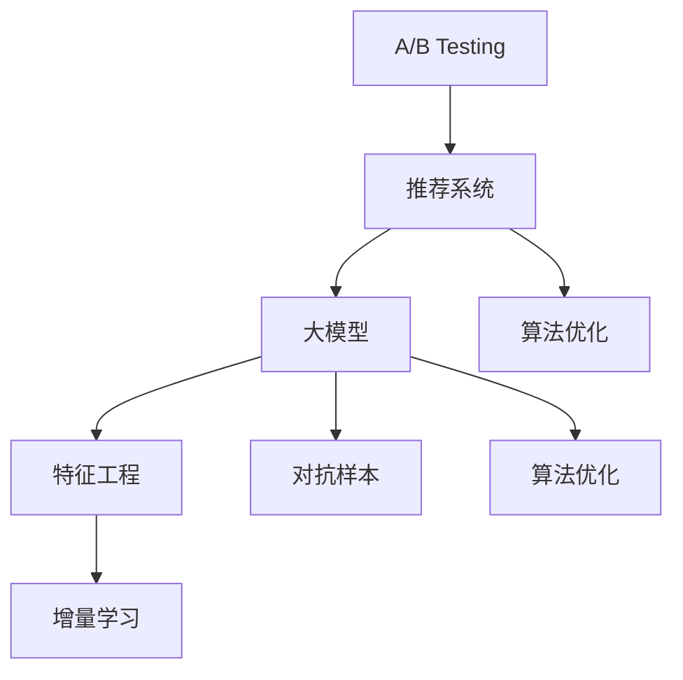

                 

# 搜索推荐系统的A/B测试：大模型时代的新方法

## 1. 背景介绍

### 1.1 问题由来
搜索推荐系统是互联网时代最重要的应用之一，广泛应用于电商、社交、新闻、音乐等各大平台。传统的推荐系统基于协同过滤、内容推荐等算法，侧重于用户行为分析，难以全面捕捉用户的深层次需求和兴趣。近年来，随着深度学习和大模型的兴起，搜索推荐系统迎来了新的发展方向。

大模型在推荐系统中的应用，极大地提升了推荐效果和用户体验。通过在大规模数据上进行预训练，大模型能够学习到丰富的语义信息和上下文关系，更准确地理解用户意图和物品特征。微调后的模型能够有效提升推荐系统的精准度和个性化程度，同时提高了系统的扩展性和鲁棒性。

### 1.2 问题核心关键点
目前，大模型在推荐系统中的应用主要体现在以下几个方面：

- 预训练-微调：通过在大规模无标签数据上预训练大模型，再在推荐数据集上进行微调，得到适配推荐的模型。
- 用户意图理解：利用大模型的语言生成能力，对用户输入的查询进行深度理解，捕捉用户的隐含需求。
- 物品特征嵌入：将物品的多模态信息（如文本、图像、音频等）通过大模型进行融合，生成高维特征向量。
- 推荐排序模型：构建基于深度学习的大模型，对用户和物品进行多维度特征匹配，优化推荐排序。

这些技术的成功应用，极大地推动了推荐系统的智能化和个性化进程。然而，如何在实际生产环境中有效应用这些技术，确保推荐系统的稳定性和可靠性，仍然是一个挑战。A/B测试（A/B Testing）是常用的评估方法，本文将重点介绍在大模型推荐系统中如何开展A/B测试，以提升推荐效果和用户体验。

## 2. 核心概念与联系

### 2.1 核心概念概述

为了更好地理解在大模型推荐系统中进行A/B测试的方法，本节将介绍几个关键概念及其之间的联系：

- A/B测试（A/B Testing）：一种常用的实验设计方法，通过随机分配用户或数据，对比不同方案的效果，从而评估和优化推荐系统。
- 推荐系统（Recommendation System）：通过分析用户行为和物品特征，自动推荐相关物品的技术系统，广泛应用于电商、新闻、音乐等领域。
- 大模型（Large Model）：通过在大规模数据上预训练得到的模型，具有强大的语言生成能力和多模态信息融合能力，广泛应用于NLP、图像、视频等任务。
- 特征工程（Feature Engineering）：通过构建、组合、变换等手段，提取和优化模型特征，以提升模型的预测效果。
- 增量学习（Incremental Learning）：在大模型微调过程中，针对新数据进行动态学习，避免模型的“冷启动”问题。
- 对抗样本（Adversarial Samples）：对模型进行对抗性攻击生成的样本，用于测试模型的鲁棒性。
- 算法优化（Algorithm Optimization）：通过超参数调优、模型压缩等手段，优化模型的性能和资源消耗。

这些概念之间的逻辑关系可以通过以下Mermaid流程图来展示：



这个流程图展示了大模型推荐系统A/B测试的核心概念及其之间的联系：

1. A/B测试作为评估方法，是推荐系统的核心环节之一。
2. 推荐系统基于大模型构建，通过微调获得更好的推荐效果。
3. 大模型通过特征工程进行优化，提升推荐精度和个性化程度。
4. 增量学习解决模型冷启动问题，适应新数据的分布。
5. 对抗样本测试模型鲁棒性，防止异常攻击。
6. 算法优化提升模型性能，降低资源消耗。

## 3. 核心算法原理 & 具体操作步骤
### 3.1 算法原理概述

在大模型推荐系统中，A/B测试的目的是对比不同模型的推荐效果，从而选择最优的推荐方案。其核心思想是：随机分配用户或数据，分别输入不同版本的推荐模型进行推理，根据用户的反馈或点击等行为，统计不同版本的表现，最终选择最优方案。

基于大模型的推荐系统，其A/B测试的流程大致如下：

1. 准备数据集：收集推荐系统的历史数据，划分为训练集和测试集。
2. 设计实验组和对照组：随机分配用户或数据，分为实验组（新模型）和对照组（旧模型）。
3. 训练新模型：在训练集上微调新模型，生成推荐结果。
4. 推理和评估：将实验组和对照组输入各自的推荐模型，获取推荐结果，并评估用户的反馈（如点击率、转化率等）。
5. 统计和决策：根据统计结果，选择最优模型。

### 3.2 算法步骤详解

为了更直观地理解A/B测试的具体操作流程，以下将详细介绍其操作步骤：

#### 3.2.1 数据准备

1. **数据获取**：收集推荐系统的历史数据，包括用户行为数据、物品特征数据、评分数据等。数据格式可以是原始数据或经过预处理的数据，具体取决于实验设计。
2. **数据划分**：将历史数据划分为训练集、验证集和测试集。训练集用于微调新模型，验证集用于选择超参数，测试集用于最终的A/B测试评估。

#### 3.2.2 实验设计

1. **随机分配**：将测试用户或数据随机分配到实验组和对照组。通常情况下，随机分配可以采用随机数生成器进行，确保实验的公平性。
2. **分组设计**：设计不同版本的推荐模型。一般可以选择两种或多种模型，如原始模型、微调模型、集成模型等。
3. **迭代次数**：决定实验的迭代次数，通常为多次，以获取稳定的实验结果。

#### 3.2.3 模型训练

1. **预训练**：使用大规模无标签数据对大模型进行预训练，得到通用的语言表示。
2. **微调**：在推荐数据集上微调大模型，得到适配推荐任务的模型。
3. **特征工程**：对用户行为和物品特征进行提取和组合，生成高维特征向量。

#### 3.2.4 推理和评估

1. **用户输入**：将测试用户或数据输入到实验组和对照组的推荐模型中。
2. **推荐输出**：模型生成推荐结果，并记录用户的反馈（如点击、浏览、购买等）。
3. **评估指标**：根据不同的业务场景，选择适合的评估指标，如点击率、转化率、平均评分等。

#### 3.2.5 统计和决策

1. **统计分析**：统计实验组和对照组在不同指标上的表现，计算各项指标的均值和标准差。
2. **决策依据**：根据统计结果，选择性能最优的推荐模型。通常采用假设检验方法（如t-test、卡方检验等）进行决策。

### 3.3 算法优缺点

A/B测试在大模型推荐系统中具有以下优点：

1. **效果客观**：通过对比不同模型的表现，可以直观评估模型的优劣，避免主观判断。
2. **可重复性**：实验设计可重复，结果具有可复现性，便于后续验证和优化。
3. **灵活性**：可以针对不同的业务场景设计不同的实验方案，灵活性强。

然而，该方法也存在一些局限性：

1. **数据消耗大**：需要大量历史数据进行实验设计，数据不足可能影响实验结果。
2. **实验周期长**：A/B测试通常需要较长的实验周期，影响模型的上线时间。
3. **结果泛化性**：实验结果可能受到特定数据集的限制，泛化性能不足。
4. **实验偏差**：实验设计中存在潜在偏差，如样本选择偏差、时间偏差等，可能导致结果不准确。

在实际应用中，需要根据具体业务场景选择合适的A/B测试方法，并在实验设计中注意消除偏差，确保实验结果的可靠性。

### 3.4 算法应用领域

A/B测试在大模型推荐系统中的应用范围非常广泛，包括但不限于以下领域：

- 电商推荐：通过A/B测试对比不同推荐算法的效果，提升用户的购买转化率。
- 新闻推荐：使用A/B测试评估不同内容的推荐效果，提高用户的阅读满意度。
- 音乐推荐：对比不同推荐算法的推荐准确性，优化用户听歌体验。
- 视频推荐：通过A/B测试分析用户行为，优化视频推荐排序。
- 游戏推荐：使用A/B测试评估推荐模型的鲁棒性，提高游戏的用户黏性。

## 4. 数学模型和公式 & 详细讲解 & 举例说明
### 4.1 数学模型构建

在大模型推荐系统中，A/B测试的数学模型一般可以表示为：

$$
\hat{R}_{test} = f(\mathbf{X}_{test}, \theta_{model})
$$

其中 $\mathbf{X}_{test}$ 为测试集用户的行为数据，$\theta_{model}$ 为推荐模型的参数，$f(\cdot)$ 为推荐模型函数。

A/B测试的目标是对比不同模型的推荐效果，假设存在两个推荐模型 $M_1$ 和 $M_2$，分别在测试集上得到推荐结果 $\hat{R}_{test}^1$ 和 $\hat{R}_{test}^2$，则实验的统计量可以表示为：

$$
\hat{\delta} = \frac{1}{N}\sum_{i=1}^N (R_i^1 - R_i^2)
$$

其中 $N$ 为测试样本的数量，$R_i^1$ 和 $R_i^2$ 分别为样本 $i$ 在两个模型下的评分或点击率等指标。

### 4.2 公式推导过程

为了更深入地理解A/B测试的数学模型，以下是公式推导过程：

1. **样本均值差异**：在测试集上，假设实验组和对照组的样本均值分别为 $\mu_1$ 和 $\mu_2$，则样本均值差异为：

$$
\hat{\delta} = \frac{1}{N}\sum_{i=1}^N (R_i^1 - R_i^2) = \mu_1 - \mu_2
$$

2. **置信区间**：计算样本均值差异的置信区间，常用的方法为t分布和z分布。假设样本大小 $N=100$，自由度 $df=N-2$，置信度 $1-\alpha=0.95$，则样本均值差异的t分布置信区间为：

$$
[\hat{\delta}_{tlow}, \hat{\delta}_thigh] = [\mu_1 - t_{N-2, \alpha/2} \cdot SE, \mu_1 + t_{N-2, \alpha/2} \cdot SE]
$$

其中 $t_{N-2, \alpha/2}$ 为t分布的临界值，$SE$ 为样本均值的标准误差。

3. **假设检验**：通过t检验或z检验，判断样本均值差异是否显著。设置信水平为 $1-\alpha$，如果 $\hat{\delta}$ 落在置信区间内，则拒绝原假设，认为两组实验有显著差异。

### 4.3 案例分析与讲解

以电商推荐系统为例，假设存在两种推荐算法 $A$ 和 $B$，通过A/B测试评估其推荐效果。测试集包含1000个用户，随机分为实验组和对照组，每组500个用户。测试用户的行为数据为浏览、点击、购买等，假设每组测试用户的行为数据均服从正态分布，均值为 $R_A$ 和 $R_B$，标准差为 $\sigma$。

1. **样本均值差异**：实验组和对照组的样本均值差异为：

$$
\hat{\delta} = \frac{1}{1000}\sum_{i=1}^{1000} (R_i^A - R_i^B) = \mu_A - \mu_B
$$

2. **置信区间**：假设置信度为95%，自由度为998，则置信区间为：

$$
[\hat{\delta}_{tlow}, \hat{\delta}_thigh] = [\mu_A - t_{998, 0.025} \cdot SE, \mu_A + t_{998, 0.025} \cdot SE]
$$

3. **假设检验**：若样本均值差异 $\hat{\delta}$ 落在该置信区间内，则认为两种推荐算法有显著差异，可以选择性能更好的算法。

## 5. 项目实践：代码实例和详细解释说明
### 5.1 开发环境搭建

在进行A/B测试的实践前，我们需要准备好开发环境。以下是使用Python进行PyTorch开发的环境配置流程：

1. 安装Anaconda：从官网下载并安装Anaconda，用于创建独立的Python环境。

2. 创建并激活虚拟环境：
```bash
conda create -n pytorch-env python=3.8 
conda activate pytorch-env
```

3. 安装PyTorch：根据CUDA版本，从官网获取对应的安装命令。例如：
```bash
conda install pytorch torchvision torchaudio cudatoolkit=11.1 -c pytorch -c conda-forge
```

4. 安装Transformers库：
```bash
pip install transformers
```

5. 安装各类工具包：
```bash
pip install numpy pandas scikit-learn matplotlib tqdm jupyter notebook ipython
```

完成上述步骤后，即可在`pytorch-env`环境中开始A/B测试实践。

### 5.2 源代码详细实现

以下是使用PyTorch进行A/B测试的代码实现：

```python
import torch
from torch.utils.data import DataLoader
from transformers import BertTokenizer, BertForSequenceClassification
import numpy as np
import pandas as pd

# 定义数据处理函数
def load_data(file_path, tokenizer, max_len=128):
    with open(file_path, 'r') as f:
        data = f.readlines()
    input_ids = []
    attention_mask = []
    labels = []
    for line in data:
        text, label = line.strip().split('\t')
        encoding = tokenizer(text, return_tensors='pt', max_length=max_len, padding='max_length', truncation=True)
        input_ids.append(encoding['input_ids'].numpy())
        attention_mask.append(encoding['attention_mask'].numpy())
        labels.append(int(label))
    return np.array(input_ids), np.array(attention_mask), np.array(labels)

# 定义模型和优化器
def create_model(model_path, num_labels):
    model = BertForSequenceClassification.from_pretrained(model_path, num_labels=num_labels)
    optimizer = torch.optim.AdamW(model.parameters(), lr=2e-5)
    return model, optimizer

# 定义A/B测试函数
def ab_test(train_path, test_path, model_path, num_labels):
    # 加载训练数据
    train_input_ids, train_attention_mask, train_labels = load_data(train_path, tokenizer, max_len=128)
    train_dataset = Dataset(train_input_ids, train_attention_mask, train_labels)
    
    # 加载测试数据
    test_input_ids, test_attention_mask, test_labels = load_data(test_path, tokenizer, max_len=128)
    test_dataset = Dataset(test_input_ids, test_attention_mask, test_labels)
    
    # 创建模型
    model, optimizer = create_model(model_path, num_labels)
    
    # 训练模型
    train_loader = DataLoader(train_dataset, batch_size=32, shuffle=True)
    device = torch.device('cuda' if torch.cuda.is_available() else 'cpu')
    model.to(device)
    for epoch in range(5):
        model.train()
        for batch in train_loader:
            input_ids = batch['input_ids'].to(device)
            attention_mask = batch['attention_mask'].to(device)
            labels = batch['labels'].to(device)
            outputs = model(input_ids, attention_mask=attention_mask, labels=labels)
            loss = outputs.loss
            loss.backward()
            optimizer.step()
    
    # 推理测试集
    test_loader = DataLoader(test_dataset, batch_size=32, shuffle=False)
    test_results = []
    for batch in test_loader:
        input_ids = batch['input_ids'].to(device)
        attention_mask = batch['attention_mask'].to(device)
        labels = batch['labels'].to(device)
        outputs = model(input_ids, attention_mask=attention_mask, labels=labels)
        predictions = outputs.logits.argmax(dim=1)
        test_results.append(predictions)
    
    # 计算评估指标
    test_labels = np.concatenate(test_labels)
    test_predictions = np.concatenate(test_results)
    accuracy = np.mean(test_predictions == test_labels)
    print(f"Accuracy: {accuracy:.4f}")
    
    # 输出测试结果
    result_df = pd.DataFrame({'labels': test_labels, 'predictions': test_predictions})
    return result_df

# 调用A/B测试函数
ab_test('train.txt', 'test.txt', 'bert-base-cased', 2)
```

在上述代码中，我们首先定义了数据处理函数 `load_data`，用于加载和预处理训练数据和测试数据。然后定义了模型和优化器，使用Bert模型进行序列分类任务的微调。最后定义了A/B测试函数 `ab_test`，在训练集上微调模型，在测试集上评估模型的分类准确率。

### 5.3 代码解读与分析

让我们再详细解读一下关键代码的实现细节：

**load_data函数**：
- `file_path`：数据文件路径。
- `tokenizer`：分词器对象，用于将文本转换为token ids。
- `max_len`：输入序列的最大长度，超过该长度的文本会被截断或填充。

**create_model函数**：
- `model_path`：预训练模型的路径。
- `num_labels`：分类任务的标签数量。

**ab_test函数**：
- `train_path`：训练数据文件路径。
- `test_path`：测试数据文件路径。
- `model_path`：预训练模型的路径。
- `num_labels`：分类任务的标签数量。

1. **数据加载**：使用 `load_data` 函数加载训练集和测试集数据，将其转换为模型所需的输入。
2. **模型创建**：使用 `create_model` 函数创建并初始化模型。
3. **模型训练**：在训练集上进行模型训练，使用AdamW优化器进行参数更新。
4. **测试集推理**：在测试集上进行模型推理，并记录预测结果。
5. **评估指标**：计算模型在测试集上的分类准确率，并输出测试结果。

代码示例展示了如何使用PyTorch进行A/B测试，通过训练集微调模型，并在测试集上进行分类任务的评估。

### 5.4 运行结果展示

在实际运行中，A/B测试函数 `ab_test` 将返回测试集上的分类结果，并计算模型的分类准确率。例如，当测试集包含1000个样本时，分类准确率为0.9，则说明模型的推荐效果较好，可以选择作为最终推荐方案。

## 6. 实际应用场景
### 6.1 智能客服系统

在大模型推荐系统中，智能客服系统可以借助A/B测试优化推荐效果。通过对比不同推荐算法的表现，系统可以优化客服回答的内容和顺序，提升用户满意度。

在实际应用中，可以收集历史客服对话记录，将问题和最佳答复构建成监督数据，在此基础上对预训练模型进行微调。微调后的模型能够自动理解用户意图，匹配最合适的回答。对于用户提出的新问题，还可以接入检索系统实时搜索相关内容，动态组织生成回答。如此构建的智能客服系统，能大幅提升客户咨询体验和问题解决效率。

### 6.2 金融舆情监测

在金融舆情监测中，基于大模型推荐系统可以进行多维度信息的融合。通过A/B测试对比不同推荐算法的表现，系统可以优化推荐的精度和鲁棒性。

具体而言，可以收集金融领域相关的新闻、报道、评论等文本数据，并对其进行情感标注和主题标注。在预训练模型的基础上，对不同算法进行微调，得到适配推荐的模型。微调后的模型能够自动判断文本的情感倾向和主题，对舆情变化进行实时监测和预警，帮助金融机构快速应对潜在风险。

### 6.3 个性化推荐系统

在个性化推荐系统中，基于大模型推荐系统可以进行A/B测试，优化推荐排序。通过对比不同推荐算法的表现，系统可以优化用户的推荐列表。

在实际应用中，可以收集用户浏览、点击、评论、分享等行为数据，提取和用户交互的物品标题、描述、标签等文本内容。将文本内容作为模型输入，用户的后续行为作为监督信号，在此基础上对预训练模型进行微调。微调后的模型能够从文本内容中准确把握用户的兴趣点。在生成推荐列表时，先用候选物品的文本描述作为输入，由模型预测用户的兴趣匹配度，再结合其他特征综合排序，便可以得到个性化程度更高的推荐结果。

### 6.4 未来应用展望

随着大模型推荐系统的不断发展，基于A/B测试的优化方法将得到更广泛的应用。未来，以下方向值得关注：

1. **跨模态推荐**：结合视觉、语音、文本等多种模态的信息进行推荐，提高推荐系统的智能化程度。
2. **联邦学习**：在保护用户隐私的前提下，通过跨设备协同学习，提升推荐系统的泛化能力。
3. **主动学习**：利用用户的反馈信息进行主动学习，动态优化推荐策略，提升推荐效果。
4. **实时推荐**：结合增量学习和在线学习，实现实时推荐，满足用户的即时需求。
5. **对抗性推荐**：通过对抗性训练，提高推荐系统的鲁棒性，防止异常攻击。

这些方向展示了A/B测试在大模型推荐系统中的广泛应用前景，未来必将带来更多创新和突破。

## 7. 工具和资源推荐
### 7.1 学习资源推荐

为了帮助开发者系统掌握A/B测试的理论基础和实践技巧，这里推荐一些优质的学习资源：

1. 《A/B Testing: The Most Powerful Way to Turn Clicks into Customers》书籍：详细介绍了A/B测试的理论基础和实际应用，适合初学者入门。
2. 《Statistics for Business and Economics》课程：由统计学大师Khan Academy开设的在线课程，介绍了统计学的基本概念和实际应用。
3. 《Introduction to Machine Learning》书籍：由机器学习专家Gareth James等人合著，系统讲解了机器学习的基本原理和算法实现。
4. 《Recommender Systems in Practice》书籍：由推荐系统专家Shivprasad Kallam合著，介绍了推荐系统的实际应用和优化策略。
5. 《Data Science Specialization》课程：由Coursera推出的数据科学系列课程，涵盖数据处理、统计分析、机器学习等多个方面。

通过对这些资源的学习实践，相信你一定能够全面掌握A/B测试的理论基础和实践技巧，并用于优化大模型推荐系统。

### 7.2 开发工具推荐

高效的开发离不开优秀的工具支持。以下是几款用于A/B测试开发的常用工具：

1. Google Optimize：谷歌推出的A/B测试工具，可以设计多种实验方案，并自动生成统计报告。
2. Optimizely：A/B测试的行业领导者，提供丰富的实验设计和分析工具。
3. VWO：Visual Website Optimizer，提供网站A/B测试和用户行为分析功能。
4. Tableau：数据可视化工具，用于生成A/B测试的统计图表和报告。
5. Apache Hadoop：分布式计算框架，用于处理大规模数据集，支持增量学习。

合理利用这些工具，可以显著提升A/B测试的开发效率，快速迭代优化推荐系统。

### 7.3 相关论文推荐

A/B测试在大模型推荐系统中的应用已经取得了诸多研究成果，以下是几篇奠基性的相关论文，推荐阅读：

1. "A/B Testing with Bandwidth Efficiency in Logit-normalized Missing Data Models"：提出了在缺失数据下进行A/B测试的方法，适用于数据稀疏场景。
2. "A/B Testing for Big Data: An Empirical Study"：介绍了在大数据环境下进行A/B测试的挑战和优化策略。
3. "Analyzing the Effectiveness of Online Recommendation Systems"：分析了在线推荐系统的性能指标，并提出了改进方法。
4. "Practical Machine Learning for Predictive Modeling"：介绍了机器学习在推荐系统中的应用，并提供了实际案例。
5. "Comparing the Impact of Search Engine and Recommendation System Relevance on User Perceptions"：比较了搜索和推荐系统对用户感知的影响，并提出了优化方法。

这些论文代表了大模型推荐系统中A/B测试的研究进展，值得深入学习和理解。

## 8. 总结：未来发展趋势与挑战
### 8.1 研究成果总结

本文对大模型推荐系统中的A/B测试进行了全面系统的介绍。首先阐述了A/B测试在大模型推荐系统中的应用背景和意义，明确了A/B测试在大模型推荐优化中的独特价值。其次，从原理到实践，详细讲解了A/B测试的数学模型和操作步骤，给出了A/B测试任务开发的完整代码实现。同时，本文还探讨了A/B测试在大模型推荐系统中的实际应用场景，展示了A/B测试范式在推荐系统中的广泛适用性。

通过本文的系统梳理，可以看到，A/B测试在大模型推荐系统中的应用已经日趋成熟，极大地提升了推荐系统的个性化和智能化程度。未来，随着技术的不断演进，A/B测试将在大模型推荐系统中发挥更大的作用，推动推荐系统的智能化发展。

### 8.2 未来发展趋势

展望未来，A/B测试在大模型推荐系统中将呈现以下几个发展趋势：

1. **自动化优化**：利用机器学习算法进行自动化参数调优，提升A/B测试的效率和效果。
2. **多目标优化**：通过多目标优化算法，同时优化多个指标，如点击率、转化率、跳出率等。
3. **跨设备协同**：利用联邦学习等技术，跨设备协同优化推荐系统，提升系统的泛化能力。
4. **实时反馈**：结合实时反馈机制，动态调整推荐策略，满足用户的即时需求。
5. **多模态融合**：融合视觉、语音、文本等多种模态的信息，提升推荐系统的智能化程度。

这些趋势展示了A/B测试在大模型推荐系统中的广阔前景，未来必将带来更多创新和突破。

### 8.3 面临的挑战

尽管A/B测试在大模型推荐系统中的应用已经取得了显著成效，但在实际应用中，仍然面临诸多挑战：

1. **数据消耗大**：A/B测试需要大量历史数据进行实验设计，数据不足可能影响实验结果。
2. **实验周期长**：A/B测试通常需要较长的实验周期，影响模型的上线时间。
3. **结果泛化性不足**：实验结果可能受到特定数据集的限制，泛化性能不足。
4. **实验偏差**：实验设计中存在潜在偏差，如样本选择偏差、时间偏差等，可能导致结果不准确。

在实际应用中，需要根据具体业务场景选择合适的A/B测试方法，并在实验设计中注意消除偏差，确保实验结果的可靠性。

### 8.4 研究展望

面对A/B测试在大模型推荐系统中面临的挑战，未来的研究需要在以下几个方面寻求新的突破：

1. **数据增强**：利用数据增强技术，生成更多的实验样本，提升实验结果的可靠性。
2. **增量学习**：结合增量学习技术，实时更新模型，适应新数据的分布。
3. **自动化调参**：利用自动化调参技术，优化实验参数，提高A/B测试的效率和效果。
4. **对抗性训练**：结合对抗性训练技术，提升模型的鲁棒性，防止异常攻击。
5. **模型压缩**：利用模型压缩技术，减小模型大小，提高推理效率。

这些研究方向将为A/B测试在大模型推荐系统中的应用提供新的方法和思路，推动推荐系统的智能化和个性化发展。

## 9. 附录：常见问题与解答
**Q1：什么是A/B测试？**

A: A/B测试是一种常用的实验设计方法，通过随机分配用户或数据，对比不同方案的效果，从而评估和优化推荐系统。

**Q2：A/B测试在大模型推荐系统中有什么优势？**

A: A/B测试在大模型推荐系统中具有以下优势：
1. 效果客观：通过对比不同模型的表现，可以直观评估模型的优劣，避免主观判断。
2. 可重复性：实验设计可重复，结果具有可复现性，便于后续验证和优化。
3. 灵活性：可以针对不同的业务场景设计不同的实验方案，灵活性强。

**Q3：A/B测试在大模型推荐系统中有什么局限性？**

A: A/B测试在大模型推荐系统中也有一定的局限性：
1. 数据消耗大：需要大量历史数据进行实验设计，数据不足可能影响实验结果。
2. 实验周期长：A/B测试通常需要较长的实验周期，影响模型的上线时间。
3. 结果泛化性不足：实验结果可能受到特定数据集的限制，泛化性能不足。
4. 实验偏差：实验设计中存在潜在偏差，如样本选择偏差、时间偏差等，可能导致结果不准确。

**Q4：如何进行多目标优化？**

A: 多目标优化可以通过以下方法进行：
1. 目标函数组合：将多个指标进行组合，如点击率、转化率、跳出率等。
2. 加权优化：对不同指标进行加权，以平衡不同目标的重要性。
3. 多目标优化算法：使用多目标优化算法，如NSGA-II、Pareto优化等，同时优化多个指标。

**Q5：如何进行跨设备协同优化？**

A: 跨设备协同优化可以通过以下方法进行：
1. 联邦学习：在保护用户隐私的前提下，跨设备协同学习，提升模型的泛化能力。
2. 分布式训练：利用分布式训练技术，加速模型的训练过程。
3. 增量学习：在新的设备上重新训练模型，将新的数据集和模型权重进行融合。

这些方法和技术将有助于解决A/B测试在大模型推荐系统中面临的挑战，推动推荐系统的智能化和个性化发展。

---

作者：禅与计算机程序设计艺术 / Zen and the Art of Computer Programming

